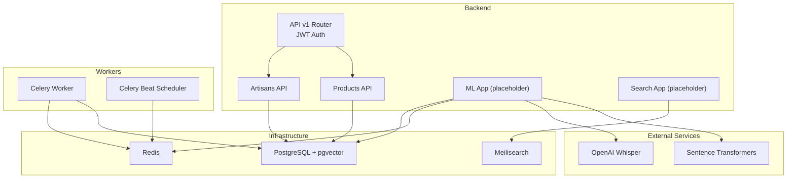
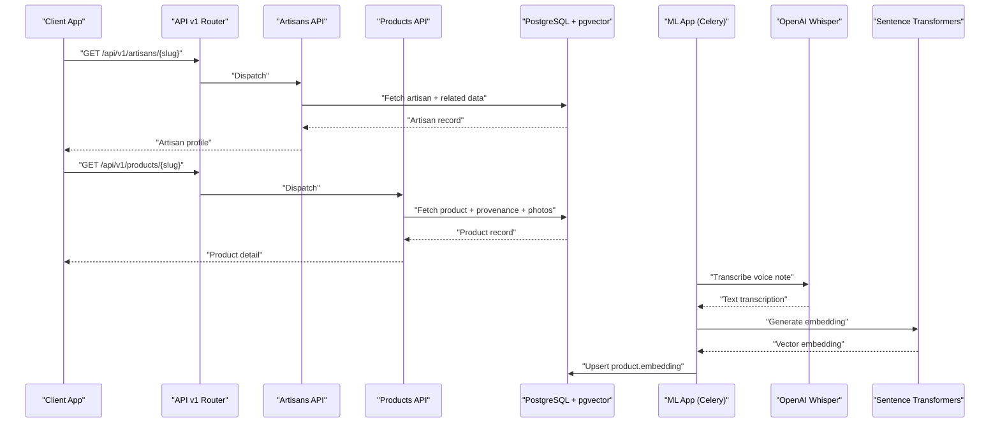
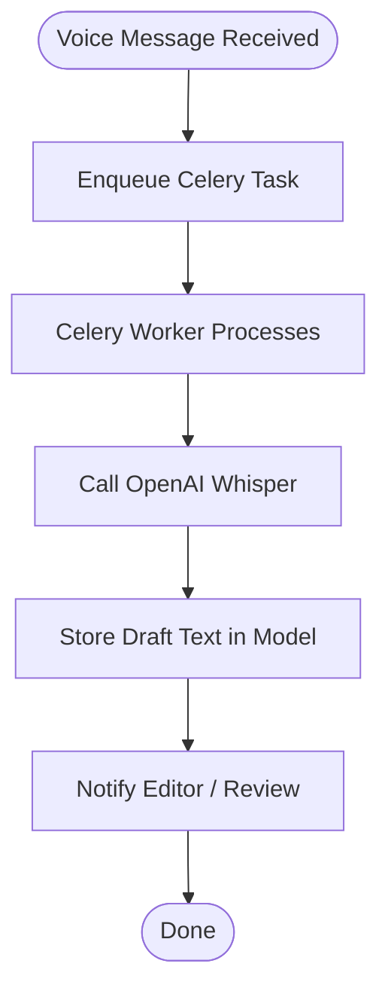
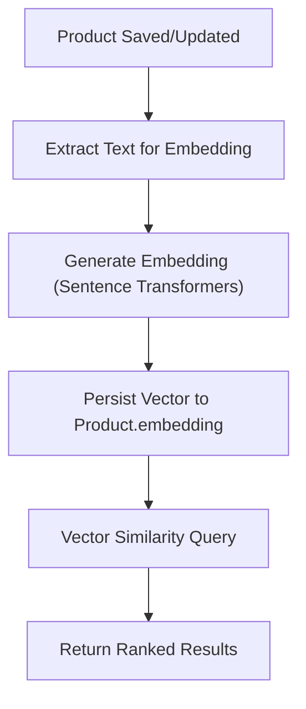
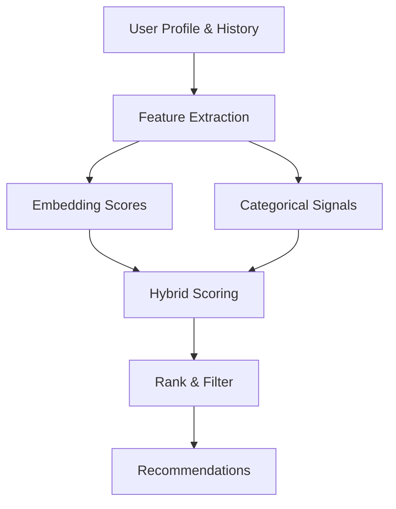
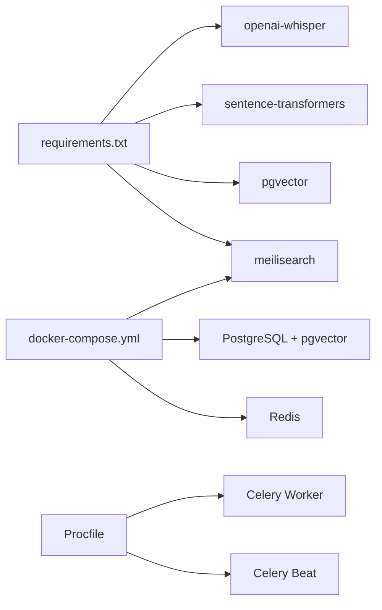

# AI & Machine Learning

<cite>
**Referenced Files in This Document**
- [requirements.txt](file://backend/requirements.txt)
- [docker-compose.yml](file://infrastructure/docker-compose.yml)
- [models.py](file://backend/apps/products/models.py)
- [models.py](file://backend/apps/artisans/models.py)
- [router.py](file://backend/api/v1/router.py)
- [artisans.py](file://backend/api/v1/artisans.py)
- [products.py](file://backend/api/v1/products.py)
- [__init__.py](file://backend/apps/ml/__init__.py)
- [__init__.py](file://backend/apps/search/__init__.py)
- [Procfile](file://backend/Procfile)
- [README.md](file://README.md)
- [MIGRATION_GUIDE.md](file://MIGRATION_GUIDE.md)
- [PROGRESS_REPORT.md](file://PROGRESS_REPORT.md)
</cite>

## Table of Contents
1. [Introduction](#introduction)
2. [Project Structure](#project-structure)
3. [Core Components](#core-components)
4. [Architecture Overview](#architecture-overview)
5. [Detailed Component Analysis](#detailed-component-analysis)
6. [Dependency Analysis](#dependency-analysis)
7. [Performance Considerations](#performance-considerations)
8. [Troubleshooting Guide](#troubleshooting-guide)
9. [Conclusion](#conclusion)
10. [Appendices](#appendices)

## Introduction
This document explains the AI and machine learning capabilities planned for the platform, with a focus on:
- OpenAI Whisper integration for voice transcription of artisan biographies and product stories
- Semantic search using pgvector embeddings
- Product recommendation workflows
- Content generation and moderation
- Machine learning pipelines for product categorization, artisan skill assessment, and personalized recommendations
- Integration with search functionality, performance optimization for vector queries, and model training workflows
- Data privacy considerations, model accuracy metrics, and continuous learning capabilities

Where applicable, this document references the current repository state and highlights implementation-ready placeholders and infrastructure components that will enable these features.

## Project Structure
The AI/ML stack is integrated into the Django backend with supporting infrastructure containers and Celery workers for asynchronous tasks. Key elements:
- Backend: Django + django-ninja API layer
- Infrastructure: PostgreSQL with pgvector, Redis, Meilisearch
- ML/Task orchestration: Celery worker and beat scheduler
- Whisper and embeddings: Sentence Transformers and OpenAI Whisper (installed but not yet implemented in code)

**Diagram sources**
- [router.py:22-28](file://backend/api/v1/router.py#L22-L28)
- [artisans.py:51-77](file://backend/api/v1/artisans.py#L51-L77)
- [products.py:73-123](file://backend/api/v1/products.py#L73-L123)
- [docker-compose.yml:4-46](file://infrastructure/docker-compose.yml#L4-L46)
- [Procfile:1-3](file://backend/Procfile#L1-L3)
- [requirements.txt:22-25](file://backend/requirements.txt#L22-L25)

**Section sources**
- [router.py:22-28](file://backend/api/v1/router.py#L22-L28)
- [docker-compose.yml:4-46](file://infrastructure/docker-compose.yml#L4-L46)
- [requirements.txt:22-25](file://backend/requirements.txt#L22-L25)
- [Procfile:1-3](file://backend/Procfile#L1-L3)

## Core Components
- Whisper voice transcription
  - Purpose: Convert voice notes into text for artisan biographies and product stories
  - Draft fields in models support storing raw transcriptions before publishing
  - Environment variable for OpenAI API key is defined in repository documentation
- pgvector embeddings
  - Product model includes a VectorField for semantic search
  - Embedding dimension aligns with Sentence Transformers model
- Semantic search
  - Meilisearch container is provisioned for search indexing
  - pgvector enables vector similarity in PostgreSQL
- Task orchestration
  - Celery worker and beat scheduler configured for background jobs
- API layer
  - Public endpoints for artisans and products; JWT bearer authentication configured

**Section sources**
- [models.py:87-95](file://backend/apps/artisans/models.py#L87-L95)
- [models.py:36-44](file://backend/apps/products/models.py#L36-L44)
- [models.py:78-79](file://backend/apps/products/models.py#L78-L79)
- [requirements.txt:23-25](file://backend/requirements.txt#L23-L25)
- [docker-compose.yml:36-46](file://infrastructure/docker-compose.yml#L36-L46)
- [Procfile:2-3](file://backend/Procfile#L2-L3)
- [README.md:143-144](file://README.md#L143-L144)
- [router.py:10-18](file://backend/api/v1/router.py#L10-L18)

## Architecture Overview
The AI/ML architecture integrates voice transcription, embeddings, and search into the existing API and data model:

**Diagram sources**
- [router.py:30-39](file://backend/api/v1/router.py#L30-L39)
- [artisans.py:51-77](file://backend/api/v1/artisans.py#L51-L77)
- [products.py:73-123](file://backend/api/v1/products.py#L73-L123)
- [models.py:78-79](file://backend/apps/products/models.py#L78-L79)
- [requirements.txt:23-25](file://backend/requirements.txt#L23-L25)
- [Procfile:2-3](file://backend/Procfile#L2-L3)

## Detailed Component Analysis

### Whisper Voice Transcription Pipeline
- Data model support
  - Artisan model includes draft bio fields for transcription
  - Product model includes draft story fields for transcription
- Execution flow
  - Telegram bot receives voice messages and triggers Celery task
  - Celery worker invokes Whisper to transcribe audio
  - Transcribed text is stored in draft fields for review
- Implementation status
  - Strategy documents indicate implementation files are ready
  - Placeholder app exists for ML; ML app is marked as “to be fully implemented”

**Diagram sources**
- [MIGRATION_GUIDE.md:181-187](file://MIGRATION_GUIDE.md#L181-L187)
- [__init__.py:1-2](file://backend/apps/ml/__init__.py#L1-L2)
- [models.py:92-95](file://backend/apps/artisans/models.py#L92-L95)
- [models.py:41-44](file://backend/apps/products/models.py#L41-L44)

**Section sources**
- [MIGRATION_GUIDE.md:181-187](file://MIGRATION_GUIDE.md#L181-L187)
- [README.md:143-144](file://README.md#L143-L144)
- [__init__.py:1-2](file://backend/apps/ml/__init__.py#L1-L2)
- [models.py:92-95](file://backend/apps/artisans/models.py#L92-L95)
- [models.py:41-44](file://backend/apps/products/models.py#L41-L44)

### Semantic Search with pgvector Embeddings
- Data model
  - Product embedding field defined as VectorField with 384 dimensions
- Training and update workflow
  - Celery task generates embeddings using Sentence Transformers
  - Embeddings persisted to PostgreSQL for similarity search
- Search integration
  - Meilisearch container provisioned for indexing
  - Vector similarity queries supported by pgvector

**Diagram sources**
- [models.py:78-79](file://backend/apps/products/models.py#L78-L79)
- [requirements.txt:24-25](file://backend/requirements.txt#L24-L25)
- [docker-compose.yml:36-46](file://infrastructure/docker-compose.yml#L36-L46)

**Section sources**
- [models.py:78-79](file://backend/apps/products/models.py#L78-L79)
- [requirements.txt:24-25](file://backend/requirements.txt#L24-L25)
- [docker-compose.yml:36-46](file://infrastructure/docker-compose.yml#L36-L46)

### Product Recommendation Algorithms
- Conceptual framework
  - Collaborative filtering: leverage order and browsing signals
  - Content-based filtering: use product embeddings and artisan attributes
  - Hybrid: combine embeddings with categorical features
- Implementation readiness
  - Placeholder apps exist for ML and Search
  - Celery worker configured for background processing

**Diagram sources**
- [__init__.py:1-2](file://backend/apps/ml/__init__.py#L1-L2)
- [__init__.py:1-2](file://backend/apps/search/__init__.py#L1-L2)
- [Procfile:2-3](file://backend/Procfile#L2-L3)

**Section sources**
- [__init__.py:1-2](file://backend/apps/ml/__init__.py#L1-L2)
- [__init__.py:1-2](file://backend/apps/search/__init__.py#L1-L2)
- [Procfile:2-3](file://backend/Procfile#L2-L3)

### Content Generation and Moderation Workflows
- Content generation
  - Use Whisper-transcribed drafts to generate structured narratives
  - Apply prompt templates to format stories and bios
- Moderation
  - Flag potentially sensitive content using keyword and category filters
  - Enforce content policies before publishing

[No sources needed since this section provides conceptual guidance]

### Machine Learning Pipelines
- Product categorization
  - Train classifiers on product descriptions and metadata
  - Integrate with Meilisearch for fast faceted search
- Artisan skill assessment
  - Build profiles from order history, ratings, and production metrics
  - Use embeddings to cluster artisans by skill and style
- Personalized recommendations
  - Use collaborative and content-based signals
  - Rerank with contextual signals (seasonality, promotions)

[No sources needed since this section provides conceptual guidance]

### Integration with Search Functionality
- Meilisearch
  - Containerized and exposed on port 7700
  - Use for indexing artisans, products, and stories
- pgvector
  - Enable vector similarity search for semantic recall
- API endpoints
  - Public endpoints for artisans and products support SSR and discovery

**Section sources**
- [docker-compose.yml:36-46](file://infrastructure/docker-compose.yml#L36-L46)
- [artisans.py:80-112](file://backend/api/v1/artisans.py#L80-L112)
- [products.py:126-190](file://backend/api/v1/products.py#L126-L190)

### Performance Optimization for Vector Queries
- Indexing
  - Ensure vector index on embedding field
  - Use appropriate distance metric (cosine)
- Caching
  - Cache frequent queries in Redis
- Batch processing
  - Batch embedding updates and search requests
- Asynchrony
  - Offload heavy work to Celery workers

**Section sources**
- [models.py:78-79](file://backend/apps/products/models.py#L78-L79)
- [Procfile:2-3](file://backend/Procfile#L2-L3)
- [docker-compose.yml:22-34](file://infrastructure/docker-compose.yml#L22-L34)

### Model Training Workflows
- Data preparation
  - Curate labeled datasets from product stories and artisan bios
- Training
  - Use Sentence Transformers for dense retrieval
  - Train classifiers for categorization and moderation
- Evaluation
  - Track accuracy, precision, recall, and embedding similarity metrics
- Continuous learning
  - Retrain on new data periodically
  - A/B test model improvements

[No sources needed since this section provides conceptual guidance]

## Dependency Analysis
The AI/ML stack depends on external libraries and infrastructure:

**Diagram sources**
- [requirements.txt:22-39](file://backend/requirements.txt#L22-L39)
- [docker-compose.yml:4-46](file://infrastructure/docker-compose.yml#L4-L46)
- [Procfile:1-3](file://backend/Procfile#L1-L3)

**Section sources**
- [requirements.txt:22-39](file://backend/requirements.txt#L22-L39)
- [docker-compose.yml:4-46](file://infrastructure/docker-compose.yml#L4-L46)
- [Procfile:1-3](file://backend/Procfile#L1-L3)

## Performance Considerations
- Embedding dimension and model choice impact latency and accuracy
- Use batching for embedding generation and vector similarity queries
- Cache hot queries in Redis and precompute embeddings for static content
- Monitor Celery worker throughput and scale horizontally as needed

[No sources needed since this section provides general guidance]

## Troubleshooting Guide
- Whisper transcription fails
  - Verify OPENAI_API_KEY environment variable is set
  - Confirm Celery worker is running and Redis connectivity
- Embedding generation errors
  - Ensure Sentence Transformers model is available
  - Check pgvector extension installation and permissions
- Search performance issues
  - Confirm Meilisearch is healthy and indexed
  - Validate vector index creation and query plans

**Section sources**
- [README.md:143-144](file://README.md#L143-L144)
- [Procfile:2-3](file://backend/Procfile#L2-L3)
- [docker-compose.yml:16-20](file://infrastructure/docker-compose.yml#L16-L20)

## Conclusion
The platform’s AI/ML foundation is established with Whisper, pgvector, Meilisearch, and Celery. While the ML and Search apps are currently placeholders, the strategy documents confirm implementation-ready files and a clear roadmap. By leveraging the existing API layer, data models, and infrastructure, the team can incrementally deliver voice transcription, semantic search, recommendations, and moderation features aligned with the platform’s mission.

[No sources needed since this section summarizes without analyzing specific files]

## Appendices
- API authentication
  - JWT bearer configured for API endpoints
- SSR integration
  - Public endpoints support Next.js Server Components for SSR
- Deployment
  - Railway configuration and Docker Compose define runtime environment

**Section sources**
- [router.py:10-18](file://backend/api/v1/router.py#L10-L18)
- [artisans.py:51-77](file://backend/api/v1/artisans.py#L51-L77)
- [products.py:73-123](file://backend/api/v1/products.py#L73-L123)
- [MIGRATION_GUIDE.md:190-221](file://MIGRATION_GUIDE.md#L190-L221)
- [PROGRESS_REPORT.md:273-291](file://PROGRESS_REPORT.md#L273-L291)