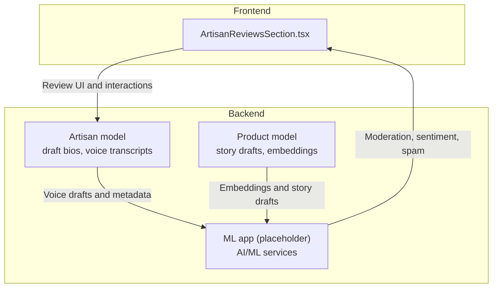
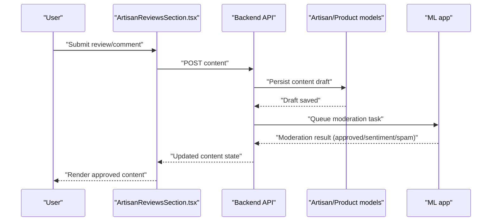
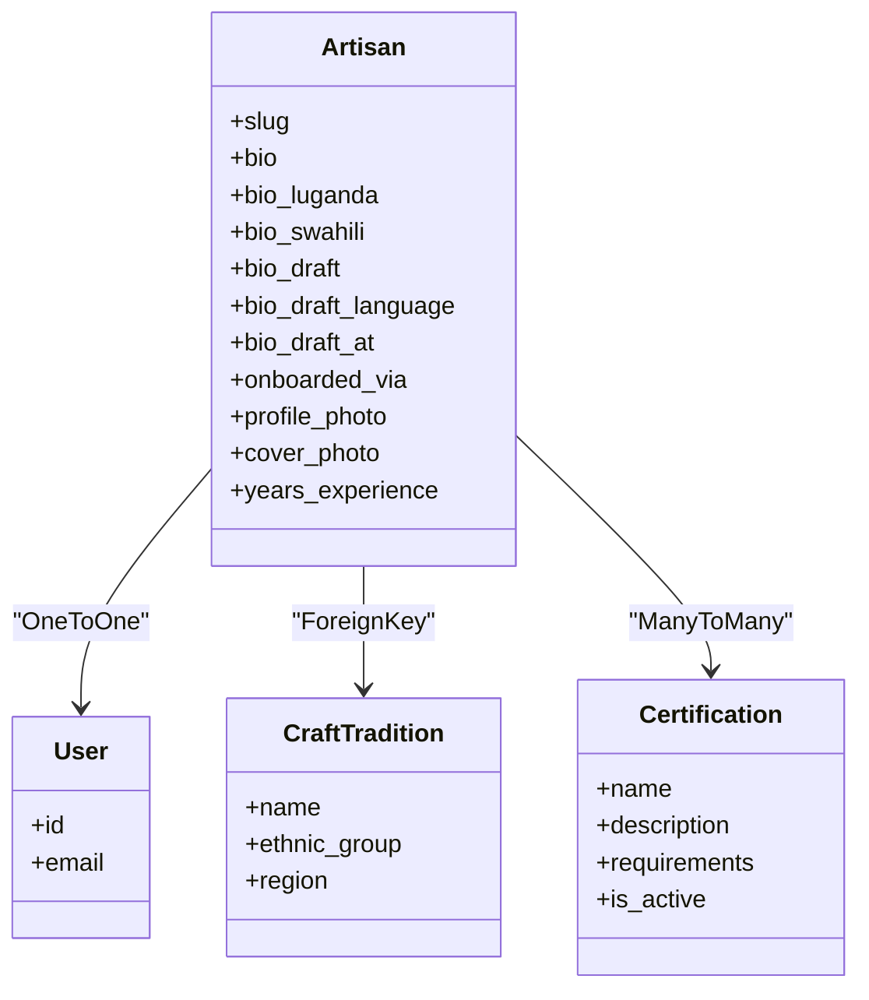
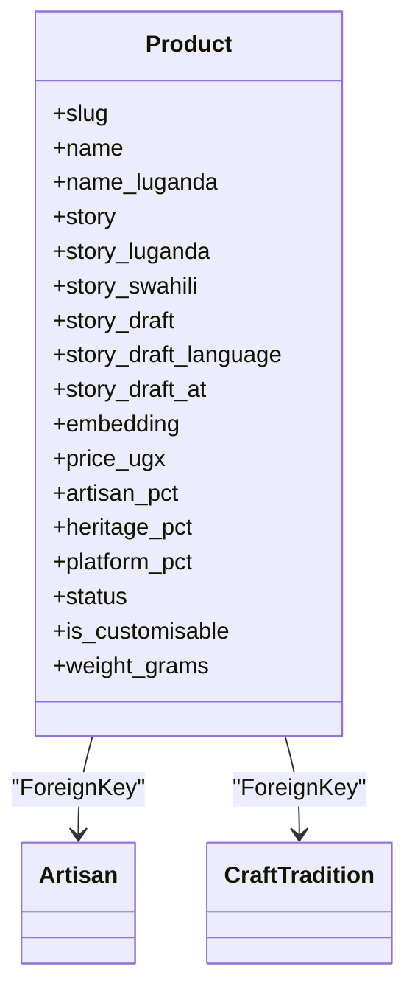
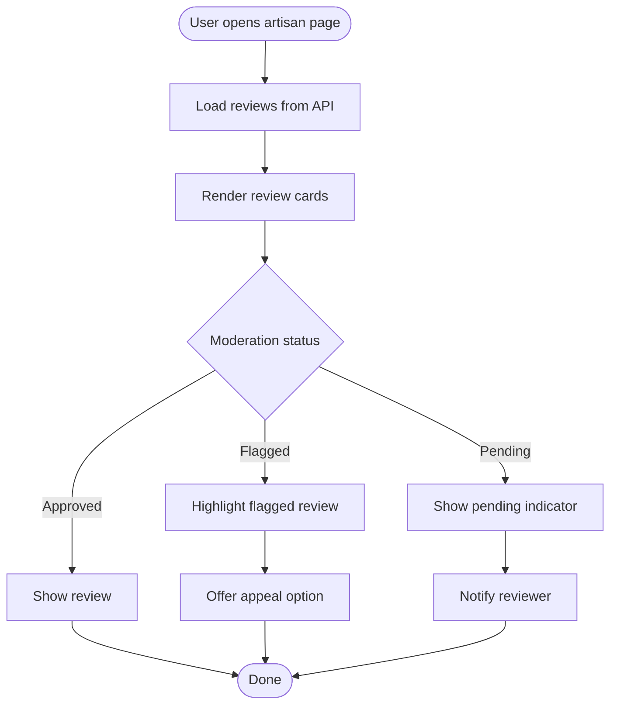
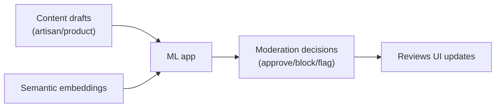
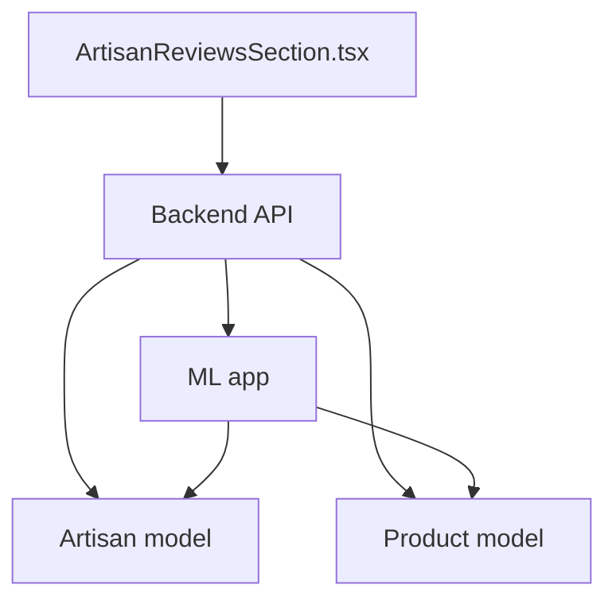

# Content Analysis & Moderation

<cite>
**Referenced Files in This Document**
- [MIGRATION_GUIDE.md](file://MIGRATION_GUIDE.md)
- [PROGRESS_REPORT.md](file://PROGRESS_REPORT.md)
- [backend/apps/artisans/models.py](file://backend/apps/artisans/models.py)
- [backend/apps/products/models.py](file://backend/apps/products/models.py)
- [backend/apps/ml/__init__.py](file://backend/apps/ml/__init__.py)
- [apps/web/src/components/reviews/ArtisanReviewsSection.tsx](file://apps/web/src/components/reviews/ArtisanReviewsSection.tsx)
</cite>

## Table of Contents
1. [Introduction](#introduction)
2. [Project Structure](#project-structure)
3. [Core Components](#core-components)
4. [Architecture Overview](#architecture-overview)
5. [Detailed Component Analysis](#detailed-component-analysis)
6. [Dependency Analysis](#dependency-analysis)
7. [Performance Considerations](#performance-considerations)
8. [Troubleshooting Guide](#troubleshooting-guide)
9. [Conclusion](#conclusion)
10. [Appendices](#appendices)

## Introduction
This document describes the planned AI-powered content analysis and moderation capabilities for Empindu’s marketplace ecosystem. It focuses on sentiment analysis for product reviews and artisan feedback, automated content moderation workflows, spam detection systems, integration with review scoring, content categorization, and automated flagging. It also outlines machine learning models for inappropriate content detection, review authenticity verification, and community guideline enforcement, along with moderation thresholds, appeal processes, manual review workflows, bias mitigation strategies, model retraining procedures, and compliance with content policy requirements.

Current implementation status indicates that the AI/ML subsystem is placeholder-ready and scheduled for implementation in upcoming sprints. The frontend includes a dedicated reviews section component, and backend models support voice transcription drafts and embeddings that will underpin future moderation and recommendation systems.

## Project Structure
The repository organizes the marketplace backend in Django with modular apps, a frontend built with React/Next.js, and a separate ML app area reserved for AI/ML services. Reviews are surfaced via a dedicated frontend component, while backend models capture product stories and artisan bios that may be subject to moderation and sentiment analysis.

**Diagram sources**
- [apps/web/src/components/reviews/ArtisanReviewsSection.tsx](file://apps/web/src/components/reviews/ArtisanReviewsSection.tsx)
- [backend/apps/artisans/models.py](file://backend/apps/artisans/models.py)
- [backend/apps/products/models.py](file://backend/apps/products/models.py)
- [backend/apps/ml/__init__.py](file://backend/apps/ml/__init__.py)

**Section sources**
- [MIGRATION_GUIDE.md](file://MIGRATION_GUIDE.md)
- [PROGRESS_REPORT.md](file://PROGRESS_REPORT.md)
- [apps/web/src/components/reviews/ArtisanReviewsSection.tsx](file://apps/web/src/components/reviews/ArtisanReviewsSection.tsx)
- [backend/apps/artisans/models.py](file://backend/apps/artisans/models.py)
- [backend/apps/products/models.py](file://backend/apps/products/models.py)
- [backend/apps/ml/__init__.py](file://backend/apps/ml/__init__.py)

## Core Components
- Artisan model: Stores identity, multilingual biographies, voice transcription drafts, and onboarding metadata. Drafts enable moderation prior to publication.
- Product model: Captures product stories, multilingual narratives, voice drafts, and semantic embeddings for search and content analysis.
- ML app: Reserved for AI/ML services including moderation, sentiment analysis, spam detection, and authenticity verification.
- Reviews UI: ArtisanReviewsSection.tsx provides the user-facing interface for reviewing and interacting with artisan content.

These components collectively enable:
- Pre-publication moderation of voice-generated content
- Sentiment-aware review scoring and categorization
- Automated flagging and spam detection
- Embedding-driven content discovery and moderation

**Section sources**
- [backend/apps/artisans/models.py](file://backend/apps/artisans/models.py)
- [backend/apps/products/models.py](file://backend/apps/products/models.py)
- [apps/web/src/components/reviews/ArtisanReviewsSection.tsx](file://apps/web/src/components/reviews/ArtisanReviewsSection.tsx)
- [backend/apps/ml/__init__.py](file://backend/apps/ml/__init__.py)

## Architecture Overview
The moderation architecture integrates frontend review UI with backend content models and an upcoming ML service layer. Voice transcripts are stored as drafts and reviewed before publication. Product and artisan stories may be embedded and analyzed for sentiment and appropriateness. Moderation decisions trigger automated flagging and manual review workflows.

**Diagram sources**
- [apps/web/src/components/reviews/ArtisanReviewsSection.tsx](file://apps/web/src/components/reviews/ArtisanReviewsSection.tsx)
- [backend/apps/artisans/models.py](file://backend/apps/artisans/models.py)
- [backend/apps/products/models.py](file://backend/apps/products/models.py)
- [backend/apps/ml/__init__.py](file://backend/apps/ml/__init__.py)

## Detailed Component Analysis

### Artisan Model: Drafts and Onboarding Metadata
- Purpose: Store multilingual biographies and voice transcription drafts for pre-publication moderation.
- Moderation relevance: Drafts enable automated checks (spam, sentiment, policy) and human review prior to publishing.
- Integration points: Links to user identity, craft tradition, and certification records.

**Diagram sources**
- [backend/apps/artisans/models.py](file://backend/apps/artisans/models.py)

**Section sources**
- [backend/apps/artisans/models.py](file://backend/apps/artisans/models.py)

### Product Model: Stories, Drafts, and Embeddings
- Purpose: Anchor product narratives with story drafts and semantic embeddings for discovery and moderation.
- Moderation relevance: Embeddings support similarity-based content analysis; story drafts undergo sentiment and policy checks.
- Integration points: Links to artisan and craft tradition; supports customisation and provenance records.

**Diagram sources**
- [backend/apps/products/models.py](file://backend/apps/products/models.py)

**Section sources**
- [backend/apps/products/models.py](file://backend/apps/products/models.py)

### Reviews UI: ArtisanReviewsSection
- Purpose: Provides the user interface for artisan reviews and feedback.
- Moderation relevance: Acts as the integration point for moderation results (approved, flagged, pending), sentiment scores, and spam indicators.

**Diagram sources**
- [apps/web/src/components/reviews/ArtisanReviewsSection.tsx](file://apps/web/src/components/reviews/ArtisanReviewsSection.tsx)

**Section sources**
- [apps/web/src/components/reviews/ArtisanReviewsSection.tsx](file://apps/web/src/components/reviews/ArtisanReviewsSection.tsx)

### ML App: AI/ML Services (Placeholder)
- Current state: Placeholder reserved for AI/ML services.
- Planned scope: Sentiment analysis, spam detection, inappropriate content classification, review authenticity verification, and community guideline enforcement.
- Integration: Receives content drafts and embeddings; returns moderation decisions and risk scores.

**Diagram sources**
- [backend/apps/ml/__init__.py](file://backend/apps/ml/__init__.py)
- [backend/apps/artisans/models.py](file://backend/apps/artisans/models.py)
- [backend/apps/products/models.py](file://backend/apps/products/models.py)

**Section sources**
- [backend/apps/ml/__init__.py](file://backend/apps/ml/__init__.py)

## Dependency Analysis
- Frontend-to-backend coupling: Reviews UI depends on backend API for content retrieval and submission; moderation outcomes feed back into UI rendering.
- Backend models: Artisan and Product models store content and metadata that ML services will analyze; embeddings enable vector-based moderation and recommendation.
- ML app: Acts as a service layer for AI/ML tasks; currently a placeholder awaiting implementation.

**Diagram sources**
- [apps/web/src/components/reviews/ArtisanReviewsSection.tsx](file://apps/web/src/components/reviews/ArtisanReviewsSection.tsx)
- [backend/apps/artisans/models.py](file://backend/apps/artisans/models.py)
- [backend/apps/products/models.py](file://backend/apps/products/models.py)
- [backend/apps/ml/__init__.py](file://backend/apps/ml/__init__.py)

**Section sources**
- [apps/web/src/components/reviews/ArtisanReviewsSection.tsx](file://apps/web/src/components/reviews/ArtisanReviewsSection.tsx)
- [backend/apps/artisans/models.py](file://backend/apps/artisans/models.py)
- [backend/apps/products/models.py](file://backend/apps/products/models.py)
- [backend/apps/ml/__init__.py](file://backend/apps/ml/__init__.py)

## Performance Considerations
- Asynchronous moderation: Offload heavy ML inference to background tasks to avoid blocking API responses.
- Embedding indexing: Use vector fields for fast similarity searches; batch embedding updates to reduce latency.
- Caching: Cache moderation decisions for repeated content to minimize redundant processing.
- Scalability: Horizontal scaling of ML workers; rate-limiting for moderation endpoints to prevent abuse.

## Troubleshooting Guide
- Draft moderation failures: Verify that voice transcripts are present and language metadata is set; ensure ML app is reachable and healthy.
- Review UI anomalies: Confirm API responses include moderation status and sentiment scores; check for stale cache entries.
- Embedding issues: Validate embedding dimensions and update pipeline; monitor Celery task logs for errors.
- Compliance checks: Log all moderation actions with timestamps and rationale for audits.

## Conclusion
Empindu’s content moderation architecture is being designed around three pillars: pre-publication moderation of voice-generated content, sentiment-aware review scoring, and automated spam/inappropriate content detection. The frontend reviews component, backend content models, and the upcoming ML app form a cohesive pipeline for scalable, policy-compliant moderation. Implementation of the ML app in upcoming sprints will unlock advanced capabilities such as authenticity verification and community guideline enforcement.

## Appendices

### Moderation Thresholds (Planned)
- Sentiment threshold: Moderate negative sentiment below a configurable score; flag for manual review above a stricter threshold.
- Spam probability: Block content with spam probability above a defined cutoff; escalate borderline cases.
- Inappropriate content: Immediate block for explicit content; contextual moderation for borderline cases.
- Authenticity confidence: Low confidence triggers additional verification steps; high confidence allows auto-approval.

### Appeal Processes (Planned)
- Appeal form: Users can submit appeals for flagged content with optional explanations.
- Escalation workflow: Appeals routed to human reviewers with moderation history and evidence.
- Outcome communication: Automated notifications for appeal decisions with reasoning.

### Manual Review Workflows (Planned)
- Flagged content queue: Curated list of items awaiting human review.
- Multi-modal review: Combine sentiment, spam, and policy signals with human judgment.
- Post-review tagging: Update content metadata and retrain moderation models with new examples.

### Bias Mitigation (Planned)
- Diverse training datasets: Include balanced samples across regions, languages, and communities.
- Regular fairness audits: Evaluate model performance across demographic groups and content types.
- Human-in-the-loop: Require human oversight for sensitive or ambiguous cases.

### Model Retraining Procedures (Planned)
- Continuous learning: Periodic retraining with newly labeled data and appeal outcomes.
- Versioning: Track model versions and rollback capability.
- Monitoring: Metrics such as precision, recall, and fairness across categories.

### Compliance with Content Policy Requirements (Planned)
- Transparent policies: Publish clear community guidelines and moderation criteria.
- Audit trails: Maintain logs of all moderation actions with timestamps and rationale.
- Right to be forgotten: Support deletion requests and content removal upon policy violations.