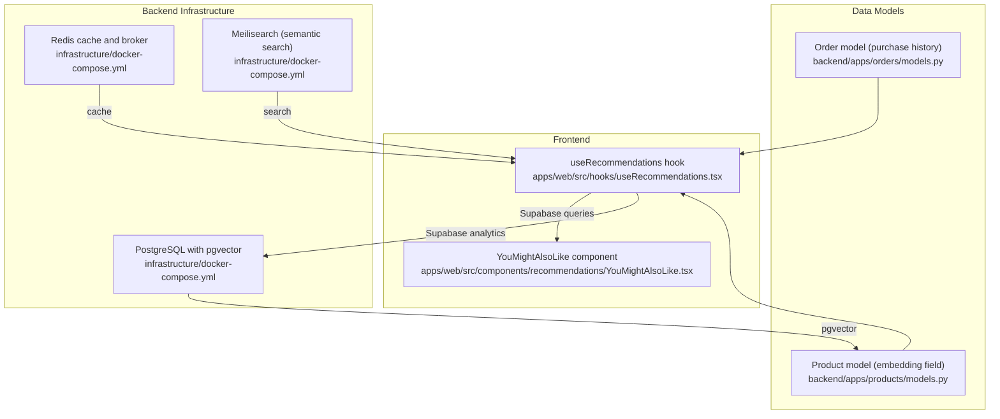
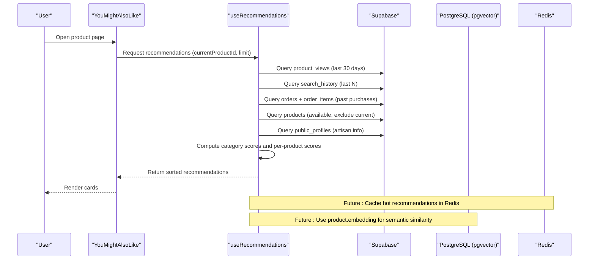
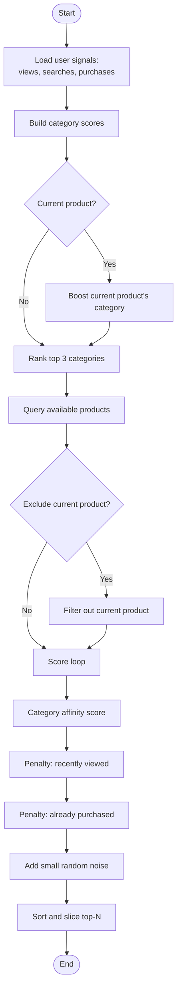
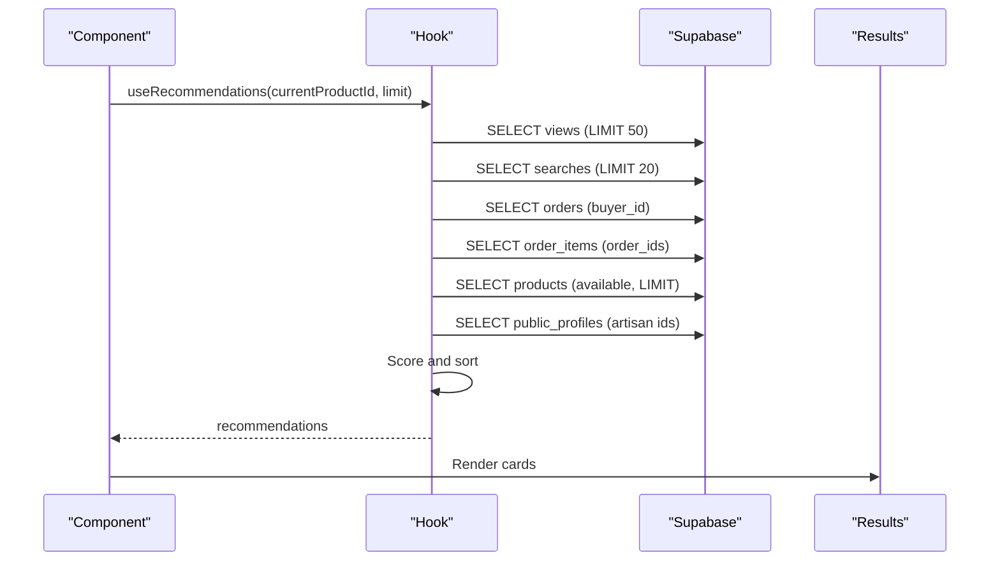
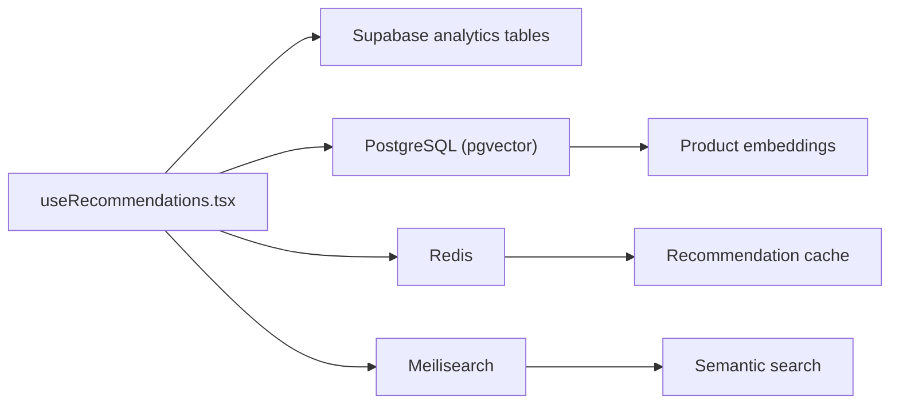

# Recommendation Engine

<cite>
**Referenced Files in This Document**
- [useRecommendations.tsx](file://apps/web/src/hooks/useRecommendations.tsx)
- [YouMightAlsoLike.tsx](file://apps/web/src/components/recommendations/YouMightAlsoLike.tsx)
- [docker-compose.yml](file://infrastructure/docker-compose.yml)
- [models.py](file://backend/apps/products/models.py)
- [models.py](file://backend/apps/orders/models.py)
- [README.md](file://README.md)
- [MIGRATION_GUIDE.md](file://MIGRATION_GUIDE.md)
</cite>

## Table of Contents
1. [Introduction](#introduction)
2. [Project Structure](#project-structure)
3. [Core Components](#core-components)
4. [Architecture Overview](#architecture-overview)
5. [Detailed Component Analysis](#detailed-component-analysis)
6. [Dependency Analysis](#dependency-analysis)
7. [Performance Considerations](#performance-considerations)
8. [Troubleshooting Guide](#troubleshooting-guide)
9. [Conclusion](#conclusion)
10. [Appendices](#appendices)

## Introduction
This document describes the AI-powered recommendation system for suggesting products to users. The current implementation focuses on a content-based recommendation approach driven by user interaction signals (product views, search queries, and purchase history). It also outlines the planned evolution toward collaborative filtering, hybrid recommendation strategies, and advanced personalization features such as real-time scoring, caching, and A/B testing.

The system integrates user interaction tracking via Supabase, performs lightweight content-based scoring on the frontend, and leverages backend infrastructure (PostgreSQL with pgvector, Redis, Meilisearch) to support future enhancements like semantic embeddings and scalable caching.

## Project Structure
The recommendation engine spans frontend React hooks and components, Supabase-backed analytics, and backend infrastructure supporting vector embeddings and search.

**Diagram sources**
- [useRecommendations.tsx:1-183](file://apps/web/src/hooks/useRecommendations.tsx#L1-L183)
- [YouMightAlsoLike.tsx:1-50](file://apps/web/src/components/recommendations/YouMightAlsoLike.tsx#L1-L50)
- [docker-compose.yml:1-51](file://infrastructure/docker-compose.yml#L1-L51)
- [models.py:1-153](file://backend/apps/products/models.py#L1-L153)
- [models.py:1-122](file://backend/apps/orders/models.py#L1-L122)

**Section sources**
- [README.md:61-111](file://README.md#L61-L111)
- [MIGRATION_GUIDE.md:150-221](file://MIGRATION_GUIDE.md#L150-L221)
- [docker-compose.yml:1-51](file://infrastructure/docker-compose.yml#L1-L51)

## Core Components
- Content-based scoring engine: The frontend hook aggregates user interaction signals (recent views, search categories, purchase history) and computes a per-product score based on category affinity, recency, and exclusivity. It also excludes previously viewed or purchased items and introduces randomness to improve diversity.
- Real-time personalization: The scoring runs client-side on each request, enabling immediate personalization without server-side latency.
- User interaction tracking: The hook records product views and search terms into Supabase tables for later enrichment and analytics.
- Recommendation UI: The component renders a grid of recommended products with smooth animations and responsive layout.

Key behaviors:
- Category scoring: Recent views, search categories, and purchase history contribute weighted scores to categories.
- Boosting: Viewing a specific product increases the score of its category.
- Diversity: Random noise is added to scores; previously viewed/purchased items are penalized.
- Exclusions: When recommending for a specific product, it is excluded from results.

**Section sources**
- [useRecommendations.tsx:11-179](file://apps/web/src/hooks/useRecommendations.tsx#L11-L179)
- [YouMightAlsoLike.tsx:12-49](file://apps/web/src/components/recommendations/YouMightAlsoLike.tsx#L12-L49)

## Architecture Overview
The recommendation pipeline combines client-side scoring with backend data and infrastructure.

**Diagram sources**
- [useRecommendations.tsx:36-179](file://apps/web/src/hooks/useRecommendations.tsx#L36-L179)
- [YouMightAlsoLike.tsx:12-49](file://apps/web/src/components/recommendations/YouMightAlsoLike.tsx#L12-L49)
- [docker-compose.yml:1-51](file://infrastructure/docker-compose.yml#L1-L51)

## Detailed Component Analysis

### Content-Based Scoring Engine
The scoring logic builds category affinity from:
- Recent product views (time-weighted)
- Search history categories (boosted)
- Purchase history categories (heavily boosted)
- Current product category (boosted when applicable)

Scoring adjustments:
- Penalize recently viewed items to avoid repetition
- Penalize already purchased items
- Add small random noise to increase diversity
- Sort and return top-N recommendations

**Diagram sources**
- [useRecommendations.tsx:44-169](file://apps/web/src/hooks/useRecommendations.tsx#L44-L169)

**Section sources**
- [useRecommendations.tsx:44-169](file://apps/web/src/hooks/useRecommendations.tsx#L44-L169)

### Real-Time Personalization Workflow
- Trigger: Component mount or prop change (current product ID or limit).
- Data sources: Supabase analytics tables for views/searches, orders/order_items for purchases, products for availability and metadata.
- Computation: Client-side aggregation and sorting.
- Output: Recommendations array passed to the UI component.

**Diagram sources**
- [useRecommendations.tsx:36-179](file://apps/web/src/hooks/useRecommendations.tsx#L36-L179)

**Section sources**
- [useRecommendations.tsx:36-179](file://apps/web/src/hooks/useRecommendations.tsx#L36-L179)

### Recommendation UI Component
- Renders a responsive grid of product cards.
- Uses animation for entrance.
- Handles loading states and empty results gracefully.

**Section sources**
- [YouMightAlsoLike.tsx:12-49](file://apps/web/src/components/recommendations/YouMightAlsoLike.tsx#L12-L49)

### Backend Data Models Supporting Recommendations
- Product model includes an embedding field intended for semantic similarity and vector search.
- Order model captures purchase history used to enrich user preferences.

**Section sources**
- [models.py:78-80](file://backend/apps/products/models.py#L78-L80)
- [models.py:42-54](file://backend/apps/orders/models.py#L42-L54)

## Dependency Analysis
The recommendation system depends on:
- Supabase for user interaction analytics and product metadata.
- PostgreSQL with pgvector for storing product embeddings.
- Redis for caching recommendations and background tasks.
- Meilisearch for semantic search capabilities.

**Diagram sources**
- [useRecommendations.tsx:1-183](file://apps/web/src/hooks/useRecommendations.tsx#L1-L183)
- [docker-compose.yml:1-51](file://infrastructure/docker-compose.yml#L1-L51)

**Section sources**
- [docker-compose.yml:1-51](file://infrastructure/docker-compose.yml#L1-L51)

## Performance Considerations
- Client-side computation reduces server load but increases client CPU usage. Keep scoring logic efficient and minimize database round-trips.
- Pagination and limits: The hook uses bounded limits for views and searches to cap query cost.
- Caching: Use Redis to cache hot recommendations per user or per product to reduce repeated recomputation.
- Vector search: Offload similarity computations to PostgreSQL/pgvector or Meilisearch to scale beyond simple scoring.
- Diversity: Random noise helps exploration; tune the magnitude to balance novelty and relevance.

[No sources needed since this section provides general guidance]

## Troubleshooting Guide
Common issues and remedies:
- Empty recommendations: Verify Supabase analytics tables have recent entries for the user and that product availability filters are not excluding all items.
- Slow loading: Reduce query limits or introduce Redis caching for frequent requests.
- Incorrect boosts: Confirm category weights and exclusions are applied consistently.
- Cold start: New users lack history; seed recommendations with popular items or category-based defaults.

**Section sources**
- [useRecommendations.tsx:170-175](file://apps/web/src/hooks/useRecommendations.tsx#L170-L175)

## Conclusion
The current recommendation system implements a practical, real-time content-based approach powered by user interaction signals. It is designed for scalability and modularity, with clear pathways to incorporate collaborative filtering, hybrid models, vector similarity, caching, and A/B testing. As the platform evolves, the backend infrastructure supports advanced personalization while the frontend remains responsive and user-focused.

[No sources needed since this section summarizes without analyzing specific files]

## Appendices

### Planned Enhancements
- Collaborative filtering: Use neighborhood-based or matrix factorization on purchase/co-occurrence matrices.
- Hybrid models: Combine content-based scores with collaborative signals and embeddings.
- Real-time personalization: Introduce streaming updates and incremental re-ranking.
- Recommendation caching: Store per-user or per-session recommendations in Redis with TTL.
- A/B testing: Feature flags to toggle recommendation algorithms and measure engagement metrics.
- Cold start: Use demographic/category priors and popularity baselines for new users/items.
- Diversity: Apply diversity-aware ranking and serendipity controls.

[No sources needed since this section provides general guidance]