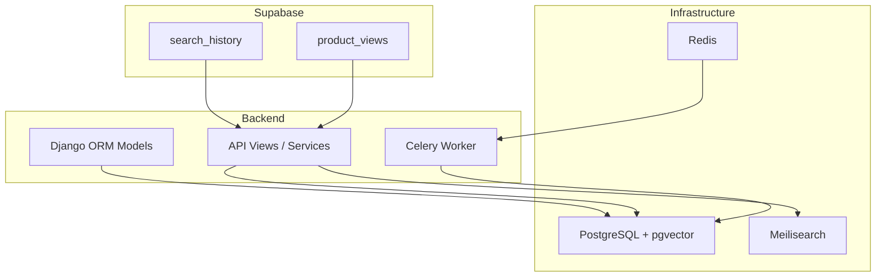
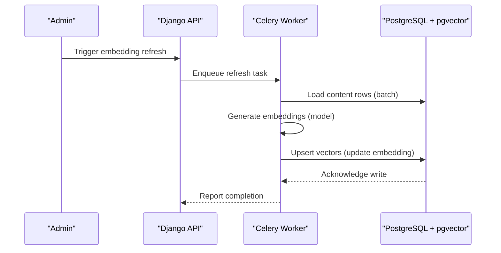
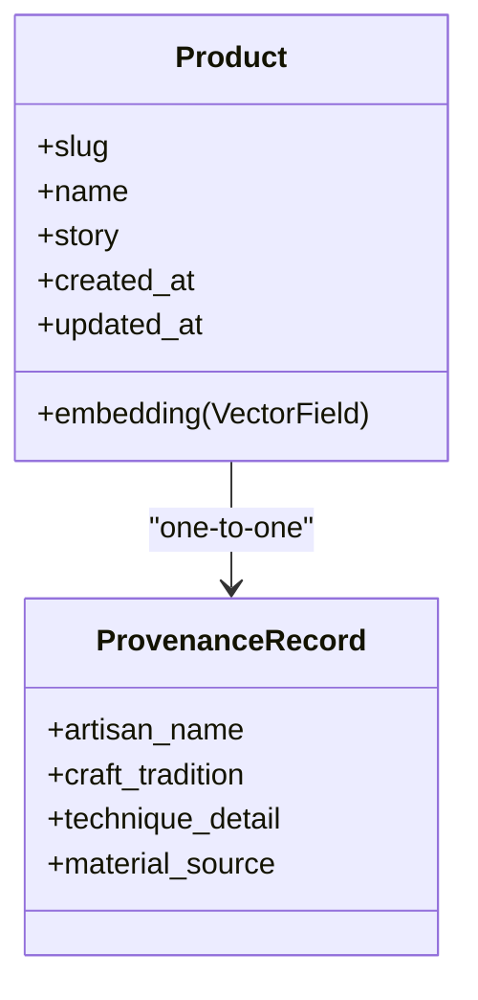
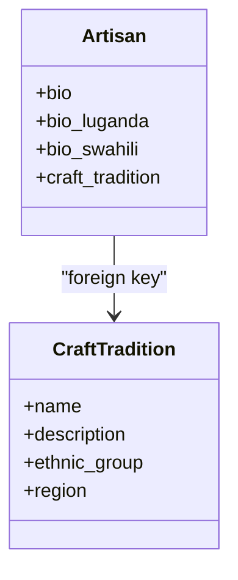
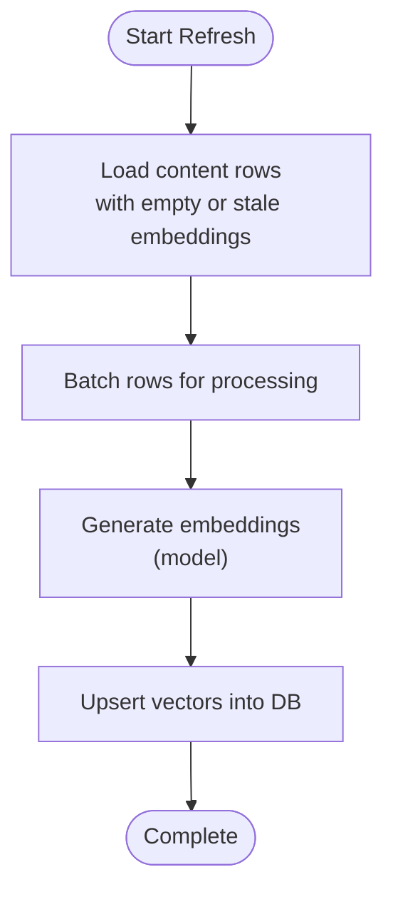
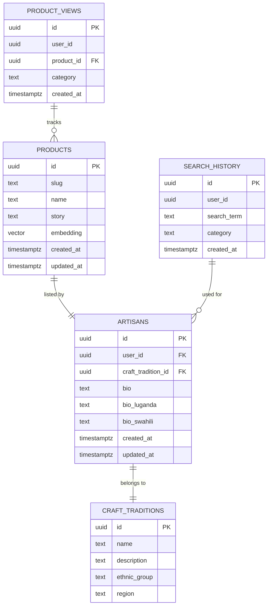
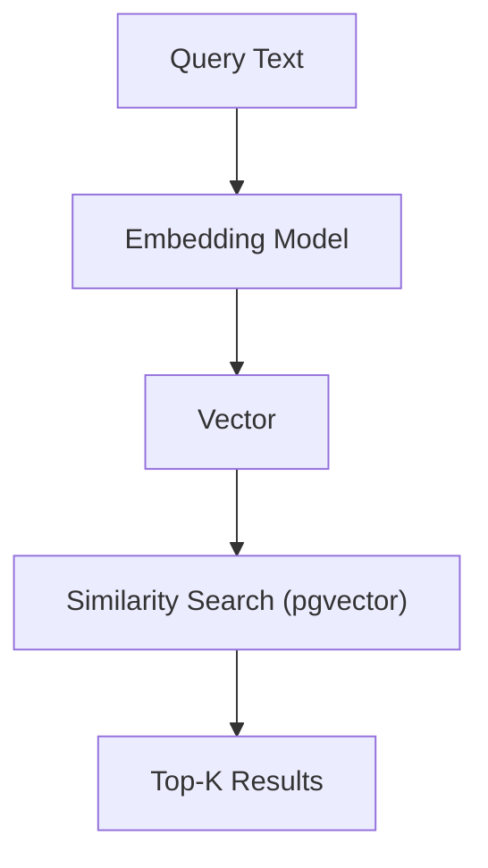
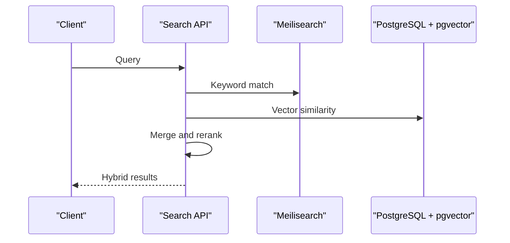
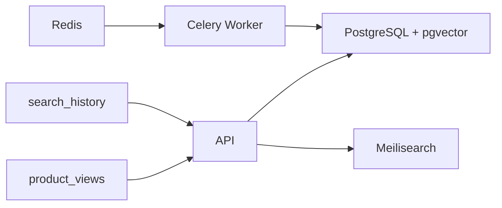

# Semantic Search & Vector Embeddings

<cite>
**Referenced Files in This Document**
- [docker-compose.yml](file://infrastructure/docker-compose.yml)
- [models.py](file://backend/apps/products/models.py)
- [models.py](file://backend/apps/artisans/models.py)
- [Procfile](file://backend/Procfile)
- [20260301183140_74b1e32e-ded4-4234-9c49-76542f291b2d.sql](file://supabase/migrations/20260301183140_74b1e32e-ded4-4234-9c49-76542f291b2d.sql)
- [20260301185835_24e7e596-6ffe-4991-964c-74e173d7213e.sql](file://supabase/migrations/20260301185835_24e7e596-6ffe-4991-964c-74e173d7213e.sql)
- [20260307151135_abb92613-d0a4-4ab6-8384-d241b138020b.sql](file://supabase/migrations/20260307151135_abb92613-d0a4-4ab6-8384-d241b138020b.sql)
- [20260312151001_0ad1fffe-4364-4902-9212-6c6e1aeb1f08.sql](file://supabase/migrations/20260312151001_0ad1fffe-4364-4902-9212-6c6e1aeb1f08.sql)
- [20260312151243_54077459-7217-4c42-a35e-67af66d898f3.sql](file://supabase/migrations/20260312151243_54077459-7217-4c42-a35e-67af66d898f3.sql)
</cite>

## Table of Contents
1. [Introduction](#introduction)
2. [Project Structure](#project-structure)
3. [Core Components](#core-components)
4. [Architecture Overview](#architecture-overview)
5. [Detailed Component Analysis](#detailed-component-analysis)
6. [Dependency Analysis](#dependency-analysis)
7. [Performance Considerations](#performance-considerations)
8. [Troubleshooting Guide](#troubleshooting-guide)
9. [Conclusion](#conclusion)
10. [Appendices](#appendices)

## Introduction
This document explains the semantic search implementation leveraging pgvector embeddings for products, artisans, and content. It covers the vector embedding generation pipeline, database schema for vector storage, embedding dimensions, similarity search algorithms, integration with PostgreSQL’s vector operations, query optimization, performance tuning, hybrid search strategies, and embedding refresh workflows. The system uses PostgreSQL with the pgvector extension and a Celery-based background task pipeline to maintain embedding consistency across content updates.

## Project Structure
The semantic search stack integrates:
- PostgreSQL with pgvector extension for vector storage and similarity operations
- Celery workers for asynchronous embedding generation and refresh tasks
- Supabase migrations defining auxiliary tables supporting search analytics and recommendations
- Django models that define vector fields and relationships

**Diagram sources**
- [docker-compose.yml:1-51](file://infrastructure/docker-compose.yml#L1-L51)
- [Procfile:1-3](file://backend/Procfile#L1-L3)
- [20260301183140_74b1e32e-ded4-4234-9c49-76542f291b2d.sql:39-62](file://supabase/migrations/20260301183140_74b1e32e-ded4-4234-9c49-76542f291b2d.sql#L39-L62)

**Section sources**
- [docker-compose.yml:1-51](file://infrastructure/docker-compose.yml#L1-L51)
- [Procfile:1-3](file://backend/Procfile#L1-L3)

## Core Components
- Vector-enabled Product model with a 384-dimensional embedding field
- Artisan and Craft Tradition models that inform semantic context
- Background task orchestration via Celery for embedding generation and refresh
- Auxiliary tables for search analytics and recommendations

Key implementation references:
- Product embedding definition and related fields
- Artisan biographical and craft context fields
- Celery worker and scheduler configuration
- Search analytics tables for recommendations

**Section sources**
- [models.py:78-80](file://backend/apps/products/models.py#L78-L80)
- [models.py:87-95](file://backend/apps/artisans/models.py#L87-L95)
- [Procfile:1-3](file://backend/Procfile#L1-L3)
- [20260301183140_74b1e32e-ded4-4234-9c49-76542f291b2d.sql:39-62](file://supabase/migrations/20260301183140_74b1e32e-ded4-4234-9c49-76542f291b2d.sql#L39-L62)

## Architecture Overview
The semantic search architecture combines:
- Data sources: Product stories, artisan bios, and craft tradition descriptions
- Embedding pipeline: Asynchronous Celery tasks compute embeddings and persist vectors
- Storage: PostgreSQL with pgvector for fast similarity search
- Analytics: Supabase tables track search queries and product views for recommendations
- Optional external engine: Meilisearch for keyword-based search and hybrid ranking

**Diagram sources**
- [Procfile:1-3](file://backend/Procfile#L1-L3)
- [models.py:78-80](file://backend/apps/products/models.py#L78-L80)

## Detailed Component Analysis

### Product Model and Vector Field
The Product model defines a vector field for semantic search. The embedding dimension is set to 384. This field is updated asynchronously by Celery tasks after content changes.

**Diagram sources**
- [models.py:10-84](file://backend/apps/products/models.py#L10-L84)
- [models.py:122-153](file://backend/apps/products/models.py#L122-L153)

**Section sources**
- [models.py:78-80](file://backend/apps/products/models.py#L78-L80)

### Artisan and Craft Tradition Context
Artisan biographical content and craft tradition metadata provide contextual signals for embedding generation. These fields support richer semantic matching.

**Diagram sources**
- [models.py:62-125](file://backend/apps/artisans/models.py#L62-L125)
- [models.py:14-41](file://backend/apps/artisans/models.py#L14-L41)

**Section sources**
- [models.py:87-95](file://backend/apps/artisans/models.py#L87-L95)
- [models.py:20-33](file://backend/apps/artisans/models.py#L20-L33)

### Embedding Generation Pipeline
Embeddings are generated asynchronously by Celery workers and persisted to the Product model’s vector field. The pipeline supports batch processing and maintains consistency during content updates.

**Diagram sources**
- [Procfile:1-3](file://backend/Procfile#L1-L3)
- [models.py:78-80](file://backend/apps/products/models.py#L78-L80)

**Section sources**
- [Procfile:1-3](file://backend/Procfile#L1-L3)

### Database Schema for Vector Storage
PostgreSQL with pgvector enables vector operations. The Product model’s embedding field is stored as a vector type with a fixed dimension. Related tables capture search behavior for recommendations.

**Diagram sources**
- [models.py:10-84](file://backend/apps/products/models.py#L10-L84)
- [models.py:62-125](file://backend/apps/artisans/models.py#L62-L125)
- [20260301183140_74b1e32e-ded4-4234-9c49-76542f291b2d.sql:39-62](file://supabase/migrations/20260301183140_74b1e32e-ded4-4234-9c49-76542f291b2d.sql#L39-L62)

**Section sources**
- [models.py:78-80](file://backend/apps/products/models.py#L78-L80)
- [20260301183140_74b1e32e-ded4-4234-9c49-76542f291b2d.sql:39-62](file://supabase/migrations/20260301183140_74b1e32e-ded4-4234-9c49-76542f291b2d.sql#L39-L62)

### Similarity Search Algorithms and PostgreSQL Integration
PostgreSQL with pgvector supports vector operations. Typical similarity metrics include cosine distance and inner product. The vector field is indexed for efficient similarity search.

[No sources needed since this diagram shows conceptual workflow, not actual code structure]

### Hybrid Search: Keyword + Vector Matching
Hybrid search combines keyword matching (e.g., Meilisearch) with vector similarity to improve precision and recall. Ranking can be weighted to balance keyword relevance and semantic similarity.

[No sources needed since this diagram shows conceptual workflow, not actual code structure]

## Dependency Analysis
The semantic search stack depends on:
- PostgreSQL with pgvector for vector storage and similarity
- Celery for asynchronous embedding generation and refresh
- Redis as the Celery broker
- Meilisearch for optional keyword-based search
- Supabase tables for analytics and recommendations

**Diagram sources**
- [docker-compose.yml:1-51](file://infrastructure/docker-compose.yml#L1-L51)
- [Procfile:1-3](file://backend/Procfile#L1-L3)
- [20260301183140_74b1e32e-ded4-4234-9c49-76542f291b2d.sql:39-62](file://supabase/migrations/20260301183140_74b1e32e-ded4-4234-9c49-76542f291b2d.sql#L39-L62)

**Section sources**
- [docker-compose.yml:1-51](file://infrastructure/docker-compose.yml#L1-L51)
- [Procfile:1-3](file://backend/Procfile#L1-L3)

## Performance Considerations
- Vector dimension: 384-dimensional embeddings balance accuracy and memory footprint
- Indexing: Ensure vector indexes are configured for efficient similarity search
- Batch processing: Process embeddings in batches to reduce overhead and leverage GPU/CPU resources
- Concurrency: Tune Celery concurrency to match CPU/GPU capacity
- Caching: Use Redis for caching frequent queries and intermediate results
- Query optimization: Combine keyword and vector search judiciously; cache top-k results for popular terms
- Refresh cadence: Schedule periodic embedding refreshes to keep semantics aligned with content updates

[No sources needed since this section provides general guidance]

## Troubleshooting Guide
Common issues and resolutions:
- Missing pgvector extension: Verify the PostgreSQL service uses the pgvector image and extension is enabled
- Celery task failures: Confirm Redis connectivity and Celery worker logs; ensure task queue is healthy
- Empty or stale embeddings: Validate embedding generation tasks and retry failed batches
- Slow similarity queries: Review vector index configuration and consider reducing dimensionality or adding filters
- Hybrid search latency: Precompute and cache top-k vectors for high-frequency queries

**Section sources**
- [docker-compose.yml:4-20](file://infrastructure/docker-compose.yml#L4-L20)
- [Procfile:1-3](file://backend/Procfile#L1-L3)

## Conclusion
The semantic search implementation leverages PostgreSQL with pgvector for scalable vector storage and similarity search, complemented by Celery-driven embedding generation and refresh workflows. Supabase tables support analytics and recommendations, while optional integration with Meilisearch enables hybrid search strategies. Proper indexing, batching, and refresh scheduling ensure consistent and performant semantic search across products, artisans, and content.

## Appendices

### Appendix A: Infrastructure and Environment
- PostgreSQL with pgvector image and credentials
- Redis for Celery broker and cache
- Meilisearch for keyword search (optional)

**Section sources**
- [docker-compose.yml:1-51](file://infrastructure/docker-compose.yml#L1-L51)

### Appendix B: Embedding Dimensions and Refresh Workflows
- Embedding dimension: 384
- Refresh workflow: Asynchronous Celery tasks, batch processing, and upserts

**Section sources**
- [models.py:78-80](file://backend/apps/products/models.py#L78-L80)
- [Procfile:1-3](file://backend/Procfile#L1-L3)

### Appendix C: Search Analytics and Recommendations
- search_history: Tracks user search terms for recommendation systems
- product_views: Anonymous product view tracking for engagement signals

**Section sources**
- [20260301183140_74b1e32e-ded4-4234-9c49-76542f291b2d.sql:39-62](file://supabase/migrations/20260301183140_74b1e32e-ded4-4234-9c49-76542f291b2d.sql#L39-L62)