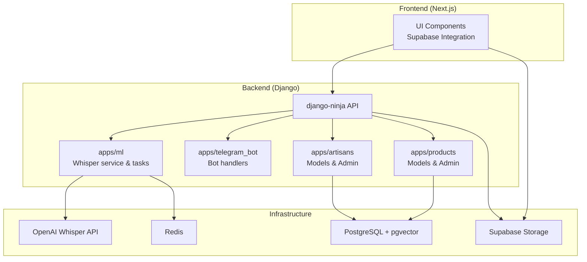
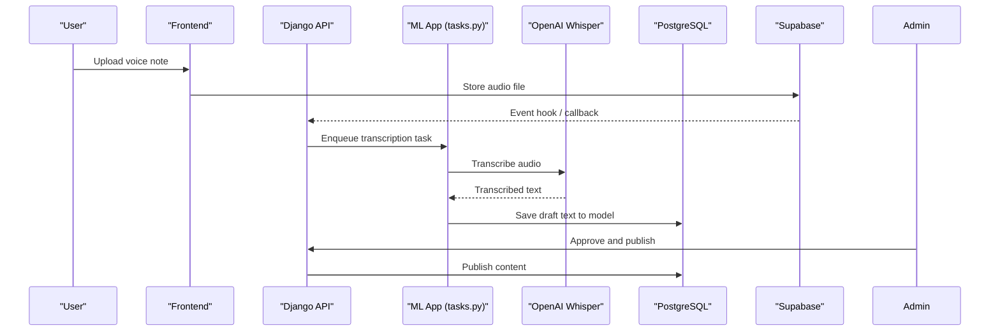
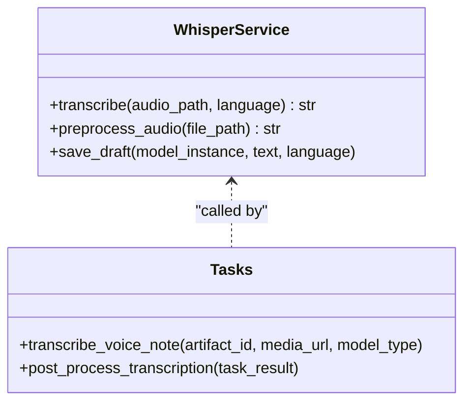
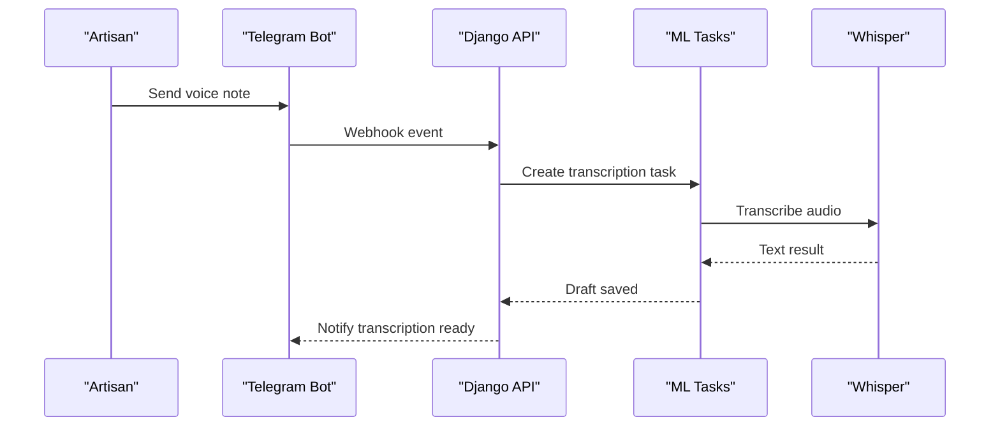
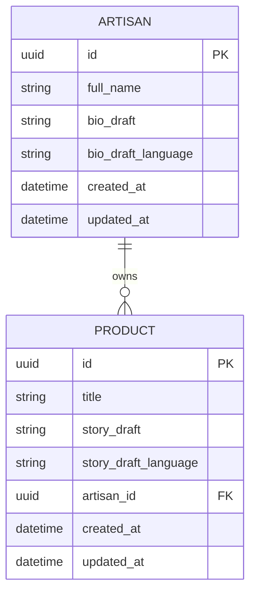
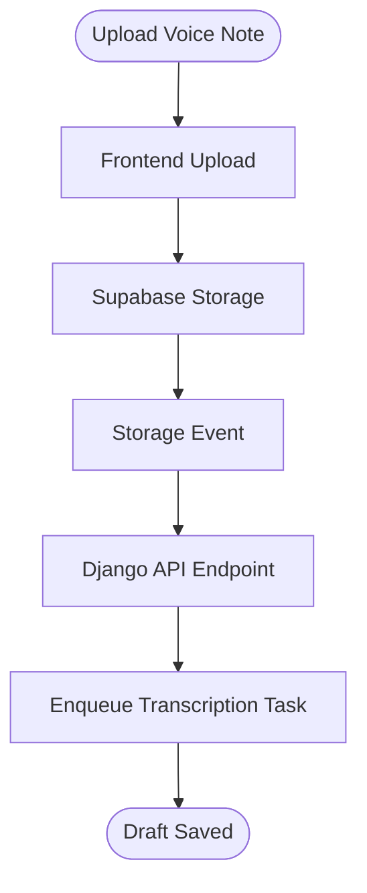
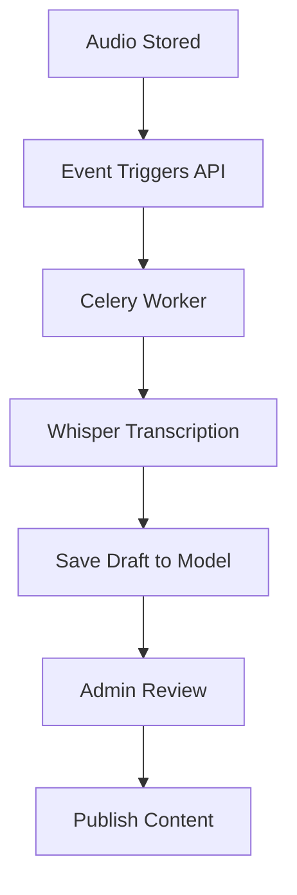
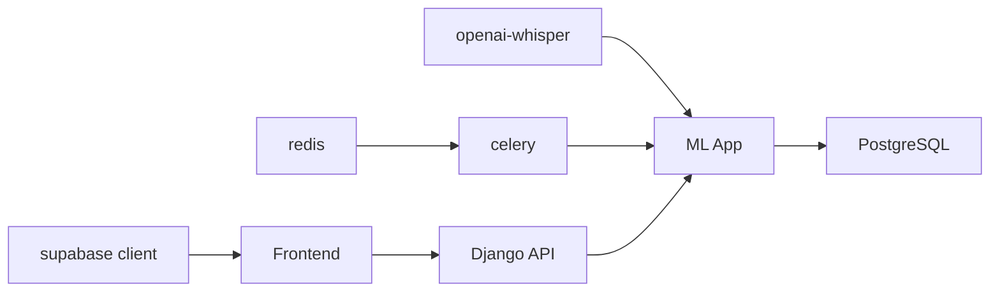

# Voice Transcription & Audio Processing

<cite>
**Referenced Files in This Document**
- [README.md](file://README.md)
- [MIGRATION_GUIDE.md](file://MIGRATION_GUIDE.md)
- [PROGRESS_REPORT.md](file://PROGRESS_REPORT.md)
- [requirements.txt](file://backend/requirements.txt)
- [models.py](file://backend/apps/artisans/models.py)
- [admin.py](file://backend/apps/artisans/admin.py)
- [models.py](file://backend/apps/products/models.py)
- [admin.py](file://backend/apps/products/admin.py)
- [bot.py](file://backend/apps/telegram_bot/bot.py)
- [whisper_service.py](file://backend/apps/ml/whisper_service.py)
- [tasks.py](file://backend/apps/ml/tasks.py)
- [client.ts](file://src/integrations/supabase/client.ts)
- [types.ts](file://src/integrations/supabase/types.ts)
</cite>

## Table of Contents
1. [Introduction](#introduction)
2. [Project Structure](#project-structure)
3. [Core Components](#core-components)
4. [Architecture Overview](#architecture-overview)
5. [Detailed Component Analysis](#detailed-component-analysis)
6. [Dependency Analysis](#dependency-analysis)
7. [Performance Considerations](#performance-considerations)
8. [Troubleshooting Guide](#troubleshooting-guide)
9. [Privacy and Compliance](#privacy-and-compliance)
10. [Conclusion](#conclusion)

## Introduction
This document describes the voice transcription system for Empindu’s artisan marketplace, focusing on the audio processing pipeline, serverless-style workflows, multilingual support, and integration with Supabase storage. The system leverages OpenAI Whisper for accurate transcription of artisan biographies, product descriptions, and customer reviews. It is designed to operate within a Django backend with asynchronous task processing, while the frontend integrates with Supabase for media storage and retrieval.

Key capabilities:
- Voice note transcription for artisan profiles and product stories
- Multilingual transcription support
- Asynchronous processing via Celery and Redis
- Storage and retrieval of audio/media assets via Supabase
- Admin and product management interfaces for transcription workflows

## Project Structure
The voice transcription system spans backend Django applications, frontend integration, and infrastructure services. The backend includes dedicated apps for ML processing and Telegram bot integration, while the frontend integrates with Supabase for media handling.

**Diagram sources**
- [README.md:3-15](file://README.md#L3-L15)
- [requirements.txt:22-31](file://backend/requirements.txt#L22-L31)
- [MIGRATION_GUIDE.md:181-187](file://MIGRATION_GUIDE.md#L181-L187)

**Section sources**
- [README.md:3-15](file://README.md#L3-L15)
- [MIGRATION_GUIDE.md:181-187](file://MIGRATION_GUIDE.md#L181-L187)

## Core Components
- OpenAI Whisper integration for transcription of voice notes into text
- Django apps for ML processing and Telegram bot handling
- Artisan and product models with draft fields for transcription content
- Supabase integration for secure audio storage and retrieval
- Asynchronous task processing via Celery and Redis

These components work together to enable voice-onboarding for artisans and voice-enhanced product storytelling.

**Section sources**
- [README.md:10-11](file://README.md#L10-L11)
- [requirements.txt:22-31](file://backend/requirements.txt#L22-L31)
- [PROGRESS_REPORT.md:127-133](file://PROGRESS_REPORT.md#L127-L133)

## Architecture Overview
The voice transcription architecture follows a serverless-friendly pattern within a traditional Django backend:
- Frontend uploads audio to Supabase
- Backend receives events and triggers transcription tasks
- Whisper processes audio and writes results to model draft fields
- Admin approves and publishes content

**Diagram sources**
- [MIGRATION_GUIDE.md:181-187](file://MIGRATION_GUIDE.md#L181-L187)
- [PROGRESS_REPORT.md:127-133](file://PROGRESS_REPORT.md#L127-L133)

## Detailed Component Analysis

### OpenAI Whisper Integration
- Purpose: Transcribe artisan voice notes into structured text drafts
- Integration: Implemented via a dedicated ML app with Celery tasks
- Supported languages: Multilingual transcription enabled by Whisper
- Quality optimization: Preprocessing steps to improve accuracy

**Diagram sources**
- [whisper_service.py](file://backend/apps/ml/whisper_service.py)
- [tasks.py](file://backend/apps/ml/tasks.py)

**Section sources**
- [README.md:10-11](file://README.md#L10-L11)
- [requirements.txt:22-24](file://backend/requirements.txt#L22-L24)
- [PROGRESS_REPORT.md:127-133](file://PROGRESS_REPORT.md#L127-L133)

### Telegram Bot Integration
- Purpose: Receive voice messages from artisans and trigger transcription workflows
- Implementation: Webhook-based bot handlers integrated into the backend
- Workflow: Voice message -> download -> enqueue task -> publish draft

**Diagram sources**
- [MIGRATION_GUIDE.md:181-187](file://MIGRATION_GUIDE.md#L181-L187)
- [bot.py](file://backend/apps/telegram_bot/bot.py)

**Section sources**
- [README.md:9-10](file://README.md#L9-L10)
- [MIGRATION_GUIDE.md:181-187](file://MIGRATION_GUIDE.md#L181-L187)

### Data Models and Draft Fields
- Artisan model includes draft fields for biography transcription
- Product model includes draft fields for story transcription
- Admin interface supports reviewing and publishing drafts

**Diagram sources**
- [models.py](file://backend/apps/artisans/models.py#L91)
- [models.py](file://backend/apps/products/models.py#L40)

**Section sources**
- [PROGRESS_REPORT.md:127-133](file://PROGRESS_REPORT.md#L127-L133)
- [models.py](file://backend/apps/artisans/models.py#L91)
- [models.py](file://backend/apps/products/models.py#L40)
- [admin.py](file://backend/apps/artisans/admin.py#L56)
- [admin.py](file://backend/apps/products/admin.py#L51)

### Supabase Storage Integration
- Purpose: Secure, scalable storage for audio files and media
- Frontend: Uploads audio to Supabase buckets
- Backend: Receives events and triggers transcription tasks
- Types: Strongly typed Supabase client and types for media handling

**Diagram sources**
- [client.ts](file://src/integrations/supabase/client.ts)
- [types.ts](file://src/integrations/supabase/types.ts)

**Section sources**
- [client.ts](file://src/integrations/supabase/client.ts)
- [types.ts](file://src/integrations/supabase/types.ts)

### Asynchronous Processing Pipeline
- Celery worker processes transcription tasks
- Redis serves as the message broker
- Tasks encapsulate Whisper calls and model updates

**Diagram sources**
- [requirements.txt:16-20](file://backend/requirements.txt#L16-L20)
- [tasks.py](file://backend/apps/ml/tasks.py)

**Section sources**
- [requirements.txt:16-20](file://backend/requirements.txt#L16-L20)
- [tasks.py](file://backend/apps/ml/tasks.py)

## Dependency Analysis
The voice transcription system relies on several key dependencies:
- OpenAI Whisper for transcription
- Celery and Redis for asynchronous processing
- Supabase for media storage
- Django Unfold for admin interfaces

**Diagram sources**
- [requirements.txt:22-31](file://backend/requirements.txt#L22-L31)
- [requirements.txt:16-20](file://backend/requirements.txt#L16-L20)

**Section sources**
- [requirements.txt:22-31](file://backend/requirements.txt#L22-L31)
- [requirements.txt:16-20](file://backend/requirements.txt#L16-L20)

## Performance Considerations
- Audio preprocessing: Normalize volume, remove silence, and resample to optimize Whisper accuracy
- Batch processing: Group small voice notes to reduce overhead
- Caching: Store frequently accessed transcripts to minimize repeated processing
- Asynchronous scaling: Use multiple Celery workers and Redis queues for throughput
- Storage optimization: Compress audio uploads and leverage CDN caching for media delivery

[No sources needed since this section provides general guidance]

## Troubleshooting Guide
Common issues and resolutions:
- Poor audio quality: Apply noise reduction and automatic gain normalization before transcription
- Language detection failures: Explicitly set target language in transcription requests
- Storage errors: Verify Supabase credentials and bucket permissions
- Task timeouts: Increase Celery worker timeout and monitor Redis memory usage
- Admin approval delays: Add notifications to prompt timely reviews

**Section sources**
- [PROGRESS_REPORT.md:127-133](file://PROGRESS_REPORT.md#L127-L133)

## Privacy and Compliance
- Data minimization: Only store audio files temporarily and delete after successful transcription
- Access controls: Restrict Supabase bucket access to authenticated users and approved admins
- Consent: Require explicit consent for voice-onboarding and transcription usage
- Retention policies: Define automated deletion schedules for voice data
- GDPR alignment: Provide right to erasure and data portability for user-generated audio

[No sources needed since this section provides general guidance]

## Conclusion
The voice transcription system integrates seamlessly with Empindu’s artisan marketplace, enabling zero-cost voice-onboarding and enriched storytelling. By leveraging OpenAI Whisper, asynchronous task processing, and secure Supabase storage, the platform delivers a scalable, multilingual transcription solution that respects user privacy and complies with data protection standards.

[No sources needed since this section summarizes without analyzing specific files]