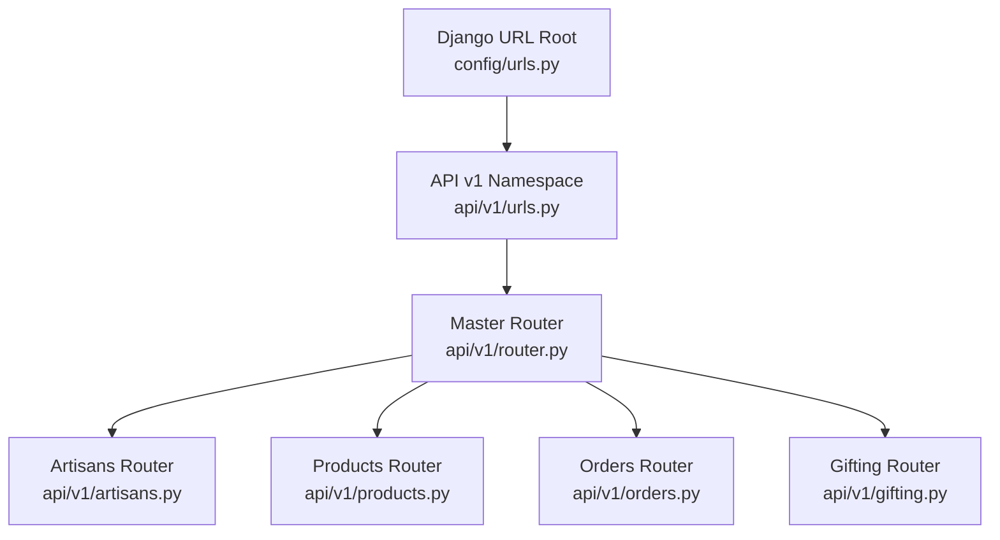
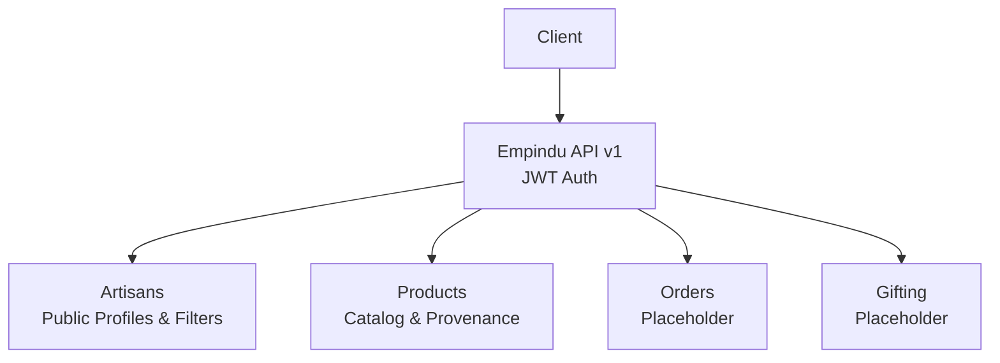
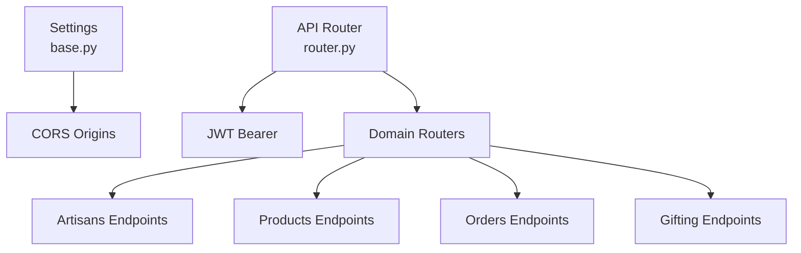

# API Reference

<cite>
**Referenced Files in This Document**
- [router.py](file://backend/api/v1/router.py)
- [urls.py](file://backend/api/v1/urls.py)
- [artisans.py](file://backend/api/v1/artisans.py)
- [products.py](file://backend/api/v1/products.py)
- [orders.py](file://backend/api/v1/orders.py)
- [gifting.py](file://backend/api/v1/gifting.py)
- [config.urls.py](file://backend/config/urls.py)
- [base.py](file://backend/config/settings/base.py)
- [models.py (Artisans)](file://backend/apps/artisans/models.py)
- [models.py (Products)](file://backend/apps/products/models.py)
- [models.py (Orders)](file://backend/apps/orders/models.py)
- [models.py (Gifting)](file://backend/apps/gifting/models.py)
</cite>

## Table of Contents
1. [Introduction](#introduction)
2. [Project Structure](#project-structure)
3. [Core Components](#core-components)
4. [Architecture Overview](#architecture-overview)
5. [Detailed Component Analysis](#detailed-component-analysis)
6. [Dependency Analysis](#dependency-analysis)
7. [Performance Considerations](#performance-considerations)
8. [Troubleshooting Guide](#troubleshooting-guide)
9. [Conclusion](#conclusion)
10. [Appendices](#appendices)

## Introduction
This document provides comprehensive API documentation for the Empindu REST endpoints. It covers HTTP methods, URL patterns, request/response schemas, authentication, pagination, filtering, and error handling for the following groups:
- Artisan management and public profiles
- Product catalog browsing and search
- Order processing workflows
- Gifting commerce

It also documents the API versioning strategy, authentication headers, rate limiting policies, and practical integration patterns.

## Project Structure
The API is organized under a single Django app with a versioned router and modular sub-routers for each domain. URLs are mounted under a version namespace.

**Diagram sources**
- [config.urls.py:1-17](file://backend/config/urls.py#L1-L17)
- [urls.py:1-9](file://backend/api/v1/urls.py#L1-L9)
- [router.py:1-40](file://backend/api/v1/router.py#L1-L40)

**Section sources**
- [config.urls.py:9-12](file://backend/config/urls.py#L9-L12)
- [urls.py:6-8](file://backend/api/v1/urls.py#L6-L8)
- [router.py:22-39](file://backend/api/v1/router.py#L22-L39)

## Core Components
- API Versioning: The API is versioned via the v1 namespace. The router exposes version metadata and registers sub-routers for each domain.
- Authentication: JWT bearer tokens are required for protected routes. Public routes are explicitly marked as unauthenticated.
- CORS: Cross-origin requests are permitted from configured origins.

Key implementation references:
- Router initialization and authentication policy
- Sub-router registration
- Public vs. protected route assignments

**Section sources**
- [router.py:10-28](file://backend/api/v1/router.py#L10-L28)
- [router.py:36-39](file://backend/api/v1/router.py#L36-L39)
- [base.py:166-173](file://backend/config/settings/base.py#L166-L173)

## Architecture Overview
The API follows a modular router pattern. Each domain exposes a dedicated router with typed schemas for request/response validation. Public endpoints are designed for server-side rendering and discovery.

**Diagram sources**
- [router.py:22-39](file://backend/api/v1/router.py#L22-L39)
- [artisans.py:10](file://backend/api/v1/artisans.py#L10)
- [products.py:11](file://backend/api/v1/products.py#L11)
- [orders.py:7](file://backend/api/v1/orders.py#L7)
- [gifting.py:7](file://backend/api/v1/gifting.py#L7)

## Detailed Component Analysis

### Authentication and Authorization
- Header: Authorization: Bearer <token>
- Policy: JWT bearer token required for protected routes; public routes explicitly set auth=None.
- CORS: Allowed origins configured in settings.

Practical notes:
- Use the Authorization header for all authenticated requests.
- Public endpoints (artisan and product catalogs) do not require authentication.

**Section sources**
- [router.py:10-18](file://backend/api/v1/router.py#L10-L18)
- [router.py:26](file://backend/api/v1/router.py#L26)
- [artisans.py:52](file://backend/api/v1/artisans.py#L52)
- [products.py:74](file://backend/api/v1/products.py#L74)
- [base.py:166-173](file://backend/config/settings/base.py#L166-L173)

### Artisans API
Public endpoints for artisan profiles and discovery.

- Base URL: /api/v1/artisans/
- Authentication: Public endpoints do not require authentication.

Endpoints
- GET /api/v1/artisans/{slug}
  - Description: Retrieve a full artisan profile for SSR pages.
  - Path parameters:
    - slug: string (required)
  - Response schema: ArtisanDetailOut
  - Filtering: none
  - Notes: Returns profile and cover photos, craft tradition, experience, and listing IDs.

- GET /api/v1/artisans
  - Description: List artisans with optional filters.
  - Query parameters:
    - craft_type: string (optional)
    - region: string (optional)
    - certified: boolean (optional)
  - Response schema: array of ArtisanBriefOut
  - Notes: Filters by craft tradition name, district, and certification status.

- GET /api/v1/artisans/traditions/list
  - Description: List all craft traditions for filtering.
  - Response schema: array of CraftTraditionOut
  - Notes: Used to populate discovery UI.

Response schemas
- ArtisanBriefOut
  - Fields: slug, full_name, community, district, craft_tradition, profile_photo_url, is_certified, years_experience
- ArtisanDetailOut
  - Fields: id, slug, full_name, bio, community, district, craft_tradition, profile_photo_url, cover_photo_url, years_experience, is_certified, order_count, total_earnings_ugx, listings
- CraftTraditionOut
  - Fields: id, name, ethnic_group, region, description, gi_status

Example request
- GET /api/v1/artisans?craft_type=basket&region=Central&certified=true

Example response (selected fields)
- 200 OK with array of ArtisanBriefOut items

**Section sources**
- [artisans.py:52-77](file://backend/api/v1/artisans.py#L52-L77)
- [artisans.py:80-112](file://backend/api/v1/artisans.py#L80-L112)
- [artisans.py:115-119](file://backend/api/v1/artisans.py#L115-L119)
- [models.py (Artisans):14-44](file://backend/apps/artisans/models.py#L14-L44)
- [models.py (Artisans):62-170](file://backend/apps/artisans/models.py#L62-L170)

### Products API
Public endpoints for product catalog browsing and search.

- Base URL: /api/v1/products/
- Authentication: Public endpoints do not require authentication.

Endpoints
- GET /api/v1/products/{slug}
  - Description: Retrieve product detail with story, artisan info, provenance, and photos.
  - Path parameters:
    - slug: string (required)
  - Response schema: ProductDetailOut
  - Notes: Includes photos and provenance snapshot.

- GET /api/v1/products
  - Description: List products with faceted filters and pagination.
  - Query parameters:
    - craft_type: string (optional)
    - region: string (optional)
    - min_usd: number (optional)
    - max_usd: number (optional)
    - occasion: string (optional)
    - artisan_slug: string (optional)
    - page: integer (default 1)
    - page_size: integer (default 24)
  - Response schema: array of ProductListOut
  - Notes: Paginates results; returns truncated story for list view.

Response schemas
- ProductListOut
  - Fields: id, slug, name, story, price_ugx, price_usd, artisan_earnings_ugx, stock, artisan, hero_photo_url
- ProductDetailOut
  - Fields: id, slug, name, story, material, technique, days_to_make, price_ugx, price_usd, artisan_earnings_ugx, heritage_fund_ugx, stock, is_customisable, artisan, provenance, photos
- ProvenanceOut
  - Fields: artisan_name, community, district, craft_tradition, ethnic_group, technique_detail, material_source, gi_status
- ProductPhotoOut
  - Fields: url, caption, is_hero

Example request
- GET /api/v1/products?min_usd=10&max_usd=100&page=1&page_size=24

Example response (selected fields)
- 200 OK with array of ProductListOut items

**Section sources**
- [products.py:74-123](file://backend/api/v1/products.py#L74-L123)
- [products.py:126-190](file://backend/api/v1/products.py#L126-L190)
- [models.py (Products):10-153](file://backend/apps/products/models.py#L10-L153)

### Orders API
Placeholder endpoints indicating upcoming order processing functionality.

- Base URL: /api/v1/orders/
- Authentication: Protected by JWT bearer.

Endpoints
- GET /api/v1/orders/
  - Description: Placeholder message indicating future implementation.
  - Response: JSON message

- POST /api/v1/orders/create
  - Description: Placeholder message indicating future implementation.
  - Response: JSON message

Notes
- These endpoints are placeholders and will be implemented in upcoming sprints.

**Section sources**
- [orders.py:10-17](file://backend/api/v1/orders.py#L10-L17)

### Gifting API
Placeholder endpoints indicating upcoming gifting commerce functionality.

- Base URL: /api/v1/gifting/
- Authentication: Public.

Endpoints
- GET /api/v1/gifting/
  - Description: Placeholder message indicating future implementation.
  - Response: JSON message

Notes
- These endpoints are placeholders and will be implemented in upcoming sprints.

**Section sources**
- [gifting.py:10-12](file://backend/api/v1/gifting.py#L10-L12)

## Dependency Analysis
The API depends on Django and Ninja for routing and schema validation. Authentication is enforced centrally via a custom JWT bearer class. CORS is configured globally.

**Diagram sources**
- [base.py:166-173](file://backend/config/settings/base.py#L166-L173)
- [router.py:10-18](file://backend/api/v1/router.py#L10-L18)
- [router.py:36-39](file://backend/api/v1/router.py#L36-L39)

**Section sources**
- [base.py:166-173](file://backend/config/settings/base.py#L166-L173)
- [router.py:10-18](file://backend/api/v1/router.py#L10-L18)
- [router.py:36-39](file://backend/api/v1/router.py#L36-L39)

## Performance Considerations
- Pagination: Product listing supports pagination via page and page_size parameters. Tune page_size based on client needs.
- Select-related prefetching: Product and artisan endpoints use select_related and prefetch_related to reduce queries.
- Filtering: Use targeted filters (e.g., craft_type, region, artisan_slug) to minimize result sets.
- Image handling: Photos are served via Cloudinary storage; ensure CDN caching is configured appropriately.

[No sources needed since this section provides general guidance]

## Troubleshooting Guide
Common issues and resolutions:
- 401 Unauthorized: Ensure Authorization: Bearer <token> is present for protected routes.
- 403 Forbidden: Verify token validity and permissions.
- 404 Not Found: Confirm correct URL pattern and resource existence (e.g., artisan or product slug).
- CORS errors: Confirm origin is included in CORS_ALLOWED_ORIGINS.

**Section sources**
- [base.py:166-173](file://backend/config/settings/base.py#L166-L173)
- [router.py:10-18](file://backend/api/v1/router.py#L10-L18)

## Conclusion
Empindu’s API v1 provides a structured, versioned interface for artisan profiles, product catalog, and upcoming order and gifting workflows. Public endpoints are optimized for discovery and SSR, while protected endpoints enforce JWT-based authentication. As placeholder endpoints are implemented, expect expanded functionality for commerce operations.

[No sources needed since this section summarizes without analyzing specific files]

## Appendices

### API Versioning Strategy
- Versioning: URL namespace /api/v1/
- Router metadata: Title, version, and description exposed by the router.

**Section sources**
- [router.py:22-28](file://backend/api/v1/router.py#L22-L28)
- [config.urls.py:11](file://backend/config/urls.py#L11)

### Rate Limiting Policies
- No explicit rate limiting is configured in the current codebase.
- Recommendation: Introduce rate limiting at the gateway or middleware level as traffic grows.

[No sources needed since this section provides general guidance]

### Request/Response Schemas Summary
- Artisans
  - ArtisanBriefOut: brief profile fields
  - ArtisanDetailOut: detailed profile fields
  - CraftTraditionOut: craft tradition metadata
- Products
  - ProductListOut: list view fields
  - ProductDetailOut: detail view fields
  - ProvenanceOut: provenance snapshot
  - ProductPhotoOut: photo metadata

**Section sources**
- [artisans.py:23-49](file://backend/api/v1/artisans.py#L23-L49)
- [artisans.py:14-21](file://backend/api/v1/artisans.py#L14-L21)
- [products.py:60-71](file://backend/api/v1/products.py#L60-L71)
- [products.py:41-58](file://backend/api/v1/products.py#L41-L58)
- [products.py:24-33](file://backend/api/v1/products.py#L24-L33)
- [products.py:35-39](file://backend/api/v1/products.py#L35-L39)

### Practical Examples and Integration Patterns
- Discovery flow:
  - Fetch craft traditions: GET /api/v1/artisans/traditions/list
  - Filter artisans: GET /api/v1/artisans?craft_type=...&region=...
  - View artisan profile: GET /api/v1/artisans/{slug}
- Catalog flow:
  - Browse products: GET /api/v1/products?page=&page_size=
  - Filter products: GET /api/v1/products?craft_type=...&min_usd=...&max_usd=...
  - View product detail: GET /api/v1/products/{slug}

**Section sources**
- [artisans.py:115-119](file://backend/api/v1/artisans.py#L115-L119)
- [artisans.py:80-112](file://backend/api/v1/artisans.py#L80-L112)
- [products.py:126-190](file://backend/api/v1/products.py#L126-L190)
- [products.py:74-123](file://backend/api/v1/products.py#L74-L123)