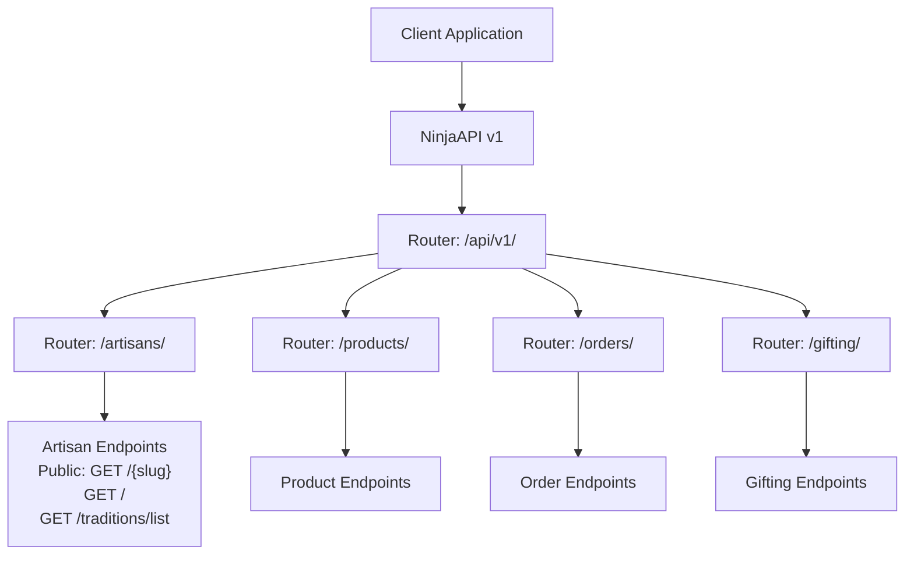
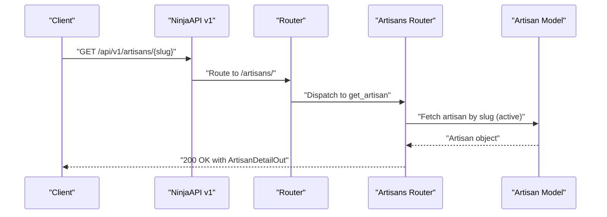
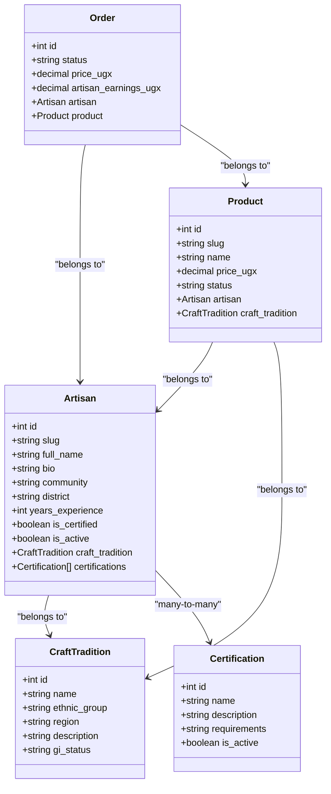

# Artisan Management Endpoints

<cite>
**Referenced Files in This Document**
- [artisans.py](file://backend/api/v1/artisans.py)
- [models.py](file://backend/apps/artisans/models.py)
- [router.py](file://backend/api/v1/router.py)
- [urls.py](file://backend/api/v1/urls.py)
- [admin.py](file://backend/apps/artisans/admin.py)
- [products.py](file://backend/apps/products/models.py)
- [orders.py](file://backend/apps/orders/models.py)
- [Auth.tsx](file://src/pages/Auth.tsx)
- [Profile.tsx](file://src/pages/Profile.tsx)
- [ArtisansManager.tsx](file://src/components/admin/ArtisansManager.tsx)
</cite>

## Table of Contents
1. [Introduction](#introduction)
2. [Project Structure](#project-structure)
3. [Core Components](#core-components)
4. [Architecture Overview](#architecture-overview)
5. [Detailed Component Analysis](#detailed-component-analysis)
6. [Dependency Analysis](#dependency-analysis)
7. [Performance Considerations](#performance-considerations)
8. [Troubleshooting Guide](#troubleshooting-guide)
9. [Conclusion](#conclusion)

## Introduction
This document provides comprehensive API documentation for artisan management endpoints. It covers CRUD operations for artisan profiles, onboarding workflows, verification processes, and profile updates. It also documents authentication requirements, request/response schemas for artisan registration, profile editing, and certification management. Endpoint patterns for artisan search, filtering by craft traditions, and geographic location-based queries are included, along with image upload endpoints, verification document submission, and status tracking. Examples for common artisan onboarding scenarios, bulk operations, and administrative management functions are provided, alongside rate limiting, validation rules, and error handling specific to artisan data.

## Project Structure
The artisan management API is implemented using Django with the Ninja framework. The API v1 router aggregates endpoints under a single namespace and applies JWT authentication globally. Artisan-related endpoints are grouped under the "/artisans/" route, while other domain APIs (products, orders, gifting) are similarly organized. The artisan domain model defines core entities such as Artisan, CraftTradition, and Certification, which inform both backend endpoints and administrative interfaces.

**Diagram sources**
- [router.py:22-40](file://backend/api/v1/router.py#L22-L40)
- [urls.py:7-9](file://backend/api/v1/urls.py#L7-L9)
- [artisans.py:10, 52, 80, 115:10-120](file://backend/api/v1/artisans.py#L10-L120)

**Section sources**
- [router.py:22-40](file://backend/api/v1/router.py#L22-L40)
- [urls.py:7-9](file://backend/api/v1/urls.py#L7-L9)

## Core Components
- Artisan model: Represents the digital identity of an artisan, linking to a User, CraftTradition, and optional Certifications. Includes biographical details, location, contact info, certification status, media assets, and experience metrics.
- CraftTradition model: Represents cultural craft traditions with attributes such as name, ethnic group, region, description, and intellectual property status.
- Certification model: Defines certification programs with requirements and activity status.
- Product model: Links products to artisans and craft traditions, enabling listing management and provenance records.
- Order model: Tracks order lifecycles and financial snapshots, aggregating artisan earnings and platform metrics.

Key properties and relationships:
- Artisan aggregates order metrics (total earnings and order count) via related Order objects.
- Product aggregates artisan earnings per unit and heritage fund contributions.
- CraftTradition informs filtering and discovery for artisans.

**Section sources**
- [models.py:14-45](file://backend/apps/artisans/models.py#L14-L45)
- [models.py:47-60](file://backend/apps/artisans/models.py#L47-L60)
- [models.py:62-170](file://backend/apps/artisans/models.py#L62-L170)
- [products.py:10-100](file://backend/apps/products/models.py#L10-L100)
- [orders.py:10-122](file://backend/apps/orders/models.py#L10-L122)

## Architecture Overview
The API enforces JWT authentication globally and exposes artisan endpoints under a dedicated router. Public endpoints allow discovery and profile retrieval without authentication. Administrative capabilities exist in the Django admin for verification and bulk operations.

**Diagram sources**
- [router.py:22-40](file://backend/api/v1/router.py#L22-L40)
- [artisans.py:52-77](file://backend/api/v1/artisans.py#L52-L77)

## Detailed Component Analysis

### Authentication and Authorization
- Global JWT authentication: The API instance applies JWTBearer authentication globally, requiring a valid JWT token for protected endpoints.
- Public endpoints: Artisan public endpoints (profile retrieval and listing) are marked as unauthenticated.
- Protected endpoints: Other routers (e.g., orders) apply JWT authentication explicitly.

Authentication flow:
- Clients obtain a JWT token via the authentication flow.
- Requests to protected endpoints must include the Authorization header with the Bearer token.

**Section sources**
- [router.py:10-18](file://backend/api/v1/router.py#L10-L18)
- [router.py:22-28](file://backend/api/v1/router.py#L22-L28)
- [router.py:38](file://backend/api/v1/router.py#L38)

### Artisan Public Endpoints

#### GET /api/v1/artisans/{slug}
- Purpose: Retrieve a full artisan profile for SSR-driven pages.
- Authentication: Not required.
- Path parameters:
  - slug: string (required)
- Response: ArtisanDetailOut
- Filters: Only active artisans are returned.

Response schema highlights:
- Identity: id, slug, full_name
- Bio and location: bio, community, district
- Craft tradition: nested CraftTraditionOut
- Media: profile_photo_url, cover_photo_url
- Stats: years_experience, is_certified, order_count, total_earnings_ugx
- Listings: active product IDs

Implementation notes:
- Uses select_related for user and craft_tradition to minimize database queries.
- Returns null for missing media URLs.

**Section sources**
- [artisans.py:52-77](file://backend/api/v1/artisans.py#L52-L77)
- [models.py:14-45](file://backend/apps/artisans/models.py#L14-L45)

#### GET /api/v1/artisans/
- Purpose: List artisans with optional filters for discovery.
- Authentication: Not required.
- Query parameters:
  - craft_type: string (optional) – case-insensitive filter on craft tradition name
  - region: string (optional) – case-insensitive filter on district
  - certified: boolean (optional) – filter by certification status
- Response: Array of ArtisanBriefOut

Response schema highlights:
- Identity: slug, full_name
- Location: community, district
- Craft: craft_tradition (string name)
- Media: profile_photo_url (optional)
- Status: is_certified, years_experience

Filtering logic:
- Filters by craft tradition name, district, and certification status when provided.

**Section sources**
- [artisans.py:80-112](file://backend/api/v1/artisans.py#L80-L112)

#### GET /api/v1/artisans/traditions/list
- Purpose: Retrieve all craft traditions for filtering and discovery.
- Authentication: Not required.
- Response: Array of CraftTraditionOut

Response schema highlights:
- Identity: id, name
- Cultural context: ethnic_group, region, description
- IP status: gi_status

**Section sources**
- [artisans.py:115-119](file://backend/api/v1/artisans.py#L115-L119)
- [models.py:14-45](file://backend/apps/artisans/models.py#L14-L45)

### Request/Response Schemas

#### CraftTraditionOut
- Fields: id, name, ethnic_group, region, description, gi_status

#### ArtisanBriefOut
- Fields: slug, full_name, community, district, craft_tradition, profile_photo_url, is_certified, years_experience

#### ArtisanDetailOut
- Fields: id, slug, full_name, bio, community, district, craft_tradition (CraftTraditionOut), profile_photo_url, cover_photo_url, years_experience, is_certified, order_count, total_earnings_ugx, listings (array of product IDs)

**Section sources**
- [artisans.py:14-49](file://backend/api/v1/artisans.py#L14-L49)

### Onboarding Workflows
Onboarding is initiated through the frontend authentication flow, which supports registering as an artisan. The frontend captures user details and optional artisan-specific information (location, craft specialty) during registration.

Common onboarding scenario:
- User selects "Join as Artisan" in the authentication UI.
- Provides personal details and optional artisan metadata.
- Backend creates a User and links it to an Artisan entity (creation occurs post-registration).

Frontend references:
- Registration UI supports artisan registration mode with optional fields for location and craft specialty.
- Profile page allows updating artisan details after onboarding.

**Section sources**
- [Auth.tsx:20-257](file://src/pages/Auth.tsx#L20-L257)
- [Profile.tsx:29-73](file://src/pages/Profile.tsx#L29-L73)

### Verification Processes
Administrative verification is supported via the Django admin:
- Bulk verification actions allow marking multiple artisans as certified.
- Verification status influences listing visibility and badges.

Administrative UI references:
- Artisans manager component provides verification controls with confirmation dialogs.

**Section sources**
- [admin.py:64-69](file://backend/apps/artisans/admin.py#L64-L69)
- [ArtisansManager.tsx:48-66](file://src/components/admin/ArtisansManager.tsx#L48-L66)

### Profile Updates
Artisan profile updates are handled through the frontend profile page, which sends updates to the backend. The update payload includes optional fields such as full name, phone, location, bio, craft specialty, years of experience, and portfolio URL.

Update flow:
- Client submits an update request with modified fields.
- Backend persists changes to the Artisan model.

**Section sources**
- [Profile.tsx:51-73](file://src/pages/Profile.tsx#L51-L73)

### Certification Management
Certification management is supported through the Django admin:
- Administrators can bulk certify artisans.
- Certification objects define program requirements and activity status.

**Section sources**
- [admin.py:64-69](file://backend/apps/artisans/admin.py#L64-L69)
- [models.py:47-60](file://backend/apps/artisans/models.py#L47-L60)

### Image Upload Endpoints
Artisan media assets are stored via Django model fields:
- profile_photo: uploaded to artisans/profiles/
- cover_photo: uploaded to artisans/covers/

These are referenced by URL fields in the ArtisanDetailOut and ArtisanBriefOut schemas. The frontend profile page supports updating these fields.

**Section sources**
- [models.py:113-114](file://backend/apps/artisans/models.py#L113-L114)
- [artisans.py:62-76](file://backend/api/v1/artisans.py#L62-L76)

### Verification Document Submission
There is no dedicated API endpoint for verification document submission in the current backend. Administrative verification is performed via the Django admin interface.

**Section sources**
- [admin.py:64-69](file://backend/apps/artisans/admin.py#L64-L69)

### Status Tracking
Artisan status tracking includes:
- is_certified: boolean flag indicating certification status.
- is_active: boolean flag controlling visibility in listings.
- order_count and total_earnings_ugx: computed from related Order objects.

**Section sources**
- [models.py:108-110](file://backend/apps/artisans/models.py#L108-L110)
- [models.py:133-150](file://backend/apps/artisans/models.py#L133-L150)

### Endpoint Patterns for Search and Filtering
Discovery patterns:
- GET /api/v1/artisans/?craft_type={name}&region={district}&certified={true|false}
- GET /api/v1/artisans/traditions/list

These endpoints enable geographic and craft-based discovery.

**Section sources**
- [artisans.py:80-112](file://backend/api/v1/artisans.py#L80-L112)
- [artisans.py:115-119](file://backend/api/v1/artisans.py#L115-L119)

### Examples for Common Scenarios

#### Example: Retrieving a Public Artisan Profile
- Request: GET /api/v1/artisans/{slug}
- Response: ArtisanDetailOut with nested craft tradition and media URLs

#### Example: Listing Artisans by Craft and Region
- Request: GET /api/v1/artisans/?craft_type=basket&region=Central&certified=true
- Response: Array of ArtisanBriefOut

#### Example: Bulk Verification (Admin)
- Action: Use Django admin bulk certify action to set is_certified=True for selected artisans.

**Section sources**
- [artisans.py:52-77](file://backend/api/v1/artisans.py#L52-L77)
- [artisans.py:80-112](file://backend/api/v1/artisans.py#L80-L112)
- [admin.py:64-69](file://backend/apps/artisans/admin.py#L64-L69)

## Dependency Analysis
The artisan endpoints depend on the Artisan model and related entities. The product and order models influence artisan statistics exposed by the API.

**Diagram sources**
- [models.py:14-45](file://backend/apps/artisans/models.py#L14-L45)
- [models.py:47-60](file://backend/apps/artisans/models.py#L47-L60)
- [models.py:62-170](file://backend/apps/artisans/models.py#L62-L170)
- [products.py:10-100](file://backend/apps/products/models.py#L10-L100)
- [orders.py:10-122](file://backend/apps/orders/models.py#L10-L122)

## Performance Considerations
- Efficient queries: The artisan profile endpoint uses select_related to fetch related user and craft_tradition in a single query.
- Filtering: Listing endpoints apply case-insensitive filters on craft tradition name and district, and boolean filtering on certification status.
- Computed fields: Earnings and order counts are computed from related Order objects; caching or denormalization may be considered for high-volume reads.

[No sources needed since this section provides general guidance]

## Troubleshooting Guide
- Authentication failures: Ensure the Authorization header includes a valid JWT token for protected endpoints.
- Missing media: profile_photo_url and cover_photo_url may be null if no media is uploaded.
- Filter mismatches: Verify query parameter casing and spelling for craft_type and region filters.
- Verification status: Administrative verification is managed via the Django admin; ensure is_certified is set appropriately.

**Section sources**
- [router.py:10-18](file://backend/api/v1/router.py#L10-L18)
- [artisans.py:62-76](file://backend/api/v1/artisans.py#L62-L76)

## Conclusion
The artisan management API provides robust public endpoints for discovery and profile retrieval, complemented by administrative capabilities for verification and bulk operations. The schema-driven design ensures consistent data exchange, while the underlying models support rich artisan profiles, craft traditions, and certification programs. Future enhancements could include dedicated verification document submission endpoints and expanded rate limiting policies.