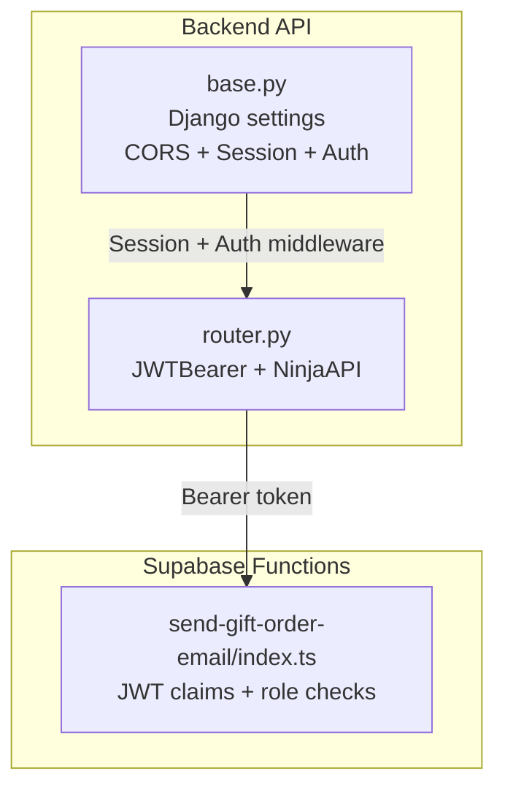
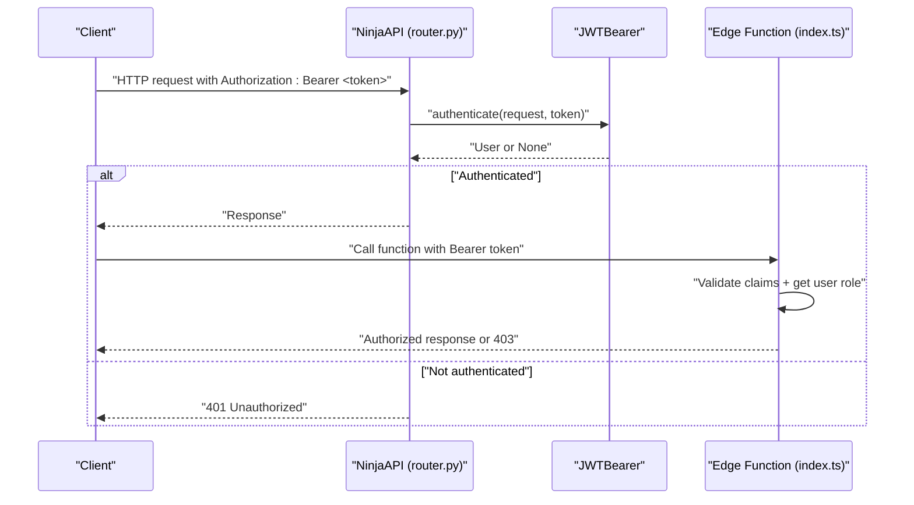
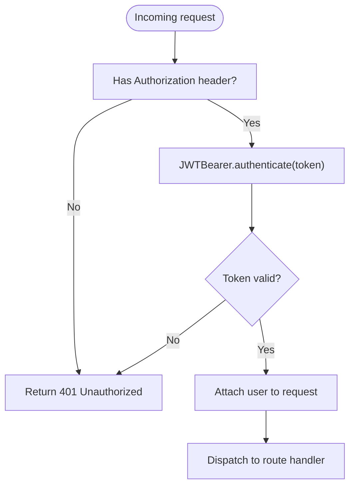
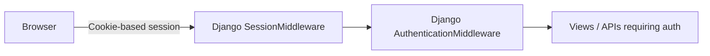
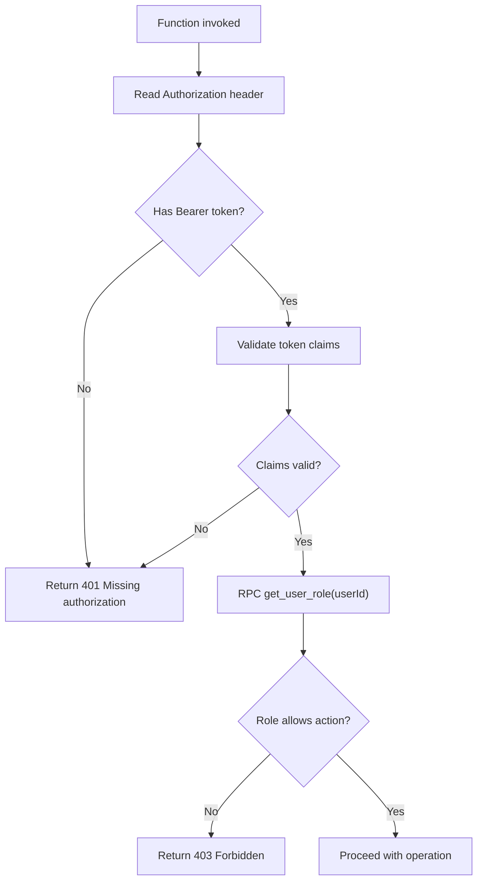
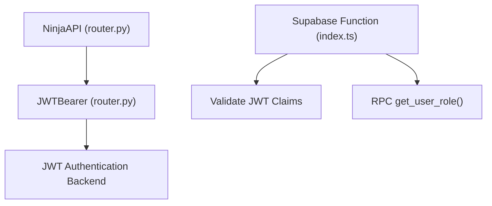

# Authentication & Authorization

<cite>
**Referenced Files in This Document**
- [router.py](file://backend/api/v1/router.py)
- [base.py](file://backend/config/settings/base.py)
- [middleware.py](file://backend/apps/artisans/middleware.py)
- [index.ts](file://supabase/functions/send-gift-order-email/index.ts)
</cite>

## Table of Contents
1. [Introduction](#introduction)
2. [Project Structure](#project-structure)
3. [Core Components](#core-components)
4. [Architecture Overview](#architecture-overview)
5. [Detailed Component Analysis](#detailed-component-analysis)
6. [Dependency Analysis](#dependency-analysis)
7. [Performance Considerations](#performance-considerations)
8. [Troubleshooting Guide](#troubleshooting-guide)
9. [Conclusion](#conclusion)

## Introduction
This document explains the authentication and authorization mechanisms used by the backend API. It focuses on how bearer tokens are validated for protected endpoints, how sessions and roles influence access, and how Supabase-based functions enforce authorization. It also provides guidance for frontend integration, token storage, automatic refresh strategies, and operational security practices.

## Project Structure
The authentication system spans:
- A Django-based API configured with NinjaAPI and JWT bearer authentication
- Django settings enabling session middleware and CORS
- Supabase Edge Functions that validate JWT claims and enforce role-based access

**Diagram sources**
- [router.py:10-28](file://backend/api/v1/router.py#L10-L28)
- [base.py:66-78](file://backend/config/settings/base.py#L66-L78)
- [index.ts:109-143](file://supabase/functions/send-gift-order-email/index.ts#L109-L143)

**Section sources**
- [router.py:1-40](file://backend/api/v1/router.py#L1-L40)
- [base.py:29-78](file://backend/config/settings/base.py#L29-L78)

## Core Components
- JWT Bearer authentication for API endpoints
  - Implemented via a custom JWTBearer class that validates tokens and resolves the user
  - Applied globally to the API and selectively to specific routers
- Django session and authentication middleware
  - Enables session-based flows and integrates with allauth for authentication backends
- Supabase Edge Function authorization
  - Validates JWT claims and enforces role-based access for privileged operations

**Section sources**
- [router.py:10-28](file://backend/api/v1/router.py#L10-L28)
- [base.py:66-78](file://backend/config/settings/base.py#L66-L78)
- [index.ts:109-143](file://supabase/functions/send-gift-order-email/index.ts#L109-L143)

## Architecture Overview
The system enforces bearer token authentication at the API gateway level and augments it with role checks in Supabase functions for sensitive operations.

**Diagram sources**
- [router.py:10-28](file://backend/api/v1/router.py#L10-L28)
- [index.ts:109-143](file://supabase/functions/send-gift-order-email/index.ts#L109-L143)

## Detailed Component Analysis

### JWT Bearer Authentication (NinjaAPI)
- Global bearer enforcement
  - The API instance applies JWTBearer globally so all routes require a valid token unless explicitly marked as unauthenticated
- Per-router override
  - Specific routers can override the global auth to apply JWTBearer selectively
- Token validation
  - The JWTBearer class delegates token validation and user resolution to the underlying JWT authentication backend
- Protected endpoints
  - Routes under the orders router are protected by JWTBearer
  - Other routers may be open or protected depending on explicit configuration

**Diagram sources**
- [router.py:10-28](file://backend/api/v1/router.py#L10-L28)

**Section sources**
- [router.py:10-28](file://backend/api/v1/router.py#L10-L28)
- [router.py:36-39](file://backend/api/v1/router.py#L36-L39)

### Session Management and Django Authentication Middleware
- Session middleware
  - Ensures session cookies are available for browser-based flows
- Authentication middleware
  - Integrates Django’s ModelBackend and allauth backends
- CORS
  - Configured to allow cross-origin requests from trusted origins

**Diagram sources**
- [base.py:66-78](file://backend/config/settings/base.py#L66-L78)

**Section sources**
- [base.py:66-78](file://backend/config/settings/base.py#L66-L78)

### Role-Based Access Control in Supabase Functions
- Claims validation
  - Extracts the Bearer token from the Authorization header and validates claims
- Role enforcement
  - Calls a stored procedure to fetch the user’s role and enforces a minimum role (e.g., admin) for privileged actions
- Error handling
  - Returns 401 for missing/invalid tokens and 403 for insufficient permissions

**Diagram sources**
- [index.ts:109-143](file://supabase/functions/send-gift-order-email/index.ts#L109-L143)

**Section sources**
- [index.ts:109-143](file://supabase/functions/send-gift-order-email/index.ts#L109-L143)

### Frontend Integration Guidance
- Token storage
  - Store the bearer token securely (e.g., in memory or secure HTTP-only cookies depending on deployment)
  - Avoid persisting tokens in local storage unless absolutely necessary and with strict mitigations
- Authorization header
  - Attach Authorization: Bearer <token> to all authenticated requests
- Automatic refresh
  - Implement a token refresh mechanism that obtains a new access token before expiration
  - Use a request interceptor to attach the current token and handle 401 responses by attempting refresh and retry
- Logout
  - Clear stored tokens and invalidate sessions server-side where applicable

[No sources needed since this section provides general guidance]

### Password Reset and Account Verification
- The repository does not include explicit backend endpoints for password reset or account verification in the analyzed files
- If using Supabase for auth, leverage Supabase Auth flows for password reset and email confirmation
- For Django-based flows, integrate with Django’s built-in password reset views and email backends

[No sources needed since this section provides general guidance]

## Dependency Analysis
- NinjaAPI depends on the JWTBearer class for authentication
- JWTBearer relies on the underlying JWT authentication backend for token validation and user resolution
- Supabase functions depend on the Authorization header being passed through to validate claims and enforce roles

**Diagram sources**
- [router.py:10-28](file://backend/api/v1/router.py#L10-L28)
- [index.ts:109-143](file://supabase/functions/send-gift-order-email/index.ts#L109-L143)

**Section sources**
- [router.py:10-28](file://backend/api/v1/router.py#L10-L28)
- [index.ts:109-143](file://supabase/functions/send-gift-order-email/index.ts#L109-L143)

## Performance Considerations
- Token validation overhead
  - Validate tokens once per request; reuse validated user objects where possible
- Caching
  - Cache frequently accessed user roles or permissions to reduce repeated RPC calls
- Network latency
  - Minimize cross-service calls; batch operations when feasible
- Rate limiting
  - Apply rate limits on token refresh and login endpoints to prevent abuse

[No sources needed since this section provides general guidance]

## Troubleshooting Guide
- 401 Unauthorized
  - Missing or malformed Authorization header
  - Expired or invalid token
  - Misconfigured CORS preventing preflight or credential transmission
- 403 Forbidden
  - Valid token but insufficient role for the requested operation
  - Supabase function requires elevated privileges (e.g., admin)
- Token expiration
  - Implement automatic refresh using a refresh token strategy
  - On 401 responses, attempt to refresh the access token and retry the request
- Session vs. token confusion
  - Ensure the Authorization header is present for API calls
  - For browser flows, rely on session cookies where appropriate

**Section sources**
- [router.py:10-28](file://backend/api/v1/router.py#L10-L28)
- [index.ts:109-143](file://supabase/functions/send-gift-order-email/index.ts#L109-L143)

## Conclusion
The backend enforces bearer token authentication at the API boundary and augments it with role-based checks in Supabase functions for sensitive operations. Combine this with robust frontend token management, secure storage practices, and rate limiting to build a resilient and secure authentication and authorization system.