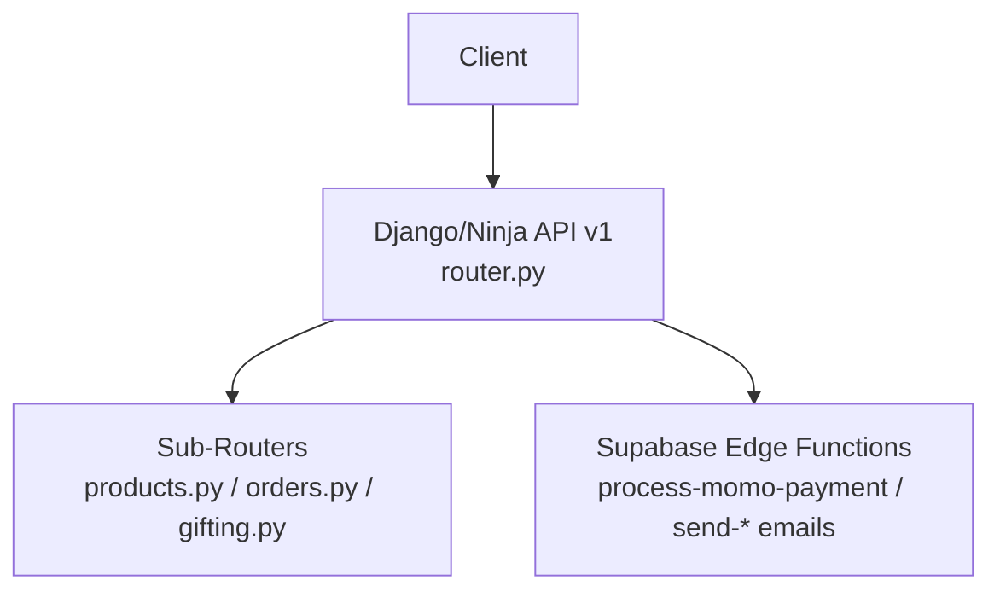
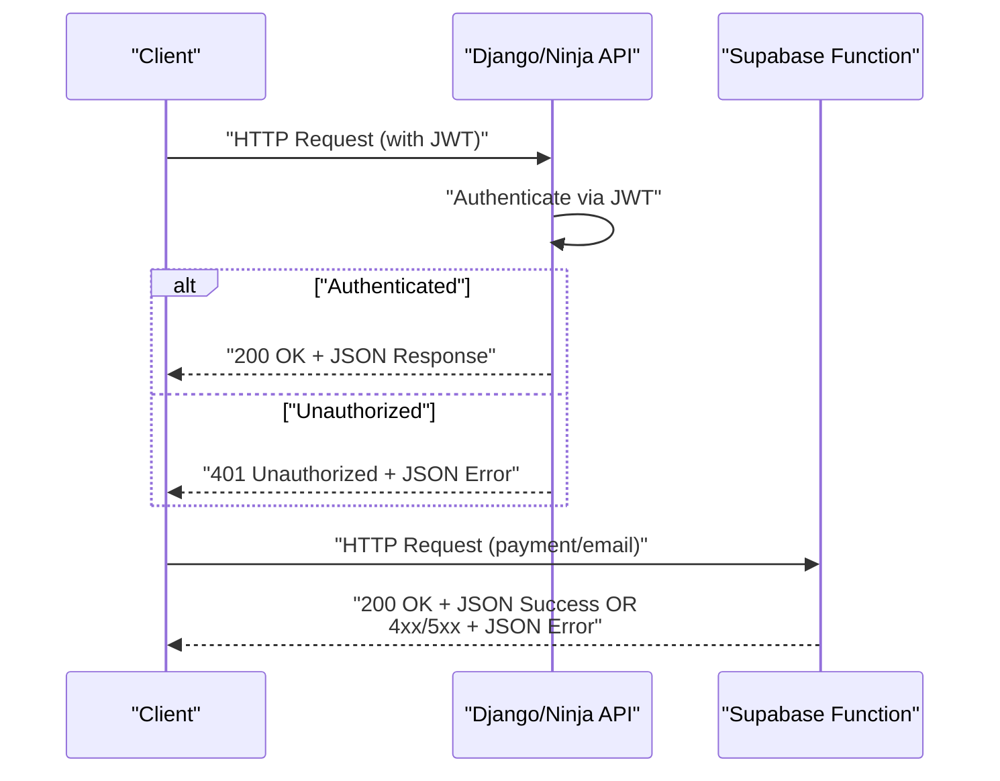
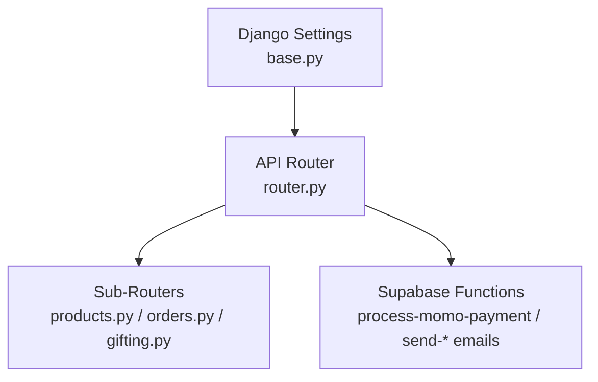

# Error Handling & Response Formats

<cite>
**Referenced Files in This Document**
- [router.py](file://backend/api/v1/router.py)
- [urls.py](file://backend/api/v1/urls.py)
- [urls.py](file://backend/config/urls.py)
- [base.py](file://backend/config/settings/base.py)
- [products.py](file://backend/api/v1/products.py)
- [orders.py](file://backend/api/v1/orders.py)
- [gifting.py](file://backend/api/v1/gifting.py)
- [index.ts](file://supabase/functions/process-momo-payment/index.ts)
- [index.ts](file://supabase/functions/send-order-email/index.ts)
- [index.ts](file://supabase/functions/send-gift-order-email/index.ts)
- [index.ts](file://supabase/functions/send-gift-confirmation/index.ts)
- [railway.toml](file://backend/railway.toml)
</cite>

## Table of Contents
1. [Introduction](#introduction)
2. [Project Structure](#project-structure)
3. [Core Components](#core-components)
4. [Architecture Overview](#architecture-overview)
5. [Detailed Component Analysis](#detailed-component-analysis)
6. [Dependency Analysis](#dependency-analysis)
7. [Performance Considerations](#performance-considerations)
8. [Troubleshooting Guide](#troubleshooting-guide)
9. [Conclusion](#conclusion)

## Introduction
This document defines standardized error handling and response formatting for the Empindu API. It consolidates patterns observed across the Django/Ninja backend and Supabase Edge Functions to ensure consistent HTTP status codes, error payload shapes, and operational behavior. It also provides guidance for client-side handling, retry strategies, and graceful degradation.

## Project Structure
The API surface is organized under a Django project with a dedicated API v1 module and Supabase Edge Functions for payment and email orchestration. Authentication is enforced via JWT bearer tokens for selected routes.

**Diagram sources**
- [router.py:22-28](file://backend/api/v1/router.py#L22-L28)
- [products.py:1-100](file://backend/api/v1/products.py#L1-L100)
- [orders.py:1-17](file://backend/api/v1/orders.py#L1-L17)
- [gifting.py:1-12](file://backend/api/v1/gifting.py#L1-L12)
- [index.ts:1-150](file://supabase/functions/process-momo-payment/index.ts#L1-L150)

**Section sources**
- [urls.py:10-14](file://backend/config/urls.py#L10-L14)
- [urls.py:1-9](file://backend/api/v1/urls.py#L1-L9)
- [router.py:1-39](file://backend/api/v1/router.py#L1-L39)

## Core Components
- Authentication and routing:
  - JWT bearer authentication is configured globally for the API and selectively applied to specific routers.
  - The API instance exposes OpenAPI docs and Swagger UI for discovery.
- Response schemas:
  - Public endpoints define Pydantic-style schemas for serialization and validation hints.
- Supabase Edge Functions:
  - Implement explicit HTTP status codes and JSON error payloads for client consumption.

Key implementation references:
- JWT bearer authentication and API instance setup: [router.py:10-28](file://backend/api/v1/router.py#L10-L28)
- Sub-router registration and selective auth: [router.py:36-39](file://backend/api/v1/router.py#L36-L39)
- Public endpoint schemas: [products.py:14-71](file://backend/api/v1/products.py#L14-L71)
- Supabase function error handling patterns: [index.ts:35-37](file://supabase/functions/process-momo-payment/index.ts#L35-L37), [index.ts:37-42](file://supabase/functions/send-gift-confirmation/index.ts#L37-L42), [index.ts:142-147](file://supabase/functions/send-gift-order-email/index.ts#L142-L147), [index.ts:274-280](file://supabase/functions/send-order-email/index.ts#L274-L280)

**Section sources**
- [router.py:10-28](file://backend/api/v1/router.py#L10-L28)
- [router.py:36-39](file://backend/api/v1/router.py#L36-L39)
- [products.py:14-71](file://backend/api/v1/products.py#L14-L71)
- [index.ts:35-37](file://supabase/functions/process-momo-payment/index.ts#L35-L37)
- [index.ts:37-42](file://supabase/functions/send-gift-confirmation/index.ts#L37-L42)
- [index.ts:142-147](file://supabase/functions/send-gift-order-email/index.ts#L142-L147)
- [index.ts:274-280](file://supabase/functions/send-order-email/index.ts#L274-L280)

## Architecture Overview
The API architecture separates concerns between Django/Ninja endpoints and Supabase Edge Functions. Authentication is centralized; Supabase functions handle payment processing and email delivery with explicit HTTP responses.

**Diagram sources**
- [router.py:10-18](file://backend/api/v1/router.py#L10-L18)
- [index.ts:1-150](file://supabase/functions/process-momo-payment/index.ts#L1-L150)
- [index.ts:249-283](file://supabase/functions/send-order-email/index.ts#L249-L283)

## Detailed Component Analysis

### Authentication and Authorization Errors
- Global JWT bearer authentication is defined and used for the API instance. On invalid or missing tokens, authentication fails and downstream handlers receive no user identity.
- Some sub-routers apply JWT authentication selectively, ensuring protected endpoints require a valid token.

Recommended client behavior:
- Capture 401 responses and trigger re-authentication or token refresh.
- Distinguish between expired and invalid tokens if possible; prompt appropriate remediation.

References:
- JWT bearer class and authenticate method: [router.py:10-18](file://backend/api/v1/router.py#L10-L18)
- API instance with auth: [router.py:22-28](file://backend/api/v1/router.py#L22-L28)
- Sub-router with JWT: [router.py](file://backend/api/v1/router.py#L38)

**Section sources**
- [router.py:10-18](file://backend/api/v1/router.py#L10-L18)
- [router.py:22-28](file://backend/api/v1/router.py#L22-L28)
- [router.py](file://backend/api/v1/router.py#L38)

### Validation Errors
- Supabase functions explicitly validate inputs and return structured JSON errors with 400 status when required fields are missing or formats are invalid.
- Example validations include presence checks and phone number format validation.

Recommended client behavior:
- Parse the JSON error payload and present localized messages to users.
- Avoid retrying requests with the same malformed payload.

References:
- Missing parameter and bad request: [index.ts:47-52](file://supabase/functions/send-gift-confirmation/index.ts#L47-L52)
- Invalid phone number format: [index.ts:35-37](file://supabase/functions/process-momo-payment/index.ts#L35-L37)

**Section sources**
- [index.ts:47-52](file://supabase/functions/send-gift-confirmation/index.ts#L47-L52)
- [index.ts:35-37](file://supabase/functions/process-momo-payment/index.ts#L35-L37)

### Business Rule Violations
- Ownership checks and role-based access control are enforced in Supabase functions. Non-compliant requests return 403 Forbidden.
- Resource-not-found scenarios return 404 Not Found.

Recommended client behavior:
- Treat 403 as permission denial; inform users they lack required roles or ownership.
- Treat 404 as resource absence; avoid retrying unless the underlying state changes.

References:
- Ownership verification leading to 403: [index.ts:68-74](file://supabase/functions/send-gift-confirmation/index.ts#L68-L74)
- Resource not found leading to 404: [index.ts:61-66](file://supabase/functions/send-gift-confirmation/index.ts#L61-L66)

**Section sources**
- [index.ts:68-74](file://supabase/functions/send-gift-confirmation/index.ts#L68-L74)
- [index.ts:61-66](file://supabase/functions/send-gift-confirmation/index.ts#L61-L66)

### System Errors and Failures
- Internal server errors return 500 with a JSON error payload containing a message string.
- Some functions log upstream service errors (e.g., external email provider) and propagate a generic message.

Recommended client behavior:
- Retry idempotent operations with exponential backoff on 500.
- Log and report unexpected 500 errors to monitoring systems.

References:
- Generic 500 error handling: [index.ts:142-149](file://supabase/functions/process-momo-payment/index.ts#L142-L149)
- Email provider error handling: [index.ts:274-280](file://supabase/functions/send-order-email/index.ts#L274-L280)

**Section sources**
- [index.ts:142-149](file://supabase/functions/process-momo-payment/index.ts#L142-L149)
- [index.ts:274-280](file://supabase/functions/send-order-email/index.ts#L274-L280)

### Rate Limiting Responses
- No explicit rate limiting is implemented in the referenced files. Clients should implement client-side throttling and exponential backoff when encountering repeated 429 responses if/when rate limits are introduced.

[No sources needed since this section provides general guidance]

### API Versioning Errors
- The API instance declares a version string. While no explicit version negotiation errors are observed in the referenced files, clients should include the appropriate version in requests and expect version-specific behavior.

References:
- API version declaration: [router.py](file://backend/api/v1/router.py#L24)

**Section sources**
- [router.py](file://backend/api/v1/router.py#L24)

### Deprecation Notices
- No deprecation headers or notices are present in the referenced files. When deprecations are introduced, servers should set appropriate headers and provide a timeline for removal.

[No sources needed since this section provides general guidance]

### Localization Support
- The Django project enables internationalization and sets a default language. While no API-level localization is observed in the referenced files, clients can request localized content via standard headers and accept localized error messages if provided.

References:
- Internationalization settings: [base.py:146-150](file://backend/config/settings/base.py#L146-L150)

**Section sources**
- [base.py:146-150](file://backend/config/settings/base.py#L146-L150)

### Debugging Information
- Supabase functions log errors to console and return structured JSON payloads. Clients should capture both HTTP status and JSON body for diagnostics.

References:
- Logging and error response: [index.ts:274-280](file://supabase/functions/send-order-email/index.ts#L274-L280)

**Section sources**
- [index.ts:274-280](file://supabase/functions/send-order-email/index.ts#L274-L280)

### Structured Error Response Formats
- Consistent JSON shape across Supabase functions: a top-level object containing an error message string and optional metadata.
- Example patterns:
  - Missing parameters: 400 with error field.
  - Invalid input format: 400 with error field.
  - Unauthorized: 401 with error field.
  - Forbidden: 403 with error field.
  - Not found: 404 with error field.
  - Internal error: 500 with error field.

References:
- Validation error (400): [index.ts:47-52](file://supabase/functions/send-gift-confirmation/index.ts#L47-L52)
- Phone format error (400): [index.ts:35-37](file://supabase/functions/process-momo-payment/index.ts#L35-L37)
- Unauthorized (401): [index.ts:37-42](file://supabase/functions/send-gift-confirmation/index.ts#L37-L42)
- Forbidden (403): [index.ts:68-74](file://supabase/functions/send-gift-confirmation/index.ts#L68-L74)
- Not found (404): [index.ts:61-66](file://supabase/functions/send-gift-confirmation/index.ts#L61-L66)
- Internal error (500): [index.ts:142-149](file://supabase/functions/process-momo-payment/index.ts#L142-L149)

**Section sources**
- [index.ts:37-42](file://supabase/functions/send-gift-confirmation/index.ts#L37-L42)
- [index.ts:47-52](file://supabase/functions/send-gift-confirmation/index.ts#L47-L52)
- [index.ts:61-66](file://supabase/functions/send-gift-confirmation/index.ts#L61-L66)
- [index.ts:68-74](file://supabase/functions/send-gift-confirmation/index.ts#L68-L74)
- [index.ts:35-37](file://supabase/functions/process-momo-payment/index.ts#L35-L37)
- [index.ts:142-149](file://supabase/functions/process-momo-payment/index.ts#L142-L149)

### HTTP Status Code Usage
- 200 OK: Successful responses with JSON bodies.
- 400 Bad Request: Validation errors and malformed requests.
- 401 Unauthorized: Missing or invalid JWT.
- 403 Forbidden: Insufficient permissions or ownership mismatch.
- 404 Not Found: Resource does not exist.
- 500 Internal Server Error: Unexpected server failures.

References:
- Success and error patterns across functions: [index.ts:131-140](file://supabase/functions/process-momo-payment/index.ts#L131-L140), [index.ts:205-208](file://supabase/functions/send-gift-confirmation/index.ts#L205-L208), [index.ts:203-206](file://supabase/functions/send-gift-order-email/index.ts#L203-L206), [index.ts:270-273](file://supabase/functions/send-order-email/index.ts#L270-L273)

**Section sources**
- [index.ts:131-140](file://supabase/functions/process-momo-payment/index.ts#L131-L140)
- [index.ts:205-208](file://supabase/functions/send-gift-confirmation/index.ts#L205-L208)
- [index.ts:203-206](file://supabase/functions/send-gift-order-email/index.ts#L203-L206)
- [index.ts:270-273](file://supabase/functions/send-order-email/index.ts#L270-L273)

### Client-Side Error Handling, Retries, and Graceful Degradation
- Retry strategy:
  - Idempotent operations may be retried on 500 with exponential backoff and jitter.
  - Do not retry 400/401/403/404 without changing the request.
- Graceful degradation:
  - Cache partial results where safe.
  - Present user-friendly messages derived from the error payload.
- Monitoring:
  - Report unexpected 500 errors to error tracking systems.

[No sources needed since this section provides general guidance]

## Dependency Analysis
The API depends on Django/Ninja for routing and JWT authentication, and integrates with Supabase Edge Functions for payment and email workflows. CORS is enabled via Django middleware.

**Diagram sources**
- [base.py:66-78](file://backend/config/settings/base.py#L66-L78)
- [router.py:22-28](file://backend/api/v1/router.py#L22-L28)
- [products.py:1-100](file://backend/api/v1/products.py#L1-L100)
- [orders.py:1-17](file://backend/api/v1/orders.py#L1-L17)
- [gifting.py:1-12](file://backend/api/v1/gifting.py#L1-L12)
- [index.ts:1-150](file://supabase/functions/process-momo-payment/index.ts#L1-L150)

**Section sources**
- [base.py:66-78](file://backend/config/settings/base.py#L66-L78)
- [router.py:22-28](file://backend/api/v1/router.py#L22-L28)

## Performance Considerations
- Keep error payloads minimal to reduce bandwidth.
- Prefer early validation to fail fast and avoid unnecessary processing.
- Offload long-running tasks (e.g., payment completion) to background processes to return quick responses.

[No sources needed since this section provides general guidance]

## Troubleshooting Guide
- Authentication failures (401):
  - Verify JWT token validity and scope.
  - Confirm the token was sent in the Authorization header.
- Validation failures (400):
  - Ensure required fields are present and formatted correctly.
- Permission failures (403):
  - Confirm user role and ownership of requested resources.
- Resource not found (404):
  - Validate identifiers and resource existence.
- Internal errors (500):
  - Check server logs and function error streams.
  - Implement retries with exponential backoff for idempotent operations.

References:
- Error handling patterns: [index.ts:142-149](file://supabase/functions/process-momo-payment/index.ts#L142-L149), [index.ts:37-42](file://supabase/functions/send-gift-confirmation/index.ts#L37-L42), [index.ts:142-147](file://supabase/functions/send-gift-order-email/index.ts#L142-L147), [index.ts:274-280](file://supabase/functions/send-order-email/index.ts#L274-L280)

**Section sources**
- [index.ts:142-149](file://supabase/functions/process-momo-payment/index.ts#L142-L149)
- [index.ts:37-42](file://supabase/functions/send-gift-confirmation/index.ts#L37-L42)
- [index.ts:142-147](file://supabase/functions/send-gift-order-email/index.ts#L142-L147)
- [index.ts:274-280](file://supabase/functions/send-order-email/index.ts#L274-L280)

## Conclusion
This guide establishes consistent error handling and response formatting across the Empindu API. By adhering to the documented patterns—structured JSON error payloads, explicit HTTP status codes, and client-side retry strategies—consumers can build robust integrations. As the platform evolves, extend these patterns to cover versioning, localization, and rate limiting while maintaining backward compatibility.