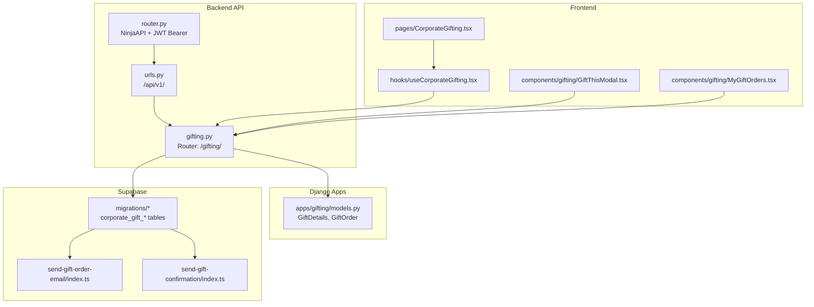
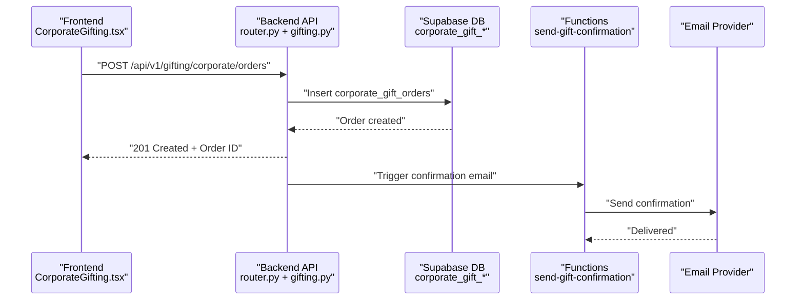
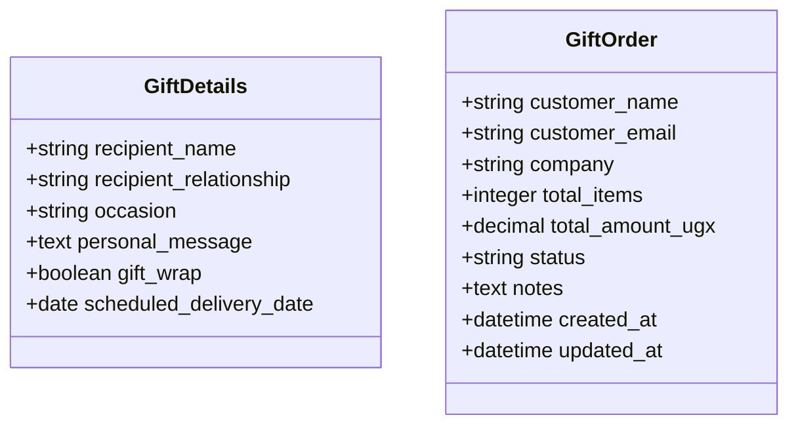
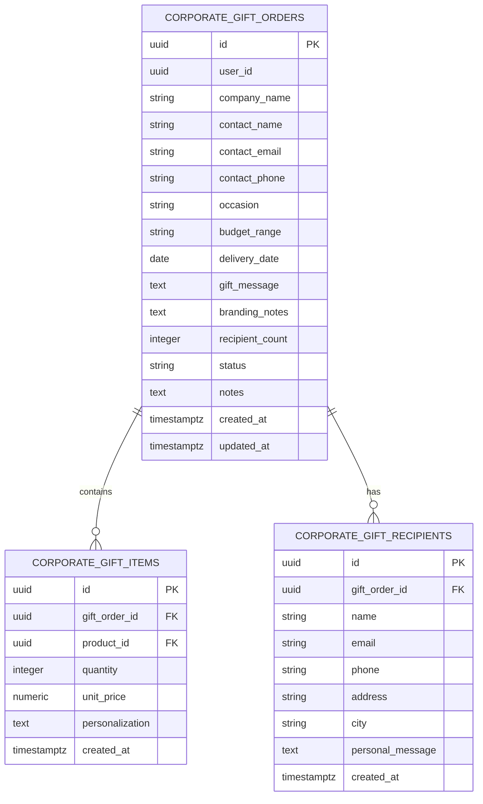
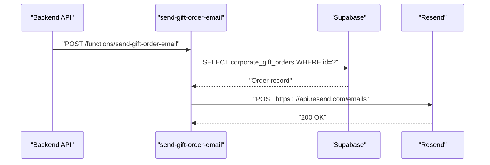
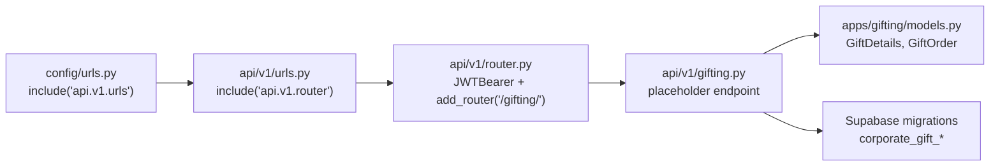

# Gifting System Endpoints

<cite>
**Referenced Files in This Document**
- [gifting.py](file://backend/api/v1/gifting.py)
- [router.py](file://backend/api/v1/router.py)
- [urls.py](file://backend/api/v1/urls.py)
- [config.urls.py](file://backend/config/urls.py)
- [models.py](file://backend/apps/gifting/models.py)
- [20260301183140_74b1e32e-ded4-4234-9c49-76542f291b2d.sql](file://supabase/migrations/20260301183140_74b1e32e-ded4-4234-9c49-76542f291b2d.sql)
- [send-gift-order-email/index.ts](file://supabase/functions/send-gift-order-email/index.ts)
- [send-gift-confirmation/index.ts](file://supabase/functions/send-gift-confirmation/index.ts)
- [CorporateGifting.tsx](file://src/pages/CorporateGifting.tsx)
- [useCorporateGifting.tsx](file://src/hooks/useCorporateGifting.tsx)
- [GiftThisModal.tsx](file://src/components/gifting/GiftThisModal.tsx)
- [MyGiftOrders.tsx](file://src/components/gifting/MyGiftOrders.tsx)
</cite>

## Table of Contents
1. [Introduction](#introduction)
2. [Project Structure](#project-structure)
3. [Core Components](#core-components)
4. [Architecture Overview](#architecture-overview)
5. [Detailed Component Analysis](#detailed-component-analysis)
6. [Dependency Analysis](#dependency-analysis)
7. [Performance Considerations](#performance-considerations)
8. [Troubleshooting Guide](#troubleshooting-guide)
9. [Conclusion](#conclusion)

## Introduction
This document provides comprehensive API documentation for the gifting system endpoints, focusing on gift order creation, personalization workflows, corporate gift management, gift wrapping options, messaging systems, scheduling, gift card generation and redemption, gift registry functionality, order tracking, status updates, and delivery coordination. It consolidates backend API routing, Supabase database models and policies, serverless functions for notifications, and frontend components/handlers that integrate with the backend.

## Project Structure
The gifting system spans backend API routers, Django models, Supabase database migrations, serverless functions for email notifications, and React frontend components and hooks.

**Diagram sources**
- [router.py:1-40](file://backend/api/v1/router.py#L1-L40)
- [urls.py:1-10](file://backend/api/v1/urls.py#L1-L10)
- [gifting.py:1-13](file://backend/api/v1/gifting.py#L1-L13)
- [models.py:1-67](file://backend/apps/gifting/models.py#L1-L67)
- [20260301183140_74b1e32e-ded4-4234-9c49-76542f291b2d.sql:64-130](file://supabase/migrations/20260301183140_74b1e32e-ded4-4234-9c49-76542f291b2d.sql#L64-L130)
- [send-gift-order-email/index.ts:149-185](file://supabase/functions/send-gift-order-email/index.ts#L149-L185)
- [send-gift-confirmation/index.ts:130-145](file://supabase/functions/send-gift-confirmation/index.ts#L130-L145)
- [CorporateGifting.tsx](file://src/pages/CorporateGifting.tsx)
- [useCorporateGifting.tsx](file://src/hooks/useCorporateGifting.tsx)
- [GiftThisModal.tsx](file://src/components/gifting/GiftThisModal.tsx)
- [MyGiftOrders.tsx](file://src/components/gifting/MyGiftOrders.tsx)

**Section sources**
- [router.py:1-40](file://backend/api/v1/router.py#L1-L40)
- [urls.py:1-10](file://backend/api/v1/urls.py#L1-L10)
- [config.urls.py:1-19](file://backend/config/urls.py#L1-L19)

## Core Components
- Backend API Router: The gifting router is registered under `/api/v1/gifting/`. Currently, it exposes a placeholder endpoint returning a message indicating future implementation.
- Django Models: Define gift personalization (`GiftDetails`) and corporate gift order aggregation (`GiftOrder`) with statuses and metadata.
- Supabase Migrations: Define three related tables for corporate gifting: orders, items, and recipients, with Row Level Security (RLS) policies for ownership and admin access.
- Serverless Functions: Email notification functions handle sending confirmation emails after gift order submission and status change emails to contacts.
- Frontend Pages/Hooks/Components: Corporate gifting page, hook for managing corporate gifting state, gift modal, and gift orders list.

Key implementation references:
- [gifting.py:7-12](file://backend/api/v1/gifting.py#L7-L12)
- [models.py:9-36](file://backend/apps/gifting/models.py#L9-L36)
- [models.py:39-66](file://backend/apps/gifting/models.py#L39-L66)
- [20260301183140_74b1e32e-ded4-4234-9c49-76542f291b2d.sql:64-130](file://supabase/migrations/20260301183140_74b1e32e-ded4-4234-9c49-76542f291b2d.sql#L64-L130)
- [send-gift-order-email/index.ts:149-185](file://supabase/functions/send-gift-order-email/index.ts#L149-L185)
- [send-gift-confirmation/index.ts:130-145](file://supabase/functions/send-gift-confirmation/index.ts#L130-L145)
- [CorporateGifting.tsx](file://src/pages/CorporateGifting.tsx)
- [useCorporateGifting.tsx](file://src/hooks/useCorporateGifting.tsx)
- [GiftThisModal.tsx](file://src/components/gifting/GiftThisModal.tsx)
- [MyGiftOrders.tsx](file://src/components/gifting/MyGiftOrders.tsx)

**Section sources**
- [gifting.py:1-13](file://backend/api/v1/gifting.py#L1-L13)
- [models.py:1-67](file://backend/apps/gifting/models.py#L1-L67)
- [20260301183140_74b1e32e-ded4-4234-9c49-76542f291b2d.sql:64-130](file://supabase/migrations/20260301183140_74b1e32e-ded4-4234-9c49-76542f291b2d.sql#L64-L130)

## Architecture Overview
The gifting system integrates frontend components with backend API routes and Supabase data services. Authentication is handled via JWT bearer tokens. Corporate gift orders are persisted in Supabase tables with RLS policies ensuring user-scoped access. Serverless functions trigger email notifications upon order submission and status updates.

**Diagram sources**
- [router.py:30-39](file://backend/api/v1/router.py#L30-L39)
- [gifting.py:7-12](file://backend/api/v1/gifting.py#L7-L12)
- [20260301183140_74b1e32e-ded4-4234-9c49-76542f291b2d.sql:64-82](file://supabase/migrations/20260301183140_74b1e32e-ded4-4234-9c49-76542f291b2d.sql#L64-L82)
- [send-gift-confirmation/index.ts:130-145](file://supabase/functions/send-gift-confirmation/index.ts#L130-L145)

## Detailed Component Analysis

### Backend API Routing and Authentication
- The API instance defines JWT bearer authentication and registers sub-routers including gifting.
- The gifting router is mounted at `/api/v1/gifting/` and currently exposes a placeholder GET endpoint.

Implementation references:
- [router.py:10-18](file://backend/api/v1/router.py#L10-L18)
- [router.py:22-28](file://backend/api/v1/router.py#L22-L28)
- [router.py:34-39](file://backend/api/v1/router.py#L34-L39)
- [gifting.py:7-12](file://backend/api/v1/gifting.py#L7-L12)

**Section sources**
- [router.py:1-40](file://backend/api/v1/router.py#L1-L40)
- [gifting.py:1-13](file://backend/api/v1/gifting.py#L1-L13)

### Django Models: GiftDetails and GiftOrder
- GiftDetails encapsulates personalization fields: recipient name/relationship, occasion, personal message, gift wrap flag, and optional scheduled delivery date.
- GiftOrder aggregates corporate gift orders with customer/company info, totals, status enumeration, and timestamps.

Implementation references:
- [models.py:9-36](file://backend/apps/gifting/models.py#L9-L36)
- [models.py:39-66](file://backend/apps/gifting/models.py#L39-L66)

**Diagram sources**
- [models.py:9-36](file://backend/apps/gifting/models.py#L9-L36)
- [models.py:39-66](file://backend/apps/gifting/models.py#L39-L66)

**Section sources**
- [models.py:1-67](file://backend/apps/gifting/models.py#L1-L67)

### Supabase Corporate Gifting Tables and Policies
- corporate_gift_orders: Stores order metadata, contact info, occasion, budget range, delivery date, gift message, branding notes, recipient count, status, and audit fields.
- corporate_gift_items: Links products to orders with quantity, unit price, and personalization text.
- corporate_gift_recipients: Stores recipient details per order including optional personal message and location data.
- RLS Policies: Enforce ownership checks for users and admin-wide access for sensitive operations.

Implementation references:
- [20260301183140_74b1e32e-ded4-4234-9c49-76542f291b2d.sql:64-130](file://supabase/migrations/20260301183140_74b1e32e-ded4-4234-9c49-76542f291b2d.sql#L64-L130)

**Diagram sources**
- [20260301183140_74b1e32e-ded4-4234-9c49-76542f291b2d.sql:64-130](file://supabase/migrations/20260301183140_74b1e32e-ded4-4234-9c49-76542f291b2d.sql#L64-L130)

**Section sources**
- [20260301183140_74b1e32e-ded4-4234-9c49-76542f291b2d.sql:64-130](file://supabase/migrations/20260301183140_74b1e32e-ded4-4234-9c49-76542f291b2d.sql#L64-L130)

### Serverless Functions: Email Notifications
- send-gift-confirmation: Builds and sends a confirmation email to the contact after a corporate gift order is submitted.
- send-gift-order-email: Validates admin role, fetches order by ID, builds HTML email content, and dispatches via Resend API.

Implementation references:
- [send-gift-confirmation/index.ts:130-145](file://supabase/functions/send-gift-confirmation/index.ts#L130-L145)
- [send-gift-order-email/index.ts:149-185](file://supabase/functions/send-gift-order-email/index.ts#L149-L185)

**Diagram sources**
- [send-gift-order-email/index.ts:149-185](file://supabase/functions/send-gift-order-email/index.ts#L149-L185)

**Section sources**
- [send-gift-confirmation/index.ts:130-145](file://supabase/functions/send-gift-confirmation/index.ts#L130-L145)
- [send-gift-order-email/index.ts:149-185](file://supabase/functions/send-gift-order-email/index.ts#L149-L185)

### Frontend Integration: Corporate Gifting and Gift Management
- CorporateGifting.tsx: Page component for creating and managing corporate gift orders.
- useCorporateGifting.tsx: Hook orchestrating state and API interactions for corporate gifting.
- GiftThisModal.tsx: Modal for initiating personalized gift creation.
- MyGiftOrders.tsx: Component for viewing and tracking gift orders.

Implementation references:
- [CorporateGifting.tsx](file://src/pages/CorporateGifting.tsx)
- [useCorporateGifting.tsx](file://src/hooks/useCorporateGifting.tsx)
- [GiftThisModal.tsx](file://src/components/gifting/GiftThisModal.tsx)
- [MyGiftOrders.tsx](file://src/components/gifting/MyGiftOrders.tsx)

**Section sources**
- [CorporateGifting.tsx](file://src/pages/CorporateGifting.tsx)
- [useCorporateGifting.tsx](file://src/hooks/useCorporateGifting.tsx)
- [GiftThisModal.tsx](file://src/components/gifting/GiftThisModal.tsx)
- [MyGiftOrders.tsx](file://src/components/gifting/MyGiftOrders.tsx)

## Dependency Analysis
- API Registration: The main Django URL configuration includes `/api/v1/`, which mounts the API v1 router. The gifting router is registered within the API v1 router.
- Authentication: JWT bearer authentication is configured globally for API v1, affecting gifting endpoints.
- Data Access: Corporate gift endpoints rely on Supabase tables and RLS policies for row-level access control.
- Notification Flow: Email notifications are triggered via serverless functions invoked by the backend or frontend flows.

**Diagram sources**
- [config.urls.py:10-14](file://backend/config/urls.py#L10-L14)
- [urls.py:7-9](file://backend/api/v1/urls.py#L7-L9)
- [router.py:22-39](file://backend/api/v1/router.py#L22-L39)
- [gifting.py:7-12](file://backend/api/v1/gifting.py#L7-L12)
- [models.py:1-67](file://backend/apps/gifting/models.py#L1-L67)
- [20260301183140_74b1e32e-ded4-4234-9c49-76542f291b2d.sql:64-130](file://supabase/migrations/20260301183140_74b1e32e-ded4-4234-9c49-76542f291b2d.sql#L64-L130)

**Section sources**
- [config.urls.py:1-19](file://backend/config/urls.py#L1-L19)
- [urls.py:1-10](file://backend/api/v1/urls.py#L1-L10)
- [router.py:1-40](file://backend/api/v1/router.py#L1-L40)

## Performance Considerations
- API Endpoint Coverage: The current gifting router is a placeholder. As endpoints are implemented, ensure efficient serialization and pagination for listing orders and recipients.
- Database Queries: Corporate gift queries should leverage indexed foreign keys (order_id, product_id) and limit selected fields to reduce payload sizes.
- RLS Overhead: RLS policies add minimal overhead but ensure they remain selective to avoid unnecessary scans.
- Function Latency: Email functions should batch or cache templates to minimize cold start impact.

## Troubleshooting Guide
- Authentication Failures: Ensure JWT bearer token is present and valid when accessing protected endpoints.
- Permission Denied: RLS policies restrict access to owned records; verify the authenticated user matches the order’s user_id.
- Function Errors: For email functions, validate required fields (order ID, new status) and API key configuration.
- CORS Issues: Confirm frontend requests include appropriate headers and that the API supports cross-origin requests.

Operational references:
- [router.py:10-18](file://backend/api/v1/router.py#L10-L18)
- [20260301183140_74b1e32e-ded4-4234-9c49-76542f291b2d.sql:84-129](file://supabase/migrations/20260301183140_74b1e32e-ded4-4234-9c49-76542f291b2d.sql#L84-L129)
- [send-gift-order-email/index.ts:142-155](file://supabase/functions/send-gift-order-email/index.ts#L142-L155)

**Section sources**
- [router.py:10-18](file://backend/api/v1/router.py#L10-L18)
- [20260301183140_74b1e32e-ded4-4234-9c49-76542f291b2d.sql:84-129](file://supabase/migrations/20260301183140_74b1e32e-ded4-4234-9c49-76542f291b2d.sql#L84-L129)
- [send-gift-order-email/index.ts:142-155](file://supabase/functions/send-gift-order-email/index.ts#L142-L155)

## Conclusion
The gifting system architecture integrates frontend components with a modular backend API, robust Supabase data models, and serverless email functions. While the gifting router is currently a placeholder, the underlying models, tables, and policies establish a strong foundation for implementing gift order creation, personalization, corporate gift management, scheduling, and notifications. As endpoints are developed, maintain clear separation of concerns, enforce RLS policies, and optimize data access patterns for scalability and reliability.