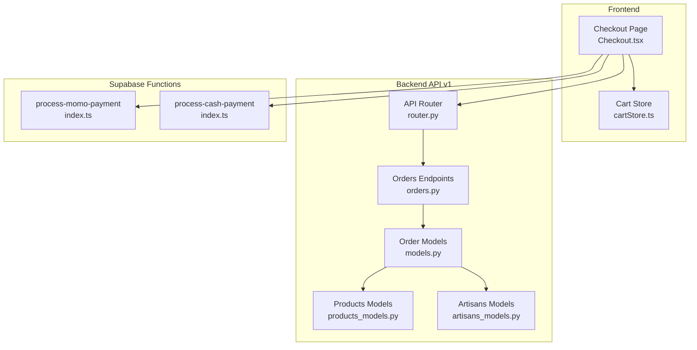
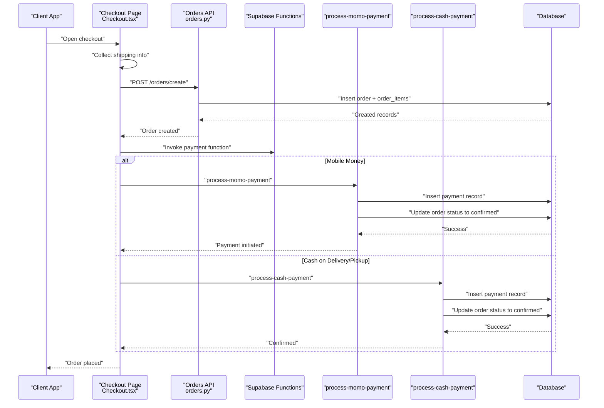
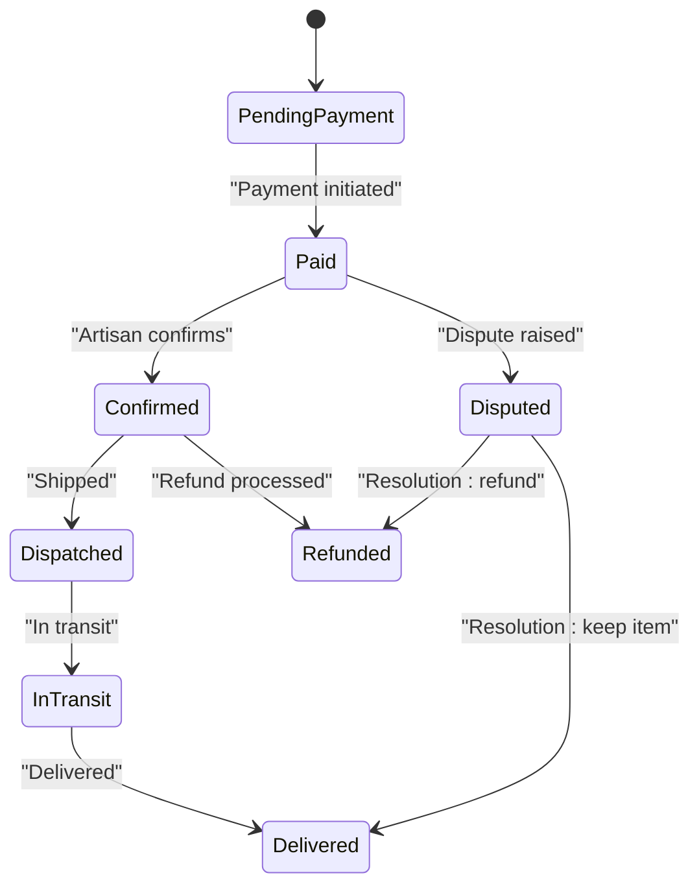
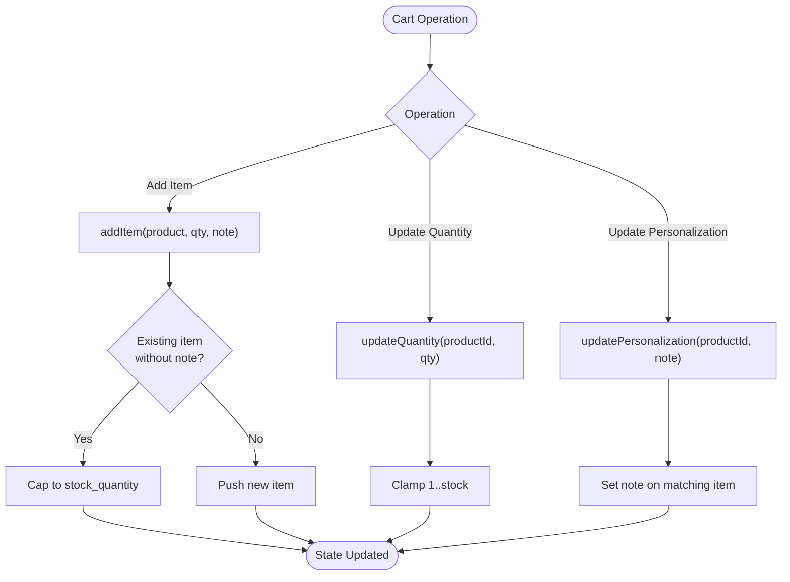
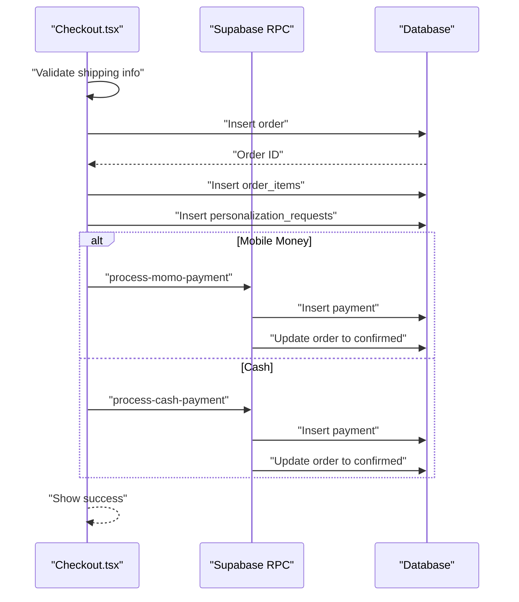
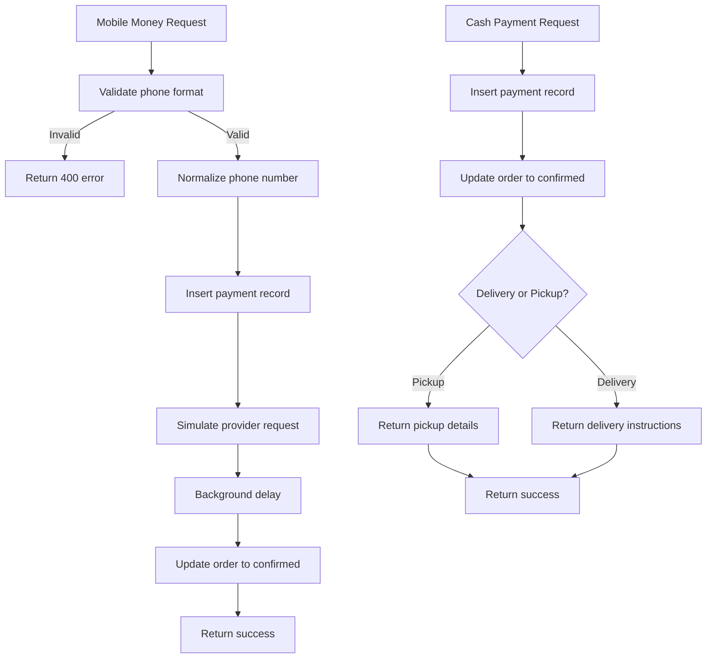
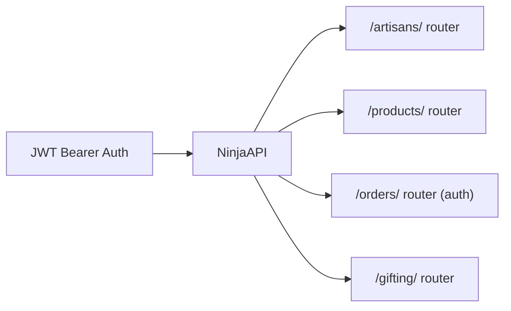
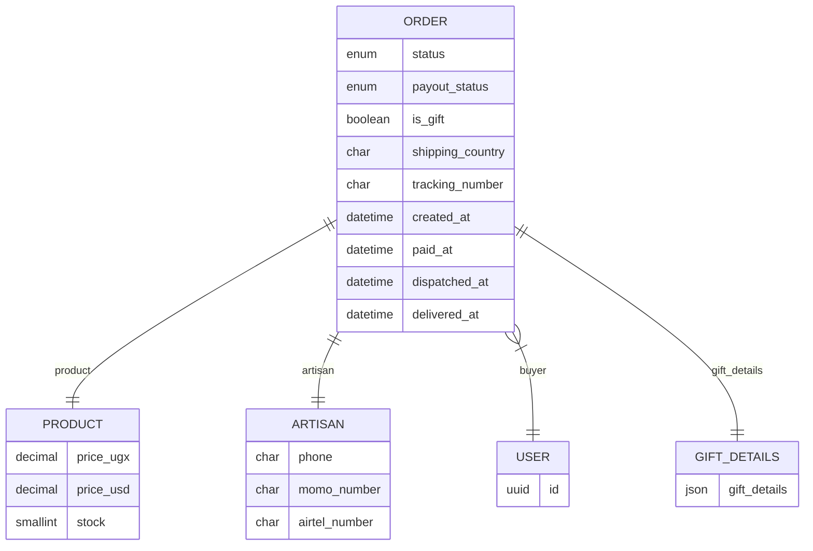
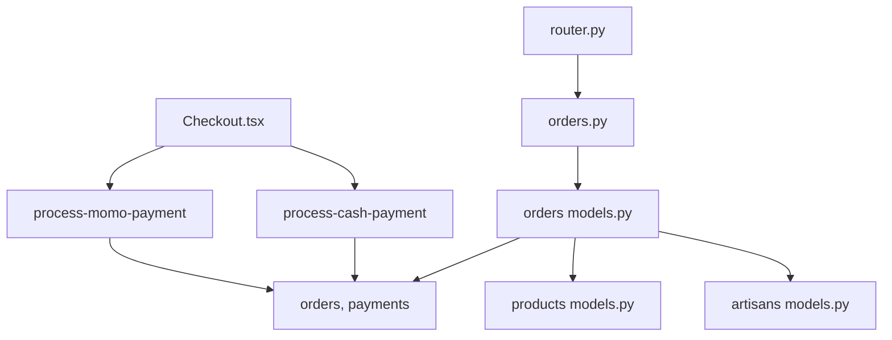

# Order Processing Endpoints

<cite>
**Referenced Files in This Document**
- [orders.py](file://backend/api/v1/orders.py)
- [router.py](file://backend/api/v1/router.py)
- [models.py](file://backend/apps/orders/models.py)
- [products_models.py](file://backend/apps/products/models.py)
- [artisans_models.py](file://backend/apps/artisans/models.py)
- [Checkout.tsx](file://apps/web/src/pages/Checkout.tsx)
- [cartStore.ts](file://apps/web/src/stores/cartStore.ts)
- [process-momo-payment/index.ts](file://supabase/functions/process-momo-payment/index.ts)
- [process-cash-payment/index.ts](file://supabase/functions/process-cash-payment/index.ts)
</cite>

## Table of Contents
1. [Introduction](#introduction)
2. [Project Structure](#project-structure)
3. [Core Components](#core-components)
4. [Architecture Overview](#architecture-overview)
5. [Detailed Component Analysis](#detailed-component-analysis)
6. [Dependency Analysis](#dependency-analysis)
7. [Performance Considerations](#performance-considerations)
8. [Troubleshooting Guide](#troubleshooting-guide)
9. [Conclusion](#conclusion)

## Introduction
This document provides comprehensive API documentation for order processing endpoints in the Empindu artisan marketplace. It covers the complete order lifecycle from cart management through checkout, payment processing, fulfillment, and delivery tracking. It also documents order status transitions, state machine handling, and the integration points with Supabase functions for payment confirmation. The documentation includes practical examples for multi-item orders, customization requests, and cash-on-delivery scenarios, along with guidance on validation, inventory checks, and error handling.

## Project Structure
The order processing system spans three layers:
- Frontend checkout flow and cart management
- Backend API v1 with router and placeholder order endpoints
- Supabase functions for payment processing and confirmation
- Django models defining the order state machine and relationships

**Diagram sources**
- [router.py:1-40](file://backend/api/v1/router.py#L1-L40)
- [orders.py:1-18](file://backend/api/v1/orders.py#L1-L18)
- [models.py:1-122](file://backend/apps/orders/models.py#L1-L122)
- [products_models.py:1-153](file://backend/apps/products/models.py#L1-L153)
- [artisans_models.py:1-170](file://backend/apps/artisans/models.py#L1-L170)
- [Checkout.tsx:1-847](file://apps/web/src/pages/Checkout.tsx#L1-L847)
- [cartStore.ts:1-115](file://apps/web/src/stores/cartStore.ts#L1-L115)
- [process-momo-payment/index.ts:1-151](file://supabase/functions/process-momo-payment/index.ts#L1-L151)
- [process-cash-payment/index.ts:1-114](file://supabase/functions/process-cash-payment/index.ts#L1-L114)

**Section sources**
- [router.py:1-40](file://backend/api/v1/router.py#L1-L40)
- [orders.py:1-18](file://backend/api/v1/orders.py#L1-L18)
- [models.py:1-122](file://backend/apps/orders/models.py#L1-L122)
- [products_models.py:1-153](file://backend/apps/products/models.py#L1-L153)
- [artisans_models.py:1-170](file://backend/apps/artisans/models.py#L1-L170)
- [Checkout.tsx:1-847](file://apps/web/src/pages/Checkout.tsx#L1-L847)
- [cartStore.ts:1-115](file://apps/web/src/stores/cartStore.ts#L1-L115)
- [process-momo-payment/index.ts:1-151](file://supabase/functions/process-momo-payment/index.ts#L1-L151)
- [process-cash-payment/index.ts:1-114](file://supabase/functions/process-cash-payment/index.ts#L1-L114)

## Core Components
- Order model with a comprehensive status machine and financial snapshot fields
- Payment providers: Stripe, MTN MoMo, Airtel Money, TON Crypto
- Payout status tracking for artisan disbursements
- Gift order support with dedicated gift details linkage
- Multi-item order creation via order items and personalization requests
- Cart store with inventory-aware quantity updates and personalization notes
- Supabase functions for mobile money and cash-on-delivery payment processing

**Section sources**
- [models.py:10-122](file://backend/apps/orders/models.py#L10-L122)
- [Checkout.tsx:140-194](file://apps/web/src/pages/Checkout.tsx#L140-L194)
- [cartStore.ts:26-115](file://apps/web/src/stores/cartStore.ts#L26-L115)
- [process-momo-payment/index.ts:9-151](file://supabase/functions/process-momo-payment/index.ts#L9-L151)
- [process-cash-payment/index.ts:9-114](file://supabase/functions/process-cash-payment/index.ts#L9-L114)

## Architecture Overview
The order lifecycle integrates frontend cart and checkout with backend API endpoints and Supabase functions. The frontend collects shipping and payment preferences, creates orders and order items, and triggers payment functions. Payment functions update payment records and order statuses asynchronously. The backend models define the canonical order state machine and relationships.

**Diagram sources**
- [Checkout.tsx:158-244](file://apps/web/src/pages/Checkout.tsx#L158-L244)
- [orders.py:10-18](file://backend/api/v1/orders.py#L10-L18)
- [process-momo-payment/index.ts:54-124](file://supabase/functions/process-momo-payment/index.ts#L54-L124)
- [process-cash-payment/index.ts:45-72](file://supabase/functions/process-cash-payment/index.ts#L45-L72)

## Detailed Component Analysis

### Order Model and State Machine
The Order model defines the canonical order lifecycle and financial snapshot. Key aspects:
- Status machine: pending_payment → paid → confirmed → dispatched → in_transit → delivered, with disputed and refunded states
- Payment methods: stripe, momo (MTN MoMo/Airtel Money), cash, ton
- Payout status: pending → processing → paid → failed
- Gift flag and gift details linkage
- Quantity and multi-item support via order_items
- Financial fields frozen at order time (price_ugx/usd, artisan earnings, heritage fund, platform commission)
- Shipping details with ISO country codes and tracking number
- Dispatch photo upload capability

**Diagram sources**
- [models.py:16-25](file://backend/apps/orders/models.py#L16-L25)

**Section sources**
- [models.py:10-122](file://backend/apps/orders/models.py#L10-L122)

### Cart Management and Validation
The cart store manages items, quantities, and personalization notes with inventory awareness:
- addItem: merges existing items without conflicting personalization notes, caps quantity at stock
- updateQuantity: clamps quantity between 1 and stock
- updatePersonalization: attaches notes per item
- getTotalPrice: computes total across items
- Persists cart state locally

**Diagram sources**
- [cartStore.ts:32-88](file://apps/web/src/stores/cartStore.ts#L32-L88)

**Section sources**
- [cartStore.ts:26-115](file://apps/web/src/stores/cartStore.ts#L26-L115)

### Checkout Workflow and Order Creation
The checkout page orchestrates shipping selection, payment method choice, and order submission:
- Shipping step validates required fields and delivery/pickup selection
- Payment step supports mobile money (MTN/Airtel) and cash
- Creates order with shipping details, payment method, and status
- Inserts order_items for each cart item
- Creates personalization_requests for items with notes
- Invokes Supabase functions for payment processing

**Diagram sources**
- [Checkout.tsx:93-295](file://apps/web/src/pages/Checkout.tsx#L93-L295)
- [process-momo-payment/index.ts:54-124](file://supabase/functions/process-momo-payment/index.ts#L54-L124)
- [process-cash-payment/index.ts:45-72](file://supabase/functions/process-cash-payment/index.ts#L45-L72)

**Section sources**
- [Checkout.tsx:93-295](file://apps/web/src/pages/Checkout.tsx#L93-L295)

### Payment Processing Endpoints
Two Supabase functions handle payment processing:
- process-momo-payment: Validates phone number format, normalizes to international format, creates payment record, simulates provider flow, and updates order to confirmed after a delay
- process-cash-payment: Creates payment record with pending_collection status, immediately confirms order, and returns pickup/delivery instructions

**Diagram sources**
- [process-momo-payment/index.ts:33-124](file://supabase/functions/process-momo-payment/index.ts#L33-L124)
- [process-cash-payment/index.ts:39-90](file://supabase/functions/process-cash-payment/index.ts#L39-L90)

**Section sources**
- [process-momo-payment/index.ts:9-151](file://supabase/functions/process-momo-payment/index.ts#L9-L151)
- [process-cash-payment/index.ts:9-114](file://supabase/functions/process-cash-payment/index.ts#L9-L114)

### Backend API v1 Router and Orders Endpoints
The API v1 router registers sub-routers and applies JWT authentication. The orders router currently exposes placeholder endpoints for listing and creating orders, with authentication applied.

**Diagram sources**
- [router.py:10-39](file://backend/api/v1/router.py#L10-L39)

**Section sources**
- [router.py:1-40](file://backend/api/v1/router.py#L1-L40)
- [orders.py:1-18](file://backend/api/v1/orders.py#L1-L18)

### Data Models and Relationships
The order domain model connects products, artisans, buyers, and gifting details, with embedded financial snapshots and shipping metadata.

**Diagram sources**
- [models.py:42-98](file://backend/apps/orders/models.py#L42-L98)
- [products_models.py:56-70](file://backend/apps/products/models.py#L56-L70)
- [artisans_models.py:102-105](file://backend/apps/artisans/models.py#L102-L105)

**Section sources**
- [models.py:10-122](file://backend/apps/orders/models.py#L10-L122)
- [products_models.py:10-153](file://backend/apps/products/models.py#L10-L153)
- [artisans_models.py:62-170](file://backend/apps/artisans/models.py#L62-L170)

## Dependency Analysis
The system exhibits layered dependencies:
- Frontend depends on Supabase RPC functions and local cart persistence
- Backend API depends on Django models for order, product, artisan, and gifting domains
- Supabase functions depend on database tables for orders, payments, and pickup locations
- Authentication flows through JWT bearer tokens to the API

**Diagram sources**
- [Checkout.tsx:158-244](file://apps/web/src/pages/Checkout.tsx#L158-L244)
- [process-momo-payment/index.ts:23-71](file://supabase/functions/process-momo-payment/index.ts#L23-L71)
- [process-cash-payment/index.ts:25-72](file://supabase/functions/process-cash-payment/index.ts#L25-L72)
- [orders.py:5-7](file://backend/api/v1/orders.py#L5-L7)
- [models.py:42-54](file://backend/apps/orders/models.py#L42-L54)
- [products_models.py:24-29](file://backend/apps/products/models.py#L24-L29)
- [artisans_models.py:62-85](file://backend/apps/artisans/models.py#L62-L85)
- [router.py:30-39](file://backend/api/v1/router.py#L30-L39)

**Section sources**
- [Checkout.tsx:158-244](file://apps/web/src/pages/Checkout.tsx#L158-L244)
- [process-momo-payment/index.ts:23-71](file://supabase/functions/process-momo-payment/index.ts#L23-L71)
- [process-cash-payment/index.ts:25-72](file://supabase/functions/process-cash-payment/index.ts#L25-L72)
- [orders.py:5-7](file://backend/api/v1/orders.py#L5-L7)
- [models.py:42-54](file://backend/apps/orders/models.py#L42-L54)
- [products_models.py:24-29](file://backend/apps/products/models.py#L24-L29)
- [artisans_models.py:62-85](file://backend/apps/artisans/models.py#L62-L85)
- [router.py:30-39](file://backend/api/v1/router.py#L30-L39)

## Performance Considerations
- Asynchronous payment updates: Supabase functions update order status after payment initiation, avoiding long synchronous waits
- Local cart persistence: Zustand with persistence reduces server round-trips for cart operations
- Database normalization: Foreign keys and JSON fields enable efficient queries and flexible shipping data
- Pagination in product listings: Reduces payload sizes for product discovery
- Image handling: Product photos stored separately to minimize order payload sizes

## Troubleshooting Guide
Common issues and resolutions:
- Invalid phone number format: The mobile money function validates Ugandan phone numbers and returns 400 errors for invalid formats
- Payment initiation failures: Check Supabase function logs and payment record creation; ensure service role keys are configured
- Order not transitioning to confirmed: Verify background task completion and payment status updates
- Cart quantity exceeds stock: The cart store automatically caps quantities at available stock
- Missing shipping/pickup details: The checkout page validates required fields before proceeding to payment

**Section sources**
- [process-momo-payment/index.ts:33-40](file://supabase/functions/process-momo-payment/index.ts#L33-L40)
- [process-momo-payment/index.ts:68-71](file://supabase/functions/process-momo-payment/index.ts#L68-L71)
- [process-cash-payment/index.ts:59-62](file://supabase/functions/process-cash-payment/index.ts#L59-L62)
- [cartStore.ts:38-42](file://apps/web/src/stores/cartStore.ts#L38-L42)
- [Checkout.tsx:96-121](file://apps/web/src/pages/Checkout.tsx#L96-L121)

## Conclusion
The order processing system integrates a robust order state machine, frontend cart management, and Supabase-powered payment functions. The current API v1 orders endpoints are placeholders awaiting full implementation in upcoming sprints. The system supports multi-item orders, customizations via personalization requests, and flexible payment methods including mobile money and cash-on-delivery. Future enhancements should focus on implementing full order lifecycle endpoints, integrating real payment provider webhooks, and expanding audit trail capabilities.