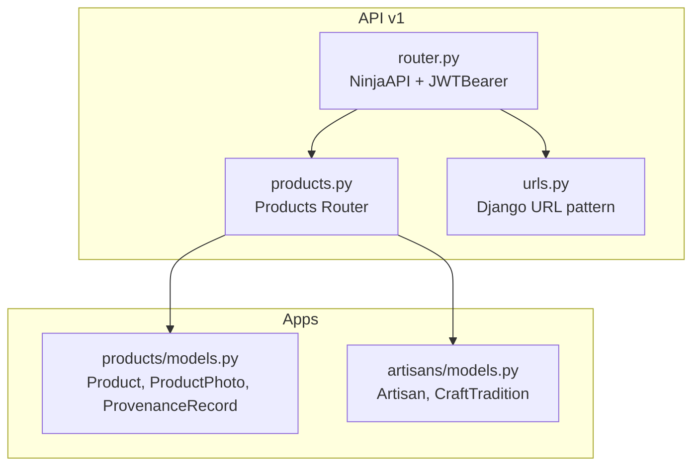
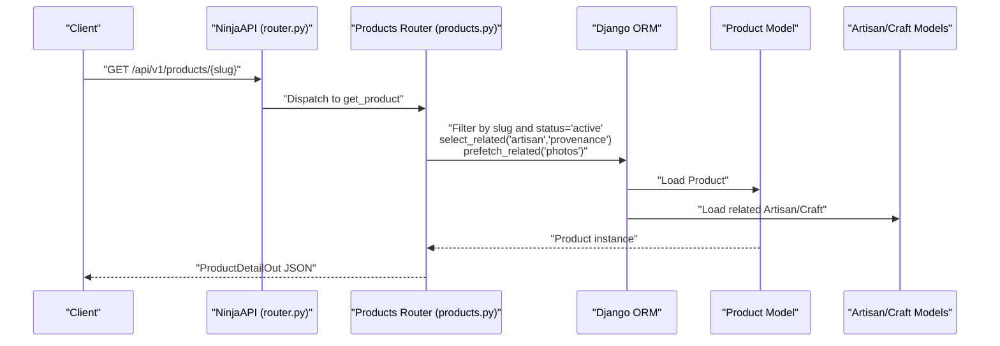
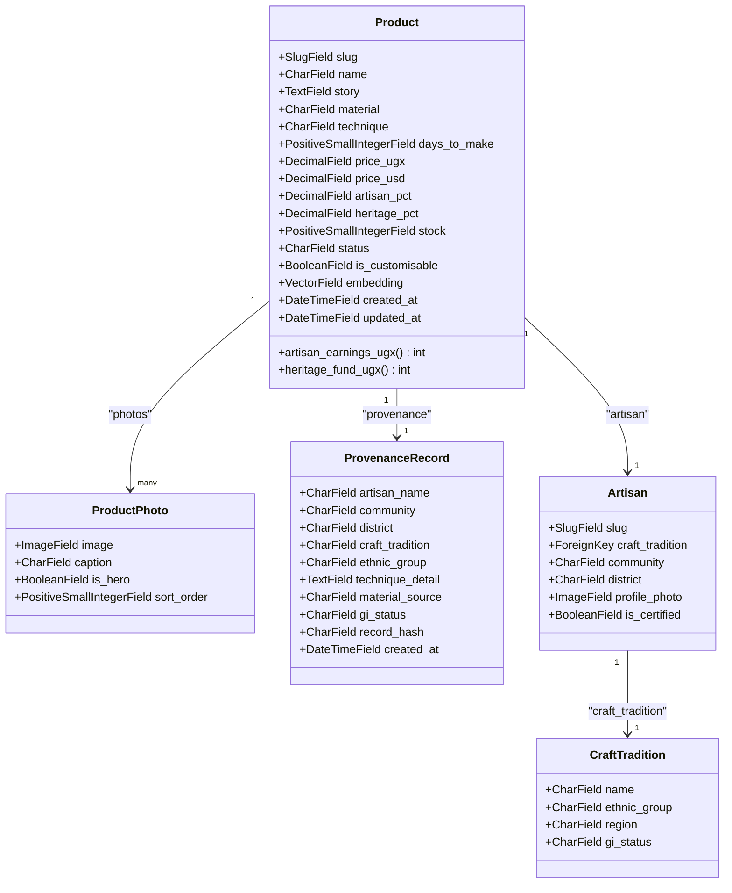
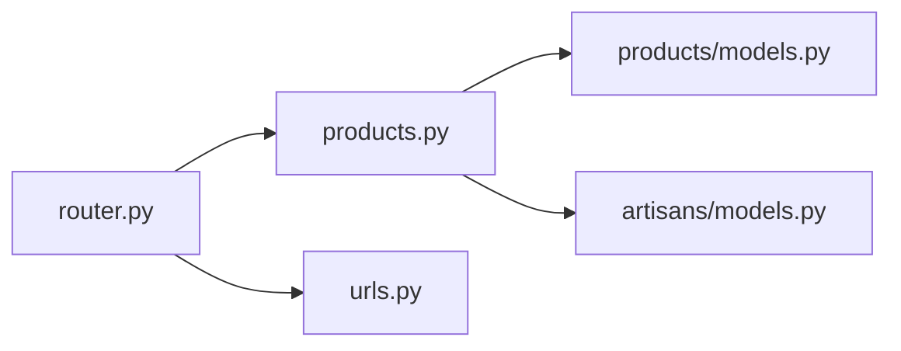

# Product Catalog Endpoints

<cite>
**Referenced Files in This Document**
- [products.py](file://backend/api/v1/products.py)
- [models.py](file://backend/apps/products/models.py)
- [router.py](file://backend/api/v1/router.py)
- [urls.py](file://backend/api/v1/urls.py)
- [artisans_models.py](file://backend/apps/artisans/models.py)
</cite>

## Table of Contents
1. [Introduction](#introduction)
2. [Project Structure](#project-structure)
3. [Core Components](#core-components)
4. [Architecture Overview](#architecture-overview)
5. [Detailed Component Analysis](#detailed-component-analysis)
6. [Dependency Analysis](#dependency-analysis)
7. [Performance Considerations](#performance-considerations)
8. [Troubleshooting Guide](#troubleshooting-guide)
9. [Conclusion](#conclusion)
10. [Appendices](#appendices)

## Introduction
This document provides comprehensive API documentation for the product catalog endpoints. It covers product listing, search and discovery, product detail retrieval, and the underlying data models. It also outlines workflows for product creation, editing, and deletion from the perspective of the API surface, along with inventory management, pricing updates, availability status, and search capabilities including full-text search and vector similarity search. Guidance is included for advanced filtering, sorting, pagination, validation, media handling, and SEO-friendly URL generation.

## Project Structure
The product catalog API is implemented under the Django backend using the Ninja framework. The API v1 router aggregates sub-routers for products, artisans, orders, and gifting. Product endpoints are defined in the products router module and rely on models in the products and artisans apps.



**Diagram sources**
- [router.py:1-40](file://backend/api/v1/router.py#L1-L40)
- [products.py:1-191](file://backend/api/v1/products.py#L1-L191)
- [urls.py:1-10](file://backend/api/v1/urls.py#L1-L10)
- [models.py:1-153](file://backend/apps/products/models.py#L1-L153)
- [artisans_models.py:1-170](file://backend/apps/artisans/models.py#L1-L170)

**Section sources**
- [router.py:1-40](file://backend/api/v1/router.py#L1-L40)
- [urls.py:1-10](file://backend/api/v1/urls.py#L1-L10)

## Core Components
- Products Router: Defines public product endpoints for listing and detail retrieval, with filtering and pagination.
- Product Model: Core entity with story-first content, multilingual fields, pricing, inventory, and semantic embeddings.
- Product Photo Model: Multiple images per product with hero image designation and ordering.
- Provenance Record Model: Immutable cultural attribution snapshot linked to a product.
- Artisan and Craft Tradition Models: Relationship anchors for products and filtering facets.

Key endpoint coverage:
- GET /api/v1/products/{slug}: Retrieve product detail with artisan, provenance, and photos.
- GET /api/v1/products/: List products with filters and pagination.

**Section sources**
- [products.py:74-191](file://backend/api/v1/products.py#L74-L191)
- [models.py:10-153](file://backend/apps/products/models.py#L10-L153)
- [artisans_models.py:62-170](file://backend/apps/artisans/models.py#L62-L170)

## Architecture Overview
The product catalog API follows a layered architecture:
- Router layer: Exposes endpoints via NinjaAPI with JWT authentication.
- Endpoint layer: Implements product listing and detail retrieval with filtering and pagination.
- Data access layer: Uses Django ORM queries with select_related and prefetch_related for performance.
- Domain models: Define product attributes, relationships, and computed fields.



**Diagram sources**
- [router.py:22-28](file://backend/api/v1/router.py#L22-L28)
- [products.py:74-124](file://backend/api/v1/products.py#L74-L124)

## Detailed Component Analysis

### Product Listing Endpoint
- Path: GET /api/v1/products/
- Authentication: Public (auth=None)
- Query parameters:
  - craft_type: Filter by craft tradition name (case-insensitive substring).
  - region: Filter by artisan district (case-insensitive substring).
  - min_usd: Minimum price filter in USD.
  - max_usd: Maximum price filter in USD.
  - artisan_slug: Filter by artisan slug.
  - page: Page number (default 1).
  - page_size: Items per page (default 24).
- Response: Array of ProductListOut items.
- Behavior:
  - Filters active products.
  - Applies optional filters.
  - Paginates results.
  - Selects related fields and hero photo for efficient rendering.

Example request:
- GET /api/v1/products/?craft_type=basket&min_usd=10&max_usd=100&page=1&page_size=24

Response shape highlights:
- id, slug, name, truncated story, prices, artisan details, and hero photo URL.

**Section sources**
- [products.py:126-191](file://backend/api/v1/products.py#L126-L191)

### Product Detail Endpoint
- Path: GET /api/v1/products/{slug}
- Authentication: Public (auth=None)
- Path parameter:
  - slug: Product slug.
- Response: ProductDetailOut.
- Behavior:
  - Retrieves active product with related artisan, craft tradition, provenance, and photos.
  - Returns story, materials, techniques, pricing, earnings, heritage fund allocation, stock, customization flag, and media.

Example request:
- GET /api/v1/products/kiganda-basket-001

Response shape highlights:
- Complete product details, artisan brief, provenance snapshot, and photo gallery.

**Section sources**
- [products.py:74-124](file://backend/api/v1/products.py#L74-L124)

### Data Models Overview


**Diagram sources**
- [models.py:10-153](file://backend/apps/products/models.py#L10-L153)
- [artisans_models.py:62-170](file://backend/apps/artisans/models.py#L62-L170)

**Section sources**
- [models.py:10-153](file://backend/apps/products/models.py#L10-L153)
- [artisans_models.py:14-44](file://backend/apps/artisans/models.py#L14-L44)

### Filtering, Sorting, and Pagination
- Filtering:
  - craft_type: Name of craft tradition (substring match).
  - region: District of artisan (substring match).
  - min_usd/max_usd: Price range in USD.
  - artisan_slug: Specific artisan.
- Sorting:
  - Default ordering for Product is by created_at descending.
- Pagination:
  - page and page_size parameters control pagination.

```mermaid
flowchart TD
Start(["Request /api/v1/products"]) --> BuildQS["Build QuerySet for active products"]
BuildQS --> ApplyFilters{"Any filters?"}
ApplyFilters --> |craft_type| FilterCraft["Filter by craft tradition name"]
ApplyFilters --> |region| FilterRegion["Filter by artisan district"]
ApplyFilters --> |min_usd|max_usd| FilterPrice["Filter by price range"]
ApplyFilters --> |artisan_slug| FilterArtisan["Filter by artisan slug"]
ApplyFilters --> |No| Paginate
FilterCraft --> Paginate
FilterRegion --> Paginate
FilterPrice --> Paginate
FilterArtisan --> Paginate
Paginate["Paginate with page/page_size"] --> Serialize["Serialize ProductListOut"]
Serialize --> End(["Return JSON"])
```

**Diagram sources**
- [products.py:126-191](file://backend/api/v1/products.py#L126-L191)

**Section sources**
- [products.py:126-191](file://backend/api/v1/products.py#L126-L191)

### Search Capabilities
- Full-text search:
  - Implemented via case-insensitive substring matches on craft tradition name and artisan district.
- Vector similarity search:
  - Product embedding field is present for semantic search; however, dedicated vector search endpoints are not exposed in the current products router.
- Multi-language support:
  - Product story and artisan bio support Luganda and Swahili variants.
  - Craft tradition and artisan models include translation fields.

Note: Dedicated search endpoints (e.g., vector similarity) are not defined in the current products router. They can be added in future iterations.

**Section sources**
- [products.py:148-157](file://backend/api/v1/products.py#L148-L157)
- [models.py:34-44](file://backend/apps/products/models.py#L34-L44)
- [artisans_models.py:20-22](file://backend/apps/artisans/models.py#L20-L22)
- [artisans_models.py:88-90](file://backend/apps/artisans/models.py#L88-L90)

### Inventory Management, Pricing, and Availability
- Inventory:
  - stock field indicates quantity available.
  - status field supports draft, active, sold_out, archived.
- Pricing:
  - price_ugx and price_usd define pricing tiers.
  - Computed fields: artisan_earnings_ugx and heritage_fund_ugx derived from price and configured percentages.
- Availability:
  - Sold out products can be marked with status=sold_out.

These fields are returned in product responses and can be updated via administrative endpoints (not defined in the current products router).

**Section sources**
- [models.py:55-70](file://backend/apps/products/models.py#L55-L70)
- [models.py:88-96](file://backend/apps/products/models.py#L88-L96)

### Content Management and Media Handling
- Story-first content:
  - Product story and artisan bio support multiple languages.
  - Draft fields capture voice transcription drafts with timestamps.
- Media:
  - ProductPhoto model supports multiple images per product with hero designation and ordering.
  - Upload paths are configurable via ImageField settings.

**Section sources**
- [models.py:36-44](file://backend/apps/products/models.py#L36-L44)
- [models.py:102-119](file://backend/apps/products/models.py#L102-L119)
- [artisans_models.py:87-95](file://backend/apps/artisans/models.py#L87-L95)

### SEO-Friendly URLs and Validation
- SEO-friendly URLs:
  - Products use slugs for canonical URLs.
  - Artisans also use slugs for profile URLs.
- Validation:
  - Slug uniqueness is enforced at model level.
  - Product status ensures only active listings are served via public endpoints.

**Section sources**
- [models.py:32-33](file://backend/apps/products/models.py#L32-L33)
- [artisans_models.py:79](file://backend/apps/artisans/models.py#L79)

## Dependency Analysis


**Diagram sources**
- [router.py:30-39](file://backend/api/v1/router.py#L30-L39)
- [products.py:8-9](file://backend/api/v1/products.py#L8-L9)

**Section sources**
- [router.py:30-39](file://backend/api/v1/router.py#L30-L39)
- [products.py:8-9](file://backend/api/v1/products.py#L8-L9)

## Performance Considerations
- Efficient queries:
  - select_related for artisan and craft tradition reduces N+1 queries.
  - prefetch_related for photos loads all images in a single query.
- Pagination:
  - Paginator limits result set size and enables scalable browsing.
- Embeddings:
  - VectorField is available for semantic search; consider indexing and vector search endpoints for improved performance.

[No sources needed since this section provides general guidance]

## Troubleshooting Guide
Common issues and resolutions:
- 404 Not Found:
  - Product slug does not exist or is not active.
- 401 Unauthorized:
  - JWT token missing or invalid for protected endpoints.
- Empty results:
  - Verify filters (craft_type, region, min_usd, max_usd, artisan_slug) align with existing data.
- Slow responses:
  - Ensure filters are applied to reduce result sets; avoid overly broad queries.

**Section sources**
- [products.py:74-124](file://backend/api/v1/products.py#L74-L124)
- [router.py:10-18](file://backend/api/v1/router.py#L10-L18)

## Conclusion
The product catalog API provides robust public endpoints for browsing and discovering artisan-made products with rich filtering, pagination, and SEO-friendly URLs. The underlying models support story-first content, multilingual fields, media handling, provenance records, and embedded semantic vectors. Future enhancements can include dedicated vector similarity search endpoints and administrative CRUD endpoints for product lifecycle management.

[No sources needed since this section summarizes without analyzing specific files]

## Appendices

### API Definitions

- Base URL: /api/v1
- Authentication: JWT Bearer tokens for protected endpoints; public for product listing/detail.

Endpoints:
- GET /products/{slug}
  - Description: Retrieve product detail with artisan, provenance, and photos.
  - Path parameters:
    - slug: Product slug.
  - Response: ProductDetailOut.

- GET /products/
  - Description: List products with optional filters and pagination.
  - Query parameters:
    - craft_type: String (substring match on craft tradition name).
    - region: String (substring match on artisan district).
    - min_usd: Number (USD).
    - max_usd: Number (USD).
    - artisan_slug: String.
    - page: Integer (default 1).
    - page_size: Integer (default 24).
  - Response: Array of ProductListOut.

Example requests:
- GET /api/v1/products/kiganda-basket-001
- GET /api/v1/products/?craft_type=basket&min_usd=10&max_usd=100&page=1&page_size=24

[No sources needed since this section provides general guidance]