# Admin Interface

<cite>
**Referenced Files in This Document**
- [Admin.tsx](file://src/pages/Admin.tsx)
- [AnalyticsDashboard.tsx](file://src/components/admin/AnalyticsDashboard.tsx)
- [ArtisansManager.tsx](file://src/components/admin/ArtisansManager.tsx)
- [ProductsManager.tsx](file://src/components/admin/ProductsManager.tsx)
- [OrdersManager.tsx](file://src/components/admin/OrdersManager.tsx)
- [ReturnsManager.tsx](file://src/components/admin/ReturnsManager.tsx)
- [PickupLocationsManager.tsx](file://src/components/admin/PickupLocationsManager.tsx)
- [UsersManager.tsx](file://src/components/admin/UsersManager.tsx)
- [CorporateGiftingManager.tsx](file://src/components/admin/CorporateGiftingManager.tsx)
- [useAdminData.tsx](file://src/hooks/useAdminData.tsx)
</cite>

## Table of Contents
1. [Introduction](#introduction)
2. [Project Structure](#project-structure)
3. [Core Components](#core-components)
4. [Architecture Overview](#architecture-overview)
5. [Detailed Component Analysis](#detailed-component-analysis)
6. [Dependency Analysis](#dependency-analysis)
7. [Performance Considerations](#performance-considerations)
8. [Troubleshooting Guide](#troubleshooting-guide)
9. [Conclusion](#conclusion)

## Introduction
This document describes the Django Unfold-powered admin interface and custom admin panels for the Empindu platform. It covers analytics dashboards, user management, operational oversight, branded design, custom forms, data visualization, artisan management, product moderation, order processing, corporate gifting, returns handling, content moderation workflows, analytics reporting, user behavior tracking, operational metrics, permissions, audit trails, and administrative security. It also documents customization and integration capabilities with the broader platform.

## Project Structure
The admin interface is implemented as a React-based SPA integrated with Supabase for data and serverless functions for notifications. The Admin page orchestrates multiple tabbed managers for analytics, orders, returns, artisans, products, locations, users, and corporate gifting. Supporting hooks centralize data fetching and mutations.

```mermaid
graph TB
AdminPage["Admin Page<br/>src/pages/Admin.tsx"] --> Analytics["Analytics Dashboard<br/>src/components/admin/AnalyticsDashboard.tsx"]
AdminPage --> Orders["Orders Manager<br/>src/components/admin/OrdersManager.tsx"]
AdminPage --> Returns["Returns Manager<br/>src/components/admin/ReturnsManager.tsx"]
AdminPage --> Artisans["Artisans Manager<br/>src/components/admin/ArtisansManager.tsx"]
AdminPage --> Products["Products Manager<br/>src/components/admin/ProductsManager.tsx"]
AdminPage --> Locations["Pickup Locations Manager<br/>src/components/admin/PickupLocationsManager.tsx"]
AdminPage --> Users["Users Manager<br/>src/components/admin/UsersManager.tsx"]
AdminPage --> Gifting["Corporate Gifting Manager<br/>src/components/admin/CorporateGiftingManager.tsx"]
Analytics --> Hook["Admin Data Hook<br/>src/hooks/useAdminData.tsx"]
Orders --> Supabase["Supabase Client<br/>src/integrations/supabase/client.ts"]
Returns --> Supabase
Artisans --> Supabase
Products --> Supabase
Locations --> Supabase
Users --> Supabase
Gifting --> Supabase
```

**Diagram sources**
- [Admin.tsx:18-162](file://src/pages/Admin.tsx#L18-L162)
- [AnalyticsDashboard.tsx:21-225](file://src/components/admin/AnalyticsDashboard.tsx#L21-L225)
- [OrdersManager.tsx:52-341](file://src/components/admin/OrdersManager.tsx#L52-L341)
- [ReturnsManager.tsx:68-412](file://src/components/admin/ReturnsManager.tsx#L68-L412)
- [ArtisansManager.tsx:34-215](file://src/components/admin/ArtisansManager.tsx#L34-L215)
- [ProductsManager.tsx:41-233](file://src/components/admin/ProductsManager.tsx#L41-L233)
- [PickupLocationsManager.tsx:41-418](file://src/components/admin/PickupLocationsManager.tsx#L41-L418)
- [UsersManager.tsx:33-292](file://src/components/admin/UsersManager.tsx#L33-L292)
- [CorporateGiftingManager.tsx:29-362](file://src/components/admin/CorporateGiftingManager.tsx#L29-L362)
- [useAdminData.tsx:27-167](file://src/hooks/useAdminData.tsx#L27-L167)

**Section sources**
- [Admin.tsx:18-162](file://src/pages/Admin.tsx#L18-L162)

## Core Components
- Admin Page: Orchestrates tabbed views for analytics, orders, returns, artisans, products, locations, users, and corporate gifting. Handles authentication and role checks.
- Analytics Dashboard: Renders platform statistics and charts for product categories and distribution.
- Orders Manager: Lists orders, filters by status, updates status, and shows order details with items and shipping info.
- Returns Manager: Manages return requests, approves/rejects, schedules pickups, records receipts and refunds, and maintains admin notes.
- Artisans Manager: Searches and verifies/unverifies artisan profiles with confirmation dialogs.
- Products Manager: Filters products by category and search, toggles visibility, and deletes products with confirmation.
- Pickup Locations Manager: CRUD operations for pickup locations with activation toggle and validation.
- Users Manager: Lists users, filters/searches, and changes roles with confirmation and warnings for admin role.
- Corporate Gifting Manager: Manages corporate gift orders, updates statuses, shows timeline, and sends notifications.
- Admin Data Hook: Fetches artisans, products, and platform stats; exposes actions to verify artisans, toggle product availability, and delete products.

**Section sources**
- [Admin.tsx:18-162](file://src/pages/Admin.tsx#L18-L162)
- [AnalyticsDashboard.tsx:21-225](file://src/components/admin/AnalyticsDashboard.tsx#L21-L225)
- [OrdersManager.tsx:52-341](file://src/components/admin/OrdersManager.tsx#L52-L341)
- [ReturnsManager.tsx:68-412](file://src/components/admin/ReturnsManager.tsx#L68-L412)
- [ArtisansManager.tsx:34-215](file://src/components/admin/ArtisansManager.tsx#L34-L215)
- [ProductsManager.tsx:41-233](file://src/components/admin/ProductsManager.tsx#L41-L233)
- [PickupLocationsManager.tsx:41-418](file://src/components/admin/PickupLocationsManager.tsx#L41-L418)
- [UsersManager.tsx:33-292](file://src/components/admin/UsersManager.tsx#L33-L292)
- [CorporateGiftingManager.tsx:29-362](file://src/components/admin/CorporateGiftingManager.tsx#L29-L362)
- [useAdminData.tsx:27-167](file://src/hooks/useAdminData.tsx#L27-L167)

## Architecture Overview
The admin interface is a client-side React application that integrates with:
- Supabase for real-time data and authentication
- Supabase Edge Functions for sending order and gift emails
- TanStack Query for caching and optimistic updates
- React Hook Form patterns for controlled forms and validation
- Tailwind CSS and shadcn/ui components for UI consistency

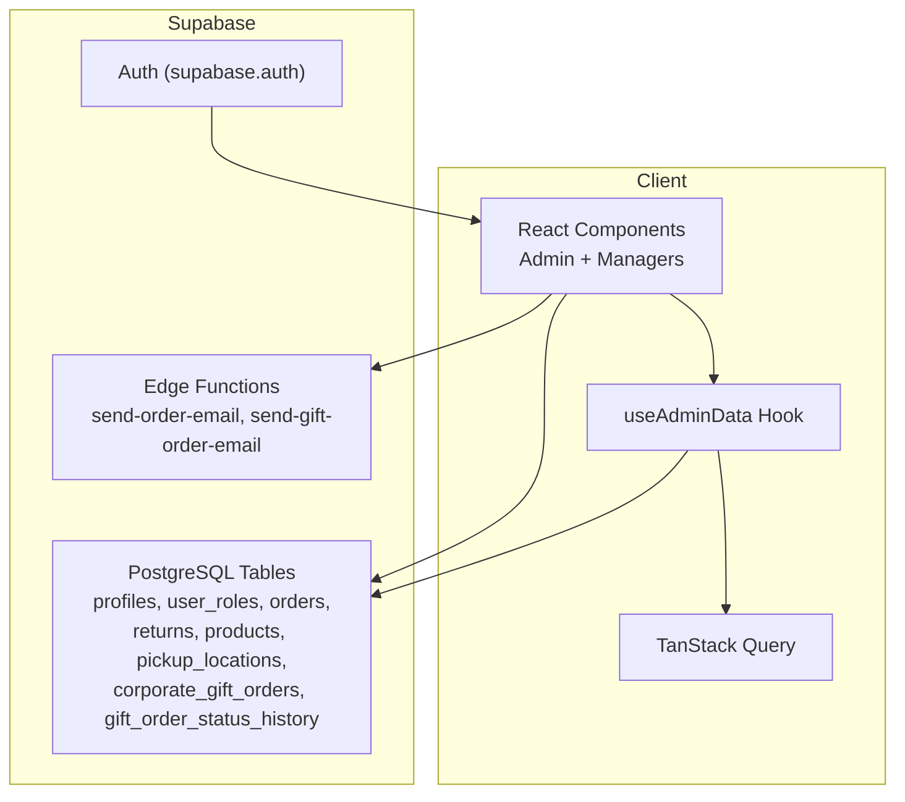

**Diagram sources**
- [Admin.tsx:18-162](file://src/pages/Admin.tsx#L18-L162)
- [OrdersManager.tsx:117-152](file://src/components/admin/OrdersManager.tsx#L117-L152)
- [CorporateGiftingManager.tsx:76-113](file://src/components/admin/CorporateGiftingManager.tsx#L76-L113)
- [useAdminData.tsx:27-167](file://src/hooks/useAdminData.tsx#L27-L167)

## Detailed Component Analysis

### Analytics Dashboard
- Purpose: Provide platform overview with key metrics and visualizations.
- Metrics: Total artisans, verified artisans, total products, available products, total buyers, categories count.
- Visualizations: Bar chart and pie chart of products by category; summary cards with verification and availability rates.
- Data source: Platform stats computed by the admin data hook.

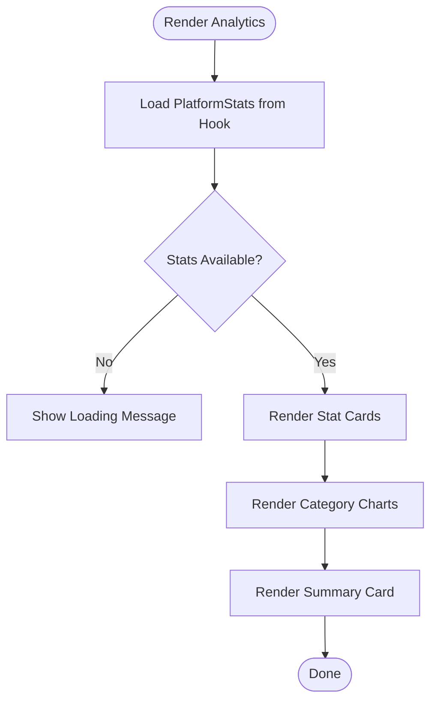

**Diagram sources**
- [AnalyticsDashboard.tsx:21-225](file://src/components/admin/AnalyticsDashboard.tsx#L21-L225)
- [useAdminData.tsx:59-107](file://src/hooks/useAdminData.tsx#L59-L107)

**Section sources**
- [AnalyticsDashboard.tsx:21-225](file://src/components/admin/AnalyticsDashboard.tsx#L21-L225)
- [useAdminData.tsx:18-25](file://src/hooks/useAdminData.tsx#L18-L25)

### Orders Manager
- Purpose: Oversee and process orders end-to-end.
- Features: Search by order ID/city, filter by status, update status, view order details with items and shipping info, send status emails via Supabase functions.
- Data: Orders, order items, buyer profiles, and derived buyer email map.

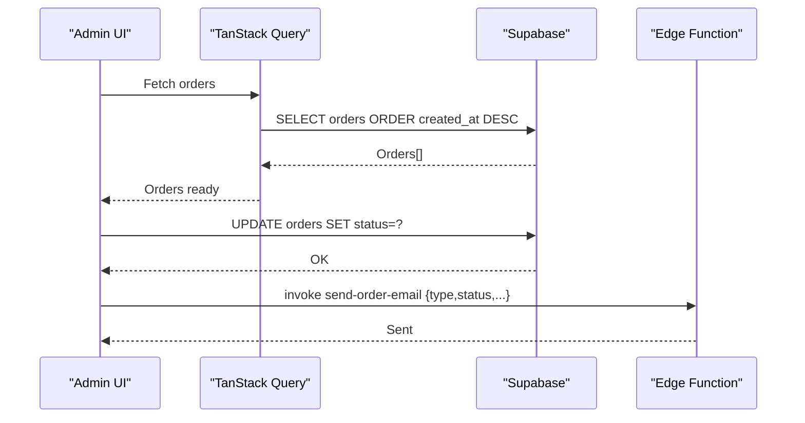

**Diagram sources**
- [OrdersManager.tsx:58-152](file://src/components/admin/OrdersManager.tsx#L58-L152)
- [OrdersManager.tsx:117-152](file://src/components/admin/OrdersManager.tsx#L117-L152)

**Section sources**
- [OrdersManager.tsx:52-341](file://src/components/admin/OrdersManager.tsx#L52-L341)

### Returns Manager
- Purpose: Handle returns lifecycle from request to refund.
- Features: Filter by status and search, approve/reject, schedule pickup, mark received/refunded, record admin notes and refund amounts.
- Data: Returns with nested order and return items; buyer profiles mapped by buyer_id.

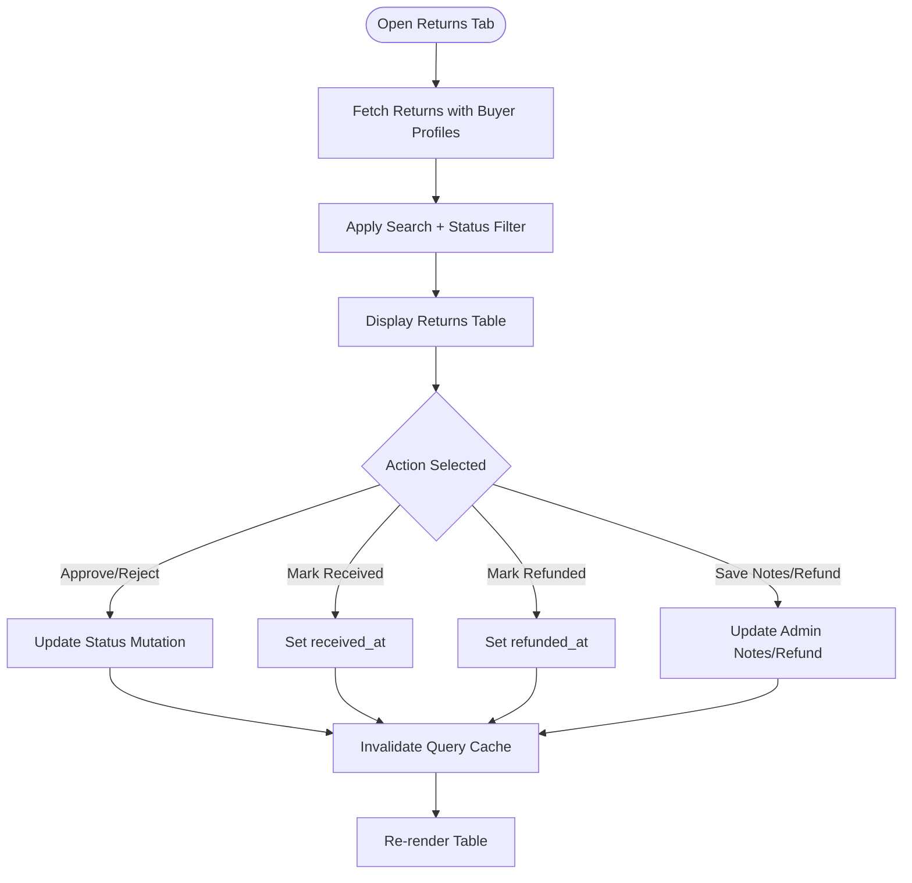

**Diagram sources**
- [ReturnsManager.tsx:78-148](file://src/components/admin/ReturnsManager.tsx#L78-L148)

**Section sources**
- [ReturnsManager.tsx:68-412](file://src/components/admin/ReturnsManager.tsx#L68-L412)

### Artisans Manager
- Purpose: Verify/unverify artisan profiles and search/filter by specialty/location.
- UX: Confirmation dialogs for verification actions; badges for verification status; avatar fallbacks.

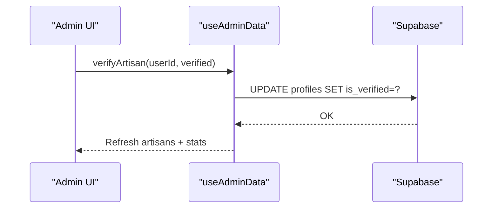

**Diagram sources**
- [ArtisansManager.tsx:48-66](file://src/components/admin/ArtisansManager.tsx#L48-L66)
- [useAdminData.tsx:109-120](file://src/hooks/useAdminData.tsx#L109-L120)

**Section sources**
- [ArtisansManager.tsx:34-215](file://src/components/admin/ArtisansManager.tsx#L34-L215)
- [useAdminData.tsx:27-48](file://src/hooks/useAdminData.tsx#L27-L48)

### Products Manager
- Purpose: Moderate products by toggling availability and deleting listings.
- UX: Category filter, search by name/description, visibility badges, confirmation dialogs.

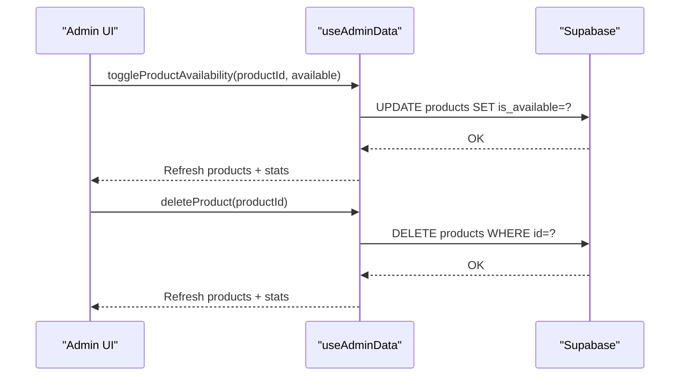

**Diagram sources**
- [ProductsManager.tsx:57-80](file://src/components/admin/ProductsManager.tsx#L57-L80)
- [useAdminData.tsx:122-146](file://src/hooks/useAdminData.tsx#L122-L146)

**Section sources**
- [ProductsManager.tsx:41-233](file://src/components/admin/ProductsManager.tsx#L41-L233)
- [useAdminData.tsx:50-57](file://src/hooks/useAdminData.tsx#L50-L57)

### Pickup Locations Manager
- Purpose: Manage pickup locations for logistics and order fulfillment.
- Features: Create/edit/update locations, toggle active state, delete with confirmation, form validation.

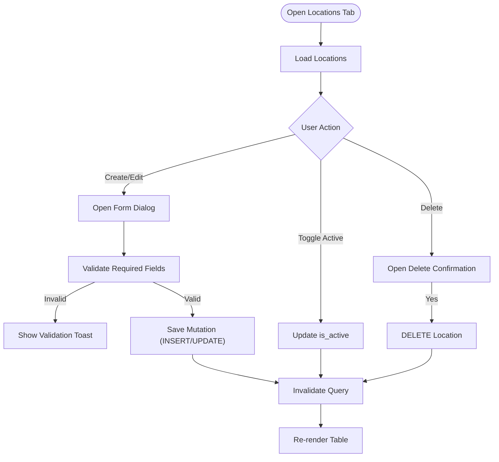

**Diagram sources**
- [PickupLocationsManager.tsx:50-143](file://src/components/admin/PickupLocationsManager.tsx#L50-L143)

**Section sources**
- [PickupLocationsManager.tsx:41-418](file://src/components/admin/PickupLocationsManager.tsx#L41-L418)

### Users Manager
- Purpose: View and manage user roles across buyer, artisan, and admin.
- Security: Confirmation dialog warns about granting admin privileges; badges represent roles; search by name/user_id.

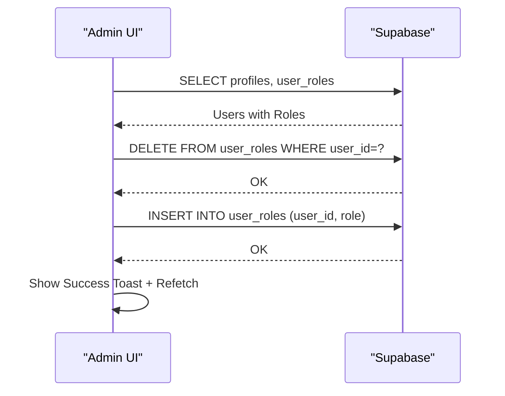

**Diagram sources**
- [UsersManager.tsx:45-123](file://src/components/admin/UsersManager.tsx#L45-L123)

**Section sources**
- [UsersManager.tsx:33-292](file://src/components/admin/UsersManager.tsx#L33-L292)

### Corporate Gifting Manager
- Purpose: Oversee corporate gift orders from inquiry to delivery.
- Features: Status updates, admin notes, recipient lists, gift items, estimated totals, status history timeline, email notifications.

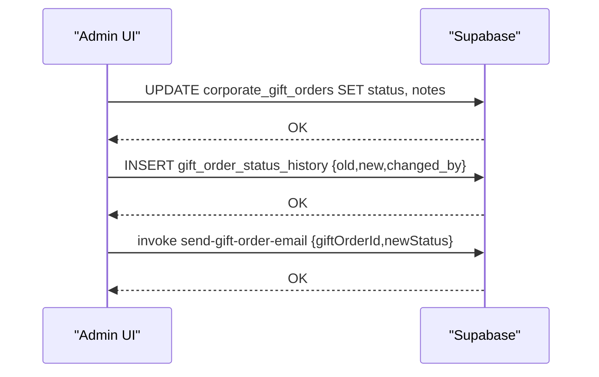

**Diagram sources**
- [CorporateGiftingManager.tsx:76-113](file://src/components/admin/CorporateGiftingManager.tsx#L76-L113)

**Section sources**
- [CorporateGiftingManager.tsx:29-362](file://src/components/admin/CorporateGiftingManager.tsx#L29-L362)

### Conceptual Overview
- Authentication and Authorization: The Admin page enforces admin-only access using route guards and role checks.
- Data Fetching and Caching: TanStack Query manages queries for orders, returns, locations, gift orders, and buyer profiles with automatic invalidation on mutations.
- Notifications: Email notifications are triggered via Supabase Edge Functions after order and gift status changes.
- Audit Trails: Corporate gift orders maintain a status history table to track changes with who changed the status.

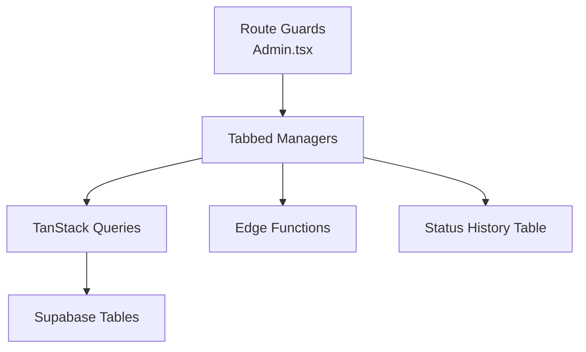

[No sources needed since this diagram shows conceptual workflow, not actual code structure]

[No sources needed since this section doesn't analyze specific source files]

## Dependency Analysis
- Component Coupling:
  - Admin page depends on multiple manager components and the admin data hook.
  - Managers depend on Supabase client and TanStack Query for data operations.
  - Corporate Gifting Manager additionally depends on a timeline component and Supabase functions.
- Cohesion:
  - Each manager encapsulates a domain area (orders, returns, artisans, etc.) with focused UI and data logic.
- External Dependencies:
  - Supabase for database, auth, and edge functions.
  - TanStack Query for caching and optimistic updates.
  - React Query for reactive data fetching.

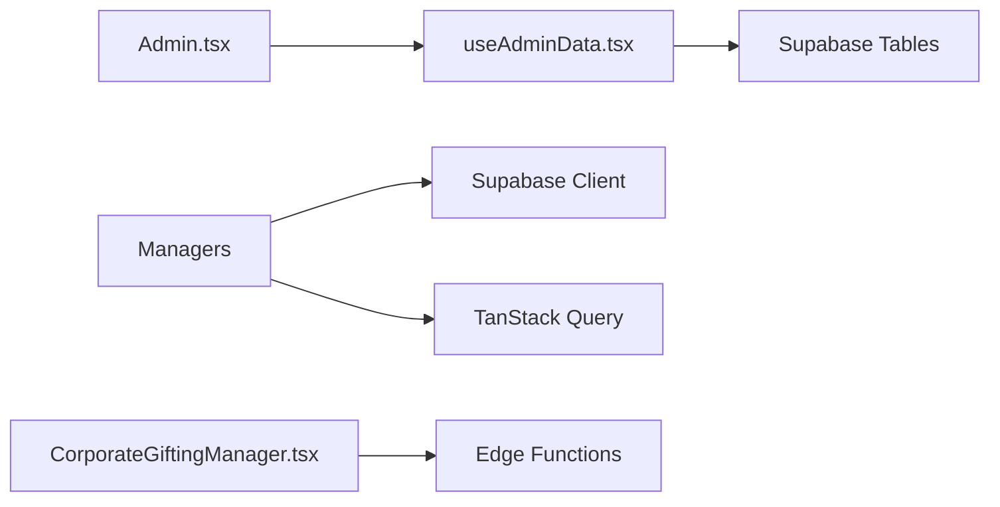

**Diagram sources**
- [Admin.tsx:18-162](file://src/pages/Admin.tsx#L18-L162)
- [useAdminData.tsx:27-167](file://src/hooks/useAdminData.tsx#L27-L167)
- [CorporateGiftingManager.tsx:76-113](file://src/components/admin/CorporateGiftingManager.tsx#L76-L113)

**Section sources**
- [Admin.tsx:18-162](file://src/pages/Admin.tsx#L18-L162)
- [useAdminData.tsx:27-167](file://src/hooks/useAdminData.tsx#L27-L167)

## Performance Considerations
- Use TanStack Query’s query caching to avoid redundant network calls and improve responsiveness.
- Apply server-side filtering and client-side filtering judiciously; paginate large datasets if needed.
- Debounce search inputs to reduce frequent re-fetches.
- Optimize rendering by virtualizing large tables and limiting re-renders with memoization.
- Minimize concurrent mutations to prevent race conditions; rely on query invalidation to synchronize state.

[No sources needed since this section provides general guidance]

## Troubleshooting Guide
- Authentication Failures:
  - Ensure the Admin page redirects unauthenticated users to the auth route and restricts non-admin users.
- Role Change Issues:
  - Verify that role deletion and insertion succeed; check toast messages for errors and confirm refetch of user list.
- Order Status Updates:
  - Confirm that the mutation completes and the email function invocation succeeds; inspect returned errors.
- Returns Processing:
  - Validate that status transitions update timestamps (received_at/refunded_at) and that admin notes are persisted.
- Corporate Gifting Emails:
  - Check that the edge function invocation succeeds and that status history is recorded.
- Data Not Updating:
  - Ensure query cache invalidation occurs after mutations; force refetch if necessary.

**Section sources**
- [Admin.tsx:31-42](file://src/pages/Admin.tsx#L31-L42)
- [UsersManager.tsx:94-123](file://src/components/admin/UsersManager.tsx#L94-L123)
- [OrdersManager.tsx:117-152](file://src/components/admin/OrdersManager.tsx#L117-L152)
- [ReturnsManager.tsx:115-136](file://src/components/admin/ReturnsManager.tsx#L115-L136)
- [CorporateGiftingManager.tsx:76-113](file://src/components/admin/CorporateGiftingManager.tsx#L76-L113)

## Conclusion
The admin interface combines a tabbed React UI with Supabase-backed data and serverless functions to deliver a comprehensive operational dashboard. It supports analytics, order and return workflows, artisan and product moderation, user role management, corporate gifting oversight, and audit trails. With TanStack Query and robust confirmation dialogs, it balances usability with safety and performance.