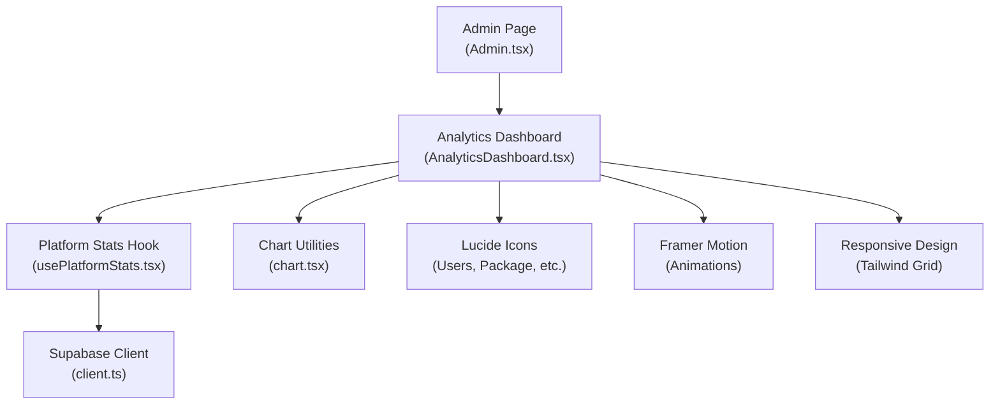
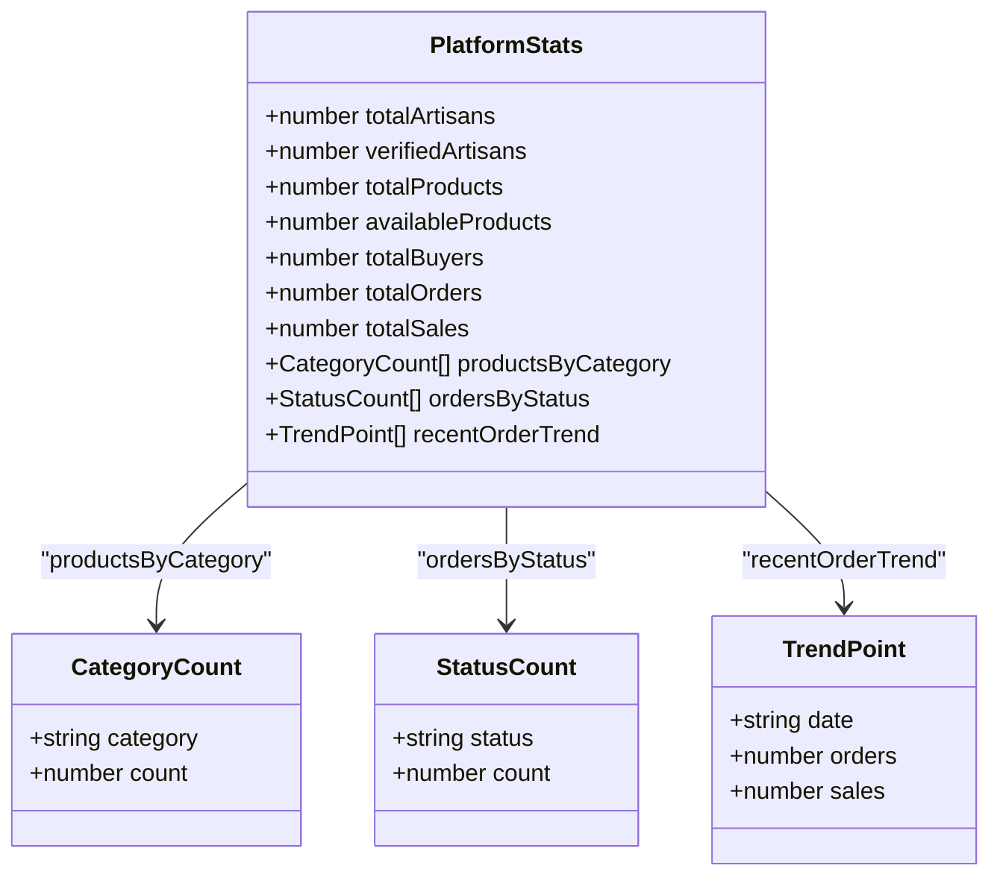
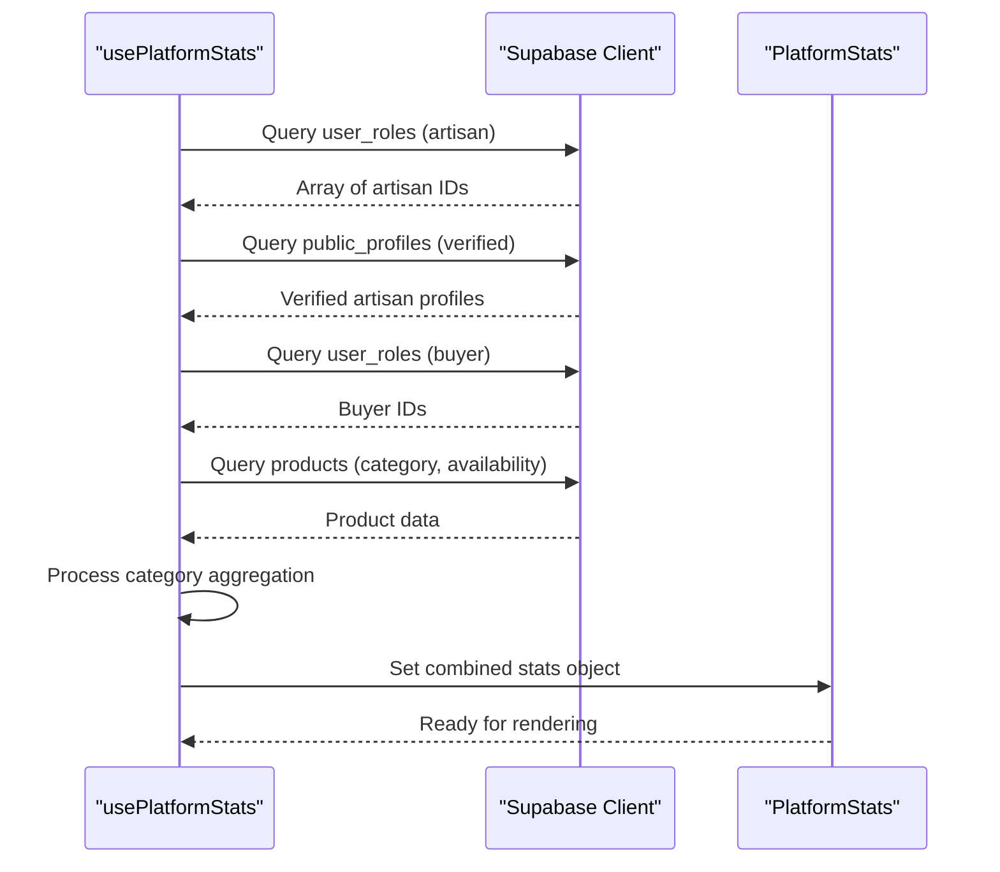
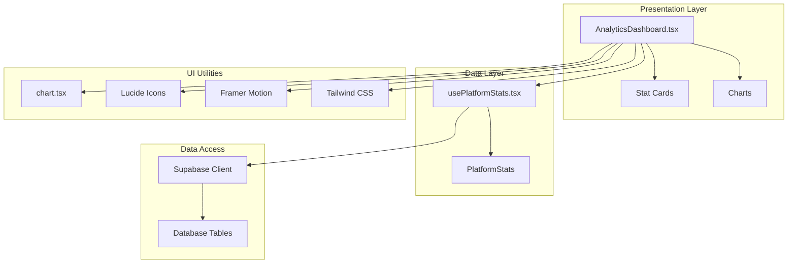
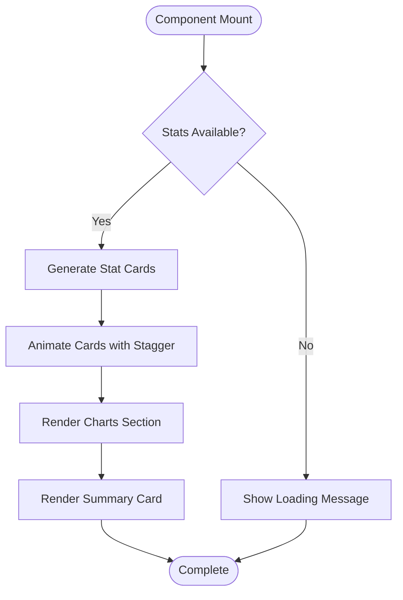
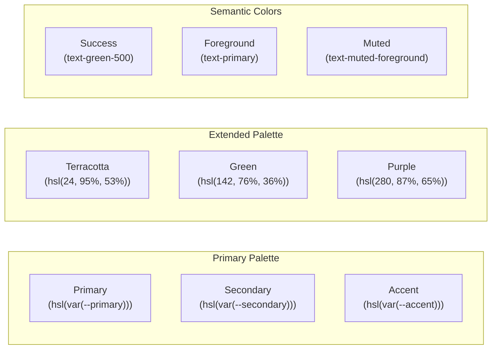
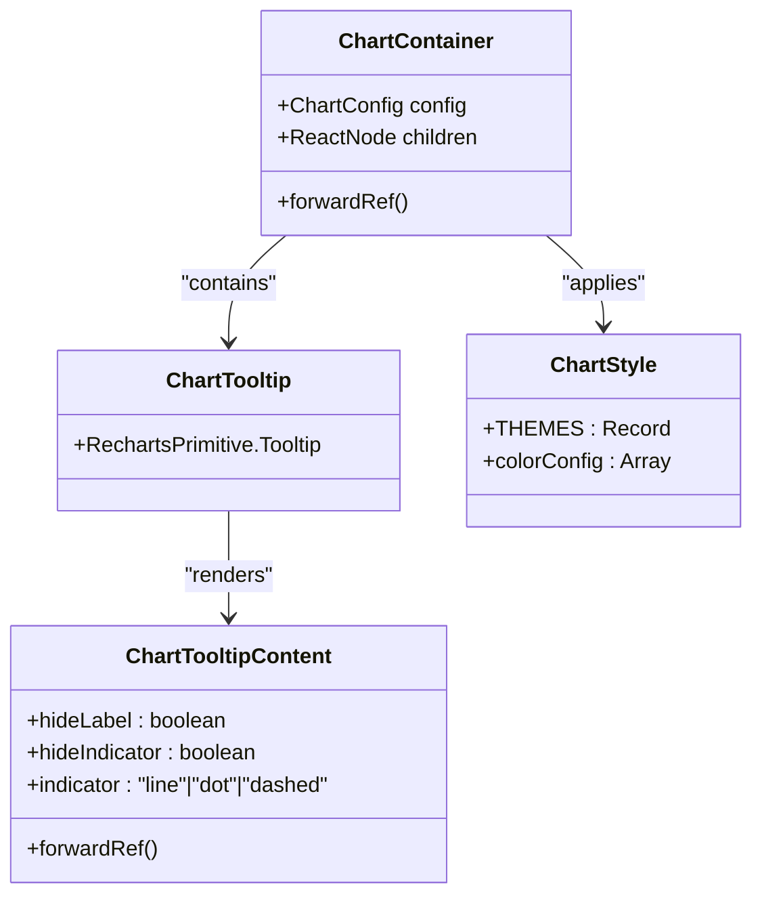
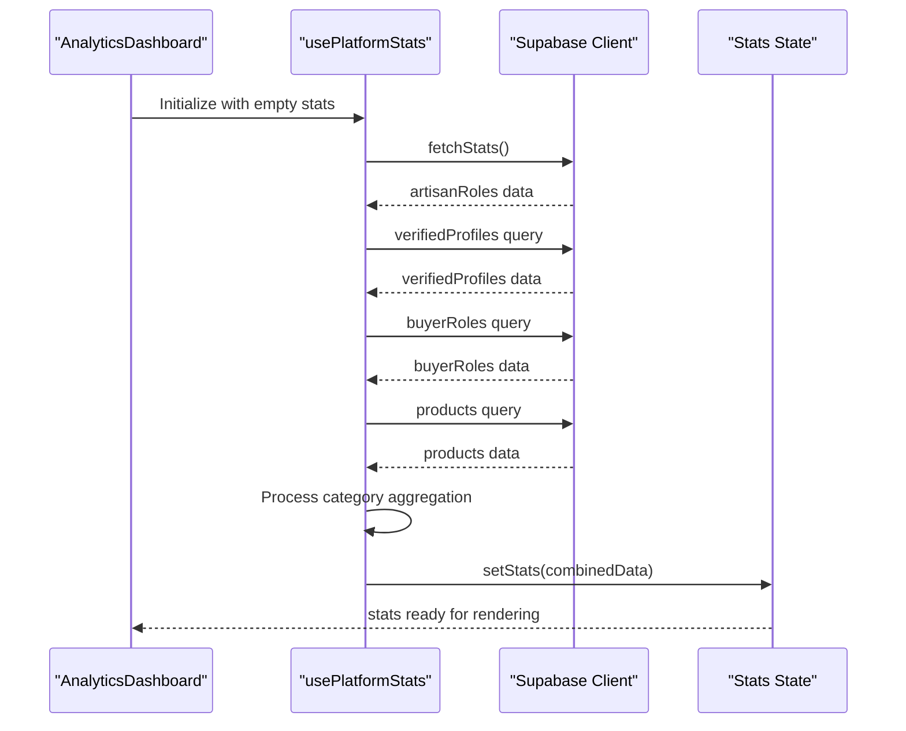
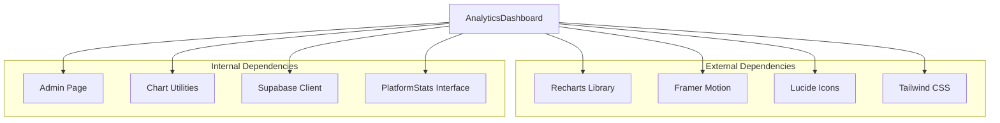

# Analytics Dashboard

<cite>
**Referenced Files in This Document**
- [AnalyticsDashboard.tsx](file://src/components/admin/AnalyticsDashboard.tsx)
- [usePlatformStats.tsx](file://src/hooks/usePlatformStats.tsx)
- [chart.tsx](file://src/components/ui/chart.tsx)
- [Admin.tsx](file://src/pages/Admin.tsx)
- [useAdminData.tsx](file://src/hooks/useAdminData.tsx)
- [client.ts](file://src/integrations/supabase/client.ts)
- [tailwind.config.ts](file://tailwind.config.ts)
- [use-mobile.tsx](file://src/hooks/use-mobile.tsx)
</cite>

## Table of Contents
1. [Introduction](#introduction)
2. [Project Structure](#project-structure)
3. [Core Components](#core-components)
4. [Architecture Overview](#architecture-overview)
5. [Detailed Component Analysis](#detailed-component-analysis)
6. [Dependency Analysis](#dependency-analysis)
7. [Performance Considerations](#performance-considerations)
8. [Troubleshooting Guide](#troubleshooting-guide)
9. [Conclusion](#conclusion)

## Introduction
This document provides comprehensive documentation for the Analytics Dashboard component, focusing on real-time platform statistics display and data visualization. The dashboard presents key metrics including artisan counts, product availability, buyer metrics, and verification rates. It features animated card layouts, responsive design patterns, and interactive chart components built with Recharts. The documentation covers the PlatformStats interface, data fetching mechanisms, performance optimizations, color schemes, iconography, visual hierarchy, loading states, empty data handling, and accessibility considerations.

## Project Structure
The Analytics Dashboard is part of the admin interface and integrates with several supporting components and hooks:

**Diagram sources**
- [Admin.tsx:18-163](file://src/pages/Admin.tsx#L18-L163)
- [AnalyticsDashboard.tsx:1-226](file://src/components/admin/AnalyticsDashboard.tsx#L1-L226)
- [usePlatformStats.tsx:17-93](file://src/hooks/usePlatformStats.tsx#L17-L93)
- [chart.tsx:32-58](file://src/components/ui/chart.tsx#L32-L58)
- [client.ts:11-17](file://src/integrations/supabase/client.ts#L11-L17)

**Section sources**
- [Admin.tsx:18-163](file://src/pages/Admin.tsx#L18-L163)
- [AnalyticsDashboard.tsx:1-226](file://src/components/admin/AnalyticsDashboard.tsx#L1-L226)

## Core Components
The Analytics Dashboard consists of three primary components:

### PlatformStats Interface
The PlatformStats interface defines the data structure for analytics data:

**Diagram sources**
- [usePlatformStats.tsx:4-15](file://src/hooks/usePlatformStats.tsx#L4-L15)

### Data Fetching Hook
The usePlatformStats hook manages data fetching and state management:

**Diagram sources**
- [usePlatformStats.tsx:21-86](file://src/hooks/usePlatformStats.tsx#L21-L86)

**Section sources**
- [usePlatformStats.tsx:4-15](file://src/hooks/usePlatformStats.tsx#L4-L15)
- [usePlatformStats.tsx:17-93](file://src/hooks/usePlatformStats.tsx#L17-L93)

## Architecture Overview
The Analytics Dashboard follows a unidirectional data flow pattern:

**Diagram sources**
- [AnalyticsDashboard.tsx:1-226](file://src/components/admin/AnalyticsDashboard.tsx#L1-L226)
- [usePlatformStats.tsx:17-93](file://src/hooks/usePlatformStats.tsx#L17-L93)
- [chart.tsx:32-58](file://src/components/ui/chart.tsx#L32-L58)

## Detailed Component Analysis

### AnalyticsDashboard Component
The AnalyticsDashboard component renders the complete analytics interface with animated cards and interactive charts.

#### Animated Card Layouts
The dashboard uses Framer Motion for smooth entrance animations and hover effects:

**Diagram sources**
- [AnalyticsDashboard.tsx:21-28](file://src/components/admin/AnalyticsDashboard.tsx#L21-L28)
- [AnalyticsDashboard.tsx:94-116](file://src/components/admin/AnalyticsDashboard.tsx#L94-L116)

#### Data Visualization Components
The dashboard implements two primary chart types:

**Bar Chart for Product Distribution by Category:**
- Uses Recharts BarChart component
- Horizontal orientation with rotated x-axis labels
- Responsive container for adaptive sizing
- Custom tooltip configuration

**Pie Chart for Category Breakdown:**
- Uses Recharts PieChart component
- Circular layout with inner and outer radii
- Custom cell coloring with dynamic color palette
- Percentage-based labels

#### Color Scheme and Visual Hierarchy
The dashboard employs a carefully curated color scheme:

**Diagram sources**
- [AnalyticsDashboard.tsx:12-19](file://src/components/admin/AnalyticsDashboard.tsx#L12-L19)
- [tailwind.config.ts:16-76](file://tailwind.config.ts#L16-L76)

#### Iconography System
The dashboard uses Lucide React icons for visual communication:

| Metric Type | Icon | Purpose |
|-------------|------|---------|
| Total Artisans | Users | Identifies artisan population |
| Verified Artisans | CheckCircle | Indicates verification status |
| Total Products | Package | Represents product inventory |
| Available Products | TrendingUp | Shows product availability |
| Total Buyers | ShoppingBag | Tracks customer base |
| Categories | Award | Denotes product categorization |

**Section sources**
- [AnalyticsDashboard.tsx:1-226](file://src/components/admin/AnalyticsDashboard.tsx#L1-L226)

### Chart Utilities and Configuration
The chart utilities provide reusable components for consistent chart behavior:

**Diagram sources**
- [chart.tsx:32-58](file://src/components/ui/chart.tsx#L32-L58)
- [chart.tsx:90-226](file://src/components/ui/chart.tsx#L90-L226)

**Section sources**
- [chart.tsx:1-304](file://src/components/ui/chart.tsx#L1-L304)

### Data Fetching Mechanisms
The usePlatformStats hook implements efficient data fetching with proper error handling:

**Diagram sources**
- [usePlatformStats.tsx:17-93](file://src/hooks/usePlatformStats.tsx#L17-L93)

**Section sources**
- [usePlatformStats.tsx:17-93](file://src/hooks/usePlatformStats.tsx#L17-L93)

## Dependency Analysis
The Analytics Dashboard has the following key dependencies:

**Diagram sources**
- [AnalyticsDashboard.tsx:1-6](file://src/components/admin/AnalyticsDashboard.tsx#L1-L6)
- [Admin.tsx:11-29](file://src/pages/Admin.tsx#L11-L29)

**Section sources**
- [AnalyticsDashboard.tsx:1-6](file://src/components/admin/AnalyticsDashboard.tsx#L1-L6)
- [Admin.tsx:11-29](file://src/pages/Admin.tsx#L11-L29)

## Performance Considerations
The Analytics Dashboard implements several performance optimizations:

### Data Fetching Optimizations
- Single data source for all metrics reduces network requests
- Efficient category aggregation using Map data structure
- Lazy loading for chart components
- Memoized calculations for derived metrics

### Rendering Optimizations
- Framer Motion animations only trigger on mount
- Responsive charts adapt to container size
- Conditional rendering prevents unnecessary DOM nodes
- CSS transitions for hover effects

### Memory Management
- Proper cleanup of event listeners
- Efficient state updates
- Minimal re-renders through selective updates

## Troubleshooting Guide

### Common Issues and Solutions

#### Loading State Problems
**Issue**: Dashboard shows loading indefinitely
**Solution**: Verify Supabase connection and check network tab for failed requests

#### Empty Data Display
**Issue**: Charts show "No data available" message
**Solution**: Confirm database tables have data and Supabase permissions are configured correctly

#### Chart Rendering Issues
**Issue**: Charts not displaying properly on small screens
**Solution**: Ensure ResponsiveContainer is properly sized and Tailwind breakpoints are configured

#### Animation Performance
**Issue**: Staggered animations causing performance issues
**Solution**: Adjust animation delays or disable animations on lower-powered devices

**Section sources**
- [AnalyticsDashboard.tsx:22-28](file://src/components/admin/AnalyticsDashboard.tsx#L22-L28)
- [AnalyticsDashboard.tsx:144-148](file://src/components/admin/AnalyticsDashboard.tsx#L144-L148)
- [AnalyticsDashboard.tsx:184-187](file://src/components/admin/AnalyticsDashboard.tsx#L184-L187)

## Conclusion
The Analytics Dashboard provides a comprehensive solution for displaying real-time platform statistics with modern UI/UX principles. The component architecture ensures maintainability while delivering excellent user experience through animations, responsive design, and interactive data visualization. The implementation demonstrates best practices in data fetching, state management, and performance optimization while maintaining accessibility and visual consistency across different device sizes.

The dashboard successfully combines functional requirements with aesthetic design, providing administrators with actionable insights into platform health and performance metrics through intuitive visual representations and smooth user interactions.