# Artisans Management

<cite>
**Referenced Files in This Document**
- [README.md](file://README.md)
- [models.py](file://backend/apps/artisans/models.py)
- [artisans.py](file://backend/api/v1/artisans.py)
- [Admin.tsx](file://apps/web/src/pages/Admin.tsx)
- [ArtisansManager.tsx](file://apps/web/src/components/admin/ArtisansManager.tsx)
- [useAdminData.tsx](file://apps/web/src/hooks/useAdminData.tsx)
- [AnalyticsDashboard.tsx](file://apps/web/src/components/admin/AnalyticsDashboard.tsx)
- [Artisans.tsx](file://apps/web/src/pages/Artisans.tsx)
- [ArtisanProfile.tsx](file://apps/web/src/pages/ArtisanProfile.tsx)
- [ArtisanReviewsSection.tsx](file://apps/web/src/components/reviews/ArtisanReviewsSection.tsx)
- [models.py](file://backend/apps/products/models.py)
- [models.py](file://backend/apps/orders/models.py)
</cite>

## Table of Contents
1. [Introduction](#introduction)
2. [Project Structure](#project-structure)
3. [Core Components](#core-components)
4. [Architecture Overview](#architecture-overview)
5. [Detailed Component Analysis](#detailed-component-analysis)
6. [Dependency Analysis](#dependency-analysis)
7. [Performance Considerations](#performance-considerations)
8. [Troubleshooting Guide](#troubleshooting-guide)
9. [Conclusion](#conclusion)
10. [Appendices](#appendices)

## Introduction
This document describes the Artisans Management system that powers the artisan onboarding, profile management, verification, listing, certification, analytics, and community features. It explains how the backend Django API integrates with the frontend Next.js application, how craft traditions and provenance are modeled, and how artisan ratings and reviews are surfaced. It also outlines administrative dashboards for verification, analytics, and operational oversight.

## Project Structure
The system is a monorepo with:
- Backend: Django 5 + django-ninja API, PostgreSQL, Redis, Meilisearch, Supabase functions
- Frontend: Next.js 14 App Router (SSR, PWA)
- Admin: Django Unfold panel for operations
- ML/AI: Whisper for voice transcription
- Bot Layer: python-telegram-bot for onboarding automation

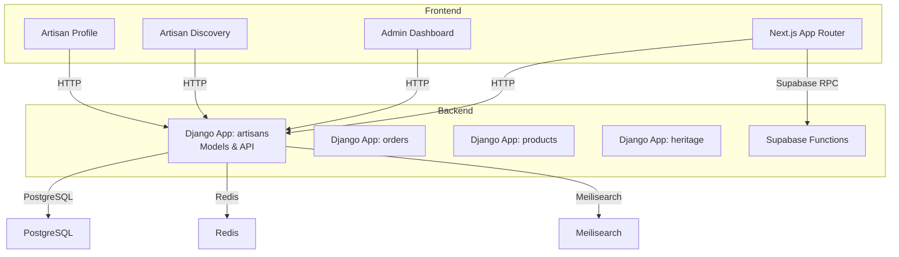

**Diagram sources**
- [README.md:1-242](file://README.md#L1-L242)
- [models.py:1-170](file://backend/apps/artisans/models.py#L1-L170)
- [models.py:1-153](file://backend/apps/products/models.py#L1-L153)
- [models.py:1-122](file://backend/apps/orders/models.py#L1-L122)

**Section sources**
- [README.md:1-242](file://README.md#L1-L242)

## Core Components
- Artisan model: Identity, location, contact, certifications, media, experience, and computed metrics (earnings, order count)
- CraftTradition model: Cultural IP anchor with GI status and heritage fund levy
- Certification model: Empindu Certified mark with requirements
- Product model: Story-first product with provenance, pricing splits, and embeddings
- Order model: Full lifecycle with payment method, payout status, and financial snapshots
- Public API endpoints: Artisan listing, detail retrieval, and craft traditions enumeration
- Admin dashboard: Verification, analytics, and operational controls
- Community features: Ratings, reviews, likes, and portfolio links

**Section sources**
- [models.py:14-170](file://backend/apps/artisans/models.py#L14-L170)
- [models.py:10-153](file://backend/apps/products/models.py#L10-L153)
- [models.py:10-122](file://backend/apps/orders/models.py#L10-L122)
- [artisans.py:1-120](file://backend/api/v1/artisans.py#L1-L120)

## Architecture Overview
The system separates concerns across backend Django apps and frontend pages:
- Artisan onboarding and verification are managed via admin operations and Supabase-backed forms
- Public-facing discovery and profiles are served by the Django API and Next.js pages
- Product listings and provenance are anchored to craft traditions and artisans
- Orders drive earnings computation and verification analytics
- Ratings and reviews are surfaced on artisan profiles and admin dashboards

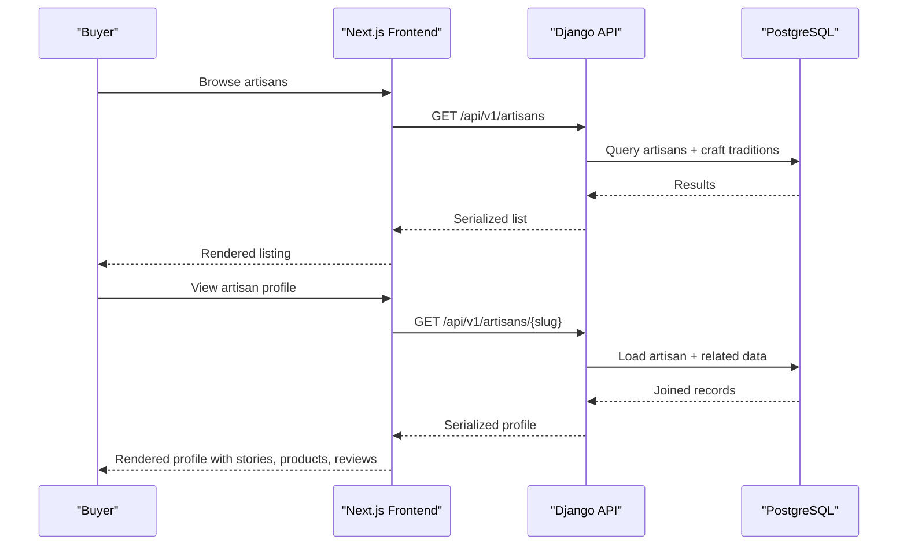

**Diagram sources**
- [artisans.py:52-119](file://backend/api/v1/artisans.py#L52-L119)
- [Artisans.tsx:50-102](file://apps/web/src/pages/Artisans.tsx#L50-L102)
- [ArtisanProfile.tsx:79-105](file://apps/web/src/pages/ArtisanProfile.tsx#L79-L105)

## Detailed Component Analysis

### Artisan Onboarding and Verification Workflows
- Onboarding channels: Web, WhatsApp, Telegram bot, field officer
- Verification: Admin toggles verified badge; reflected in public profiles and dashboards
- Voice-to-text: Artisan biography drafts can be transcribed and reviewed prior to publishing
- Compliance: Craft tradition and heritage fund levy recorded at onboarding and listing

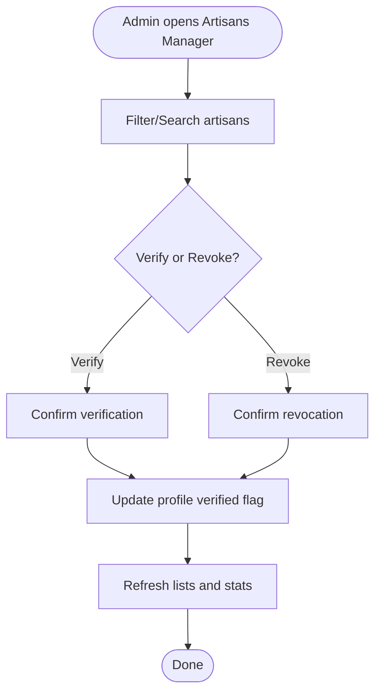

**Diagram sources**
- [ArtisansManager.tsx:48-66](file://apps/web/src/components/admin/ArtisansManager.tsx#L48-L66)
- [useAdminData.tsx:109-120](file://apps/web/src/hooks/useAdminData.tsx#L109-L120)

**Section sources**
- [models.py:62-122](file://backend/apps/artisans/models.py#L62-L122)
- [Admin.tsx:135-137](file://apps/web/src/pages/Admin.tsx#L135-L137)
- [ArtisansManager.tsx:34-216](file://apps/web/src/components/admin/ArtisansManager.tsx#L34-L216)
- [useAdminData.tsx:27-167](file://apps/web/src/hooks/useAdminData.tsx#L27-L167)

### Artisan Listing Interface and Discovery
- Public listing supports filtering by craft tradition, region, and certification status
- Profiles expose story-first content, photos, experience, and product counts
- Verified badges and experience indicators improve trust and discoverability

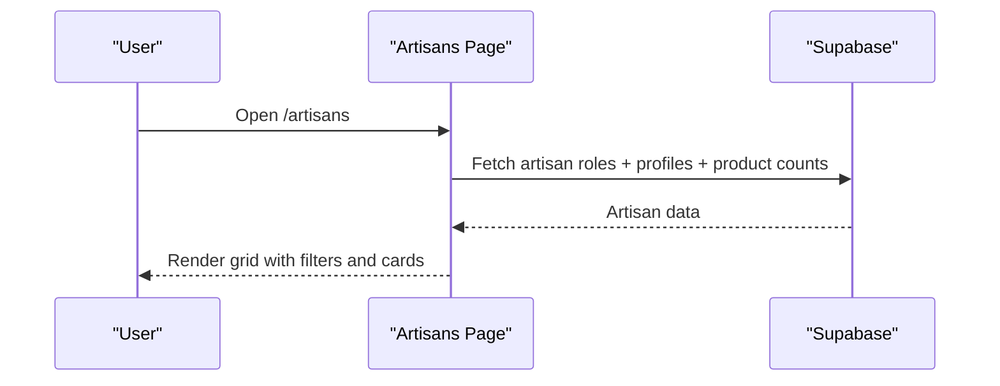

**Diagram sources**
- [Artisans.tsx:50-102](file://apps/web/src/pages/Artisans.tsx#L50-L102)

**Section sources**
- [artisans.py:80-119](file://backend/api/v1/artisans.py#L80-L119)
- [Artisans.tsx:17-28](file://apps/web/src/pages/Artisans.tsx#L17-L28)
- [Artisans.tsx:168-190](file://apps/web/src/pages/Artisans.tsx#L168-L190)

### Profile Management and Story-First Presentation
- Public profile endpoint returns artisan details, photos, craft tradition, and metrics
- Frontend profile page aggregates artisan story, products, and reviews
- Portfolio URLs and likes enable community engagement

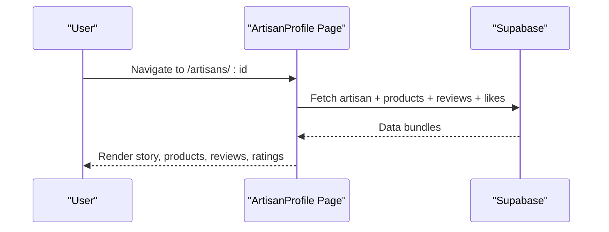

**Diagram sources**
- [ArtisanProfile.tsx:79-105](file://apps/web/src/pages/ArtisanProfile.tsx#L79-L105)

**Section sources**
- [artisans.py:52-77](file://backend/api/v1/artisans.py#L52-L77)
- [ArtisanProfile.tsx:51-334](file://apps/web/src/pages/ArtisanProfile.tsx#L51-L334)

### Certification Management and Quality Assurance Controls
- Certification model defines active marks and requirements
- Artisan model maintains certifications many-to-many
- Verified status and Empindu Certified mark are surfaced in admin and public views

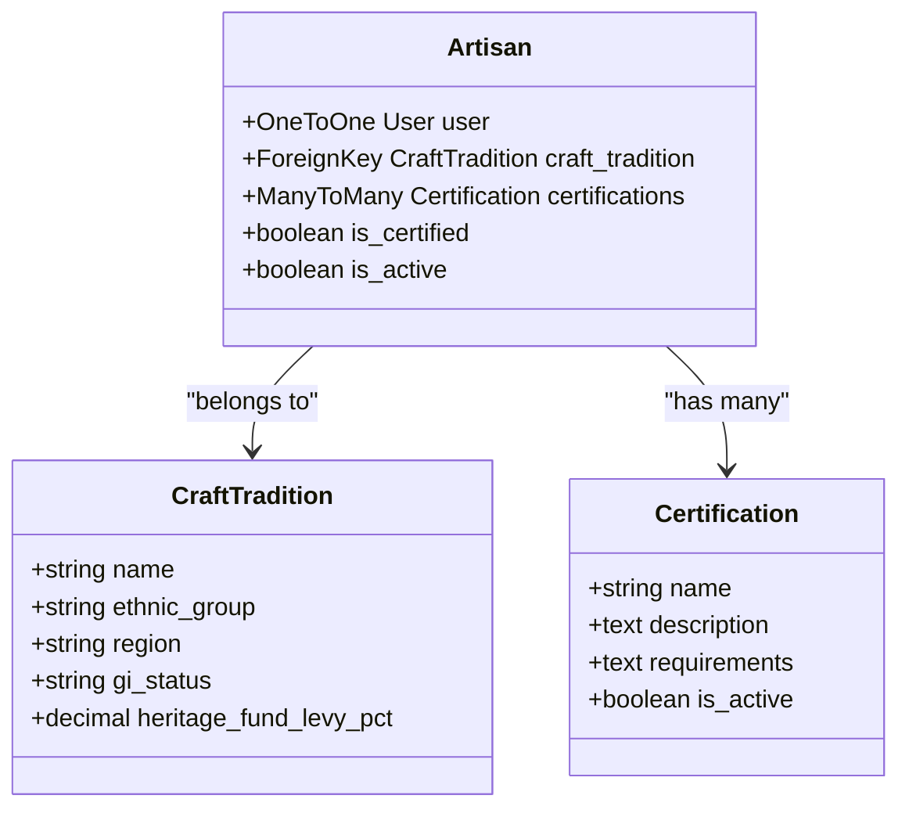

**Diagram sources**
- [models.py:47-122](file://backend/apps/artisans/models.py#L47-L122)

**Section sources**
- [models.py:47-122](file://backend/apps/artisans/models.py#L47-L122)

### Craft Tradition Databases and Provenance
- CraftTradition captures cultural IP, GI status, and heritage fund levy
- Product provenance snapshots preserve immutable attribution at listing time
- Embeddings enable semantic search for products

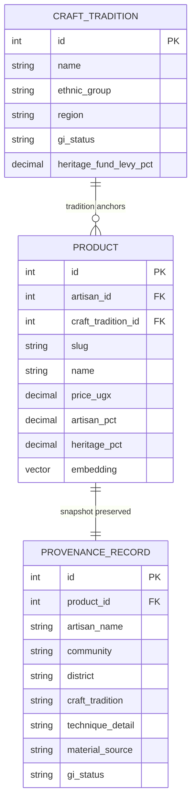

**Diagram sources**
- [models.py:10-153](file://backend/apps/products/models.py#L10-L153)
- [models.py:14-45](file://backend/apps/artisans/models.py#L14-L45)

**Section sources**
- [models.py:10-153](file://backend/apps/products/models.py#L10-L153)
- [models.py:14-45](file://backend/apps/artisans/models.py#L14-L45)

### Portfolio Management and Rating Systems
- Portfolio URLs and product listings are integrated into artisan profiles
- Ratings and reviews are aggregated and displayed with distribution charts
- Eligibility gating ensures only buyers with delivered orders can review

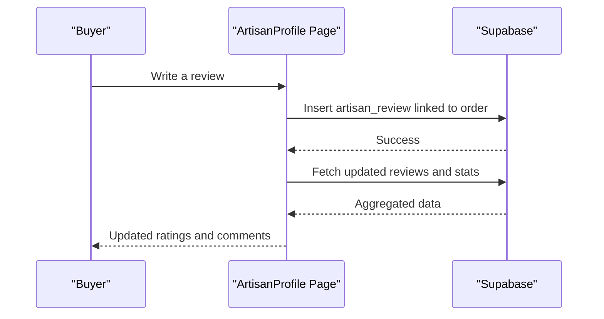

**Diagram sources**
- [ArtisanProfile.tsx:285-301](file://apps/web/src/pages/ArtisanProfile.tsx#L285-L301)
- [ArtisanReviewsSection.tsx:66-72](file://apps/web/src/components/reviews/ArtisanReviewsSection.tsx#L66-L72)

**Section sources**
- [ArtisanProfile.tsx:51-334](file://apps/web/src/pages/ArtisanProfile.tsx#L51-L334)
- [ArtisanReviewsSection.tsx:53-215](file://apps/web/src/components/reviews/ArtisanReviewsSection.tsx#L53-L215)

### Analytics, Performance Metrics, and Compliance Monitoring
- Admin analytics dashboard computes platform-wide stats and category distributions
- Metrics include artisan counts, verification rate, product availability, and buyer counts
- Compliance monitoring leverages craft tradition GI status and heritage fund contributions

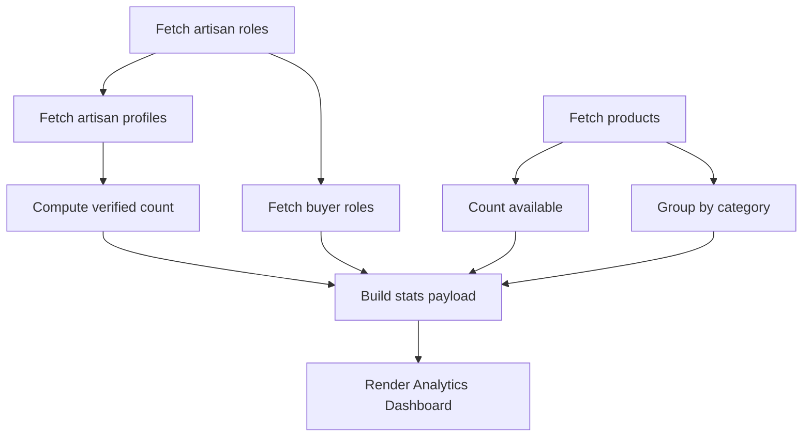

**Diagram sources**
- [useAdminData.tsx:59-107](file://apps/web/src/hooks/useAdminData.tsx#L59-L107)
- [AnalyticsDashboard.tsx:21-225](file://apps/web/src/components/admin/AnalyticsDashboard.tsx#L21-L225)

**Section sources**
- [useAdminData.tsx:27-167](file://apps/web/src/hooks/useAdminData.tsx#L27-L167)
- [AnalyticsDashboard.tsx:21-225](file://apps/web/src/components/admin/AnalyticsDashboard.tsx#L21-L225)

### Communication Tools, Support Workflows, and Dispute Resolution
- Telegram bot integration enables zero-cost onboarding via WhatsApp/Telegram
- Order lifecycle includes a disputed state for resolution workflows
- Notifications layer supports email, WhatsApp, and push communications

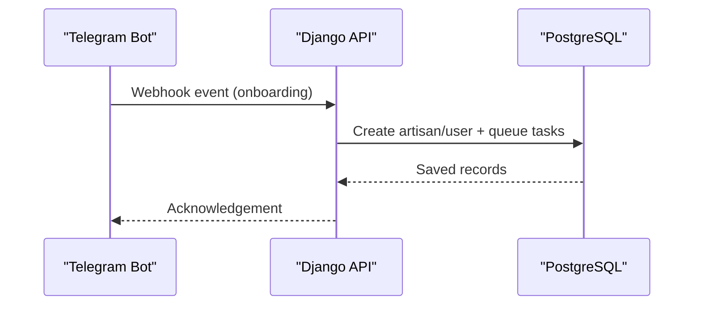

**Diagram sources**
- [README.md:9-14](file://README.md#L9-L14)

**Section sources**
- [README.md:9-14](file://README.md#L9-L14)
- [models.py:16-39](file://backend/apps/orders/models.py#L16-L39)

### Community Building Features
- Verified badges and experience indicators foster trust
- Likes and portfolio links encourage engagement
- Reviews and ratings build social proof

**Section sources**
- [Artisans.tsx:244-254](file://apps/web/src/pages/Artisans.tsx#L244-L254)
- [ArtisanProfile.tsx:116-127](file://apps/web/src/pages/ArtisanProfile.tsx#L116-L127)
- [ArtisanProfile.tsx:176-196](file://apps/web/src/pages/ArtisanProfile.tsx#L176-L196)

## Dependency Analysis
- Backend Django apps encapsulate domain logic:
  - artisans: Artisan, CraftTradition, Certification models
  - products: Product, ProductPhoto, ProvenanceRecord
  - orders: Order lifecycle and financial snapshots
- Frontend Next.js pages consume Supabase and Django APIs
- Admin dashboard coordinates with Supabase for verification and analytics

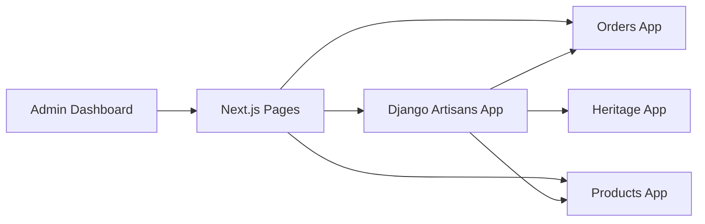

**Diagram sources**
- [models.py:1-170](file://backend/apps/artisans/models.py#L1-L170)
- [models.py:1-153](file://backend/apps/products/models.py#L1-L153)
- [models.py:1-122](file://backend/apps/orders/models.py#L1-L122)

**Section sources**
- [models.py:1-170](file://backend/apps/artisans/models.py#L1-L170)
- [models.py:1-153](file://backend/apps/products/models.py#L1-L153)
- [models.py:1-122](file://backend/apps/orders/models.py#L1-L122)

## Performance Considerations
- Use select_related and prefetch_related to minimize N+1 queries in artisan listing/detail endpoints
- Offload heavy tasks (transcription, embeddings) to background workers and cache results
- Paginate listing endpoints and filter early to reduce payload sizes
- Index craft tradition and certification fields for fast filtering
- Leverage Meilisearch for product search and semantic similarity using embeddings

## Troubleshooting Guide
- Onboarding failures: Verify Telegram webhook secret and site URL in environment variables
- Verification not reflected: Ensure admin updates the verified flag and refreshes cached views
- Missing artisan data in listings: Confirm artisan roles and public profiles are synchronized
- Review eligibility errors: Ensure buyers had delivered orders before allowing reviews
- Payment and payout discrepancies: Validate order financial snapshots and payout statuses

**Section sources**
- [README.md:138-145](file://README.md#L138-L145)
- [ArtisanProfile.tsx:285-299](file://apps/web/src/pages/ArtisanProfile.tsx#L285-L299)

## Conclusion
The Artisans Management system combines robust backend models for artisans, craft traditions, and products with a frontend focused on storytelling, discovery, and community. Admin dashboards enforce quality standards, monitor compliance, and streamline onboarding automation. Together, these components deliver a scalable platform for artisan empowerment and cultural preservation.

## Appendices
- Environment variables for backend and frontend are documented in the repository’s README
- Supabase functions underpin payment and notification workflows

**Section sources**
- [README.md:109-152](file://README.md#L109-L152)