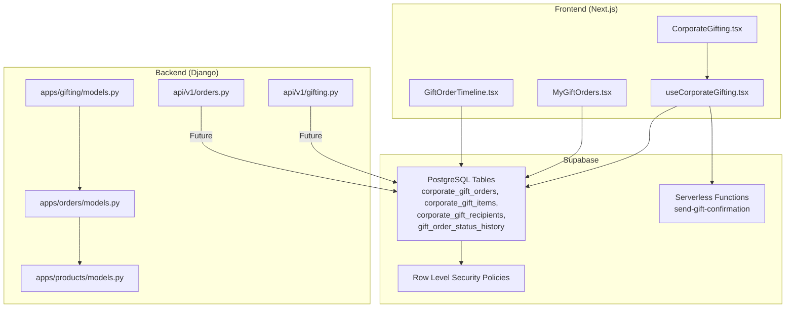
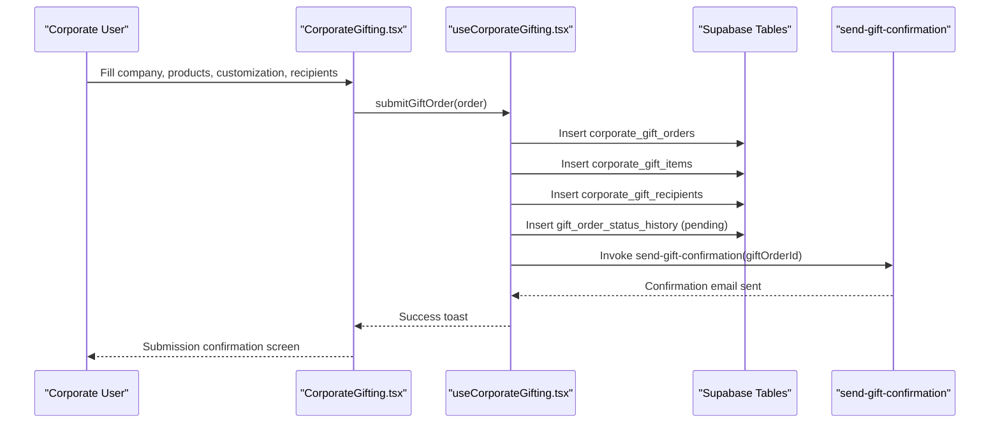
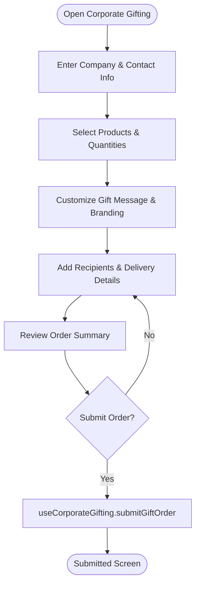
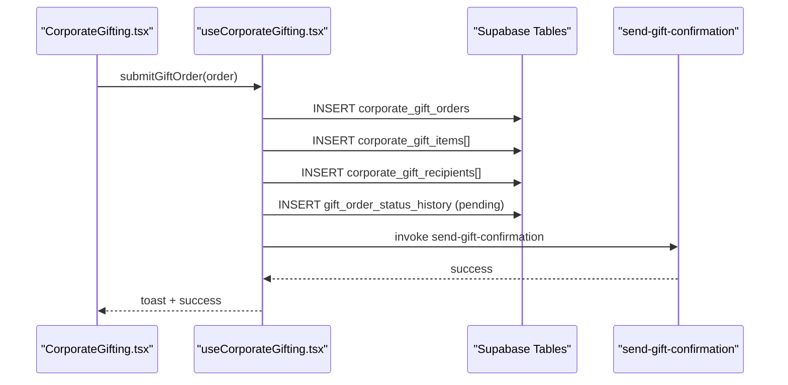
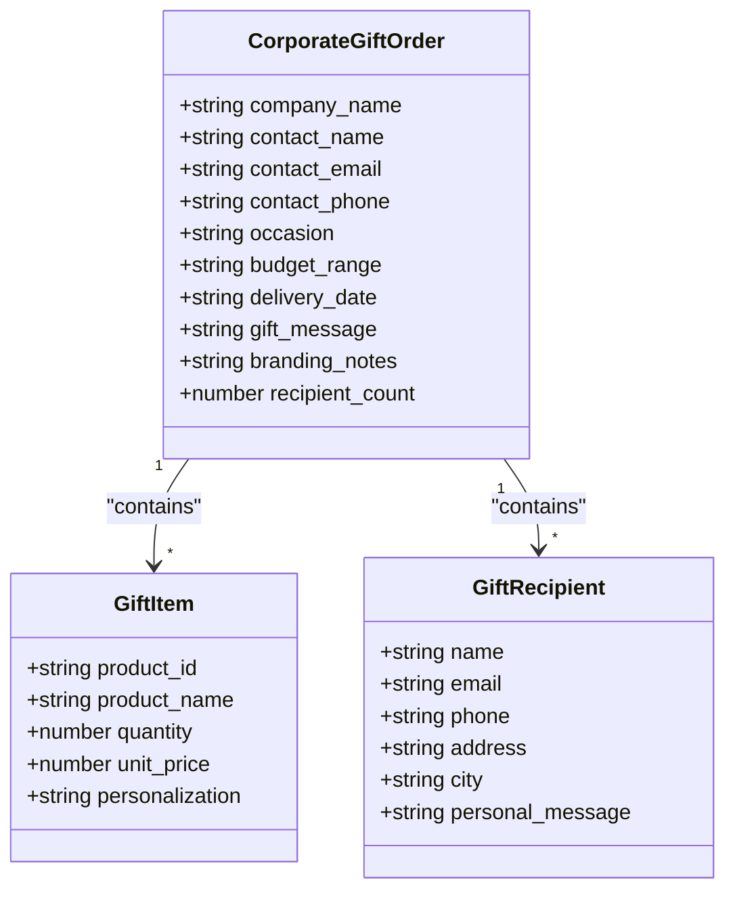
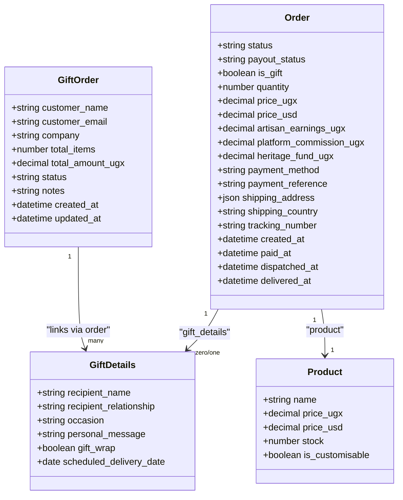
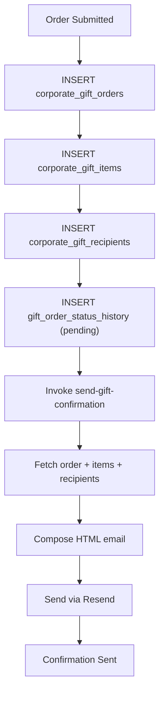
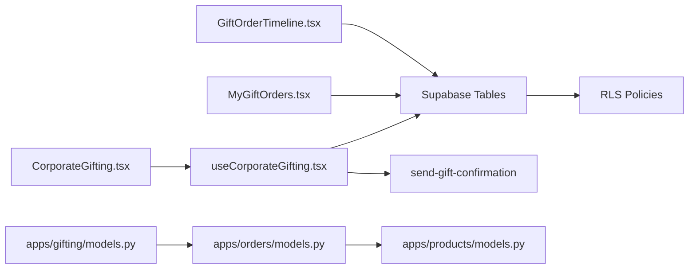

# Corporate Gifting Management

<cite>
**Referenced Files in This Document**
- [README.md](file://README.md)
- [CorporateGifting.tsx](file://apps/web/src/pages/CorporateGifting.tsx)
- [useCorporateGifting.tsx](file://apps/web/src/hooks/useCorporateGifting.tsx)
- [MyGiftOrders.tsx](file://apps/web/src/components/gifting/MyGiftOrders.tsx)
- [GiftOrderTimeline.tsx](file://apps/web/src/components/gifting/GiftOrderTimeline.tsx)
- [gifting.py](file://backend/api/v1/gifting.py)
- [orders.py](file://backend/api/v1/orders.py)
- [models.py (gifting)](file://backend/apps/gifting/models.py)
- [models.py (orders)](file://backend/apps/orders/models.py)
- [models.py (products)](file://backend/apps/products/models.py)
- [send-gift-confirmation/index.ts](file://supabase/functions/send-gift-confirmation/index.ts)
- [20260301183140_74b1e32e-ded4-4234-9c49-76542f291b2d.sql](file://supabase/migrations/20260301183140_74b1e32e-ded4-4234-9c49-76542f291b2d.sql)
</cite>

## Table of Contents
1. [Introduction](#introduction)
2. [Project Structure](#project-structure)
3. [Core Components](#core-components)
4. [Architecture Overview](#architecture-overview)
5. [Detailed Component Analysis](#detailed-component-analysis)
6. [Dependency Analysis](#dependency-analysis)
7. [Performance Considerations](#performance-considerations)
8. [Troubleshooting Guide](#troubleshooting-guide)
9. [Conclusion](#conclusion)
10. [Appendices](#appendices)

## Introduction
This document describes the Corporate Gifting Management system, focusing on the end-to-end flow for corporate gift orders, approval workflows, scheduling, bulk ordering, custom gift configurations, and corporate account management. It also covers gift order tracking, timeline visualization, delivery coordination, portal integration, budget management, reporting readiness, customization and branding capabilities, compliance controls, automated workflows, and customer service integration.

The system is a production-grade artisan marketplace with a modern frontend (Next.js App Router) and a Django backend with a REST-like API surface. Supabase powers real-time data access, row-level security, and serverless functions for email notifications.

## Project Structure
The Corporate Gifting feature spans the frontend React application, Supabase database and functions, and the Django backend API layer. The most relevant areas for corporate gifting are:
- Frontend pages and hooks for the corporate gifting flow
- Supabase tables and policies for secure data access
- Supabase functions for email confirmations
- Django models for gift commerce and order lifecycle
- Django API routers for future commerce endpoints

**Diagram sources**
- [CorporateGifting.tsx:1-396](file://apps/web/src/pages/CorporateGifting.tsx#L1-L396)
- [useCorporateGifting.tsx:1-133](file://apps/web/src/hooks/useCorporateGifting.tsx#L1-L133)
- [MyGiftOrders.tsx:1-159](file://apps/web/src/components/gifting/MyGiftOrders.tsx#L1-L159)
- [GiftOrderTimeline.tsx:1-85](file://apps/web/src/components/gifting/GiftOrderTimeline.tsx#L1-L85)
- [gifting.py:1-13](file://backend/api/v1/gifting.py#L1-L13)
- [orders.py:1-18](file://backend/api/v1/orders.py#L1-L18)
- [models.py (gifting):1-67](file://backend/apps/gifting/models.py#L1-L67)
- [models.py (orders):1-122](file://backend/apps/orders/models.py#L1-L122)
- [models.py (products):1-153](file://backend/apps/products/models.py#L1-L153)
- [send-gift-confirmation/index.ts:1-219](file://supabase/functions/send-gift-confirmation/index.ts#L1-L219)
- [20260301183140_74b1e32e-ded4_4234_9c49_76542f291b2d.sql:1-150](file://supabase/migrations/20260301183140_74b1e32e-ded4_4234_9c49_76542f291b2d.sql#L1-L150)

**Section sources**
- [README.md:1-242](file://README.md#L1-L242)

## Core Components
- Corporate Gifting Page: Multi-step form for company details, product selection, customization, and recipients.
- Corporate Gifting Hook: Submits orders to Supabase, creates items and recipients, logs status history, and triggers confirmation emails.
- Order Tracking: Lists corporate gift orders and displays a timeline of status changes.
- Timeline Visualization: Renders a chronological status history with icons and timestamps.
- Backend Models: GiftDetails and GiftOrder define the gift commerce domain; Order and Product models support gift-enabled orders and pricing.
- Supabase Tables and Policies: Secure storage and access control for corporate gift data.
- Email Function: Sends confirmation emails after order submission.

**Section sources**
- [CorporateGifting.tsx:1-396](file://apps/web/src/pages/CorporateGifting.tsx#L1-L396)
- [useCorporateGifting.tsx:1-133](file://apps/web/src/hooks/useCorporateGifting.tsx#L1-L133)
- [MyGiftOrders.tsx:1-159](file://apps/web/src/components/gifting/MyGiftOrders.tsx#L1-L159)
- [GiftOrderTimeline.tsx:1-85](file://apps/web/src/components/gifting/GiftOrderTimeline.tsx#L1-L85)
- [models.py (gifting):1-67](file://backend/apps/gifting/models.py#L1-L67)
- [models.py (orders):1-122](file://backend/apps/orders/models.py#L1-L122)
- [models.py (products):1-153](file://backend/apps/products/models.py#L1-L153)
- [send-gift-confirmation/index.ts:1-219](file://supabase/functions/send-gift-confirmation/index.ts#L1-L219)
- [20260301183140_74b1e32e-ded4_4234_9c49_76542f291b2d.sql:1-150](file://supabase/migrations/20260301183140_74b1e32e-ded4_4234_9c49_76542f291b2d.sql#L1-L150)

## Architecture Overview
The Corporate Gifting flow integrates the frontend, Supabase, and backend models. The frontend captures order metadata, items, and recipients, writes them to Supabase, and triggers a confirmation email via a serverless function. The backend models support gift-enabled orders and financial snapshots, enabling future order lifecycle APIs.

**Diagram sources**
- [CorporateGifting.tsx:83-99](file://apps/web/src/pages/CorporateGifting.tsx#L83-L99)
- [useCorporateGifting.tsx:44-129](file://apps/web/src/hooks/useCorporateGifting.tsx#L44-L129)
- [send-gift-confirmation/index.ts:15-219](file://supabase/functions/send-gift-confirmation/index.ts#L15-L219)
- [20260301183140_74b1e32e-ded4_4234_9c49_76542f291b2d.sql:60-129](file://supabase/migrations/20260301183140_74b1e32e-ded4_4234_9c49_76542f291b2d.sql#L60-L129)

## Detailed Component Analysis

### Corporate Gifting Page (Multi-step Form)
- Captures company and contact details, preferred delivery date, and budget range.
- Allows selecting available products, setting quantities, and adding optional personalization notes.
- Provides customization fields for gift message and branding/packaging notes.
- Collects multiple recipients with optional contact and delivery details.
- Calculates estimated totals and submits the order via the hook.

**Diagram sources**
- [CorporateGifting.tsx:198-366](file://apps/web/src/pages/CorporateGifting.tsx#L198-L366)

**Section sources**
- [CorporateGifting.tsx:1-396](file://apps/web/src/pages/CorporateGifting.tsx#L1-L396)

### Corporate Gifting Hook (Order Submission)
- Validates user session and prepares order payload.
- Inserts a corporate gift order, followed by items and recipients.
- Logs the initial status history entry.
- Invokes a serverless function to send a confirmation email.
- Handles errors and provides user feedback.

**Diagram sources**
- [useCorporateGifting.tsx:44-129](file://apps/web/src/hooks/useCorporateGifting.tsx#L44-L129)
- [send-gift-confirmation/index.ts:15-219](file://supabase/functions/send-gift-confirmation/index.ts#L15-L219)

**Section sources**
- [useCorporateGifting.tsx:1-133](file://apps/web/src/hooks/useCorporateGifting.tsx#L1-L133)

### Order Tracking and Timeline Visualization
- Lists corporate gift orders for the authenticated user.
- Expands to show items, recipients, gift message, and a timeline of status changes.
- Timeline renders chronological status updates with icons and timestamps.

**Diagram sources**
- [useCorporateGifting.tsx:6-37](file://apps/web/src/hooks/useCorporateGifting.tsx#L6-L37)
- [MyGiftOrders.tsx:68-155](file://apps/web/src/components/gifting/MyGiftOrders.tsx#L68-L155)

**Section sources**
- [MyGiftOrders.tsx:1-159](file://apps/web/src/components/gifting/MyGiftOrders.tsx#L1-L159)
- [GiftOrderTimeline.tsx:1-85](file://apps/web/src/components/gifting/GiftOrderTimeline.tsx#L1-L85)

### Backend Models: Gift Commerce and Order Lifecycle
- GiftDetails: Stores gift-specific personalization data including recipient name, relationship, occasion, message, gift wrap, and optional scheduled delivery date.
- GiftOrder: Aggregates corporate gift orders with customer info, company, totals, status, and timestamps.
- Order: Core order model with lifecycle statuses, payment method, gift flag, gift details linkage, quantities, financial snapshot, shipping, and timestamps.
- Product: Product catalog with pricing, revenue split, inventory, customizability, and provenance records.

**Diagram sources**
- [models.py (gifting):9-67](file://backend/apps/gifting/models.py#L9-L67)
- [models.py (orders):10-122](file://backend/apps/orders/models.py#L10-L122)
- [models.py (products):10-153](file://backend/apps/products/models.py#L10-L153)

**Section sources**
- [models.py (gifting):1-67](file://backend/apps/gifting/models.py#L1-L67)
- [models.py (orders):1-122](file://backend/apps/orders/models.py#L1-L122)
- [models.py (products):1-153](file://backend/apps/products/models.py#L1-L153)

### Supabase Tables, Policies, and Email Function
- Tables: corporate_gift_orders, corporate_gift_items, corporate_gift_recipients, gift_order_status_history.
- Row Level Security: Users can only view/update/delete data linked to their user ID; admins have broader permissions.
- Function: send-gift-confirmation validates ownership, composes an HTML email with order summary, items, recipients, and gift message, and sends it via Resend.

**Diagram sources**
- [useCorporateGifting.tsx:52-118](file://apps/web/src/hooks/useCorporateGifting.tsx#L52-L118)
- [send-gift-confirmation/index.ts:54-203](file://supabase/functions/send-gift-confirmation/index.ts#L54-L203)
- [20260301183140_74b1e32e-ded4_4234_9c49_76542f291b2d.sql:60-129](file://supabase/migrations/20260301183140_74b1e32e-ded4_4234_9c49_76542f291b2d.sql#L60-L129)

**Section sources**
- [20260301183140_74b1e32e-ded4_4234_9c49_76542f291b2d.sql:1-150](file://supabase/migrations/20260301183140_74b1e32e-ded4_4234_9c49_76542f291b2d.sql#L1-L150)
- [send-gift-confirmation/index.ts:1-219](file://supabase/functions/send-gift-confirmation/index.ts#L1-L219)

### Future API Endpoints (Placeholder)
- Gift Commerce API and Orders API are placeholders indicating upcoming endpoints for advanced gift order management and order lifecycle operations.

**Section sources**
- [gifting.py:1-13](file://backend/api/v1/gifting.py#L1-L13)
- [orders.py:1-18](file://backend/api/v1/orders.py#L1-L18)

## Dependency Analysis
- Frontend depends on Supabase for data persistence and serverless functions for email.
- Supabase enforces row-level security to ensure users can only access their own data.
- Backend models underpin gift-enabled orders and financial calculations.
- The gift order timeline relies on the status history table for visualization.

**Diagram sources**
- [CorporateGifting.tsx:1-396](file://apps/web/src/pages/CorporateGifting.tsx#L1-L396)
- [useCorporateGifting.tsx:1-133](file://apps/web/src/hooks/useCorporateGifting.tsx#L1-L133)
- [MyGiftOrders.tsx:1-159](file://apps/web/src/components/gifting/MyGiftOrders.tsx#L1-L159)
- [GiftOrderTimeline.tsx:1-85](file://apps/web/src/components/gifting/GiftOrderTimeline.tsx#L1-L85)
- [models.py (gifting):1-67](file://backend/apps/gifting/models.py#L1-L67)
- [models.py (orders):1-122](file://backend/apps/orders/models.py#L1-L122)
- [models.py (products):1-153](file://backend/apps/products/models.py#L1-L153)

**Section sources**
- [CorporateGifting.tsx:1-396](file://apps/web/src/pages/CorporateGifting.tsx#L1-L396)
- [useCorporateGifting.tsx:1-133](file://apps/web/src/hooks/useCorporateGifting.tsx#L1-L133)
- [MyGiftOrders.tsx:1-159](file://apps/web/src/components/gifting/MyGiftOrders.tsx#L1-L159)
- [GiftOrderTimeline.tsx:1-85](file://apps/web/src/components/gifting/GiftOrderTimeline.tsx#L1-L85)
- [models.py (gifting):1-67](file://backend/apps/gifting/models.py#L1-L67)
- [models.py (orders):1-122](file://backend/apps/orders/models.py#L1-L122)
- [models.py (products):1-153](file://backend/apps/products/models.py#L1-L153)

## Performance Considerations
- Minimize repeated queries by batching inserts for items and recipients.
- Use Supabase’s select with relations to reduce round-trips when fetching order details.
- Cache frequently accessed product lists on the frontend to improve product selection UX.
- Keep gift customization payloads concise to avoid large payloads in timeline/history entries.
- Offload heavy computations to serverless functions or background tasks when scaling.

## Troubleshooting Guide
- Authentication failures during order submission: Ensure the user is signed in and the session is valid.
- Supabase permission errors: Verify row-level security policies and that the current user owns the target gift order.
- Email delivery issues: Confirm the Resend API key is configured and the function invocation succeeds.
- Empty timeline: Ensure status history entries exist for the order ID.
- Backend API placeholders: Expect gift commerce and order lifecycle endpoints to be implemented in later sprints.

**Section sources**
- [useCorporateGifting.tsx:44-129](file://apps/web/src/hooks/useCorporateGifting.tsx#L44-L129)
- [send-gift-confirmation/index.ts:15-219](file://supabase/functions/send-gift-confirmation/index.ts#L15-L219)
- [GiftOrderTimeline.tsx:20-38](file://apps/web/src/components/gifting/GiftOrderTimeline.tsx#L20-L38)
- [gifting.py:1-13](file://backend/api/v1/gifting.py#L1-L13)
- [orders.py:1-18](file://backend/api/v1/orders.py#L1-L18)

## Conclusion
The Corporate Gifting Management system provides a robust, secure, and scalable foundation for corporate gift ordering. It enables multi-step order capture, bulk product selection, customization, and recipient management, with integrated timeline tracking and email confirmations. Supabase’s row-level security ensures compliance and privacy, while backend models support future order lifecycle enhancements. The modular architecture allows seamless integration with corporate portals, budget management, and reporting systems as the platform evolves.

## Appendices

### Data Model Definitions
- Corporate Gift Orders: Stores company and contact details, occasion, budget range, delivery preferences, gift message, branding notes, and recipient count.
- Corporate Gift Items: Links products to orders with quantity, unit price, and personalization.
- Corporate Gift Recipients: Stores recipient details and optional personal messages.
- Gift Order Status History: Chronological audit trail of status transitions.

**Section sources**
- [20260301183140_74b1e32e-ded4_4234_9c49_76542f291b2d.sql:60-129](file://supabase/migrations/20260301183140_74b1e32e-ded4_4234_9c49_76542f291b2d.sql#L60-L129)

### Compliance Controls
- Row-level security policies restrict data access to owners and grant admin privileges where appropriate.
- Ownership verification in serverless functions prevents unauthorized access to order details.

**Section sources**
- [20260301183140_74b1e32e-ded4_4234_9c49_76542f291b2d.sql:100-129](file://supabase/migrations/20260301183140_74b1e32e-ded4_4234_9c49_76542f291b2d.sql#L100-L129)
- [send-gift-confirmation/index.ts:68-74](file://supabase/functions/send-gift-confirmation/index.ts#L68-L74)

### Customer Service Integration
- Email confirmations are sent automatically upon order submission, reducing manual handoffs.
- Timeline and order summaries enable customer service agents to quickly diagnose status and details.

**Section sources**
- [useCorporateGifting.tsx:115-118](file://apps/web/src/hooks/useCorporateGifting.tsx#L115-L118)
- [MyGiftOrders.tsx:146-150](file://apps/web/src/components/gifting/MyGiftOrders.tsx#L146-L150)