# Orders Management

<cite>
**Referenced Files in This Document**
- [orders.py](file://backend/api/v1/orders.py)
- [models.py](file://backend/apps/orders/models.py)
- [models.py](file://backend/apps/products/models.py)
- [models.py](file://backend/apps/artisans/models.py)
- [models.py](file://backend/apps/gifting/models.py)
- [OrdersManager.tsx](file://apps/web/src/components/admin/OrdersManager.tsx)
- [ArtisanOrdersView.tsx](file://apps/web/src/components/business/ArtisanOrdersView.tsx)
- [OrderHistory.tsx](file://apps/web/src/components/orders/OrderHistory.tsx)
- [process-cash-payment/index.ts](file://supabase/functions/process-cash-payment/index.ts)
- [process-momo-payment/index.ts](file://supabase/functions/process-momo-payment/index.ts)
- [send-order-email/index.ts](file://supabase/functions/send-order-email/index.ts)
- [send-gift-order-email/index.ts](file://supabase/functions/send-gift-order-email/index.ts)
- [send-gift-confirmation/index.ts](file://supabase/functions/send-gift-confirmation/index.ts)
</cite>

## Table of Contents
1. [Introduction](#introduction)
2. [Project Structure](#project-structure)
3. [Core Components](#core-components)
4. [Architecture Overview](#architecture-overview)
5. [Detailed Component Analysis](#detailed-component-analysis)
6. [Dependency Analysis](#dependency-analysis)
7. [Performance Considerations](#performance-considerations)
8. [Troubleshooting Guide](#troubleshooting-guide)
9. [Conclusion](#conclusion)
10. [Appendices](#appendices)

## Introduction
This document describes the Orders Management interface and ecosystem. It covers the order lifecycle, status tracking, fulfillment workflows, state transitions, payment verification, shipping coordination, modifications, cancellations, refunds, integrations with payments and inventory, notifications, analytics, search and filtering, bulk operations, and customer service patterns. The content synthesizes the current backend models, placeholder APIs, frontend managers, and Supabase functions to present a complete picture of the orders domain.

## Project Structure
The Orders Management spans three layers:
- Backend Django models define the order lifecycle, statuses, financial snapshots, and relationships to products, artisans, and gift details.
- Backend API routes currently act as placeholders and will implement order listing, creation, and management in upcoming sprints.
- Frontend managers provide administrative, artisan-facing, and customer views for order operations.
- Supabase functions integrate payment processing and notifications.

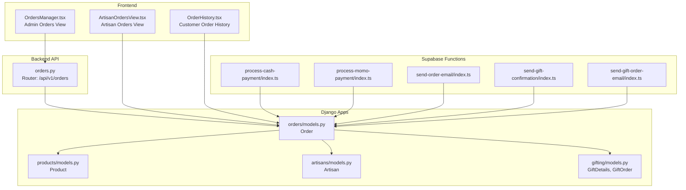

**Diagram sources**
- [orders.py:1-18](file://backend/api/v1/orders.py#L1-L18)
- [models.py:1-122](file://backend/apps/orders/models.py#L1-L122)
- [models.py:1-153](file://backend/apps/products/models.py#L1-L153)
- [models.py:1-170](file://backend/apps/artisans/models.py#L1-L170)
- [models.py:1-67](file://backend/apps/gifting/models.py#L1-L67)
- [OrdersManager.tsx](file://apps/web/src/components/admin/OrdersManager.tsx)
- [ArtisanOrdersView.tsx](file://apps/web/src/components/business/ArtisanOrdersView.tsx)
- [OrderHistory.tsx](file://apps/web/src/components/orders/OrderHistory.tsx)
- [process-cash-payment/index.ts](file://supabase/functions/process-cash-payment/index.ts)
- [process-momo-payment/index.ts](file://supabase/functions/process-momo-payment/index.ts)
- [send-order-email/index.ts](file://supabase/functions/send-order-email/index.ts)
- [send-gift-confirmation/index.ts](file://supabase/functions/send-gift-confirmation/index.ts)
- [send-gift-order-email/index.ts](file://supabase/functions/send-gift-order-email/index.ts)

**Section sources**
- [orders.py:1-18](file://backend/api/v1/orders.py#L1-L18)
- [models.py:1-122](file://backend/apps/orders/models.py#L1-L122)
- [models.py:1-153](file://backend/apps/products/models.py#L1-L153)
- [models.py:1-170](file://backend/apps/artisans/models.py#L1-L170)
- [models.py:1-67](file://backend/apps/gifting/models.py#L1-L67)
- [OrdersManager.tsx](file://apps/web/src/components/admin/OrdersManager.tsx)
- [ArtisanOrdersView.tsx](file://apps/web/src/components/business/ArtisanOrdersView.tsx)
- [OrderHistory.tsx](file://apps/web/src/components/orders/OrderHistory.tsx)

## Core Components
- Order model encapsulates the complete lifecycle from pending payment to delivered or refunded, with frozen financial snapshots, gift flags, payment method and reference, shipping details, tracking, dispatch photos, and timestamps.
- Product model defines pricing, revenue split, inventory, and craft attributes used to compute order totals.
- Artisan model connects orders to artisans and exposes earnings and order counts.
- GiftDetails and GiftOrder support gifting flows with occasions, messages, scheduling, and bulk corporate gifting.
- API routes are placeholders for order listing and creation.
- Frontend managers provide admin, artisan, and customer order views.
- Supabase functions handle cash and mobile money payment processing and order/gift notifications.

**Section sources**
- [models.py:10-122](file://backend/apps/orders/models.py#L10-L122)
- [models.py:10-99](file://backend/apps/products/models.py#L10-L99)
- [models.py:62-170](file://backend/apps/artisans/models.py#L62-L170)
- [models.py:9-67](file://backend/apps/gifting/models.py#L9-L67)
- [orders.py:10-17](file://backend/api/v1/orders.py#L10-L17)
- [OrdersManager.tsx](file://apps/web/src/components/admin/OrdersManager.tsx)
- [ArtisanOrdersView.tsx](file://apps/web/src/components/business/ArtisanOrdersView.tsx)
- [OrderHistory.tsx](file://apps/web/src/components/orders/OrderHistory.tsx)

## Architecture Overview
The Orders Management architecture integrates frontend views, backend models, API placeholders, and serverless functions for payments and notifications.

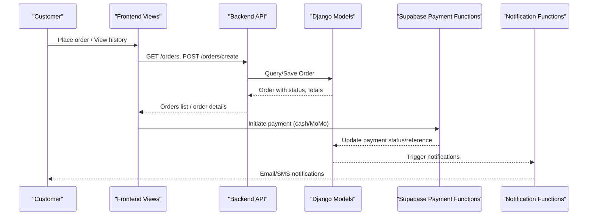

**Diagram sources**
- [orders.py:10-17](file://backend/api/v1/orders.py#L10-L17)
- [models.py:10-122](file://backend/apps/orders/models.py#L10-L122)
- [process-cash-payment/index.ts](file://supabase/functions/process-cash-payment/index.ts)
- [process-momo-payment/index.ts](file://supabase/functions/process-momo-payment/index.ts)
- [send-order-email/index.ts](file://supabase/functions/send-order-email/index.ts)

## Detailed Component Analysis

### Order Model and Lifecycle
The Order model centralizes the order state machine and financial snapshot:
- Statuses: pending_payment, paid, confirmed, dispatched, in_transit, delivered, disputed, refunded.
- Payment methods: Stripe, MTN MoMo, Airtel Money, TON Crypto.
- Payout status: pending, processing, paid, failed.
- Relationships: Product (frozen price), Buyer, Artisan, GiftDetails (optional).
- Totals computation: price_ugx/usd, artisan earnings, platform commission, heritage fund.
- Shipping: name, address JSON, country ISO code, tracking number, dispatch photo.
- Timestamps: created_at, paid_at, dispatched_at, delivered_at.

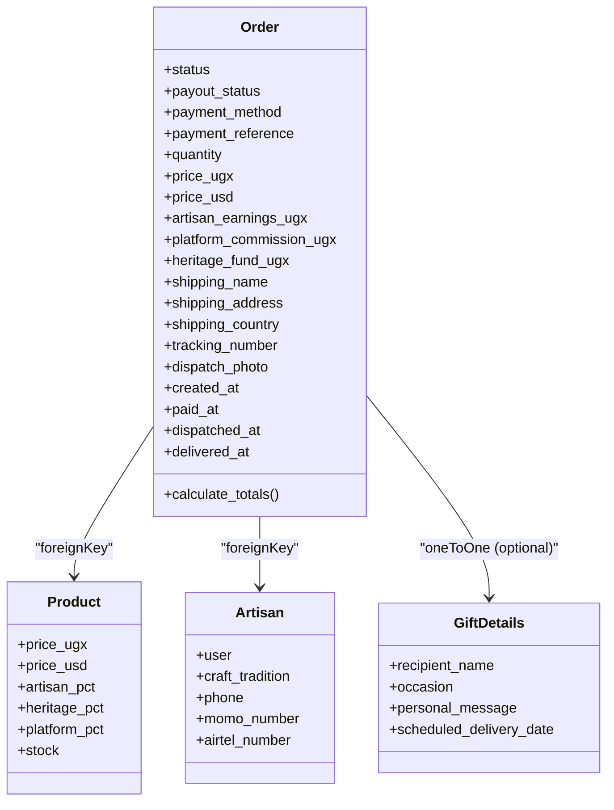

**Diagram sources**
- [models.py:10-122](file://backend/apps/orders/models.py#L10-L122)
- [models.py:10-99](file://backend/apps/products/models.py#L10-L99)
- [models.py:62-170](file://backend/apps/artisans/models.py#L62-L170)
- [models.py:9-36](file://backend/apps/gifting/models.py#L9-L36)

**Section sources**
- [models.py:10-122](file://backend/apps/orders/models.py#L10-L122)

### Payment Verification and Methods
Payment integration is handled via Supabase functions:
- Cash payment processor updates order payment status and reference after cash collection.
- Mobile Money processor verifies MoMo/Airtel payments and updates order accordingly.
- Notification functions send order confirmation emails and gift-related confirmations.

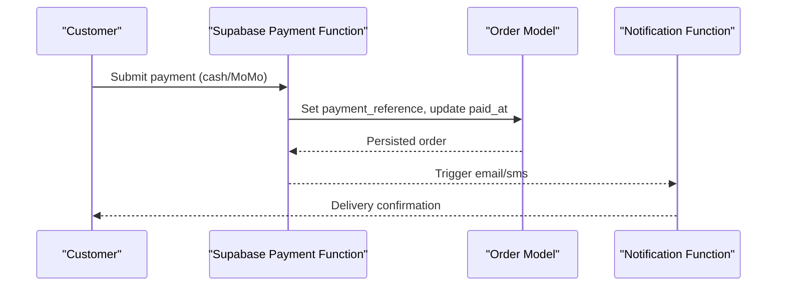

**Diagram sources**
- [process-cash-payment/index.ts](file://supabase/functions/process-cash-payment/index.ts)
- [process-momo-payment/index.ts](file://supabase/functions/process-momo-payment/index.ts)
- [send-order-email/index.ts](file://supabase/functions/send-order-email/index.ts)

**Section sources**
- [process-cash-payment/index.ts](file://supabase/functions/process-cash-payment/index.ts)
- [process-momo-payment/index.ts](file://supabase/functions/process-momo-payment/index.ts)
- [send-order-email/index.ts](file://supabase/functions/send-order-email/index.ts)

### Fulfillment Workflows
Fulfillment progresses through status transitions:
- From paid to confirmed by artisan.
- Dispatched with tracking number and optional dispatch photo.
- In transit and delivered with delivered_at timestamp.
- Disputed and Refunded states for exceptions.

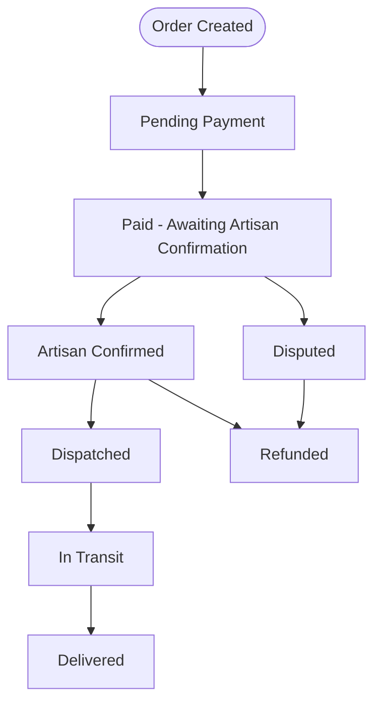

**Diagram sources**
- [models.py:16-25](file://backend/apps/orders/models.py#L16-L25)

**Section sources**
- [models.py:16-25](file://backend/apps/orders/models.py#L16-L25)

### Inventory Updates
Inventory is managed at the Product level:
- Stock field decremented upon order placement.
- Sold out and archived states prevent further sales.
- Product financial splits (artisan share, heritage fund, platform commission) inform order totals.

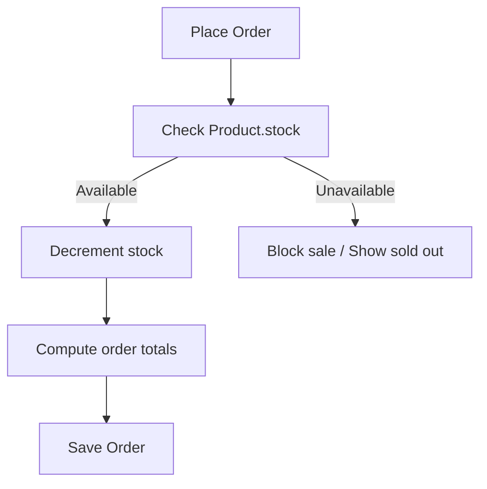

**Diagram sources**
- [models.py:68-70](file://backend/apps/products/models.py#L68-L70)
- [models.py:111-122](file://backend/apps/orders/models.py#L111-L122)

**Section sources**
- [models.py:68-70](file://backend/apps/products/models.py#L68-L70)
- [models.py:111-122](file://backend/apps/orders/models.py#L111-L122)

### Notifications and Communication
Notifications are triggered after payment and fulfillment events:
- Order confirmation email for standard orders.
- Gift order and gift confirmation emails for gifting purchases.
- These functions integrate with email providers and can be extended for SMS.

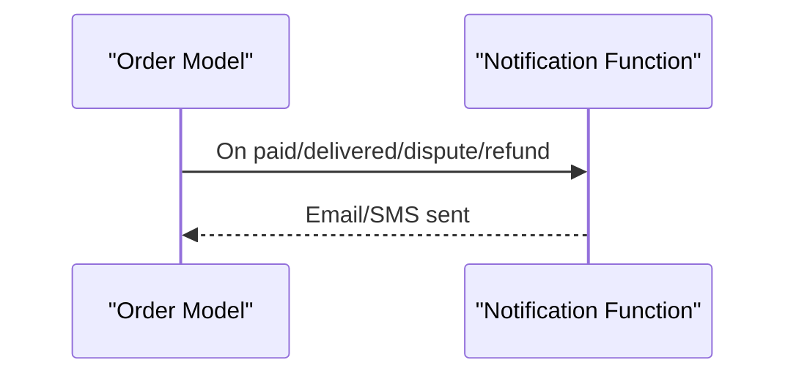

**Diagram sources**
- [send-order-email/index.ts](file://supabase/functions/send-order-email/index.ts)
- [send-gift-order-email/index.ts](file://supabase/functions/send-gift-order-email/index.ts)
- [send-gift-confirmation/index.ts](file://supabase/functions/send-gift-confirmation/index.ts)

**Section sources**
- [send-order-email/index.ts](file://supabase/functions/send-order-email/index.ts)
- [send-gift-order-email/index.ts](file://supabase/functions/send-gift-order-email/index.ts)
- [send-gift-confirmation/index.ts](file://supabase/functions/send-gift-confirmation/index.ts)

### Frontend Views and Capabilities
- Admin Orders Manager: centralized view for listing, filtering, and managing orders.
- Artisan Orders View: artisan-centric dashboard to manage confirmations, dispatch, and payouts.
- Customer Order History: customer-facing timeline of placed orders and current status.

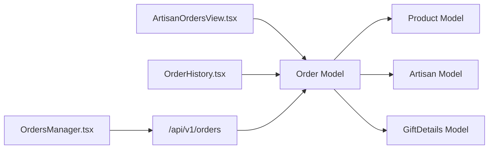

**Diagram sources**
- [OrdersManager.tsx](file://apps/web/src/components/admin/OrdersManager.tsx)
- [ArtisanOrdersView.tsx](file://apps/web/src/components/business/ArtisanOrdersView.tsx)
- [OrderHistory.tsx](file://apps/web/src/components/orders/OrderHistory.tsx)
- [models.py:10-122](file://backend/apps/orders/models.py#L10-L122)
- [models.py:10-99](file://backend/apps/products/models.py#L10-L99)
- [models.py:62-170](file://backend/apps/artisans/models.py#L62-L170)
- [models.py:9-36](file://backend/apps/gifting/models.py#L9-L36)

**Section sources**
- [OrdersManager.tsx](file://apps/web/src/components/admin/OrdersManager.tsx)
- [ArtisanOrdersView.tsx](file://apps/web/src/components/business/ArtisanOrdersView.tsx)
- [OrderHistory.tsx](file://apps/web/src/components/orders/OrderHistory.tsx)

### Gifting Workflow
Gift purchases introduce GiftDetails and GiftOrder:
- Occasions, personal messages, gift wrap, and scheduled delivery date.
- GiftOrder aggregates corporate/bulk orders with status tracking.

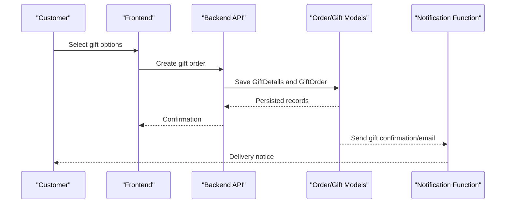

**Diagram sources**
- [models.py:9-67](file://backend/apps/gifting/models.py#L9-L67)
- [send-gift-confirmation/index.ts](file://supabase/functions/send-gift-confirmation/index.ts)
- [send-gift-order-email/index.ts](file://supabase/functions/send-gift-order-email/index.ts)

**Section sources**
- [models.py:9-67](file://backend/apps/gifting/models.py#L9-L67)

### Refunds and Disputes
- Disputed and Refunded statuses enable reversal workflows.
- Financial snapshots freeze amounts at order time to simplify accounting.
- Payout status tracks disbursement to artisans.

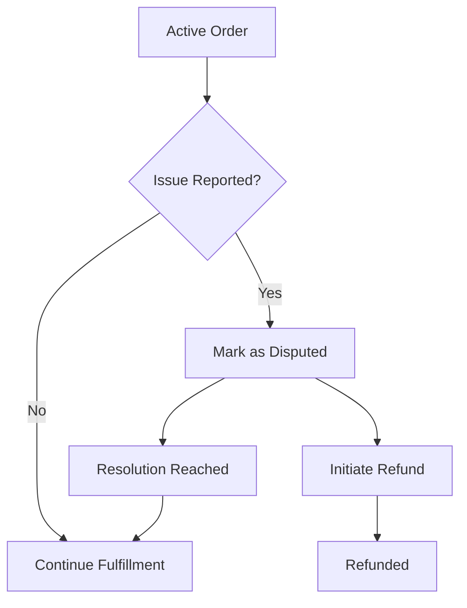

**Diagram sources**
- [models.py:16-25](file://backend/apps/orders/models.py#L16-L25)
- [models.py:34-39](file://backend/apps/orders/models.py#L34-L39)

**Section sources**
- [models.py:16-25](file://backend/apps/orders/models.py#L16-L25)
- [models.py:34-39](file://backend/apps/orders/models.py#L34-L39)

## Dependency Analysis
Key dependencies and relationships:
- Order depends on Product for pricing and inventory, Artisan for fulfillment, and GiftDetails for gifting.
- API routes depend on models for persistence and retrieval.
- Supabase functions depend on models for state updates and trigger notifications.

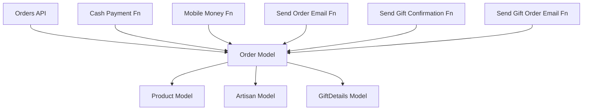

**Diagram sources**
- [models.py:10-122](file://backend/apps/orders/models.py#L10-L122)
- [models.py:10-99](file://backend/apps/products/models.py#L10-L99)
- [models.py:62-170](file://backend/apps/artisans/models.py#L62-L170)
- [models.py:9-36](file://backend/apps/gifting/models.py#L9-L36)
- [orders.py:10-17](file://backend/api/v1/orders.py#L10-L17)
- [process-cash-payment/index.ts](file://supabase/functions/process-cash-payment/index.ts)
- [process-momo-payment/index.ts](file://supabase/functions/process-momo-payment/index.ts)
- [send-order-email/index.ts](file://supabase/functions/send-order-email/index.ts)
- [send-gift-confirmation/index.ts](file://supabase/functions/send-gift-confirmation/index.ts)
- [send-gift-order-email/index.ts](file://supabase/functions/send-gift-order-email/index.ts)

**Section sources**
- [models.py:10-122](file://backend/apps/orders/models.py#L10-L122)
- [models.py:10-99](file://backend/apps/products/models.py#L10-L99)
- [models.py:62-170](file://backend/apps/artisans/models.py#L62-L170)
- [models.py:9-36](file://backend/apps/gifting/models.py#L9-L36)
- [orders.py:10-17](file://backend/api/v1/orders.py#L10-L17)

## Performance Considerations
- Use database indexes on frequently filtered fields (status, created_at, buyer, artisan).
- Batch operations for bulk order updates (status, payouts) to reduce round trips.
- Asynchronous tasks for notifications and inventory adjustments to avoid blocking API responses.
- Pagination for order listings to limit payload sizes.
- Denormalize computed totals at order time to avoid expensive joins during listing.

## Troubleshooting Guide
Common issues and resolutions:
- Payment not reflected: Verify payment function logs and ensure payment_reference is set; check order paid_at timestamp.
- Order stuck in pending payment: Confirm payment webhook integration and function triggers.
- Missing notifications: Validate email provider credentials and function permissions.
- Inventory not updating: Ensure stock decrement occurs before order confirmation and reconcile discrepancies.
- Refund errors: Confirm dispute resolution and payout status alignment with financial snapshots.

**Section sources**
- [models.py:77-103](file://backend/apps/orders/models.py#L77-L103)
- [process-cash-payment/index.ts](file://supabase/functions/process-cash-payment/index.ts)
- [process-momo-payment/index.ts](file://supabase/functions/process-momo-payment/index.ts)
- [send-order-email/index.ts](file://supabase/functions/send-order-email/index.ts)

## Conclusion
The Orders Management system is designed around a robust Order model with a clear lifecycle, integrated payment and notification functions, and dedicated frontend views for admins, artisans, and customers. While API endpoints are placeholders, the underlying models and integrations provide a solid foundation for implementing order listing, fulfillment, and analytics in upcoming sprints.

## Appendices

### API Endpoints (Planned)
- GET /api/v1/orders: List orders with filters (status, date range, buyer, artisan).
- POST /api/v1/orders/create: Create new order from cart/product selection.
- PATCH /api/v1/orders/{id}: Update status, shipping, payouts.
- DELETE /api/v1/orders/{id}: Cancel order (subject to policy).

**Section sources**
- [orders.py:10-17](file://backend/api/v1/orders.py#L10-L17)

### Search and Filtering (Planned)
- Filters: status, payment_method, shipping_country, date ranges, buyer/artisan.
- Sorting: created_at desc, delivered_at desc.
- Bulk actions: export CSV, mass status update, mass email.

**Section sources**
- [OrdersManager.tsx](file://apps/web/src/components/admin/OrdersManager.tsx)

### Reporting and Analytics (Planned)
- Sales volume and revenue by period.
- Artisan earnings and payout summaries.
- Popular products and regions.
- Fulfillment time metrics and on-time delivery rates.

**Section sources**
- [models.py:133-150](file://backend/apps/artisans/models.py#L133-L150)
- [models.py:111-122](file://backend/apps/orders/models.py#L111-L122)