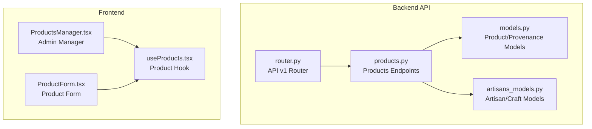
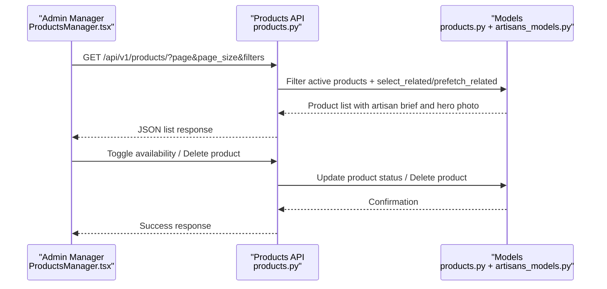
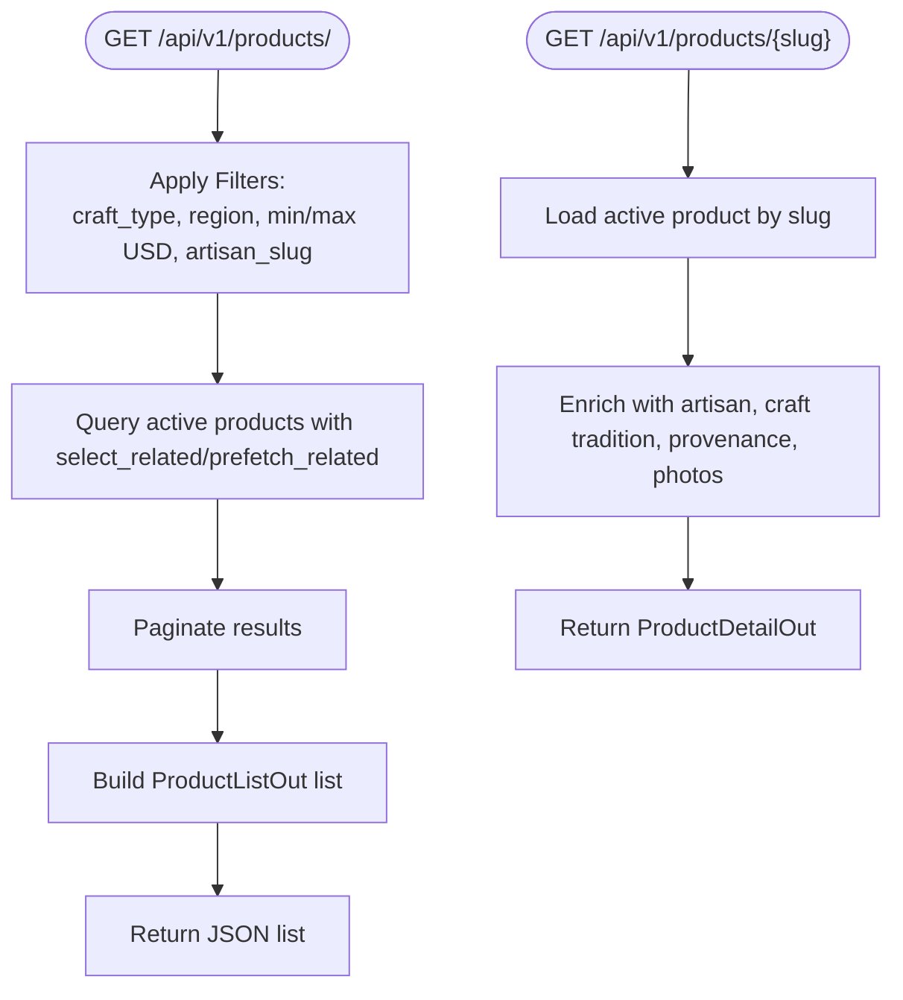
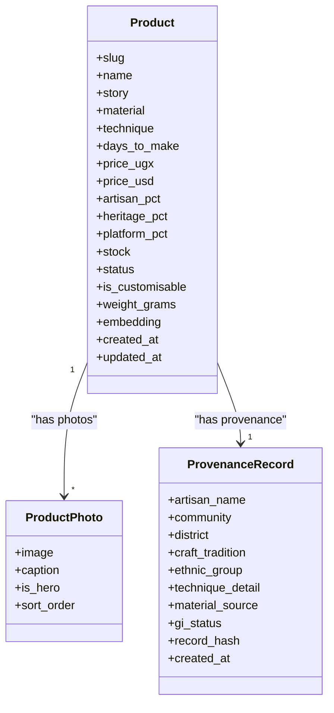
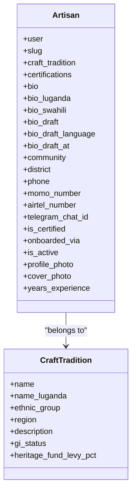
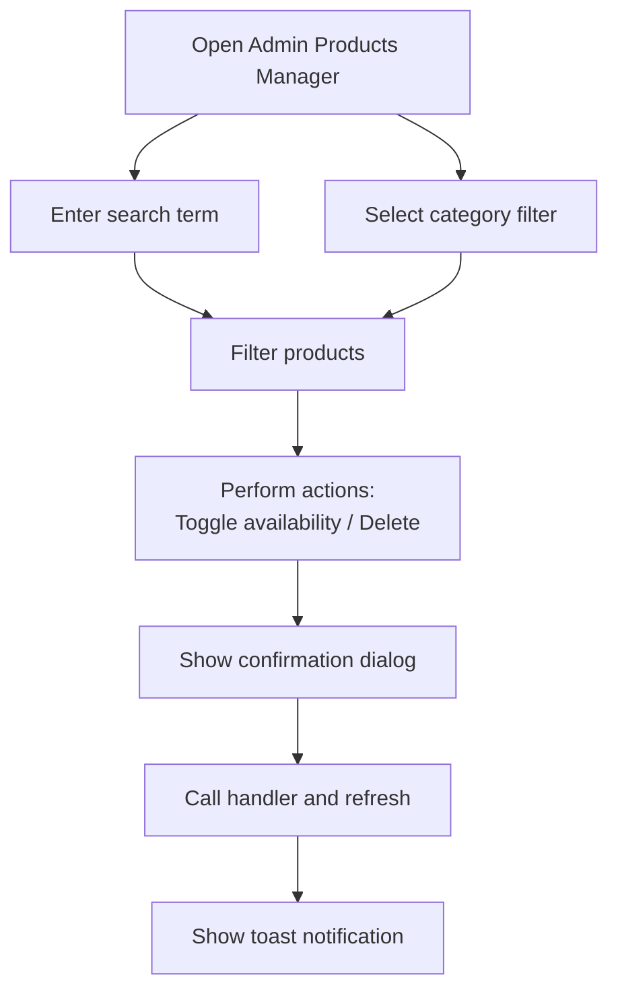
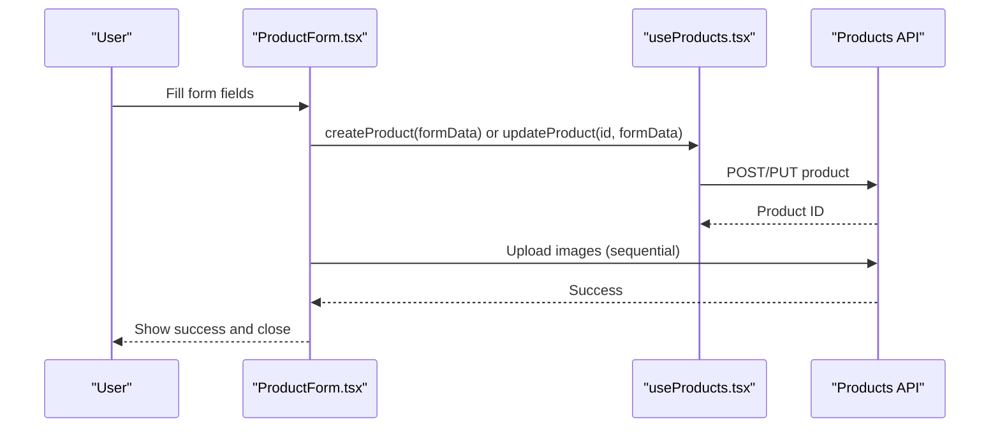
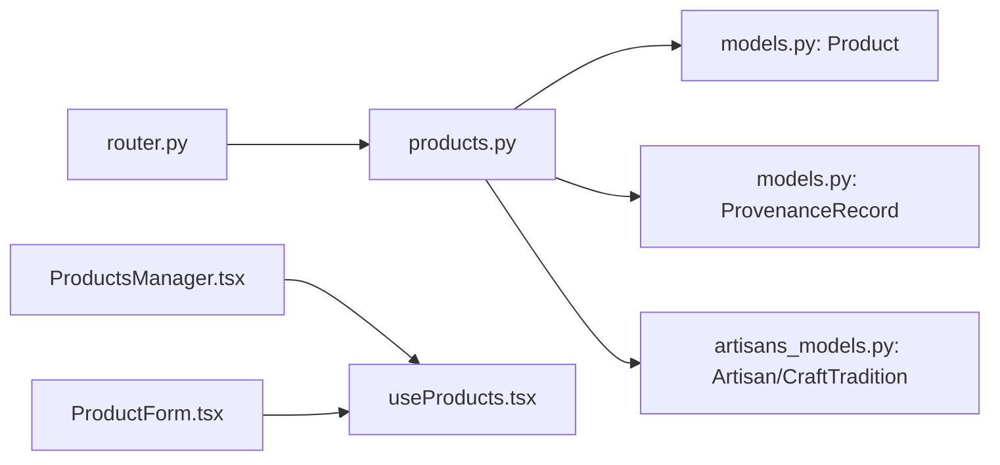

# Products Management

<cite>
**Referenced Files in This Document**
- [products.py](file://backend/api/v1/products.py)
- [models.py](file://backend/apps/products/models.py)
- [artisans_models.py](file://backend/apps/artisans/models.py)
- [router.py](file://backend/api/v1/router.py)
- [ProductsManager.tsx](file://apps/web/src/components/admin/ProductsManager.tsx)
- [ProductForm.tsx](file://apps/web/src/components/products/ProductForm.tsx)
- [useProducts.tsx](file://apps/web/src/hooks/useProducts.tsx)
</cite>

## Table of Contents
1. [Introduction](#introduction)
2. [Project Structure](#project-structure)
3. [Core Components](#core-components)
4. [Architecture Overview](#architecture-overview)
5. [Detailed Component Analysis](#detailed-component-analysis)
6. [Dependency Analysis](#dependency-analysis)
7. [Performance Considerations](#performance-considerations)
8. [Troubleshooting Guide](#troubleshooting-guide)
9. [Conclusion](#conclusion)

## Introduction
This document describes the Products Management interface for the Empindu artisan marketplace. It covers the product listing system, approval and moderation workflows, inventory management, artisan integration, category and search optimization, analytics and performance monitoring, and administrative tools for bulk operations and automated workflows. The documentation synthesizes backend APIs and frontend components to present a complete picture of how products are catalogued, moderated, curated, and surfaced to customers.

## Project Structure
The Products Management system spans backend Django applications and frontend React components:
- Backend API endpoints for product listing and detail retrieval
- Product and provenance models with embedded semantic search capability
- Artisan and craft tradition models that anchor cultural IP
- Frontend admin manager for product visibility and deletion
- Frontend product creation/editing form with image upload
- Frontend hook for fetching and caching product data

**Diagram sources**
- [router.py:1-40](file://backend/api/v1/router.py#L1-L40)
- [products.py:1-191](file://backend/api/v1/products.py#L1-L191)
- [models.py:1-153](file://backend/apps/products/models.py#L1-L153)
- [artisans_models.py:1-170](file://backend/apps/artisans/models.py#L1-L170)
- [ProductsManager.tsx:1-234](file://apps/web/src/components/admin/ProductsManager.tsx#L1-L234)
- [ProductForm.tsx:1-387](file://apps/web/src/components/products/ProductForm.tsx#L1-L387)
- [useProducts.tsx:1-135](file://apps/web/src/hooks/useProducts.tsx#L1-L135)

**Section sources**
- [router.py:1-40](file://backend/api/v1/router.py#L1-L40)
- [products.py:1-191](file://backend/api/v1/products.py#L1-L191)
- [models.py:1-153](file://backend/apps/products/models.py#L1-L153)
- [artisans_models.py:1-170](file://backend/apps/artisans/models.py#L1-L170)
- [ProductsManager.tsx:1-234](file://apps/web/src/components/admin/ProductsManager.tsx#L1-L234)
- [ProductForm.tsx:1-387](file://apps/web/src/components/products/ProductForm.tsx#L1-L387)
- [useProducts.tsx:1-135](file://apps/web/src/hooks/useProducts.tsx#L1-L135)

## Core Components
- Product listing and detail endpoints expose story-first product pages with artisan and provenance metadata.
- Product model supports pricing, revenue split, inventory, customization, and semantic embeddings for search.
- Provenance records capture immutable cultural attribution snapshots at listing time.
- Artisan model anchors craft traditions and certifications, linking products to cultural IP.
- Admin manager enables search, category filtering, availability toggling, and deletion.
- Product form supports creation and updates with image uploads and configurable options.
- Product hook centralizes fetching, caching, and filtering of product listings.

**Section sources**
- [products.py:74-191](file://backend/api/v1/products.py#L74-L191)
- [models.py:10-153](file://backend/apps/products/models.py#L10-L153)
- [artisans_models.py:62-170](file://backend/apps/artisans/models.py#L62-L170)
- [ProductsManager.tsx:41-234](file://apps/web/src/components/admin/ProductsManager.tsx#L41-L234)
- [ProductForm.tsx:24-387](file://apps/web/src/components/products/ProductForm.tsx#L24-L387)
- [useProducts.tsx:67-115](file://apps/web/src/hooks/useProducts.tsx#L67-L115)

## Architecture Overview
The product lifecycle integrates frontend forms and managers with backend models and endpoints. Administrators manage visibility and deletion via the admin manager. Artisans use the product form to create and update listings. The API serves paginated lists and detail views enriched with artisan and provenance data.

**Diagram sources**
- [ProductsManager.tsx:41-234](file://apps/web/src/components/admin/ProductsManager.tsx#L41-L234)
- [products.py:126-191](file://backend/api/v1/products.py#L126-L191)
- [models.py:10-153](file://backend/apps/products/models.py#L10-L153)
- [artisans_models.py:62-170](file://backend/apps/artisans/models.py#L62-L170)

## Detailed Component Analysis

### Backend API: Products Endpoints
- Public endpoints:
  - Product detail by slug with artisan and provenance metadata.
  - Product listing with filters (craft type, region, price range, artisan slug) and pagination.
- Response schemas:
  - ProductDetailOut includes story, materials, technique, pricing, artisan earnings, heritage fund contribution, stock, customization flag, artisan brief, provenance, and photos.
  - ProductListOut includes id, slug, name, truncated story, pricing, artisan earnings, stock, artisan brief, and hero photo URL.
- Filtering and pagination:
  - Faceted filters on craft tradition, artisan district, price range, and artisan slug.
  - Paginated results with configurable page size.

**Diagram sources**
- [products.py:126-191](file://backend/api/v1/products.py#L126-L191)

**Section sources**
- [products.py:74-191](file://backend/api/v1/products.py#L74-L191)

### Backend Models: Product and Provenance
- Product model:
  - Status lifecycle: draft, active, sold_out, archived.
  - Pricing and revenue split fields (artisan, heritage fund, platform).
  - Inventory and customization flags.
  - Embedding field for semantic search.
  - Foreign keys to artisan and craft tradition.
- ProductPhoto model:
  - Multiple images per product with hero image and sort order.
- ProvenanceRecord model:
  - Immutable snapshot of artisan and craft details at listing time.
  - Cultural IP attributes and optional blockchain hash.

**Diagram sources**
- [models.py:10-153](file://backend/apps/products/models.py#L10-L153)

**Section sources**
- [models.py:10-153](file://backend/apps/products/models.py#L10-L153)

### Backend Models: Artisan and Craft Traditions
- CraftTradition:
  - Cultural craft identity with GI status and heritage levy percentage.
- Artisan:
  - Links to User, CraftTradition, and Certifications.
  - Biographical and multilingual fields, location, contact info, certification status, and media assets.
  - Computed metrics for total earnings and order count.

**Diagram sources**
- [artisans_models.py:14-170](file://backend/apps/artisans/models.py#L14-L170)

**Section sources**
- [artisans_models.py:14-170](file://backend/apps/artisans/models.py#L14-L170)

### Frontend: Admin Products Manager
- Features:
  - Search by product name or description.
  - Category filter using predefined categories.
  - Availability toggle (visible/hidden) with confirmation feedback.
  - Bulk deletion with confirmation dialog.
  - Stock indicators with color-coded badges.
- Actions:
  - Calls external handlers for availability toggle and deletion.
  - Uses toast notifications for success/error feedback.

**Diagram sources**
- [ProductsManager.tsx:41-234](file://apps/web/src/components/admin/ProductsManager.tsx#L41-L234)

**Section sources**
- [ProductsManager.tsx:41-234](file://apps/web/src/components/admin/ProductsManager.tsx#L41-L234)

### Frontend: Product Creation and Editing Form
- Fields:
  - Basic info: name, category, price (UGX), stock quantity, description.
  - Product details: materials, use case, size category, dimensions, other skills.
  - Options: personalization, returnability, availability.
  - Image upload: up to five images with previews and primary selection.
- Behavior:
  - Create vs update mode based on presence of product prop.
  - Sequential image uploads after product creation/update.
  - Loading states during save and upload.

**Diagram sources**
- [ProductForm.tsx:24-387](file://apps/web/src/components/products/ProductForm.tsx#L24-L387)
- [useProducts.tsx:67-115](file://apps/web/src/hooks/useProducts.tsx#L67-L115)
- [products.py:126-191](file://backend/api/v1/products.py#L126-L191)

**Section sources**
- [ProductForm.tsx:24-387](file://apps/web/src/components/products/ProductForm.tsx#L24-L387)
- [useProducts.tsx:67-115](file://apps/web/src/hooks/useProducts.tsx#L67-L115)

### Frontend: Product Data Hook
- Responsibilities:
  - Fetch product listings with optional filters (craft type, region, price range).
  - Fetch single product by slug.
  - Manage loading state and error notifications.
- Integration:
  - Consumed by product listing pages and admin components.

**Section sources**
- [useProducts.tsx:67-115](file://apps/web/src/hooks/useProducts.tsx#L67-L115)

## Dependency Analysis
- API routing:
  - API v1 router registers products, artisans, orders, and gifting endpoints.
  - Authentication is JWT-based for protected routes.
- Endpoint dependencies:
  - Product endpoints depend on Product, ProvenanceRecord, and Artisan models.
  - Product listing leverages select_related and prefetch_related for performance.
- Frontend dependencies:
  - Admin manager and product form rely on the product hook for data.
  - Product form uses predefined category and size enumerations.

**Diagram sources**
- [router.py:30-40](file://backend/api/v1/router.py#L30-L40)
- [products.py:8-11](file://backend/api/v1/products.py#L8-L11)
- [models.py:10-153](file://backend/apps/products/models.py#L10-L153)
- [artisans_models.py:62-170](file://backend/apps/artisans/models.py#L62-L170)
- [ProductsManager.tsx:32](file://apps/web/src/components/admin/ProductsManager.tsx#L32)
- [ProductForm.tsx:16](file://apps/web/src/components/products/ProductForm.tsx#L16)
- [useProducts.tsx:2](file://apps/web/src/hooks/useProducts.tsx#L2)

**Section sources**
- [router.py:30-40](file://backend/api/v1/router.py#L30-L40)
- [products.py:8-11](file://backend/api/v1/products.py#L8-L11)
- [models.py:10-153](file://backend/apps/products/models.py#L10-L153)
- [artisans_models.py:62-170](file://backend/apps/artisans/models.py#L62-L170)
- [ProductsManager.tsx:32](file://apps/web/src/components/admin/ProductsManager.tsx#L32)
- [ProductForm.tsx:16](file://apps/web/src/components/products/ProductForm.tsx#L16)
- [useProducts.tsx:2](file://apps/web/src/hooks/useProducts.tsx#L2)

## Performance Considerations
- Database queries:
  - Product listing uses select_related and prefetch_related to minimize N+1 queries.
  - Pagination reduces payload size and improves responsiveness.
- Image handling:
  - Limit uploads to five images per product to control storage and bandwidth.
  - Use hero image flag to optimize primary image rendering.
- Search and embeddings:
  - Product embedding field supports semantic search; ensure periodic updates via background tasks.
- Caching:
  - Frontend hook manages loading states; consider adding caching strategies for repeated filters.

[No sources needed since this section provides general guidance]

## Troubleshooting Guide
- Product listing errors:
  - Verify filters and pagination parameters; ensure active status filtering is applied.
  - Confirm select_related/prefetch_related are functioning as expected.
- Image upload failures:
  - Check file count limit and accepted formats.
  - Ensure sequential upload completion before closing the form.
- Admin actions:
  - Confirm availability toggle and deletion handlers resolve promises and show appropriate toasts.
- Authentication:
  - Ensure JWT tokens are included for protected endpoints.

**Section sources**
- [ProductsManager.tsx:57-80](file://apps/web/src/components/admin/ProductsManager.tsx#L57-L80)
- [ProductForm.tsx:71-104](file://apps/web/src/components/products/ProductForm.tsx#L71-L104)
- [router.py:10-28](file://backend/api/v1/router.py#L10-L28)

## Conclusion
The Products Management interface combines robust backend models and endpoints with intuitive frontend tools. Administrators can efficiently moderate and curate product listings, while artisans can easily create and update their offerings. The system’s emphasis on cultural attribution, inventory controls, and performance-conscious design supports a scalable marketplace experience.