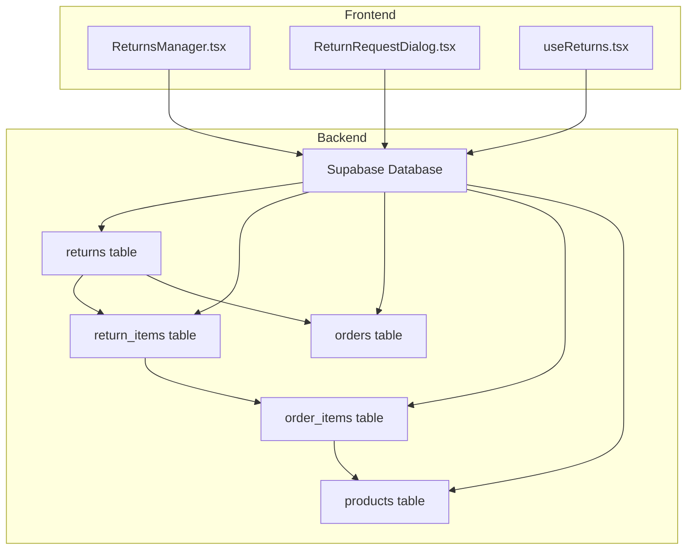
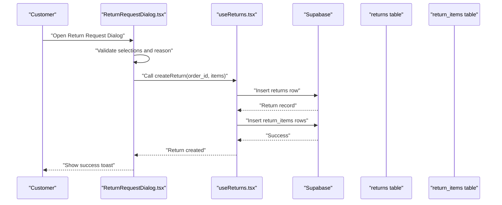
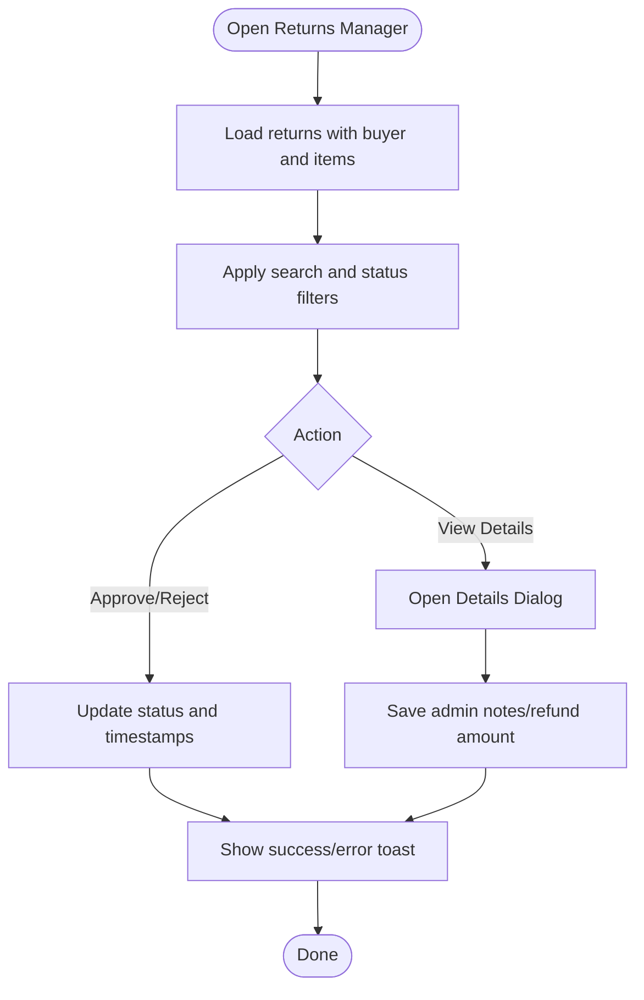
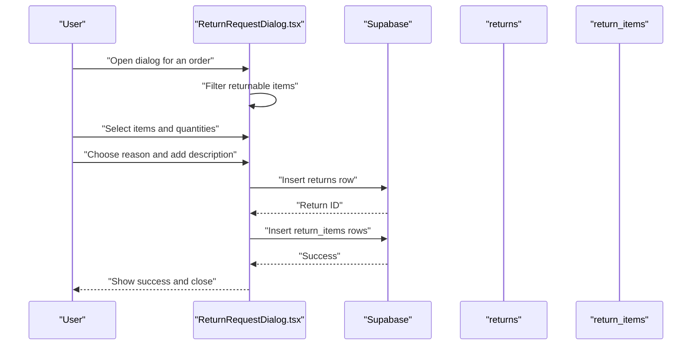
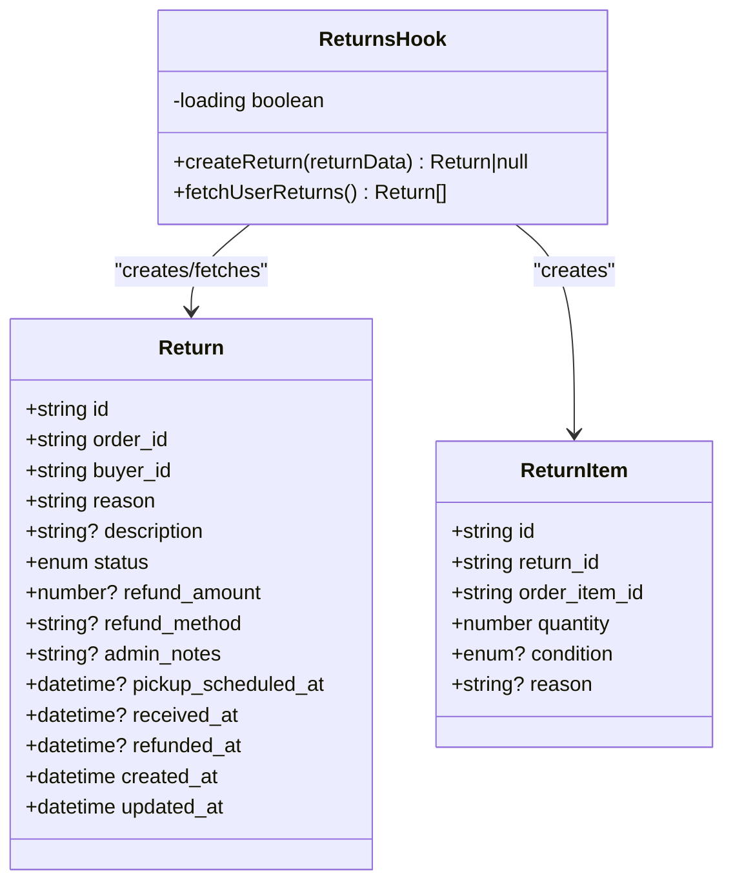
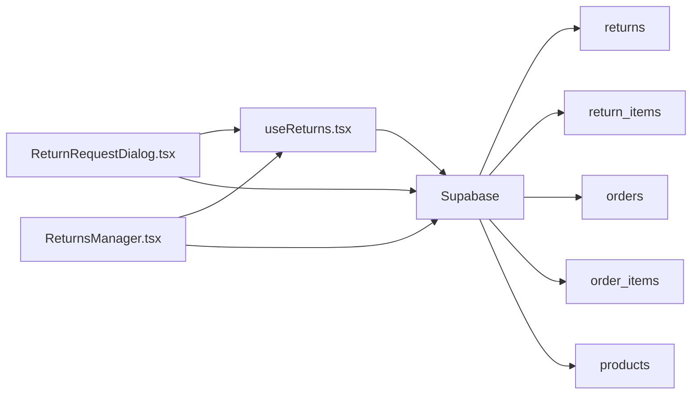

# Returns & Refunds Management

<cite>
**Referenced Files in This Document**
- [ReturnsManager.tsx](file://apps/web/src/components/admin/ReturnsManager.tsx)
- [useReturns.tsx](file://apps/web/src/hooks/useReturns.tsx)
- [ReturnRequestDialog.tsx](file://apps/web/src/components/orders/ReturnRequestDialog.tsx)
- [20260107224910_0b6f10e2-c8bb-49bb-ba91-d7b9b48cd27c.sql](file://supabase/migrations/20260107224910_0b6f10e2-c8bb-49bb-ba91-d7b9b48cd27c.sql)
</cite>

## Table of Contents
1. [Introduction](#introduction)
2. [Project Structure](#project-structure)
3. [Core Components](#core-components)
4. [Architecture Overview](#architecture-overview)
5. [Detailed Component Analysis](#detailed-component-analysis)
6. [Dependency Analysis](#dependency-analysis)
7. [Performance Considerations](#performance-considerations)
8. [Troubleshooting Guide](#troubleshooting-guide)
9. [Conclusion](#conclusion)
10. [Appendices](#appendices)

## Introduction
This document describes the Returns & Refunds Management system, covering return request processing, approval workflows, refund automation, policy enforcement, damage assessment, restocking procedures, tracking, communication, integration with inventory and financial systems, compliance reporting, analytics, fraud detection, and policy optimization. It synthesizes frontend components and backend database schema to present a complete operational picture.

## Project Structure
The Returns & Refunds system spans frontend React components and Supabase database schema:
- Frontend components:
  - Admin panel for managing returns
  - Customer-facing return request dialog
  - Hook for creating and retrieving returns
- Backend schema:
  - Returns and return items tables with row-level security policies
  - Product returnability flag and related order/pickup enhancements



**Diagram sources**
- [ReturnsManager.tsx:1-413](file://apps/web/src/components/admin/ReturnsManager.tsx#L1-L413)
- [ReturnRequestDialog.tsx:1-258](file://apps/web/src/components/orders/ReturnRequestDialog.tsx#L1-L258)
- [useReturns.tsx:1-150](file://apps/web/src/hooks/useReturns.tsx#L1-L150)
- [20260107224910_0b6f10e2-c8bb-49bb-ba91-d7b9b48cd27c.sql:118-134](file://supabase/migrations/20260107224910_0b6f10e2-c8bb-49bb-ba91-d7b9b48cd27c.sql#L118-L134)

**Section sources**
- [ReturnsManager.tsx:1-413](file://apps/web/src/components/admin/ReturnsManager.tsx#L1-L413)
- [ReturnRequestDialog.tsx:1-258](file://apps/web/src/components/orders/ReturnRequestDialog.tsx#L1-L258)
- [useReturns.tsx:1-150](file://apps/web/src/hooks/useReturns.tsx#L1-L150)
- [20260107224910_0b6f10e2-c8bb-49bb-ba91-d7b9b48cd27c.sql:1-235](file://supabase/migrations/20260107224910_0b6f10e2-c8bb-49bb-ba91-d7b9b48cd27c.sql#L1-L235)

## Core Components
- Admin Returns Manager: Displays returns, filters/searches, updates statuses, records admin notes and refund amounts, and timestamps key lifecycle events.
- Customer Return Request Dialog: Allows buyers to select returnable items, specify reasons, and submit return requests linked to their order.
- Returns Hook: Encapsulates creation of return headers and items, retrieval of user returns, and error handling.

Key capabilities:
- Return request submission with item-level selection and conditions
- Status transitions and audit timestamps
- Admin-only visibility and updates for returns and return items
- Buyer-only access to their own returns and items

**Section sources**
- [ReturnsManager.tsx:48-180](file://apps/web/src/components/admin/ReturnsManager.tsx#L48-L180)
- [ReturnRequestDialog.tsx:45-149](file://apps/web/src/components/orders/ReturnRequestDialog.tsx#L45-L149)
- [useReturns.tsx:44-133](file://apps/web/src/hooks/useReturns.tsx#L44-L133)

## Architecture Overview
The system integrates frontend UI with Supabase Realtime and Row Level Security (RLS):
- Buyers submit returns via dialogs and hooks; backend enforces buyer ownership and order linkage.
- Admins manage returns via the manager component; RLS restricts access to authorized users.
- Return items connect to order items, enabling granular tracking per ordered product.



**Diagram sources**
- [ReturnRequestDialog.tsx:73-149](file://apps/web/src/components/orders/ReturnRequestDialog.tsx#L73-L149)
- [useReturns.tsx:49-107](file://apps/web/src/hooks/useReturns.tsx#L49-L107)
- [20260107224910_0b6f10e2-c8bb-49bb-ba91-d7b9b48cd27c.sql:118-134](file://supabase/migrations/20260107224910_0b6f10e2-c8bb-49bb-ba91-d7b9b48cd27c.sql#L118-L134)

## Detailed Component Analysis

### Admin Returns Manager
Responsibilities:
- List and filter returns by ID, customer, order, and status
- Update return status with appropriate timestamps
- Edit admin notes and refund amount
- View associated buyer profile and return items

Operational flow:
- Queries returns with embedded order totals, buyer profiles, and return items
- Supports live filtering and status updates
- Uses mutation to persist status changes and timestamps



**Diagram sources**
- [ReturnsManager.tsx:78-180](file://apps/web/src/components/admin/ReturnsManager.tsx#L78-L180)
- [ReturnsManager.tsx:115-162](file://apps/web/src/components/admin/ReturnsManager.tsx#L115-L162)

**Section sources**
- [ReturnsManager.tsx:68-413](file://apps/web/src/components/admin/ReturnsManager.tsx#L68-L413)

### Customer Return Request Dialog
Responsibilities:
- Present returnable items from an order
- Allow item selection and quantity adjustment
- Capture return reason and optional description
- Submit return header and items to backend



**Diagram sources**
- [ReturnRequestDialog.tsx:45-149](file://apps/web/src/components/orders/ReturnRequestDialog.tsx#L45-L149)

**Section sources**
- [ReturnRequestDialog.tsx:45-258](file://apps/web/src/components/orders/ReturnRequestDialog.tsx#L45-L258)

### Returns Hook
Responsibilities:
- Create return headers and items atomically
- Retrieve user-specific returns
- Provide standardized return and item metadata



**Diagram sources**
- [useReturns.tsx:6-42](file://apps/web/src/hooks/useReturns.tsx#L6-L42)
- [useReturns.tsx:44-133](file://apps/web/src/hooks/useReturns.tsx#L44-L133)

**Section sources**
- [useReturns.tsx:44-150](file://apps/web/src/hooks/useReturns.tsx#L44-L150)

### Database Schema and Policies
Core tables and constraints:
- returns: tracks return lifecycle, buyer linkage, and refund metadata
- return_items: maps return to specific order items, captures quantity and condition
- Products include a returnability flag influencing which items appear returnable
- Row Level Security policies enforce buyer/admin access

```mermaid
erDiagram
ORDERS {
uuid id PK
uuid buyer_id FK
text delivery_method
uuid? pickup_location_id FK
decimal total_amount
}
ORDER_ITEMS {
uuid id PK
uuid order_id FK
uuid product_id FK
number quantity
decimal unit_price
}
PRODUCTS {
uuid id PK
uuid artisan_id FK
text name
boolean is_returnable
text materials
text use_case
boolean is_personalizable
text size_category
text size_dimensions
}
RETURNS {
uuid id PK
uuid order_id FK
uuid buyer_id
text reason
text? description
text status
decimal? refund_amount
text? refund_method
text? admin_notes
timestamptz? pickup_scheduled_at
timestamptz? received_at
timestamptz? refunded_at
timestamptz created_at
timestamptz updated_at
}
RETURN_ITEMS {
uuid id PK
uuid return_id FK
uuid order_item_id FK
number quantity
text? condition
text? reason
timestamptz created_at
}
ORDERS ||--o{ ORDER_ITEMS : "contains"
ORDER_ITEMS ||--o{ RETURN_ITEMS : "links to"
ORDERS ||--o{ RETURNS : "generates"
PRODUCTS ||--o{ ORDER_ITEMS : "produces"
```

**Diagram sources**
- [20260107224910_0b6f10e2-c8bb-49bb-ba91-d7b9b48cd27c.sql:118-134](file://supabase/migrations/20260107224910_0b6f10e2-c8bb-49bb-ba91-d7b9b48cd27c.sql#L118-L134)
- [20260107224910_0b6f10e2-c8bb-49bb-ba91-d7b9b48cd27c.sql:170-178](file://supabase/migrations/20260107224910_0b6f10e2-c8bb-49bb-ba91-d7b9b48cd27c.sql#L170-L178)
- [20260107224910_0b6f10e2-c8bb-49bb-ba91-d7b9b48cd27c.sql:1-9](file://supabase/migrations/20260107224910_0b6f10e2-c8bb-49bb-ba91-d7b9b48cd27c.sql#L1-L9)

**Section sources**
- [20260107224910_0b6f10e2-c8bb-49bb-ba91-d7b9b48cd27c.sql:118-134](file://supabase/migrations/20260107224910_0b6f10e2-c8bb-49bb-ba91-d7b9b48cd27c.sql#L118-L134)
- [20260107224910_0b6f10e2-c8bb-49bb-ba91-d7b9b48cd27c.sql:170-178](file://supabase/migrations/20260107224910_0b6f10e2-c8bb-49bb-ba91-d7b9b48cd27c.sql#L170-L178)
- [20260107224910_0b6f10e2-c8bb-49bb-ba91-d7b9b48cd27c.sql:1-9](file://supabase/migrations/20260107224910_0b6f10e2-c8bb-49bb-ba91-d7b9b48cd27c.sql#L1-L9)

## Dependency Analysis
- Frontend depends on Supabase client for reads/writes
- Admin component queries buyer profiles separately to enrich return listings
- Return items depend on order items; returns depend on orders
- RLS policies govern access to returns and return items



**Diagram sources**
- [ReturnsManager.tsx:78-113](file://apps/web/src/components/admin/ReturnsManager.tsx#L78-L113)
- [ReturnRequestDialog.tsx:101-125](file://apps/web/src/components/orders/ReturnRequestDialog.tsx#L101-L125)
- [useReturns.tsx:62-86](file://apps/web/src/hooks/useReturns.tsx#L62-L86)
- [20260107224910_0b6f10e2-c8bb-49bb-ba91-d7b9b48cd27c.sql:118-134](file://supabase/migrations/20260107224910_0b6f10e2-c8bb-49bb-ba91-d7b9b48cd27c.sql#L118-L134)

**Section sources**
- [ReturnsManager.tsx:78-113](file://apps/web/src/components/admin/ReturnsManager.tsx#L78-L113)
- [ReturnRequestDialog.tsx:101-125](file://apps/web/src/components/orders/ReturnRequestDialog.tsx#L101-L125)
- [useReturns.tsx:62-86](file://apps/web/src/hooks/useReturns.tsx#L62-L86)

## Performance Considerations
- Minimize N+1 queries: Admin component already fetches buyer profiles in bulk and maps them to reduce round trips.
- Pagination: For large datasets, consider paginated queries in admin views.
- Debouncing: Apply debounced search in admin filters to avoid excessive re-fetches.
- Conditional rendering: Avoid heavy computations when lists are empty.

## Troubleshooting Guide
Common issues and resolutions:
- Authentication errors when creating returns: Ensure user is logged in before invoking creation functions.
- Missing buyer profile data: Verify buyer profile exists and is linked to the buyer ID.
- Duplicate or invalid return items: Validate order_item_id existence and quantity constraints.
- Access denied: Confirm RLS policies allow buyer/admin access to returns and return items.

**Section sources**
- [useReturns.tsx:49-107](file://apps/web/src/hooks/useReturns.tsx#L49-L107)
- [ReturnsManager.tsx:99-112](file://apps/web/src/components/admin/ReturnsManager.tsx#L99-L112)
- [20260107224910_0b6f10e2-c8bb-49bb-ba91-d7b9b48cd27c.sql:139-167](file://supabase/migrations/20260107224910_0b6f10e2-c8bb-49bb-ba91-d7b9b48cd27c.sql#L139-L167)

## Conclusion
The Returns & Refunds Management system provides a secure, policy-enforced pathway for customers to request returns and for administrators to approve, track, and refund them. Its design leverages Supabase RLS, structured tables for return items, and intuitive UI components to support both automated and manual workflows.

## Appendices

### Return Lifecycle and Status Transitions
- requested → approved → received → refunded → completed
- Timestamps capture received and refunded events for auditability
- Admin notes enable internal commentary for transparency

**Section sources**
- [ReturnsManager.tsx:138-148](file://apps/web/src/components/admin/ReturnsManager.tsx#L138-L148)
- [20260107224910_0b6f10e2-c8bb-49bb-ba91-d7b9b48cd27c.sql:125-133](file://supabase/migrations/20260107224910_0b6f10e2-c8bb-49bb-ba91-d7b9b48cd27c.sql#L125-L133)

### Return Policy Enforcement and Damage Assessment
- Product returnability flag determines which items appear returnable
- Item condition field supports damage assessment during receipt
- Admin can set refund amount and method, and add notes for compliance

**Section sources**
- [20260107224910_0b6f10e2-c8bb-49bb-ba91-d7b9b48cd27c.sql:7-9](file://supabase/migrations/20260107224910_0b6f10e2-c8bb-49bb-ba91-d7b9b48cd27c.sql#L7-L9)
- [ReturnRequestDialog.tsx:36-43](file://apps/web/src/components/orders/ReturnRequestDialog.tsx#L36-L43)
- [useReturns.tsx:144-149](file://apps/web/src/hooks/useReturns.tsx#L144-L149)

### Restocking Procedures
- Return items reference order items; restocking logic can be implemented by updating inventory counts after received/refunded statuses
- Consider adding a restock action in admin UI to increment stock quantities upon validated returns

[No sources needed since this section provides general guidance]

### Communication Workflows and Customer Service Integration
- Admin notes serve as internal communication channel
- Status updates can be surfaced to customers via email/SMS triggers
- Consider adding outbound notification hooks for each status change

[No sources needed since this section provides general guidance]

### Financial Reconciliation and Compliance Reporting
- Refund amount and method recorded per return
- Timestamps enable audit trails for compliance
- Export return reports by date range, status, and reason for financial reconciliation

[No sources needed since this section provides general guidance]

### Return Analytics, Fraud Detection, and Policy Optimization
- Analytics: Track return rates by product, reason, and time period
- Fraud detection: Monitor frequent returns, mismatched conditions, and suspicious patterns
- Policy optimization: Use analytics to refine returnability flags and adjust policies

[No sources needed since this section provides general guidance]

### Automated Return Processing, Manual Review, and Escalation
- Automated: Enforce returnability and basic validations at submission
- Manual review: Admin approval step before initiating refund
- Escalation: Flag high-value or flagged returns for supervisor approval

[No sources needed since this section provides general guidance]