# Users Management

<cite>
**Referenced Files in This Document**
- [UsersManager.tsx](file://apps/web/src/components/admin/UsersManager.tsx)
- [Admin.tsx](file://apps/web/src/pages/Admin.tsx)
- [useAuth.tsx](file://apps/web/src/hooks/useAuth.tsx)
- [useAdminData.tsx](file://apps/web/src/hooks/useAdminData.tsx)
- [types.ts](file://apps/web/src/integrations/supabase/types.ts)
- [client.ts](file://apps/web/src/integrations/supabase/client.ts)
- [router.py](file://backend/api/v1/router.py)
- [admin.py](file://backend/apps/artisans/admin.py)
- [models.py](file://backend/apps/artisans/models.py)
- [middleware.py](file://backend/apps/artisans/middleware.py)
- [20251231095959_3473bebe-42ab-4109-8633-54732ebf1eaf.sql](file://supabase/migrations/20251231095959_3473bebe-42ab-4109-8633-54732ebf1eaf.sql)
- [20260101211534_d1ce3159-d630-4859-8ee8-6361241b244c.sql](file://supabase/migrations/20260101211534_d1ce3159-d630-4859-8ee8-6361241b244c.sql)
- [20260109095251_6889a1b9-3b1c-4b8f-9535-f3ef095414de.sql](file://supabase/migrations/20260109095251_6889a1b9-3b1c-4b8f-9535-f3ef095414de.sql)
- [20260121122109_0b1cb36d-aa4e-4dd7-a125-c453bc87fffe.sql](file://supabase/migrations/20260121122109_0b1cb36d-aa4e-4dd7-a125-c453bc87fffe.sql)
</cite>

## Table of Contents
1. [Introduction](#introduction)
2. [Project Structure](#project-structure)
3. [Core Components](#core-components)
4. [Architecture Overview](#architecture-overview)
5. [Detailed Component Analysis](#detailed-component-analysis)
6. [Dependency Analysis](#dependency-analysis)
7. [Performance Considerations](#performance-considerations)
8. [Troubleshooting Guide](#troubleshooting-guide)
9. [Conclusion](#conclusion)
10. [Appendices](#appendices)

## Introduction
This document describes the Users Management system for the platform. It covers the administrative interface for listing users, viewing profiles, assigning roles, verifying accounts, and understanding user activity through analytics. It also documents the integration with the authentication and authorization system, data privacy and compliance controls, and the UI patterns used to manage different user types (buyers, artisans, administrators).

## Project Structure
The Users Management feature spans frontend and backend components:
- Frontend admin page and manager component for user role management
- Authentication and authorization hooks
- Supabase schema and row-level security (RLS) policies
- Backend API router and artisan admin configuration

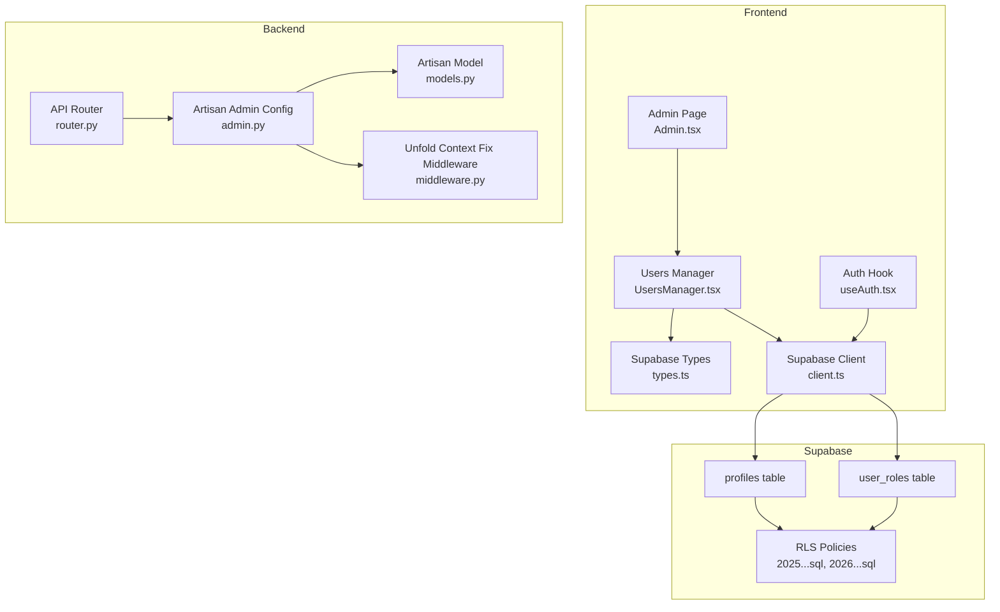

**Diagram sources**
- [Admin.tsx:18-162](file://apps/web/src/pages/Admin.tsx#L18-L162)
- [UsersManager.tsx:33-292](file://apps/web/src/components/admin/UsersManager.tsx#L33-L292)
- [useAuth.tsx:37-176](file://apps/web/src/hooks/useAuth.tsx#L37-L176)
- [types.ts:937-951](file://apps/web/src/integrations/supabase/types.ts#L937-L951)
- [router.py:10-40](file://backend/api/v1/router.py#L10-L40)
- [admin.py:10-92](file://backend/apps/artisans/admin.py#L10-L92)
- [models.py:62-170](file://backend/apps/artisans/models.py#L62-L170)
- [middleware.py:7-29](file://backend/apps/artisans/middleware.py#L7-L29)
- [20251231095959_3473bebe-42ab-4109-8633-54732ebf1eaf.sql:65-96](file://supabase/migrations/20251231095959_3473bebe-42ab-4109-8633-54732ebf1eaf.sql#L65-L96)
- [20260101211534_d1ce3159-d630-4859-8ee8-6361241b244c.sql:1-31](file://supabase/migrations/20260101211534_d1ce3159-d630-4859-8ee8-6361241b244c.sql#L1-L31)
- [20260109095251_6889a1b9-3b1c-4b8f-9535-f3ef095414de.sql:1-7](file://supabase/migrations/20260109095251_6889a1b9-3b1c-4b8f-9535-f3ef095414de.sql#L1-L7)
- [20260121122109_0b1cb36d-aa4e-4dd7-a125-c453bc87fffe.sql:1-36](file://supabase/migrations/20260121122109_0b1cb36d-aa4e-4dd7-a125-c453bc87fffe.sql#L1-L36)

**Section sources**
- [Admin.tsx:18-162](file://apps/web/src/pages/Admin.tsx#L18-L162)
- [UsersManager.tsx:33-292](file://apps/web/src/components/admin/UsersManager.tsx#L33-L292)
- [useAuth.tsx:37-176](file://apps/web/src/hooks/useAuth.tsx#L37-L176)
- [types.ts:937-951](file://apps/web/src/integrations/supabase/types.ts#L937-L951)
- [router.py:10-40](file://backend/api/v1/router.py#L10-L40)
- [admin.py:10-92](file://backend/apps/artisans/admin.py#L10-L92)
- [models.py:62-170](file://backend/apps/artisans/models.py#L62-L170)
- [middleware.py:7-29](file://backend/apps/artisans/middleware.py#L7-L29)
- [20251231095959_3473bebe-42ab-4109-8633-54732ebf1eaf.sql:65-96](file://supabase/migrations/20251231095959_3473bebe-42ab-4109-8633-54732ebf1eaf.sql#L65-L96)
- [20260101211534_d1ce3159-d630-4859-8ee8-6361241b244c.sql:1-31](file://supabase/migrations/20260101211534_d1ce3159-d630-4859-8ee8-6361241b244c.sql#L1-L31)
- [20260109095251_6889a1b9-3b1c-4b8f-9535-f3ef095414de.sql:1-7](file://supabase/migrations/20260109095251_6889a1b9-3b1c-4b8f-9535-f3ef095414de.sql#L1-L7)
- [20260121122109_0b1cb36d-aa4e-4dd7-a125-c453bc87fffe.sql:1-36](file://supabase/migrations/20260121122109_0b1cb36d-aa4e-4dd7-a125-c453bc87fffe.sql#L1-L36)

## Core Components
- Users Manager UI: Fetches users, displays roles, supports role changes, and search/filtering.
- Admin Page: Hosts the Users tab within the admin dashboard.
- Auth Hook: Provides authentication state, session, profile, and role resolution.
- Supabase Types: Declares database tables, enums, views, and functions used by the UI.
- Backend API Router: Centralizes API authentication and routes.
- Artisan Admin: Django admin configuration for artisan records and certification actions.
- Supabase Policies: Define who can view and modify user roles and profiles.

Key responsibilities:
- User listing and filtering by name or ID
- Role assignment among buyer, artisan, admin
- Verification status display
- Role statistics and quick actions
- Integration with Supabase for auth and data
- Security via RLS and admin-only role management

**Section sources**
- [UsersManager.tsx:33-292](file://apps/web/src/components/admin/UsersManager.tsx#L33-L292)
- [Admin.tsx:18-162](file://apps/web/src/pages/Admin.tsx#L18-L162)
- [useAuth.tsx:37-176](file://apps/web/src/hooks/useAuth.tsx#L37-L176)
- [types.ts:937-951](file://apps/web/src/integrations/supabase/types.ts#L937-L951)
- [router.py:10-40](file://backend/api/v1/router.py#L10-L40)
- [admin.py:10-92](file://backend/apps/artisans/admin.py#L10-L92)
- [20251231095959_3473bebe-42ab-4109-8633-54732ebf1eaf.sql:65-96](file://supabase/migrations/20251231095959_3473bebe-42ab-4109-8633-54732ebf1eaf.sql#L65-L96)

## Architecture Overview
The Users Management system integrates the frontend admin UI with Supabase for authentication and data, and with backend services for artisan-related administration.

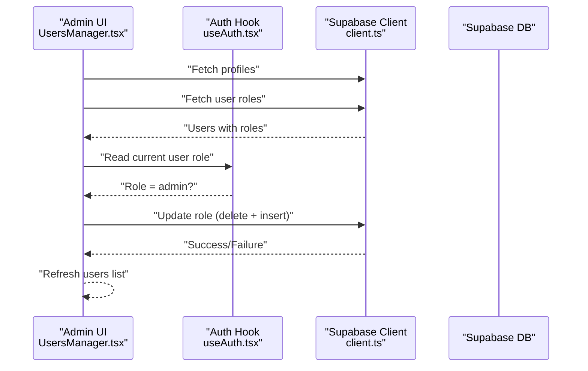

**Diagram sources**
- [UsersManager.tsx:45-123](file://apps/web/src/components/admin/UsersManager.tsx#L45-L123)
- [useAuth.tsx:56-66](file://apps/web/src/hooks/useAuth.tsx#L56-L66)
- [client.ts](file://apps/web/src/integrations/supabase/client.ts)
- [20251231095959_3473bebe-42ab-4109-8633-54732ebf1eaf.sql:82-95](file://supabase/migrations/20251231095959_3473bebe-42ab-4109-8633-54732ebf1eaf.sql#L82-L95)

**Section sources**
- [UsersManager.tsx:45-123](file://apps/web/src/components/admin/UsersManager.tsx#L45-L123)
- [useAuth.tsx:56-66](file://apps/web/src/hooks/useAuth.tsx#L56-L66)
- [20251231095959_3473bebe-42ab-4109-8633-54732ebf1eaf.sql:82-95](file://supabase/migrations/20251231095959_3473bebe-42ab-4109-8633-54732ebf1eaf.sql#L82-L95)

## Detailed Component Analysis

### Users Manager UI
Responsibilities:
- Load users from profiles and user_roles tables
- Render role badges and verification status
- Filter users by name or ID
- Trigger role change with confirmation dialog
- Display role statistics

Implementation highlights:
- Fetches profiles and roles separately, then merges into a single list
- Uses a confirmation dialog before applying role changes
- Provides a search box to filter users by name or ID
- Displays counts for each role type

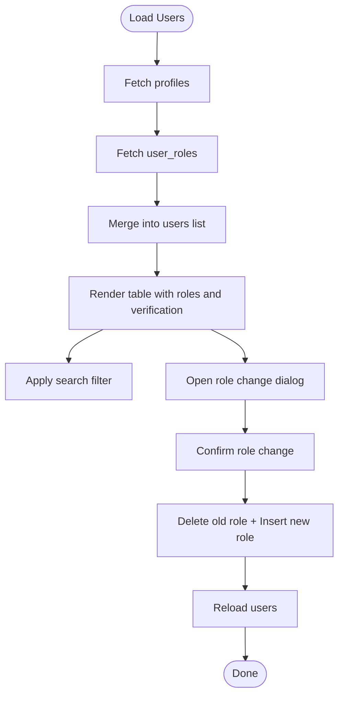

**Diagram sources**
- [UsersManager.tsx:45-123](file://apps/web/src/components/admin/UsersManager.tsx#L45-L123)
- [UsersManager.tsx:125-128](file://apps/web/src/components/admin/UsersManager.tsx#L125-L128)
- [UsersManager.tsx:130-141](file://apps/web/src/components/admin/UsersManager.tsx#L130-L141)

**Section sources**
- [UsersManager.tsx:33-292](file://apps/web/src/components/admin/UsersManager.tsx#L33-L292)

### Admin Dashboard Integration
- The Admin page hosts a tabbed interface and mounts the Users Manager inside the “Users” tab.
- It enforces admin-only access by checking role and redirecting unauthorized users.

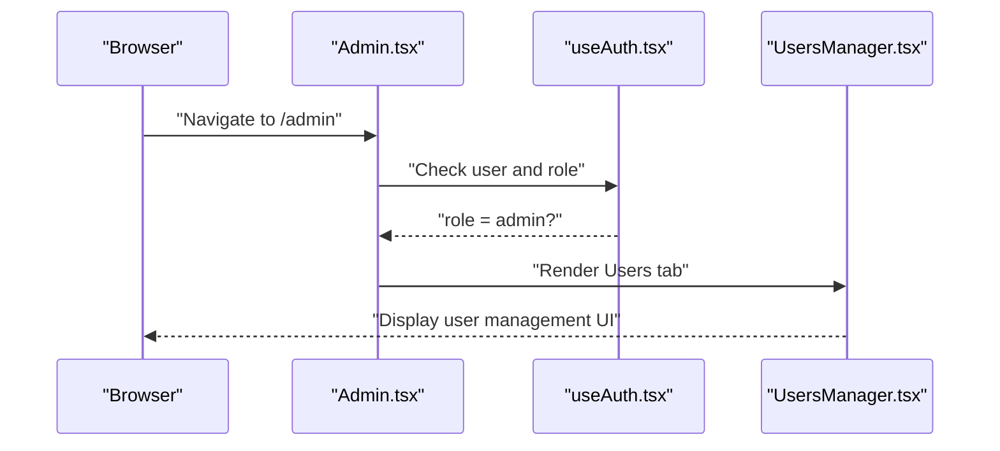

**Diagram sources**
- [Admin.tsx:18-162](file://apps/web/src/pages/Admin.tsx#L18-L162)
- [useAuth.tsx:19-42](file://apps/web/src/hooks/useAuth.tsx#L19-L42)

**Section sources**
- [Admin.tsx:18-162](file://apps/web/src/pages/Admin.tsx#L18-L162)
- [useAuth.tsx:19-42](file://apps/web/src/hooks/useAuth.tsx#L19-L42)

### Authentication and Authorization Hooks
- Resolves user session and profile from Supabase.
- Loads the user’s role from user_roles and exposes it to the UI.
- Provides sign-in, sign-out, and profile update utilities.

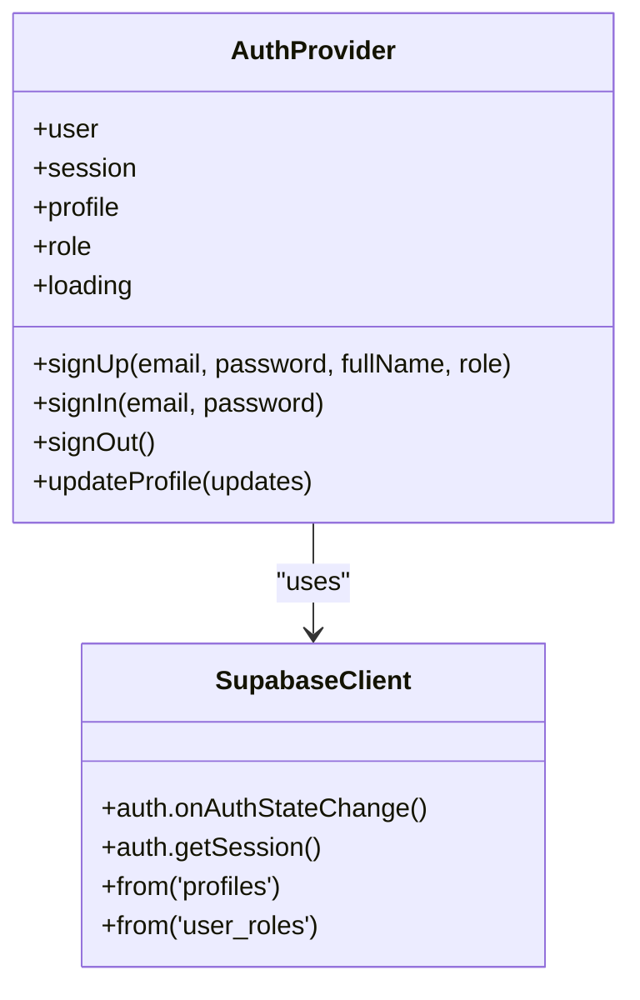

**Diagram sources**
- [useAuth.tsx:37-176](file://apps/web/src/hooks/useAuth.tsx#L37-L176)
- [client.ts](file://apps/web/src/integrations/supabase/client.ts)

**Section sources**
- [useAuth.tsx:37-176](file://apps/web/src/hooks/useAuth.tsx#L37-L176)

### Supabase Schema and Types
- Declares the app_role enum with values admin, artisan, buyer.
- Defines tables for profiles and user_roles.
- Exposes helper functions like get_user_role and has_role.
- Declares a public_profiles view for safe public exposure.

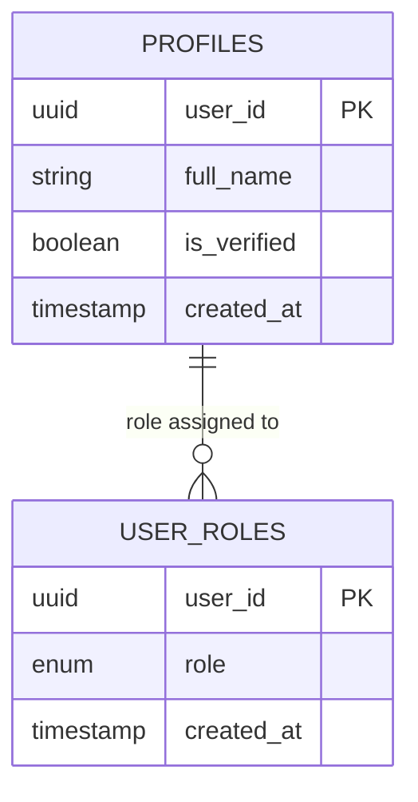

**Diagram sources**
- [types.ts:684-731](file://apps/web/src/integrations/supabase/types.ts#L684-L731)
- [types.ts:860-880](file://apps/web/src/integrations/supabase/types.ts#L860-L880)
- [types.ts:937-946](file://apps/web/src/integrations/supabase/types.ts#L937-L946)
- [20260121122109_0b1cb36d-aa4e-4dd7-a125-c453bc87fffe.sql:21-33](file://supabase/migrations/20260121122109_0b1cb36d-aa4e-4dd7-a125-c453bc87fffe.sql#L21-L33)

**Section sources**
- [types.ts:684-731](file://apps/web/src/integrations/supabase/types.ts#L684-L731)
- [types.ts:860-880](file://apps/web/src/integrations/supabase/types.ts#L860-L880)
- [types.ts:937-946](file://apps/web/src/integrations/supabase/types.ts#L937-L946)
- [20260121122109_0b1cb36d-aa4e-4dd7-a125-c453bc87fffe.sql:21-33](file://supabase/migrations/20260121122109_0b1cb36d-aa4e-4dd7-a125-c453bc87fffe.sql#L21-L33)

### Backend API Router and Artisan Admin
- API router configures JWT authentication for protected endpoints.
- Artisan admin defines list display, filters, and actions for artisan records.
- Middleware fixes a compatibility issue with the admin theme.

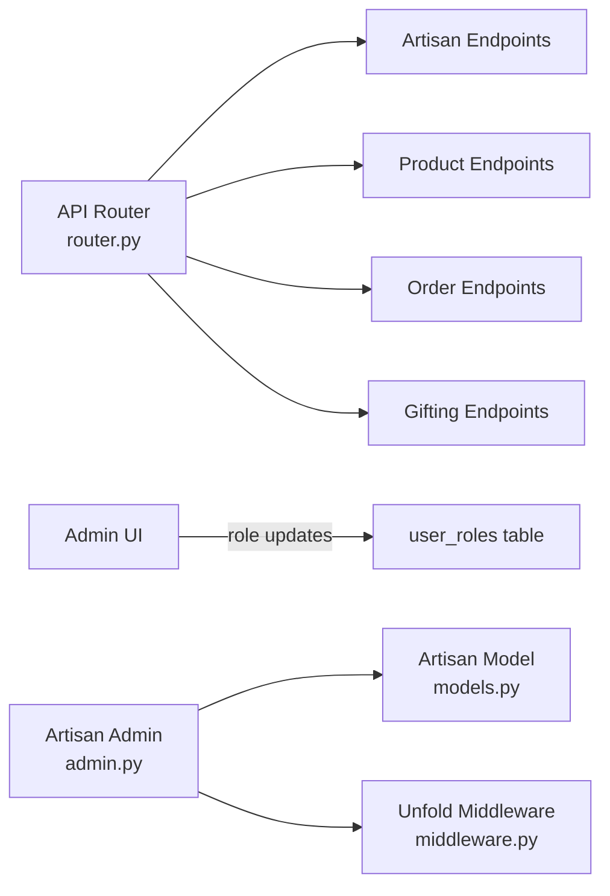

**Diagram sources**
- [router.py:22-40](file://backend/api/v1/router.py#L22-L40)
- [admin.py:10-92](file://backend/apps/artisans/admin.py#L10-L92)
- [models.py:62-170](file://backend/apps/artisans/models.py#L62-L170)
- [middleware.py:7-29](file://backend/apps/artisans/middleware.py#L7-L29)

**Section sources**
- [router.py:22-40](file://backend/api/v1/router.py#L22-L40)
- [admin.py:10-92](file://backend/apps/artisans/admin.py#L10-L92)
- [models.py:62-170](file://backend/apps/artisans/models.py#L62-L170)
- [middleware.py:7-29](file://backend/apps/artisans/middleware.py#L7-L29)

### Role Assignment and Permission Controls
- Roles are stored in user_roles with app_role enum.
- Admins can view and manage all roles; regular users can only view their own.
- Role changes are applied by deleting the existing row and inserting the new role.

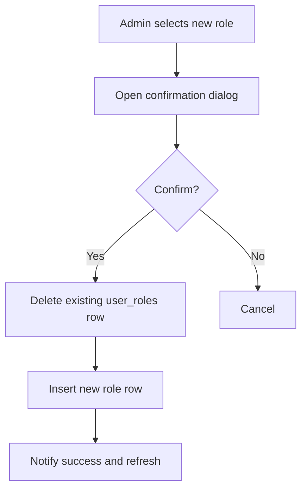

**Diagram sources**
- [UsersManager.tsx:89-123](file://apps/web/src/components/admin/UsersManager.tsx#L89-L123)
- [20251231095959_3473bebe-42ab-4109-8633-54732ebf1eaf.sql:87-95](file://supabase/migrations/20251231095959_3473bebe-42ab-4109-8633-54732ebf1eaf.sql#L87-L95)

**Section sources**
- [UsersManager.tsx:89-123](file://apps/web/src/components/admin/UsersManager.tsx#L89-L123)
- [20251231095959_3473bebe-42ab-4109-8633-54732ebf1eaf.sql:87-95](file://supabase/migrations/20251231095959_3473bebe-42ab-4109-8633-54732ebf1eaf.sql#L87-L95)

### Account Verification Workflow
- Verification status is stored in profiles.is_verified.
- Admins can toggle verification via the admin data hook.
- Verified counts are included in platform statistics.

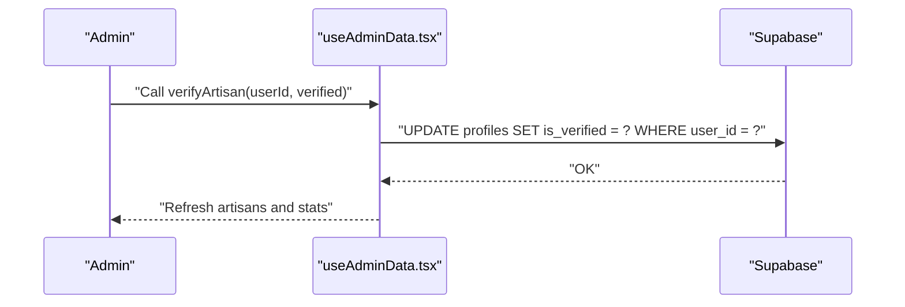

**Diagram sources**
- [useAdminData.tsx:109-120](file://apps/web/src/hooks/useAdminData.tsx#L109-L120)
- [20260109095251_6889a1b9-3b1c-4b8f-9535-f3ef095414de.sql:1-7](file://supabase/migrations/20260109095251_6889a1b9-3b1c-4b8f-9535-f3ef095414de.sql#L1-L7)

**Section sources**
- [useAdminData.tsx:109-120](file://apps/web/src/hooks/useAdminData.tsx#L109-L120)
- [20260109095251_6889a1b9-3b1c-4b8f-9535-f3ef095414de.sql:1-7](file://supabase/migrations/20260109095251_6889a1b9-3b1c-4b8f-9535-f3ef095414de.sql#L1-L7)

### User Search and Filtering
- Users can be filtered by name or ID using a simple text input.
- The filter checks full_name and user_id fields.

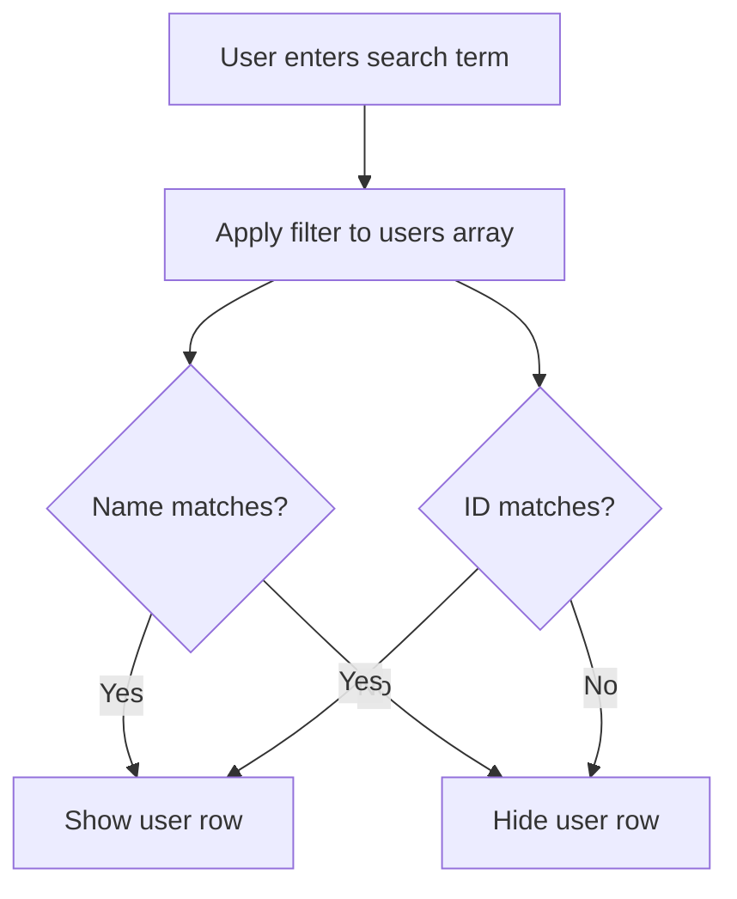

**Diagram sources**
- [UsersManager.tsx:125-128](file://apps/web/src/components/admin/UsersManager.tsx#L125-L128)

**Section sources**
- [UsersManager.tsx:125-128](file://apps/web/src/components/admin/UsersManager.tsx#L125-L128)

### Bulk Actions and Audit Trail
- Role changes are performed individually with confirmation dialogs.
- There is no explicit audit log table referenced in the UI code; role updates are logged implicitly by Supabase RLS triggers and policies.

Recommendation:
- Introduce a dedicated audit_log table to track role changes with timestamps, actor, target, and changes for compliance and auditing.

**Section sources**
- [UsersManager.tsx:89-123](file://apps/web/src/components/admin/UsersManager.tsx#L89-L123)
- [20251231095959_3473bebe-42ab-4109-8633-54732ebf1eaf.sql:87-95](file://supabase/migrations/20251231095959_3473bebe-42ab-4109-8633-54732ebf1eaf.sql#L87-L95)

### User Activity Monitoring
- The platform includes a search_history table, indicating potential search activity tracking.
- No explicit user login/logout audit events are present in the UI code.

Recommendation:
- Add session and action logs for admin activities and consider integrating with the search_history table for broader activity insights.

**Section sources**
- [types.ts:836-859](file://apps/web/src/integrations/supabase/types.ts#L836-L859)

### Data Protection, Privacy, and Compliance
- Profiles table was adjusted to restrict direct access and expose a public_profiles view excluding sensitive fields.
- RLS policies limit profile visibility to self and admins.
- Role management is restricted to admins.

Recommendation:
- Enforce GDPR-style consent and data subject rights (access, rectification, erasure) via Supabase policies and backend handlers.
- Consider anonymizing or pseudonymizing identifiers in logs and analytics.

**Section sources**
- [20260121122109_0b1cb36d-aa4e-4dd7-a125-c453bc87fffe.sql:1-36](file://supabase/migrations/20260121122109_0b1cb36d-aa4e-4dd7-a125-c453bc87fffe.sql#L1-L36)
- [20251231095959_3473bebe-42ab-4109-8633-54732ebf1eaf.sql:65-96](file://supabase/migrations/20251231095959_3473bebe-42ab-4109-8633-54732ebf1eaf.sql#L65-L96)

## Dependency Analysis
- The Users Manager depends on Supabase client and types for data access and typing.
- Auth hook resolves role and profile; Admin page guards access.
- Backend API router centralizes JWT authentication for API endpoints.
- Artisan admin depends on artisan models and middleware for UI rendering.

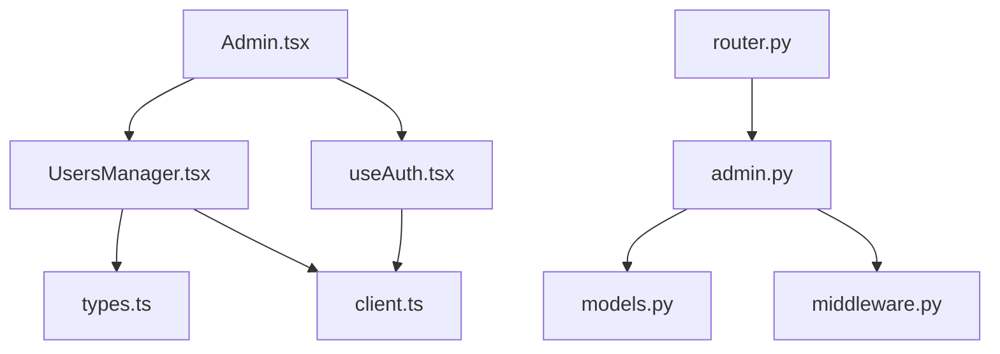

**Diagram sources**
- [UsersManager.tsx:33-292](file://apps/web/src/components/admin/UsersManager.tsx#L33-L292)
- [Admin.tsx:18-162](file://apps/web/src/pages/Admin.tsx#L18-L162)
- [useAuth.tsx:37-176](file://apps/web/src/hooks/useAuth.tsx#L37-L176)
- [types.ts:937-951](file://apps/web/src/integrations/supabase/types.ts#L937-L951)
- [router.py:22-40](file://backend/api/v1/router.py#L22-L40)
- [admin.py:10-92](file://backend/apps/artisans/admin.py#L10-L92)
- [models.py:62-170](file://backend/apps/artisans/models.py#L62-L170)
- [middleware.py:7-29](file://backend/apps/artisans/middleware.py#L7-L29)

**Section sources**
- [UsersManager.tsx:33-292](file://apps/web/src/components/admin/UsersManager.tsx#L33-L292)
- [Admin.tsx:18-162](file://apps/web/src/pages/Admin.tsx#L18-L162)
- [useAuth.tsx:37-176](file://apps/web/src/hooks/useAuth.tsx#L37-L176)
- [types.ts:937-951](file://apps/web/src/integrations/supabase/types.ts#L937-L951)
- [router.py:22-40](file://backend/api/v1/router.py#L22-L40)
- [admin.py:10-92](file://backend/apps/artisans/admin.py#L10-L92)
- [models.py:62-170](file://backend/apps/artisans/models.py#L62-L170)
- [middleware.py:7-29](file://backend/apps/artisans/middleware.py#L7-L29)

## Performance Considerations
- Minimize round-trips by fetching profiles and roles in parallel and merging client-side.
- Use server-side filtering and pagination for large datasets.
- Cache frequently accessed role and profile data in memory to reduce repeated queries.

## Troubleshooting Guide
Common issues and resolutions:
- Role change fails silently: Verify Supabase connection and RLS policies for admin access.
- Users not appearing: Ensure profiles exist and user_roles entries are present.
- Auth state not resolving: Check Supabase auth state listener and session retrieval.

**Section sources**
- [UsersManager.tsx:77-82](file://apps/web/src/components/admin/UsersManager.tsx#L77-L82)
- [useAuth.tsx:68-101](file://apps/web/src/hooks/useAuth.tsx#L68-L101)
- [20251231095959_3473bebe-42ab-4109-8633-54732ebf1eaf.sql:87-95](file://supabase/migrations/20251231095959_3473bebe-42ab-4109-8633-54732ebf1eaf.sql#L87-L95)

## Conclusion
The Users Management system provides a focused admin interface for role management, user verification, and basic analytics. It leverages Supabase for authentication and data with strong RLS policies to protect privacy. Enhancements such as a dedicated audit log, expanded activity monitoring, and stronger privacy controls would further improve compliance and operational insight.

## Appendices
- UI Patterns:
  - Role badges with icons for buyer, artisan, admin
  - Confirmation dialogs for destructive actions
  - Tabbed admin dashboard with role-based access
- Data Models:
  - profiles and user_roles tables with app_role enum
  - public_profiles view for safe public exposure