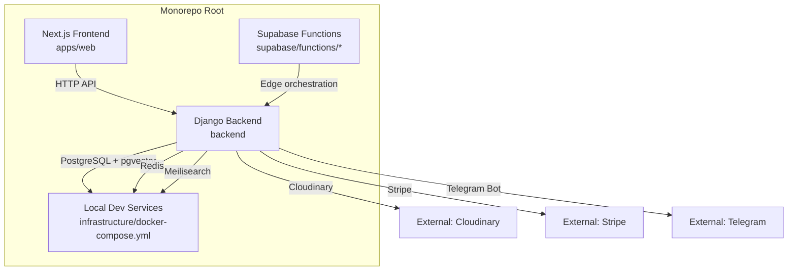
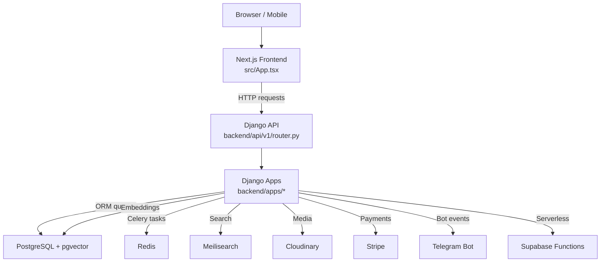
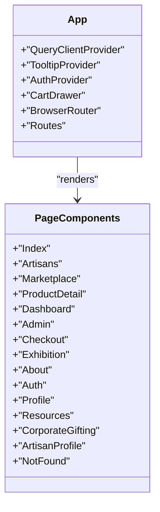
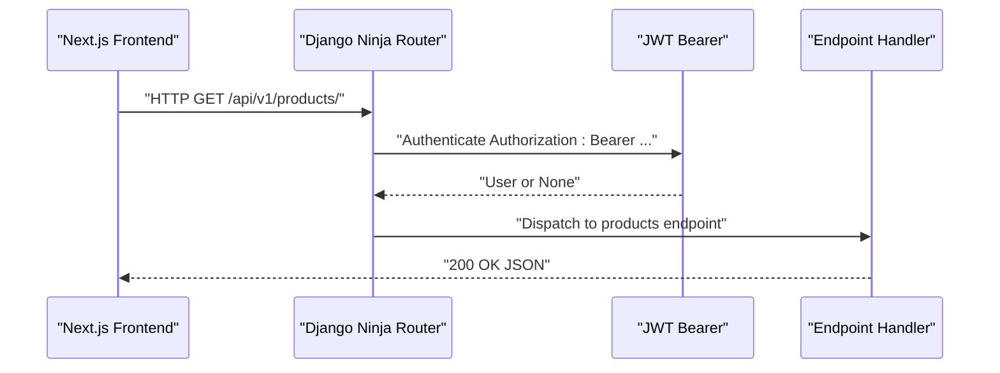
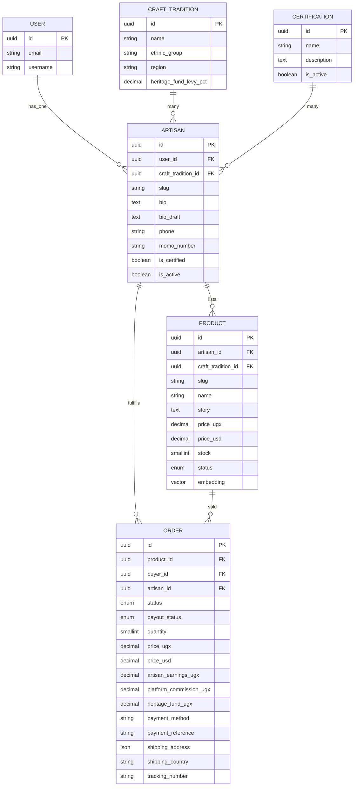
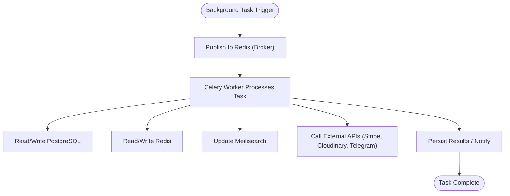
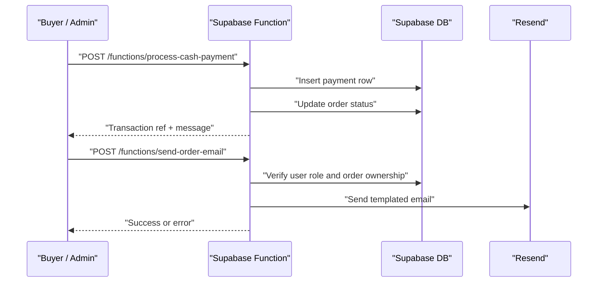
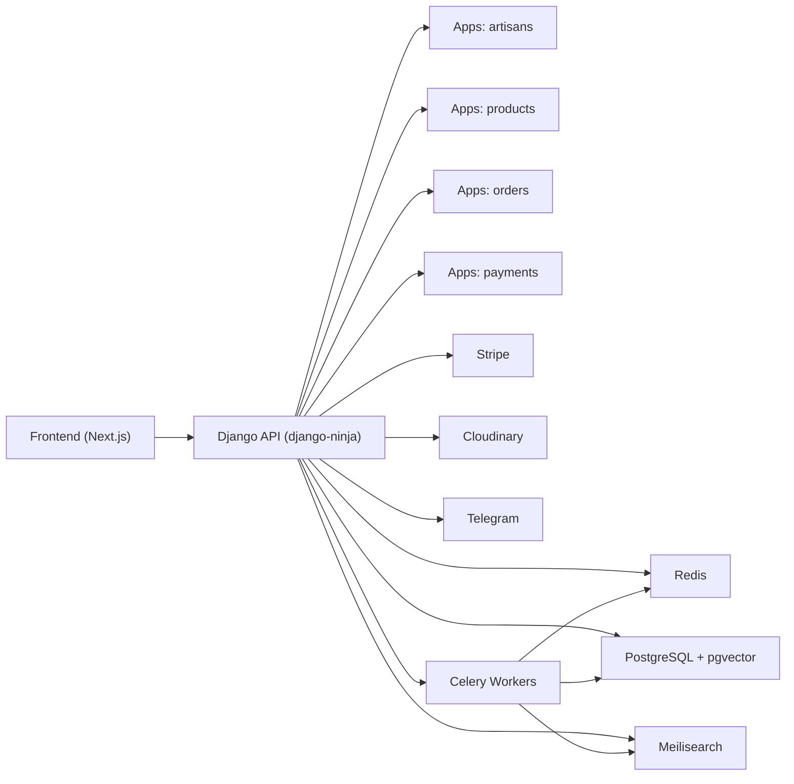

# Architecture Overview

<cite>
**Referenced Files in This Document**
- [README.md](file://README.md)
- [package.json](file://package.json)
- [backend/Procfile](file://backend/Procfile)
- [backend/config/settings/base.py](file://backend/config/settings/base.py)
- [backend/config/urls.py](file://backend/config/urls.py)
- [backend/api/v1/router.py](file://backend/api/v1/router.py)
- [backend/api/v1/urls.py](file://backend/api/v1/urls.py)
- [backend/apps/artisans/models.py](file://backend/apps/artisans/models.py)
- [backend/apps/products/models.py](file://backend/apps/products/models.py)
- [backend/apps/orders/models.py](file://backend/apps/orders/models.py)
- [backend/apps/telegram_bot/__init__.py](file://backend/apps/telegram_bot/__init__.py)
- [infrastructure/docker-compose.yml](file://infrastructure/docker-compose.yml)
- [src/App.tsx](file://src/App.tsx)
- [supabase/functions/process-cash-payment/index.ts](file://supabase/functions/process-cash-payment/index.ts)
- [supabase/functions/send-order-email/index.ts](file://supabase/functions/send-order-email/index.ts)
</cite>

## Table of Contents
1. [Introduction](#introduction)
2. [Project Structure](#project-structure)
3. [Core Components](#core-components)
4. [Architecture Overview](#architecture-overview)
5. [Detailed Component Analysis](#detailed-component-analysis)
6. [Dependency Analysis](#dependency-analysis)
7. [Performance Considerations](#performance-considerations)
8. [Troubleshooting Guide](#troubleshooting-guide)
9. [Conclusion](#conclusion)

## Introduction
This document presents the full-stack architecture of Empindu, a production-grade artisan marketplace. The system combines a Django backend with a Next.js frontend in a monorepo, integrating PostgreSQL with pgvector, Redis, Meilisearch, external services (Stripe, Cloudinary, Telegram), and a serverless layer via Supabase Functions. It explains service boundaries, component interactions, event-driven flows with Celery, and deployment topology. The goal is to provide a clear understanding of how the frontend React application communicates with the Django API layer, how data is stored and searched, and how asynchronous tasks and integrations are orchestrated.

## Project Structure
Empindu follows a monorepo layout:
- apps/web: Next.js 14 App Router frontend (React SPA)
- backend: Django 5 + django-ninja API, modular apps, Celery workers, ASGI/WSGI
- infrastructure: Docker Compose for local services (PostgreSQL, Redis, Meilisearch)
- supabase/functions: Edge functions for payment and email orchestration

**Diagram sources**
- [README.md:17-50](file://README.md#L17-L50)
- [infrastructure/docker-compose.yml:1-52](file://infrastructure/docker-compose.yml#L1-L52)
- [backend/config/settings/base.py:100-158](file://backend/config/settings/base.py#L100-L158)

**Section sources**
- [README.md:17-50](file://README.md#L17-L50)
- [backend/config/settings/base.py:29-64](file://backend/config/settings/base.py#L29-L64)

## Core Components
- Frontend (Next.js): React application with App Router, SSR, PWA capabilities, and TanStack Query for data fetching.
- Backend (Django): Async-ready API using django-ninja, modular apps for artisans, products, orders, payments, gifting, heritage, notifications, telegram_bot, ML, media, and search.
- Infrastructure: Local Docker Compose services for PostgreSQL (pgvector), Redis, and Meilisearch.
- External Integrations: Stripe (payments), Cloudinary (media), Telegram (bot), Supabase Functions (edge orchestration).
- Event-driven: Celery workers and beat scheduler for background tasks; Redis as broker/cache.

**Section sources**
- [src/App.tsx:1-59](file://src/App.tsx#L1-L59)
- [backend/config/settings/base.py:29-64](file://backend/config/settings/base.py#L29-L64)
- [backend/Procfile:1-4](file://backend/Procfile#L1-L4)
- [infrastructure/docker-compose.yml:1-52](file://infrastructure/docker-compose.yml#L1-L52)

## Architecture Overview
The system is layered:
- Presentation Layer: Next.js frontend handles routes, state, and UI composition.
- API Layer: Django with django-ninja exposes REST endpoints under /api/v1.
- Domain Layer: Modular Django apps encapsulate business logic (artisans, products, orders, payments, gifting, heritage).
- Data Layer: PostgreSQL with pgvector for vector embeddings; Redis for caching and Celery broker; Meilisearch for semantic search.
- Integration Layer: External services (Stripe, Cloudinary, Telegram) and Supabase Functions for serverless tasks.
- Background Processing: Celery workers and beat scheduler coordinate long-running tasks.

**Diagram sources**
- [src/App.tsx:1-59](file://src/App.tsx#L1-L59)
- [backend/api/v1/router.py:10-40](file://backend/api/v1/router.py#L10-L40)
- [backend/config/settings/base.py:100-158](file://backend/config/settings/base.py#L100-L158)
- [infrastructure/docker-compose.yml:1-52](file://infrastructure/docker-compose.yml#L1-L52)

## Detailed Component Analysis

### Frontend (Next.js) Component Model
The frontend composes pages and shared components, orchestrates routing, and manages global state with React Query. It relies on environment variables for API base URLs and theme/provider wiring.

**Diagram sources**
- [src/App.tsx:24-56](file://src/App.tsx#L24-L56)

**Section sources**
- [src/App.tsx:1-59](file://src/App.tsx#L1-L59)
- [package.json:14-67](file://package.json#L14-L67)

### Backend API Router and Authentication
The API uses django-ninja with a custom JWT bearer authenticator. Sub-routers are mounted for artisans, products, orders, and gifting. The Django URLconf wires /api/v1 to the router module.

**Diagram sources**
- [backend/api/v1/router.py:10-40](file://backend/api/v1/router.py#L10-L40)
- [backend/api/v1/urls.py:1-9](file://backend/api/v1/urls.py#L1-L9)
- [backend/config/urls.py:9-12](file://backend/config/urls.py#L9-L12)

**Section sources**
- [backend/api/v1/router.py:10-40](file://backend/api/v1/router.py#L10-L40)
- [backend/config/urls.py:9-12](file://backend/config/urls.py#L9-L12)

### Data Models and Domain Boundaries
The domain is modeled around artisans, products, and orders, with explicit relationships and embedded semantic vectors for search.

**Diagram sources**
- [backend/apps/artisans/models.py:62-170](file://backend/apps/artisans/models.py#L62-L170)
- [backend/apps/products/models.py:10-153](file://backend/apps/products/models.py#L10-L153)
- [backend/apps/orders/models.py:10-122](file://backend/apps/orders/models.py#L10-L122)

**Section sources**
- [backend/apps/artisans/models.py:62-170](file://backend/apps/artisans/models.py#L62-L170)
- [backend/apps/products/models.py:10-153](file://backend/apps/products/models.py#L10-L153)
- [backend/apps/orders/models.py:10-122](file://backend/apps/orders/models.py#L10-L122)

### Event-Driven Architecture with Celery
Celery workers and beat scheduler are configured via environment variables and Procfile. Redis acts as the broker and cache; Django’s channel layers use Redis for WebSocket support.

**Diagram sources**
- [backend/config/settings/base.py:108-121](file://backend/config/settings/base.py#L108-L121)
- [backend/Procfile:1-4](file://backend/Procfile#L1-4)

**Section sources**
- [backend/config/settings/base.py:108-121](file://backend/config/settings/base.py#L108-L121)
- [backend/Procfile:1-4](file://backend/Procfile#L1-4)

### Bot Layer Integration
The telegram_bot app is present as a placeholder for future webhook handlers and bot logic.

**Section sources**
- [backend/apps/telegram_bot/__init__.py:1-2](file://backend/apps/telegram_bot/__init__.py#L1-L2)

### Supabase Functions Orchestration
Two serverless functions demonstrate edge orchestration:
- process-cash-payment: Creates a cash-on-delivery payment record and updates order status.
- send-order-email: Validates caller permissions and sends templated emails via Resend.

**Diagram sources**
- [supabase/functions/process-cash-payment/index.ts:19-113](file://supabase/functions/process-cash-payment/index.ts#L19-L113)
- [supabase/functions/send-order-email/index.ts:165-283](file://supabase/functions/send-order-email/index.ts#L165-L283)

**Section sources**
- [supabase/functions/process-cash-payment/index.ts:19-113](file://supabase/functions/process-cash-payment/index.ts#L19-L113)
- [supabase/functions/send-order-email/index.ts:165-283](file://supabase/functions/send-order-email/index.ts#L165-L283)

## Dependency Analysis
- Frontend depends on environment variables for API base URL and uses TanStack Query for caching and invalidation.
- Backend depends on environment variables for database, Redis, Cloudinary, Stripe, Telegram, and OpenAI credentials.
- Django apps depend on shared models and cross-app relations (e.g., orders reference artisans and products).
- Infrastructure provides PostgreSQL (with pgvector), Redis, and Meilisearch for persistence, caching, and search.
- Celery workers depend on Redis and Django’s database-backed results for task tracking.

**Diagram sources**
- [package.json:14-67](file://package.json#L14-L67)
- [backend/config/settings/base.py:100-158](file://backend/config/settings/base.py#L100-L158)
- [infrastructure/docker-compose.yml:1-52](file://infrastructure/docker-compose.yml#L1-52)

**Section sources**
- [package.json:14-67](file://package.json#L14-L67)
- [backend/config/settings/base.py:100-158](file://backend/config/settings/base.py#L100-L158)
- [infrastructure/docker-compose.yml:1-52](file://infrastructure/docker-compose.yml#L1-52)

## Performance Considerations
- Database: Use pgvector for semantic similarity search; maintain appropriate indexing and consider periodic maintenance tasks.
- Cache: Leverage Redis for session storage, rate limiting, and short-lived computed results; monitor memory usage.
- Search: Configure Meilisearch synonyms and ranking rules to improve relevance; batch updates to reduce overhead.
- Asynchrony: Offload heavy tasks (image processing, email sending, embedding generation) to Celery workers; scale concurrency based on workload.
- CDN: Serve media via Cloudinary to reduce origin load and improve latency.
- API: Use pagination and filtering on product listings; implement request/response compression and caching headers where appropriate.

## Troubleshooting Guide
- Environment variables: Ensure .env files are present in both backend and frontend roots with required keys for database, Redis, Cloudinary, Stripe, Telegram, and OpenAI.
- Local services: Confirm Docker Compose containers are healthy and ports are free.
- Authentication: Verify JWT bearer tokens are included in Authorization headers for protected endpoints.
- Celery: Check Redis connectivity and worker logs; confirm scheduled tasks are registered in the database scheduler.
- Supabase Functions: Validate Supabase environment variables and function permissions; inspect logs for authorization and network errors.

**Section sources**
- [README.md:109-152](file://README.md#L109-L152)
- [infrastructure/docker-compose.yml:16-34](file://infrastructure/docker-compose.yml#L16-L34)
- [backend/config/settings/base.py:108-121](file://backend/config/settings/base.py#L108-L121)

## Conclusion
Empindu’s architecture blends a modern frontend (Next.js) with a robust Django backend, modularized into focused apps. The system leverages PostgreSQL with pgvector, Redis, and Meilisearch to support rich data and search needs, while integrating external services for payments, media, and bot interactions. Celery enables scalable background processing, and Supabase Functions provide lightweight orchestration close to the data plane. This design supports growth through clear service boundaries, asynchronous tasking, and a cohesive monorepo structure.