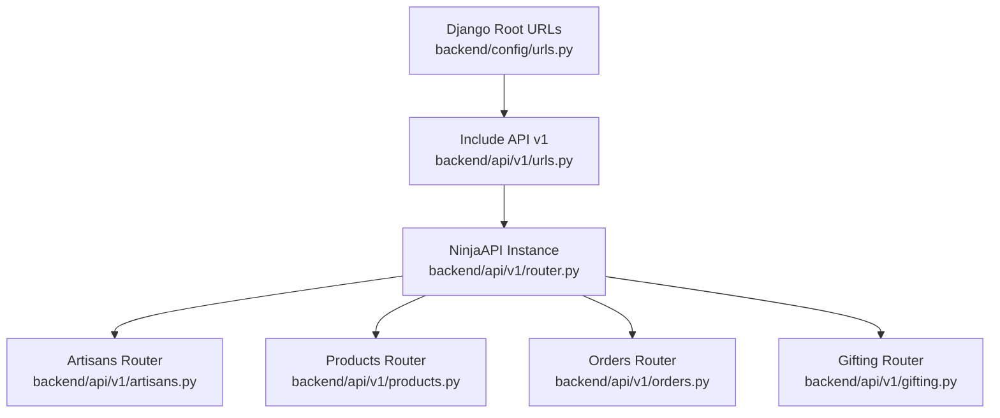
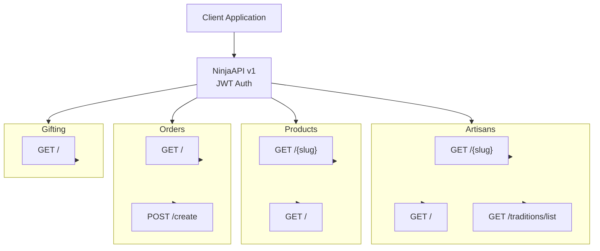
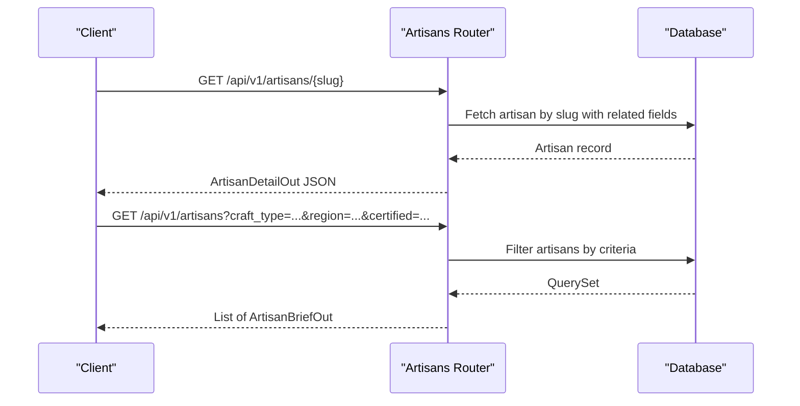
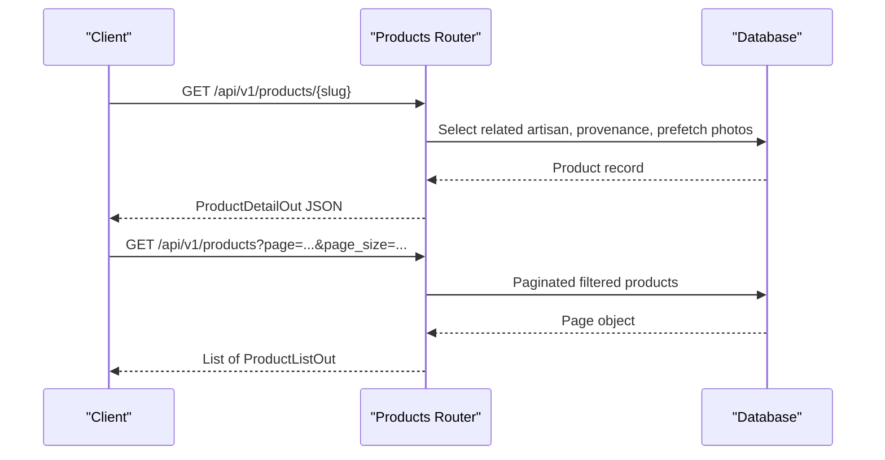
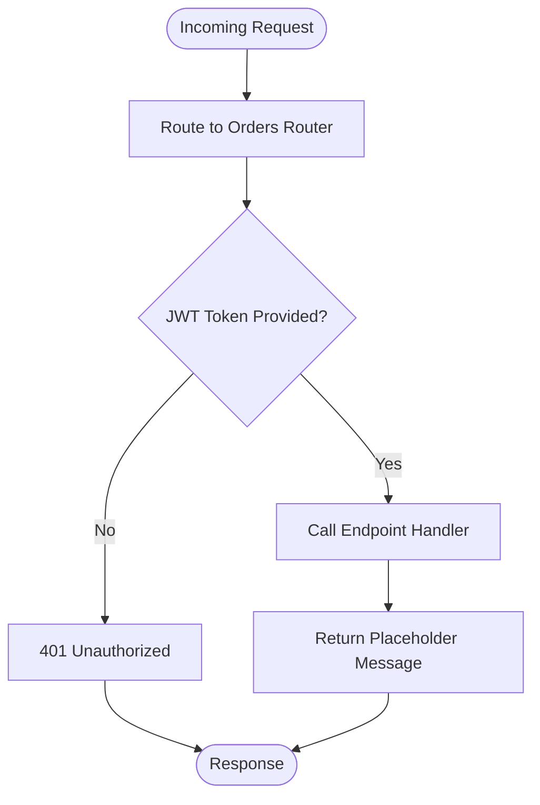

# API Design & Routing

<cite>
**Referenced Files in This Document**
- [router.py](file://backend/api/v1/router.py)
- [urls.py](file://backend/api/v1/urls.py)
- [urls.py](file://backend/config/urls.py)
- [artisans.py](file://backend/api/v1/artisans.py)
- [products.py](file://backend/api/v1/products.py)
- [orders.py](file://backend/api/v1/orders.py)
- [gifting.py](file://backend/api/v1/gifting.py)
</cite>

## Table of Contents
1. [Introduction](#introduction)
2. [Project Structure](#project-structure)
3. [Core Components](#core-components)
4. [Architecture Overview](#architecture-overview)
5. [Detailed Component Analysis](#detailed-component-analysis)
6. [Dependency Analysis](#dependency-analysis)
7. [Performance Considerations](#performance-considerations)
8. [Troubleshooting Guide](#troubleshooting-guide)
9. [Conclusion](#conclusion)
10. [Appendices](#appendices)

## Introduction
This document describes the API design and routing for Empindu’s Django Ninja REST API. It covers the versioned API structure under the v1 namespace, URL routing patterns, endpoint organization by resources (artisans, products, orders, gifting), request/response schemas, authentication, error handling patterns, documentation standards, endpoint categorization, rate limiting strategies, integration patterns with frontend applications, and best practices for extending the API surface.

## Project Structure
The API is organized around a versioned namespace and modular routers per resource. The top-level Django URL configuration mounts the v1 API under /api/v1/.



**Diagram sources**
- [urls.py:10-14](file://backend/config/urls.py#L10-L14)
- [urls.py:7-9](file://backend/api/v1/urls.py#L7-L9)
- [router.py:22-28](file://backend/api/v1/router.py#L22-L28)

**Section sources**
- [urls.py:10-14](file://backend/config/urls.py#L10-L14)
- [urls.py:7-9](file://backend/api/v1/urls.py#L7-L9)
- [router.py:22-28](file://backend/api/v1/router.py#L22-L28)

## Core Components
- API Versioning: The API is versioned under v1 with a dedicated NinjaAPI instance configured with a namespace and JWT bearer authentication.
- Authentication: JWT Bearer tokens are enforced via a custom JWTBearer class integrated with Django REST Framework SimpleJWT.
- Resource Routers: Modular routers for artisans, products, orders, and gifting are registered under the v1 API with appropriate tags for documentation grouping.
- Public vs Protected Endpoints: Some endpoints are open (auth=None), while others require authentication (e.g., orders router explicitly sets auth=JWTBearer()).

Key implementation references:
- API instance and authentication setup: [router.py:22-28](file://backend/api/v1/router.py#L22-L28)
- JWTBearer class and token validation: [router.py:10-18](file://backend/api/v1/router.py#L10-L18)
- Router registration and namespaces: [router.py:30-39](file://backend/api/v1/router.py#L30-L39)
- URL mount for v1: [urls.py:7-9](file://backend/api/v1/urls.py#L7-L9)
- Root-level v1 mount: [urls.py](file://backend/config/urls.py#L13)

**Section sources**
- [router.py:10-18](file://backend/api/v1/router.py#L10-L18)
- [router.py:22-28](file://backend/api/v1/router.py#L22-L28)
- [router.py:30-39](file://backend/api/v1/router.py#L30-L39)
- [urls.py:7-9](file://backend/api/v1/urls.py#L7-L9)
- [urls.py](file://backend/config/urls.py#L13)

## Architecture Overview
The API follows a resource-based routing pattern with clear separation of concerns:
- Artisans: Public profiles, listings, and craft tradition metadata.
- Products: Public product catalog with provenance and photos.
- Orders: Protected order management (placeholder in current sprint).
- Gifting: Corporate gifting flow (placeholder in current sprint).



**Diagram sources**
- [router.py:30-39](file://backend/api/v1/router.py#L30-L39)
- [artisans.py:52-119](file://backend/api/v1/artisans.py#L52-L119)
- [products.py:74-190](file://backend/api/v1/products.py#L74-L190)
- [orders.py:10-17](file://backend/api/v1/orders.py#L10-L17)
- [gifting.py:10-12](file://backend/api/v1/gifting.py#L10-L12)

## Detailed Component Analysis

### Artisans API
Resource focus: Public artisan profiles, listings, and craft tradition metadata.

Endpoints:
- GET /api/v1/artisans/{slug} (public): Returns a full artisan profile with related statistics and listings.
- GET /api/v1/artisans (public): Lists artisans with optional filters (craft type, region, certification).
- GET /api/v1/artisans/traditions/list (public): Lists craft traditions for filtering.

Request/Response characteristics:
- Request: Path parameter slug for detail endpoint; query parameters for list endpoint (craft_type, region, certified).
- Response: Uses ArtisanDetailOut and ArtisanBriefOut schemas; nested CraftTraditionOut for craft details.

Authentication:
- All endpoints are public (auth=None).

Pagination and filtering:
- Filtering supported on list endpoint; pagination is not implemented on the artisans router.



**Diagram sources**
- [artisans.py:52-77](file://backend/api/v1/artisans.py#L52-L77)
- [artisans.py:80-112](file://backend/api/v1/artisans.py#L80-L112)

**Section sources**
- [artisans.py:52-77](file://backend/api/v1/artisans.py#L52-L77)
- [artisans.py:80-112](file://backend/api/v1/artisans.py#L80-L112)
- [artisans.py:115-119](file://backend/api/v1/artisans.py#L115-L119)

### Products API
Resource focus: Public product catalog with story-first presentation, provenance, and photos.

Endpoints:
- GET /api/v1/products/{slug} (public): Returns product detail with artisan, provenance, and photos.
- GET /api/v1/products (public): Lists products with optional filters (craft_type, region, price range, occasion, artisan_slug) and pagination.

Request/Response characteristics:
- Request: Path parameter slug for detail; query parameters for list (craft_type, region, min/max USD, occasion, artisan_slug, page, page_size).
- Response: Uses ProductDetailOut and ProductListOut schemas; nested ArtisanBriefOut and ProvenanceOut.

Authentication:
- All endpoints are public (auth=None).

Pagination:
- Implemented via Django Paginator on the list endpoint.



**Diagram sources**
- [products.py:74-123](file://backend/api/v1/products.py#L74-L123)
- [products.py:126-190](file://backend/api/v1/products.py#L126-L190)

**Section sources**
- [products.py:74-123](file://backend/api/v1/products.py#L74-L123)
- [products.py:126-190](file://backend/api/v1/products.py#L126-L190)

### Orders API
Resource focus: Order management (placeholder in current sprint).

Endpoints:
- GET /api/v1/orders/: Returns a placeholder message indicating future implementation.
- POST /api/v1/orders/create: Returns a placeholder message indicating future implementation.

Authentication:
- Orders router is registered with JWTBearer(), making these endpoints protected.



**Diagram sources**
- [router.py](file://backend/api/v1/router.py#L38)
- [orders.py:10-17](file://backend/api/v1/orders.py#L10-L17)

**Section sources**
- [orders.py:10-17](file://backend/api/v1/orders.py#L10-L17)
- [router.py](file://backend/api/v1/router.py#L38)

### Gifting API
Resource focus: Corporate gifting flow (placeholder in current sprint).

Endpoint:
- GET /api/v1/gifting/: Returns a placeholder message indicating future implementation.

Authentication:
- Gifting router is public (default).

**Section sources**
- [gifting.py:10-12](file://backend/api/v1/gifting.py#L10-L12)

## Dependency Analysis
- Router composition: The v1 router aggregates four resource routers and applies global authentication.
- URL composition: The root URLs include the v1 module, which exposes NinjaAPI-generated URLs.
- Authentication dependency: JWTBearer relies on Django REST Framework SimpleJWT for token validation.

```mermaid
graph LR
DRF["DRF SimpleJWT"] <- --> JWT["JWTBearer"]
JWT --> API["NinjaAPI v1"]
API --> AR["Artisans Router"]
API --> PR["Products Router"]
API --> OR["Orders Router"]
API --> GR["Gifting Router"]
```

**Diagram sources**
- [router.py:10-18](file://backend/api/v1/router.py#L10-L18)
- [router.py:22-28](file://backend/api/v1/router.py#L22-L28)
- [router.py:30-39](file://backend/api/v1/router.py#L30-L39)

**Section sources**
- [router.py:10-18](file://backend/api/v1/router.py#L10-L18)
- [router.py:22-28](file://backend/api/v1/router.py#L22-L28)
- [router.py:30-39](file://backend/api/v1/router.py#L30-L39)

## Performance Considerations
- Select-related and prefetch-related queries: Both artisans and products routers optimize database access by selecting related fields and prefetching related collections.
- Pagination: Products router implements pagination to limit payload sizes; consider adding pagination to artisans listing as well.
- Filtering: Use database-level filtering (icontains, equality) to avoid loading unnecessary records.
- Image URLs: Ensure media serving is optimized in production; avoid heavy image transformations on-the-fly.

[No sources needed since this section provides general guidance]

## Troubleshooting Guide
- Authentication failures:
  - Verify JWT token format and expiration.
  - Confirm token is sent in the Authorization header with the Bearer scheme.
  - Check JWTBearer.authenticate logic for exceptions during token validation.
- 401 responses on protected endpoints:
  - Ensure requests to /orders/* include a valid JWT token.
- Placeholder endpoints:
  - Expect placeholder messages for /orders/ and /orders/create until implementation is complete.
  - Expect placeholder message for /gifting/ until implementation is complete.

**Section sources**
- [router.py:10-18](file://backend/api/v1/router.py#L10-L18)
- [orders.py:10-17](file://backend/api/v1/orders.py#L10-L17)
- [gifting.py:10-12](file://backend/api/v1/gifting.py#L10-L12)

## Conclusion
Empindu’s v1 API employs a clean, resource-based design with explicit authentication for protected endpoints and public routes for discovery. The current sprint focuses on public APIs (artisans and products) with placeholders for orders and gifting. The architecture supports scalable extension through modular routers and standardized schemas, enabling consistent documentation and client integration.

[No sources needed since this section summarizes without analyzing specific files]

## Appendices

### API Documentation Standards
- Endpoint categorization:
  - Tagged by resource (Artisans, Products, Orders, Gifting) for grouping in generated docs.
- Naming conventions:
  - Use plural nouns for collections (/artisans, /products).
  - Use hyphens for multi-word identifiers in slugs.
- HTTP methods:
  - GET for retrieval, POST for creation (as placeholders indicate).
- Status codes:
  - Use standard codes (200 OK, 401 Unauthorized, 404 Not Found, 500 Internal Server Error).
- Error responses:
  - Return structured errors with message and optional details.

[No sources needed since this section provides general guidance]

### Endpoint Categorization
- Public discovery:
  - Artisans: GET /api/v1/artisans, GET /api/v1/artisans/{slug}, GET /api/v1/artisans/traditions/list
  - Products: GET /api/v1/products, GET /api/v1/products/{slug}
- Protected management:
  - Orders: GET /api/v1/orders, POST /api/v1/orders/create
- Future gifting:
  - Gifting: GET /api/v1/gifting

**Section sources**
- [artisans.py:52-119](file://backend/api/v1/artisans.py#L52-L119)
- [products.py:74-190](file://backend/api/v1/products.py#L74-L190)
- [orders.py:10-17](file://backend/api/v1/orders.py#L10-L17)
- [gifting.py:10-12](file://backend/api/v1/gifting.py#L10-L12)

### Rate Limiting Strategies
- Recommended approaches:
  - Per-endpoint throttling using Django REST Framework throttling classes.
  - Anon/user rates differentiated for public endpoints.
  - Consider burst protection for product listing and artisan discovery.
- Implementation location:
  - Configure throttle classes in the NinjaAPI auth or router settings.

[No sources needed since this section provides general guidance]

### Integration Patterns with Frontend Applications
- SSR-friendly payloads:
  - Artisans and products detail endpoints return story-first data suitable for server-side rendering.
- Pagination:
  - Clients should handle page/page_size for product listings.
- Authentication:
  - Protected endpoints require JWT tokens; integrate token storage and refresh strategies in the client.
- Media assets:
  - Ensure proper CDN configuration for images returned in product and artisan schemas.

[No sources needed since this section provides general guidance]

### Best Practices for Extending the API Surface
- Keep schemas self-contained and versioned alongside endpoints.
- Add pagination and filtering consistently across list endpoints.
- Introduce throttling and input validation early.
- Document new endpoints with clear tags and descriptions.
- Prefer idempotent operations where possible and use appropriate HTTP methods.

[No sources needed since this section provides general guidance]