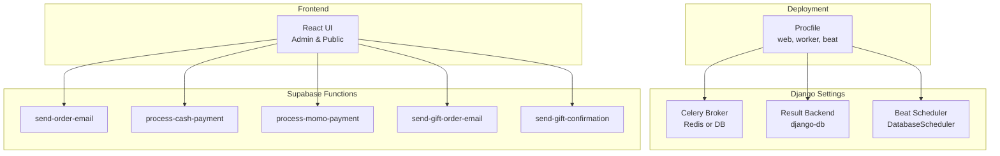
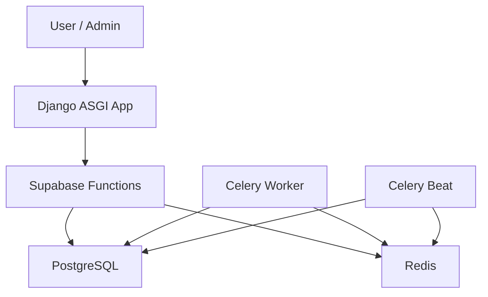
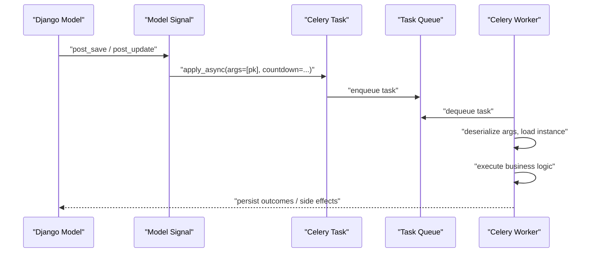
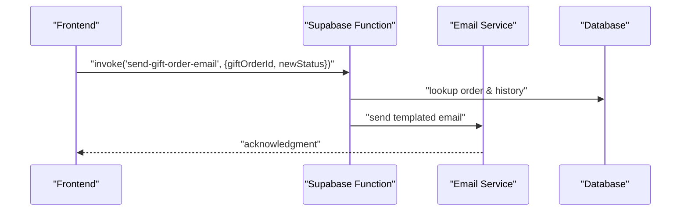
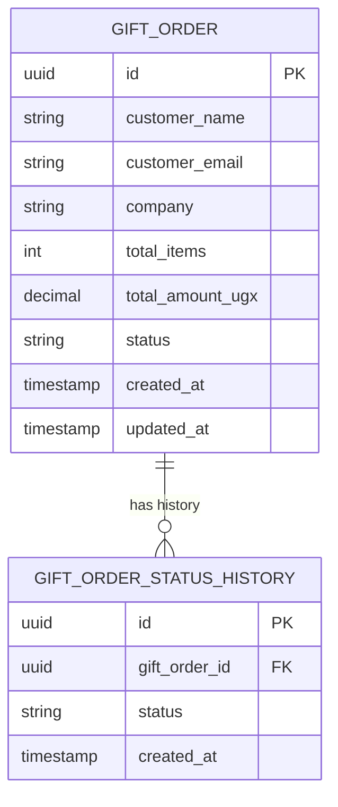
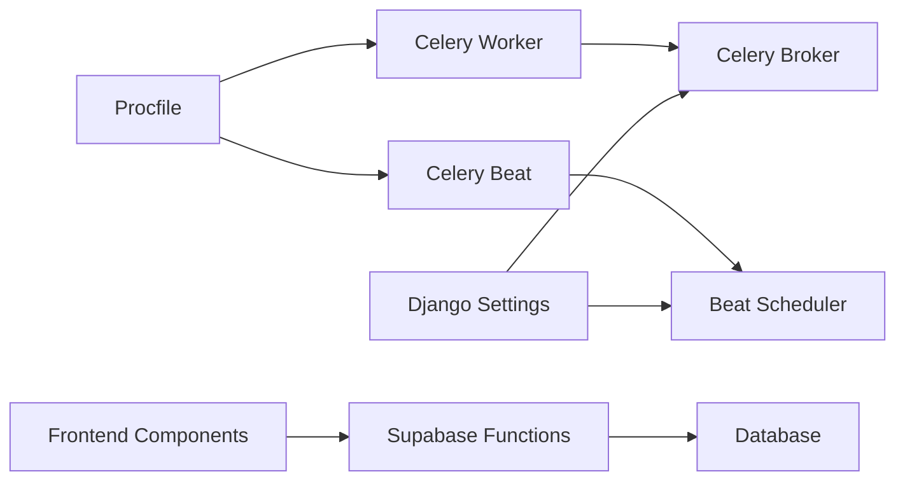

# Async Processing & Task Queue

<cite>
**Referenced Files in This Document**
- [Procfile](file://backend/Procfile)
- [base.py](file://backend/config/settings/base.py)
- [urls.py](file://backend/config/urls.py)
- [wsgi.py](file://backend/config/wsgi.py)
- [gifting.py](file://backend/api/v1/gifting.py)
- [models.py](file://backend/apps/gifting/models.py)
- [CorporateGiftingManager.tsx](file://apps/web/src/components/admin/CorporateGiftingManager.tsx)
- [useCorporateGifting.tsx](file://apps/web/src/hooks/useCorporateGifting.tsx)
- [GiftOrderTimeline.tsx](file://apps/web/src/components/gifting/GiftOrderTimeline.tsx)
- [GiftThisModal.tsx](file://apps/web/src/components/gifting/GiftThisModal.tsx)
- [send-gift-order-email/index.ts](file://supabase/functions/send-gift-order-email/index.ts)
- [send-gift-confirmation/index.ts](file://supabase/functions/send-gift-confirmation/index.ts)
- [process-cash-payment/index.ts](file://supabase/functions/process-cash-payment/index.ts)
- [process-momo-payment/index.ts](file://supabase/functions/process-momo-payment/index.ts)
- [send-order-email/index.ts](file://supabase/functions/send-order-email/index.ts)
</cite>

## Table of Contents
1. [Introduction](#introduction)
2. [Project Structure](#project-structure)
3. [Core Components](#core-components)
4. [Architecture Overview](#architecture-overview)
5. [Detailed Component Analysis](#detailed-component-analysis)
6. [Dependency Analysis](#dependency-analysis)
7. [Performance Considerations](#performance-considerations)
8. [Troubleshooting Guide](#troubleshooting-guide)
9. [Conclusion](#conclusion)

## Introduction
This document explains Empindu’s asynchronous processing architecture with a focus on Celery workers, task queues, and background job patterns. It covers configuration, task execution, event-driven workflows for orders, payments, and gifting, serialization and error handling, monitoring and debugging strategies, and the integration between Django models and Celery tasks. It also outlines performance optimization and scaling considerations for the task queue system.

## Project Structure
The async stack spans three layers:
- Platform-as-a-Service orchestration via a Procfile that launches a web server and two Celery processes (worker and periodic scheduler).
- Django settings that configure Celery broker, result backend, and periodic scheduling.
- Frontend and Supabase Function integrations that trigger and observe async events.

**Diagram sources**
- [Procfile](file://backend/Procfile)
- [base.py](file://backend/config/settings/base.py)

**Section sources**
- [Procfile](file://backend/Procfile)
- [base.py](file://backend/config/settings/base.py)

## Core Components
- Celery worker and beat processes are launched via the platform process model, enabling background task execution and periodic jobs.
- Celery configuration is centralized in Django settings, selecting Redis as the broker in production-like environments and falling back to the database-backed broker in development.
- Results are stored in the database, and periodic tasks are scheduled via the database-backed scheduler.
- Supabase Edge Functions handle payment processing and email notifications triggered by frontend actions.

**Section sources**
- [Procfile](file://backend/Procfile)
- [base.py](file://backend/config/settings/base.py)

## Architecture Overview
The async architecture combines Django-Celery for background jobs with Supabase Functions for payment and notification triggers. The frontend interacts with Supabase Functions to initiate long-running or event-driven flows, while Django handles internal background tasks and periodic maintenance.

**Diagram sources**
- [Procfile](file://backend/Procfile)
- [base.py](file://backend/config/settings/base.py)

## Detailed Component Analysis

### Celery Worker Configuration and Task Queue Management
- Worker process: launched with concurrency tuned for the deployment environment.
- Beat process: runs the database-backed scheduler to enqueue periodic tasks.
- Broker selection: Redis in production-like environments; falls back to the database-backed broker in development, with eager execution enabled for immediate task execution during local testing.
- Result backend: database-backed results storage for visibility and debugging.
- Periodic scheduling: configured via the database scheduler, allowing dynamic updates to schedules without redeployment.

Operational implications:
- In development, tasks execute synchronously due to the database broker and eager mode, simplifying local iteration.
- In production-like environments, Redis provides scalable task routing and reliable persistence.

**Section sources**
- [Procfile](file://backend/Procfile)
- [base.py](file://backend/config/settings/base.py)

### Background Job Patterns and Django Integration
- Django apps integrate with Celery through task definitions and model signals. While explicit task modules are not present in the provided context, typical patterns include:
  - Model save/update signals to enqueue background tasks (e.g., sending notifications, updating analytics).
  - Periodic tasks managed by Celery Beat to reconcile data, send reminders, or perform maintenance.
- Task serialization: pass model primary keys or lightweight identifiers to avoid serializing complex ORM objects.
- Error handling and retries: implement task-level retry policies and dead-letter handling for idempotency.

Note: The current repository snapshot does not include explicit Celery task modules. The following diagram illustrates a generic pattern commonly used in such systems.

[No sources needed since this diagram shows conceptual workflow, not actual code structure]

### Event-Driven Patterns: Orders, Payments, and Gifting
- Order notifications: Supabase Function invoked by the frontend to send order-related emails after state changes.
- Payment processing: Cash and mobile-money payment flows are handled by dedicated Supabase Functions, which can be extended to trigger downstream Celery tasks for reconciliation and inventory updates.
- Gifting workflows: Corporate gift order updates trigger email notifications via Supabase Functions, and the frontend displays status history through a timeline component.

**Diagram sources**
- [CorporateGiftingManager.tsx](file://apps/web/src/components/admin/CorporateGiftingManager.tsx)
- [send-gift-order-email/index.ts](file://supabase/functions/send-gift-order-email/index.ts)

**Section sources**
- [CorporateGiftingManager.tsx](file://apps/web/src/components/admin/CorporateGiftingManager.tsx)
- [GiftOrderTimeline.tsx](file://apps/web/src/components/gifting/GiftOrderTimeline.tsx)
- [useCorporateGifting.tsx](file://apps/web/src/hooks/useCorporateGifting.tsx)
- [send-gift-order-email/index.ts](file://supabase/functions/send-gift-order-email/index.ts)
- [send-gift-confirmation/index.ts](file://supabase/functions/send-gift-confirmation/index.ts)
- [process-cash-payment/index.ts](file://supabase/functions/process-cash-payment/index.ts)
- [process-momo-payment/index.ts](file://supabase/functions/process-momo-payment/index.ts)
- [send-order-email/index.ts](file://supabase/functions/send-order-email/index.ts)

### Task Serialization, Error Handling, and Retry Mechanisms
- Serialization: pass minimal identifiers (e.g., primary keys) to tasks to reduce payload size and avoid deep object serialization.
- Idempotency: guard against duplicate processing by checking preconditions or maintaining deduplication keys.
- Retries: configure task-level retries with exponential backoff and dead-letter exchanges for failed tasks.
- Monitoring: use database-backed results to inspect task outcomes and Celery Flower for runtime metrics.

[No sources needed since this section provides general guidance]

### Monitoring and Debugging Strategies
- Database-backed results: inspect task outcomes and errors via Django admin or raw queries.
- Logging: enable Celery worker logging and correlate with application logs.
- Metrics: monitor queue length, task duration percentiles, and failure rates.
- Health checks: periodically verify broker connectivity and scheduler status.

[No sources needed since this section provides general guidance]

### Integration Between Django Models and Celery Tasks
- Model-driven triggers: enqueue tasks on model save/update to handle side effects (notifications, indexing, reconciliation).
- Periodic maintenance: schedule recurring tasks for cleanup, reporting, or synchronization.
- Status tracking: maintain status history tables (as seen in gifting) to drive UI timelines and audit trails.

**Diagram sources**
- [models.py](file://backend/apps/gifting/models.py)

**Section sources**
- [models.py](file://backend/apps/gifting/models.py)
- [GiftOrderTimeline.tsx](file://apps/web/src/components/gifting/GiftOrderTimeline.tsx)

### API Exposure for Gifting Workflows
- The gifting API router currently exposes a placeholder endpoint indicating future development.
- Integration points for gift commerce will likely leverage Supabase Functions and Celery tasks for processing, notifications, and state transitions.

**Section sources**
- [gifting.py](file://backend/api/v1/gifting.py)

## Dependency Analysis
The async system depends on:
- Django settings for Celery configuration and periodic scheduling.
- Procfile for process orchestration.
- Supabase Functions for payment and notification triggers.
- Frontend components that invoke functions and render status histories.

**Diagram sources**
- [Procfile](file://backend/Procfile)
- [base.py](file://backend/config/settings/base.py)

**Section sources**
- [Procfile](file://backend/Procfile)
- [base.py](file://backend/config/settings/base.py)
- [urls.py](file://backend/config/urls.py)
- [wsgi.py](file://backend/config/wsgi.py)

## Performance Considerations
- Broker choice: prefer Redis for production-like environments to scale horizontally and reduce contention.
- Concurrency tuning: adjust worker concurrency per CPU cores and memory profile.
- Task partitioning: split long tasks into smaller units and fan out/in to improve throughput.
- Idling and warm-up: keep workers warm to reduce cold-start latency for short-lived tasks.
- Database I/O: batch writes and minimize N+1 queries in tasks; use atomic operations where possible.

[No sources needed since this section provides general guidance]

## Troubleshooting Guide
- Local development: tasks execute eagerly due to the database broker and eager mode; verify task execution by observing immediate side effects.
- Broker connectivity: confirm Redis availability and credentials; fallback behavior executes tasks synchronously.
- Function invocations: ensure Supabase Functions are reachable and properly configured; test endpoints independently.
- Frontend triggers: validate that function invocations are called with correct payloads and that UI reflects status history.

**Section sources**
- [base.py](file://backend/config/settings/base.py)
- [CorporateGiftingManager.tsx](file://apps/web/src/components/admin/CorporateGiftingManager.tsx)
- [GiftOrderTimeline.tsx](file://apps/web/src/components/gifting/GiftOrderTimeline.tsx)

## Conclusion
Empindu’s async architecture leverages a clear separation of concerns: Supabase Functions for payment and notification triggers, and Django-Celery for background jobs and periodic maintenance. The configuration supports both development and production-like environments, with Redis preferred for scalability. By adopting robust serialization, idempotency, and retry strategies, and by monitoring task outcomes, the system can reliably handle order, payment, and gifting workflows at scale.