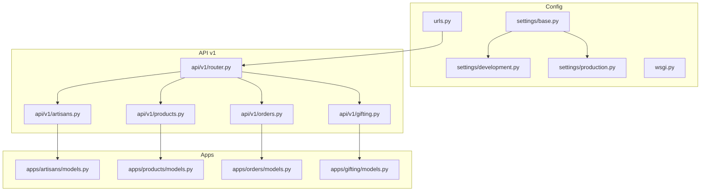
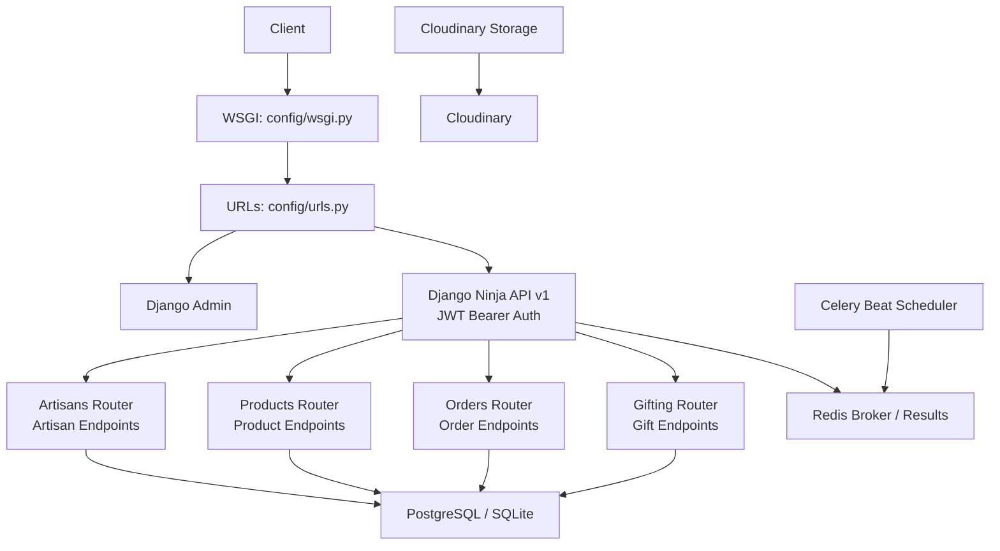
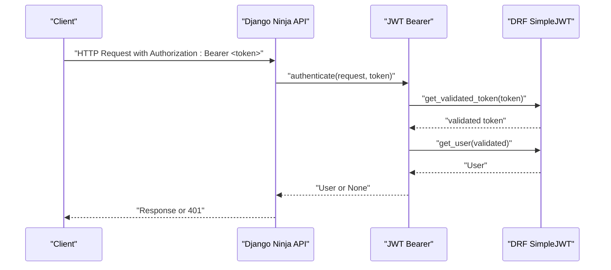
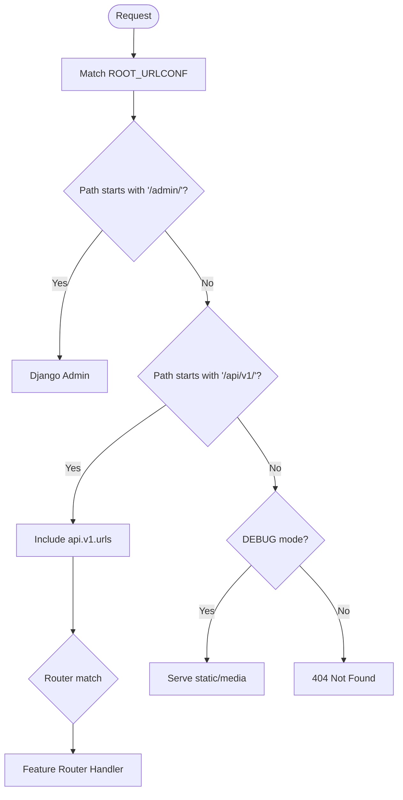
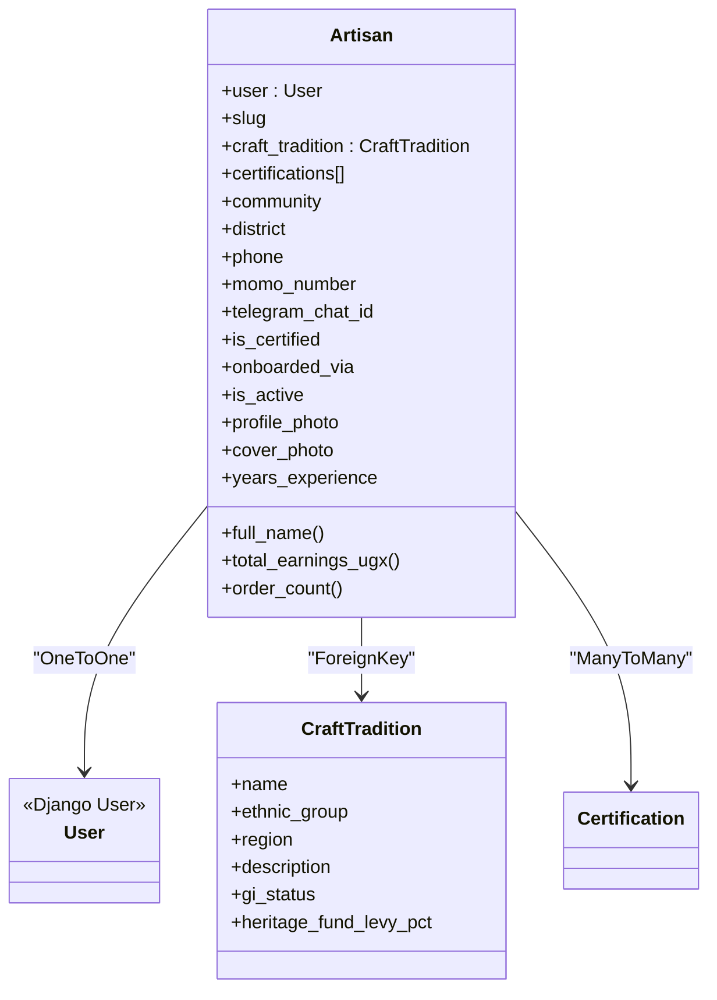
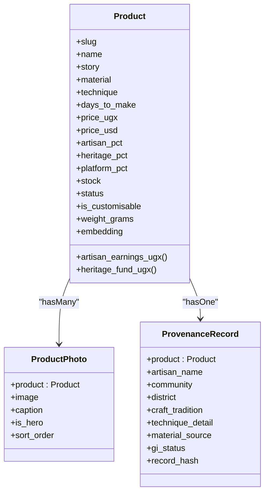
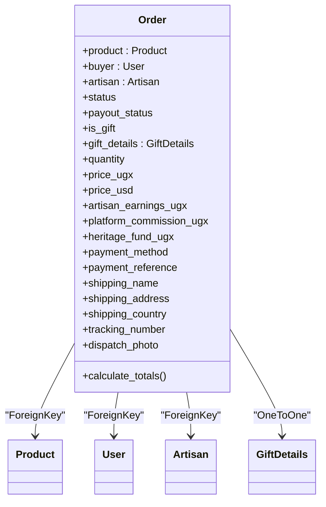
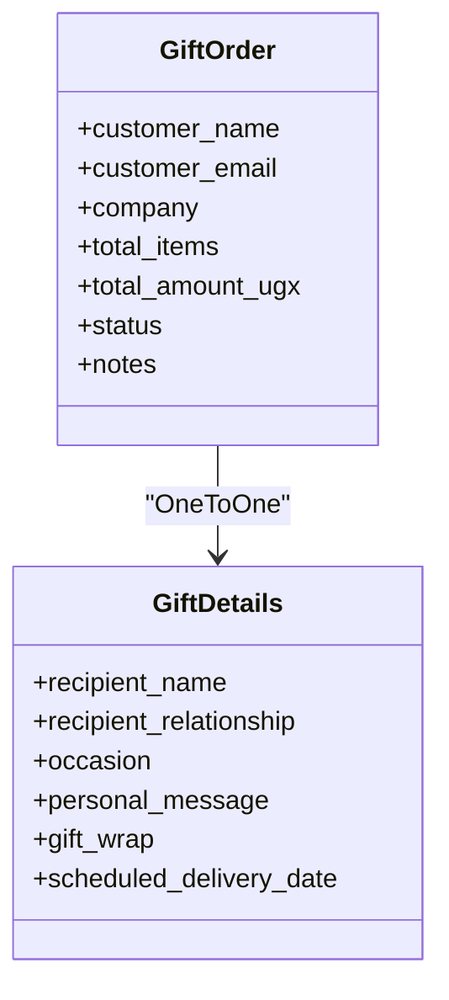
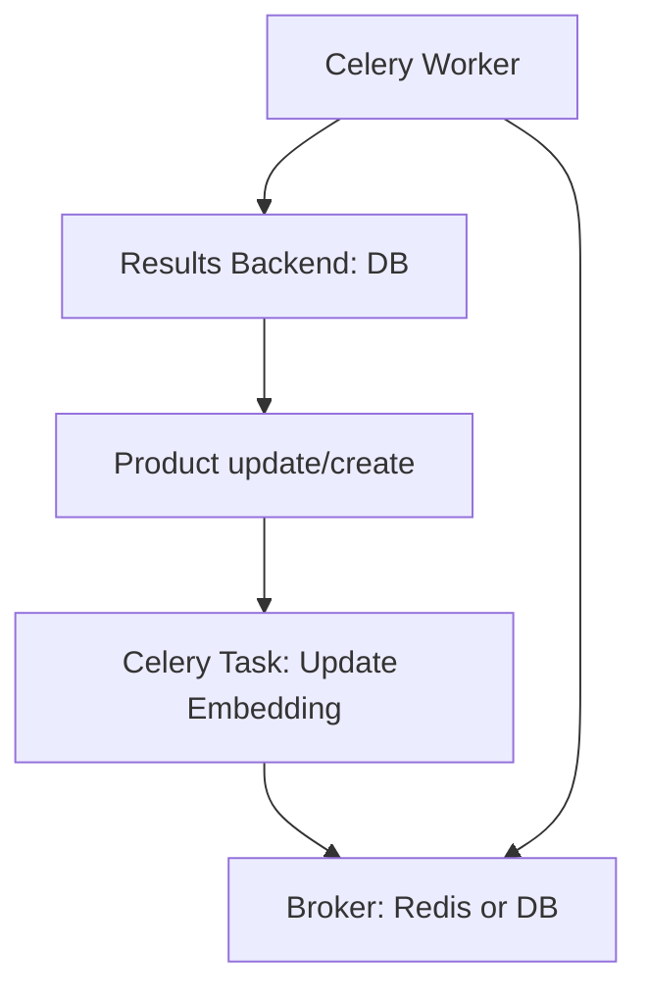
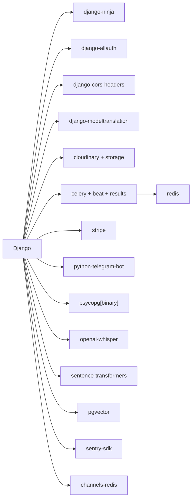

# Backend Architecture

<cite>
**Referenced Files in This Document**
- [base.py](file://backend/config/settings/base.py)
- [development.py](file://backend/config/settings/development.py)
- [production.py](file://backend/config/settings/production.py)
- [urls.py](file://backend/config/urls.py)
- [wsgi.py](file://backend/config/wsgi.py)
- [router.py](file://backend/api/v1/router.py)
- [artisans.py](file://backend/api/v1/artisans.py)
- [products.py](file://backend/api/v1/products.py)
- [orders.py](file://backend/api/v1/orders.py)
- [gifting.py](file://backend/api/v1/gifting.py)
- [models.py](file://backend/apps/artisans/models.py)
- [models.py](file://backend/apps/products/models.py)
- [models.py](file://backend/apps/orders/models.py)
- [models.py](file://backend/apps/gifting/models.py)
- [requirements.txt](file://backend/requirements.txt)
</cite>

## Table of Contents
1. [Introduction](#introduction)
2. [Project Structure](#project-structure)
3. [Core Components](#core-components)
4. [Architecture Overview](#architecture-overview)
5. [Detailed Component Analysis](#detailed-component-analysis)
6. [Dependency Analysis](#dependency-analysis)
7. [Performance Considerations](#performance-considerations)
8. [Troubleshooting Guide](#troubleshooting-guide)
9. [Conclusion](#conclusion)
10. [Appendices](#appendices)

## Introduction
This document describes the backend architecture of Empindu’s Django-based system. It covers the modular Django app structure, the Django Ninja API organization, URL routing patterns, middleware stack, authentication and authorization mechanisms, database design patterns and model relationships, event-driven architecture with Celery, configuration management across environments, and operational considerations.

## Project Structure
The backend is organized around:
- A Django project with layered settings (base, development, production)
- A Django Ninja API v1 module with feature-focused routers
- Modular Django apps under apps/ for artisans, products, orders, gifting, and supporting apps
- WSGI entrypoint and URL configuration

**Diagram sources**
- [base.py:1-287](file://backend/config/settings/base.py#L1-L287)
- [development.py:1-17](file://backend/config/settings/development.py#L1-L17)
- [production.py:1-33](file://backend/config/settings/production.py#L1-L33)
- [urls.py:1-17](file://backend/config/urls.py#L1-L17)
- [wsgi.py:1-10](file://backend/config/wsgi.py#L1-L10)
- [router.py:1-40](file://backend/api/v1/router.py#L1-L40)
- [artisans.py:1-120](file://backend/api/v1/artisans.py#L1-L120)
- [products.py:1-191](file://backend/api/v1/products.py#L1-L191)
- [orders.py:1-18](file://backend/api/v1/orders.py#L1-L18)
- [gifting.py:1-13](file://backend/api/v1/gifting.py#L1-L13)
- [models.py:1-170](file://backend/apps/artisans/models.py#L1-L170)
- [models.py:1-153](file://backend/apps/products/models.py#L1-L153)
- [models.py:1-122](file://backend/apps/orders/models.py#L1-L122)
- [models.py:1-67](file://backend/apps/gifting/models.py#L1-L67)

**Section sources**
- [base.py:1-287](file://backend/config/settings/base.py#L1-L287)
- [development.py:1-17](file://backend/config/settings/development.py#L1-L17)
- [production.py:1-33](file://backend/config/settings/production.py#L1-L33)
- [urls.py:1-17](file://backend/config/urls.py#L1-L17)
- [wsgi.py:1-10](file://backend/config/wsgi.py#L1-L10)
- [router.py:1-40](file://backend/api/v1/router.py#L1-L40)
- [artisans.py:1-120](file://backend/api/v1/artisans.py#L1-L120)
- [products.py:1-191](file://backend/api/v1/products.py#L1-L191)
- [orders.py:1-18](file://backend/api/v1/orders.py#L1-L18)
- [gifting.py:1-13](file://backend/api/v1/gifting.py#L1-L13)
- [models.py:1-170](file://backend/apps/artisans/models.py#L1-L170)
- [models.py:1-153](file://backend/apps/products/models.py#L1-L153)
- [models.py:1-122](file://backend/apps/orders/models.py#L1-L122)
- [models.py:1-67](file://backend/apps/gifting/models.py#L1-L67)

## Core Components
- Settings and Environment Management
  - Base settings define installed apps, middleware, databases, caching, media storage, CORS, authentication backends, and Celery/Redis configuration.
  - Development and production inherit from base and override debug, allowed hosts, security, and Sentry initialization.
- Django Ninja API v1
  - Central router with JWT bearer authentication and CORS-enabled API instance.
  - Sub-routers registered for artisans, products, orders, and gifting.
- Modular Django Apps
  - artisans: Craft traditions, certifications, and artisan profiles.
  - products: Products, provenance records, and product photos.
  - orders: Order lifecycle, payment methods, payouts, and shipping.
  - gifting: Gift personalization and corporate gifting orders.
  - Supporting apps: payments, heritage, notifications, telegram_bot, ml, media, search.

**Section sources**
- [base.py:29-64](file://backend/config/settings/base.py#L29-L64)
- [base.py:66-77](file://backend/config/settings/base.py#L66-L77)
- [base.py:100-117](file://backend/config/settings/base.py#L100-L117)
- [development.py:7-16](file://backend/config/settings/development.py#L7-L16)
- [production.py:8-32](file://backend/config/settings/production.py#L8-L32)
- [router.py:10-28](file://backend/api/v1/router.py#L10-L28)
- [router.py:36-39](file://backend/api/v1/router.py#L36-L39)
- [artisans.py:10-11](file://backend/api/v1/artisans.py#L10-L11)
- [products.py:11-11](file://backend/api/v1/products.py#L11-L11)
- [orders.py:7-7](file://backend/api/v1/orders.py#L7-L7)
- [gifting.py:7-7](file://backend/api/v1/gifting.py#L7-L7)

## Architecture Overview
The backend follows a layered architecture:
- Entry points: WSGI application configured via environment variable.
- Routing: Root URLs include admin and API v1 namespace.
- API Layer: Django Ninja with JWT bearer authentication and CORS.
- Domain Layer: Feature-focused Django apps encapsulating models and domain logic.
- Persistence: PostgreSQL by default with optional SQLite for development; vector embeddings for semantic search.
- Asynchronous Processing: Celery with Redis broker and database result backend; scheduled tasks via django-celery-beat.
- Real-time: Channels Redis for WebSocket support.

**Diagram sources**
- [wsgi.py:1-10](file://backend/config/wsgi.py#L1-L10)
- [urls.py:9-16](file://backend/config/urls.py#L9-L16)
- [router.py:22-28](file://backend/api/v1/router.py#L22-L28)
- [base.py:100-117](file://backend/config/settings/base.py#L100-L117)
- [base.py:157-164](file://backend/config/settings/base.py#L157-L164)

**Section sources**
- [wsgi.py:1-10](file://backend/config/wsgi.py#L1-L10)
- [urls.py:1-17](file://backend/config/urls.py#L1-L17)
- [router.py:1-40](file://backend/api/v1/router.py#L1-L40)
- [base.py:100-117](file://backend/config/settings/base.py#L100-L117)
- [base.py:157-164](file://backend/config/settings/base.py#L157-L164)

## Detailed Component Analysis

### Authentication and Authorization
- Authentication Backends
  - ModelBackend and allauth AuthenticationBackend enable Django model-based and allauth-based authentication.
- Middleware
  - Session, CORS, CSRF, AccountMiddleware, and others provide request lifecycle handling.
- API Authentication
  - JWT Bearer authentication implemented via a custom HttpBearer subclass validating tokens with DRF SimpleJWT.
- Authorization Notes
  - Current API v1 enforces JWT bearer globally for specific routers; role-based access control (RBAC) for admins, artisans, and customers is not implemented in the current codebase.

**Diagram sources**
- [router.py:10-18](file://backend/api/v1/router.py#L10-L18)
- [router.py:22-28](file://backend/api/v1/router.py#L22-L28)

**Section sources**
- [base.py:179-182](file://backend/config/settings/base.py#L179-L182)
- [base.py:66-77](file://backend/config/settings/base.py#L66-L77)
- [router.py:10-18](file://backend/api/v1/router.py#L10-L18)
- [router.py:22-28](file://backend/api/v1/router.py#L22-L28)

### URL Routing Patterns
- Root URLs include:
  - Admin site at /admin/
  - API v1 at /api/v1/, which mounts feature routers for artisans, products, orders, and gifting.
- Static and media served during development.

**Diagram sources**
- [urls.py:9-16](file://backend/config/urls.py#L9-L16)

**Section sources**
- [urls.py:1-17](file://backend/config/urls.py#L1-L17)

### Artisans API and Models
- API Endpoints
  - Public endpoints for artisan listing, detail retrieval by slug, and craft traditions listing.
  - Uses optimized queries with select_related and prefetch_related.
- Models
  - CraftTradition: Cultural IP anchor with GI status and heritage fund levy.
  - Artisan: OneToOne with User, certifications, location, contact, media, experience, and calculated properties for earnings and order counts.

**Diagram sources**
- [models.py:62-170](file://backend/apps/artisans/models.py#L62-L170)
- [models.py:14-44](file://backend/apps/artisans/models.py#L14-L44)
- [models.py:47-59](file://backend/apps/artisans/models.py#L47-L59)

**Section sources**
- [artisans.py:52-119](file://backend/api/v1/artisans.py#L52-L119)
- [models.py:62-170](file://backend/apps/artisans/models.py#L62-L170)

### Products API and Models
- API Endpoints
  - Public endpoints for product listing and detail retrieval by slug.
  - Filtering by craft type, region, price range, and artisan slug; pagination support.
- Models
  - Product: Story-first design, pricing splits, inventory, customisation, shipping, and vector embedding for semantic search.
  - ProductPhoto: Multiple images per product with hero flag and sort order.
  - ProvenanceRecord: Immutable IP anchor snapshot linked to product.

**Diagram sources**
- [models.py:10-99](file://backend/apps/products/models.py#L10-L99)
- [models.py:102-119](file://backend/apps/products/models.py#L102-L119)
- [models.py:122-152](file://backend/apps/products/models.py#L122-L152)

**Section sources**
- [products.py:74-190](file://backend/api/v1/products.py#L74-L190)
- [models.py:10-153](file://backend/apps/products/models.py#L10-L153)

### Orders API and Models
- API Endpoints
  - Placeholder endpoints indicating upcoming order management features.
- Models
  - Order: Full lifecycle tracking, payment methods, payout statuses, gift linkage, totals calculation, and frozen financial snapshot.

**Diagram sources**
- [models.py:10-122](file://backend/apps/orders/models.py#L10-L122)

**Section sources**
- [orders.py:10-17](file://backend/api/v1/orders.py#L10-L17)
- [models.py:10-122](file://backend/apps/orders/models.py#L10-L122)

### Gifting API and Models
- API Endpoints
  - Placeholder endpoint indicating upcoming gifting features.
- Models
  - GiftDetails: Recipient, relationship, occasion, message, gift wrap, scheduled delivery.
  - GiftOrder: Corporate/bulk gifting with status tracking.

**Diagram sources**
- [models.py:9-36](file://backend/apps/gifting/models.py#L9-L36)
- [models.py:39-66](file://backend/apps/gifting/models.py#L39-L66)

**Section sources**
- [gifting.py:10-12](file://backend/api/v1/gifting.py#L10-L12)
- [models.py:9-66](file://backend/apps/gifting/models.py#L9-L66)

### Event-Driven Architecture with Celery
- Configuration
  - Broker URL defaults to Redis if present; otherwise falls back to database-backed broker with eager execution in development.
  - Result backend set to database; beat scheduler configured to use database.
- Usage
  - Vector embeddings for semantic search are updated via Celery tasks (referenced by Product.embedding field).
  - Scheduled tasks managed via django-celery-beat.

**Diagram sources**
- [base.py:110-117](file://backend/config/settings/base.py#L110-L117)
- [models.py:79-79](file://backend/apps/products/models.py#L79-L79)

**Section sources**
- [base.py:110-117](file://backend/config/settings/base.py#L110-L117)
- [models.py:79-79](file://backend/apps/products/models.py#L79-L79)

### Configuration Management
- Environment Variables
  - Base settings read from .env via django-environ; includes DATABASE_URL, REDIS_URL, Cloudinary credentials, CORS origins, and JWT/Sentry configuration.
- Environments
  - Development: DEBUG=True, console email backend, Sentry disabled.
  - Production: HTTPS redirects, secure cookies, HSTS, Sentry enabled with DSN.

**Section sources**
- [base.py:12-19](file://backend/config/settings/base.py#L12-L19)
- [development.py:7-16](file://backend/config/settings/development.py#L7-L16)
- [production.py:15-32](file://backend/config/settings/production.py#L15-L32)

## Dependency Analysis
- Installed Apps
  - Django contrib apps, Django Ninja, allauth, CORS headers, modeltranslation, cloudinary, Celery, django-celery-beat/results, and Empindu apps.
- External Dependencies
  - PostgreSQL driver, whitenoise, redis, celery, stripe, telegram bot, cloudinary, Meilisearch, Whisper, sentence-transformers, pgvector, Sentry SDK, channels-redis.

**Diagram sources**
- [base.py:29-64](file://backend/config/settings/base.py#L29-L64)
- [requirements.txt:1-50](file://backend/requirements.txt#L1-L50)

**Section sources**
- [base.py:29-64](file://backend/config/settings/base.py#L29-L64)
- [requirements.txt:1-50](file://backend/requirements.txt#L1-L50)

## Performance Considerations
- Database Queries
  - Use select_related and prefetch_related in API endpoints to reduce N+1 queries (as seen in artisans and products routers).
- Pagination
  - Products listing uses pagination to limit payload sizes.
- Embeddings and Vector Search
  - Product embedding stored as VectorField; ensure Celery tasks are running to keep embeddings updated for semantic search.
- Media Storage
  - Cloudinary storage offloads media handling; configure CDN appropriately.
- Caching and Sessions
  - Redis used for Celery and Channels; consider Redis-backed cache for high-traffic endpoints if needed.

[No sources needed since this section provides general guidance]

## Troubleshooting Guide
- Authentication Failures
  - Verify JWT token validity and ensure the custom JWT Bearer authenticator is invoked for protected routes.
- CORS Issues
  - Confirm CORS_ALLOWED_ORIGINS includes frontend origin and that CORS middleware is loaded.
- Media Uploads
  - Ensure Cloudinary environment variables are set and storage backends are configured.
- Celery Tasks Not Executing
  - In development, if Redis is unavailable, tasks run eagerly; confirm broker configuration and worker process.
- Sentry Errors
  - In production, ensure SENTRY_DSN is set; check SDK initialization and environment tagging.

**Section sources**
- [router.py:10-18](file://backend/api/v1/router.py#L10-L18)
- [base.py:167-173](file://backend/config/settings/base.py#L167-L173)
- [base.py:157-164](file://backend/config/settings/base.py#L157-L164)
- [base.py:110-117](file://backend/config/settings/base.py#L110-L117)
- [production.py:24-32](file://backend/config/settings/production.py#L24-L32)

## Conclusion
Empindu’s backend leverages Django and Django Ninja to deliver a modular, API-first architecture. The artisans, products, orders, and gifting domains are cleanly separated into Django apps with well-defined models and optimized API endpoints. Authentication relies on JWT bearer tokens, while Celery and Redis power asynchronous processing and scheduled tasks. Configuration is environment-aware, with strong defaults for development and hardened settings for production.

[No sources needed since this section summarizes without analyzing specific files]

## Appendices
- API Namespace and Routers
  - API v1 mounted under /api/v1/ with sub-routers for artisans, products, orders, and gifting.
- Middleware Stack Highlights
  - Security, session, CORS, CSRF, authentication, messages, XFrameOptions, and allauth account middleware.

**Section sources**
- [urls.py:9-11](file://backend/config/urls.py#L9-L11)
- [router.py:36-39](file://backend/api/v1/router.py#L36-L39)
- [base.py:66-77](file://backend/config/settings/base.py#L66-L77)