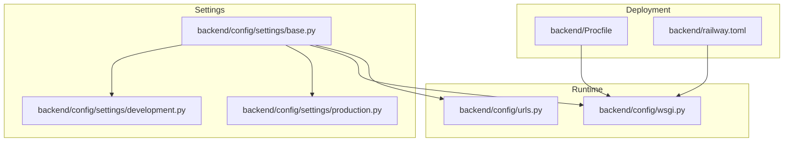
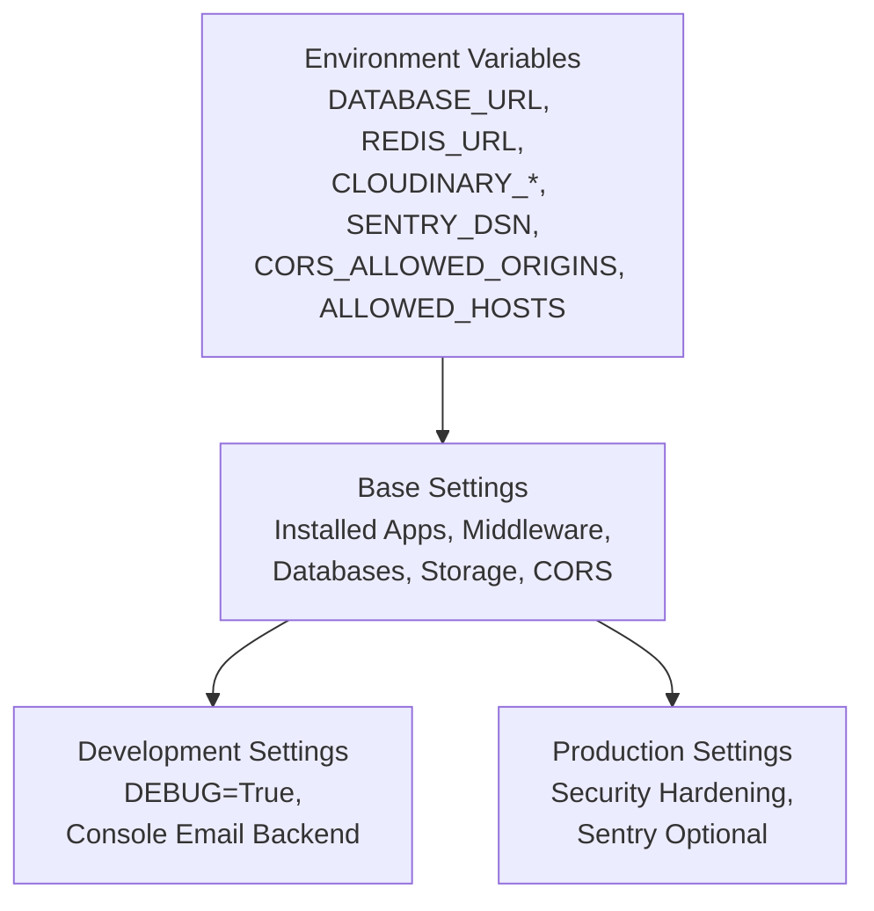
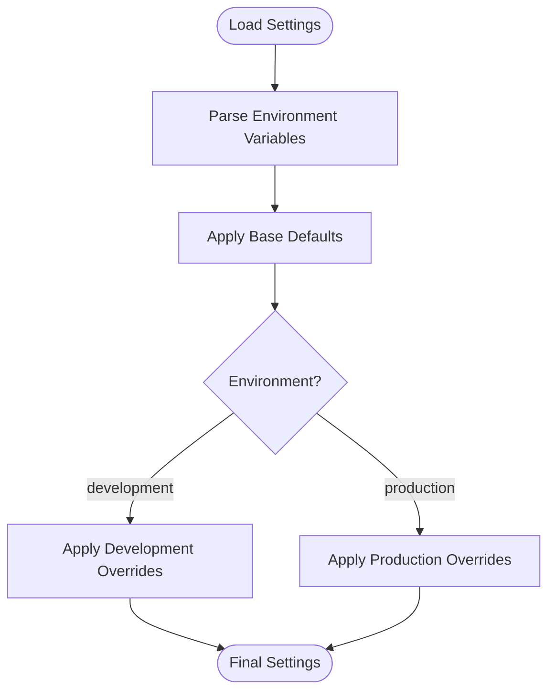
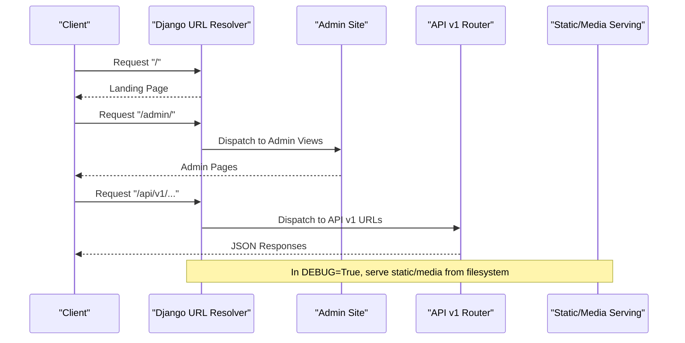
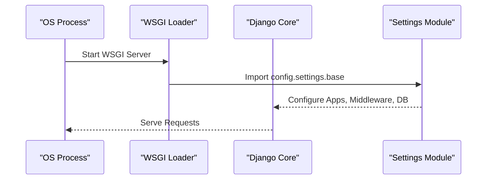
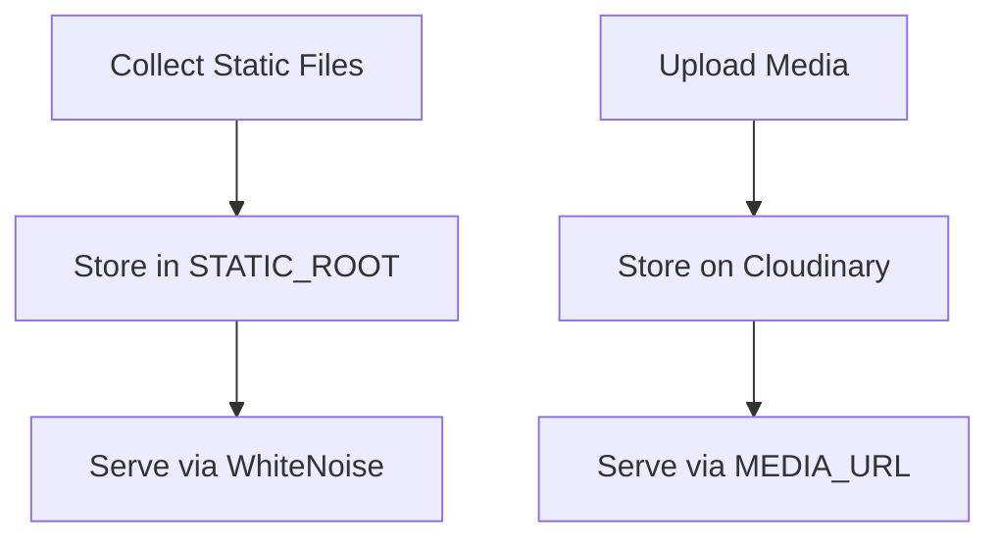
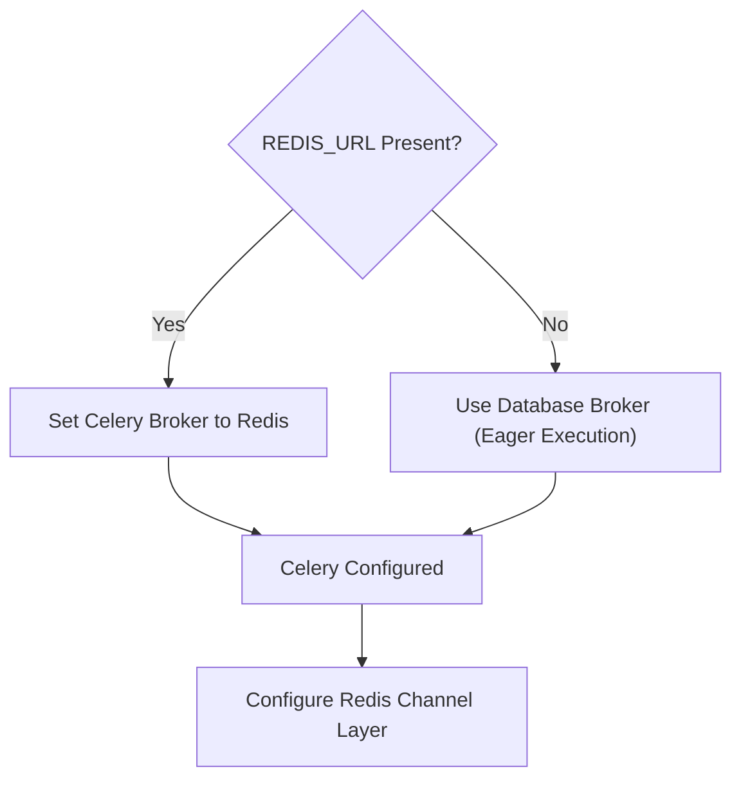
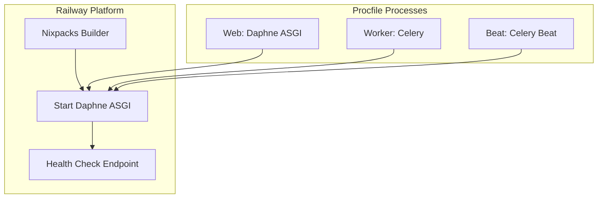
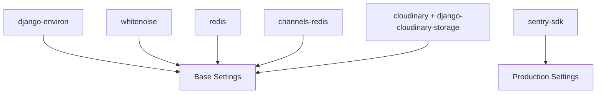

# Configuration & Environment Management

<cite>
**Referenced Files in This Document**
- [base.py](file://backend/config/settings/base.py)
- [development.py](file://backend/config/settings/development.py)
- [production.py](file://backend/config/settings/production.py)
- [urls.py](file://backend/config/urls.py)
- [wsgi.py](file://backend/config/wsgi.py)
- [requirements.txt](file://backend/requirements.txt)
- [Procfile](file://backend/Procfile)
- [railway.toml](file://backend/railway.toml)
- [setup.cfg](file://backend/setup.cfg)
</cite>

## Table of Contents
1. [Introduction](#introduction)
2. [Project Structure](#project-structure)
3. [Core Components](#core-components)
4. [Architecture Overview](#architecture-overview)
5. [Detailed Component Analysis](#detailed-component-analysis)
6. [Dependency Analysis](#dependency-analysis)
7. [Performance Considerations](#performance-considerations)
8. [Troubleshooting Guide](#troubleshooting-guide)
9. [Conclusion](#conclusion)
10. [Appendices](#appendices)

## Introduction
This document explains Empindu’s Django configuration architecture with a focus on multi-environment settings, environment variable usage, secret management, configuration validation patterns, URL routing, WSGI/ASGI application setup, middleware stack, static and media file handling, caching and async task configuration, and deployment-specific optimizations. It also documents configuration inheritance and loading/validation mechanisms.

## Project Structure
Empindu organizes Django settings by environment under backend/config/settings, with shared base settings and environment-specific overrides. Supporting files define URL routing, WSGI application, deployment commands, and platform configuration.

**Diagram sources**
- [base.py](file://backend/config/settings/base.py)
- [development.py](file://backend/config/settings/development.py)
- [production.py](file://backend/config/settings/production.py)
- [urls.py](file://backend/config/urls.py)
- [wsgi.py](file://backend/config/wsgi.py)
- [Procfile](file://backend/Procfile)
- [railway.toml](file://backend/railway.toml)

**Section sources**
- [base.py](file://backend/config/settings/base.py)
- [development.py](file://backend/config/settings/development.py)
- [production.py](file://backend/config/settings/production.py)
- [urls.py](file://backend/config/urls.py)
- [wsgi.py](file://backend/config/wsgi.py)
- [Procfile](file://backend/Procfile)
- [railway.toml](file://backend/railway.toml)

## Core Components
- Base settings module defines shared Django configuration, environment variable parsing, installed apps, middleware, databases, caches, storage, CORS, internationalization, and admin theme customization.
- Development settings inherit base and enable local-friendly behavior such as console email backend and disabling Sentry.
- Production settings inherit base and apply security hardening, SSL redirect, secure cookies, HSTS, and optional Sentry initialization when a DSN is present.
- URL configuration wires the admin, API router, and conditionally serves static/media during development.
- WSGI configuration sets the default Django settings module to the base configuration.

Key configuration highlights:
- Environment variables are parsed via django-environ with defaults for safe development and explicit production overrides.
- Secret management relies on SECRET_KEY from environment variables; DATABASE_URL and Redis URLs are read from environment variables.
- Static files are served via WhiteNoise in production; media files are stored on Cloudinary with environment-driven credentials.
- Celery and Redis are configured for asynchronous tasks and channel layers; fallback behavior exists when Redis is unavailable.

**Section sources**
- [base.py](file://backend/config/settings/base.py)
- [development.py](file://backend/config/settings/development.py)
- [production.py](file://backend/config/settings/production.py)
- [urls.py](file://backend/config/urls.py)
- [wsgi.py](file://backend/config/wsgi.py)

## Architecture Overview
The configuration architecture follows a layered inheritance pattern:
- Base settings centralize shared configuration and environment variable parsing.
- Environment-specific modules override base settings for development and production needs.
- Runtime entry points (WSGI/ASGI) load the appropriate settings module.
- Deployment manifests define runtime commands and environment variables for platforms like Railway.

**Diagram sources**
- [base.py](file://backend/config/settings/base.py)
- [development.py](file://backend/config/settings/development.py)
- [production.py](file://backend/config/settings/production.py)

**Section sources**
- [base.py](file://backend/config/settings/base.py)
- [development.py](file://backend/config/settings/development.py)
- [production.py](file://backend/config/settings/production.py)

## Detailed Component Analysis

### Multi-Environment Configuration Strategy
- Base settings module initializes environment parsing and defines defaults for sensitive and operational settings.
- Development settings inherit base and enable local-friendly behavior.
- Production settings inherit base and apply security and observability enhancements.

**Diagram sources**
- [base.py](file://backend/config/settings/base.py)
- [development.py](file://backend/config/settings/development.py)
- [production.py](file://backend/config/settings/production.py)

**Section sources**
- [base.py](file://backend/config/settings/base.py)
- [development.py](file://backend/config/settings/development.py)
- [production.py](file://backend/config/settings/production.py)

### Environment Variable Usage and Secret Management
- Environment variables are declared with types and defaults using django-environ, ensuring safe defaults for local development while enforcing production secrets.
- Secrets include:
  - SECRET_KEY for Django signing and session keys.
  - DATABASE_URL for Postgres or SQLite fallback.
  - REDIS_URL for Celery broker and channel layers.
  - Cloudinary credentials for media storage.
  - SENTRY_DSN for error tracking (optional in production).
  - CORS_ALLOWED_ORIGINS and ALLOWED_HOSTS for network access control.

Secret management best practices:
- Never commit secrets to version control; rely on environment variables.
- Use strong random values for SECRET_KEY in production.
- Restrict ALLOWED_HOSTS and CORS origins to trusted domains.

**Section sources**
- [base.py](file://backend/config/settings/base.py)
- [development.py](file://backend/config/settings/development.py)
- [production.py](file://backend/config/settings/production.py)

### Configuration Validation Patterns
- Type-safe parsing with defaults prevents missing configuration errors during development.
- Conditional logic applies Celery broker behavior based on Redis presence.
- Optional Sentry initialization avoids runtime errors when DSN is absent.

Validation safeguards:
- Use env(...) with defaults for non-critical settings.
- Guard optional integrations (e.g., Sentry) with existence checks.
- Validate environment-specific lists (e.g., ALLOWED_HOSTS) at runtime.

**Section sources**
- [base.py](file://backend/config/settings/base.py)
- [production.py](file://backend/config/settings/production.py)

### URL Routing Configuration
- Root URL patterns include:
  - Admin site.
  - API v1 router mounted under /api/v1/.
  - Landing page view at root.
- In development mode, static and media files are served automatically via Django’s development server.

**Diagram sources**
- [urls.py](file://backend/config/urls.py)

**Section sources**
- [urls.py](file://backend/config/urls.py)

### WSGI Application Setup
- WSGI application loads the base settings module by default, enabling consistent configuration across environments.
- ASGI application is configured for async features (e.g., channels) and used by the deployment runtime.

**Diagram sources**
- [wsgi.py](file://backend/config/wsgi.py)
- [base.py](file://backend/config/settings/base.py)

**Section sources**
- [wsgi.py](file://backend/config/wsgi.py)
- [base.py](file://backend/config/settings/base.py)

### Middleware Stack Configuration
- Security and session middleware are followed by CORS and allauth account middleware, then template and message processors.
- WhiteNoise middleware is included for static asset serving in production-like environments.

Typical middleware order and purpose:
- Security and session management.
- Cross-origin allowances for frontend integration.
- Authentication and account management.
- Template and message context processors.
- Static asset compression and delivery.

**Section sources**
- [base.py](file://backend/config/settings/base.py)

### Static File Handling and Media Management
- Static files:
  - Collected to a single directory and served via WhiteNoise.
  - Compressed storage is enabled for optimized delivery.
- Media files:
  - Stored on Cloudinary using environment-driven credentials.
  - Media URLs are served under /media/.

**Diagram sources**
- [base.py](file://backend/config/settings/base.py)

**Section sources**
- [base.py](file://backend/config/settings/base.py)

### Cache and Asynchronous Task Configuration
- Celery:
  - Broker URL is derived from REDIS_URL when available; otherwise falls back to database-backed broker with eager execution for development.
  - Results backend uses Django database; scheduler uses the database scheduler.
- Channel layers:
  - Redis-backed WebSocket support configured via REDIS_URL.

**Diagram sources**
- [base.py](file://backend/config/settings/base.py)

**Section sources**
- [base.py](file://backend/config/settings/base.py)

### Deployment-Specific Configurations and Optimizations
- Procfile defines:
  - Web process using Daphne with ASGI application.
  - Worker process for Celery tasks.
  - Beat process for scheduled tasks.
- Railway deployment:
  - Uses Nixpacks builder.
  - Starts Daphne with port and bind from environment.
  - Health check endpoint and timeout configured.
  - Python version pinned.

**Diagram sources**
- [Procfile](file://backend/Procfile)
- [railway.toml](file://backend/railway.toml)

**Section sources**
- [Procfile](file://backend/Procfile)
- [railway.toml](file://backend/railway.toml)

## Dependency Analysis
External dependencies relevant to configuration:
- django-environ for environment variable parsing.
- whitenoise for static file serving.
- redis and channels-redis for async and channel layers.
- sentry-sdk for error tracking (optional).
- cloudinary and django-cloudinary-storage for media.

**Diagram sources**
- [requirements.txt](file://backend/requirements.txt)
- [base.py](file://backend/config/settings/base.py)
- [production.py](file://backend/config/settings/production.py)

**Section sources**
- [requirements.txt](file://backend/requirements.txt)
- [base.py](file://backend/config/settings/base.py)
- [production.py](file://backend/config/settings/production.py)

## Performance Considerations
- Static assets:
  - Use compressed static files storage to reduce bandwidth and improve load times.
  - Serve static files directly via WhiteNoise in production-like environments.
- Media:
  - Offload media to Cloudinary for scalability and CDN benefits.
- Database and caching:
  - Prefer Redis-backed Celery broker in production for reliable async task processing.
  - Use database-backed broker only in development for simplicity.
- Internationalization:
  - Keep USE_I18N enabled only if needed; disable to reduce overhead otherwise.

[No sources needed since this section provides general guidance]

## Troubleshooting Guide
Common configuration issues and resolutions:
- Missing environment variables:
  - Ensure SECRET_KEY, DATABASE_URL, and Cloudinary credentials are set.
  - Verify ALLOWED_HOSTS and CORS_ALLOWED_ORIGINS match deployed domains.
- Static/media not served in development:
  - Confirm DEBUG is True and that static/media serving is appended in URL configuration.
- Celery tasks not executing:
  - Check REDIS_URL availability; if missing, confirm database broker fallback behavior.
- Sentry errors:
  - If SENTRY_DSN is unset, Sentry initialization is skipped; add the DSN to enable monitoring.

**Section sources**
- [base.py](file://backend/config/settings/base.py)
- [development.py](file://backend/config/settings/development.py)
- [production.py](file://backend/config/settings/production.py)
- [urls.py](file://backend/config/urls.py)

## Conclusion
Empindu’s configuration architecture cleanly separates shared settings from environment-specific behavior, uses environment variables for secrets and flexibility, and integrates optional production-grade features like Sentry and Redis-backed async processing. The URL routing, WSGI/ASGI setup, and static/media handling are designed for both development convenience and production readiness. Adhering to the environment variable strategy and deployment manifests ensures consistent behavior across environments.

[No sources needed since this section summarizes without analyzing specific files]

## Appendices

### Appendix A: Environment Variable Reference
- SECRET_KEY: Django secret key.
- DATABASE_URL: Database connection string (Postgres preferred).
- REDIS_URL: Redis connection string for Celery and channels.
- CLOUDINARY_CLOUD_NAME, CLOUDINARY_API_KEY, CLOUDINARY_API_SECRET: Cloudinary credentials.
- SENTRY_DSN: Sentry DSN for error tracking (optional).
- CORS_ALLOWED_ORIGINS: Comma-separated list of allowed origins.
- ALLOWED_HOSTS: Comma-separated list of allowed hosts.

**Section sources**
- [base.py](file://backend/config/settings/base.py)
- [development.py](file://backend/config/settings/development.py)
- [production.py](file://backend/config/settings/production.py)

### Appendix B: Linting and Formatting Configuration
- Flake8 and isort configurations are provided to maintain code quality and import consistency.

**Section sources**
- [setup.cfg](file://backend/setup.cfg)