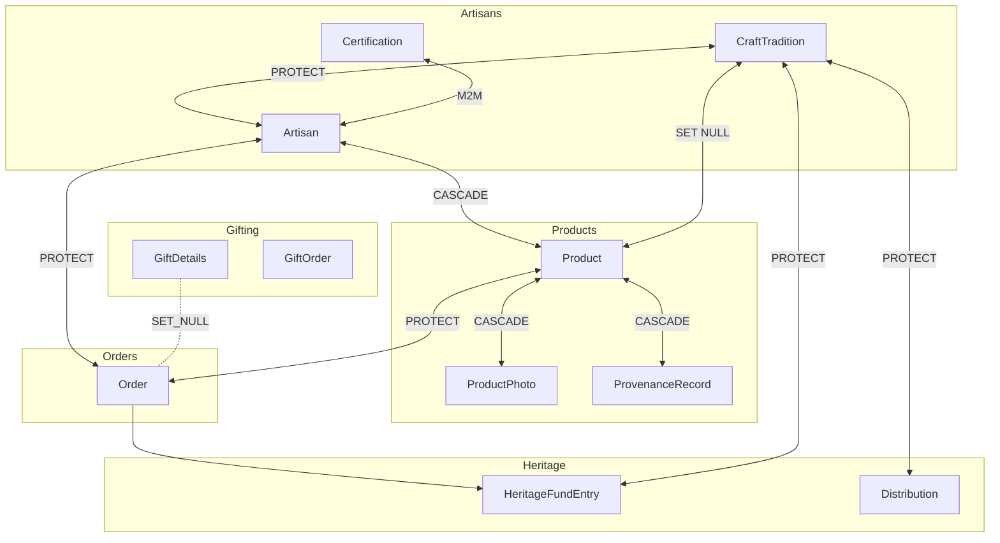
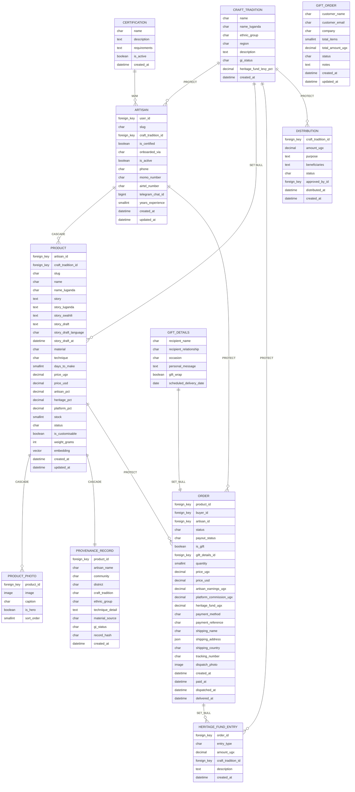
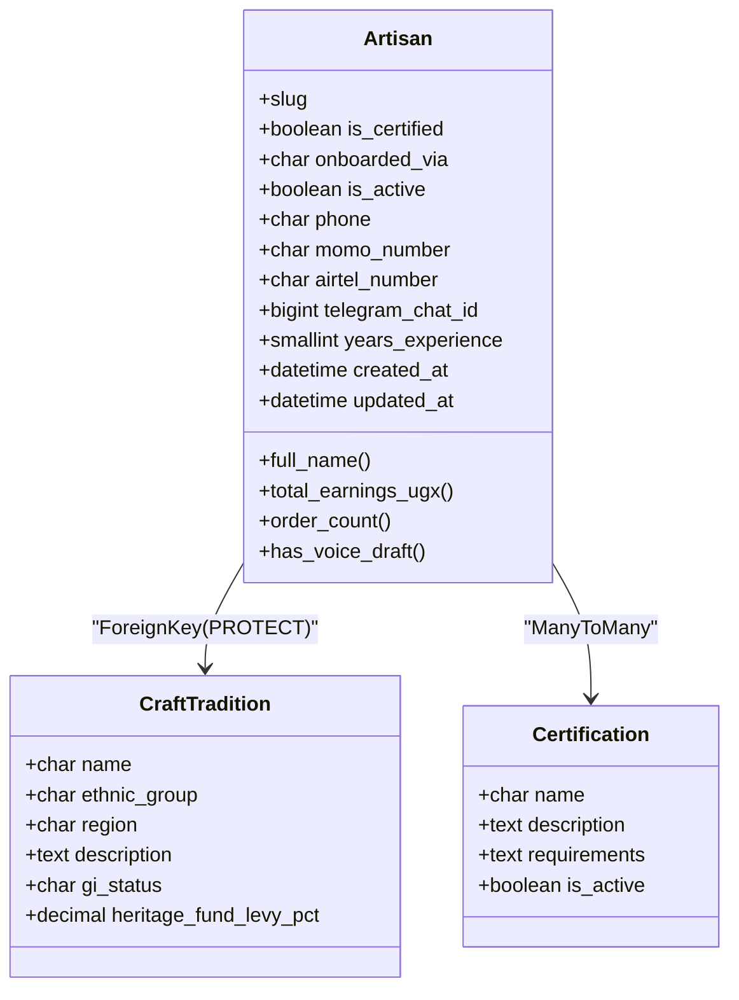
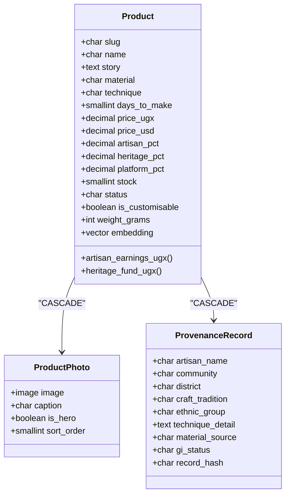
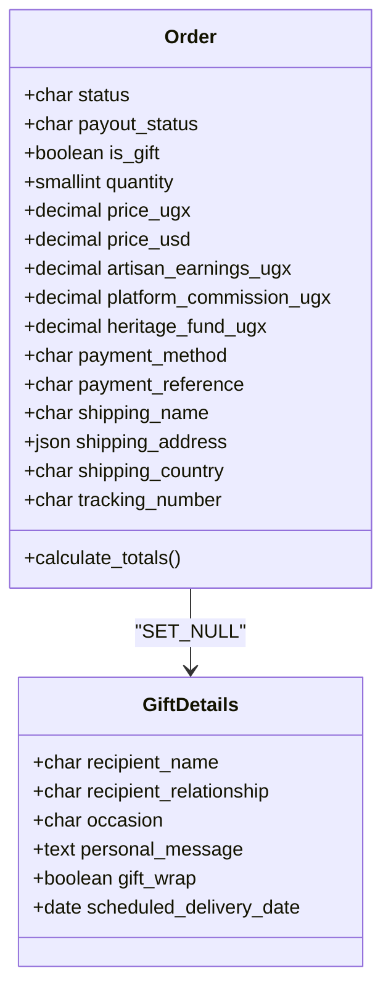
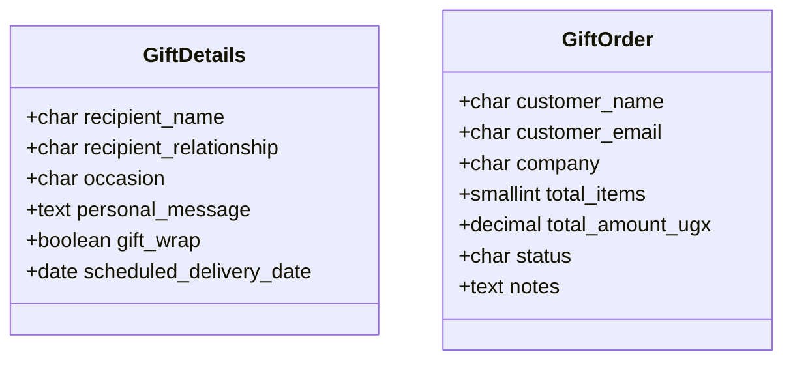
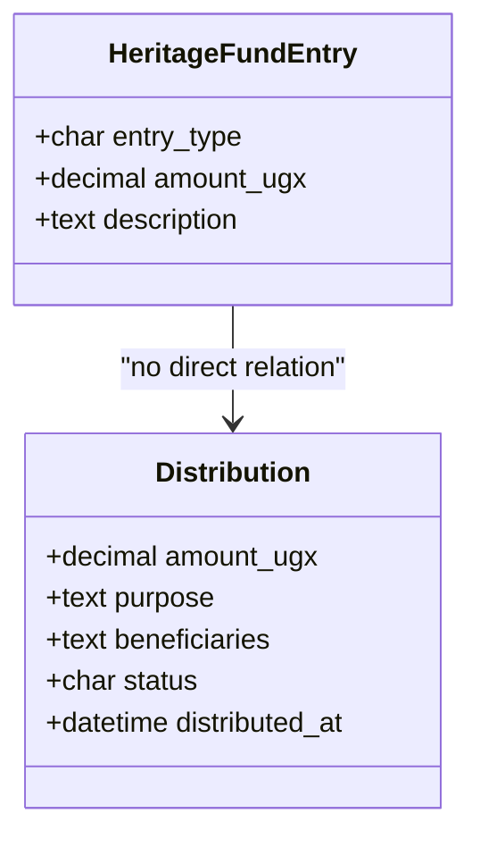
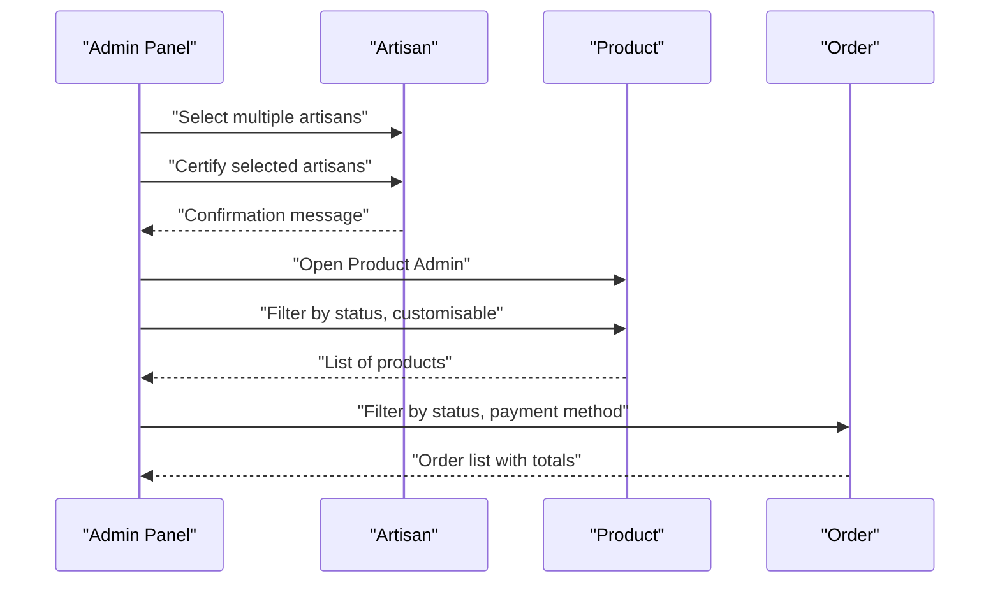

# Database Models & Relationships

<cite>
**Referenced Files in This Document**
- [models.py](file://backend/apps/artisans/models.py)
- [models.py](file://backend/apps/products/models.py)
- [models.py](file://backend/apps/orders/models.py)
- [models.py](file://backend/apps/gifting/models.py)
- [models.py](file://backend/apps/heritage/models.py)
- [admin.py](file://backend/apps/artisans/admin.py)
- [admin.py](file://backend/apps/products/admin.py)
</cite>

## Table of Contents
1. [Introduction](#introduction)
2. [Project Structure](#project-structure)
3. [Core Components](#core-components)
4. [Architecture Overview](#architecture-overview)
5. [Detailed Component Analysis](#detailed-component-analysis)
6. [Dependency Analysis](#dependency-analysis)
7. [Performance Considerations](#performance-considerations)
8. [Troubleshooting Guide](#troubleshooting-guide)
9. [Conclusion](#conclusion)
10. [Appendices](#appendices)

## Introduction
This document provides a comprehensive data model reference for Empindu’s Django application, focusing on the entity-relationship patterns among artisans, products, orders, and gifting systems. It explains model inheritance, field definitions, validation rules, foreign key relationships, many-to-many associations, reverse relationships, managers and custom query methods, indexing strategies, performance considerations, and model evolution/migration patterns. The goal is to make the data model understandable for both technical and non-technical stakeholders.

## Project Structure
The data models are organized by domain features:
- Artisans: identity, craft traditions, certifications, and stats
- Products: listings, provenance, and media
- Orders: lifecycle, payments, payouts, and gift linkage
- Gifting: gift personalization and bulk orders
- Heritage: transparent fund ledger and distributions

**Diagram sources**
- [models.py:14-170](file://backend/apps/artisans/models.py#L14-L170)
- [models.py:10-153](file://backend/apps/products/models.py#L10-L153)
- [models.py:10-122](file://backend/apps/orders/models.py#L10-L122)
- [models.py:9-67](file://backend/apps/gifting/models.py#L9-L67)
- [models.py:9-66](file://backend/apps/heritage/models.py#L9-L66)

**Section sources**
- [models.py:1-170](file://backend/apps/artisans/models.py#L1-L170)
- [models.py:1-153](file://backend/apps/products/models.py#L1-L153)
- [models.py:1-122](file://backend/apps/orders/models.py#L1-L122)
- [models.py:1-67](file://backend/apps/gifting/models.py#L1-L67)
- [models.py:1-66](file://backend/apps/heritage/models.py#L1-L66)

## Core Components
This section summarizes the primary models, their roles, and key fields.

- CraftTradition
  - Purpose: Cultural IP anchor representing craft traditions.
  - Key fields: name, ethnic_group, region, description, gi_status, heritage_fund_levy_pct, timestamps.
  - Ordering: alphabetical by name.

- Certification
  - Purpose: Quality and authenticity marks.
  - Key fields: name, description, requirements, is_active, timestamps.

- Artisan
  - Purpose: Digital identity of craftspeople.
  - Key relationships: OneToOne to User, ForeignKey to CraftTradition, ManyToMany to Certification.
  - Stats: properties for total earnings and order counts.
  - Validation: auto-generated slug; uniqueness enforced; onboarding channel choices; contact numbers; media fields; experience; timestamps.

- Product
  - Purpose: Story-first listings with cultural attribution.
  - Key relationships: ForeignKey to Artisan (reverse: listings), optional ForeignKey to CraftTradition.
  - Pricing: price_ugx/usd, revenue split percentages, computed earnings and heritage contributions.
  - Inventory: stock, status, customization flag, weight.
  - Embeddings: vector field for semantic search.
  - Multilingual: story and name variants.

- ProductPhoto
  - Purpose: Multiple images per product with hero selection and sort order.

- ProvenanceRecord
  - Purpose: Immutable cultural attribution snapshot linked to Product.

- Order
  - Purpose: Full lifecycle tracking with frozen financials.
  - Key relationships: ForeignKey to Product (reverse: orders), to Buyer (settings.AUTH_USER_MODEL), to Artisan (reverse: orders_as_artisan), optional OneToOne to GiftDetails (reverse: order).
  - Statuses: lifecycle states; payment method choices; payout statuses.
  - Financial snapshot: price_ugx/usd, earnings, heritage contribution, platform commission.
  - Shipping: recipient name/address, country code, tracking, dispatch photo.
  - Methods: calculate_totals() to compute totals from product pricing and quantity.

- GiftDetails
  - Purpose: Personalization for gifting (occasion, recipient, message, wrap, scheduled delivery).

- GiftOrder
  - Purpose: Corporate/bulk gifting aggregation with status tracking.

- HeritageFundEntry
  - Purpose: Immutable ledger entries for every completed order; links to Order and CraftTradition.

- Distribution
  - Purpose: Planned and executed fund distributions to communities; tracks approval and status.

**Section sources**
- [models.py:14-170](file://backend/apps/artisans/models.py#L14-L170)
- [models.py:10-153](file://backend/apps/products/models.py#L10-L153)
- [models.py:10-122](file://backend/apps/orders/models.py#L10-L122)
- [models.py:9-67](file://backend/apps/gifting/models.py#L9-L67)
- [models.py:9-66](file://backend/apps/heritage/models.py#L9-L66)

## Architecture Overview
The data model centers around three pillars:
- Cultural IP: CraftTradition anchors artisan identity and product provenance.
- Economic engine: Product listings, Order lifecycle, and HeritageFundEntry track financial flows.
- Gifting extension: GiftDetails and GiftOrder complement retail sales.

**Diagram sources**
- [models.py:14-170](file://backend/apps/artisans/models.py#L14-L170)
- [models.py:10-153](file://backend/apps/products/models.py#L10-L153)
- [models.py:10-122](file://backend/apps/orders/models.py#L10-L122)
- [models.py:9-67](file://backend/apps/gifting/models.py#L9-L67)
- [models.py:9-66](file://backend/apps/heritage/models.py#L9-L66)

## Detailed Component Analysis

### Artisan Model
- Identity and relationships
  - OneToOne to User via related_name “artisan”
  - ForeignKey to CraftTradition via related_name “artisans” (PROTECT)
  - ManyToMany to Certification via related_name “artisans” (blank=True)
- Fields
  - Bio multilingual fields (with Lugandan/Swahili variants)
  - Voice draft fields for transcription review
  - Location: community, district
  - Contact: phone, mobile money numbers, Telegram chat ID
  - Status: is_certified, onboarded_via, is_active
  - Media: profile_photo, cover_photo
  - Experience: years_experience
  - Timestamps: created_at, updated_at
- Properties
  - full_name: derived from User
  - total_earnings_ugx: aggregates delivered orders with paid payout_status
  - order_count: counts delivered orders
  - has_voice_draft: checks presence of bio draft
- Slug generation
  - Auto-generated from full_name; uniqueness ensured with incremental suffix if needed
- Reverse relationships
  - Product listings via related_name “listings”
  - Orders via related_name “orders_as_artisan”

**Diagram sources**
- [models.py:62-170](file://backend/apps/artisans/models.py#L62-L170)

**Section sources**
- [models.py:62-170](file://backend/apps/artisans/models.py#L62-L170)

### Product Model
- Identity and relationships
  - ForeignKey to Artisan (reverse: listings) via CASCADE
  - Optional ForeignKey to CraftTradition (reverse: None) via SET_NULL
  - OneToOne to ProvenanceRecord (reverse: product.provenance)
  - ManyToMany photos via related_name “photos”
- Fields
  - Multilingual name and story
  - Voice draft fields for story
  - Craft details: material, technique, days_to_make
  - Pricing and revenue split: price_ugx/usd, artisan_pct, heritage_pct, platform_pct
  - Inventory: stock, status, is_customisable, weight_grams
  - Embedding: vector field for semantic search
  - Timestamps
- Properties
  - artisan_earnings_ugx: computed from price_ugx and artisan_pct
  - heritage_fund_ugx: computed from price_ugx and heritage_pct
- Reverse relationships
  - Orders via related_name “orders”
  - Provenance via related_name “provenance”
  - Photos via related_name “photos”

**Diagram sources**
- [models.py:10-153](file://backend/apps/products/models.py#L10-L153)

**Section sources**
- [models.py:10-153](file://backend/apps/products/models.py#L10-L153)

### Order Model
- Identity and relationships
  - ForeignKey to Product (reverse: orders) via PROTECT
  - ForeignKey to Buyer (settings.AUTH_USER_MODEL) via SET_NULL
  - ForeignKey to Artisan (reverse: orders_as_artisan) via PROTECT
  - Optional OneToOne to GiftDetails (reverse: order) via SET_NULL
- Fields
  - Status lifecycle, payout_status
  - Gift flag and gift_details linkage
  - Quantity
  - Financial snapshot: price_ugx/usd, artisan_earnings_ugx, platform_commission_ugx, heritage_fund_ugx
  - Payment: method and reference
  - Shipping: name, address JSON, country code, tracking, dispatch photo
  - Timestamps: created_at, paid_at, dispatched_at, delivered_at
- Methods
  - calculate_totals(): computes totals from product pricing and quantity
- Reverse relationships
  - HeritageFundEntry via related_name “heritage_entries”
  - GiftDetails via related_name “order” (when present)

**Diagram sources**
- [models.py:10-122](file://backend/apps/orders/models.py#L10-L122)

**Section sources**
- [models.py:10-122](file://backend/apps/orders/models.py#L10-L122)

### Gifting Models
- GiftDetails
  - Purpose: Personalization for individual gift purchases
  - Occasions: enumerated choices
  - Recipient and message fields
  - Gift wrap option and scheduled delivery date
- GiftOrder
  - Purpose: Corporate or bulk gifting
  - Customer info, company, items, amounts, status, notes

**Diagram sources**
- [models.py:9-67](file://backend/apps/gifting/models.py#L9-L67)

**Section sources**
- [models.py:9-67](file://backend/apps/gifting/models.py#L9-L67)

### Heritage Models
- HeritageFundEntry
  - Purpose: Immutable ledger entries for every completed order
  - Links: Order (optional), CraftTradition (PROTECT), amount, type, description
- Distribution
  - Purpose: Fund distributions to communities
  - Links: CraftTradition (PROTECT), amount, purpose, beneficiaries, status, approver, timestamps

**Diagram sources**
- [models.py:9-66](file://backend/apps/heritage/models.py#L9-L66)

**Section sources**
- [models.py:9-66](file://backend/apps/heritage/models.py#L9-L66)

## Dependency Analysis
- Foreign keys and constraints
  - Artisan.PROTECT to CraftTradition prevents deletion when artisans exist
  - Product.PROTECT to Product prevents deletion when orders exist
  - Product.CASCADE to ProductPhoto and ProductPhoto.CASCADE to ProvenanceRecord ensure referential integrity
  - Order.PROTECT to Artisan and Order.PROTECT to Product prevent accidental removal during lifecycle
  - Order.SET_NULL to GiftDetails allows gift personalization to be removed without deleting the order
  - HeritageFundEntry.SET_NULL to Order enables ledger entries even after buyer deletion
  - HeritageFundEntry.PROTECT to CraftTradition mirrors craft attribution
  - Distribution.PROTECT to CraftTradition ensures attribution continuity
- Many-to-many
  - Artisan.MANY_TO_MANY to Certification (blank=True) supports optional certification tagging
- Reverse relationships
  - Product.orders, Product.photos, Product.provenance
  - Artisan.listings, Artisan.orders_as_artisan, Artisan.artisans (Certification)
  - CraftTradition.artisans, CraftTradition.heritage_entries, CraftTradition.distributions
  - Order.heritage_entries
- Managers and custom query methods
  - Artisan.total_earnings_ugx aggregates delivered orders with paid payout_status
  - Artisan.order_count counts delivered orders
  - Product.artisan_earnings_ugx and Product.heritage_fund_ugx compute per-unit splits
  - Order.calculate_totals updates financial snapshot fields based on product and quantity
- Admin integration
  - Admin panels expose filters, search, and actions for mass updates (e.g., certifying artisans)

**Diagram sources**
- [admin.py:63-71](file://backend/apps/artisans/admin.py#L63-L71)
- [admin.py:11-31](file://backend/apps/products/admin.py#L11-L31)
- [models.py:111-122](file://backend/apps/orders/models.py#L111-L122)

**Section sources**
- [models.py:62-170](file://backend/apps/artisans/models.py#L62-L170)
- [models.py:10-153](file://backend/apps/products/models.py#L10-L153)
- [models.py:10-122](file://backend/apps/orders/models.py#L10-L122)
- [models.py:9-67](file://backend/apps/gifting/models.py#L9-L67)
- [models.py:9-66](file://backend/apps/heritage/models.py#L9-L66)
- [admin.py:10-92](file://backend/apps/artisans/admin.py#L10-L92)
- [admin.py:11-109](file://backend/apps/products/admin.py#L11-L109)

## Performance Considerations
- Field-level indexing and optimization
  - Unique constraints: Product.slug, Artisan.slug
  - Choice fields: STATUS_CHOICES, PAYOUT_STATUS_CHOICES, PAYMENT_METHOD_CHOICES; consider database enums or check constraints where supported
  - JSONField for shipping_address: ensure minimal parsing overhead; consider separate normalized fields if frequent queries target nested keys
  - VectorField for embeddings: requires pgvector; ensure appropriate GIN/HNSW indexing strategy at the database level
- Query patterns and aggregations
  - Artisan.total_earnings_ugx and order_count use filtered QuerySets and aggregation; keep conditions selective and avoid N+1 by prefetching related fields when used in lists
  - Order.calculate_totals recomputes totals; cache or precompute where appropriate to reduce repeated computation
- Reverse relationship usage
  - Prefer select_related and prefetch_related in admin and views to minimize database round trips
  - Use annotations for frequently accessed aggregates (e.g., order counts, earnings) to avoid property-based per-object queries
- Media and storage
  - Image fields upload_to paths; ensure CDN and compression pipeline are configured for performance
- Search and discovery
  - ProvenanceRecord and Product story fields support multilingual narratives; consider full-text search or vector similarity depending on use cases
- Batch operations
  - Admin actions (e.g., certifying artisans) leverage bulk update to reduce writes

[No sources needed since this section provides general guidance]

## Troubleshooting Guide
- Slug conflicts
  - Symptom: Duplicate slug errors when saving Artisan
  - Resolution: The model auto-generates slugs and appends numeric suffixes; ensure slug uniqueness and handle concurrent saves carefully
- Missing provenance
  - Symptom: ProvenanceRecord.DoesNotExist for a Product
  - Resolution: Ensure ProvenanceRecord is created upon listing; verify cascade creation in workflows
- Financial discrepancies
  - Symptom: Discrepancies in Order totals
  - Resolution: Call calculate_totals() after changing product pricing or quantity; verify artisan_pct, heritage_pct, platform_pct sums
- Gift linkage
  - Symptom: GiftDetails not appearing on Order
  - Resolution: Ensure OneToOne assignment to GiftDetails; remember SET_NULL behavior when deleting gift details
- Deletion constraints
  - Symptom: IntegrityError on delete
  - Resolution: Respect PROTECT constraints; remove dependent records first (e.g., orders before deleting products or artisans)

**Section sources**
- [models.py:157-166](file://backend/apps/artisans/models.py#L157-L166)
- [models.py:128-152](file://backend/apps/products/models.py#L128-L152)
- [models.py:111-122](file://backend/apps/orders/models.py#L111-L122)
- [models.py:9-67](file://backend/apps/gifting/models.py#L9-L67)

## Conclusion
Empindu’s data model is designed around cultural IP attribution, transparent economic flows, and flexible gifting experiences. The models enforce referential integrity through protective constraints, enable efficient admin workflows, and support multilingual storytelling. By leveraging reverse relationships, annotations, and batch operations, the system balances expressiveness with performance. As the platform evolves, maintain backward compatibility in migrations, document choice enumerations, and refine indexing strategies to match query patterns.

[No sources needed since this section summarizes without analyzing specific files]

## Appendices

### Model Evolution and Migration Strategies
- Enumerate choices at the model level for clarity and future migrations
- Use migrations to add new fields with defaults; avoid null=True for required fields unless necessary
- Add database indexes for frequently filtered/sorted fields (e.g., Product.status, Order.status)
- Preserve historical data by using SET_NULL or PROTECT appropriately to avoid accidental data loss
- Version vector embeddings and refresh tasks to keep semantic search aligned with product stories

[No sources needed since this section provides general guidance]