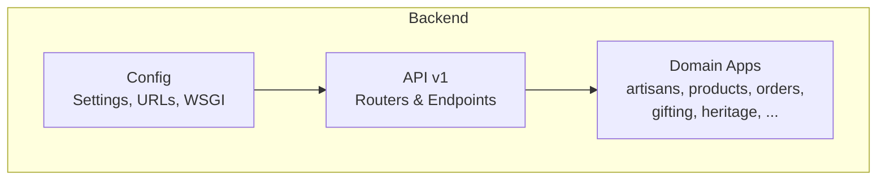
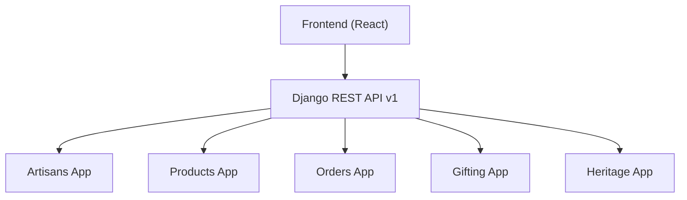
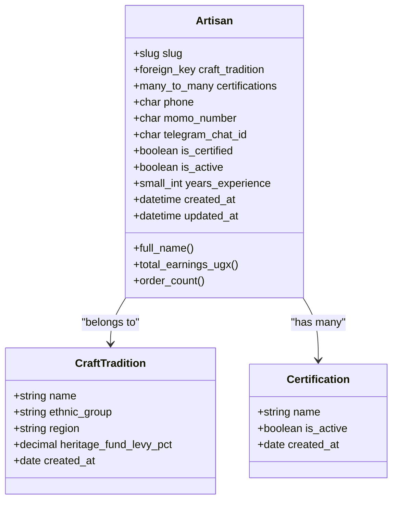
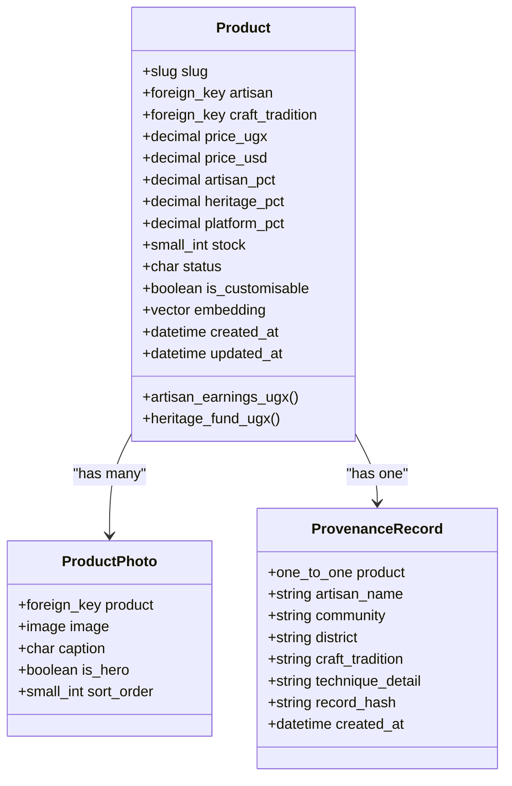
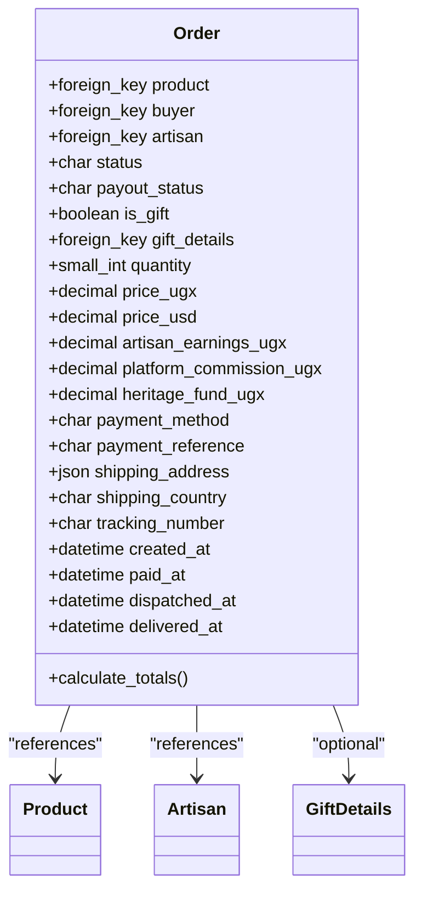
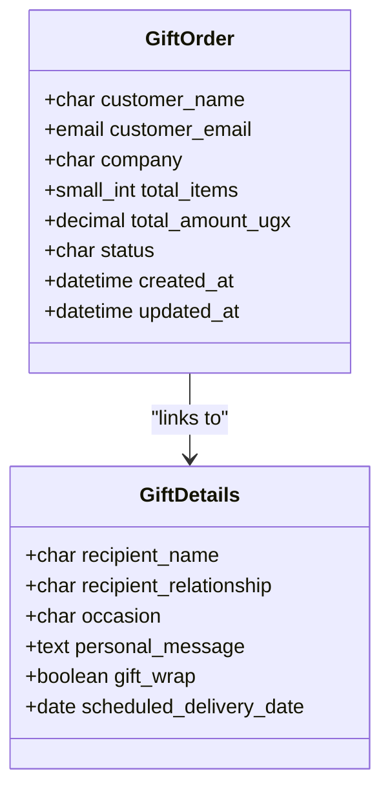
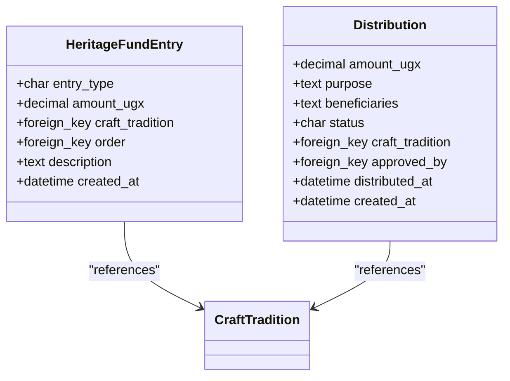
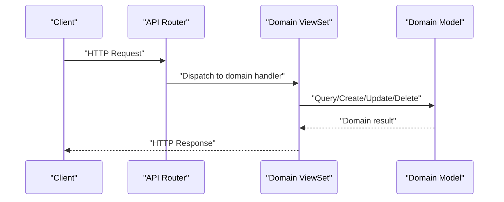
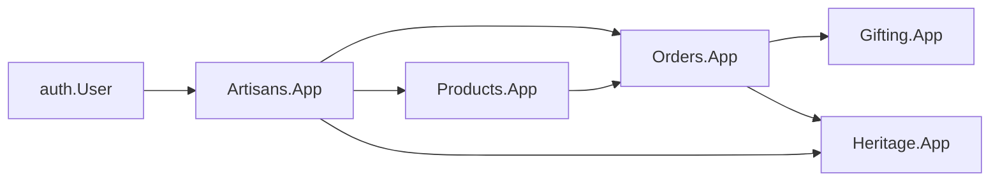

# Django App Structure

<cite>
**Referenced Files in This Document**
- [apps.py](file://backend/apps/artisans/apps.py)
- [models.py](file://backend/apps/artisans/models.py)
- [admin.py](file://backend/apps/artisans/admin.py)
- [apps.py](file://backend/apps/products/apps.py)
- [models.py](file://backend/apps/products/models.py)
- [admin.py](file://backend/apps/products/admin.py)
- [apps.py](file://backend/apps/orders/apps.py)
- [models.py](file://backend/apps/orders/models.py)
- [apps.py](file://backend/apps/gifting/apps.py)
- [models.py](file://backend/apps/gifting/models.py)
- [apps.py](file://backend/apps/heritage/apps.py)
- [models.py](file://backend/apps/heritage/models.py)
- [urls.py](file://backend/api/v1/urls.py)
- [router.py](file://backend/api/v1/router.py)
- [artisans.py](file://backend/api/v1/artisans.py)
- [products.py](file://backend/api/v1/products.py)
- [orders.py](file://backend/api/v1/orders.py)
- [gifting.py](file://backend/api/v1/gifting.py)
- [settings/base.py](file://backend/config/settings/base.py)
- [settings/development.py](file://backend/config/settings/development.py)
- [settings/production.py](file://backend/config/settings/production.py)
- [urls.py](file://backend/config/urls.py)
- [wsgi.py](file://backend/config/wsgi.py)
- [requirements.txt](file://backend/requirements.txt)
- [Procfile](file://backend/Procfile)
- [railway.toml](file://backend/railway.toml)
- [README.md](file://README.md)
</cite>

## Table of Contents
1. [Introduction](#introduction)
2. [Project Structure](#project-structure)
3. [Core Components](#core-components)
4. [Architecture Overview](#architecture-overview)
5. [Detailed Component Analysis](#detailed-component-analysis)
6. [Dependency Analysis](#dependency-analysis)
7. [Performance Considerations](#performance-considerations)
8. [Troubleshooting Guide](#troubleshooting-guide)
9. [Conclusion](#conclusion)
10. [Appendices](#appendices)

## Introduction
This document explains the modular Django architecture of Empindu, focusing on specialized apps that encapsulate distinct business domains: artisans, products, orders, gifting, heritage, machine learning, search, notifications, payments, media, and telegram bot. It details app initialization patterns, model relationships, inter-app dependencies, admin interfaces, and the rationale for modularity. The modular design improves scalability, maintainability, and team autonomy by keeping domain logic cohesive and minimizing cross-cutting coupling.

## Project Structure
Empindu organizes backend logic under a dedicated backend directory with:
- apps/: Domain apps implementing models, admin, and optional management commands
- api/v1/: Versioned REST API routers and endpoints grouped by domain
- config/: Django settings, URLs, and WSGI configuration
- requirements.txt: Python dependencies
- Procfile and railway.toml: Deployment configuration

**Section sources**
- [settings/base.py](file://backend/config/settings/base.py)
- [settings/development.py](file://backend/config/settings/development.py)
- [settings/production.py](file://backend/config/settings/production.py)
- [urls.py](file://backend/config/urls.py)
- [wsgi.py](file://backend/config/wsgi.py)

## Core Components
This section outlines the core apps and their responsibilities, initialization patterns, and admin interfaces.

- Artisans app
  - Purpose: Cultural IP anchor, artisan onboarding, craft traditions, certifications
  - Initialization: AppConfig defines default auto field and verbose name
  - Models: CraftTradition, Certification, Artisan with multilingual fields and onboarding metadata
  - Admin: Unfold-based interface with actions to certify artisans and filters for regions and onboard channels

- Products app
  - Purpose: Story-first product catalog, provenance records, revenue split
  - Initialization: AppConfig with verbose name
  - Models: Product (with embeddings), ProductPhoto, ProvenanceRecord
  - Admin: Unfold-based management with fieldsets for attribution, story, pricing, inventory

- Orders app
  - Purpose: Full order lifecycle, payment methods, payout tracking
  - Initialization: AppConfig with verbose name
  - Models: Order with status machine, payment method choices, frozen financial snapshot
  - Admin: Not shown here; focus is on model relationships and API exposure

- Gifting app
  - Purpose: Personalized gift purchases and corporate gifting
  - Initialization: AppConfig with verbose name
  - Models: GiftDetails for recipients and messages, GiftOrder for bulk orders
  - Admin: Not shown here; focus is on model relationships and API exposure

- Heritage app
  - Purpose: Transparent impact ledger and community distributions
  - Initialization: AppConfig with verbose name
  - Models: HeritageFundEntry (immutable ledger), Distribution (community payouts)
  - Admin: Not shown here; focus is on model relationships and API exposure

- Placeholder apps (to be implemented)
  - ML, Search, Notifications, Payments, Media, Telegram Bot
  - Indicated by empty __init__.py files with placeholder comments

**Section sources**
- [apps.py](file://backend/apps/artisans/apps.py)
- [models.py](file://backend/apps/artisans/models.py)
- [admin.py](file://backend/apps/artisans/admin.py)
- [apps.py](file://backend/apps/products/apps.py)
- [models.py](file://backend/apps/products/models.py)
- [admin.py](file://backend/apps/products/admin.py)
- [apps.py](file://backend/apps/orders/apps.py)
- [models.py](file://backend/apps/orders/models.py)
- [apps.py](file://backend/apps/gifting/apps.py)
- [models.py](file://backend/apps/gifting/models.py)
- [apps.py](file://backend/apps/heritage/apps.py)
- [models.py](file://backend/apps/heritage/models.py)
- [apps.py](file://backend/apps/ml/__init__.py)
- [apps.py](file://backend/apps/search/__init__.py)
- [apps.py](file://backend/apps/notifications/__init__.py)
- [apps.py](file://backend/apps/payments/__init__.py)
- [apps.py](file://backend/apps/media/__init__.py)
- [apps.py](file://backend/apps/telegram_bot/__init__.py)

## Architecture Overview
The system follows a layered architecture:
- Presentation: React frontend (outside this Django-centric view)
- API Layer: Versioned REST endpoints grouped by domain
- Domain Layer: Cohesive apps with models and domain logic
- Persistence: Django ORM with Postgres and vector extensions
- Infrastructure: WSGI, deployment via Procfile and Railway configuration

**Diagram sources**
- [urls.py](file://backend/api/v1/urls.py)
- [router.py](file://backend/api/v1/router.py)
- [artisans.py](file://backend/api/v1/artisans.py)
- [products.py](file://backend/api/v1/products.py)
- [orders.py](file://backend/api/v1/orders.py)
- [gifting.py](file://backend/api/v1/gifting.py)

## Detailed Component Analysis

### Artisans App
The artisans app models craft traditions, certifications, and artisan profiles. It integrates with the authentication system and exposes computed metrics for admin dashboards.

**Diagram sources**
- [models.py](file://backend/apps/artisans/models.py)

Key implementation patterns:
- Slug generation on save with collision handling
- Multilingual fields for stories and bios
- Computed properties for earnings and order counts
- Onboarding metadata and payment channel fields

Admin highlights:
- Actions to mass-certify artisans
- Filters by certification status, ethnicity, district, and onboarding channel
- Fieldsets separating identity, location, published bio, voice drafts, and stats

**Section sources**
- [models.py](file://backend/apps/artisans/models.py)
- [admin.py](file://backend/apps/artisans/admin.py)

### Products App
The products app anchors each product to an artisan and craft tradition, maintains story content, and computes revenue splits. It includes provenance records and semantic embeddings for search.

**Diagram sources**
- [models.py](file://backend/apps/products/models.py)

Admin highlights:
- Fieldsets for attribution, story, craft details, pricing, inventory
- Read-only computed fields for earnings and draft metadata
- Provenance record management with immutable snapshot fields

**Section sources**
- [models.py](file://backend/apps/products/models.py)
- [admin.py](file://backend/apps/products/admin.py)

### Orders App
The orders app tracks the complete lifecycle from pending payment to delivery, with frozen financial snapshots and payout statuses.

**Diagram sources**
- [models.py](file://backend/apps/orders/models.py)

Admin highlights:
- Not shown here; focus is on model relationships and API exposure

**Section sources**
- [models.py](file://backend/apps/orders/models.py)

### Gifting App
The gifting app supports personalized gift purchases and corporate gifting with scheduling and messaging.

**Diagram sources**
- [models.py](file://backend/apps/gifting/models.py)

Admin highlights:
- Not shown here; focus is on model relationships and API exposure

**Section sources**
- [models.py](file://backend/apps/gifting/models.py)

### Heritage App
The heritage app maintains transparent ledger entries and community distributions linked to craft traditions.

**Diagram sources**
- [models.py](file://backend/apps/heritage/models.py)

Admin highlights:
- Not shown here; focus is on model relationships and API exposure

**Section sources**
- [models.py](file://backend/apps/heritage/models.py)

### API Layer and App Registry
The API layer groups endpoints by domain and routes them through a central router. App initialization is handled by AppConfig classes registered in Django settings.

**Diagram sources**
- [router.py](file://backend/api/v1/router.py)
- [artisans.py](file://backend/api/v1/artisans.py)
- [products.py](file://backend/api/v1/products.py)
- [orders.py](file://backend/api/v1/orders.py)
- [gifting.py](file://backend/api/v1/gifting.py)

App registry configuration:
- Each domain app registers its AppConfig in Django settings, ensuring consistent initialization and verbose names across the system.

**Section sources**
- [apps.py](file://backend/apps/artisans/apps.py)
- [apps.py](file://backend/apps/products/apps.py)
- [apps.py](file://backend/apps/orders/apps.py)
- [apps.py](file://backend/apps/gifting/apps.py)
- [apps.py](file://backend/apps/heritage/apps.py)
- [settings/base.py](file://backend/config/settings/base.py)

## Dependency Analysis
Inter-app dependencies are primarily through foreign keys and shared references, preserving cohesion within each domain while enabling controlled coupling.

**Diagram sources**
- [models.py](file://backend/apps/artisans/models.py)
- [models.py](file://backend/apps/products/models.py)
- [models.py](file://backend/apps/orders/models.py)
- [models.py](file://backend/apps/gifting/models.py)
- [models.py](file://backend/apps/heritage/models.py)

Observations:
- Orders references Products, Artisans, and optionally Gifting
- Products references Artisans and CraftTradition
- Heritage entries reference Orders and CraftTradition
- Artisans reference CraftTradition and Certifications

**Section sources**
- [models.py](file://backend/apps/artisans/models.py)
- [models.py](file://backend/apps/products/models.py)
- [models.py](file://backend/apps/orders/models.py)
- [models.py](file://backend/apps/gifting/models.py)
- [models.py](file://backend/apps/heritage/models.py)

## Performance Considerations
- Vector embeddings: Product embedding field enables semantic search; consider indexing and periodic updates via background tasks
- Computed properties: Earnings and order counts are computed on demand; cache or precompute for high-volume admin views
- Foreign key relationships: Use select_related and prefetch_related in serializers and admin lists to minimize N+1 queries
- Image fields: Optimize storage and CDN usage for artisan and product photos
- PostgreSQL extensions: Ensure vector extension is enabled and properly configured

## Troubleshooting Guide
Common areas to inspect:
- App initialization: Verify AppConfig registration and verbose names in settings
- Admin permissions: Confirm actions like mass certification are granted to appropriate user roles
- Model relationships: Validate foreign keys and related names to prevent runtime errors
- API routing: Ensure endpoints are correctly mounted under the v1 router and URLs
- Embeddings pipeline: Confirm Celery tasks update product embeddings and database indices

**Section sources**
- [apps.py](file://backend/apps/artisans/apps.py)
- [admin.py](file://backend/apps/artisans/admin.py)
- [models.py](file://backend/apps/products/models.py)
- [models.py](file://backend/apps/orders/models.py)
- [router.py](file://backend/api/v1/router.py)
- [urls.py](file://backend/api/v1/urls.py)

## Conclusion
Empindu’s modular Django architecture cleanly separates business domains into cohesive apps, each with its own models, admin interfaces, and API exposure. This design enhances scalability by allowing independent development and testing, and improves maintainability by enforcing clear boundaries. The chosen initialization patterns, explicit model relationships, and controlled inter-app dependencies support long-term evolution while preserving system coherence.

## Appendices

### Deployment and Environment Configuration
- WSGI: Standard Django WSGI application configured for production
- Procfile: Defines the dyno command for deployment
- Railway configuration: Platform-specific deployment settings

**Section sources**
- [wsgi.py](file://backend/config/wsgi.py)
- [Procfile](file://backend/Procfile)
- [railway.toml](file://backend/railway.toml)

### Settings Overview
- Base settings: Shared configuration across environments
- Development settings: Local overrides and debug toggles
- Production settings: Security, static files, and service integrations

**Section sources**
- [settings/base.py](file://backend/config/settings/base.py)
- [settings/development.py](file://backend/config/settings/development.py)
- [settings/production.py](file://backend/config/settings/production.py)

### Requirements and Dependencies
- Python packages pinned for reproducible builds
- Vector database support for embeddings

**Section sources**
- [requirements.txt](file://backend/requirements.txt)