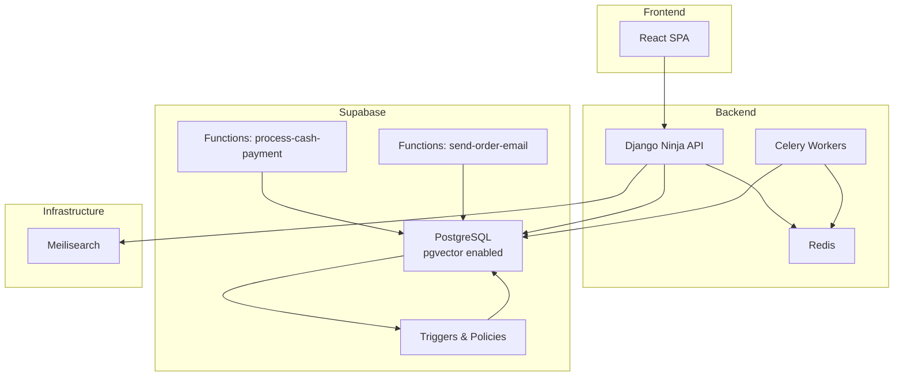
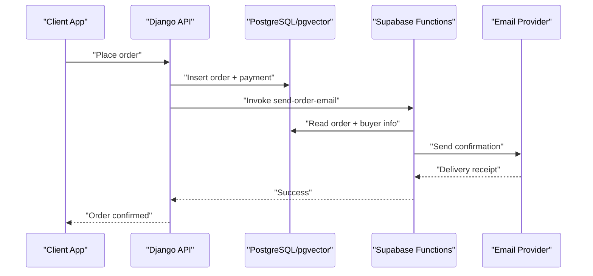
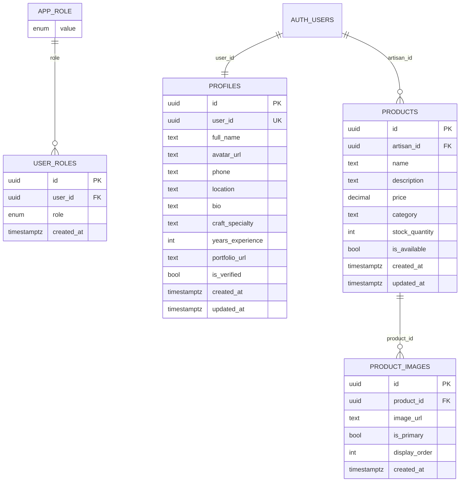
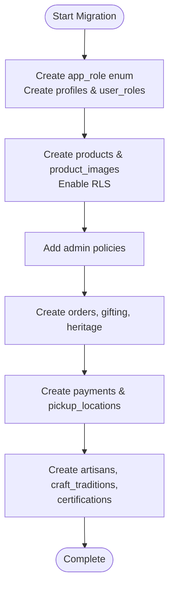
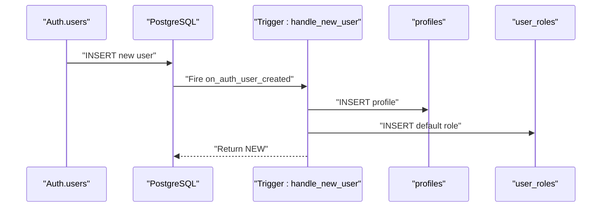
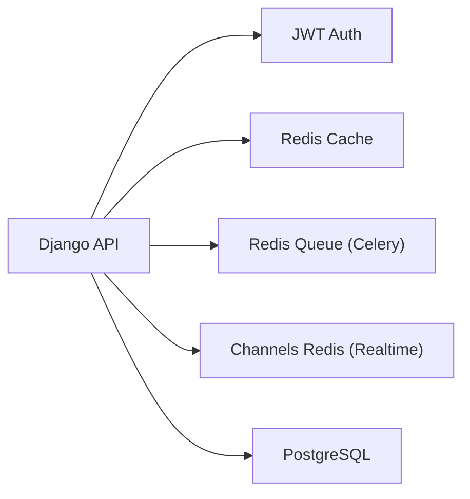
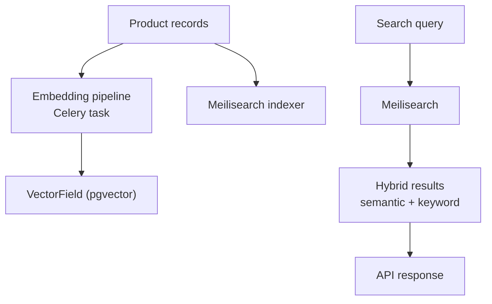
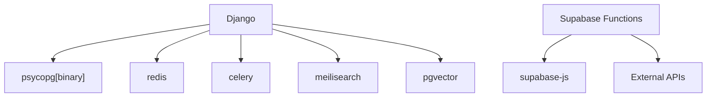

# Data Architecture

<cite>
**Referenced Files in This Document**
- [20251231095959_3473bebe-42ab-4109-8633-54732ebf1eaf.sql](file://supabase/migrations/20251231095959_3473bebe-42ab-4109-8633-54732ebf1eaf.sql)
- [20260101210119_8814f12d-688f-4774-9ce8-6ce5f9fd0bba.sql](file://supabase/migrations/20260101210119_8814f12d-688f-4774-9ce8-6ce5f9fd0bba.sql)
- [20260101211534_d1ce3159-d630-4859-8ee8-6361241b244c.sql](file://supabase/migrations/20260101211534_d1ce3159-d630-4859-8ee8-6361241b244c.sql)
- [20260103085459_7948cea8-ed91-44d2-882d-43b3ec3c3fa4.sql](file://supabase/migrations/20260103085459_7948cea8-ed91-44d2-882d-43b3ec3c3fa4.sql)
- [20260104173154_8858732d-0e5c-45cd-afaf-c177dfa5487a.sql](file://supabase/migrations/20260104173154_8858732d-0e5c-45cd-afaf-c177dfa5487a.sql)
- [20260107224910_0b6f10e2-c8bb-49bb-ba91-d7b9b48cd27c.sql](file://supabase/migrations/20260107224910_0b6f10e2-c8bb-49bb-ba91-d7b9b48cd27c.sql)
- [20260109095251_6889a1b9-3b1c-4b8f-9535-f3ef095414de.sql](file://supabase/migrations/20260109095251_6889a1b9-3b1c-4b8f-9535-f3ef095414de.sql)
- [20260110082525_e26cf9e4-1e19-414d-9316-27ada8493a53.sql](file://supabase/migrations/20260110082525_e26cf9e4-1e19-414d-9316-27ada8493a53.sql)
- [20260110084208_19f31e38-2062-4a6a-a516-e5b9de4e3510.sql](file://supabase/migrations/20260110084208_19f31e38-2062-4a6a-a516-e5b9de4e3510.sql)
- [20260121122109_0b1cb36d-aa4e-4dd7-a125-c453bc87fffe.sql](file://supabase/migrations/20260121122109_0b1cb36d-aa4e-4dd7-a125-c453bc87fffe.sql)
- [20260301183140_74b1e32e-ded4-4234-9c49-76542f291b2d.sql](file://supabase/migrations/20260301183140_74b1e32e-ded4-4234-9c49-76542f291b2d.sql)
- [20260301185835_24e7e596-6ffe-4991-964c-74e173d7213e.sql](file://supabase/migrations/20260301185835_24e7e596-6ffe-4991-964c-74e173d7213e.sql)
- [20260307151135_abb92613-d0a4-4ab6-8384-d241b138020b.sql](file://supabase/migrations/20260307151135_abb92613-d0a4-4ab6-8384-d241b138020b.sql)
- [20260312151001_0ad1fffe-4364-4902-9212-6c6e1aeb1f08.sql](file://supabase/migrations/20260312151001_0ad1fffe-4364-4902-9212-6c6e1aeb1f08.sql)
- [20260312151243_54077459-7217-4c42-a35e-67af66d898f3.sql](file://supabase/migrations/20260312151243_54077459-7217-4c42-a35e-67af66d898f3.sql)
- [models.py](file://backend/apps/products/models.py)
- [models.py](file://backend/apps/artisans/models.py)
- [models.py](file://backend/apps/orders/models.py)
- [models.py](file://backend/apps/gifting/models.py)
- [models.py](file://backend/apps/heritage/models.py)
- [index.ts](file://supabase/functions/process-cash-payment/index.ts)
- [index.ts](file://supabase/functions/send-order-email/index.ts)
- [router.py](file://backend/api/v1/router.py)
- [base.py](file://backend/config/settings/base.py)
- [docker-compose.yml](file://infrastructure/docker-compose.yml)
- [requirements.txt](file://backend/requirements.txt)
- [config.toml](file://supabase/config.toml)
</cite>

## Table of Contents
1. [Introduction](#introduction)
2. [Project Structure](#project-structure)
3. [Core Components](#core-components)
4. [Architecture Overview](#architecture-overview)
5. [Detailed Component Analysis](#detailed-component-analysis)
6. [Dependency Analysis](#dependency-analysis)
7. [Performance Considerations](#performance-considerations)
8. [Troubleshooting Guide](#troubleshooting-guide)
9. [Conclusion](#conclusion)
10. [Appendices](#appendices)

## Introduction
This document describes Empindu’s data architecture with a focus on the PostgreSQL database design using pgvector for semantic search, vector embedding strategies, and search index optimization. It documents data migration and schema evolution patterns, database relationships, Supabase serverless functions and triggers for event-driven data processing, real-time synchronization, data access patterns, caching with Redis, and search optimization via Meilisearch. It also covers data security, backup strategies, lifecycle management, and the integration between frontend state management and backend data services, including conflict resolution and offline synchronization patterns.

## Project Structure
The data architecture spans three layers:
- Backend Django application hosting core domain models and API endpoints
- Supabase-managed PostgreSQL with row-level security, triggers, and serverless functions
- Infrastructure containers for PostgreSQL (with pgvector), Redis (cache and Celery broker), and Meilisearch (semantic search)

**Diagram sources**
- [docker-compose.yml:1-52](file://infrastructure/docker-compose.yml#L1-L52)
- [requirements.txt:1-50](file://backend/requirements.txt#L1-L50)
- [router.py:1-40](file://backend/api/v1/router.py#L1-L40)
- [index.ts:1-114](file://supabase/functions/process-cash-payment/index.ts#L1-L114)
- [index.ts:1-284](file://supabase/functions/send-order-email/index.ts#L1-L284)

**Section sources**
- [docker-compose.yml:1-52](file://infrastructure/docker-compose.yml#L1-L52)
- [requirements.txt:1-50](file://backend/requirements.txt#L1-L50)
- [router.py:1-40](file://backend/api/v1/router.py#L1-L40)

## Core Components
- PostgreSQL with pgvector: Vector embeddings stored as VectorField for semantic search; RLS policies govern access; triggers maintain audit timestamps.
- Supabase serverless functions: Event handlers for payments and order-related emails; JWT verification for authenticated flows.
- Django models: Strongly-typed domain models for artisans, products, orders, gifting, and heritage funds; vector embeddings managed by Celery.
- Caching and streaming: Redis for caching, Celery broker, and WebSocket channel layers for real-time updates.
- Search engine: Meilisearch for fast, scalable semantic search and faceted filtering.

**Section sources**
- [20251231095959_3473bebe-42ab-4109-8633-54732ebf1eaf.sql:1-140](file://supabase/migrations/20251231095959_3473bebe-42ab-4109-8633-54732ebf1eaf.sql#L1-L140)
- [20260101210119_8814f12d-688f-4774-9ce8-6ce5f9fd0bba.sql:1-118](file://supabase/migrations/20260101210119_8814f12d-688f-4774-9ce8-6ce5f9fd0bba.sql#L1-L118)
- [models.py:1-153](file://backend/apps/products/models.py#L1-L153)
- [models.py:1-170](file://backend/apps/artisans/models.py#L1-L170)
- [models.py:1-122](file://backend/apps/orders/models.py#L1-L122)
- [models.py:1-67](file://backend/apps/gifting/models.py#L1-L67)
- [models.py:1-66](file://backend/apps/heritage/models.py#L1-L66)
- [index.ts:1-114](file://supabase/functions/process-cash-payment/index.ts#L1-L114)
- [index.ts:1-284](file://supabase/functions/send-order-email/index.ts#L1-L284)
- [base.py:101-128](file://backend/config/settings/base.py#L101-L128)

## Architecture Overview
The system uses a hybrid architecture:
- PostgreSQL with pgvector powers the primary datastore and semantic search vectors.
- Supabase triggers and policies enforce row-level security and automate profile/role creation.
- Serverless functions encapsulate payment and notification workflows.
- Django API exposes domain endpoints secured with JWT.
- Redis supports caching, Celery workers, and real-time channels.
- Meilisearch indexes product content for fast retrieval and semantic ranking.

**Diagram sources**
- [index.ts:165-281](file://supabase/functions/send-order-email/index.ts#L165-L281)
- [router.py:22-28](file://backend/api/v1/router.py#L22-L28)

## Detailed Component Analysis

### PostgreSQL Schema and RLS
- Enumerations and roles define user classification (admin, artisan, buyer).
- Profiles and user_roles tables separate identity and permissions; RLS policies restrict visibility and mutations.
- Triggers update timestamps automatically; a helper function checks roles securely.
- Products and product_images tables enforce artisan ownership and availability; storage buckets and policies control image access.

**Diagram sources**
- [20251231095959_3473bebe-42ab-4109-8633-54732ebf1eaf.sql:1-140](file://supabase/migrations/20251231095959_3473bebe-42ab-4109-8633-54732ebf1eaf.sql#L1-L140)
- [20260101210119_8814f12d-688f-4774-9ce8-6ce5f9fd0bba.sql:1-118](file://supabase/migrations/20260101210119_8814f12d-688f-4774-9ce8-6ce5f9fd0bba.sql#L1-L118)

**Section sources**
- [20251231095959_3473bebe-42ab-4109-8633-54732ebf1eaf.sql:1-140](file://supabase/migrations/20251231095959_3473bebe-42ab-4109-8633-54732ebf1eaf.sql#L1-L140)
- [20260101210119_8814f12d-688f-4774-9ce8-6ce5f9fd0bba.sql:1-118](file://supabase/migrations/20260101210119_8814f12d-688f-4774-9ce8-6ce5f9fd0bba.sql#L1-L118)
- [20260101211534_d1ce3159-d630-4859-8ee8-6361241b244c.sql:1-31](file://supabase/migrations/20260101211534_d1ce3159-d630-4859-8ee8-6361241b244c.sql#L1-L31)

### Data Migration and Schema Evolution
- Migrations are versioned and incremental, adding tables, enums, policies, and storage configurations progressively.
- Example migrations:
  - Roles and profiles with RLS and triggers
  - Products and images with policies and storage
  - Admin policies for product and role management
  - Additional tables for orders, gifting, and heritage funds
  - Pickup locations and payments
  - Craft traditions, certifications, and artisan profiles

**Diagram sources**
- [20251231095959_3473bebe-42ab-4109-8633-54732ebf1eaf.sql:1-140](file://supabase/migrations/20251231095959_3473bebe-42ab-4109-8633-54732ebf1eaf.sql#L1-L140)
- [20260101210119_8814f12d-688f-4774-9ce8-6ce5f9fd0bba.sql:1-118](file://supabase/migrations/20260101210119_8814f12d-688f-4774-9ce8-6ce5f9fd0bba.sql#L1-L118)
- [20260103085459_7948cea8-ed91-44d2-882d-43b3ec3c3fa4.sql:1-120](file://supabase/migrations/20260103085459_7948cea8-ed91-44d2-882d-43b3ec3c3fa4.sql#L1-L120)
- [20260104173154_8858732d-0e5c-45cd-afaf-c177dfa5487a.sql:1-120](file://supabase/migrations/20260104173154_8858732d-0e5c-45cd-afaf-c177dfa5487a.sql#L1-L120)
- [20260107224910_0b6f10e2-c8bb-49bb-ba91-d7b9b48cd27c.sql:1-120](file://supabase/migrations/20260107224910_0b6f10e2-c8bb-49bb-ba91-d7b9b48cd27c.sql#L1-L120)
- [20260109095251_6889a1b9-3b1c-4b8f-9535-f3ef095414de.sql:1-120](file://supabase/migrations/20260109095251_6889a1b9-3b1c-4b8f-9535-f3ef095414de.sql#L1-L120)
- [20260110082525_e26cf9e4-1e19-414d-9316-27ada8493a53.sql:1-120](file://supabase/migrations/20260110082525_e26cf9e4-1e19-414d-9316-27ada8493a53.sql#L1-L120)
- [20260110084208_19f31e38-2062-4a6a-a516-e5b9de4e3510.sql:1-120](file://supabase/migrations/20260110084208_19f31e38-2062-4a6a-a516-e5b9de4e3510.sql#L1-L120)
- [20260121122109_0b1cb36d-aa4e-4dd7-a125-c453bc87fffe.sql:1-120](file://supabase/migrations/20260121122109_0b1cb36d-aa4e-4dd7-a125-c453bc87fffe.sql#L1-L120)
- [20260301183140_74b1e32e-ded4-4234-9c49-76542f291b2d.sql:1-120](file://supabase/migrations/20260301183140_74b1e32e-ded4-4234-9c49-76542f291b2d.sql#L1-L120)
- [20260301185835_24e7e596-6ffe-4991-964c-74e173d7213e.sql:1-120](file://supabase/migrations/20260301185835_24e7e596-6ffe-4991-964c-74e173d7213e.sql#L1-L120)
- [20260307151135_abb92613-d0a4-4ab6-8384-d241b138020b.sql:1-120](file://supabase/migrations/20260307151135_abb92613-d0a4-4ab6-8384-d241b138020b.sql#L1-L120)
- [20260312151001_0ad1fffe-4364-4902-9212-6c6e1aeb1f08.sql:1-120](file://supabase/migrations/20260312151001_0ad1fffe-4364-4902-9212-6c6e1aeb1f08.sql#L1-L120)
- [20260312151243_54077459-7217-4c42-a35e-67af66d898f3.sql:1-120](file://supabase/migrations/20260312151243_54077459-7217-4c42-a35e-67af66d898f3.sql#L1-L120)

### Supabase Serverless Functions and Triggers
- Trigger-based automation:
  - New user signup creates profile and assigns role
  - Timestamps updated via triggers
- Serverless functions:
  - Cash-on-delivery payment processing writes payment records and updates order status
  - Order email sending validates user permissions and sends templated emails via external provider

**Diagram sources**
- [20251231095959_3473bebe-42ab-4109-8633-54732ebf1eaf.sql:97-126](file://supabase/migrations/20251231095959_3473bebe-42ab-4109-8633-54732ebf1eaf.sql#L97-L126)

**Section sources**
- [index.ts:1-114](file://supabase/functions/process-cash-payment/index.ts#L1-L114)
- [index.ts:165-281](file://supabase/functions/send-order-email/index.ts#L165-L281)
- [20251231095959_3473bebe-42ab-4109-8633-54732ebf1eaf.sql:97-126](file://supabase/migrations/20251231095959_3473bebe-42ab-4109-8633-54732ebf1eaf.sql#L97-L126)

### Data Access Patterns, Caching, and Real-Time
- Django API secured with JWT bearer tokens; routers register endpoints for artisans, products, orders, and gifting.
- Redis configured for:
  - Celery broker and result backend
  - Channel layers for WebSocket-based real-time updates
- In-memory fallback for Celery when Redis is unavailable during development.

**Diagram sources**
- [router.py:10-28](file://backend/api/v1/router.py#L10-L28)
- [base.py:110-128](file://backend/config/settings/base.py#L110-L128)

**Section sources**
- [router.py:1-40](file://backend/api/v1/router.py#L1-L40)
- [base.py:110-128](file://backend/config/settings/base.py#L110-L128)

### Search Architecture with pgvector and Meilisearch
- pgvector embeddings:
  - Product model includes a vector dimension field for semantic similarity
  - Embeddings generated asynchronously by Celery tasks
- Meilisearch:
  - Separate container for indexing and search queries
  - Used alongside PostgreSQL for fast retrieval and faceted filtering

**Diagram sources**
- [models.py:78-84](file://backend/apps/products/models.py#L78-L84)
- [docker-compose.yml:36-47](file://infrastructure/docker-compose.yml#L36-L47)

**Section sources**
- [models.py:1-153](file://backend/apps/products/models.py#L1-L153)
- [docker-compose.yml:1-52](file://infrastructure/docker-compose.yml#L1-L52)

### Data Security Measures
- Row-level security policies on sensitive tables
- Role-based access control enforced via helper functions
- JWT-based authentication for API endpoints
- Supabase function configuration toggles JWT verification per endpoint

**Section sources**
- [20251231095959_3473bebe-42ab-4109-8633-54732ebf1eaf.sql:31-95](file://supabase/migrations/20251231095959_3473bebe-42ab-4109-8633-54732ebf1eaf.sql#L31-L95)
- [router.py:10-18](file://backend/api/v1/router.py#L10-L18)
- [config.toml:3-16](file://supabase/config.toml#L3-L16)

### Backup Strategies and Data Lifecycle Management
- PostgreSQL backups are supported by standard database tools; containerized deployment simplifies volume snapshots.
- Data lifecycle:
  - Orders progress through statuses with frozen financial snapshots
  - Products can be archived or deactivated
  - Gifting and heritage fund entries maintain immutable ledgers

**Section sources**
- [models.py:16-25](file://backend/apps/orders/models.py#L16-L25)
- [models.py:68-71](file://backend/apps/products/models.py#L68-L71)
- [models.py:38-67](file://backend/apps/gifting/models.py#L38-L67)
- [models.py:9-36](file://backend/apps/heritage/models.py#L9-L36)

### Frontend State Management and Offline Synchronization
- Frontend integrates with Supabase client for authentication and real-time subscriptions.
- Offline-first patterns recommended:
  - Local persistence of pending actions (e.g., cart additions, drafts)
  - Conflict resolution via optimistic updates and server reconciliation
  - Real-time subscriptions to reflect remote changes

[No sources needed since this section provides general guidance]

## Dependency Analysis
- Django depends on:
  - PostgreSQL via psycopg
  - Redis for Celery and channels
  - Meilisearch SDK for search
  - pgvector Python package for vector operations
- Supabase functions depend on:
  - Supabase client libraries
  - External providers (email service) for notifications

**Diagram sources**
- [requirements.txt:1-50](file://backend/requirements.txt#L1-L50)
- [docker-compose.yml:1-52](file://infrastructure/docker-compose.yml#L1-L52)

**Section sources**
- [requirements.txt:1-50](file://backend/requirements.txt#L1-L50)
- [docker-compose.yml:1-52](file://infrastructure/docker-compose.yml#L1-L52)

## Performance Considerations
- Vector search performance:
  - Use appropriate vector dimensions and index types
  - Batch embedding generation and periodic recomputation
- Query optimization:
  - Add GIN/IVFFLAT indexes on vector fields
  - Use selective filters and pagination
- Caching:
  - Cache frequently accessed product lists and artisan profiles
  - Invalidate cache on write operations
- Asynchronous processing:
  - Offload embedding generation and notifications to Celery workers

[No sources needed since this section provides general guidance]

## Troubleshooting Guide
- Authentication failures:
  - Verify JWT bearer token validity and API auth configuration
- Supabase function errors:
  - Check function logs and environment variables
  - Confirm policy permissions for caller roles
- Database connectivity:
  - Validate connection strings and RLS policy compliance
- Search issues:
  - Re-index Meilisearch datasets after schema changes
  - Verify vector dimensions match embedding model

**Section sources**
- [router.py:10-18](file://backend/api/v1/router.py#L10-L18)
- [index.ts:172-241](file://supabase/functions/send-order-email/index.ts#L172-L241)
- [config.toml:3-16](file://supabase/config.toml#L3-L16)

## Conclusion
Empindu’s data architecture combines PostgreSQL with pgvector for semantic search, robust RLS and triggers for data governance, and Supabase serverless functions for event-driven workflows. The Django API, Redis, and Meilisearch round out a modern, scalable stack supporting real-time updates, efficient search, and secure access patterns. The documented migration and evolution patterns, security controls, and performance recommendations provide a foundation for continued growth and reliability.

## Appendices
- Container configuration for local development includes PostgreSQL with pgvector, Redis, and Meilisearch.
- Environment variables for database, Redis, and external services are loaded via Django settings and Supabase function configs.

**Section sources**
- [docker-compose.yml:1-52](file://infrastructure/docker-compose.yml#L1-L52)
- [base.py:101-128](file://backend/config/settings/base.py#L101-L128)
- [config.toml:1-17](file://supabase/config.toml#L1-L17)