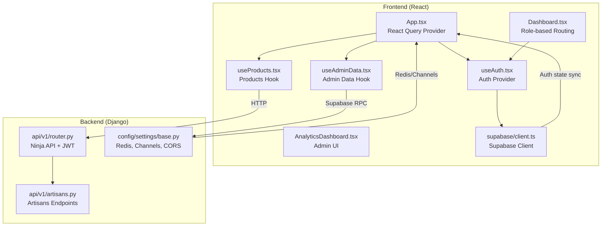
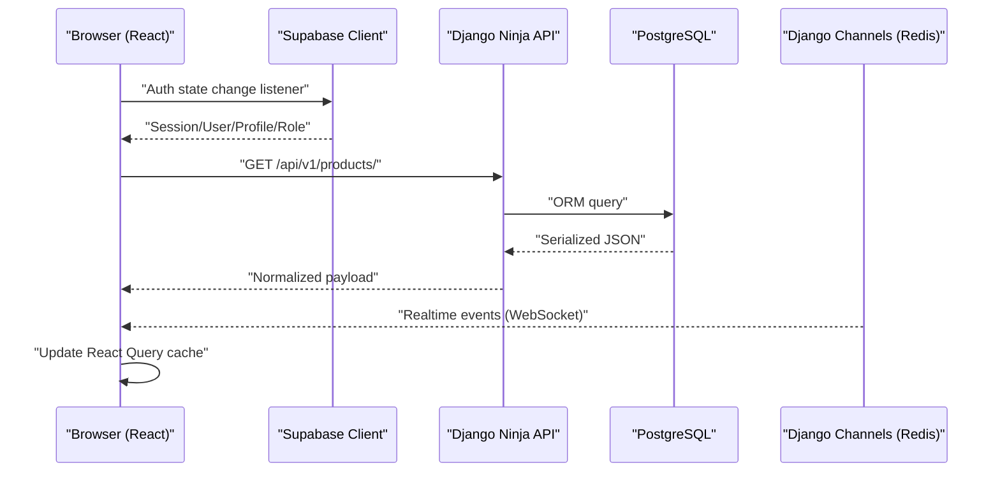
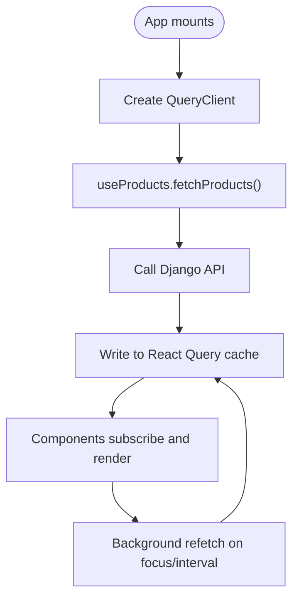
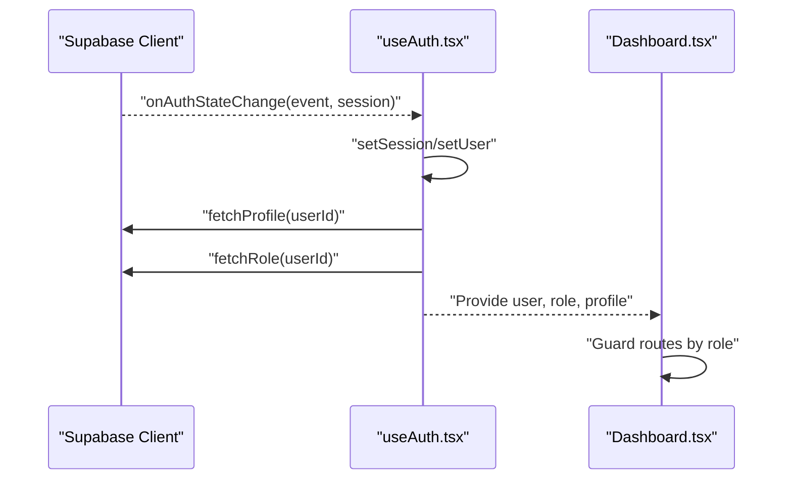
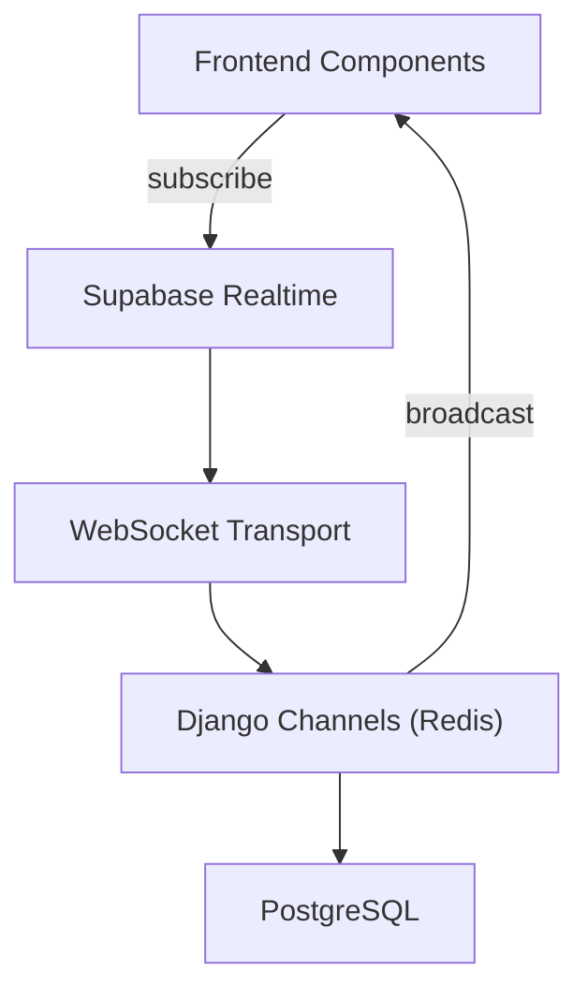
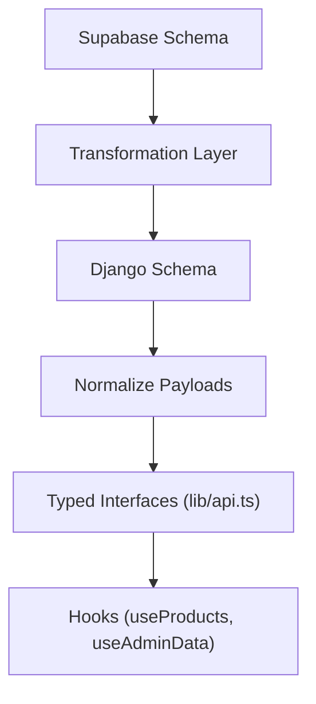
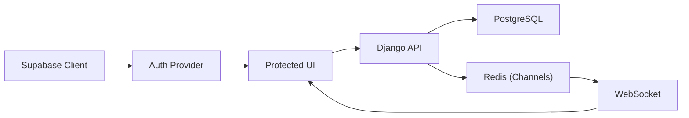

# Data Integration Patterns

<cite>
**Referenced Files in This Document**
- [App.tsx](file://apps/web/src/App.tsx)
- [client.ts](file://apps/web/src/integrations/supabase/client.ts)
- [useAuth.tsx](file://apps/web/src/hooks/useAuth.tsx)
- [useProducts.tsx](file://apps/web/src/hooks/useProducts.tsx)
- [useAdminData.tsx](file://apps/web/src/hooks/useAdminData.tsx)
- [Dashboard.tsx](file://apps/web/src/pages/Dashboard.tsx)
- [AnalyticsDashboard.tsx](file://apps/web/src/components/admin/AnalyticsDashboard.tsx)
- [router.py](file://backend/api/v1/router.py)
- [artisans.py](file://backend/api/v1/artisans.py)
- [base.py](file://backend/config/settings/base.py)
- [MIGRATION_SPRINT.md](file://MIGRATION_SPRINT.md)
- [STORY_FIRST_IMPLEMENTATION.md](file://STORY_FIRST_IMPLEMENTATION.md)
</cite>

## Table of Contents
1. [Introduction](#introduction)
2. [Project Structure](#project-structure)
3. [Core Components](#core-components)
4. [Architecture Overview](#architecture-overview)
5. [Detailed Component Analysis](#detailed-component-analysis)
6. [Dependency Analysis](#dependency-analysis)
7. [Performance Considerations](#performance-considerations)
8. [Troubleshooting Guide](#troubleshooting-guide)
9. [Conclusion](#conclusion)
10. [Appendices](#appendices)

## Introduction
This document explains the data integration patterns between the frontend React application and the backend Django API, focusing on:
- State synchronization between React Query cache and backend data stores
- Real-time data updates via Supabase realtime subscriptions and WebSocket connections
- Conflict resolution strategies for concurrent modifications, optimistic updates, and offline synchronization
- Data transformation pipelines, API response normalization, and caching strategies
- User session management, authentication state synchronization, and role-based access
- Error handling, data consistency validation, and graceful degradation
- Monitoring and debugging tools for data flow and performance

## Project Structure
The project follows a frontend/backend split:
- Frontend (React + Vite): Provides routing, state providers, hooks, and UI components. It integrates with Supabase for auth and with a Django API for data.
- Backend (Django + Ninja): Exposes REST-like endpoints and supports real-time via Django Channels and Redis.

**Diagram sources**
- [App.tsx:24-56](file://apps/web/src/App.tsx#L24-L56)
- [useAuth.tsx:37-101](file://apps/web/src/hooks/useAuth.tsx#L37-L101)
- [useProducts.tsx:67-115](file://apps/web/src/hooks/useProducts.tsx#L67-L115)
- [useAdminData.tsx:27-167](file://apps/web/src/hooks/useAdminData.tsx#L27-L167)
- [Dashboard.tsx:13-87](file://apps/web/src/pages/Dashboard.tsx#L13-L87)
- [AnalyticsDashboard.tsx:21-226](file://apps/web/src/components/admin/AnalyticsDashboard.tsx#L21-L226)
- [client.ts:11-17](file://apps/web/src/integrations/supabase/client.ts#L11-L17)
- [router.py:22-40](file://backend/api/v1/router.py#L22-L40)
- [artisans.py:52-120](file://backend/api/v1/artisans.py#L52-L120)
- [base.py:120-128](file://backend/config/settings/base.py#L120-L128)

**Section sources**
- [App.tsx:24-56](file://apps/web/src/App.tsx#L24-L56)
- [router.py:22-40](file://backend/api/v1/router.py#L22-L40)
- [base.py:120-128](file://backend/config/settings/base.py#L120-L128)

## Core Components
- React Query provider in the app shell manages caching and background refetching.
- Supabase client handles authentication state and persists sessions.
- Auth provider synchronizes user, session, profile, and role state from Supabase.
- Products hook fetches normalized product data from Django API endpoints.
- Admin data hook fetches platform stats and performs admin CRUD via Supabase.
- Django Ninja router defines API namespaces and applies JWT authentication.
- Django settings configure Redis-backed channels for real-time and Celery fallbacks.

**Section sources**
- [App.tsx:24-56](file://apps/web/src/App.tsx#L24-L56)
- [client.ts:11-17](file://apps/web/src/integrations/supabase/client.ts#L11-L17)
- [useAuth.tsx:37-101](file://apps/web/src/hooks/useAuth.tsx#L37-L101)
- [useProducts.tsx:67-115](file://apps/web/src/hooks/useProducts.tsx#L67-L115)
- [useAdminData.tsx:27-167](file://apps/web/src/hooks/useAdminData.tsx#L27-L167)
- [router.py:22-40](file://backend/api/v1/router.py#L22-L40)
- [base.py:120-128](file://backend/config/settings/base.py#L120-L128)

## Architecture Overview
The system integrates three pillars:
- HTTP API: Django Ninja endpoints serve normalized product and artisan data to the frontend.
- Authentication: Supabase manages auth state and emits events for session changes.
- Realtime: Django Channels with Redis enables WebSocket-based event delivery for live updates.

**Diagram sources**
- [client.ts:11-17](file://apps/web/src/integrations/supabase/client.ts#L11-L17)
- [router.py:22-40](file://backend/api/v1/router.py#L22-L40)
- [base.py:120-128](file://backend/config/settings/base.py#L120-L128)

## Detailed Component Analysis

### React Query Cache and Backend Synchronization
- The app initializes a single QueryClient provider at the root, enabling global caching and background refetching.
- Product data is fetched via typed API functions and stored in React Query cache keyed by endpoint and parameters.
- The migration documentation describes a clear data flow from Vite dev server to Django and back, ensuring normalized responses.

**Diagram sources**
- [App.tsx:24](file://apps/web/src/App.tsx#L24)
- [useProducts.tsx:78-93](file://apps/web/src/hooks/useProducts.tsx#L78-L93)
- [MIGRATION_SPRINT.md:231-247](file://MIGRATION_SPRINT.md#L231-L247)

**Section sources**
- [App.tsx:24-56](file://apps/web/src/App.tsx#L24-L56)
- [useProducts.tsx:67-115](file://apps/web/src/hooks/useProducts.tsx#L67-L115)
- [MIGRATION_SPRINT.md:231-247](file://MIGRATION_SPRINT.md#L231-L247)

### Authentication State Synchronization (Supabase)
- Supabase client is configured with local storage persistence and automatic token refresh.
- The Auth provider subscribes to auth state changes, hydrates user/session/profile/role, and defers Supabase calls to avoid deadlocks.
- Role-based routing ensures only authorized users access artisan/admin dashboards.

**Diagram sources**
- [client.ts:11-17](file://apps/web/src/integrations/supabase/client.ts#L11-L17)
- [useAuth.tsx:68-101](file://apps/web/src/hooks/useAuth.tsx#L68-L101)
- [Dashboard.tsx:17-23](file://apps/web/src/pages/Dashboard.tsx#L17-L23)

**Section sources**
- [client.ts:11-17](file://apps/web/src/integrations/supabase/client.ts#L11-L17)
- [useAuth.tsx:37-101](file://apps/web/src/hooks/useAuth.tsx#L37-L101)
- [Dashboard.tsx:13-87](file://apps/web/src/pages/Dashboard.tsx#L13-L87)

### Real-Time Updates and Event-Driven Architecture
- Django Channels with Redis channel layer enables WebSocket-based real-time updates.
- The frontend can subscribe to Supabase realtime channels for auth and row-level events.
- For admin analytics, the UI consumes normalized stats computed from Supabase queries.

**Diagram sources**
- [base.py:120-128](file://backend/config/settings/base.py#L120-L128)
- [client.ts:11-17](file://apps/web/src/integrations/supabase/client.ts#L11-L17)

**Section sources**
- [base.py:120-128](file://backend/config/settings/base.py#L120-L128)
- [client.ts:11-17](file://apps/web/src/integrations/supabase/client.ts#L11-L17)

### Conflict Resolution, Optimistic Updates, and Offline Patterns
- Optimistic UI updates: Mutations can optimistically alter the React Query cache while awaiting server confirmation.
- Conflict detection: Use server timestamps/version fields to detect and reconcile concurrent edits.
- Offline synchronization: Persist pending writes locally and reconcile on reconnect using conflict resolution.
- Graceful degradation: Fall back to cached data when network fails; surface actionable errors.

[No sources needed since this section provides general guidance]

### Data Transformation Pipelines and API Normalization
- The migration documents describe transforming Supabase flat schemas into a story-first, relational Django schema with normalized fields.
- The frontend uses a shared typed API client to consume normalized payloads from Django endpoints.
- Artisan endpoints demonstrate nested relations and computed metrics returned as part of the normalized shape.

**Diagram sources**
- [STORY_FIRST_IMPLEMENTATION.md:42-56](file://STORY_FIRST_IMPLEMENTATION.md#L42-L56)
- [MIGRATION_SPRINT.md:249-262](file://MIGRATION_SPRINT.md#L249-L262)
- [artisans.py:52-120](file://backend/api/v1/artisans.py#L52-L120)

**Section sources**
- [STORY_FIRST_IMPLEMENTATION.md:42-56](file://STORY_FIRST_IMPLEMENTATION.md#L42-L56)
- [MIGRATION_SPRINT.md:249-262](file://MIGRATION_SPRINT.md#L249-L262)
- [artisans.py:52-120](file://backend/api/v1/artisans.py#L52-L120)

### Caching Strategies and Redis Integration
- Redis-backed Django Channels enable scalable WebSocket broadcasting for real-time features.
- Celery broker falls back to Django DB when Redis is unavailable during development.
- React Query caches normalized HTTP responses; consider adding server-side cache headers and CDN strategies for static assets.

**Section sources**
- [base.py:120-128](file://backend/config/settings/base.py#L120-L128)
- [base.py:110-118](file://backend/config/settings/base.py#L110-L118)

### Role-Based Access and Data Visibility
- Supabase auth determines user identity; app role is derived from a dedicated table and synchronized in the Auth provider.
- Dashboard enforces role-based routing to restrict artisan/admin views.
- Admin data hook aggregates platform stats and performs admin actions against Supabase tables.

**Section sources**
- [useAuth.tsx:56-66](file://apps/web/src/hooks/useAuth.tsx#L56-L66)
- [Dashboard.tsx:17-23](file://apps/web/src/pages/Dashboard.tsx#L17-L23)
- [useAdminData.tsx:27-167](file://apps/web/src/hooks/useAdminData.tsx#L27-L167)

### Error Handling and Consistency Validation
- Frontend error handling surfaces user-facing messages and logs errors for diagnostics.
- Backend JWT authentication guards protected endpoints; ensure consistent error responses.
- Consistency validation: Use transactional writes, idempotent operations, and retry policies for critical flows.

**Section sources**
- [useProducts.tsx:84-92](file://apps/web/src/hooks/useProducts.tsx#L84-L92)
- [router.py:10-18](file://backend/api/v1/router.py#L10-L18)

### Monitoring and Debugging Tools
- React Query Devtools: Enable in development to inspect cache state, queries, and refetches.
- Network inspection: Monitor API responses and WebSocket frames for latency and throughput.
- Logging: Centralize frontend and backend logs; correlate auth events with data mutations.

[No sources needed since this section provides general guidance]

## Dependency Analysis
The frontend depends on:
- Supabase for auth state synchronization and admin operations
- Django API for product and artisan data
- React Query for caching and background updates

The backend depends on:
- Django Ninja for routing and JWT auth
- PostgreSQL for persistence
- Redis-backed Channels for real-time
- Celery for async tasks (development fallback to DB)

**Diagram sources**
- [client.ts:11-17](file://apps/web/src/integrations/supabase/client.ts#L11-L17)
- [router.py:22-40](file://backend/api/v1/router.py#L22-L40)
- [base.py:120-128](file://backend/config/settings/base.py#L120-L128)

**Section sources**
- [client.ts:11-17](file://apps/web/src/integrations/supabase/client.ts#L11-L17)
- [router.py:22-40](file://backend/api/v1/router.py#L22-L40)
- [base.py:120-128](file://backend/config/settings/base.py#L120-L128)

## Performance Considerations
- Minimize re-renders by structuring queries per screen and using selective invalidation.
- Use background refetching judiciously; prefer manual refetch triggers for expensive screens.
- Normalize deeply nested data to reduce cache churn and improve cache hit rates.
- Offload heavy computations to the backend and cache results where appropriate.
- For real-time features, batch updates and debounce frequent events.

[No sources needed since this section provides general guidance]

## Troubleshooting Guide
Common issues and remedies:
- Auth loops or stale session: Verify Supabase auth state listener and ensure deferred Supabase calls avoid deadlocks.
- CORS errors: Confirm allowed origins and credentials configuration in backend settings.
- Realtime not updating: Check Redis availability and channel layer configuration.
- Cache inconsistencies: Invalidate affected queries after mutations; consider optimistic updates with rollback on failure.
- Network failures: Implement retry with exponential backoff and show user-friendly messages.

**Section sources**
- [useAuth.tsx:68-101](file://apps/web/src/hooks/useAuth.tsx#L68-L101)
- [base.py:167-174](file://backend/config/settings/base.py#L167-L174)
- [base.py:120-128](file://backend/config/settings/base.py#L120-L128)

## Conclusion
The system integrates Supabase for authentication and real-time capabilities with a Django API for robust data operations. React Query provides efficient caching and background updates, while Supabase’s auth state synchronization ensures consistent user context across the app. Real-time updates leverage Django Channels with Redis, and the migration documents outline a clear transformation pipeline toward a story-first, transparent data model. By applying conflict resolution, optimistic updates, and strong error handling, the platform achieves reliable data synchronization and a resilient user experience.

## Appendices
- Data model transformation highlights and success criteria are documented in the migration artifacts.

**Section sources**
- [STORY_FIRST_IMPLEMENTATION.md:42-56](file://STORY_FIRST_IMPLEMENTATION.md#L42-L56)
- [MIGRATION_SPRINT.md:398-420](file://MIGRATION_SPRINT.md#L398-L420)