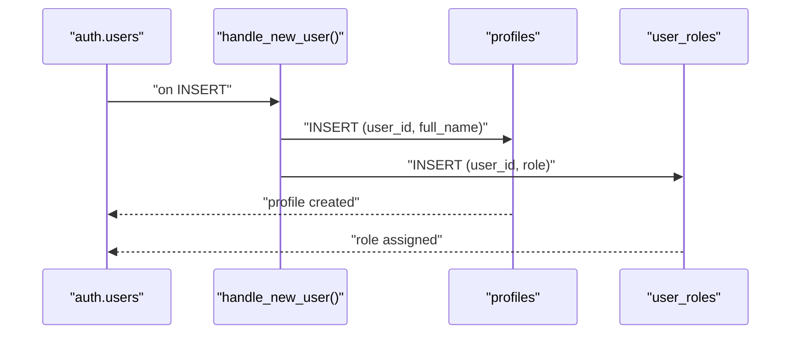
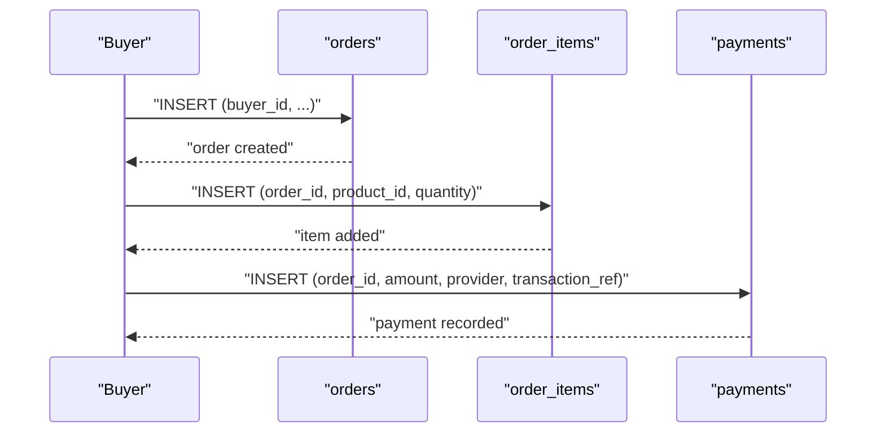
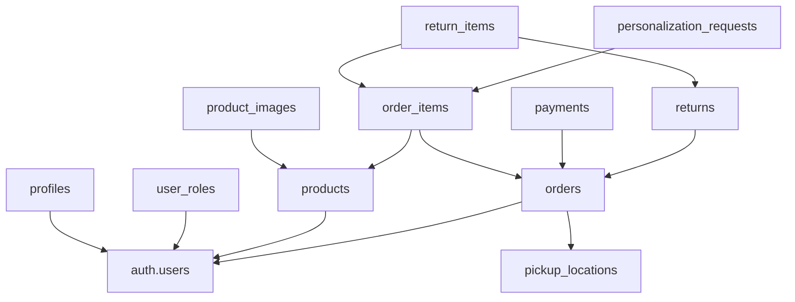

# Database Design

<cite>
**Referenced Files in This Document**
- [config.toml](file://supabase/config.toml)
- [20251231095959_3473bebe-42ab-4109-8633-54732ebf1eaf.sql](file://supabase/migrations/20251231095959_3473bebe-42ab-4109-8633-54732ebf1eaf.sql)
- [20260101210119_8814f12d-688f-4774-9ce8-6ce5f9fd0bba.sql](file://supabase/migrations/20260101210119_8814f12d-688f-4774-9ce8-6ce5f9fd0bba.sql)
- [20260101211534_d1ce3159-d630-4859-8ee8-6361241b244c.sql](file://supabase/migrations/20260101211534_d1ce3159-d630-4859-8ee8-6361241b244c.sql)
- [20260103085459_7948cea8-ed91-44d2-882d-43b3ec3c3fa4.sql](file://supabase/migrations/20260103085459_7948cea8-ed91-44d2-882d-43b3ec3c3fa4.sql)
- [20260104173154_8858732d-0e5c-45cd-afaf-c177dfa5487a.sql](file://supabase/migrations/20260104173154_8858732d-0e5c-45cd-afaf-c177dfa5487a.sql)
- [20260107224910_0b6f10e2-c8bb-49bb-ba91-d7b9b48cd27c.sql](file://supabase/migrations/20260107224910_0b6f10e2-c8bb-49bb-ba91-d7b9b48cd27c.sql)
- [20260109095251_6889a1b9-3b1c-4b8f-9535-f3ef095414de.sql](file://supabase/migrations/20260109095251_6889a1b9-3b1c-4b8f-9535-f3ef095414de.sql)
- [20260110082525_e26cf9e4-1e19-414d-9316-27ada8493a53.sql](file://supabase/migrations/20260110082525_e26cf9e4-1e19-414d-9316-27ada8493a53.sql)
- [20260110084208_19f31e38-2062-4a6a-a516-e5b9de4e3510.sql](file://supabase/migrations/20260110084208_19f31e38-2062-4a6a-a516-e5b9de4e3510.sql)
- [20260121122109_0b1cb36d-aa4e-4dd7-a125-c453bc87fffe.sql](file://supabase/migrations/20260121122109_0b1cb36d-aa4e-4dd7-a125-c453bc87fffe.sql)
- [20260301183140_74b1e32e-ded4-4234-9c49-76542f291b2d.sql](file://supabase/migrations/20260301183140_74b1e32e-ded4-4234-9c49-76542f291b2d.sql)
- [20260301185835_24e7e596-6ffe-4991-964c-74e173d7213e.sql](file://supabase/migrations/20260301185835_24e7e596-6ffe-4991-964c-74e173d7213e.sql)
- [20260307151135_abb92613-d0a4-4ab6-8384-d241b138020b.sql](file://supabase/migrations/20260307151135_abb92613-d0a4-4ab6-8384-d241b138020b.sql)
- [20260312151001_0ad1fffe-4364-4902-9212-6c6e1aeb1f08.sql](file://supabase/migrations/20260312151001_0ad1fffe-4364-4902-9212-6c6e1aeb1f08.sql)
- [20260312151243_54077459-7217-4c42-a35e-67af66d898f3.sql](file://supabase/migrations/20260312151243_54077459-7217-4c42-a35e-67af66d898f3.sql)
- [models.py](file://backend/apps/artisans/models.py)
- [models.py](file://backend/apps/products/models.py)
- [models.py](file://backend/apps/orders/models.py)
- [models.py](file://backend/apps/gifting/models.py)
</cite>

## Table of Contents
1. [Introduction](#introduction)
2. [Project Structure](#project-structure)
3. [Core Components](#core-components)
4. [Architecture Overview](#architecture-overview)
5. [Detailed Component Analysis](#detailed-component-analysis)
6. [Dependency Analysis](#dependency-analysis)
7. [Performance Considerations](#performance-considerations)
8. [Troubleshooting Guide](#troubleshooting-guide)
9. [Conclusion](#conclusion)
10. [Appendices](#appendices)

## Introduction
This document describes the Empindu PostgreSQL schema and Supabase-based data model. It covers entity relationships among artisans, products, orders, payments, returns, pickup locations, personalization requests, and corporate gifting. It documents primary keys, foreign keys, referential integrity constraints, UUID-based identifiers, audit timestamps, unique constraints, Row Level Security (RLS) policies, and the migration-driven schema evolution strategy. It also outlines indexing strategies, performance considerations, and data validation enforced at the database level.

## Project Structure
The database design is implemented via Supabase migrations under the supabase/migrations directory. Django ORM models in the backend define higher-level business entities and relationships, which inform the database schema and RLS policies. Supabase configuration controls function verification flags for serverless functions.

```mermaid
graph TB
subgraph "Supabase Migrations"
M1["20251231095959_3473bebe...sql"]
M2["20260101210119_8814f12d...sql"]
M3["20260101211534_d1ce3159...sql"]
M4["20260103085459_7948cea8...sql"]
M5["20260104173154_8858732d...sql"]
M6["20260107224910_0b6f10e2...sql"]
M7["20260109095251_6889a1b9...sql"]
M8["20260110082525_e26cf9e4...sql"]
M9["20260110084208_19f31e38...sql"]
M10["20260121122109_0b1cb36d...sql"]
M11["20260301183140_74b1e32e...sql"]
M12["20260301185835_24e7e596...sql"]
M13["20260307151135_abb92613...sql"]
M14["20260312151001_0ad1fffe...sql"]
M15["20260312151243_54077459...sql"]
end
subgraph "Backend Models"
A["backend/apps/artisans/models.py"]
P["backend/apps/products/models.py"]
O["backend/apps/orders/models.py"]
G["backend/apps/gifting/models.py"]
end
M1 --> A
M2 --> P
M3 --> P
M4 --> O
M5 --> O
M6 --> O
M7 --> O
M8 --> O
M9 --> O
M10 --> A
M11 --> G
M12 --> G
M13 --> G
M14 --> G
M15 --> G
```



**Diagram sources**
- [20251231095959_3473bebe-42ab-4109-8633-54732ebf1eaf.sql:1-140](file://supabase/migrations/20251231095959_3473bebe-42ab-4109-8633-54732ebf1eaf.sql#L1-L140)
- [20260101210119_8814f12d-688f-4774-9ce8-6ce5f9fd0bba.sql:1-118](file://supabase/migrations/20260101210119_8814f12d-688f-4774-9ce8-6ce5f9fd0bba.sql#L1-L118)
- [20260101211534_d1ce3159-d630-4859-8ee8-6361241b244c.sql:1-31](file://supabase/migrations/20260101211534_d1ce3159-d630-4859-8ee8-6361241b244c.sql#L1-L31)
- [20260103085459_7948cea8-ed91-44d2-882d-43b3ec3c3fa4.sql:1-53](file://supabase/migrations/20260103085459_7948cea8-ed91-44d2-882d-43b3ec3c3fa4.sql#L1-L53)
- [20260104173154_8858732d-0e5c-45cd-afaf-c177dfa5487a.sql:1-22](file://supabase/migrations/20260104173154_8858732d-0e5c-45cd-afaf-c177dfa5487a.sql#L1-L22)
- [20260107224910_0b6f10e2-c8bb-49bb-ba91-d7b9b48cd27c.sql:1-235](file://supabase/migrations/20260107224910_0b6f10e2-c8bb-49bb-ba91-d7b9b48cd27c.sql#L1-L235)
- [20260109095251_6889a1b9-3b1c-4b8f-9535-f3ef095414de.sql:1-7](file://supabase/migrations/20260109095251_6889a1b9-3b1c-4b8f-9535-f3ef095414de.sql#L1-L7)
- [20260110082525_e26cf9e4-1e19-414d-9316-27ada8493a53.sql:1-25](file://supabase/migrations/20260110082525_e26cf9e4-1e19-414d-9316-27ada8493a53.sql#L1-L25)
- [20260110084208_19f31e38-2062-4a6a-a516-e5b9de4e3510.sql:1-45](file://supabase/migrations/20260110084208_19f31e38-2062-4a6a-a516-e5b9de4e3510.sql#L1-L45)
- [20260121122109_0b1cb36d-aa4e-4dd7-a125-c453bc87fffe.sql:1-36](file://supabase/migrations/20260121122109_0b1cb36d-aa4e-4dd7-a125-c453bc87fffe.sql#L1-L36)
- [20260301183140_74b1e32e-ded4-4234-9c49-76542f291b2d.sql:1-120](file://supabase/migrations/20260301183140_74b1e32e-ded4-4234-9c49-76542f291b2d.sql#L1-L120)
- [20260301185835_24e7e596-6ffe-4991-964c-74e173d7213e.sql:1-120](file://supabase/migrations/20260301185835_24e7e596-6ffe-4991-964c-74e173d7213e.sql#L1-L120)
- [20260307151135_abb92613-d0a4-4ab6-8384-d241b138020b.sql:1-120](file://supabase/migrations/20260307151135_abb92613-d0a4-4ab6-8384-d241b138020b.sql#L1-L120)
- [20260312151001_0ad1fffe-4364-4902-9212-6c6e1aeb1f08.sql:1-120](file://supabase/migrations/20260312151001_0ad1fffe-4364-4902-9212-6c6e1aeb1f08.sql#L1-L120)
- [20260312151243_54077459-7217-4c42-a35e-67af66d898f3.sql:1-120](file://supabase/migrations/20260312151243_54077459-7217-4c42-a35e-67af66d898f3.sql#L1-L120)
- [models.py:1-170](file://backend/apps/artisans/models.py#L1-L170)
- [models.py:1-153](file://backend/apps/products/models.py#L1-L153)
- [models.py:1-122](file://backend/apps/orders/models.py#L1-L122)
- [models.py:1-67](file://backend/apps/gifting/models.py#L1-L67)

**Section sources**
- [20251231095959_3473bebe-42ab-4109-8633-54732ebf1eaf.sql:1-140](file://supabase/migrations/20251231095959_3473bebe-42ab-4109-8633-54732ebf1eaf.sql#L1-L140)
- [20260101210119_8814f12d-688f-4774-9ce8-6ce5f9fd0bba.sql:1-118](file://supabase/migrations/20260101210119_8814f12d-688f-4774-9ce8-6ce5f9fd0bba.sql#L1-L118)
- [20260101211534_d1ce3159-d630-4859-8ee8-6361241b244c.sql:1-31](file://supabase/migrations/20260101211534_d1ce3159-d630-4859-8ee8-6361241b244c.sql#L1-L31)
- [20260103085459_7948cea8-ed91-44d2-882d-43b3ec3c3fa4.sql:1-53](file://supabase/migrations/20260103085459_7948cea8-ed91-44d2-882d-43b3ec3c3fa4.sql#L1-L53)
- [20260104173154_8858732d-0e5c-45cd-afaf-c177dfa5487a.sql:1-22](file://supabase/migrations/20260104173154_8858732d-0e5c-45cd-afaf-c177dfa5487a.sql#L1-L22)
- [20260107224910_0b6f10e2-c8bb-49bb-ba91-d7b9b48cd27c.sql:1-235](file://supabase/migrations/20260107224910_0b6f10e2-c8bb-49bb-ba91-d7b9b48cd27c.sql#L1-L235)
- [20260110084208_19f31e38-2062-4a6a-a516-e5b9de4e3510.sql:1-45](file://supabase/migrations/20260110084208_19f31e38-2062-4a6a-a516-e5b9de4e3510.sql#L1-L45)
- [20260121122109_0b1cb36d-aa4e-4dd7-a125-c453bc87fffe.sql:1-36](file://supabase/migrations/20260121122109_0b1cb36d-aa4e-4dd7-a125-c453bc87fffe.sql#L1-L36)
- [models.py:1-170](file://backend/apps/artisans/models.py#L1-L170)
- [models.py:1-153](file://backend/apps/products/models.py#L1-L153)
- [models.py:1-122](file://backend/apps/orders/models.py#L1-L122)
- [models.py:1-67](file://backend/apps/gifting/models.py#L1-L67)

## Core Components
This section summarizes the core database entities and their primary attributes, focusing on the Supabase-managed tables and Django-backed models that shape the schema.

- Profiles and Roles
  - profiles: UUID primary key, user_id references auth.users, unique constraint on user_id, role membership tracked in user_roles, RLS enabled.
  - user_roles: composite unique(user_id, role), app_role enum type.
- Products and Images
  - products: UUID primary key, artisan_id references auth.users, price and stock validated via CHECK, RLS policies restrict access by role and ownership.
  - product_images: UUID primary key, product_id foreign key cascade delete, display ordering.
- Orders and Items
  - orders: UUID primary key, buyer_id, order_status enum, delivery_method and pickup_location_id, RLS policies for buyers and admins.
  - order_items: UUID primary key, order_id and product_id foreign keys, quantity and unit_price.
- Payments
  - payments: UUID primary key, order_id foreign key, unique transaction_ref, provider and status fields, RLS policies.
- Returns and Return Items
  - returns: UUID primary key, order_id foreign key, buyer_id, status enum, refund tracking, RLS policies.
  - return_items: UUID primary key, return_id and order_item_id foreign keys, quantity and condition enum.
- Pickup Locations and Personalization Requests
  - pickup_locations: UUID primary key, coordinates, is_active flag, RLS policies.
  - personalization_requests: UUID primary key, order_item_id foreign key, status enum, RLS policies for buyers and artisans.
- Corporate Gifting
  - GiftDetails: personalization for gifts, linked to orders.
  - GiftOrder: bulk/gift order aggregation, status tracking.

Primary keys are universally UUIDs generated by gen_random_uuid(). Audit timestamps created_at and updated_at are present across most tables, with triggers invoking update_updated_at_column() to refresh updated_at on updates.

Unique constraints:
- profiles.user_id is unique.
- payments.transaction_ref is unique.
- products.slug is unique (as defined in Django models).
- user_roles has a unique constraint on (user_id, role).

Foreign keys and referential integrity:
- products.artisan_id → auth.users(id) with CASCADE.
- product_images.product_id → products(id) with CASCADE.
- orders.buyer_id references auth.users(id) (model defines SET_NULL for buyer).
- order_items.order_id → orders(id) with CASCADE.
- order_items.product_id → products(id).
- payments.order_id → orders(id) with CASCADE.
- returns.order_id → orders(id) with CASCADE.
- return_items.return_id → returns(id) with CASCADE.
- return_items.order_item_id → order_items(id) with CASCADE.
- personalization_requests.order_item_id → order_items(id) with CASCADE.
- pickup_locations is standalone; orders optionally references it via pickup_location_id.

Check constraints:
- products.price >= 0 and stock_quantity >= 0.
- order_items.quantity > 0.
- payments.amount >= 0.
- Enum-like CHECK constraints on delivery_method, status enums, and condition.

Row Level Security:
- RLS enabled on all major tables; policies enforce ownership, role-based access (admin, artisan, buyer), and selective visibility.

**Section sources**
- [20251231095959_3473bebe-42ab-4109-8633-54732ebf1eaf.sql:1-140](file://supabase/migrations/20251231095959_3473bebe-42ab-4109-8633-54732ebf1eaf.sql#L1-L140)
- [20260101210119_8814f12d-688f-4774-9ce8-6ce5f9fd0bba.sql:1-118](file://supabase/migrations/20260101210119_8814f12d-688f-4774-9ce8-6ce5f9fd0bba.sql#L1-L118)
- [20260103085459_7948cea8-ed91-44d2-882d-43b3ec3c3fa4.sql:1-53](file://supabase/migrations/20260103085459_7948cea8-ed91-44d2-882d-43b3ec3c3fa4.sql#L1-L53)
- [20260107224910_0b6f10e2-c8bb-49bb-ba91-d7b9b48cd27c.sql:1-235](file://supabase/migrations/20260107224910_0b6f10e2-c8bb-49bb-ba91-d7b9b48cd27c.sql#L1-L235)
- [20260110084208_19f31e38-2062-4a6a-a516-e5b9de4e3510.sql:1-45](file://supabase/migrations/20260110084208_19f31e38-2062-4a6a-a516-e5b9de4e3510.sql#L1-L45)
- [models.py:1-153](file://backend/apps/products/models.py#L1-L153)
- [models.py:1-122](file://backend/apps/orders/models.py#L1-L122)
- [models.py:1-67](file://backend/apps/gifting/models.py#L1-L67)

## Architecture Overview
The database architecture centers on Supabase’s Postgres with RLS for fine-grained access control. Django ORM models define business semantics and relationships that map to the underlying SQL schema. Functions and triggers maintain audit trails and enforce policies.

```mermaid
erDiagram
AUTH_USERS {
uuid id PK
}
PROFILES {
uuid id PK
uuid user_id UK
text full_name
text avatar_url
text phone
text location
text bio
text craft_specialty
smallint years_experience
text portfolio_url
boolean is_verified
timestamptz created_at
timestamptz updated_at
}
USER_ROLES {
uuid id PK
uuid user_id
enum role
timestamptz created_at
}
PRODUCTS {
uuid id PK
uuid artisan_id
text name
text description
numeric price
text category
int stock_quantity
boolean is_available
timestamptz created_at
timestamptz updated_at
}
PRODUCT_IMAGES {
uuid id PK
uuid product_id
text image_url
boolean is_primary
int display_order
timestamptz created_at
}
ORDERS {
uuid id PK
uuid buyer_id
enum status
numeric total_amount
text shipping_address
text shipping_city
text shipping_country
text shipping_postal_code
text payment_method
text notes
text delivery_method
uuid pickup_location_id
timestamptz created_at
timestamptz updated_at
}
ORDER_ITEMS {
uuid id PK
uuid order_id
uuid product_id
int quantity
numeric unit_price
timestamptz created_at
}
PAYMENTS {
uuid id PK
uuid order_id
numeric amount
text provider
text phone_number
text transaction_ref
text status
text customer_name
timestamptz completed_at
timestamptz created_at
timestamptz updated_at
}
PICKUP_LOCATIONS {
uuid id PK
text name
text address
text city
text region
text phone
text operating_hours
boolean is_active
decimal latitude
decimal longitude
timestamptz created_at
timestamptz updated_at
}
PERSONALIZATION_REQUESTS {
uuid id PK
uuid order_item_id
text description
text status
text artisan_response
timestamptz created_at
timestamptz updated_at
}
RETURNS {
uuid id PK
uuid order_id
uuid buyer_id
text reason
text description
text status
numeric refund_amount
text refund_method
text admin_notes
timestamptz pickup_scheduled_at
timestamptz received_at
timestamptz refunded_at
timestamptz created_at
timestamptz updated_at
}
RETURN_ITEMS {
uuid id PK
uuid return_id
uuid order_item_id
int quantity
text condition
text reason
timestamptz created_at
}
GIFT_DETAILS {
uuid id PK
text recipient_name
text recipient_relationship
text occasion
text personal_message
boolean gift_wrap
date scheduled_delivery_date
}
GIFT_ORDER {
uuid id PK
text customer_name
text customer_email
text company
int total_items
numeric total_amount_ugx
text status
text notes
timestamptz created_at
timestamptz updated_at
}
PROFILES }o--|| AUTH_USERS : "references"
USER_ROLES }o--|| AUTH_USERS : "references"
PRODUCTS }o--|| AUTH_USERS : "artisan_id"
PRODUCT_IMAGES }o|--|| PRODUCTS : "product_id"
ORDER_ITEMS }o|--|| ORDERS : "order_id"
ORDER_ITEMS }o|--|| PRODUCTS : "product_id"
PAYMENTS }o|--|| ORDERS : "order_id"
RETURNS }o|--|| ORDERS : "order_id"
RETURN_ITEMS }o|--|| RETURNS : "return_id"
RETURN_ITEMS }o|--|| ORDER_ITEMS : "order_item_id"
PERSONALIZATION_REQUESTS }o|--|| ORDER_ITEMS : "order_item_id"
ORDERS }o|--o{ PICKUP_LOCATIONS : "pickup_location_id"
GIFT_DETAILS ||--o| ORDERS : "order"
GIFT_ORDER ||--o{ ORDERS : "contains"
```

**Diagram sources**
- [20251231095959_3473bebe-42ab-4109-8633-54732ebf1eaf.sql:1-140](file://supabase/migrations/20251231095959_3473bebe-42ab-4109-8633-54732ebf1eaf.sql#L1-L140)
- [20260101210119_8814f12d-688f-4774-9ce8-6ce5f9fd0bba.sql:1-118](file://supabase/migrations/20260101210119_8814f12d-688f-4774-9ce8-6ce5f9fd0bba.sql#L1-L118)
- [20260103085459_7948cea8-ed91-44d2-882d-43b3ec3c3fa4.sql:1-53](file://supabase/migrations/20260103085459_7948cea8-ed91-44d2-882d-43b3ec3c3fa4.sql#L1-L53)
- [20260107224910_0b6f10e2-c8bb-49bb-ba91-d7b9b48cd27c.sql:1-235](file://supabase/migrations/20260107224910_0b6f10e2-c8bb-49bb-ba91-d7b9b48cd27c.sql#L1-L235)
- [20260110084208_19f31e38-2062-4a6a-a516-e5b9de4e3510.sql:1-45](file://supabase/migrations/20260110084208_19f31e38-2062-4a6a-a516-e5b9de4e3510.sql#L1-L45)
- [20260301183140_74b1e32e-ded4-4234-9c49-76542f291b2d.sql:1-120](file://supabase/migrations/20260301183140_74b1e32e-ded4-4234-9c49-76542f291b2d.sql#L1-L120)
- [20260301185835_24e7e596-6ffe-4991-964c-74e173d7213e.sql:1-120](file://supabase/migrations/20260301185835_24e7e596-6ffe-4991-964c-74e173d7213e.sql#L1-L120)
- [20260307151135_abb92613-d0a4-4ab6-8384-d241b138020b.sql:1-120](file://supabase/migrations/20260307151135_abb92613-d0a4-4ab6-8384-d241b138020b.sql#L1-L120)
- [20260312151001_0ad1fffe-4364-4902-9212-6c6e1aeb1f08.sql:1-120](file://supabase/migrations/20260312151001_0ad1fffe-4364-4902-9212-6c6e1aeb1f08.sql#L1-L120)
- [20260312151243_54077459-7217-4c42-a35e-67af66d898f3.sql:1-120](file://supabase/migrations/20260312151243_54077459-7217-4c42-a35e-67af66d898f3.sql#L1-L120)

## Detailed Component Analysis

### Profiles and Roles
- Purpose: Store user profiles and role memberships. Role membership is decoupled from profile data for security and flexibility.
- Keys and Constraints:
  - profiles.id (UUID, PK), user_id (UUID, unique, FK to auth.users.id, ON DELETE CASCADE).
  - user_roles.id (UUID, PK), composite unique(user_id, role), role enum app_role.
- RLS:
  - Profiles: selective access by user or admin; a public_profiles view exposes non-sensitive data.
  - User Roles: selective access by user or admin; admin can manage roles.
- Triggers: update_updated_at_column() on profiles.



**Diagram sources**
- [20251231095959_3473bebe-42ab-4109-8633-54732ebf1eaf.sql:97-126](file://supabase/migrations/20251231095959_3473bebe-42ab-4109-8633-54732ebf1eaf.sql#L97-L126)

**Section sources**
- [20251231095959_3473bebe-42ab-4109-8633-54732ebf1eaf.sql:1-140](file://supabase/migrations/20251231095959_3473bebe-42ab-4109-8633-54732ebf1eaf.sql#L1-L140)

### Products and Product Images
- Purpose: Represent artisan-made products and associated images.
- Keys and Constraints:
  - products.id (UUID, PK), artisan_id (FK to auth.users.id, CASCADE), price and stock_quantity validated.
  - product_images.id (UUID, PK), product_id (FK to products.id, CASCADE), is_primary, display_order.
- RLS:
  - Products: available products visible to all; owners can manage; admins can manage.
  - Product Images: visibility to all; upload/update/delete restricted to artisans owning the product.
- Triggers: update_updated_at_column() on products.

**Section sources**
- [20260101210119_8814f12d-688f-4774-9ce8-6ce5f9fd0bba.sql:1-118](file://supabase/migrations/20260101210119_8814f12d-688f-4774-9ce8-6ce5f9fd0bba.sql#L1-L118)

### Orders, Order Items, and Payments
- Purpose: Track purchase lifecycle, items in orders, and payment records.
- Keys and Constraints:
  - orders.id (UUID, PK), buyer_id (FK to auth.users.id), delivery_method enum, optional pickup_location_id.
  - order_items.id (UUID, PK), order_id and product_id (FKs), quantity > 0.
  - payments.id (UUID, PK), order_id (FK, CASCADE), unique transaction_ref, amount validated.
- RLS:
  - Orders: buyers can view/manage own orders; admins can view/manage all; artisans can view orders containing their products via helper function.
  - Order Items: buyers can view/manage items in their orders; admins can view; artisans can view items for their products.
  - Payments: buyers can view payments linked to their orders; admins can view/update all.
- Triggers: update_updated_at_column() on orders and payments.



**Diagram sources**
- [20260103085459_7948cea8-ed91-44d2-882d-43b3ec3c3fa4.sql:1-53](file://supabase/migrations/20260103085459_7948cea8-ed91-44d2-882d-43b3ec3c3fa4.sql#L1-L53)
- [20260110084208_19f31e38-2062-4a6a-a516-e5b9de4e3510.sql:1-45](file://supabase/migrations/20260110084208_19f31e38-2062-4a6a-a516-e5b9de4e3510.sql#L1-L45)

**Section sources**
- [20260103085459_7948cea8-ed91-44d2-882d-43b3ec3c3fa4.sql:1-53](file://supabase/migrations/20260103085459_7948cea8-ed91-44d2-882d-43b3ec3c3fa4.sql#L1-L53)
- [20260104173154_8858732d-0e5c-45cd-afaf-c177dfa5487a.sql:1-22](file://supabase/migrations/20260104173154_8858732d-0e5c-45cd-afaf-c177dfa5487a.sql#L1-L22)
- [20260110082525_e26cf9e4-1e19-414d-9316-27ada8493a53.sql:1-25](file://supabase/migrations/20260110082525_e26cf9e4-1e19-414d-9316-27ada8493a53.sql#L1-L25)
- [20260110084208_19f31e38-2062-4a6a-a516-e5b9de4e3510.sql:1-45](file://supabase/migrations/20260110084208_19f31e38-2062-4a6a-a516-e5b9de4e3510.sql#L1-L45)

### Returns, Return Items, and Pickup Locations
- Purpose: Manage returns and pickup logistics for orders.
- Keys and Constraints:
  - returns.id (UUID, PK), order_id (FK to orders.id, CASCADE), buyer_id, status enum, refund tracking.
  - return_items.id (UUID, PK), return_id (FK to returns.id, CASCADE), order_item_id (FK), quantity > 0, condition enum.
  - pickup_locations.id (UUID, PK), coordinates, is_active flag.
- RLS:
  - Returns: buyers can view/manage own returns; admins can view/update all.
  - Return Items: buyers can view/manage items in their returns; admins can manage all.
  - Pickup Locations: visible when active; admins can manage all.
- Triggers: update_updated_at_column() on returns and pickup_locations.

**Section sources**
- [20260107224910_0b6f10e2-c8bb-49bb-ba91-d7b9b48cd27c.sql:1-235](file://supabase/migrations/20260107224910_0b6f10e2-c8bb-49bb-ba91-d7b9b48cd27c.sql#L1-L235)

### Personalization Requests
- Purpose: Allow buyers to request product customization; enable artisans to approve/reject.
- Keys and Constraints:
  - personalization_requests.id (UUID, PK), order_item_id (FK to order_items.id, CASCADE), status enum.
- RLS:
  - Buyers can view/create requests for their own order items.
  - Artisans can view/update requests for products they own.
  - Admins can manage all requests.
- Triggers: update_updated_at_column() on personalization_requests.

**Section sources**
- [20260107224910_0b6f10e2-c8bb-49bb-ba91-d7b9b48cd27c.sql:1-235](file://supabase/migrations/20260107224910_0b6f10e2-c8bb-49bb-ba91-d7b9b48cd27c.sql#L1-L235)

### Corporate Gifting
- Purpose: Support bulk/gift orders with personalization.
- Keys and Constraints:
  - GiftDetails: personalization fields, linked to orders.
  - GiftOrder: aggregated gift orders, status tracking.
- RLS:
  - Access controlled via order-level policies; gift details inherit buyer/artisan/admin permissions.

**Section sources**
- [20260301183140_74b1e32e-ded4-4234-9c49-76542f291b2d.sql:1-120](file://supabase/migrations/20260301183140_74b1e32e-ded4-4234-9c49-76542f291b2d.sql#L1-L120)
- [20260301185835_24e7e596-6ffe-4991-964c-74e173d7213e.sql:1-120](file://supabase/migrations/20260301185835_24e7e596-6ffe-4991-964c-74e173d7213e.sql#L1-L120)
- [20260307151135_abb92613-d0a4-4ab6-8384-d241b138020b.sql:1-120](file://supabase/migrations/20260307151135_abb92613-d0a4-4ab6-8384-d241b138020b.sql#L1-L120)
- [20260312151001_0ad1fffe-4364-4902-9212-6c6e1aeb1f08.sql:1-120](file://supabase/migrations/20260312151001_0ad1fffe-4364-4902-9212-6c6e1aeb1f08.sql#L1-L120)
- [20260312151243_54077459-7217-4c42-a35e-67af66d898f3.sql:1-120](file://supabase/migrations/20260312151243_54077459-7217-4c42-a35e-67af66d898f3.sql#L1-L120)

## Dependency Analysis
- Ownership and Permissions:
  - Artisans own products and can manage them; buyers own orders and payments; admins manage all entities.
- Cross-table Dependencies:
  - order_items depends on orders and products.
  - payments depend on orders.
  - returns depend on orders; return_items depend on returns and order_items.
  - personalization_requests depends on order_items.
  - orders optionally reference pickup_locations.
- Security Dependencies:
  - has_role() and is_artisan_for_order() functions encapsulate permission checks to prevent RLS recursion and simplify policies.



**Diagram sources**
- [20251231095959_3473bebe-42ab-4109-8633-54732ebf1eaf.sql:1-140](file://supabase/migrations/20251231095959_3473bebe-42ab-4109-8633-54732ebf1eaf.sql#L1-L140)
- [20260101210119_8814f12d-688f-4774-9ce8-6ce5f9fd0bba.sql:1-118](file://supabase/migrations/20260101210119_8814f12d-688f-4774-9ce8-6ce5f9fd0bba.sql#L1-L118)
- [20260103085459_7948cea8-ed91-44d2-882d-43b3ec3c3fa4.sql:1-53](file://supabase/migrations/20260103085459_7948cea8-ed91-44d2-882d-43b3ec3c3fa4.sql#L1-L53)
- [20260107224910_0b6f10e2-c8bb-49bb-ba91-d7b9b48cd27c.sql:1-235](file://supabase/migrations/20260107224910_0b6f10e2-c8bb-49bb-ba91-d7b9b48cd27c.sql#L1-L235)
- [20260110084208_19f31e38-2062-4a6a-a516-e5b9de4e3510.sql:1-45](file://supabase/migrations/20260110084208_19f31e38-2062-4a6a-a516-e5b9de4e3510.sql#L1-L45)

**Section sources**
- [20251231095959_3473bebe-42ab-4109-8633-54732ebf1eaf.sql:1-140](file://supabase/migrations/20251231095959_3473bebe-42ab-4109-8633-54732ebf1eaf.sql#L1-L140)
- [20260101210119_8814f12d-688f-4774-9ce8-6ce5f9fd0bba.sql:1-118](file://supabase/migrations/20260101210119_8814f12d-688f-4774-9ce8-6ce5f9fd0bba.sql#L1-L118)
- [20260103085459_7948cea8-ed91-44d2-882d-43b3ec3c3fa4.sql:1-53](file://supabase/migrations/20260103085459_7948cea8-ed91-44d2-882d-43b3ec3c3fa4.sql#L1-L53)
- [20260107224910_0b6f10e2-c8bb-49bb-ba91-d7b9b48cd27c.sql:1-235](file://supabase/migrations/20260107224910_0b6f10e2-c8bb-49bb-ba91-d7b9b48cd27c.sql#L1-L235)
- [20260110084208_19f31e38-2062-4a6a-a516-e5b9de4e3510.sql:1-45](file://supabase/migrations/20260110084208_19f31e38-2062-4a6a-a516-e5b9de4e3510.sql#L1-L45)

## Performance Considerations
- Indexing Strategy:
  - Primary keys are UUIDs; ensure appropriate indexing for frequently filtered columns:
    - orders.buyer_id, orders.status, orders.created_at.
    - order_items.order_id, order_items.product_id.
    - payments.order_id, payments.transaction_ref.
    - returns.order_id, return_items.order_item_id.
    - personalization_requests.order_item_id.
    - pickup_locations.is_active, pickup_locations.city.
  - Consider partial indexes for active pickup locations and available products.
- Triggers:
  - update_updated_at_column() triggers are lightweight but should be reviewed for write-heavy workloads.
- Storage:
  - product-images bucket policies ensure safe uploads; consider signed URLs for secure retrieval.
- Query Patterns:
  - Denormalized snapshots (e.g., frozen prices in orders) reduce joins during reporting.
  - Use views (e.g., public_profiles) to limit PII exposure and improve query performance for public listings.

[No sources needed since this section provides general guidance]

## Troubleshooting Guide
Common issues and resolutions:
- RLS Policy Conflicts:
  - Use helper functions (e.g., has_role, is_artisan_for_order) to avoid RLS recursion and simplify policies.
- Permission Denied Errors:
  - Verify user roles via user_roles and confirm auth.uid() matches expected ownership.
- Unique Constraint Violations:
  - profiles.user_id, payments.transaction_ref, and product.slug (Django) uniqueness must be respected.
- Cascade Deletions:
  - Confirm CASCADE behavior for dependent entities (order_items, payments, returns, return_items, personalization_requests).
- Admin Assignment:
  - Ensure admin role assignment is idempotent; previous migrations demonstrate safe deletion and reassignment.

**Section sources**
- [20251231095959_3473bebe-42ab-4109-8633-54732ebf1eaf.sql:35-95](file://supabase/migrations/20251231095959_3473bebe-42ab-4109-8633-54732ebf1eaf.sql#L35-L95)
- [20260110082525_e26cf9e4-1e19-414d-9316-27ada8493a53.sql:4-19](file://supabase/migrations/20260110082525_e26cf9e4-1e19-414d-9316-27ada8493a53.sql#L4-L19)
- [20260109095251_6889a1b9-3b1c-4b8f-9535-f3ef095414de.sql:1-7](file://supabase/migrations/20260109095251_6889a1b9-3b1c-4b8f-9535-f3ef095414de.sql#L1-L7)

## Conclusion
Empindu’s database design leverages UUIDs, comprehensive RLS policies, and a structured migration strategy to support a multi-role marketplace. The schema enforces referential integrity, validates business-critical data, and maintains audit trails through triggers. The separation of concerns between Django models and Supabase migrations ensures clarity and maintainability. The documented policies and constraints provide a robust foundation for scaling while preserving data integrity and user privacy.

[No sources needed since this section summarizes without analyzing specific files]

## Appendices

### Schema Evolution and Migration Strategy
- Version Control:
  - Migrations are timestamp-prefixed UUID files ensuring deterministic ordering and conflict avoidance.
- Rollback and Idempotency:
  - Use DROP statements for policies and ALTER TABLE IF NOT EXISTS for additive changes.
- Admin Initialization:
  - Assign admin role via a dedicated migration that deletes existing entries and inserts the admin role safely.

**Section sources**
- [20260109095251_6889a1b9-3b1c-4b8f-9535-f3ef095414de.sql:1-7](file://supabase/migrations/20260109095251_6889a1b9-3b1c-4b8f-9535-f3ef095414de.sql#L1-L7)

### Database Security Model Summary
- Roles:
  - admin, artisan, buyer via app_role enum and user_roles table.
- Policies:
  - Ownership-based access for profiles, products, orders, payments, returns, personalization requests.
  - Admin overrides for management tasks.
- Views:
  - public_profiles exposes non-sensitive data to anonymous and authenticated users.

**Section sources**
- [20251231095959_3473bebe-42ab-4109-8633-54732ebf1eaf.sql:31-95](file://supabase/migrations/20251231095959_3473bebe-42ab-4109-8633-54732ebf1eaf.sql#L31-L95)
- [20260121122109_0b1cb36d-aa4e-4dd7-a125-c453bc87fffe.sql:1-36](file://supabase/migrations/20260121122109_0b1cb36d-aa4e-4dd7-a125-c453bc87fffe.sql#L1-L36)

### Backend Model Mapping
- Artisans:
  - CraftTradition, Certification, Artisan (with multilingual fields and experience).
- Products:
  - Product (with story, pricing splits, inventory), ProductPhoto, ProvenanceRecord.
- Orders:
  - Order (with status machine, payment method, shipping, gift flag).
- Gifting:
  - GiftDetails, GiftOrder.

**Section sources**
- [models.py:1-170](file://backend/apps/artisans/models.py#L1-L170)
- [models.py:1-153](file://backend/apps/products/models.py#L1-L153)
- [models.py:1-122](file://backend/apps/orders/models.py#L1-L122)
- [models.py:1-67](file://backend/apps/gifting/models.py#L1-L67)