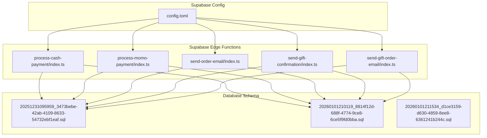
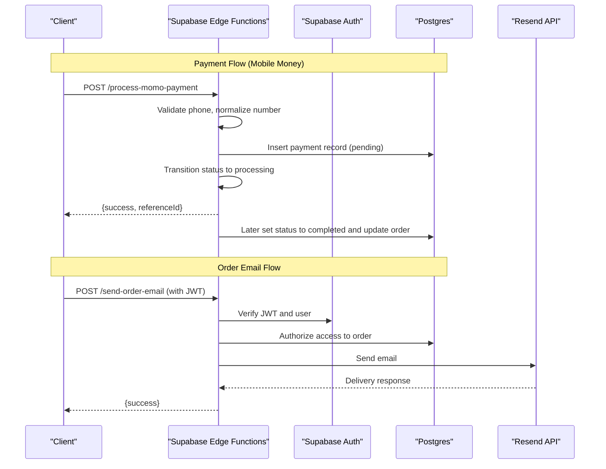
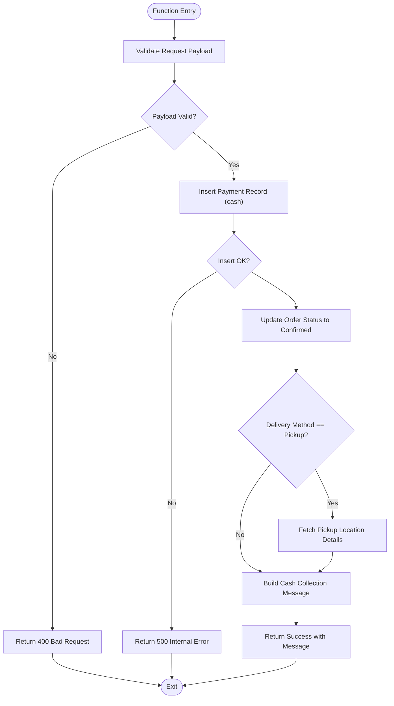
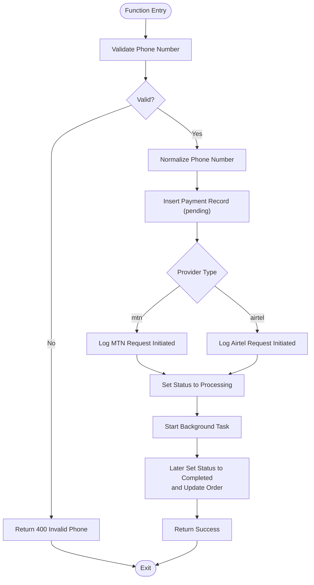
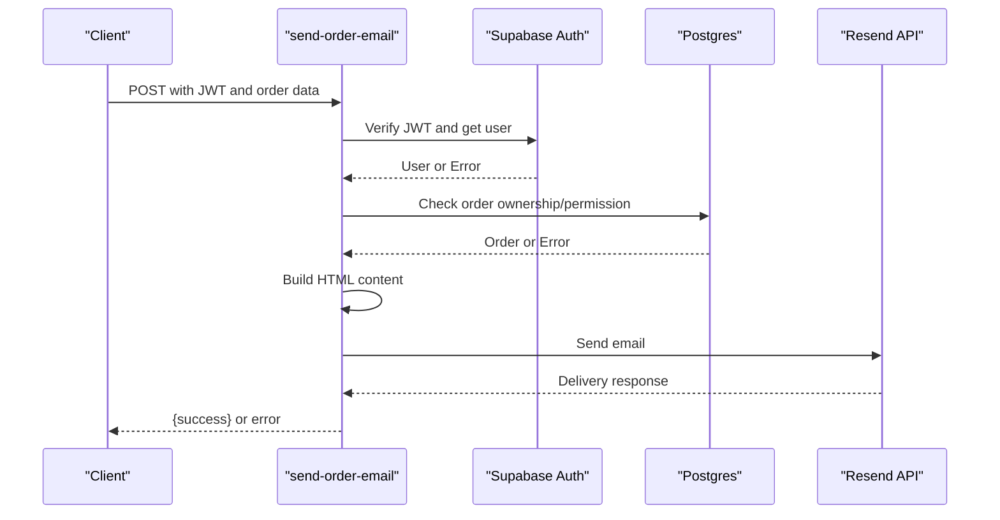
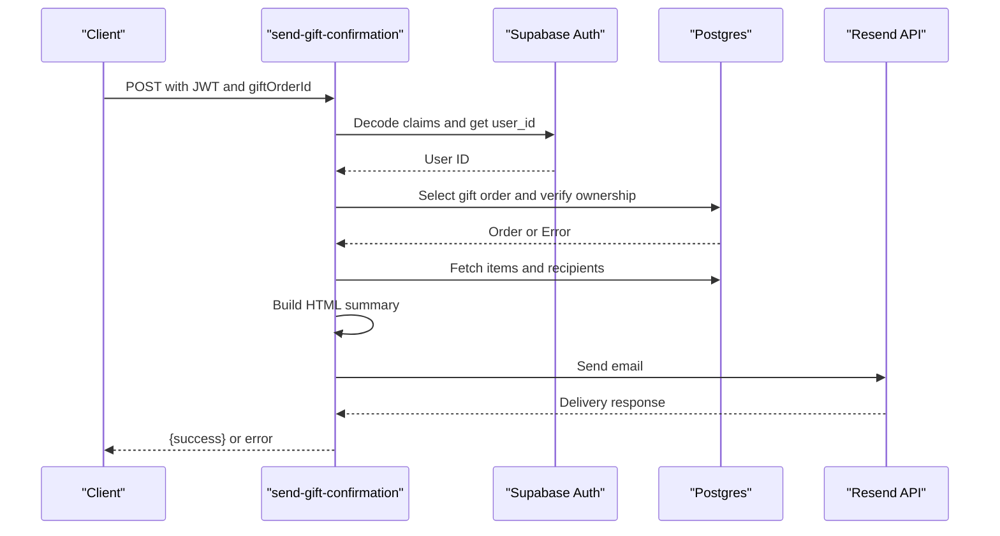
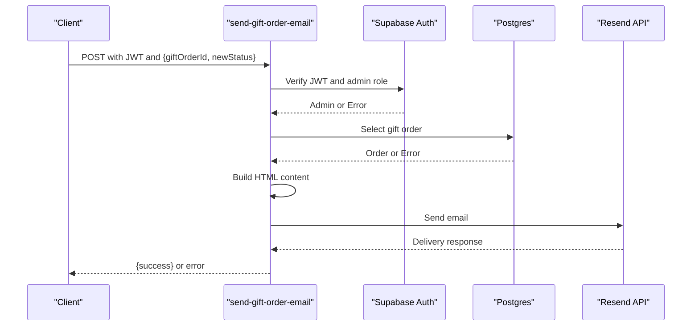
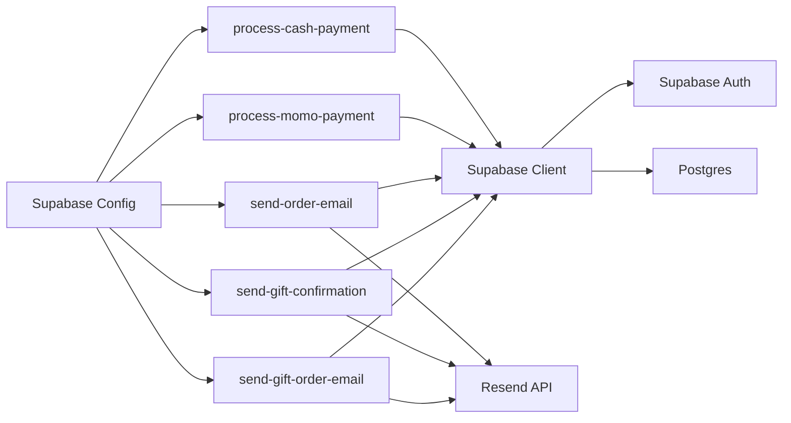
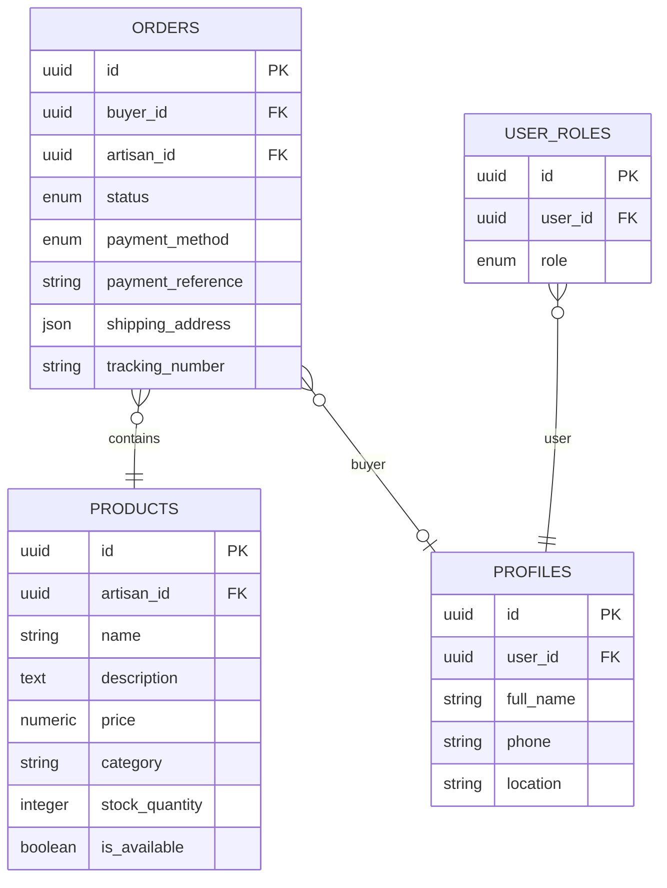

# Serverless Functions

<cite>
**Referenced Files in This Document**
- [process-cash-payment/index.ts](file://supabase/functions/process-cash-payment/index.ts)
- [process-momo-payment/index.ts](file://supabase/functions/process-momo-payment/index.ts)
- [send-order-email/index.ts](file://supabase/functions/send-order-email/index.ts)
- [send-gift-confirmation/index.ts](file://supabase/functions/send-gift-confirmation/index.ts)
- [send-gift-order-email/index.ts](file://supabase/functions/send-gift-order-email/index.ts)
- [config.toml](file://supabase/config.toml)
- [20251231095959_3473bebe-42ab-4109-8633-54732ebf1eaf.sql](file://supabase/migrations/20251231095959_3473bebe-42ab-4109-8633-54732ebf1eaf.sql)
- [20260101210119_8814f12d-688f-4774-9ce8-6ce5f9fd0bba.sql](file://supabase/migrations/20260101210119_8814f12d-688f-4774-9ce8-6ce5f9fd0bba.sql)
- [20260101211534_d1ce3159-d630-4859-8ee8-6361241b244c.sql](file://supabase/migrations/20260101211534_d1ce3159-d630-4859-8ee8-6361241b244c.sql)
- [orders/models.py](file://backend/apps/orders/models.py)
- [gifting/models.py](file://backend/apps/gifting/models.py)
- [router.py](file://backend/api/v1/router.py)
- [urls.py](file://backend/api/v1/urls.py)
- [orders.py](file://backend/api/v1/orders.py)
- [gifting.py](file://backend/api/v1/gifting.py)
</cite>

## Table of Contents
1. [Introduction](#introduction)
2. [Project Structure](#project-structure)
3. [Core Components](#core-components)
4. [Architecture Overview](#architecture-overview)
5. [Detailed Component Analysis](#detailed-component-analysis)
6. [Dependency Analysis](#dependency-analysis)
7. [Performance Considerations](#performance-considerations)
8. [Troubleshooting Guide](#troubleshooting-guide)
9. [Conclusion](#conclusion)
10. [Appendices](#appendices)

## Introduction
This document explains the Supabase Edge Functions architecture powering payment processing and email notifications in Empindu. It covers deployment strategy, runtime environment configuration, dependency management, security patterns, and operational practices. It also documents the payment flows for cash on delivery and mobile money (MTN MoMo), outlines the planned cryptocurrency integration, and details the email notification system for order confirmations, gift orders, and administrative alerts.

## Project Structure
Supabase Edge Functions are located under the Supabase configuration directory. Each function is a standalone Deno script with its own entry point. Supabase configuration controls function-level settings such as JWT verification behavior. Database schema and Row Level Security (RLS) policies are defined via SQL migrations.

**Diagram sources**
- [config.toml:1-17](file://supabase/config.toml#L1-L17)
- [process-cash-payment/index.ts:1-114](file://supabase/functions/process-cash-payment/index.ts#L1-L114)
- [process-momo-payment/index.ts:1-151](file://supabase/functions/process-momo-payment/index.ts#L1-L151)
- [send-order-email/index.ts:1-284](file://supabase/functions/send-order-email/index.ts#L1-L284)
- [send-gift-confirmation/index.ts:1-219](file://supabase/functions/send-gift-confirmation/index.ts#L1-L219)
- [send-gift-order-email/index.ts:1-217](file://supabase/functions/send-gift-order-email/index.ts#L1-L217)
- [20251231095959_3473bebe-42ab-4109-8633-54732ebf1eaf.sql:1-140](file://supabase/migrations/20251231095959_3473bebe-42ab-4109-8633-54732ebf1eaf.sql#L1-L140)
- [20260101210119_8814f12d-688f-4774-9ce8-6ce5f9fd0bba.sql:1-118](file://supabase/migrations/20260101210119_8814f12d-688f-4774-9ce8-6ce5f9fd0bba.sql#L1-L118)
- [20260101211534_d1ce3159-d630-4859-8ee8-6361241b244c.sql:1-31](file://supabase/migrations/20260101211534_d1ce3159-d630-4859-8ee8-6361241b244c.sql#L1-L31)

**Section sources**
- [config.toml:1-17](file://supabase/config.toml#L1-L17)

## Core Components
- Cash Payment Processor: Handles cash on delivery orders, generates transaction references, persists payment records, updates order status, and optionally resolves pickup location details.
- Mobile Money Processor: Validates phone numbers, normalizes to international format, creates payment records, simulates provider requests, and transitions payment/order statuses asynchronously.
- Order Email Sender: Sends order confirmation, status update, and shipped notifications via Resend, enforcing JWT-based authentication and authorization checks against orders.
- Gift Confirmation Sender: Sends a submission confirmation email for corporate gift orders and enforces ownership checks.
- Gift Order Email Sender: Sends administrative gift order status update emails and enforces admin-only access.

Security and environment management:
- Environment variables are accessed via Deno environment variables for Supabase URLs and Resend API keys.
- JWT verification is disabled for functions in the Supabase configuration, requiring explicit in-function authentication and authorization checks.

**Section sources**
- [process-cash-payment/index.ts:19-113](file://supabase/functions/process-cash-payment/index.ts#L19-L113)
- [process-momo-payment/index.ts:17-150](file://supabase/functions/process-momo-payment/index.ts#L17-L150)
- [send-order-email/index.ts:165-283](file://supabase/functions/send-order-email/index.ts#L165-L283)
- [send-gift-confirmation/index.ts:15-218](file://supabase/functions/send-gift-confirmation/index.ts#L15-L218)
- [send-gift-order-email/index.ts:109-216](file://supabase/functions/send-gift-order-email/index.ts#L109-L216)
- [config.toml:3-16](file://supabase/config.toml#L3-L16)

## Architecture Overview
The serverless functions integrate with Supabase Auth and Postgres, and with external services for payment simulation and email delivery. Payments are persisted to the database; emails are sent via Resend.

**Diagram sources**
- [process-momo-payment/index.ts:17-150](file://supabase/functions/process-momo-payment/index.ts#L17-L150)
- [send-order-email/index.ts:165-283](file://supabase/functions/send-order-email/index.ts#L165-L283)

## Detailed Component Analysis

### Cash Payment Processing
Purpose:
- Create a cash payment record for cash-on-delivery orders.
- Generate a unique transaction reference.
- Update order status to confirmed.
- Optionally resolve pickup location details for pickup orders.

Key behaviors:
- Validates request payload and logs processing.
- Inserts payment record with provider set to cash and status set appropriately.
- Updates order status to confirmed.
- Builds a human-friendly message indicating cash amount and collection instructions.

**Diagram sources**
- [process-cash-payment/index.ts:19-113](file://supabase/functions/process-cash-payment/index.ts#L19-L113)

**Section sources**
- [process-cash-payment/index.ts:19-113](file://supabase/functions/process-cash-payment/index.ts#L19-L113)

### Mobile Money Payment Processing (MTN MoMo)
Purpose:
- Validate phone number format for Uganda.
- Normalize phone number to international format.
- Create a payment record with provider set to mtn or airtel.
- Simulate provider request initiation and asynchronous completion.

Key behaviors:
- Validates phone number using a strict regex.
- Normalizes phone number to international format.
- Inserts payment record with pending status.
- Logs provider-specific actions and transitions to processing.
- Runs a background task to later set status to completed and update order.

**Diagram sources**
- [process-momo-payment/index.ts:17-150](file://supabase/functions/process-momo-payment/index.ts#L17-L150)

**Section sources**
- [process-momo-payment/index.ts:17-150](file://supabase/functions/process-momo-payment/index.ts#L17-L150)

### Order Email Notification
Purpose:
- Send order-related emails (confirmation, status update, shipped) via Resend.
- Enforce JWT-based authentication and authorization to ensure only buyers or admins can trigger emails.

Key behaviors:
- Verifies Authorization header and decodes user identity.
- Retrieves order and verifies user is owner or admin.
- Builds HTML email content based on type and order details.
- Sends email via Resend API and returns success or error.

**Diagram sources**
- [send-order-email/index.ts:165-283](file://supabase/functions/send-order-email/index.ts#L165-L283)

**Section sources**
- [send-order-email/index.ts:165-283](file://supabase/functions/send-order-email/index.ts#L165-L283)

### Gift Confirmation Email
Purpose:
- Send a confirmation email to the corporate gift contact upon order submission.
- Enforce ownership checks using JWT claims.

Key behaviors:
- Extracts user ID from JWT claims.
- Fetches gift order and validates ownership.
- Builds a detailed HTML summary including items and recipients.
- Sends email via Resend API.

**Diagram sources**
- [send-gift-confirmation/index.ts:15-218](file://supabase/functions/send-gift-confirmation/index.ts#L15-L218)

**Section sources**
- [send-gift-confirmation/index.ts:15-218](file://supabase/functions/send-gift-confirmation/index.ts#L15-L218)

### Gift Order Email (Administrative)
Purpose:
- Send administrative gift order status update emails to contacts.
- Enforce admin-only access.

Key behaviors:
- Verifies Authorization header and admin role via RPC.
- Fetches gift order details.
- Builds HTML content based on status mapping.
- Sends email via Resend API.

**Diagram sources**
- [send-gift-order-email/index.ts:109-216](file://supabase/functions/send-gift-order-email/index.ts#L109-L216)

**Section sources**
- [send-gift-order-email/index.ts:109-216](file://supabase/functions/send-gift-order-email/index.ts#L109-L216)

## Dependency Analysis
Runtime and external dependencies:
- Deno standard HTTP server for function runtime.
- Supabase client SDK for interacting with Supabase Auth and Postgres.
- Resend API for sending transactional emails.
- Supabase environment variables for service keys and URLs.

Internal dependencies:
- Shared Supabase configuration controls JWT verification per function.
- Database migrations define roles, policies, and tables used by functions.

**Diagram sources**
- [process-cash-payment/index.ts:1-3](file://supabase/functions/process-cash-payment/index.ts#L1-L3)
- [process-momo-payment/index.ts:1-3](file://supabase/functions/process-momo-payment/index.ts#L1-L3)
- [send-order-email/index.ts:1-2](file://supabase/functions/send-order-email/index.ts#L1-L2)
- [send-gift-confirmation/index.ts:1-2](file://supabase/functions/send-gift-confirmation/index.ts#L1-L2)
- [send-gift-order-email/index.ts:1-2](file://supabase/functions/send-gift-order-email/index.ts#L1-L2)
- [config.toml:1-17](file://supabase/config.toml#L1-L17)

**Section sources**
- [config.toml:1-17](file://supabase/config.toml#L1-L17)

## Performance Considerations
- Asynchronous background tasks: The mobile money processor starts a background task to finalize payment and order status without blocking the HTTP response. This improves latency for initiating payments.
- Minimal synchronous work: Functions perform only essential database writes and email sends synchronously; heavy operations are deferred.
- Logging: Functions log key events and errors to aid performance diagnostics and incident response.
- CORS handling: Preflight OPTIONS requests are handled efficiently to avoid unnecessary processing.

[No sources needed since this section provides general guidance]

## Troubleshooting Guide
Common issues and resolutions:
- Authentication failures:
  - Missing or invalid Authorization header in email functions leads to 401 responses.
  - Ensure clients pass a valid JWT in the Authorization header.
- Authorization failures:
  - Order email function checks ownership or admin role; 403 responses indicate insufficient permissions.
  - Gift confirmation and gift order email functions enforce ownership/admin checks.
- Payment initiation errors:
  - Phone number validation failures return 400 with an error message.
  - Payment record insertion failures return 500; inspect database logs.
- Email delivery failures:
  - Resend API errors are logged and returned; verify API key and network connectivity.
- CORS issues:
  - Ensure client requests include appropriate headers; functions return CORS headers for preflight.

Operational tips:
- Monitor function logs for error messages and stack traces.
- Validate environment variables are set in Supabase.
- Test endpoints with minimal payloads to isolate issues.

**Section sources**
- [send-order-email/index.ts:172-241](file://supabase/functions/send-order-email/index.ts#L172-L241)
- [send-gift-confirmation/index.ts:20-74](file://supabase/functions/send-gift-confirmation/index.ts#L20-L74)
- [send-gift-order-email/index.ts:109-147](file://supabase/functions/send-gift-order-email/index.ts#L109-L147)
- [process-momo-payment/index.ts:33-40](file://supabase/functions/process-momo-payment/index.ts#L33-L40)
- [send-order-email/index.ts:263-266](file://supabase/functions/send-order-email/index.ts#L263-L266)

## Conclusion
The Supabase Edge Functions architecture provides a secure, modular foundation for payment processing and email notifications. Functions encapsulate distinct responsibilities, interact with Supabase Auth and Postgres, and delegate email delivery to Resend. Security is enforced through explicit JWT verification and authorization checks, while asynchronous processing optimizes responsiveness. The documented flows and troubleshooting guidance enable reliable operation and future enhancements such as integrating live mobile money APIs and expanding cryptocurrency support.

[No sources needed since this section summarizes without analyzing specific files]

## Appendices

### Database and Role Models
- Order model defines lifecycle states and payment method choices, including mobile money and crypto options.
- Gift order model captures corporate gifting specifics and status tracking.

**Section sources**
- [orders/models.py:10-122](file://backend/apps/orders/models.py#L10-L122)
- [gifting/models.py:39-67](file://backend/apps/gifting/models.py#L39-L67)

### API Routing Context
- Django-based API routing exists for backend endpoints; Supabase Edge Functions are the serverless execution layer for payment and email logic.

**Section sources**
- [router.py:1-40](file://backend/api/v1/router.py#L1-L40)
- [urls.py:1-10](file://backend/api/v1/urls.py#L1-L10)
- [orders.py:1-18](file://backend/api/v1/orders.py#L1-L18)
- [gifting.py:1-13](file://backend/api/v1/gifting.py#L1-L13)

### Security and Environment Management
- Supabase configuration disables JWT verification at the platform level for functions; functions implement their own verification and authorization.
- Environment variables include Supabase URLs and Resend API key.

**Section sources**
- [config.toml:3-16](file://supabase/config.toml#L3-L16)
- [send-order-email/index.ts:4](file://supabase/functions/send-order-email/index.ts#L4)
- [send-gift-confirmation/index.ts:4](file://supabase/functions/send-gift-confirmation/index.ts#L4)
- [send-gift-order-email/index.ts:4](file://supabase/functions/send-gift-order-email/index.ts#L4)

### Data Model Relationships (Selected)

**Diagram sources**
- [orders/models.py:10-122](file://backend/apps/orders/models.py#L10-L122)
- [20251231095959_3473bebe-42ab-4109-8633-54732ebf1eaf.sql:1-140](file://supabase/migrations/20251231095959_3473bebe-42ab-4109-8633-54732ebf1eaf.sql#L1-L140)
- [20260101210119_8814f12d-688f-4774-9ce8-6ce5f9fd0bba.sql:1-118](file://supabase/migrations/20260101210119_8814f12d-688f-4774-9ce8-6ce5f9fd0bba.sql#L1-L118)