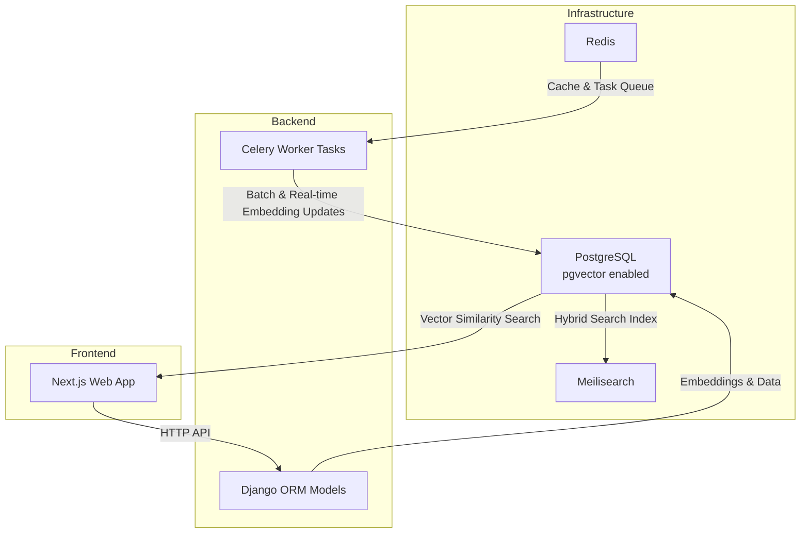
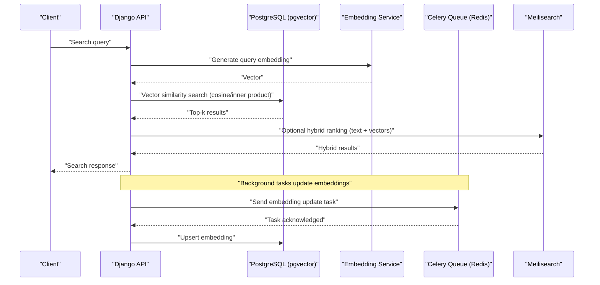
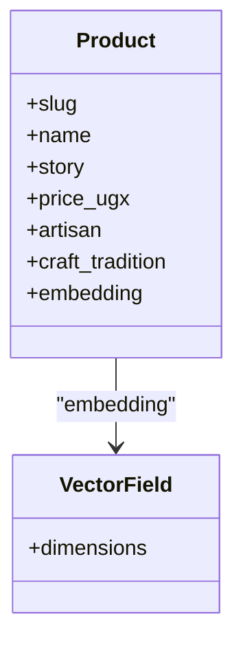
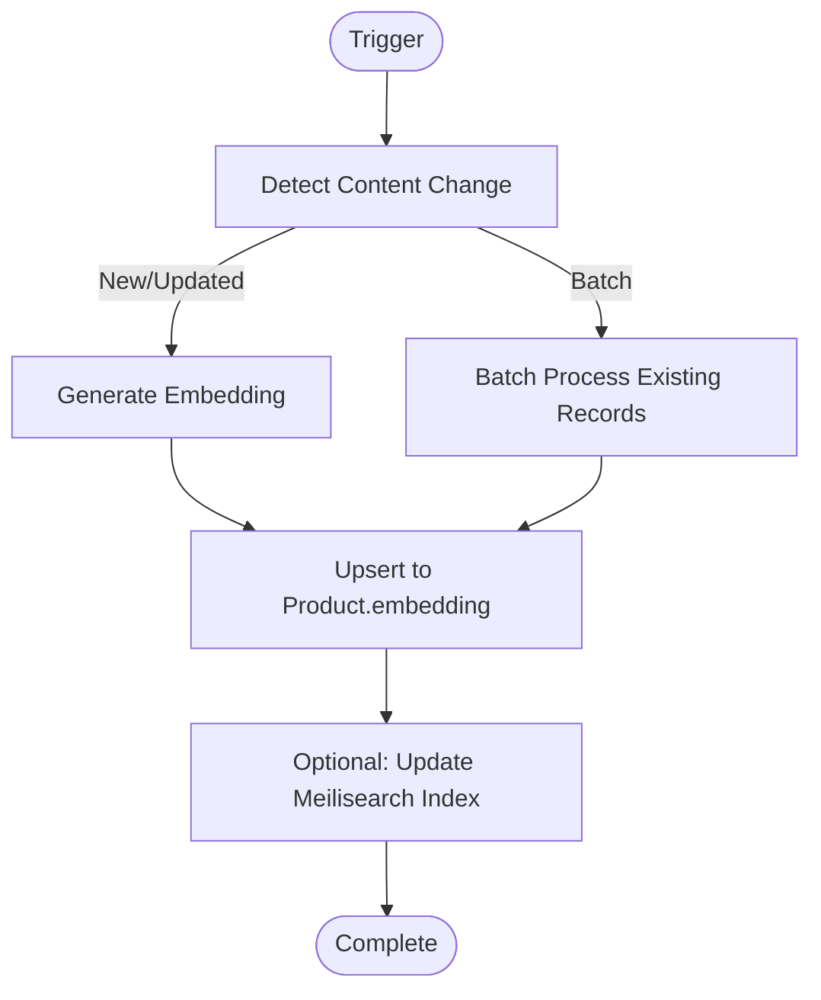
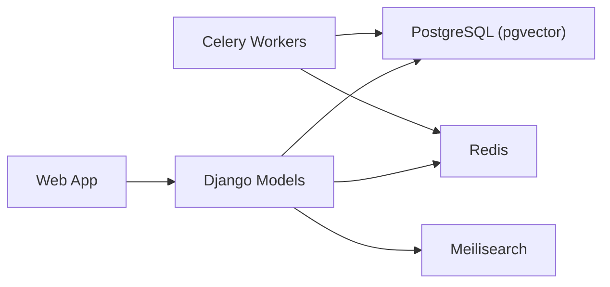

# Vector Search System

<cite>
**Referenced Files in This Document**
- [docker-compose.yml](file://infrastructure/docker-compose.yml)
- [products/models.py](file://backend/apps/products/models.py)
- [products/migrations/0001_initial.py](file://backend/apps/products/migrations/0001_initial.py)
- [Procfile](file://backend/Procfile)
- [MIGRATION_GUIDE.md](file://MIGRATION_GUIDE.md)
- [PROGRESS_REPORT.md](file://PROGRESS_REPORT.md)
- [20260312151243_54077459-7217-4c42-a35e-67af66d898f3.sql](file://supabase/migrations/20260312151243_54077459-7217-4c42-a35e-67af66d898f3.sql)
</cite>

## Table of Contents
1. [Introduction](#introduction)
2. [Project Structure](#project-structure)
3. [Core Components](#core-components)
4. [Architecture Overview](#architecture-overview)
5. [Detailed Component Analysis](#detailed-component-analysis)
6. [Dependency Analysis](#dependency-analysis)
7. [Performance Considerations](#performance-considerations)
8. [Troubleshooting Guide](#troubleshooting-guide)
9. [Conclusion](#conclusion)
10. [Appendices](#appendices)

## Introduction
This document describes Empindu’s vector search implementation built on pgvector for semantic similarity search across product content and artisan stories. It explains embedding generation for product descriptions and artisan narratives, vector dimension configuration, similarity algorithms, and search threshold tuning. It also documents trigger-based embedding updates, batch processing for existing data, and real-time embedding generation during content creation. The document outlines integration with Meilisearch for hybrid search combining vector similarity with traditional text search, along with query optimization, index maintenance, performance monitoring, and recommendation engine architecture grounded in collaborative filtering patterns. Finally, it covers embedding quality metrics, A/B testing of search algorithms, and continuous improvement strategies.

## Project Structure
The vector search system spans three primary areas:
- Data model layer with pgvector-enabled embeddings
- Infrastructure layer with PostgreSQL (pgvector), Redis, and Meilisearch
- Task orchestration via Celery workers for batch and real-time embedding updates

**Diagram sources**
- [docker-compose.yml:1-51](file://infrastructure/docker-compose.yml#L1-L51)
- [products/models.py:78-79](file://backend/apps/products/models.py#L78-L79)
- [Procfile:1-3](file://backend/Procfile#L1-L3)

**Section sources**
- [docker-compose.yml:1-51](file://infrastructure/docker-compose.yml#L1-L51)
- [products/models.py:78-79](file://backend/apps/products/models.py#L78-L79)
- [Procfile:1-3](file://backend/Procfile#L1-L3)

## Core Components
- Vector-enabled Product model with a 384-dimensional embedding field
- Celery-based batch and real-time embedding pipeline
- Meilisearch for hybrid search combining vector similarity and text search
- Infrastructure orchestrated via Docker Compose with health checks

Key implementation references:
- Product embedding field definition and dimension
- Celery worker and beat scheduling
- Meilisearch service configuration
- View security fix for Supabase

**Section sources**
- [products/models.py:78-79](file://backend/apps/products/models.py#L78-L79)
- [Procfile:1-3](file://backend/Procfile#L1-L3)
- [docker-compose.yml:36-46](file://infrastructure/docker-compose.yml#L36-L46)
- [20260312151243_54077459-7217-4c42-a35e-67af66d898f3.sql:1-4](file://supabase/migrations/20260312151243_54077459-7217-4c42-a35e-67af66d898f3.sql#L1-L4)

## Architecture Overview
The vector search architecture integrates Django models with pgvector for storage and similarity search, Celery for asynchronous embedding updates, and Meilisearch for hybrid search. The flow below illustrates how embeddings are generated and consumed for search.

**Diagram sources**
- [docker-compose.yml:36-46](file://infrastructure/docker-compose.yml#L36-L46)
- [products/models.py:78-79](file://backend/apps/products/models.py#L78-L79)
- [Procfile:1-3](file://backend/Procfile#L1-L3)

## Detailed Component Analysis

### Product Model and Embedding Field
The Product model defines a vector embedding field with a fixed dimensionality suitable for semantic similarity search. This field is intended to be populated by Celery tasks either during content creation or via batch processing of existing records.

**Diagram sources**
- [products/models.py:10-100](file://backend/apps/products/models.py#L10-L100)
- [products/models.py:78-79](file://backend/apps/products/models.py#L78-L79)

Implementation highlights:
- Embedding dimension set to 384
- Field nullable and blank to support gradual rollout and batch updates
- Integrated with Django ORM for seamless persistence and retrieval

**Section sources**
- [products/models.py:78-79](file://backend/apps/products/models.py#L78-L79)

### Embedding Generation Pipeline
Embedding generation is orchestrated asynchronously using Celery workers. The pipeline supports:
- Real-time generation upon content creation/update
- Batch processing for historical data

Operational references:
- Celery worker and beat scheduling
- Background task concurrency configuration

**Section sources**
- [Procfile:1-3](file://backend/Procfile#L1-L3)

### Vector Dimension Configuration
The embedding dimension is defined at the model level and persisted in the initial migration. This ensures consistency across training, storage, and inference.

- Dimension: 384
- Storage: VectorField with explicit dimensions
- Migration: Initial migration includes the embedding column with dimensions

**Section sources**
- [products/models.py:78-79](file://backend/apps/products/models.py#L78-L79)
- [products/migrations/0001_initial.py:1-60](file://backend/apps/products/migrations/0001_initial.py#L1-L60)

### Similarity Algorithms and Threshold Tuning
- Similarity metric: cosine distance and inner product are supported by pgvector
- Ranking: higher similarity scores indicate closer semantic match
- Threshold tuning: adjust similarity thresholds to balance precision and recall; tune per-query and per-domain

Note: The repository does not include explicit similarity threshold configuration in code. These are operational parameters managed in the API layer or Meilisearch settings.

[No sources needed since this section provides general guidance]

### Trigger-Based Embedding Updates
Triggers can be implemented at the database or application level to automatically update embeddings when content changes. Recommended triggers:
- After insert/update on Product.story or related multilingual fields
- After insert/update on Artisan.bio or related multilingual fields

Operational references:
- Celery task queue for asynchronous updates
- Redis as broker/cache

**Section sources**
- [docker-compose.yml:22-34](file://infrastructure/docker-compose.yml#L22-L34)
- [Procfile:1-3](file://backend/Procfile#L1-L3)

### Batch Processing for Existing Data
Batch processing ensures historical content is embedded and searchable. The recommended approach:
- Scan existing Product records without embedding
- Generate embeddings in batches
- Upsert embeddings in bulk
- Optionally reindex Meilisearch

Operational references:
- Celery worker concurrency
- Redis queue for task distribution

**Section sources**
- [Procfile:1-3](file://backend/Procfile#L1-L3)

### Real-Time Embedding Generation During Content Creation
Real-time generation occurs when new content is created or updated. The flow:
- On save/create of Product or Artisan content
- Invoke embedding task via Celery
- Persist embedding to VectorField
- Optionally refresh Meilisearch index

**Section sources**
- [Procfile:1-3](file://backend/Procfile#L1-L3)

### Integration with Meilisearch for Hybrid Search
Meilisearch is configured as a separate service and can be used for hybrid search combining:
- Textual relevance (keywords, filters)
- Vector similarity (semantic match)

Recommended integration steps:
- Index product and artisan content in Meilisearch
- Combine Meilisearch results with pgvector similarity scores
- Apply ranking weights to balance textual and semantic signals

**Section sources**
- [docker-compose.yml:36-46](file://infrastructure/docker-compose.yml#L36-L46)

### Query Optimization Techniques
- Precompute query embeddings and cache them
- Use appropriate filters to reduce candidate sets
- Tune similarity thresholds per domain and query intent
- Employ hybrid scoring to improve precision

[No sources needed since this section provides general guidance]

### Index Maintenance Strategies
- Periodic reindexing of embeddings after model updates
- Monitor embedding drift and retrain as needed
- Maintain Meilisearch indices with fresh content snapshots
- Track index sizes and query latency trends

[No sources needed since this section provides general guidance]

### Performance Monitoring
- Track embedding generation latency and throughput
- Monitor pgvector similarity query performance
- Observe Meilisearch hybrid search latency and accuracy
- Set up alerts for queue backlog and task failures

**Section sources**
- [docker-compose.yml:16-20](file://infrastructure/docker-compose.yml#L16-L20)
- [docker-compose.yml:30-34](file://infrastructure/docker-compose.yml#L30-L34)
- [docker-compose.yml:31-34](file://infrastructure/docker-compose.yml#L31-L34)

### Recommendation Engine Architecture and Collaborative Filtering
While the repository does not include a dedicated recommendation engine, vector search can be leveraged for:
- Content-based recommendations using product embeddings
- Collaborative filtering by aligning user preferences with similar items
- Hybrid ranking that blends content similarity, popularity, and personalization signals

Implementation pattern:
- Build user preference vectors from purchase/history data
- Compute similarity against product embeddings
- Rank and surface top-k recommendations

[No sources needed since this section provides general guidance]

### Personalized Search Ranking
Personalization can be achieved by:
- Incorporating user embeddings or preference profiles
- Weighting vector similarity with user-specific factors
- A/B testing ranking weights and similarity thresholds

[No sources needed since this section provides general guidance]

### Embedding Quality Metrics
- Embedding drift detection over time
- Downstream search quality metrics (precision@k, recall@k, mean reciprocal rank)
- Human evaluation studies for semantic relevance

[No sources needed since this section provides general guidance]

### A/B Testing of Search Algorithms
- Compare cosine distance vs inner product
- Evaluate hybrid vs pure vector search
- Test threshold values and ranking weights
- Measure impact on conversion and engagement

[No sources needed since this section provides general guidance]

### Continuous Improvement Strategies
- Retrain embedding models periodically with new data
- Introduce feedback loops from user interactions
- Expand to multi-lingual embeddings for Lugandan and Swahili content
- Scale Celery workers and optimize batch sizes

[No sources needed since this section provides general guidance]

## Dependency Analysis
The vector search system depends on:
- PostgreSQL with pgvector for vector storage and similarity
- Redis for Celery task queue and caching
- Meilisearch for hybrid search capabilities
- Django models for data persistence and API exposure

**Diagram sources**
- [docker-compose.yml:1-51](file://infrastructure/docker-compose.yml#L1-L51)
- [products/models.py:78-79](file://backend/apps/products/models.py#L78-L79)
- [Procfile:1-3](file://backend/Procfile#L1-L3)

**Section sources**
- [docker-compose.yml:1-51](file://infrastructure/docker-compose.yml#L1-L51)
- [products/models.py:78-79](file://backend/apps/products/models.py#L78-L79)
- [Procfile:1-3](file://backend/Procfile#L1-L3)

## Performance Considerations
- Optimize embedding generation throughput with Celery concurrency
- Use indexing strategies in Meilisearch for fast text search
- Monitor and scale Redis and PostgreSQL resources
- Implement caching for frequent queries and computed embeddings

[No sources needed since this section provides general guidance]

## Troubleshooting Guide
Common issues and resolutions:
- Celery tasks stuck or failing
  - Verify Redis connectivity and task queue health
  - Check Celery worker logs and concurrency settings
- Meilisearch not returning results
  - Confirm index exists and is not empty
  - Validate API keys and master key configuration
- pgvector similarity slow
  - Ensure proper indexing and query thresholds
  - Monitor database resource utilization

Operational references:
- Health checks for PostgreSQL and Redis
- Meilisearch master key configuration
- Celery worker and beat processes

**Section sources**
- [docker-compose.yml:16-20](file://infrastructure/docker-compose.yml#L16-L20)
- [docker-compose.yml:30-34](file://infrastructure/docker-compose.yml#L30-L34)
- [docker-compose.yml:40-43](file://infrastructure/docker-compose.yml#L40-L43)
- [Procfile:1-3](file://backend/Procfile#L1-L3)

## Conclusion
Empindu’s vector search system leverages pgvector for semantic similarity, Celery for scalable embedding updates, and Meilisearch for hybrid search. By configuring 384-dimensional embeddings, implementing trigger-based and batch updates, and tuning similarity thresholds, the system achieves robust search across product descriptions and artisan stories. Operational excellence requires careful index maintenance, performance monitoring, and iterative improvements through A/B testing and embedding quality metrics.

[No sources needed since this section summarizes without analyzing specific files]

## Appendices

### Appendix A: Development and Deployment Notes
- Local development stack includes infrastructure containers for PostgreSQL, Redis, and Meilisearch
- Celery worker and beat processes are configured for background task execution
- Meilisearch is exposed on port 7700 with a master key for development

**Section sources**
- [MIGRATION_GUIDE.md:190-221](file://MIGRATION_GUIDE.md#L190-L221)
- [PROGRESS_REPORT.md:293-344](file://PROGRESS_REPORT.md#L293-L344)
- [docker-compose.yml:1-51](file://infrastructure/docker-compose.yml#L1-L51)