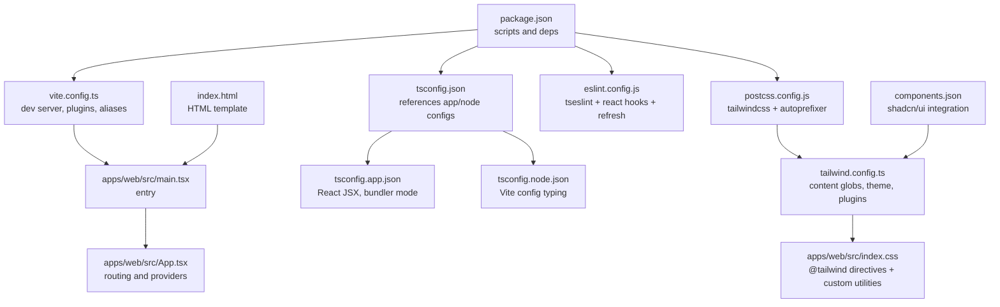
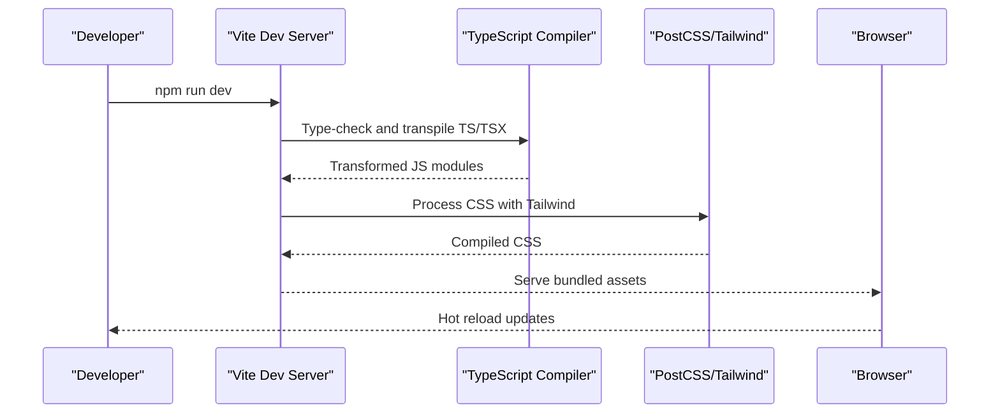
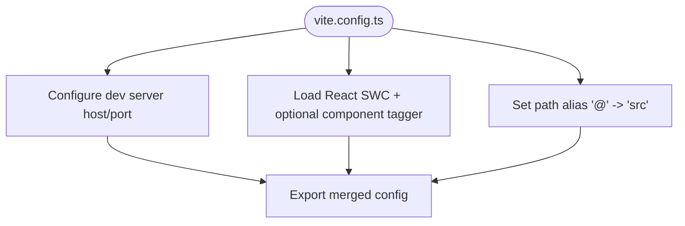
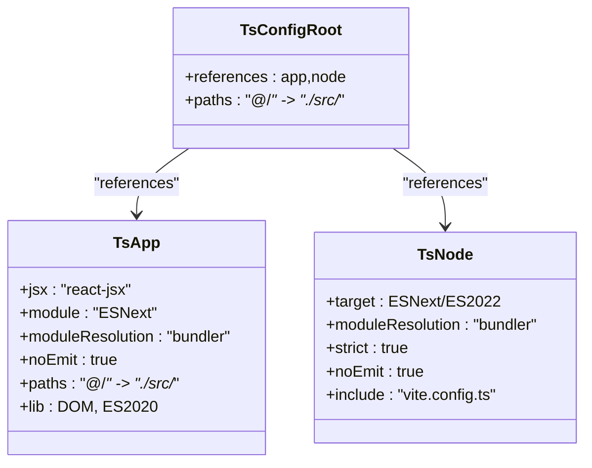
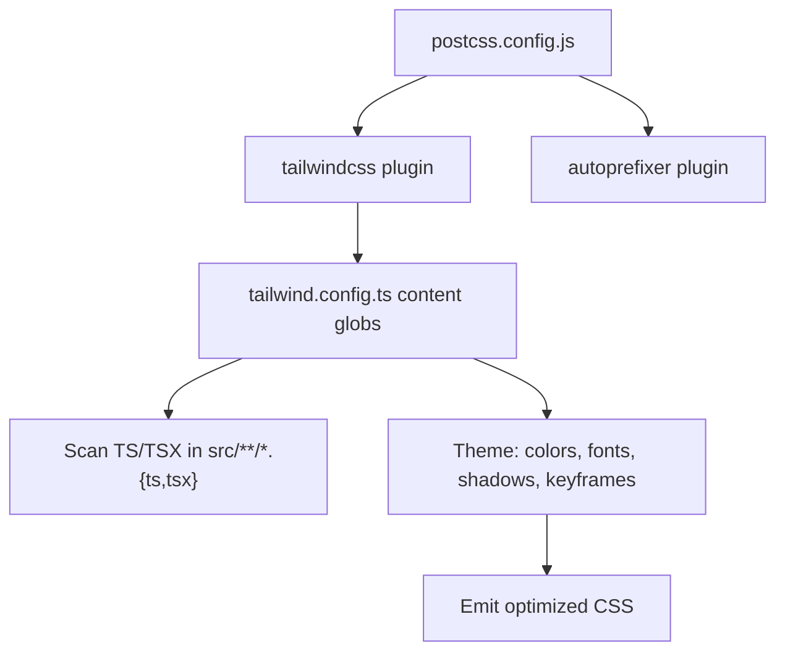
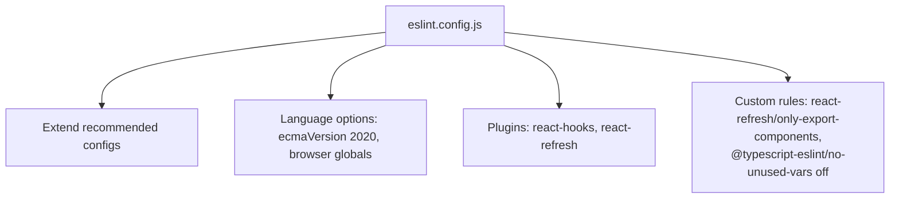
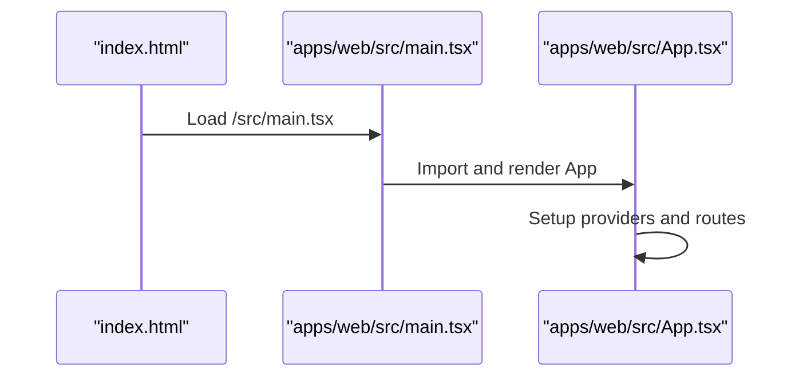
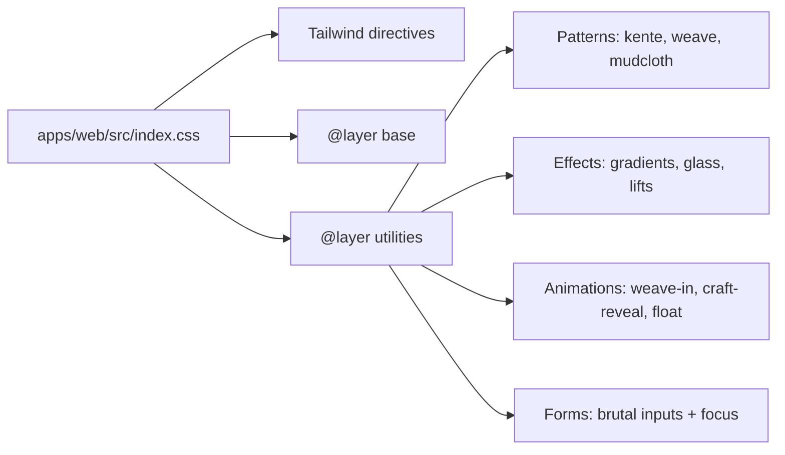
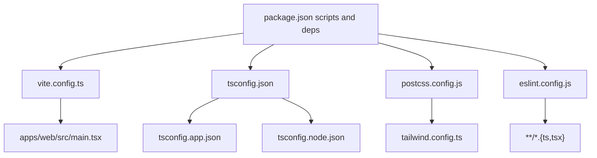

# Build System & Deployment Configuration

<cite>
**Referenced Files in This Document**
- [vite.config.ts](file://vite.config.ts)
- [package.json](file://package.json)
- [tsconfig.json](file://tsconfig.json)
- [tsconfig.app.json](file://tsconfig.app.json)
- [tsconfig.node.json](file://tsconfig.node.json)
- [postcss.config.js](file://postcss.config.js)
- [tailwind.config.ts](file://tailwind.config.ts)
- [eslint.config.js](file://eslint.config.js)
- [components.json](file://components.json)
- [index.html](file://index.html)
- [apps/web/src/main.tsx](file://apps/web/src/main.tsx)
- [apps/web/src/App.tsx](file://apps/web/src/App.tsx)
- [apps/web/src/index.css](file://apps/web/src/index.css)
- [apps/web/src/App.css](file://apps/web/src/App.css)
</cite>

## Table of Contents
1. [Introduction](#introduction)
2. [Project Structure](#project-structure)
3. [Core Components](#core-components)
4. [Architecture Overview](#architecture-overview)
5. [Detailed Component Analysis](#detailed-component-analysis)
6. [Dependency Analysis](#dependency-analysis)
7. [Performance Considerations](#performance-considerations)
8. [Troubleshooting Guide](#troubleshooting-guide)
9. [Conclusion](#conclusion)
10. [Appendices](#appendices)

## Introduction
This document explains Empindu’s frontend build system and deployment configuration. It covers Vite setup, TypeScript compilation, PostCSS and Tailwind processing, ESLint configuration, development workflow, and styling patterns. It also documents environment handling, build optimization, asset management, and deployment preparation considerations derived from the repository’s configuration files.

## Project Structure
The build system centers on Vite with React SWC, TypeScript for type checking and compile-time safety, PostCSS with Tailwind for styling, and ESLint for code quality. The project uses a dual TypeScript configuration model (application and node) and integrates Tailwind via a dedicated configuration file and PostCSS pipeline.

**Diagram sources**
- [package.json](file://package.json)
- [vite.config.ts](file://vite.config.ts)
- [apps/web/src/main.tsx](file://apps/web/src/main.tsx)
- [apps/web/src/App.tsx](file://apps/web/src/App.tsx)
- [tsconfig.json](file://tsconfig.json)
- [tsconfig.app.json](file://tsconfig.app.json)
- [tsconfig.node.json](file://tsconfig.node.json)
- [postcss.config.js](file://postcss.config.js)
- [tailwind.config.ts](file://tailwind.config.ts)
- [eslint.config.js](file://eslint.config.js)
- [components.json](file://components.json)
- [index.html](file://index.html)
- [apps/web/src/index.css](file://apps/web/src/index.css)

**Section sources**
- [package.json](file://package.json)
- [vite.config.ts](file://vite.config.ts)
- [tsconfig.json](file://tsconfig.json)
- [tsconfig.app.json](file://tsconfig.app.json)
- [tsconfig.node.json](file://tsconfig.node.json)
- [postcss.config.js](file://postcss.config.js)
- [tailwind.config.ts](file://tailwind.config.ts)
- [eslint.config.js](file://eslint.config.js)
- [components.json](file://components.json)
- [index.html](file://index.html)
- [apps/web/src/main.tsx](file://apps/web/src/main.tsx)
- [apps/web/src/App.tsx](file://apps/web/src/App.tsx)
- [apps/web/src/index.css](file://apps/web/src/index.css)

## Core Components
- Vite configuration defines dev server host/port, React plugin, optional component tagger in development, and path alias for imports.
- TypeScript configurations split responsibilities: app-side TS for React with bundler resolution and JSX emit prevention; node-side TS for Vite config typing.
- PostCSS pipeline enables Tailwind and Autoprefixer; Tailwind scans TS/TSX under src and related folders.
- ESLint uses typescript-eslint with recommended rules, React Hooks plugin, and React Refresh plugin.
- Tailwind configuration extends theme with custom colors, typography, border radii, shadows, keyframes, and animations; includes shadcn/ui integration metadata.

**Section sources**
- [vite.config.ts](file://vite.config.ts)
- [tsconfig.app.json](file://tsconfig.app.json)
- [tsconfig.node.json](file://tsconfig.node.json)
- [postcss.config.js](file://postcss.config.js)
- [tailwind.config.ts](file://tailwind.config.ts)
- [eslint.config.js](file://eslint.config.js)
- [components.json](file://components.json)

## Architecture Overview
The build pipeline connects source files to compiled assets and runtime behavior:

**Diagram sources**
- [package.json](file://package.json)
- [vite.config.ts](file://vite.config.ts)
- [tsconfig.app.json](file://tsconfig.app.json)
- [postcss.config.js](file://postcss.config.js)
- [tailwind.config.ts](file://tailwind.config.ts)

## Detailed Component Analysis

### Vite Configuration
- Dev server binds to IPv6 all-hosts address and runs on port 8080.
- Plugins include React SWC and a development-only component tagger.
- Path alias @ resolves to src for ergonomic imports.
- No explicit build target or output directory is configured, deferring to Vite defaults.

**Diagram sources**
- [vite.config.ts](file://vite.config.ts)

**Section sources**
- [vite.config.ts](file://vite.config.ts)

### TypeScript Compilation Settings
- Root tsconfig references app and node configs.
- App config:
  - JSX emits via bundler, DOM libs, ESNext module resolution, allow importing TS extensions.
  - Paths mirror Vite alias.
  - Strict disabled for practicality; skipLibCheck enabled.
- Node config:
  - Targets modern runtime, bundler module resolution, strict enabled, no emit.
  - Includes Vite config for type checking.

**Diagram sources**
- [tsconfig.json](file://tsconfig.json)
- [tsconfig.app.json](file://tsconfig.app.json)
- [tsconfig.node.json](file://tsconfig.node.json)

**Section sources**
- [tsconfig.json](file://tsconfig.json)
- [tsconfig.app.json](file://tsconfig.app.json)
- [tsconfig.node.json](file://tsconfig.node.json)

### PostCSS and Tailwind Processing Pipeline
- PostCSS loads Tailwind and Autoprefixer.
- Tailwind scans TS/TSX under pages, components, app, and src directories.
- Theme customization includes:
  - Color palettes (including extended earth tones).
  - Typography families (display/body/mono).
  - Border radius presets and organic shapes.
  - Shadow presets (soft, medium, strong, glow, gold, brutal, clay).
  - Keyframes and animation durations for branded motion.
  - Plugin integration for enhanced animations.
- components.json aligns Tailwind usage with shadcn/ui conventions and aliases.

**Diagram sources**
- [postcss.config.js](file://postcss.config.js)
- [tailwind.config.ts](file://tailwind.config.ts)
- [components.json](file://components.json)

**Section sources**
- [postcss.config.js](file://postcss.config.js)
- [tailwind.config.ts](file://tailwind.config.ts)
- [components.json](file://components.json)

### ESLint Configuration and Code Quality Tools
- Uses typescript-eslint with recommended sets.
- Extends recommended JS rules and adds React Hooks and React Refresh plugins.
- Ignores dist folder; targets TS/TSX files.
- Disables unused vars rule; enforces react-refresh export rules.

**Diagram sources**
- [eslint.config.js](file://eslint.config.js)

**Section sources**
- [eslint.config.js](file://eslint.config.js)

### Development Workflow and Entry Points
- HTML template initializes the app and injects the main script.
- Entry point mounts the React root and renders the App shell.
- App sets up routing, global providers (query client, auth, tooltips), and routes for all pages.

**Diagram sources**
- [index.html](file://index.html)
- [apps/web/src/main.tsx](file://apps/web/src/main.tsx)
- [apps/web/src/App.tsx](file://apps/web/src/App.tsx)

**Section sources**
- [index.html](file://index.html)
- [apps/web/src/main.tsx](file://apps/web/src/main.tsx)
- [apps/web/src/App.tsx](file://apps/web/src/App.tsx)

### Tailwind CSS Integration and Styling Patterns
- Tailwind directives in CSS enable base, components, and utilities layers.
- Custom utilities layer introduces:
  - Font helpers (display/body).
  - Claymorphic and brutalist UI primitives (cards, buttons).
  - African pattern backgrounds (kente, weave, mudcloth).
  - Gradients, glassmorphism effects, hover lifts and glows.
  - Organic border radii and section spacing helpers.
  - Scroll-triggered animations and selection/scrollbar styling.
- Motion utilities and keyframes support branded animations (weave-in, craft-reveal, gentle-float, shimmer, pulse-glow, spin-slow).
- Brutalist form inputs receive tailored focus styles.

**Diagram sources**
- [apps/web/src/index.css](file://apps/web/src/index.css)
- [tailwind.config.ts](file://tailwind.config.ts)

**Section sources**
- [apps/web/src/index.css](file://apps/web/src/index.css)
- [tailwind.config.ts](file://tailwind.config.ts)

### Environment Variables and Build Modes
- Scripts define dev, build, build:dev, lint, and preview commands.
- Vite supports development and production modes; build:dev leverages development mode for builds.
- No explicit environment variable files are present in the repository snapshot; environment handling would typically rely on Vite’s built-in mode-based env loading.

**Section sources**
- [package.json](file://package.json)
- [vite.config.ts](file://vite.config.ts)

### Asset Management and Static Site Generation
- No static site generation configuration is present in the repository snapshot.
- Assets are processed through Vite and PostCSS; Tailwind generates purged CSS based on scanned templates.

**Section sources**
- [postcss.config.js](file://postcss.config.js)
- [tailwind.config.ts](file://tailwind.config.ts)

### Development Server, HMR, and Debugging Setup
- Dev server listens on IPv6 all-hosts address and port 8080.
- React SWC plugin accelerates development builds.
- Optional component tagger is active in development mode to aid component tracking.
- Debugging is supported by standard browser devtools; TypeScript types are enforced via tsconfig and ESLint.

**Section sources**
- [vite.config.ts](file://vite.config.ts)
- [tsconfig.app.json](file://tsconfig.app.json)
- [eslint.config.js](file://eslint.config.js)

## Dependency Analysis
The build system relies on coordinated tooling:

**Diagram sources**
- [package.json](file://package.json)
- [vite.config.ts](file://vite.config.ts)
- [tsconfig.json](file://tsconfig.json)
- [tsconfig.app.json](file://tsconfig.app.json)
- [tsconfig.node.json](file://tsconfig.node.json)
- [postcss.config.js](file://postcss.config.js)
- [tailwind.config.ts](file://tailwind.config.ts)
- [eslint.config.js](file://eslint.config.js)
- [apps/web/src/main.tsx](file://apps/web/src/main.tsx)

**Section sources**
- [package.json](file://package.json)
- [vite.config.ts](file://vite.config.ts)
- [tsconfig.json](file://tsconfig.json)
- [tsconfig.app.json](file://tsconfig.app.json)
- [tsconfig.node.json](file://tsconfig.node.json)
- [postcss.config.js](file://postcss.config.js)
- [tailwind.config.ts](file://tailwind.config.ts)
- [eslint.config.js](file://eslint.config.js)
- [apps/web/src/main.tsx](file://apps/web/src/main.tsx)

## Performance Considerations
- Prefer Tailwind utilities over ad-hoc CSS to leverage JIT and purging.
- Keep content globs precise to avoid unnecessary CSS generation.
- Use CSS layers to separate base, components, and utilities for maintainability.
- Disable strictness in app tsconfig to reduce friction; keep node tsconfig strict for Vite config reliability.
- Use React SWC for faster dev builds; ensure production builds are validated via preview.

[No sources needed since this section provides general guidance]

## Troubleshooting Guide
- If Tailwind utilities do not apply, verify content globs and ensure TS/TSX paths match scanning patterns.
- If CSS is missing, confirm PostCSS plugins are loaded and Tailwind directives are present in the entry CSS.
- If ESLint errors occur, review custom rules and ensure TypeScript files are included per eslint config.
- If dev server fails to connect, check host/port configuration and firewall settings.

**Section sources**
- [tailwind.config.ts](file://tailwind.config.ts)
- [postcss.config.js](file://postcss.config.js)
- [eslint.config.js](file://eslint.config.js)
- [vite.config.ts](file://vite.config.ts)

## Conclusion
Empindu’s build system combines Vite, React SWC, TypeScript, PostCSS, Tailwind, and ESLint to deliver a fast, maintainable, and stylistically cohesive frontend. The configuration emphasizes developer productivity (HMR, fast transpilation), design system consistency (custom Tailwind theme and utilities), and code quality (ESLint with hooks and refresh rules). For deployment, ensure environment variables are set appropriately and validate production builds with the preview command.

[No sources needed since this section summarizes without analyzing specific files]

## Appendices
- Example commands:
  - Development: npm run dev
  - Production build: npm run build
  - Development build: npm run build:dev
  - Preview production bundle: npm run preview
  - Lint: npm run lint

**Section sources**
- [package.json](file://package.json)