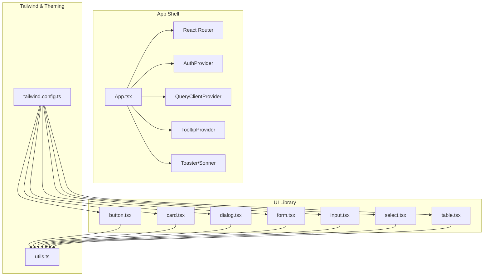
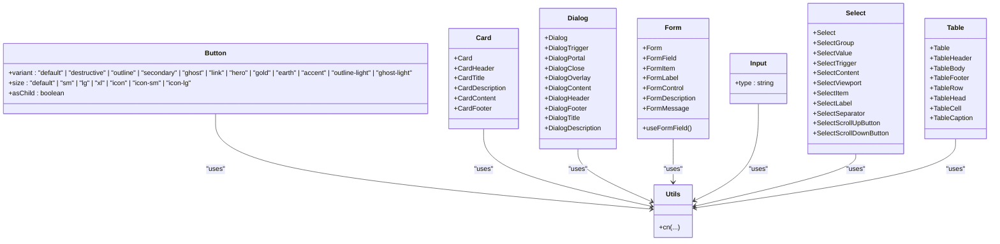
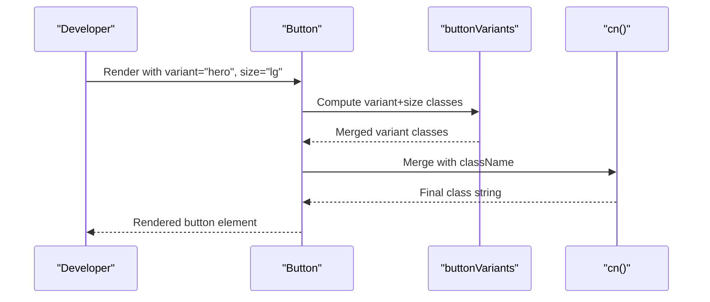
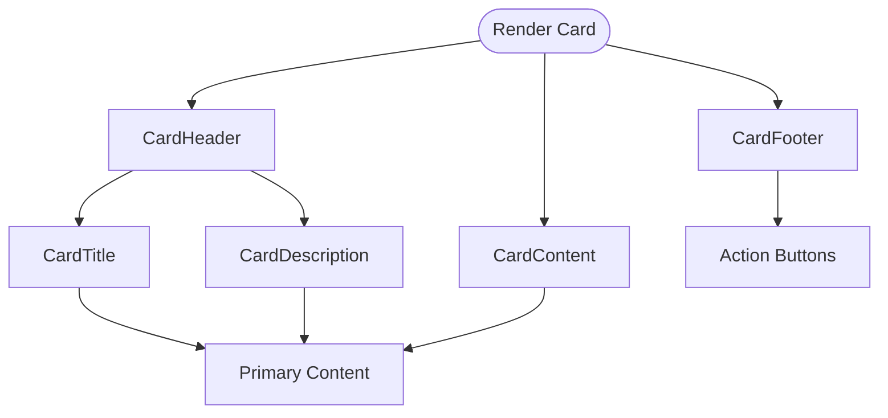
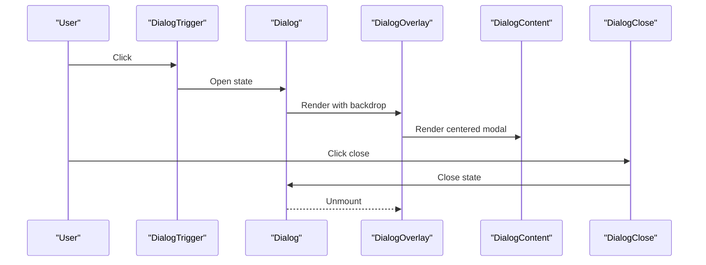
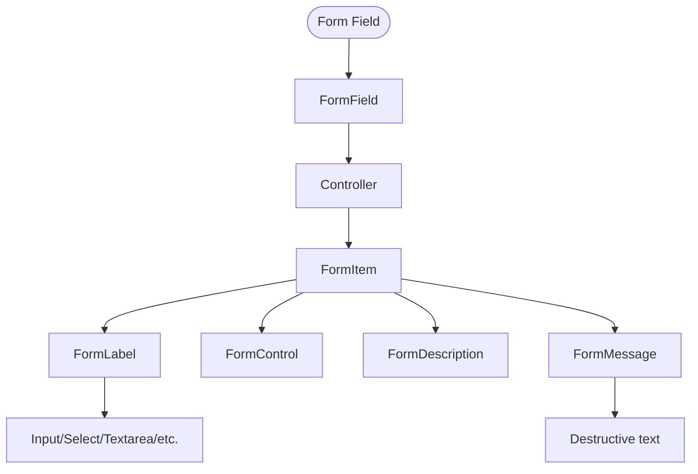
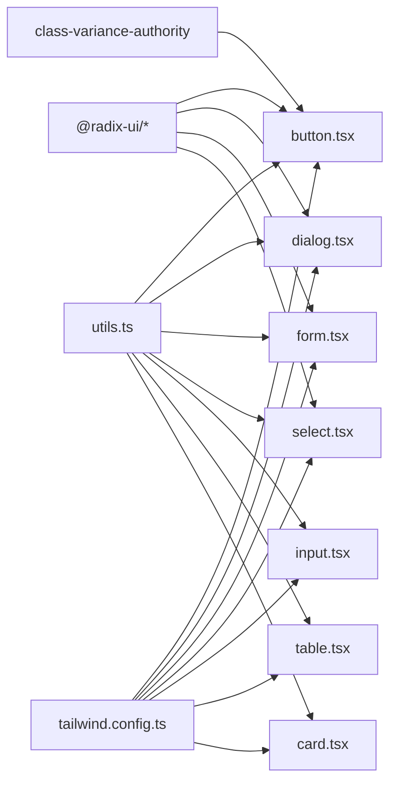

# Component Hierarchy & Design System

<cite>
**Referenced Files in This Document**
- [tailwind.config.ts](file://tailwind.config.ts)
- [utils.ts](file://apps/web/src/lib/utils.ts)
- [App.tsx](file://apps/web/src/App.tsx)
- [button.tsx](file://apps/web/src/components/ui/button.tsx)
- [card.tsx](file://apps/web/src/components/ui/card.tsx)
- [dialog.tsx](file://apps/web/src/components/ui/dialog.tsx)
- [form.tsx](file://apps/web/src/components/ui/form.tsx)
- [input.tsx](file://apps/web/src/components/ui/input.tsx)
- [select.tsx](file://apps/web/src/components/ui/select.tsx)
- [table.tsx](file://apps/web/src/components/ui/table.tsx)
</cite>

## Table of Contents
1. [Introduction](#introduction)
2. [Project Structure](#project-structure)
3. [Core Components](#core-components)
4. [Architecture Overview](#architecture-overview)
5. [Detailed Component Analysis](#detailed-component-analysis)
6. [Dependency Analysis](#dependency-analysis)
7. [Performance Considerations](#performance-considerations)
8. [Troubleshooting Guide](#troubleshooting-guide)
9. [Conclusion](#conclusion)
10. [Appendices](#appendices)

## Introduction
This document describes Empindu’s component hierarchy and design system with a focus on the custom UI component library built atop shadcn/ui and Radix UI. It explains how components are organized, how variants and sizes are standardized, and how styling integrates with Tailwind CSS and CSS custom properties. It also covers composition patterns, prop interfaces, responsive behavior, accessibility, theming, and practical guidance for extending and maintaining the design system consistently.

## Project Structure
Empindu’s frontend is a Vite + React application with TypeScript. The design system lives under a dedicated UI module, while pages and domain-specific components are grouped by feature. Global providers (routing, auth, tooltips, query client) are wired at the application root.

**Diagram sources**
- [App.tsx:26-56](file://apps/web/src/App.tsx#L26-L56)
- [button.tsx:1-58](file://apps/web/src/components/ui/button.tsx#L1-L58)
- [card.tsx:1-44](file://apps/web/src/components/ui/card.tsx#L1-L44)
- [dialog.tsx:1-96](file://apps/web/src/components/ui/dialog.tsx#L1-L96)
- [form.tsx:1-130](file://apps/web/src/components/ui/form.tsx#L1-L130)
- [input.tsx:1-23](file://apps/web/src/components/ui/input.tsx#L1-L23)
- [select.tsx:1-144](file://apps/web/src/components/ui/select.tsx#L1-L144)
- [table.tsx:1-73](file://apps/web/src/components/ui/table.tsx#L1-L73)
- [tailwind.config.ts:1-159](file://tailwind.config.ts#L1-L159)
- [utils.ts:1-7](file://apps/web/src/lib/utils.ts#L1-L7)

**Section sources**
- [App.tsx:26-56](file://apps/web/src/App.tsx#L26-L56)
- [tailwind.config.ts:1-159](file://tailwind.config.ts#L1-L159)

## Core Components
Empindu’s design system centers on a small set of reusable UI primitives that follow shadcn/ui conventions and leverage Radix UI for accessibility and composability. Each primitive exposes a consistent prop interface and supports variant/size combinations for predictable styling.

- Button: Variants include default, destructive, outline, secondary, ghost, link, plus culturally inspired variants (hero, gold, earth, accent) with size options (default, sm, lg, xl, icon, icon-sm, icon-lg).
- Card: Composite pattern with Card, CardHeader, CardTitle, CardDescription, CardContent, CardFooter.
- Dialog: Root, Trigger, Portal, Close, Overlay, Content, Header, Footer, Title, Description.
- Form: Provider, Field, Item, Label, Control, Description, Message, plus a hook to resolve field context.
- Input: Styled native input with focus-visible ring and disabled states.
- Select: Root, Group, Value, Trigger, Content, Viewport, Item, Label, Separator, ScrollUp/Down buttons.
- Table: Wrapper and semantic parts (Table, TableHeader, TableBody, TableFooter, TableRow, TableHead, TableCell, TableCaption).

These components are composed to build higher-level features such as forms, modals, dashboards, and product listings.

**Section sources**
- [button.tsx:7-41](file://apps/web/src/components/ui/button.tsx#L7-L41)
- [button.tsx:43-57](file://apps/web/src/components/ui/button.tsx#L43-L57)
- [card.tsx:5-43](file://apps/web/src/components/ui/card.tsx#L5-L43)
- [dialog.tsx:7-95](file://apps/web/src/components/ui/dialog.tsx#L7-L95)
- [form.tsx:9-129](file://apps/web/src/components/ui/form.tsx#L9-L129)
- [input.tsx:5-22](file://apps/web/src/components/ui/input.tsx#L5-L22)
- [select.tsx:7-143](file://apps/web/src/components/ui/select.tsx#L7-L143)
- [table.tsx:5-72](file://apps/web/src/components/ui/table.tsx#L5-L72)

## Architecture Overview
The design system is implemented as composable React components with a shared styling pipeline:

- Prop interfaces extend HTML attributes and Radix-specific props where applicable.
- Variants and sizes are defined via class variance authority (CVA) for consistent styling.
- Tailwind CSS provides the underlying design tokens and utilities.
- CSS custom properties (CSS variables) are used to define theme tokens and shadows, enabling runtime theme switching and consistent design tokens across components.
- Utility functions merge classes safely to avoid conflicts.

**Diagram sources**
- [button.tsx:43-57](file://apps/web/src/components/ui/button.tsx#L43-L57)
- [card.tsx:5-43](file://apps/web/src/components/ui/card.tsx#L5-L43)
- [dialog.tsx:7-95](file://apps/web/src/components/ui/dialog.tsx#L7-L95)
- [form.tsx:9-129](file://apps/web/src/components/ui/form.tsx#L9-L129)
- [input.tsx:5-22](file://apps/web/src/components/ui/input.tsx#L5-L22)
- [select.tsx:7-143](file://apps/web/src/components/ui/select.tsx#L7-L143)
- [table.tsx:5-72](file://apps/web/src/components/ui/table.tsx#L5-L72)
- [utils.ts:4-6](file://apps/web/src/lib/utils.ts#L4-L6)

## Detailed Component Analysis

### Button
- Purpose: Unified action primitive with variant and size options.
- Composition: Uses a slot component to optionally render as a child element, enabling composition with links and icons.
- Styling: CVA defines variant and size classes; focus-visible ring and transitions are applied globally.
- Accessibility: Inherits native button semantics; supports disabled state and pointer-events handling.

**Diagram sources**
- [button.tsx:7-41](file://apps/web/src/components/ui/button.tsx#L7-L41)
- [button.tsx:49-55](file://apps/web/src/components/ui/button.tsx#L49-L55)
- [utils.ts:4-6](file://apps/web/src/lib/utils.ts#L4-L6)

**Section sources**
- [button.tsx:7-41](file://apps/web/src/components/ui/button.tsx#L7-L41)
- [button.tsx:43-57](file://apps/web/src/components/ui/button.tsx#L43-L57)

### Card
- Purpose: Container with header/title/description/content/footer segments.
- Composition: Child components expose consistent spacing and typography.
- Styling: Uses card background and muted borders/shadows from theme tokens.

**Diagram sources**
- [card.tsx:5-43](file://apps/web/src/components/ui/card.tsx#L5-L43)

**Section sources**
- [card.tsx:5-43](file://apps/web/src/components/ui/card.tsx#L5-L43)

### Dialog
- Purpose: Modal overlay with animated entrance/exit and close controls.
- Composition: Overlay, Portal, and Content are composed; Title/Description provide semantic labeling.
- Accessibility: Uses Radix UI primitives for focus trapping, ARIA attributes, and keyboard handling.

**Diagram sources**
- [dialog.tsx:7-95](file://apps/web/src/components/ui/dialog.tsx#L7-L95)

**Section sources**
- [dialog.tsx:7-95](file://apps/web/src/components/ui/dialog.tsx#L7-L95)

### Form
- Purpose: Integrates react-hook-form with accessible labels and error messaging.
- Composition: Field context, item context, and control slots connect form state to UI.
- Accessibility: Auto-generates IDs and aria attributes; surfaces errors to assistive tech.

**Diagram sources**
- [form.tsx:9-129](file://apps/web/src/components/ui/form.tsx#L9-L129)

**Section sources**
- [form.tsx:9-129](file://apps/web/src/components/ui/form.tsx#L9-L129)

### Input
- Purpose: Styled text input with focus-visible ring and disabled handling.
- Styling: Inherits from theme tokens for border, background, and ring colors.

**Section sources**
- [input.tsx:5-22](file://apps/web/src/components/ui/input.tsx#L5-L22)

### Select
- Purpose: Accessible dropdown with viewport scrolling and selection indicators.
- Composition: Trigger opens Content with a Portal; Items render with check indicators.
- Accessibility: Uses Radix UI primitives for keyboard navigation and ARIA roles.

**Section sources**
- [select.tsx:7-143](file://apps/web/src/components/ui/select.tsx#L7-L143)

### Table
- Purpose: Responsive data table with proper semantics and hover/selected states.
- Composition: Wraps the table in an overflow container; semantic parts align with HTML table elements.

**Section sources**
- [table.tsx:5-72](file://apps/web/src/components/ui/table.tsx#L5-L72)

## Dependency Analysis
The design system components depend on:
- Radix UI for accessible primitives and state management.
- Class Variance Authority (CVA) for variant/size composition.
- Tailwind CSS for utilities and animations.
- CSS custom properties for theme tokens and shadows.
- A centralized utility for merging classes.

**Diagram sources**
- [button.tsx:2-5](file://apps/web/src/components/ui/button.tsx#L2-L5)
- [dialog.tsx:1-5](file://apps/web/src/components/ui/dialog.tsx#L1-L5)
- [form.tsx:2-7](file://apps/web/src/components/ui/form.tsx#L2-L7)
- [select.tsx:1-5](file://apps/web/src/components/ui/select.tsx#L1-L5)
- [utils.ts:1-6](file://apps/web/src/lib/utils.ts#L1-L6)
- [tailwind.config.ts:1-159](file://tailwind.config.ts#L1-L159)

**Section sources**
- [button.tsx:2-5](file://apps/web/src/components/ui/button.tsx#L2-L5)
- [dialog.tsx:1-5](file://apps/web/src/components/ui/dialog.tsx#L1-L5)
- [form.tsx:2-7](file://apps/web/src/components/ui/form.tsx#L2-L7)
- [select.tsx:1-5](file://apps/web/src/components/ui/select.tsx#L1-L5)
- [utils.ts:1-6](file://apps/web/src/lib/utils.ts#L1-L6)
- [tailwind.config.ts:1-159](file://tailwind.config.ts#L1-L159)

## Performance Considerations
- Prefer variant and size props over ad-hoc class overrides to keep the class graph small and cacheable.
- Use the shared cn utility to minimize class conflicts and reduce DOM churn.
- Keep dialogs and selects mounted conditionally to avoid unnecessary portals and overlays.
- Leverage CSS custom properties for theme tokens to enable efficient runtime toggles without rebuilding styles.

## Troubleshooting Guide
- Missing variant classes: Ensure the variant and size props match the supported sets defined in each component.
- Focus ring not visible: Verify focus-visible utilities and that the component forwards refs properly.
- Form errors not announced: Confirm useFormField is used inside a FormProvider and that aria attributes are present.
- Dialog not closing: Check that DialogClose is rendered and that portal content is attached to the DOM.
- Tailwind utilities not applied: Confirm content globs in the Tailwind config include the component paths and that CSS variables are defined.

**Section sources**
- [button.tsx:43-57](file://apps/web/src/components/ui/button.tsx#L43-L57)
- [form.tsx:33-54](file://apps/web/src/components/ui/form.tsx#L33-L54)
- [dialog.tsx:44-50](file://apps/web/src/components/ui/dialog.tsx#L44-L50)
- [tailwind.config.ts:3-5](file://tailwind.config.ts#L3-L5)

## Conclusion
Empindu’s design system is a pragmatic blend of shadcn/ui conventions, Radix UI accessibility primitives, and a cohesive Tailwind-based theming model. By standardizing variants, sizes, and composition patterns, the system promotes consistency, reusability, and maintainability across the application. Extending the system involves adding new variants/sizes to existing components or introducing new primitives with the same patterns.

## Appendices

### Styling Conventions and Theme Tokens
- Theme tokens are defined as CSS variables and mapped to Tailwind’s color palette, enabling consistent theming across components.
- Typography families and border radii are configured centrally for global coherence.
- Animations and keyframes are registered for motion primitives used by interactive components.

**Section sources**
- [tailwind.config.ts:16-100](file://tailwind.config.ts#L16-L100)
- [tailwind.config.ts:101-154](file://tailwind.config.ts#L101-L154)

### Responsive Design Implementation
- Components use responsive utilities and sizes appropriate for mobile-first layouts.
- Inputs, buttons, and tables adapt to smaller screens with reduced paddings and font sizes.
- Dialogs and selects use centered positioning and viewport-aware animations.

**Section sources**
- [input.tsx:10-13](file://apps/web/src/components/ui/input.tsx#L10-L13)
- [button.tsx:26-34](file://apps/web/src/components/ui/button.tsx#L26-L34)
- [dialog.tsx:36-43](file://apps/web/src/components/ui/dialog.tsx#L36-L43)

### Accessibility Features
- Components rely on Radix UI for focus management, keyboard navigation, and ARIA attributes.
- Forms integrate with react-hook-form to provide accessible labels and error announcements.
- Interactive elements expose focus-visible rings and disabled states.

**Section sources**
- [form.tsx:75-99](file://apps/web/src/components/ui/form.tsx#L75-L99)
- [dialog.tsx:67-82](file://apps/web/src/components/ui/dialog.tsx#L67-L82)

### Component State Management and Reusability Patterns
- Stateful components (Dialog, Select) encapsulate open/close and selection logic internally.
- Form components centralize field context and validation messaging.
- Utility functions (cn) ensure consistent class merging across components.

**Section sources**
- [dialog.tsx:30-51](file://apps/web/src/components/ui/dialog.tsx#L30-L51)
- [select.tsx:61-91](file://apps/web/src/components/ui/select.tsx#L61-L91)
- [utils.ts:4-6](file://apps/web/src/lib/utils.ts#L4-L6)