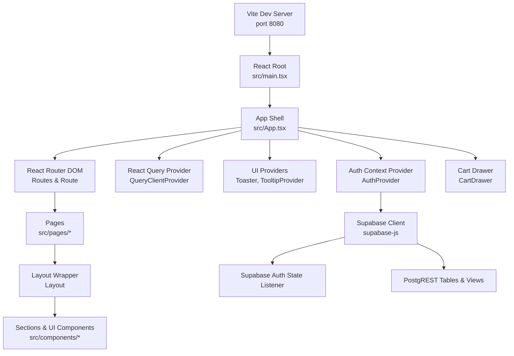
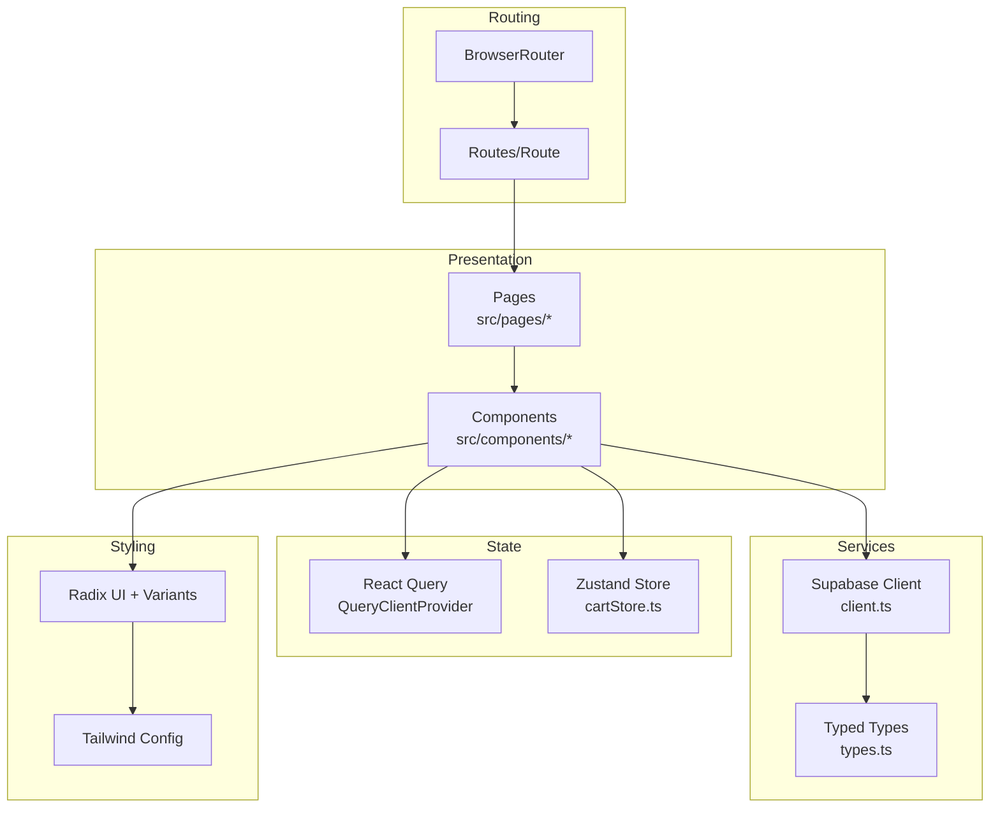
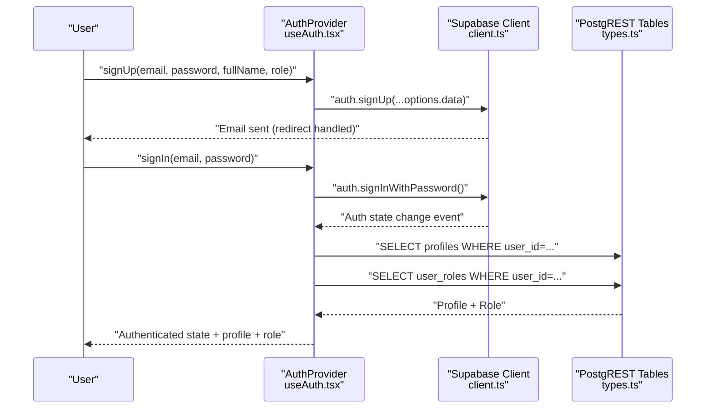
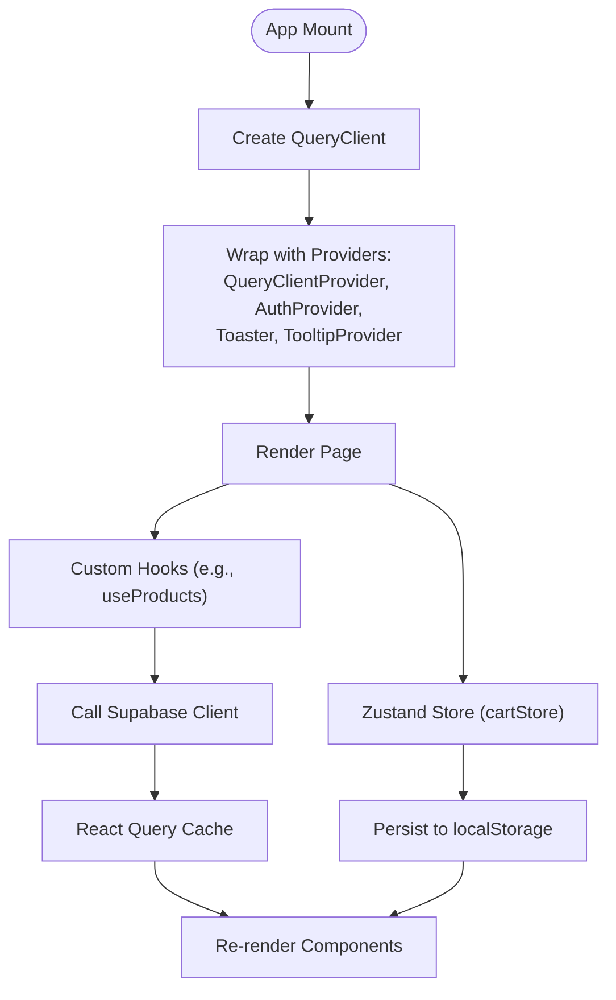
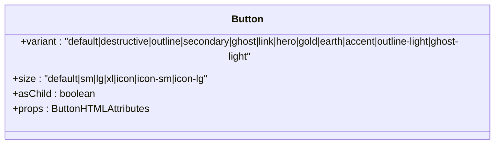
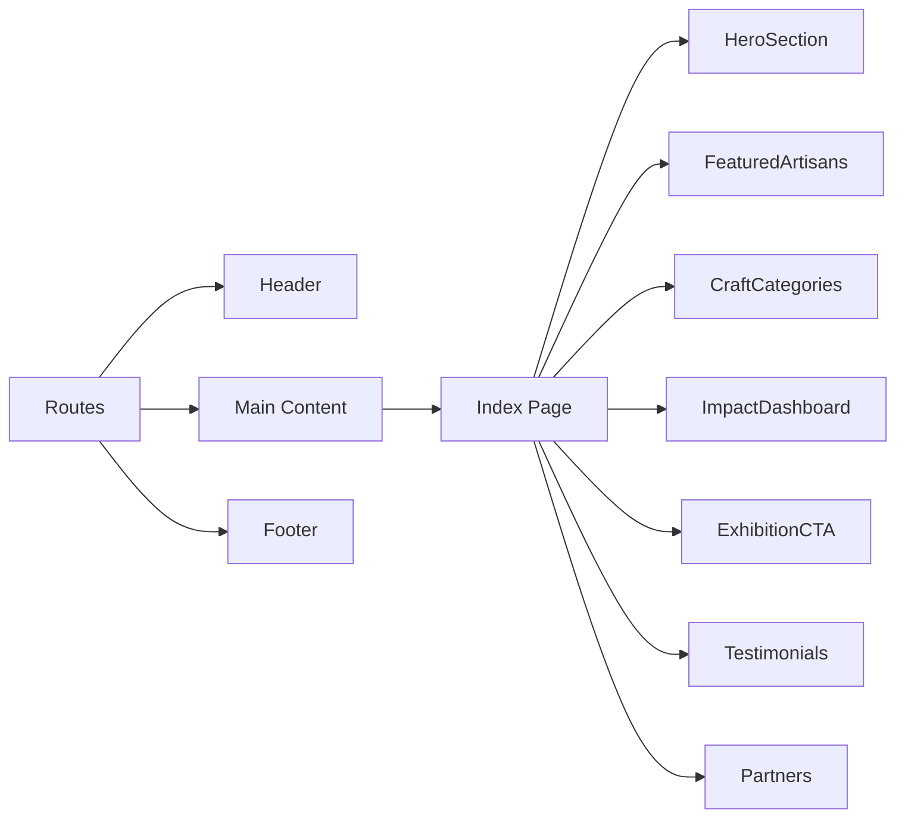
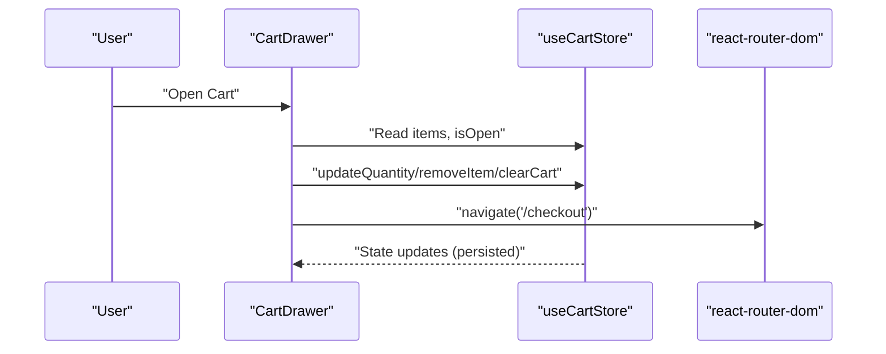
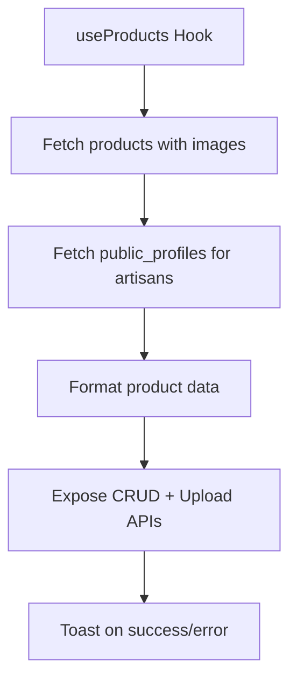
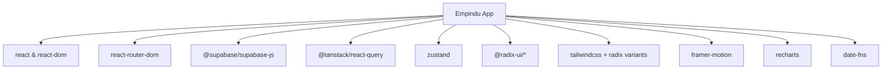

# Frontend Architecture

<cite>
**Referenced Files in This Document**
- [package.json](file://package.json)
- [vite.config.ts](file://vite.config.ts)
- [tsconfig.json](file://tsconfig.json)
- [tailwind.config.ts](file://tailwind.config.ts)
- [src/main.tsx](file://src/main.tsx)
- [src/App.tsx](file://src/App.tsx)
- [src/integrations/supabase/client.ts](file://src/integrations/supabase/client.ts)
- [src/integrations/supabase/types.ts](file://src/integrations/supabase/types.ts)
- [src/hooks/useAuth.tsx](file://src/hooks/useAuth.tsx)
- [src/stores/cartStore.ts](file://src/stores/cartStore.ts)
- [src/components/cart/CartDrawer.tsx](file://src/components/cart/CartDrawer.tsx)
- [src/components/layout/Layout.tsx](file://src/components/layout/Layout.tsx)
- [src/pages/Index.tsx](file://src/pages/Index.tsx)
- [src/components/ui/button.tsx](file://src/components/ui/button.tsx)
- [src/hooks/useProducts.tsx](file://src/hooks/useProducts.tsx)
</cite>

## Table of Contents
1. [Introduction](#introduction)
2. [Project Structure](#project-structure)
3. [Core Components](#core-components)
4. [Architecture Overview](#architecture-overview)
5. [Detailed Component Analysis](#detailed-component-analysis)
6. [Dependency Analysis](#dependency-analysis)
7. [Performance Considerations](#performance-considerations)
8. [Troubleshooting Guide](#troubleshooting-guide)
9. [Conclusion](#conclusion)
10. [Appendices](#appendices)

## Introduction
This document describes the frontend architecture of Empindu’s Next.js/React application. It covers the component hierarchy, page-based routing, state management using React Query and Zustand, Supabase integration patterns, authentication flow, real-time synchronization, UI component library organization, custom hooks, reusable component patterns, build system configuration, TypeScript integration, development workflow, styling architecture with Tailwind CSS, responsive design, accessibility, external service integrations, error handling strategies, and performance optimization techniques.

## Project Structure
The application is a Vite-powered React project with TypeScript. It organizes code by feature and domain:
- Pages under src/pages represent route handlers.
- Shared UI components live under src/components.
- Domain-specific hooks under src/hooks encapsulate data fetching and business logic.
- Stores under src/stores manage local/global state (Zustand).
- Integrations under src/integrations centralize third-party SDKs (e.g., Supabase).
- Styling is configured via Tailwind CSS with a custom theme.

**Diagram sources**
- [src/main.tsx:1-6](file://src/main.tsx#L1-L6)
- [src/App.tsx:1-59](file://src/App.tsx#L1-L59)
- [src/integrations/supabase/client.ts:1-17](file://src/integrations/supabase/client.ts#L1-L17)

**Section sources**
- [package.json:1-89](file://package.json#L1-L89)
- [vite.config.ts:1-19](file://vite.config.ts#L1-L19)
- [tsconfig.json:1-24](file://tsconfig.json#L1-L24)
- [tailwind.config.ts:1-159](file://tailwind.config.ts#L1-L159)

## Core Components
- Application shell initializes providers and routes.
- Supabase client integrates authentication and database access.
- Auth provider manages user session, profile, and roles.
- Zustand store manages shopping cart state with persistence.
- UI component library uses Radix UI primitives with Tailwind-based variants.
- Custom hooks encapsulate Supabase queries and mutations.

Key implementation references:
- Providers and routing: [src/App.tsx:24-56](file://src/App.tsx#L24-L56)
- Root render: [src/main.tsx:1-6](file://src/main.tsx#L1-L6)
- Supabase client: [src/integrations/supabase/client.ts:5-17](file://src/integrations/supabase/client.ts#L5-L17)
- Auth provider: [src/hooks/useAuth.tsx:37-168](file://src/hooks/useAuth.tsx#L37-L168)
- Cart store: [src/stores/cartStore.ts:26-114](file://src/stores/cartStore.ts#L26-L114)
- UI button: [src/components/ui/button.tsx:7-41](file://src/components/ui/button.tsx#L7-L41)
- Products hook: [src/hooks/useProducts.tsx:56-349](file://src/hooks/useProducts.tsx#L56-L349)

**Section sources**
- [src/App.tsx:1-59](file://src/App.tsx#L1-L59)
- [src/main.tsx:1-6](file://src/main.tsx#L1-L6)
- [src/integrations/supabase/client.ts:1-17](file://src/integrations/supabase/client.ts#L1-L17)
- [src/hooks/useAuth.tsx:1-177](file://src/hooks/useAuth.tsx#L1-L177)
- [src/stores/cartStore.ts:1-115](file://src/stores/cartStore.ts#L1-L115)
- [src/components/ui/button.tsx:1-58](file://src/components/ui/button.tsx#L1-L58)
- [src/hooks/useProducts.tsx:1-369](file://src/hooks/useProducts.tsx#L1-L369)

## Architecture Overview
The frontend follows a layered architecture:
- Presentation Layer: Pages and components.
- Services Layer: Supabase client and typed database types.
- State Management: React Query for caching and server state; Zustand for client-side UI state.
- Routing: React Router DOM for page-level navigation.
- Styling: Tailwind CSS with a custom theme and component variants.

**Diagram sources**
- [src/App.tsx:24-56](file://src/App.tsx#L24-L56)
- [src/integrations/supabase/client.ts:5-17](file://src/integrations/supabase/client.ts#L5-L17)
- [src/integrations/supabase/types.ts:1-800](file://src/integrations/supabase/types.ts#L1-L800)
- [src/stores/cartStore.ts:26-114](file://src/stores/cartStore.ts#L26-L114)
- [tailwind.config.ts:1-159](file://tailwind.config.ts#L1-L159)

## Detailed Component Analysis

### Authentication Flow and Supabase Integration
The authentication system centers on a context provider that:
- Subscribes to Supabase auth state changes.
- Loads user session on startup.
- Fetches profile and role data after sign-in.
- Exposes sign-up, sign-in, sign-out, and profile update functions.

**Diagram sources**
- [src/hooks/useAuth.tsx:103-136](file://src/hooks/useAuth.tsx#L103-L136)
- [src/hooks/useAuth.tsx:68-101](file://src/hooks/useAuth.tsx#L68-L101)
- [src/integrations/supabase/client.ts:5-17](file://src/integrations/supabase/client.ts#L5-L17)
- [src/integrations/supabase/types.ts:684-731](file://src/integrations/supabase/types.ts#L684-L731)
- [src/integrations/supabase/types.ts:16-37](file://src/integrations/supabase/types.ts#L16-L37)

**Section sources**
- [src/hooks/useAuth.tsx:1-177](file://src/hooks/useAuth.tsx#L1-L177)
- [src/integrations/supabase/client.ts:1-17](file://src/integrations/supabase/client.ts#L1-L17)
- [src/integrations/supabase/types.ts:1-800](file://src/integrations/supabase/types.ts#L1-L800)

### State Management: React Query and Zustand
- React Query: Centralized caching and server state via QueryClientProvider in the app shell.
- Zustand: Local/UI state (shopping cart) persisted to localStorage with selective state serialization.

**Diagram sources**
- [src/App.tsx:24-56](file://src/App.tsx#L24-L56)
- [src/stores/cartStore.ts:26-114](file://src/stores/cartStore.ts#L26-L114)
- [src/hooks/useProducts.tsx:56-349](file://src/hooks/useProducts.tsx#L56-L349)

**Section sources**
- [src/App.tsx:1-59](file://src/App.tsx#L1-L59)
- [src/stores/cartStore.ts:1-115](file://src/stores/cartStore.ts#L1-L115)
- [src/hooks/useProducts.tsx:1-369](file://src/hooks/useProducts.tsx#L1-L369)

### UI Component Library Organization
- Base primitives from Radix UI with Tailwind-based variants.
- Variants define multiple styles and sizes for consistent usage.
- Utilities like class merging and slot components enable composition.

**Diagram sources**
- [src/components/ui/button.tsx:7-41](file://src/components/ui/button.tsx#L7-L41)

**Section sources**
- [src/components/ui/button.tsx:1-58](file://src/components/ui/button.tsx#L1-L58)
- [tailwind.config.ts:15-155](file://tailwind.config.ts#L15-L155)

### Page-Based Routing and Layout
- Pages are mapped to routes in the app shell.
- Layout composes header, footer, and main content area.
- Index page composes multiple sections.

**Diagram sources**
- [src/App.tsx:34-51](file://src/App.tsx#L34-L51)
- [src/components/layout/Layout.tsx:9-17](file://src/components/layout/Layout.tsx#L9-L17)
- [src/pages/Index.tsx:11-24](file://src/pages/Index.tsx#L11-L24)

**Section sources**
- [src/App.tsx:1-59](file://src/App.tsx#L1-L59)
- [src/components/layout/Layout.tsx:1-18](file://src/components/layout/Layout.tsx#L1-L18)
- [src/pages/Index.tsx:1-27](file://src/pages/Index.tsx#L1-L27)

### Shopping Cart Drawer and Zustand Store
- Cart drawer renders items, quantities, and actions.
- Zustand store persists cart items and exposes helpers to compute totals and toggle visibility.

**Diagram sources**
- [src/components/cart/CartDrawer.tsx:20-166](file://src/components/cart/CartDrawer.tsx#L20-L166)
- [src/stores/cartStore.ts:26-114](file://src/stores/cartStore.ts#L26-L114)

**Section sources**
- [src/components/cart/CartDrawer.tsx:1-167](file://src/components/cart/CartDrawer.tsx#L1-L167)
- [src/stores/cartStore.ts:1-115](file://src/stores/cartStore.ts#L1-L115)

### Product Catalog and Image Management
- Products hook fetches products, artisan profiles, and images.
- Supports CRUD operations and image upload/delete with Supabase Storage.
- Uses public profiles view to avoid exposing sensitive data.

**Diagram sources**
- [src/hooks/useProducts.tsx:56-349](file://src/hooks/useProducts.tsx#L56-L349)
- [src/integrations/supabase/types.ts:557-591](file://src/integrations/supabase/types.ts#L557-L591)
- [src/integrations/supabase/types.ts:684-731](file://src/integrations/supabase/types.ts#L684-L731)

**Section sources**
- [src/hooks/useProducts.tsx:1-369](file://src/hooks/useProducts.tsx#L1-L369)
- [src/integrations/supabase/types.ts:1-800](file://src/integrations/supabase/types.ts#L1-L800)

## Dependency Analysis
External dependencies and their roles:
- React and React Router DOM for UI and routing.
- @supabase/supabase-js for authentication and database access.
- @tanstack/react-query for caching and server state.
- zustand for lightweight client state management.
- Radix UI primitives and Tailwind-based variants for UI.
- Framer Motion for animations.
- Recharts, date-fns, and others for UX and utilities.

**Diagram sources**
- [package.json:14-67](file://package.json#L14-L67)

**Section sources**
- [package.json:1-89](file://package.json#L1-L89)

## Performance Considerations
- Prefer React Query for caching and background refetching to minimize redundant network calls.
- Use selective state persistence in Zustand to reduce serialized payload size.
- Lazy-load heavy components and images; defer non-critical effects.
- Optimize Tailwind builds by purging unused styles and enabling tree-shaking.
- Use memoization and stable callbacks to prevent unnecessary re-renders.
- Virtualize long lists and paginate data where appropriate.

## Troubleshooting Guide
Common areas to inspect:
- Authentication state not persisting: verify Supabase auth configuration and localStorage availability.
- Toast errors not appearing: ensure Toaster/Toaster providers are mounted in the app shell.
- Cart not updating: confirm Zustand store actions and persistence middleware.
- Product fetch failures: check Supabase table/view permissions and CORS/storage policies.
- Build issues: validate Vite aliases and TypeScript path mapping.

**Section sources**
- [src/App.tsx:24-56](file://src/App.tsx#L24-L56)
- [src/stores/cartStore.ts:26-114](file://src/stores/cartStore.ts#L26-L114)
- [src/hooks/useProducts.tsx:91-100](file://src/hooks/useProducts.tsx#L91-L100)
- [vite.config.ts:13-18](file://vite.config.ts#L13-L18)
- [tsconfig.json:7-11](file://tsconfig.json#L7-L11)

## Conclusion
Empindu’s frontend leverages a clean separation of concerns with React Router for navigation, Supabase for identity and data, React Query for caching, and Zustand for UI state. The UI is built on Radix primitives with a Tailwind-based design system, emphasizing consistency and accessibility. The architecture supports scalability, maintainability, and a smooth developer experience through modern tooling and structured patterns.

## Appendices

### Build System and Development Workflow
- Vite dev server runs on port 8080 with React SWC plugin and optional component tagging in development.
- TypeScript path mapping resolves @/* to src/.
- Tailwind scans pages, components, app, and src for class usage.

**Section sources**
- [vite.config.ts:1-19](file://vite.config.ts#L1-L19)
- [tsconfig.json:7-11](file://tsconfig.json#L7-L11)
- [tailwind.config.ts:4](file://tailwind.config.ts#L4)

### Styling Architecture and Accessibility
- Tailwind theme defines custom colors, shadows, keyframes, and animations.
- Components use semantic HTML and Radix UI primitives for keyboard navigation and ARIA support.
- Focus-visible outlines and proper contrast ratios improve accessibility.

**Section sources**
- [tailwind.config.ts:15-155](file://tailwind.config.ts#L15-L155)
- [src/components/ui/button.tsx:49-54](file://src/components/ui/button.tsx#L49-L54)