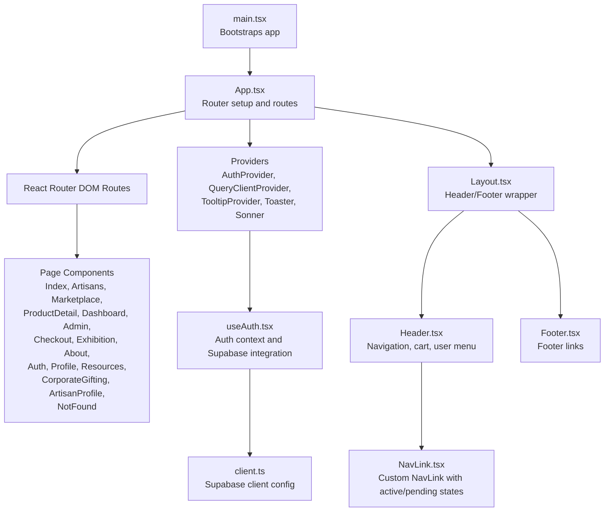
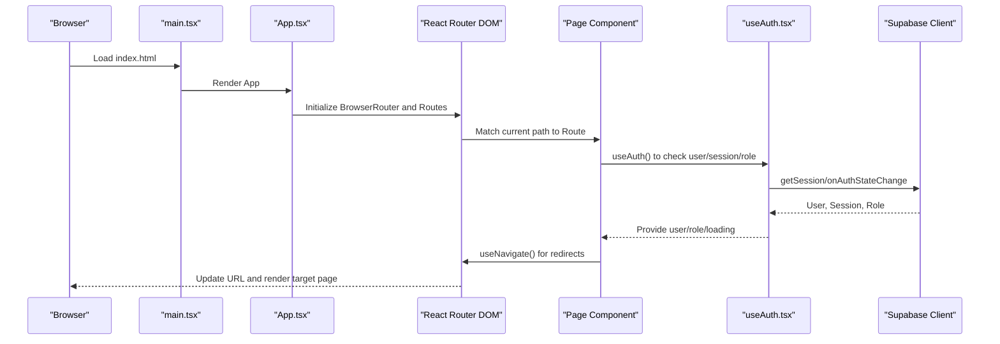
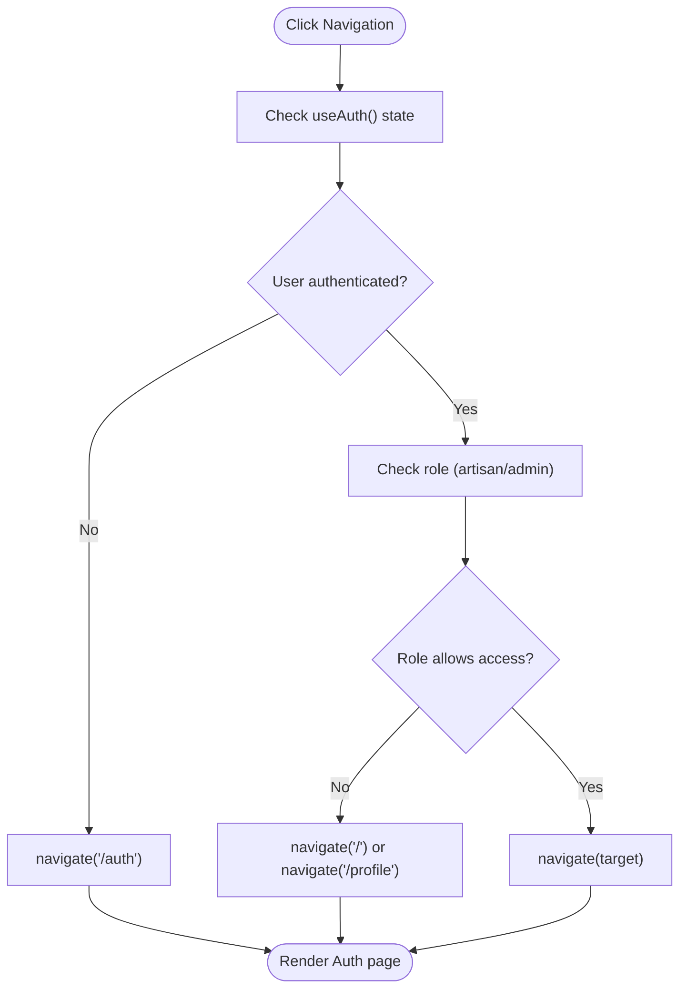
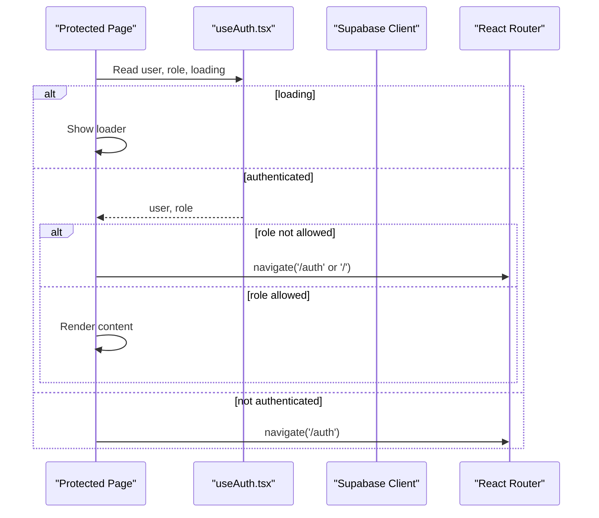
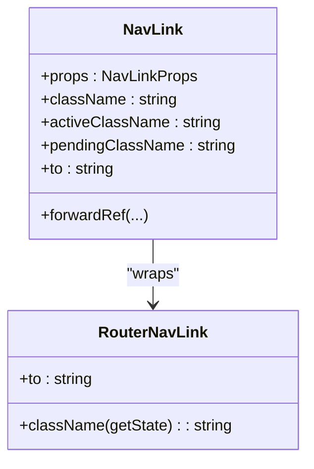
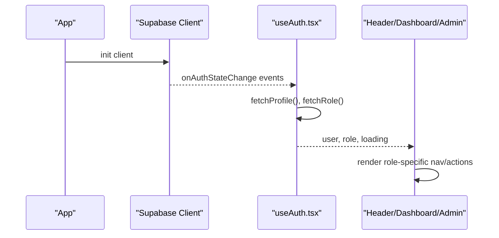
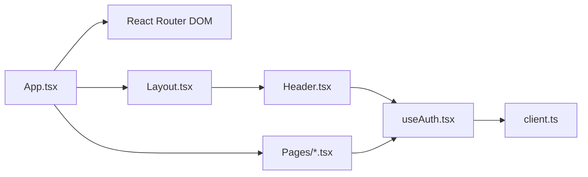

# Routing & Navigation System

<cite>
**Referenced Files in This Document**
- [App.tsx](file://apps/web/src/App.tsx)
- [main.tsx](file://apps/web/src/main.tsx)
- [NavLink.tsx](file://apps/web/src/components/NavLink.tsx)
- [Header.tsx](file://apps/web/src/components/layout/Header.tsx)
- [Layout.tsx](file://apps/web/src/components/layout/Layout.tsx)
- [Footer.tsx](file://apps/web/src/components/layout/Footer.tsx)
- [useAuth.tsx](file://apps/web/src/hooks/useAuth.tsx)
- [client.ts](file://apps/web/src/integrations/supabase/client.ts)
- [Auth.tsx](file://apps/web/src/pages/Auth.tsx)
- [Dashboard.tsx](file://apps/web/src/pages/Dashboard.tsx)
- [Admin.tsx](file://apps/web/src/pages/Admin.tsx)
</cite>

## Table of Contents
1. [Introduction](#introduction)
2. [Project Structure](#project-structure)
3. [Core Components](#core-components)
4. [Architecture Overview](#architecture-overview)
5. [Detailed Component Analysis](#detailed-component-analysis)
6. [Dependency Analysis](#dependency-analysis)
7. [Performance Considerations](#performance-considerations)
8. [Troubleshooting Guide](#troubleshooting-guide)
9. [Conclusion](#conclusion)

## Introduction
This document explains Empindu’s client-side routing and navigation system built with React Router DOM in a Vite-powered React application. It covers the page-based routing architecture, dynamic routes, client-side navigation, route protection, authentication-aware routing, and the custom NavLink component. It also documents navigation patterns, programmatic navigation, route parameters handling, query string management, SEO considerations, meta tag management, progressive enhancement, and integration with Supabase authentication and user-role-based navigation.

## Project Structure
The routing and navigation system centers around a single-page application bootstrapped in main.tsx and configured with React Router DOM in App.tsx. Pages are organized under src/pages, and shared layout components live under src/components/layout. Authentication state is managed via a dedicated hook and provider, integrating with Supabase.

**Diagram sources**
- [main.tsx:1-6](file://apps/web/src/main.tsx#L1-L6)
- [App.tsx:26-56](file://apps/web/src/App.tsx#L26-L56)
- [Layout.tsx:9-17](file://apps/web/src/components/layout/Layout.tsx#L9-L17)
- [Header.tsx:26-274](file://apps/web/src/components/layout/Header.tsx#L26-L274)
- [Footer.tsx:43-206](file://apps/web/src/components/layout/Footer.tsx#L43-L206)
- [useAuth.tsx:37-167](file://apps/web/src/hooks/useAuth.tsx#L37-L167)
- [client.ts:11-17](file://apps/web/src/integrations/supabase/client.ts#L11-L17)
- [NavLink.tsx:11-28](file://apps/web/src/components/NavLink.tsx#L11-L28)

**Section sources**
- [main.tsx:1-6](file://apps/web/src/main.tsx#L1-L6)
- [App.tsx:26-56](file://apps/web/src/App.tsx#L26-L56)

## Core Components
- Router and Routes: Defined in App.tsx using React Router DOM’s BrowserRouter and Routes with Route declarations for static and dynamic paths.
- Page Components: Individual pages under src/pages implement route handlers and protect access based on authentication and roles.
- Auth Provider and Hook: useAuth.tsx manages Supabase authentication state, profile, and role, exposing a context consumed by protected pages and UI.
- Custom NavLink: A thin wrapper around react-router-dom’s NavLink that supports active and pending class names and forwards props.
- Layout and Navigation: Layout.tsx composes Header.tsx and Footer.tsx; Header.tsx renders primary navigation and user actions, including role-aware menus.

Key routing highlights:
- Static routes: Home, About, Exhibition, Resources, Corporate Gifting, Checkout, etc.
- Dynamic routes: Product detail and artisan profiles using path parameters.
- Catch-all route: NotFound for unmatched paths.

**Section sources**
- [App.tsx:34-51](file://apps/web/src/App.tsx#L34-L51)
- [useAuth.tsx:23-33](file://apps/web/src/hooks/useAuth.tsx#L23-L33)
- [NavLink.tsx:5-28](file://apps/web/src/components/NavLink.tsx#L5-L28)
- [Layout.tsx:9-17](file://apps/web/src/components/layout/Layout.tsx#L9-L17)
- [Header.tsx:17-24](file://apps/web/src/components/layout/Header.tsx#L17-L24)

## Architecture Overview
The routing architecture is a client-side SPA with server-rendered HTML and meta tags handled by the framework. Authentication state drives route protection and role-based navigation. Programmatic navigation is used extensively in pages and header actions.

**Diagram sources**
- [main.tsx:1-6](file://apps/web/src/main.tsx#L1-L6)
- [App.tsx:31-52](file://apps/web/src/App.tsx#L31-L52)
- [useAuth.tsx:68-101](file://apps/web/src/hooks/useAuth.tsx#L68-L101)
- [client.ts:11-17](file://apps/web/src/integrations/supabase/client.ts#L11-L17)

## Detailed Component Analysis

### Page-Based Routing and Dynamic Routes
- Static routes are declared in App.tsx with exact paths for home, marketplace, exhibition, resources, checkout, etc.
- Dynamic routes:
  - Product detail: marketplace/:id
  - Artisan profile: artisans/:id
- Catch-all route: * renders NotFound.

Dynamic route parameters are accessed via the useNavigate and useSearchParams patterns shown below.

**Section sources**
- [App.tsx:35-50](file://apps/web/src/App.tsx#L35-L50)

### Client-Side Navigation Implementation
- Programmatic navigation:
  - useNavigate is used in Auth.tsx to redirect after login/register and to go back.
  - useNavigate is used in Header.tsx to navigate to profile/dashboard/admin/sign out.
  - useNavigate is used in Dashboard.tsx and Admin.tsx to enforce auth and role checks.
- Active state management:
  - Custom NavLink.tsx wraps react-router-dom’s NavLink and merges custom className with active/pending states.
  - Header.tsx applies inline conditional classes based on location.pathname for mobile menu items.

**Diagram sources**
- [Header.tsx:47-50](file://apps/web/src/components/layout/Header.tsx#L47-L50)
- [Dashboard.tsx:17-23](file://apps/web/src/pages/Dashboard.tsx#L17-L23)
- [Admin.tsx:31-42](file://apps/web/src/pages/Admin.tsx#L31-L42)

**Section sources**
- [Auth.tsx:21-41](file://apps/web/src/pages/Auth.tsx#L21-L41)
- [Header.tsx:156-210](file://apps/web/src/components/layout/Header.tsx#L156-L210)
- [Dashboard.tsx:13-29](file://apps/web/src/pages/Dashboard.tsx#L13-L29)
- [Admin.tsx:18-56](file://apps/web/src/pages/Admin.tsx#L18-L56)
- [NavLink.tsx:11-24](file://apps/web/src/components/NavLink.tsx#L11-L24)

### Route Protection Mechanisms and Authentication-Aware Routing
- Authenticated-only pages:
  - Dashboard.tsx enforces redirect to /auth if not authenticated and to /profile if role is neither artisan nor admin.
  - Admin.tsx enforces redirect to /auth if not authenticated and to / if role is not admin.
- Supabase integration:
  - useAuth.tsx subscribes to onAuthStateChange and fetches profile and role on session changes.
  - Supabase client persists sessions and refreshes tokens automatically.

**Diagram sources**
- [Dashboard.tsx:13-29](file://apps/web/src/pages/Dashboard.tsx#L13-L29)
- [Admin.tsx:18-56](file://apps/web/src/pages/Admin.tsx#L18-L56)
- [useAuth.tsx:68-101](file://apps/web/src/hooks/useAuth.tsx#L68-L101)

**Section sources**
- [Dashboard.tsx:17-23](file://apps/web/src/pages/Dashboard.tsx#L17-L23)
- [Admin.tsx:31-42](file://apps/web/src/pages/Admin.tsx#L31-L42)
- [useAuth.tsx:68-101](file://apps/web/src/hooks/useAuth.tsx#L68-L101)

### Custom NavLink Component and Active State Management
- Purpose: Provide a consistent, accessible navigation link with explicit active and pending states.
- Behavior:
  - Accepts className, activeClassName, pendingClassName, and forwards other NavLinkProps.
  - Uses react-router-dom’s isActive/isPending to compute final className.
  - Exposes forwardRef for imperative access if needed.

**Diagram sources**
- [NavLink.tsx:11-24](file://apps/web/src/components/NavLink.tsx#L11-L24)

**Section sources**
- [NavLink.tsx:5-28](file://apps/web/src/components/NavLink.tsx#L5-L28)

### Navigation Accessibility Features
- Semantic markup: Header.tsx uses semantic navigation elements and proper ARIA attributes on interactive controls.
- Keyboard navigation: Dropdown menus and navigation items are keyboard accessible via default browser behavior.
- Focus management: DropdownMenu triggers and content are structured to maintain focus order.
- Screen reader friendly: Descriptive labels and icons are accompanied by text where appropriate.

**Section sources**
- [Header.tsx:156-210](file://apps/web/src/components/layout/Header.tsx#L156-L210)
- [Footer.tsx:132-178](file://apps/web/src/components/layout/Footer.tsx#L132-L178)

### Examples of Programmatic Navigation, Route Parameters, and Query Strings
- Programmatic navigation:
  - Redirect after login/register in Auth.tsx.
  - Navigate to profile/dashboard/admin/sign out in Header.tsx.
  - Enforce auth/role checks in Dashboard.tsx and Admin.tsx.
- Route parameters:
  - Dynamic product detail: marketplace/:id
  - Dynamic artisan profile: artisans/:id
  - Access parameters via useNavigate and URL parsing patterns.
- Query strings:
  - Manage via useSearchParams and navigate with state/query parameters.

Note: Specific code examples are omitted; refer to the source paths above for implementation details.

**Section sources**
- [Auth.tsx:21-41](file://apps/web/src/pages/Auth.tsx#L21-L41)
- [Header.tsx:47-50](file://apps/web/src/components/layout/Header.tsx#L47-L50)
- [Dashboard.tsx:17-23](file://apps/web/src/pages/Dashboard.tsx#L17-L23)
- [Admin.tsx:31-42](file://apps/web/src/pages/Admin.tsx#L31-L42)
- [App.tsx:37-40](file://apps/web/src/App.tsx#L37-L40)

### SEO Considerations, Meta Tags Management, and Progressive Enhancement
- SEO and meta tags:
  - The repository does not include a dedicated meta tags management solution. Consider adding a library like @unhead or react-helmet for dynamic meta tags per page.
  - Canonical URLs and Open Graph tags should be added for product and artisan pages to improve social sharing and search visibility.
- Progressive enhancement:
  - Client-side navigation is fast and smooth; ensure fallbacks for JavaScript-disabled environments by testing deep links and server-side rendering if needed.
  - Maintain semantic HTML and accessible navigation patterns as implemented.

[No sources needed since this section provides general guidance]

### Integration with Supabase Authentication and Role-Based Navigation
- Supabase client configuration:
  - Persisted sessions and automatic token refresh are enabled in client.ts.
- Authentication lifecycle:
  - onAuthStateChange updates user/session/profile/role.
  - getSession initializes state on app load.
- Role-based navigation:
  - Header.tsx conditionally renders dashboard/admin links based on role.
  - Dashboard.tsx and Admin.tsx enforce role checks and redirect accordingly.

**Diagram sources**
- [client.ts:11-17](file://apps/web/src/integrations/supabase/client.ts#L11-L17)
- [useAuth.tsx:68-101](file://apps/web/src/hooks/useAuth.tsx#L68-L101)
- [Header.tsx:181-192](file://apps/web/src/components/layout/Header.tsx#L181-L192)
- [Dashboard.tsx:13-29](file://apps/web/src/pages/Dashboard.tsx#L13-L29)
- [Admin.tsx:18-56](file://apps/web/src/pages/Admin.tsx#L18-L56)

**Section sources**
- [client.ts:11-17](file://apps/web/src/integrations/supabase/client.ts#L11-L17)
- [useAuth.tsx:68-101](file://apps/web/src/hooks/useAuth.tsx#L68-L101)
- [Header.tsx:181-192](file://apps/web/src/components/layout/Header.tsx#L181-L192)

## Dependency Analysis
- App.tsx depends on:
  - React Router DOM for routing.
  - AuthProvider from useAuth.tsx.
  - Layout.tsx for page composition.
- Header.tsx depends on:
  - useAuth.tsx for user/role.
  - useNavigate for programmatic navigation.
  - Dropdown components for user menu.
- useAuth.tsx depends on:
  - Supabase client for auth state and profile/role queries.
- Auth.tsx depends on:
  - useAuth.tsx for sign-in/sign-up.
  - useNavigate for redirects.
- Dashboard.tsx and Admin.tsx depend on:
  - useAuth.tsx for role checks.
  - useNavigate for redirects.

**Diagram sources**
- [App.tsx:31-52](file://apps/web/src/App.tsx#L31-L52)
- [Layout.tsx:9-17](file://apps/web/src/components/layout/Layout.tsx#L9-L17)
- [Header.tsx:26-274](file://apps/web/src/components/layout/Header.tsx#L26-L274)
- [useAuth.tsx:37-167](file://apps/web/src/hooks/useAuth.tsx#L37-L167)
- [client.ts:11-17](file://apps/web/src/integrations/supabase/client.ts#L11-L17)

**Section sources**
- [App.tsx:31-52](file://apps/web/src/App.tsx#L31-L52)
- [Header.tsx:26-274](file://apps/web/src/components/layout/Header.tsx#L26-L274)
- [useAuth.tsx:37-167](file://apps/web/src/hooks/useAuth.tsx#L37-L167)

## Performance Considerations
- Lazy loading pages: Consider lazy-loading heavy pages to reduce initial bundle size.
- Route-level code splitting: Split bundles per route to optimize loading.
- Minimize re-renders: Keep route guards lightweight; avoid heavy computations in guard effects.
- Client-side caching: Use react-query for data fetching and caching around routes.

[No sources needed since this section provides general guidance]

## Troubleshooting Guide
- Authentication loops or incorrect redirects:
  - Verify onAuthStateChange and getSession handling in useAuth.tsx.
  - Ensure redirects occur only after loading completes.
- Role-based navigation not updating:
  - Confirm profile and role are fetched after session change.
  - Check that Header.tsx reads the latest role from useAuth().
- Dynamic route parameters not resolving:
  - Confirm route definitions match the expected paths in App.tsx.
  - Ensure navigation targets use the correct parameter placeholders.

**Section sources**
- [useAuth.tsx:68-101](file://apps/web/src/hooks/useAuth.tsx#L68-L101)
- [Header.tsx:156-210](file://apps/web/src/components/layout/Header.tsx#L156-L210)
- [App.tsx:37-40](file://apps/web/src/App.tsx#L37-L40)

## Conclusion
Empindu’s routing and navigation system leverages React Router DOM for client-side navigation, integrates tightly with Supabase for authentication and roles, and provides a consistent, accessible navigation experience. Protected routes and role-aware UI ensure secure and contextual navigation. Extending the system with meta tag management and progressive enhancement will further improve SEO and accessibility.