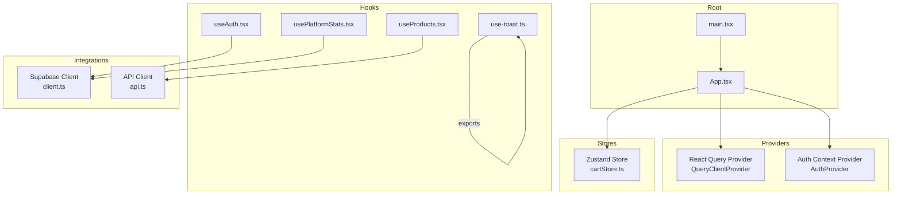
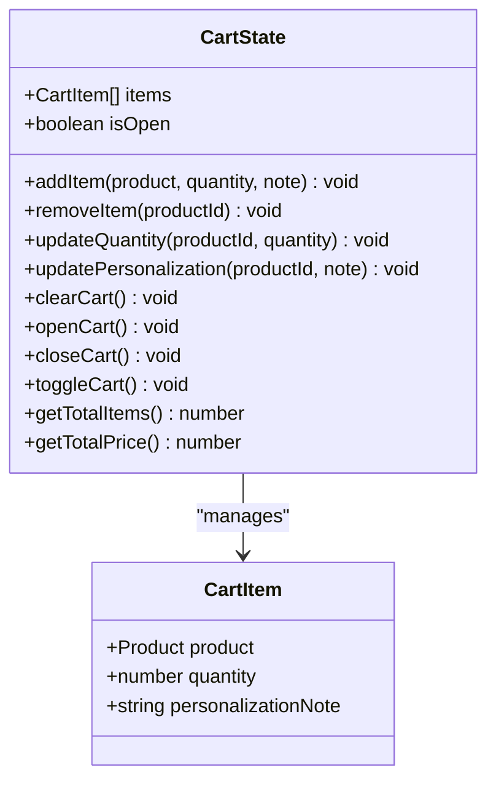
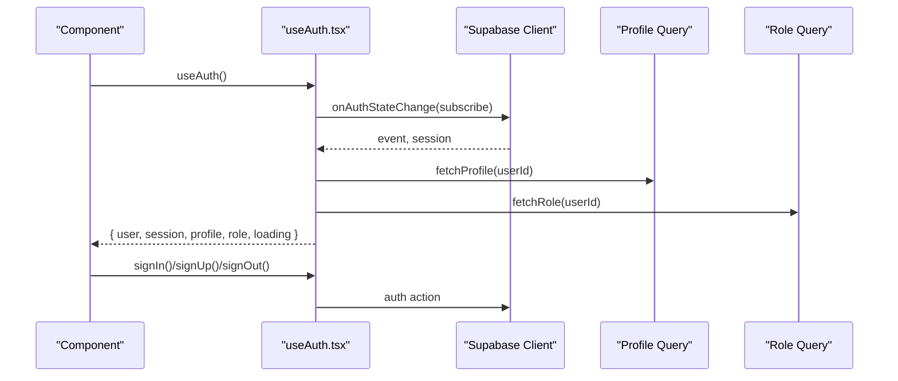
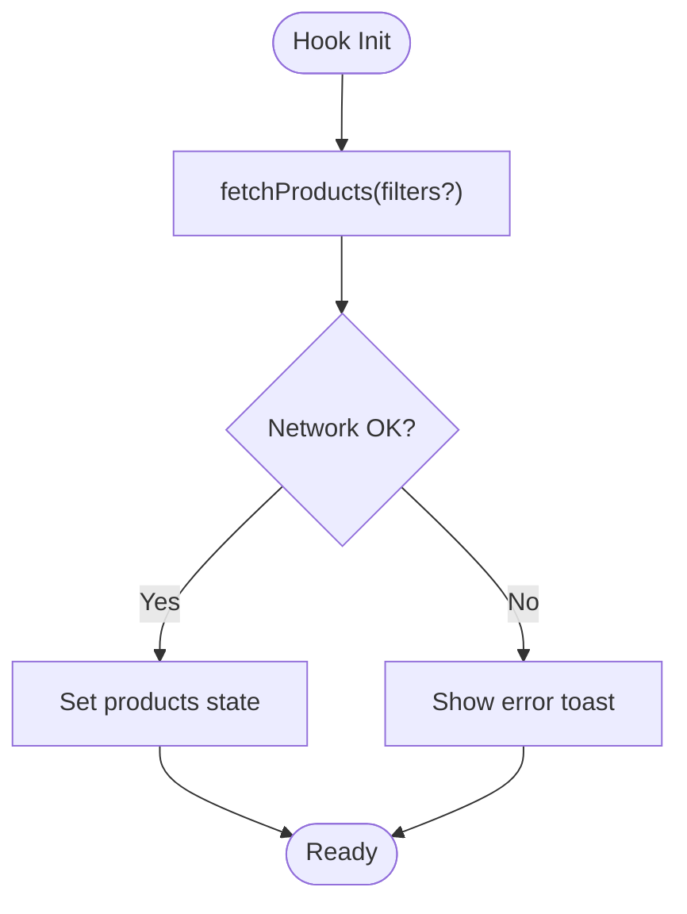
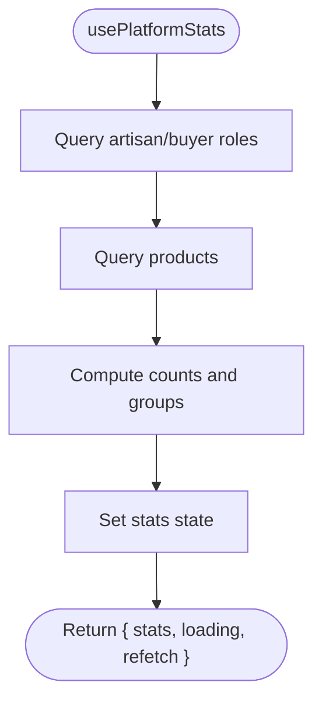
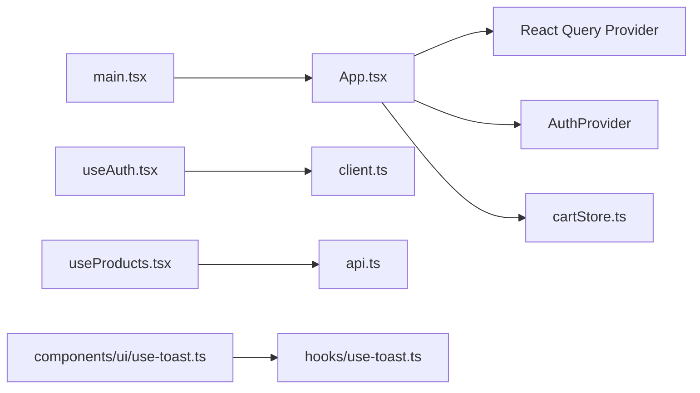

# State Management Architecture

<cite>
**Referenced Files in This Document**
- [cartStore.ts](file://apps/web/src/stores/cartStore.ts)
- [useAuth.tsx](file://apps/web/src/hooks/useAuth.tsx)
- [useProducts.tsx](file://apps/web/src/hooks/useProducts.tsx)
- [usePlatformStats.tsx](file://apps/web/src/hooks/usePlatformStats.tsx)
- [use-toast.ts](file://apps/web/src/hooks/use-toast.ts)
- [use-toast.ts](file://apps/web/src/components/ui/use-toast.ts)
- [client.ts](file://apps/web/src/integrations/supabase/client.ts)
- [App.tsx](file://apps/web/src/App.tsx)
- [main.tsx](file://apps/web/src/main.tsx)
- [api.ts](file://apps/web/src/lib/api.ts)
</cite>

## Table of Contents
1. [Introduction](#introduction)
2. [Project Structure](#project-structure)
3. [Core Components](#core-components)
4. [Architecture Overview](#architecture-overview)
5. [Detailed Component Analysis](#detailed-component-analysis)
6. [Dependency Analysis](#dependency-analysis)
7. [Performance Considerations](#performance-considerations)
8. [Troubleshooting Guide](#troubleshooting-guide)
9. [Conclusion](#conclusion)

## Introduction
This document explains Empindu’s state management architecture with a dual approach:
- Client-side state powered by Zustand for ephemeral UI and cart data.
- Server state managed via React Query for remote data fetching, caching, and synchronization.

It documents the cart store, authentication state, and data-fetching patterns, along with custom hooks (useAuth, useProducts, usePlatformStats, useToast), state synchronization strategies, optimistic updates, cache invalidation, performance considerations, persistence, and debugging techniques.

## Project Structure
Empindu’s frontend is organized around a clear separation of concerns:
- Stores: Zustand-backed stores for client-side state (e.g., cart).
- Hooks: Custom hooks encapsulating domain logic and data fetching.
- Integrations: Supabase client configuration and typed database access.
- Pages and UI: React components and UI primitives.
- Root setup: App initializes React Query and providers.



**Diagram sources**
- [main.tsx:1-6](file://apps/web/src/main.tsx#L1-L6)
- [App.tsx:1-59](file://apps/web/src/App.tsx#L1-L59)
- [cartStore.ts:1-115](file://apps/web/src/stores/cartStore.ts#L1-L115)
- [useAuth.tsx:1-177](file://apps/web/src/hooks/useAuth.tsx#L1-L177)
- [useProducts.tsx:1-135](file://apps/web/src/hooks/useProducts.tsx#L1-L135)
- [usePlatformStats.tsx:1-94](file://apps/web/src/hooks/usePlatformStats.tsx#L1-L94)
- [use-toast.ts:1-4](file://apps/web/src/components/ui/use-toast.ts#L1-4)
- [client.ts:1-17](file://apps/web/src/integrations/supabase/client.ts#L1-L17)
- [api.ts](file://apps/web/src/lib/api.ts)

**Section sources**
- [main.tsx:1-6](file://apps/web/src/main.tsx#L1-L6)
- [App.tsx:1-59](file://apps/web/src/App.tsx#L1-L59)

## Core Components
- Zustand cart store: Manages cart items, UI visibility, totals, and persistence.
- Authentication hook: Provides Supabase-based auth state, profile, roles, and actions.
- Data-fetching hooks: useProducts and usePlatformStats encapsulate product and analytics queries.
- Toast utilities: Centralized toast exports for UI feedback.

Key responsibilities:
- Zustand: Fast, minimal client state with persistence and derived helpers.
- React Query: Centralized server-state caching, refetching, and cache invalidation.
- Supabase: Auth state synchronization and real-time-like event handling.

**Section sources**
- [cartStore.ts:1-115](file://apps/web/src/stores/cartStore.ts#L1-L115)
- [useAuth.tsx:1-177](file://apps/web/src/hooks/useAuth.tsx#L1-L177)
- [useProducts.tsx:1-135](file://apps/web/src/hooks/useProducts.tsx#L1-L135)
- [usePlatformStats.tsx:1-94](file://apps/web/src/hooks/usePlatformStats.tsx#L1-L94)
- [use-toast.ts:1-4](file://apps/web/src/components/ui/use-toast.ts#L1-4)

## Architecture Overview
The app initializes React Query at the root and wraps the routing tree with providers. Authentication state is managed via a context provider backed by Supabase. Zustand manages cart state locally with persistence. Data fetching for products and platform stats is handled by dedicated hooks.

```mermaid
sequenceDiagram
participant Root as "main.tsx"
participant App as "App.tsx"
participant RQP as "React Query Provider"
participant Auth as "AuthProvider"
participant Cart as "cartStore.ts"
participant UA as "useAuth.tsx"
participant SC as "Supabase Client"
participant UP as "useProducts.tsx"
participant API as "api.ts"
Root->>App : Render
App->>RQP : Wrap app with QueryClientProvider
App->>Auth : Wrap routes with AuthProvider
App->>Cart : Initialize cart store
UA->>SC : Subscribe to auth state
UP->>API : Fetch products
Note over RQP,UA : React Query caches server data; Auth syncs client state
```

**Diagram sources**
- [main.tsx:1-6](file://apps/web/src/main.tsx#L1-L6)
- [App.tsx:1-59](file://apps/web/src/App.tsx#L1-L59)
- [useAuth.tsx:1-177](file://apps/web/src/hooks/useAuth.tsx#L1-L177)
- [cartStore.ts:1-115](file://apps/web/src/stores/cartStore.ts#L1-L115)
- [useProducts.tsx:1-135](file://apps/web/src/hooks/useProducts.tsx#L1-L135)
- [client.ts:1-17](file://apps/web/src/integrations/supabase/client.ts#L1-L17)
- [api.ts](file://apps/web/src/lib/api.ts)

## Detailed Component Analysis

### Zustand Cart Store
The cart store encapsulates:
- State: items array, UI open/closed flag.
- Actions: add, remove, update quantity, update personalization, clear, open/close/toggle, and computed helpers for totals.
- Persistence: persisted to local storage with selective serialization.

Implementation highlights:
- Item deduplication and stock-aware quantity adjustments.
- Personalization notes tracked per item.
- Derived helpers compute total items and price.
- Persist middleware selectively saves items to storage.



**Diagram sources**
- [cartStore.ts:5-24](file://apps/web/src/stores/cartStore.ts#L5-L24)

**Section sources**
- [cartStore.ts:1-115](file://apps/web/src/stores/cartStore.ts#L1-L115)

### Authentication State Management (useAuth)
The useAuth hook provides:
- Context with user, session, profile, role, and loading state.
- Auth lifecycle: sign up, sign in, sign out, and profile updates.
- Real-time auth state synchronization via Supabase auth listeners.
- Deferred profile and role fetching after auth events to avoid race conditions.



**Diagram sources**
- [useAuth.tsx:68-101](file://apps/web/src/hooks/useAuth.tsx#L68-L101)
- [useAuth.tsx:103-136](file://apps/web/src/hooks/useAuth.tsx#L103-L136)
- [client.ts:11-17](file://apps/web/src/integrations/supabase/client.ts#L11-L17)

**Section sources**
- [useAuth.tsx:1-177](file://apps/web/src/hooks/useAuth.tsx#L1-L177)
- [client.ts:1-17](file://apps/web/src/integrations/supabase/client.ts#L1-L17)

### Data Fetching Patterns (useProducts)
The useProducts hook:
- Exposes product list and loading state.
- Fetches products with optional filters.
- Fetches a single product by slug.
- Integrates toast for error feedback.
- Uses a separate API client module for network requests.



**Diagram sources**
- [useProducts.tsx:72-115](file://apps/web/src/hooks/useProducts.tsx#L72-L115)
- [use-toast.ts:1-4](file://apps/web/src/components/ui/use-toast.ts#L1-4)

**Section sources**
- [useProducts.tsx:1-135](file://apps/web/src/hooks/useProducts.tsx#L1-L135)
- [api.ts](file://apps/web/src/lib/api.ts)

### Platform Stats Hook (usePlatformStats)
The usePlatformStats hook:
- Aggregates platform metrics using Supabase queries.
- Computes counts and grouped statistics.
- Returns loading and refetch capability.



**Diagram sources**
- [usePlatformStats.tsx:21-92](file://apps/web/src/hooks/usePlatformStats.tsx#L21-L92)

**Section sources**
- [usePlatformStats.tsx:1-94](file://apps/web/src/hooks/usePlatformStats.tsx#L1-L94)

### Toast Utilities (useToast)
The toast utilities provide:
- A unified export for toast and useToast from the hooks module.
- Consistent UI feedback across components.

**Section sources**
- [use-toast.ts:1-4](file://apps/web/src/components/ui/use-toast.ts#L1-4)
- [use-toast.ts](file://apps/web/src/hooks/use-toast.ts)

## Dependency Analysis
- App initialization composes providers and routes.
- Auth depends on Supabase client configuration.
- Data hooks depend on the API client module.
- UI toast utilities depend on the hooks module.



**Diagram sources**
- [main.tsx:1-6](file://apps/web/src/main.tsx#L1-L6)
- [App.tsx:1-59](file://apps/web/src/App.tsx#L1-L59)
- [useAuth.tsx:1-177](file://apps/web/src/hooks/useAuth.tsx#L1-L177)
- [client.ts:1-17](file://apps/web/src/integrations/supabase/client.ts#L1-L17)
- [useProducts.tsx:1-135](file://apps/web/src/hooks/useProducts.tsx#L1-L135)
- [api.ts](file://apps/web/src/lib/api.ts)
- [use-toast.ts:1-4](file://apps/web/src/components/ui/use-toast.ts#L1-4)
- [use-toast.ts](file://apps/web/src/hooks/use-toast.ts)

**Section sources**
- [App.tsx:1-59](file://apps/web/src/App.tsx#L1-L59)
- [useAuth.tsx:1-177](file://apps/web/src/hooks/useAuth.tsx#L1-L177)
- [client.ts:1-17](file://apps/web/src/integrations/supabase/client.ts#L1-L17)
- [useProducts.tsx:1-135](file://apps/web/src/hooks/useProducts.tsx#L1-L135)
- [use-toast.ts:1-4](file://apps/web/src/components/ui/use-toast.ts#L1-4)

## Performance Considerations
- React Query caching: Enable background refetching and efficient cache updates to minimize redundant network calls.
- Zustand selectors: Prefer narrow selectors to reduce re-renders when only part of the state changes.
- Persisted cart: Local storage persistence avoids repeated fetches but consider hydration timing to prevent hydration mismatches.
- Toast batching: Avoid excessive toasts during bulk operations to prevent UI thrashing.
- Debounced filters: For product filtering, debounce input to limit frequent fetches.

## Troubleshooting Guide
Common issues and remedies:
- Auth state desync: Verify Supabase auth listener order and deferred profile/role fetches. Ensure session restoration completes before data queries.
- Cart persistence mismatch: Confirm the persisted state shape matches the store initializer and that partialize excludes unnecessary fields.
- Network errors: Use toast to surface errors from data hooks and inspect request payloads.
- React Query cache staleness: Invalidate or refetch specific queries after mutations to keep UI in sync with server state.

**Section sources**
- [useAuth.tsx:68-101](file://apps/web/src/hooks/useAuth.tsx#L68-L101)
- [cartStore.ts:109-113](file://apps/web/src/stores/cartStore.ts#L109-L113)
- [useProducts.tsx:84-92](file://apps/web/src/hooks/useProducts.tsx#L84-L92)

## Conclusion
Empindu’s state management blends Zustand for fast, persistent client-side state and React Query for robust server-state caching and synchronization. The useAuth, useProducts, usePlatformStats, and useToast utilities encapsulate domain logic and improve developer ergonomics. By leveraging cache invalidation, optimistic updates, and careful persistence strategies, the system balances responsiveness with correctness.