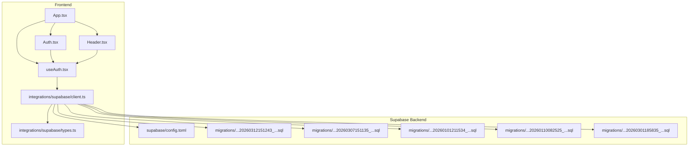
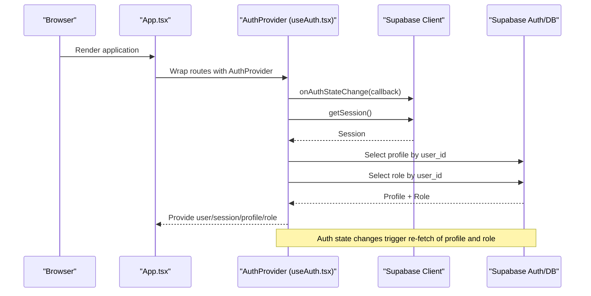
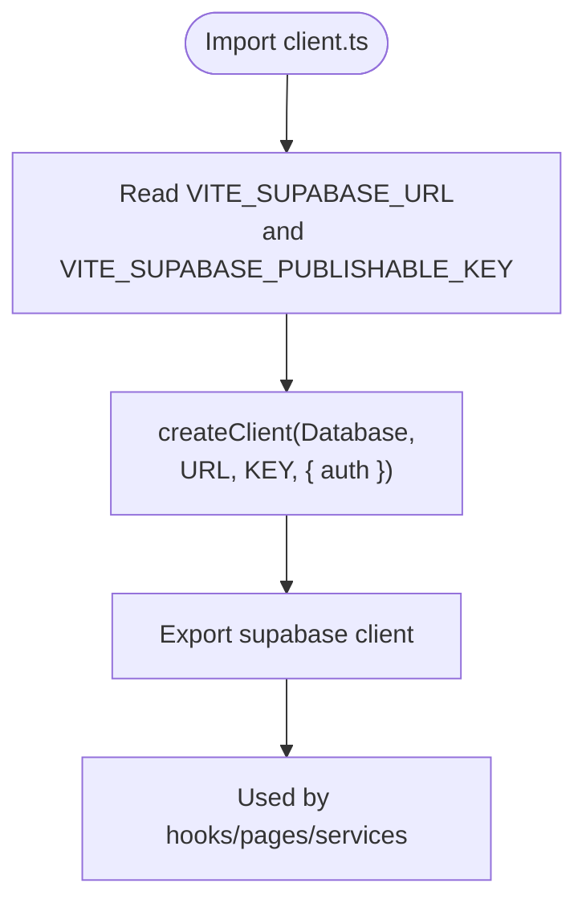
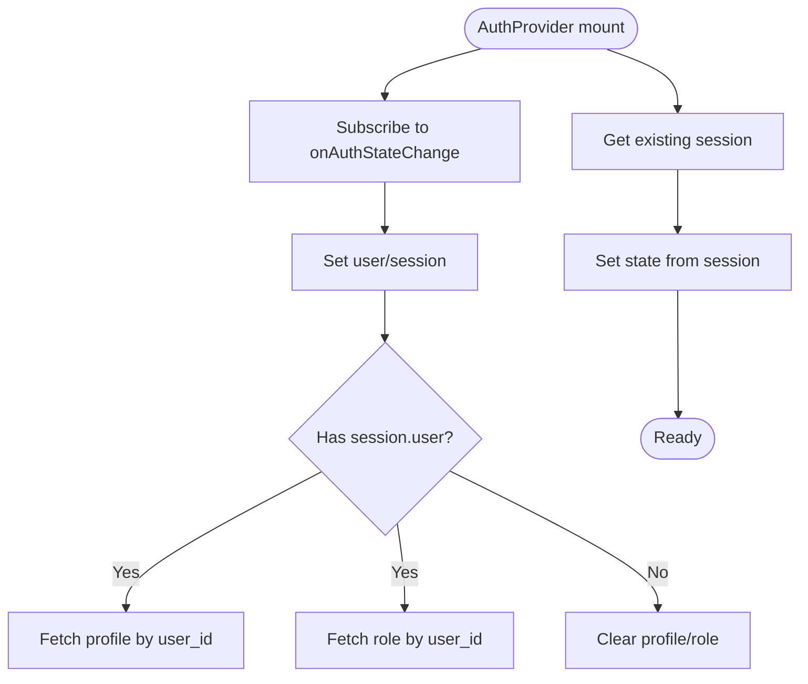
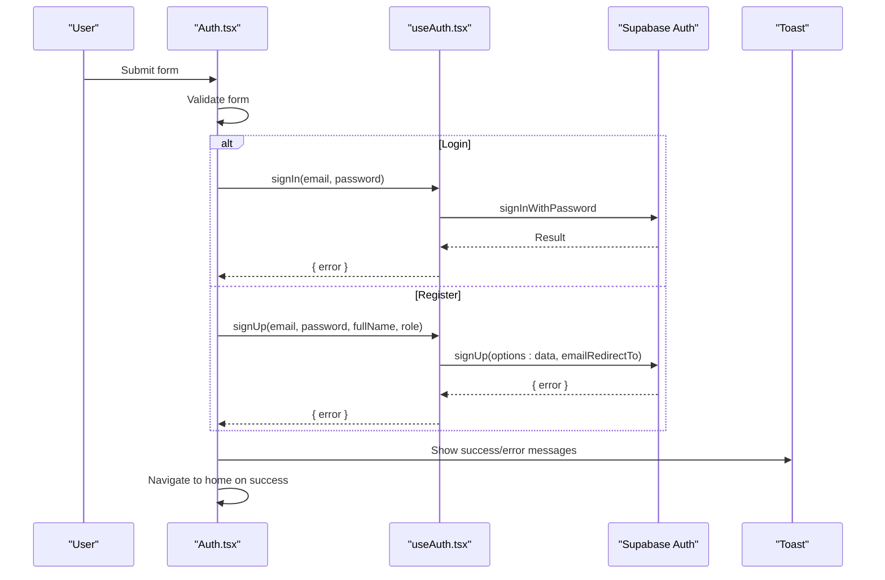
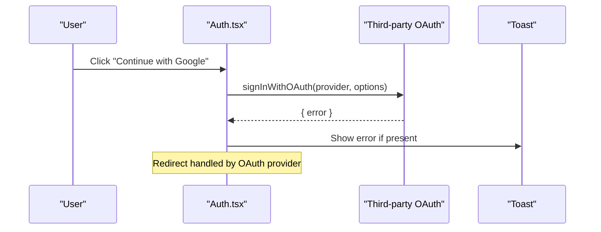
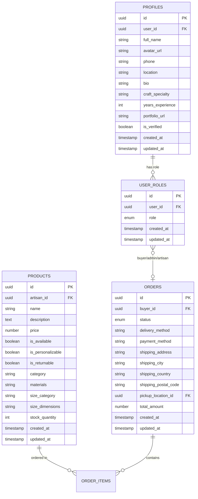
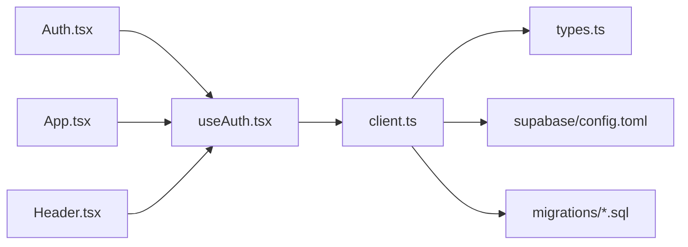

# Supabase Integration & Authentication

<cite>
**Referenced Files in This Document**
- [client.ts](file://apps/web/src/integrations/supabase/client.ts)
- [types.ts](file://apps/web/src/integrations/supabase/types.ts)
- [useAuth.tsx](file://apps/web/src/hooks/useAuth.tsx)
- [Auth.tsx](file://apps/web/src/pages/Auth.tsx)
- [App.tsx](file://apps/web/src/App.tsx)
- [Header.tsx](file://apps/web/src/components/layout/Header.tsx)
- [config.toml](file://supabase/config.toml)
- [20260312151243_54077459-7217-4c42-a35e-67af66d898f3.sql](file://supabase/migrations/20260312151243_54077459-7217-4c42-a35e-67af66d898f3.sql)
- [20260307151135_abb92613-d0a4-4ab6-8384-d241b138020b.sql](file://supabase/migrations/20260307151135_abb92613-d0a4-4ab6-8384-d241b138020b.sql)
- [20260101211534_d1ce3159-d630-4859-8ee8-6361241b244c.sql](file://supabase/migrations/20260101211534_d1ce3159-d630-4859-8ee8-6361241b244c.sql)
- [20260110082525_e26cf9e4-1e19-414d-9316-27ada8493a53.sql](file://supabase/migrations/20260110082525_e26cf9e4-1e19-414d-9316-27ada8493a53.sql)
- [20260301185835_24e7e596-6ffe-4991-964c-74e173d7213e.sql](file://supabase/migrations/20260301185835_24e7e596-6ffe-4991-964c-74e173d7213e.sql)
</cite>

## Table of Contents
1. [Introduction](#introduction)
2. [Project Structure](#project-structure)
3. [Core Components](#core-components)
4. [Architecture Overview](#architecture-overview)
5. [Detailed Component Analysis](#detailed-component-analysis)
6. [Dependency Analysis](#dependency-analysis)
7. [Performance Considerations](#performance-considerations)
8. [Troubleshooting Guide](#troubleshooting-guide)
9. [Conclusion](#conclusion)
10. [Appendices](#appendices)

## Introduction
This document explains the Supabase integration and authentication system powering the frontend. It covers client initialization, authentication flows, session and user state management, database integration patterns, row-level security (RLS) policies, and data access controls. It also documents sign-in/sign-up flows, password-based authentication, social authentication via OAuth, and how the app integrates with Next.js App Router concepts (as implemented in the current React Router-based stack). Guidance is included for extending real-time capabilities, data mutation patterns, and performance optimization.

## Project Structure
The Supabase integration centers around a typed Supabase client, a React authentication provider, and pages implementing sign-in and sign-up flows. Database schema and policies live under the Supabase migrations directory. The frontend initializes the Supabase client with environment variables and persists sessions in local storage.

**Diagram sources**
- [App.tsx:26-56](file://apps/web/src/App.tsx#L26-L56)
- [Auth.tsx:20-104](file://apps/web/src/pages/Auth.tsx#L20-L104)
- [Header.tsx:26-50](file://apps/web/src/components/layout/Header.tsx#L26-L50)
- [useAuth.tsx:37-101](file://apps/web/src/hooks/useAuth.tsx#L37-L101)
- [client.ts:11-17](file://apps/web/src/integrations/supabase/client.ts#L11-L17)
- [types.ts:9-14](file://apps/web/src/integrations/supabase/types.ts#L9-L14)
- [config.toml:1-17](file://supabase/config.toml#L1-L17)
- [20260312151243_54077459-7217-4c42-a35e-67af66d898f3.sql:1-4](file://supabase/migrations/20260312151243_54077459-7217-4c42-a35e-67af66d898f3.sql#L1-L4)
- [20260307151135_abb92613-d0a4-4ab6-8384-d241b138020b.sql:1-44](file://supabase/migrations/20260307151135_abb92613-d0a4-4ab6-8384-d241b138020b.sql#L1-L44)
- [20260101211534_d1ce3159-d630-4859-8ee8-6361241b244c.sql:1-31](file://supabase/migrations/20260101211534_d1ce3159-d630-4859-8ee8-6361241b244c.sql#L1-L31)
- [20260110082525_e26cf9e4-1e19-414d-9316-27ada8493a53.sql:1-25](file://supabase/migrations/20260110082525_e26cf9e4-1e19-414d-9316-27ada8493a53.sql#L1-L25)
- [20260301185835_24e7e596-6ffe-4991-964c-74e173d7213e.sql:1-7](file://supabase/migrations/20260301185835_24e7e596-6ffe-4991-964c-74e173d7213e.sql#L1-L7)

**Section sources**
- [App.tsx:26-56](file://apps/web/src/App.tsx#L26-L56)
- [client.ts:11-17](file://apps/web/src/integrations/supabase/client.ts#L11-L17)
- [types.ts:9-14](file://apps/web/src/integrations/supabase/types.ts#L9-L14)

## Core Components
- Supabase client initialization with environment variables and session persistence
- Typed database schema for compile-time safety
- Authentication provider managing user/session/profile/role state
- Auth page implementing sign-in, sign-up, and social OAuth initiation
- Header component displaying user menu and role-aware navigation

Key responsibilities:
- Client initialization sets storage to localStorage, persists sessions, and auto-refreshes tokens
- Auth provider subscribes to Supabase auth state changes, hydrates profile and role, and exposes sign-in/sign-up/sign-out/updateProfile
- Auth page validates forms, handles submit flows, and triggers social OAuth via a third-party integration

**Section sources**
- [client.ts:11-17](file://apps/web/src/integrations/supabase/client.ts#L11-L17)
- [types.ts:9-14](file://apps/web/src/integrations/supabase/types.ts#L9-L14)
- [useAuth.tsx:37-101](file://apps/web/src/hooks/useAuth.tsx#L37-L101)
- [Auth.tsx:20-104](file://apps/web/src/pages/Auth.tsx#L20-L104)

## Architecture Overview
The frontend composes a typed Supabase client and a React authentication provider. The provider listens to Supabase auth state changes, fetches profile and role data, and exposes a cohesive hook for downstream components. Authentication flows are handled by Supabase for password-based auth and by a separate OAuth integration for social sign-in.

**Diagram sources**
- [App.tsx:32-33](file://apps/web/src/App.tsx#L32-L33)
- [useAuth.tsx:68-101](file://apps/web/src/hooks/useAuth.tsx#L68-L101)
- [useAuth.tsx:44-66](file://apps/web/src/hooks/useAuth.tsx#L44-L66)

**Section sources**
- [App.tsx:26-56](file://apps/web/src/App.tsx#L26-L56)
- [useAuth.tsx:37-101](file://apps/web/src/hooks/useAuth.tsx#L37-L101)

## Detailed Component Analysis

### Supabase Client Initialization
- Creates a typed client using Vite environment variables for Supabase URL and publishable key
- Configures auth storage to localStorage, enables session persistence, and auto token refresh
- Exports a singleton client for use across the app

**Diagram sources**
- [client.ts:5-17](file://apps/web/src/integrations/supabase/client.ts#L5-L17)

**Section sources**
- [client.ts:5-17](file://apps/web/src/integrations/supabase/client.ts#L5-L17)

### Authentication Hooks and Session Management
- Provides user, session, profile, role, and loading state
- Subscribes to Supabase auth state changes and hydrates profile and role
- Implements sign-up (with redirect-to-home), sign-in, sign-out, and profile updates
- Uses a timeout trick to avoid deadlocks during initial hydration

**Diagram sources**
- [useAuth.tsx:68-101](file://apps/web/src/hooks/useAuth.tsx#L68-L101)
- [useAuth.tsx:44-66](file://apps/web/src/hooks/useAuth.tsx#L44-L66)

**Section sources**
- [useAuth.tsx:37-101](file://apps/web/src/hooks/useAuth.tsx#L37-L101)

### Authentication Page: Sign-In/Sign-Up/Social OAuth
- Implements form validation with Zod schemas
- Handles sign-in and sign-up flows via Supabase auth
- Supports social OAuth via a third-party integration (Google), with loading states and error feedback
- Redirects authenticated users away from the Auth page

**Diagram sources**
- [Auth.tsx:73-104](file://apps/web/src/pages/Auth.tsx#L73-L104)
- [useAuth.tsx:103-128](file://apps/web/src/hooks/useAuth.tsx#L103-L128)

**Section sources**
- [Auth.tsx:20-104](file://apps/web/src/pages/Auth.tsx#L20-L104)
- [useAuth.tsx:103-128](file://apps/web/src/hooks/useAuth.tsx#L103-L128)

### Social Authentication Flow (Google)
- Initiates OAuth with a third-party integration, passing redirect URI and prompt parameters
- Displays loading states per role selection
- Handles errors and shows user-friendly toast notifications

**Diagram sources**
- [Auth.tsx:43-60](file://apps/web/src/pages/Auth.tsx#L43-L60)

**Section sources**
- [Auth.tsx:43-60](file://apps/web/src/pages/Auth.tsx#L43-L60)

### Database Integration Patterns and Data Access Controls
- Typed database schema ensures compile-time safety for tables, views, enums, and relationships
- Profiles and roles are accessed via PostgREST queries in the auth provider
- Row-level security policies enforce access control for various tables and views

Representative schema highlights:
- Enumerated order status type
- Tables for products, orders, payments, order items, pickup locations, product images, product views, artisan likes/reviews, corporate gifting, and returns
- Views and relationships defined for referential integrity

RLS policy examples:
- Admins can manage status history for corporate gift orders
- Users can view status history for their own gift orders
- Users can insert status history for their own orders
- Users can select search history records belonging to them
- Admins can view/update/delete products and manage user roles
- Artisans can view orders containing their products via a security definer function
- Product views insert policy allows anonymous tracking (by design)

**Diagram sources**
- [types.ts:684-731](file://apps/web/src/integrations/supabase/types.ts#L684-L731)
- [types.ts:624-683](file://apps/web/src/integrations/supabase/types.ts#L624-L683)
- [types.ts:365-423](file://apps/web/src/integrations/supabase/types.ts#L365-L423)

**Section sources**
- [types.ts:9-14](file://apps/web/src/integrations/supabase/types.ts#L9-L14)
- [useAuth.tsx:44-66](file://apps/web/src/hooks/useAuth.tsx#L44-L66)
- [20260307151135_abb92613-d0a4-4ab6-8384-d241b138020b.sql:15-28](file://supabase/migrations/20260307151135_abb92613-d0a4-4ab6-8384-d241b138020b.sql#L15-L28)
- [20260101211534_d1ce3159-d630-4859-8ee8-6361241b244c.sql:1-31](file://supabase/migrations/20260101211534_d1ce3159-d630-4859-8ee8-6361241b244c.sql#L1-L31)
- [20260110082525_e26cf9e4-1e19-414d-9316-27ada8493a53.sql:4-25](file://supabase/migrations/20260110082525_e26cf9e4-1e19-414d-9316-27ada8493a53.sql#L4-L25)
- [20260301185835_24e7e596-6ffe-4991-964c-74e173d7213e.sql:6-7](file://supabase/migrations/20260301185835_24e7e596-6ffe-4991-964c-74e173d7213e.sql#L6-L7)

### Real-Time Data Synchronization and Offline Strategies
Current implementation focuses on authentication state synchronization and profile/role hydration. Real-time subscriptions are not implemented in the current codebase. To extend:
- Use Supabase Realtime channels to subscribe to table changes
- Persist relevant data locally (e.g., IndexedDB or localStorage) for offline reads
- Implement optimistic updates and conflict resolution on reconnect
- Use React Query or a similar caching library to manage server state and cache invalidation

[No sources needed since this section provides general guidance]

### Next.js App Router Integration and SSR Considerations
- The current frontend uses React Router. For Next.js App Router compatibility:
  - Move authentication logic to a shared hook/service usable in both client and server contexts
  - Use middleware to protect routes and redirect unauthenticated users
  - Hydrate user/session state on the server and pass it to the client to avoid hydration mismatches
  - Ensure environment variables are available at build time and runtime

[No sources needed since this section provides general guidance]

## Dependency Analysis
The frontend depends on:
- Supabase client for auth and database operations
- Typed database schema for type-safe queries
- React Router for routing and navigation
- Third-party OAuth integration for social sign-in

**Diagram sources**
- [Auth.tsx:10-11](file://apps/web/src/pages/Auth.tsx#L10-L11)
- [useAuth.tsx:2-3](file://apps/web/src/hooks/useAuth.tsx#L2-L3)
- [client.ts:2-3](file://apps/web/src/integrations/supabase/client.ts#L2-L3)
- [types.ts:1-7](file://apps/web/src/integrations/supabase/types.ts#L1-L7)
- [App.tsx:6](file://apps/web/src/App.tsx#L6)
- [Header.tsx:13](file://apps/web/src/components/layout/Header.tsx#L13)
- [config.toml:1-17](file://supabase/config.toml#L1-L17)
- [20260312151243_54077459-7217-4c42-a35e-67af66d898f3.sql:1-4](file://supabase/migrations/20260312151243_54077459-7217-4c42-a35e-67af66d898f3.sql#L1-L4)

**Section sources**
- [client.ts:2-3](file://apps/web/src/integrations/supabase/client.ts#L2-L3)
- [types.ts:1-7](file://apps/web/src/integrations/supabase/types.ts#L1-L7)
- [App.tsx:6](file://apps/web/src/App.tsx#L6)
- [Header.tsx:13](file://apps/web/src/components/layout/Header.tsx#L13)

## Performance Considerations
- Use localStorage-backed auth to minimize network calls on subsequent visits
- Debounce or batch profile/role fetches during auth state transitions
- Leverage React Query’s caching and background refetch strategies for data-heavy pages
- Optimize image assets and lazy-load non-critical resources
- Minimize re-renders by memoizing derived data (e.g., role-based navigation items)

[No sources needed since this section provides general guidance]

## Troubleshooting Guide
Common issues and resolutions:
- Environment variables not loaded: Ensure VITE_SUPABASE_URL and VITE_SUPABASE_PUBLISHABLE_KEY are set in the environment
- Auth state not persisting: Verify localStorage availability and that the auth client is configured with storage and persistSession
- Profile/role not hydrating: Confirm that profile and user_roles tables exist and that the auth user_id matches
- Social OAuth failures: Check redirect_uri and provider configuration; inspect toast messages for error details
- RLS policy violations: Review policies for the relevant tables/views and confirm the authenticated user has the appropriate role

**Section sources**
- [client.ts:5-17](file://apps/web/src/integrations/supabase/client.ts#L5-L17)
- [useAuth.tsx:44-66](file://apps/web/src/hooks/useAuth.tsx#L44-L66)
- [Auth.tsx:43-60](file://apps/web/src/pages/Auth.tsx#L43-L60)
- [20260307151135_abb92613-d0a4-4ab6-8384-d241b138020b.sql:15-28](file://supabase/migrations/20260307151135_abb92613-d0a4-4ab6-8384-d241b138020b.sql#L15-L28)

## Conclusion
The application integrates Supabase securely with a typed client, robust authentication provider, and clear data access controls via RLS. The Auth page provides password-based and social authentication flows, while the header adapts UI based on user role. Extending the system with real-time subscriptions and offline strategies will further improve responsiveness and user experience.

[No sources needed since this section summarizes without analyzing specific files]

## Appendices

### Appendix A: Supabase Configuration
- Functions configuration disables JWT verification for selected functions

**Section sources**
- [config.toml:3-16](file://supabase/config.toml#L3-L16)

### Appendix B: Security Invoker View Fix
- Sets a view to use security_invoker to ensure proper permissions

**Section sources**
- [20260312151243_54077459-7217-4c42-a35e-67af66d898f3.sql:2-3](file://supabase/migrations/20260312151243_54077459-7217-4c42-a35e-67af66d898f3.sql#L2-L3)