# Integration Patterns

<cite>
**Referenced Files in This Document**
- [README.md](file://README.md)
- [docker-compose.yml](file://infrastructure/docker-compose.yml)
- [Procfile](file://backend/Procfile)
- [railway.toml](file://backend/railway.toml)
- [base.py](file://backend/config/settings/base.py)
- [production.py](file://backend/config/settings/production.py)
- [development.py](file://backend/config/settings/development.py)
- [package.json](file://package.json)
- [process-cash-payment/index.ts](file://supabase/functions/process-cash-payment/index.ts)
- [process-momo-payment/index.ts](file://supabase/functions/process-momo-payment/index.ts)
- [send-gift-confirmation/index.ts](file://supabase/functions/send-gift-confirmation/index.ts)
- [send-gift-order-email/index.ts](file://supabase/functions/send-gift-order-email/index.ts)
- [send-order-email/index.ts](file://supabase/functions/send-order-email/index.ts)
</cite>

## Table of Contents
1. [Introduction](#introduction)
2. [Project Structure](#project-structure)
3. [Core Components](#core-components)
4. [Architecture Overview](#architecture-overview)
5. [Detailed Component Analysis](#detailed-component-analysis)
6. [Dependency Analysis](#dependency-analysis)
7. [Performance Considerations](#performance-considerations)
8. [Troubleshooting Guide](#troubleshooting-guide)
9. [Conclusion](#conclusion)
10. [Appendices](#appendices)

## Introduction
This document describes Empindu’s integration patterns across its multi-service architecture. It covers containerization and orchestration with Docker Compose, service roles and inter-service communication, external service integrations (Stripe, Cloudinary, Telegram/WhatsApp via Supabase Edge Functions, OpenAI Whisper), webhook architectures, real-time event processing, asynchronous task coordination, deployment configurations, monitoring/logging, error handling, CI/CD and testing, and API gateway patterns with rate limiting and service discovery.

## Project Structure
Empindu is a monorepo with:
- Frontend: Next.js 14 App Router (marketplace buyer experience)
- Backend: Django 5 + django-ninja (async API), ASGI application with channels for WebSocket support
- Infrastructure: Docker Compose for local services (PostgreSQL with pgvector, Redis, Meilisearch)
- Supabase Edge Functions: serverless triggers for payment and notification workflows
- Deployment: Railway for backend, Vercel for frontend

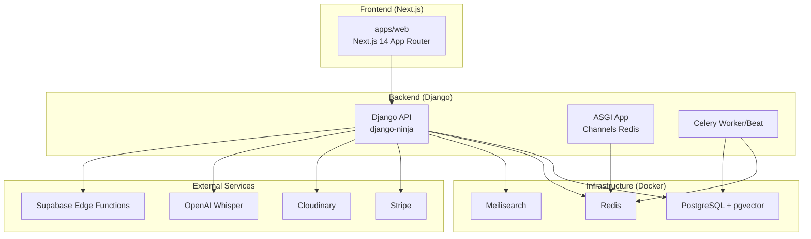

**Diagram sources**
- [docker-compose.yml:1-52](file://infrastructure/docker-compose.yml#L1-L52)
- [base.py:101-128](file://backend/config/settings/base.py#L101-L128)
- [Procfile:1-4](file://backend/Procfile#L1-L4)
- [railway.toml:1-13](file://backend/railway.toml#L1-L13)

**Section sources**
- [README.md:17-50](file://README.md#L17-L50)
- [docker-compose.yml:1-52](file://infrastructure/docker-compose.yml#L1-L52)
- [base.py:29-64](file://backend/config/settings/base.py#L29-L64)

## Core Components
- Django API (django-ninja): exposes REST endpoints under /api/v1, integrates with PostgreSQL, Redis, Meilisearch, Cloudinary, Stripe, and Supabase Edge Functions.
- ASGI application with Channels Redis: enables WebSocket support for real-time events.
- Celery: asynchronous task execution and scheduled jobs (beat).
- Supabase Edge Functions: serverless triggers for payment processing and email notifications.
- Frontend Next.js: SSR/PWA consumer of the backend API.

Key integration points:
- Payment processing via Stripe and MTN Mobile Money (via Supabase functions).
- Media storage via Cloudinary.
- Voice transcription via OpenAI Whisper.
- Customer service via Telegram/WhatsApp using Supabase Edge Functions.
- Real-time updates via Redis-backed Channels.

**Section sources**
- [base.py:101-128](file://backend/config/settings/base.py#L101-L128)
- [Procfile:1-4](file://backend/Procfile#L1-L4)
- [README.md:109-145](file://README.md#L109-L145)

## Architecture Overview
The system follows a polyglot microservice-like pattern:
- Web/API boundary: Next.js frontend communicates with Django API.
- Background work: Celery workers and beat handle async tasks and scheduling.
- Real-time: Channels Redis for live updates.
- Data plane: PostgreSQL for relational data, Redis for caching and queues, Meilisearch for search.
- Integration plane: Supabase Edge Functions for payment and notification triggers; Stripe, Cloudinary, OpenAI Whisper for external services.

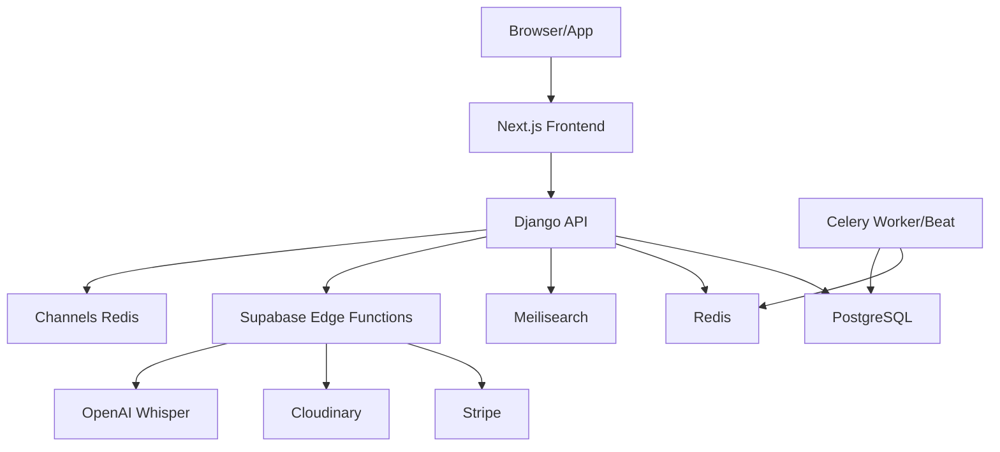

**Diagram sources**
- [base.py:101-128](file://backend/config/settings/base.py#L101-L128)
- [Procfile:1-4](file://backend/Procfile#L1-L4)
- [docker-compose.yml:4-47](file://infrastructure/docker-compose.yml#L4-L47)

## Detailed Component Analysis

### Containerization Strategy and Orchestration
- Local development: Docker Compose provisions PostgreSQL (pgvector), Redis, and Meilisearch with health checks and persistent volumes.
- Production runtime: Railway runs the ASGI application with concurrency and restart policies; Celery worker and beat are configured via Procfile.

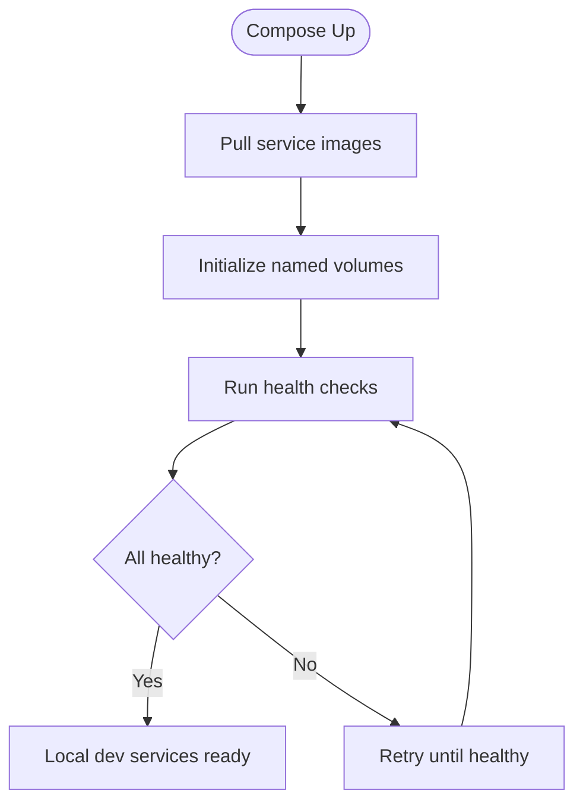

**Diagram sources**
- [docker-compose.yml:16-34](file://infrastructure/docker-compose.yml#L16-L34)

**Section sources**
- [docker-compose.yml:1-52](file://infrastructure/docker-compose.yml#L1-L52)
- [Procfile:1-4](file://backend/Procfile#L1-L4)
- [railway.toml:4-9](file://backend/railway.toml#L4-L9)

### Inter-Service Communication Patterns
- REST API: Next.js calls Django endpoints under /api/v1.
- Real-time: Channels Redis enables WebSocket connections for live updates.
- Asynchronous tasks: Celery workers consume tasks from Redis; beat schedules periodic jobs.
- Edge Functions: Supabase triggers invoke serverless handlers for payment and notification workflows.

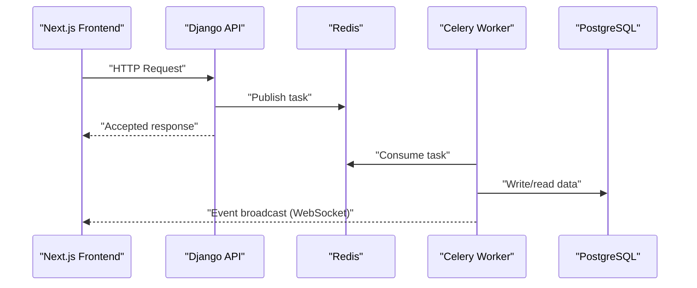

**Diagram sources**
- [base.py:120-128](file://backend/config/settings/base.py#L120-L128)
- [Procfile:2-3](file://backend/Procfile#L2-L3)

**Section sources**
- [base.py:120-128](file://backend/config/settings/base.py#L120-L128)
- [Procfile:1-4](file://backend/Procfile#L1-L4)

### External Service Integrations

#### Stripe Payment Processing
- Backend integrates Stripe via environment variables for secret and publishable keys.
- Payment flows are orchestrated through Supabase Edge Functions for cash and mobile money payments.

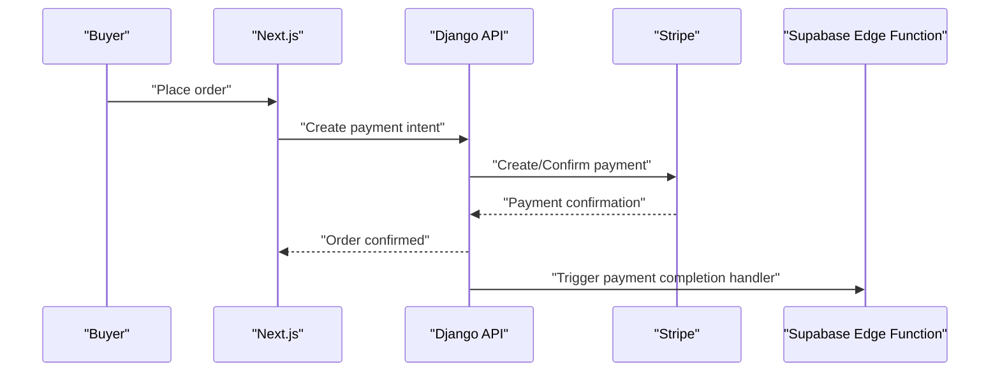

**Diagram sources**
- [README.md:128-136](file://README.md#L128-L136)
- [process-cash-payment/index.ts](file://supabase/functions/process-cash-payment/index.ts)
- [process-momo-payment/index.ts](file://supabase/functions/process-momo-payment/index.ts)

**Section sources**
- [README.md:128-136](file://README.md#L128-L136)
- [process-cash-payment/index.ts](file://supabase/functions/process-cash-payment/index.ts)
- [process-momo-payment/index.ts](file://supabase/functions/process-momo-payment/index.ts)

#### Cloudinary Media Management
- Media uploads stored on Cloudinary; Django uses cloudinary_storage and MediaCloudinaryStorage.
- Backend serves media via /media/ with configured storage settings.

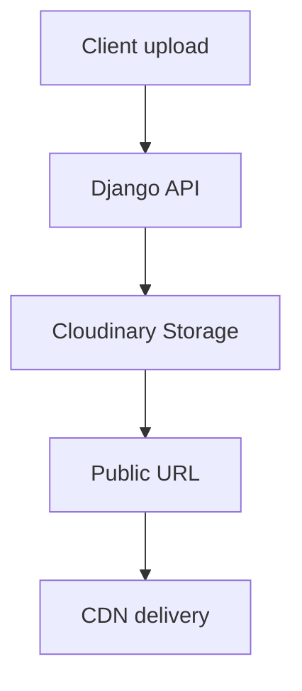

**Diagram sources**
- [base.py:157-166](file://backend/config/settings/base.py#L157-L166)

**Section sources**
- [base.py:157-166](file://backend/config/settings/base.py#L157-L166)

#### Telegram/WhatsApp Customer Service
- Customer service flows via Supabase Edge Functions for messaging integrations.
- Telegram bot integration configured with webhook secret and site URL.

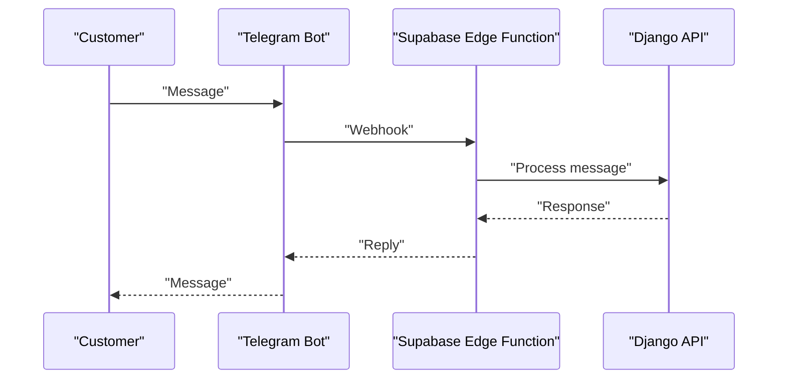

**Diagram sources**
- [README.md:138-141](file://README.md#L138-L141)
- [send-gift-confirmation/index.ts](file://supabase/functions/send-gift-confirmation/index.ts)
- [send-gift-order-email/index.ts](file://supabase/functions/send-gift-order-email/index.ts)
- [send-order-email/index.ts](file://supabase/functions/send-order-email/index.ts)

**Section sources**
- [README.md:138-141](file://README.md#L138-L141)
- [send-gift-confirmation/index.ts](file://supabase/functions/send-gift-confirmation/index.ts)
- [send-gift-order-email/index.ts](file://supabase/functions/send-gift-order-email/index.ts)
- [send-order-email/index.ts](file://supabase/functions/send-order-email/index.ts)

#### OpenAI Whisper for Voice Transcription
- Voice notes transcribed via OpenAI Whisper using configured API key.
- Used for artisan biography transcription and similar workflows.

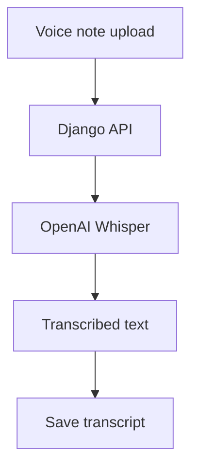

**Diagram sources**
- [README.md:143-144](file://README.md#L143-L144)

**Section sources**
- [README.md:143-144](file://README.md#L143-L144)

### Webhook Architectures and Real-Time Event Processing
- Telegram/WhatsApp webhooks: Supabase Edge Functions receive incoming messages and trigger backend actions.
- Real-time events: Channels Redis enables live updates for buyers and artisans.
- Scheduled tasks: Celery beat persists schedules in the database and triggers periodic jobs.

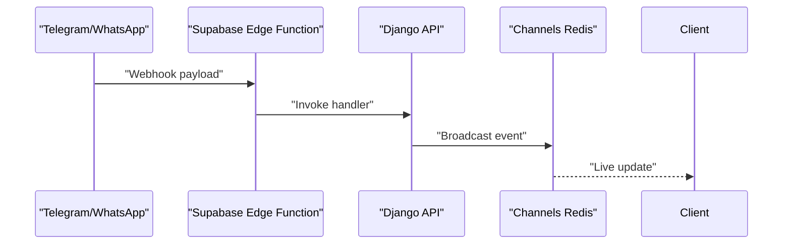

**Diagram sources**
- [README.md:138-141](file://README.md#L138-L141)
- [base.py:120-128](file://backend/config/settings/base.py#L120-L128)
- [Procfile:3](file://backend/Procfile#L3)

**Section sources**
- [README.md:138-141](file://README.md#L138-L141)
- [base.py:120-128](file://backend/config/settings/base.py#L120-L128)
- [Procfile:3](file://backend/Procfile#L3)

### Asynchronous Task Coordination
- Celery worker: processes queued tasks from Redis.
- Celery beat: schedules periodic tasks backed by the database scheduler.
- Development fallback: when Redis is unavailable, Celery falls back to the database broker and executes tasks eagerly.

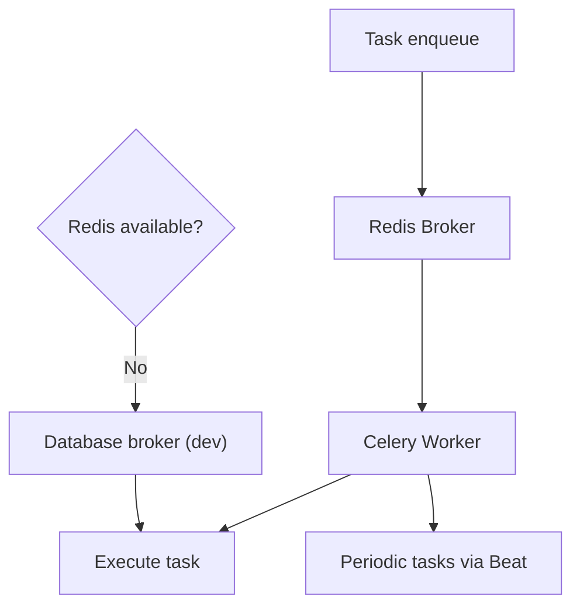

**Diagram sources**
- [base.py:111-118](file://backend/config/settings/base.py#L111-L118)
- [Procfile:2-3](file://backend/Procfile#L2-L3)

**Section sources**
- [base.py:111-118](file://backend/config/settings/base.py#L111-L118)
- [Procfile:2-3](file://backend/Procfile#L2-L3)

### Deployment Configurations
- Backend (Railway):
  - Nixpacks builder, health check path, restart policy, replicas, and Python version configured.
  - ASGI application served with Daphne.
- Frontend (Vercel):
  - Standard Vercel deployment via CLI.
- Environment variables:
  - Backend and frontend each require .env files with service credentials and URLs.

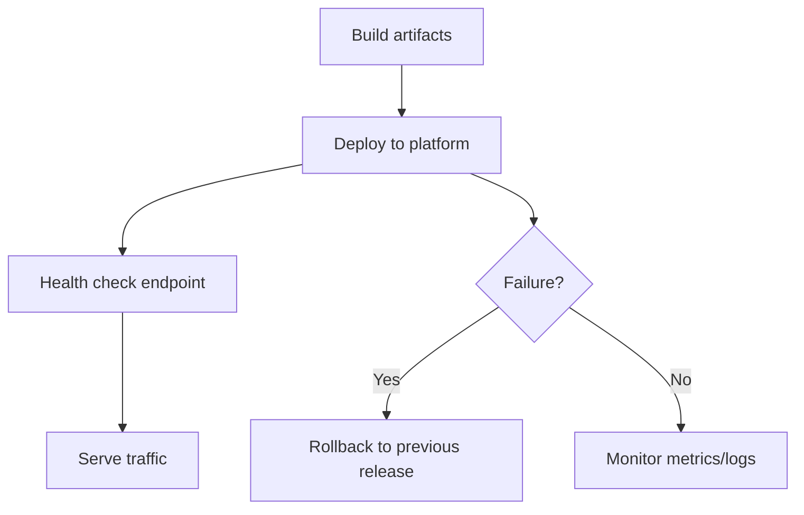

**Diagram sources**
- [railway.toml:1-13](file://backend/railway.toml#L1-L13)
- [README.md:179-203](file://README.md#L179-L203)

**Section sources**
- [railway.toml:1-13](file://backend/railway.toml#L1-L13)
- [README.md:179-203](file://README.md#L179-L203)
- [README.md:109-152](file://README.md#L109-L152)

### Monitoring and Logging Strategies
- Sentry integration in production settings for error tracking and performance profiling.
- Development disables Sentry; console email backend for outbound emails.
- Railway health check path ensures uptime visibility.

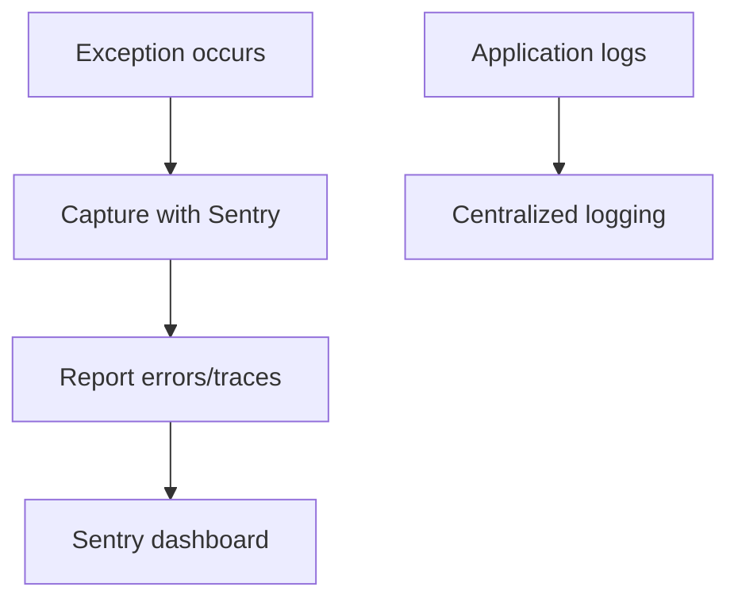

**Diagram sources**
- [production.py:23-32](file://backend/config/settings/production.py#L23-L32)
- [development.py:11-16](file://backend/config/settings/development.py#L11-L16)
- [railway.toml:6](file://backend/railway.toml#L6)

**Section sources**
- [production.py:23-32](file://backend/config/settings/production.py#L23-L32)
- [development.py:11-16](file://backend/config/settings/development.py#L11-L16)
- [railway.toml:6](file://backend/railway.toml#L6)

### Error Handling Patterns Across Service Boundaries
- Cross-origin requests controlled via CORS settings.
- Environment-driven configuration for allowed hosts and SSL redirection in production.
- Edge Functions encapsulate external provider failures; API surfaces normalized responses.

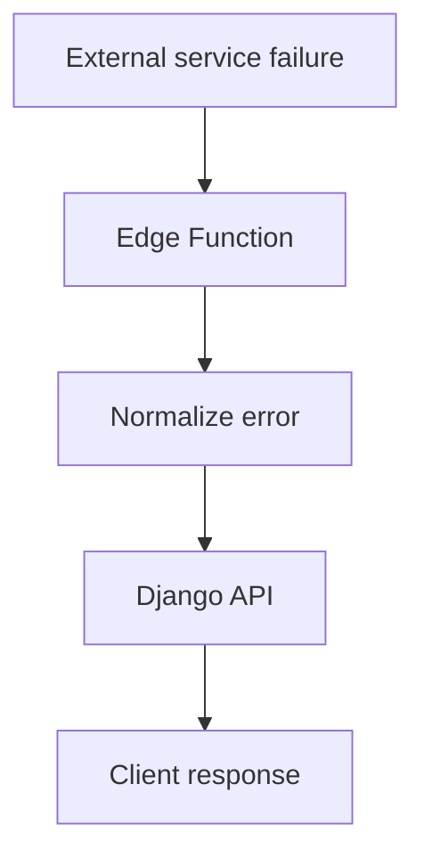

**Diagram sources**
- [base.py:167-174](file://backend/config/settings/base.py#L167-L174)
- [production.py:15-22](file://backend/config/settings/production.py#L15-L22)

**Section sources**
- [base.py:167-174](file://backend/config/settings/base.py#L167-L174)
- [production.py:15-22](file://backend/config/settings/production.py#L15-L22)

### CI/CD Pipeline Integration, Automated Testing, and Rollback Procedures
- Backend testing with pytest.
- Frontend testing with npm test.
- Railway/Vercel deployments via CLI; rollback to previous release recommended on failure.

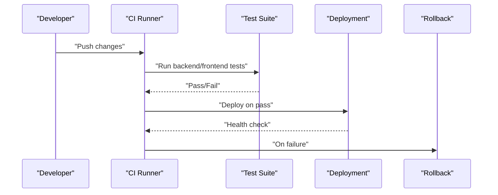

**Diagram sources**
- [README.md:205-215](file://README.md#L205-L215)
- [railway.toml:6-8](file://backend/railway.toml#L6-L8)

**Section sources**
- [README.md:205-215](file://README.md#L205-L215)
- [railway.toml:6-8](file://backend/railway.toml#L6-L8)

### API Gateway Patterns, Rate Limiting, and Service Discovery
- API gateway: Next.js proxies requests to Django API (/api/v1).
- Rate limiting: Not explicitly configured in the repository; consider platform-level limits or middleware in production.
- Service discovery: Railway-managed routing; local development uses localhost ports.

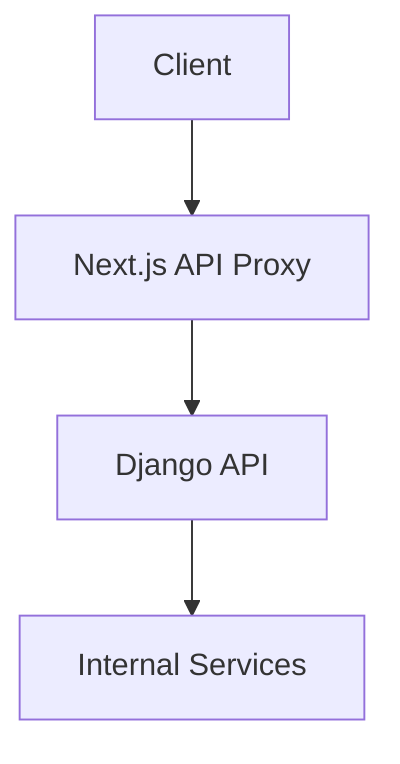

**Diagram sources**
- [README.md:103-107](file://README.md#L103-L107)
- [package.json:7](file://package.json#L7)

**Section sources**
- [README.md:103-107](file://README.md#L103-L107)
- [package.json:7](file://package.json#L7)

## Dependency Analysis
- Django settings load environment variables and configure installed apps, middleware, databases, cache, and storage.
- Supabase Edge Functions depend on environment variables for provider credentials.
- Frontend depends on NEXT_PUBLIC_* variables for API and site URLs.

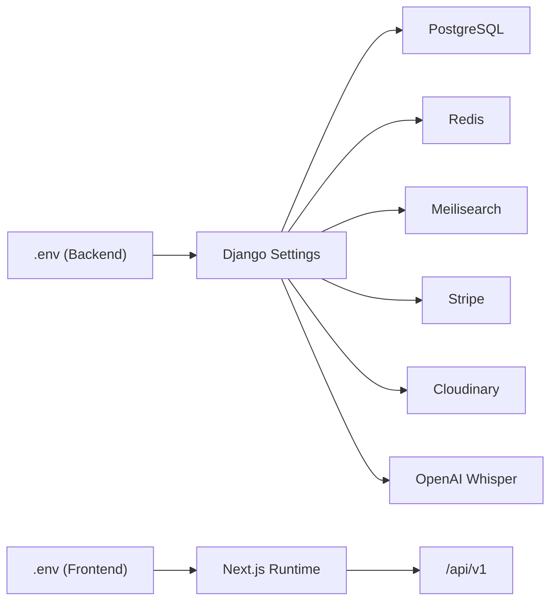

**Diagram sources**
- [base.py:11-19](file://backend/config/settings/base.py#L11-L19)
- [README.md:109-152](file://README.md#L109-L152)

**Section sources**
- [base.py:11-19](file://backend/config/settings/base.py#L11-L19)
- [README.md:109-152](file://README.md#L109-L152)

## Performance Considerations
- Use Redis for caching and queueing to reduce database load.
- Offload heavy tasks to Celery workers.
- Enable compression for static assets and consider CDN for media.
- Monitor Sentry performance profiles and optimize slow endpoints.

## Troubleshooting Guide
- Local services: Verify Docker Compose health checks for PostgreSQL, Redis, and Meilisearch.
- Celery: Confirm Redis connectivity; in development, tasks execute eagerly due to database broker fallback.
- Sentry: Ensure DSN is configured in production; disable in development.
- CORS: Confirm allowed origins match frontend origin.
- Railway: Use health check path to validate uptime.

**Section sources**
- [docker-compose.yml:16-34](file://infrastructure/docker-compose.yml#L16-L34)
- [base.py:111-118](file://backend/config/settings/base.py#L111-L118)
- [production.py:23-32](file://backend/config/settings/production.py#L23-L32)
- [base.py:167-174](file://backend/config/settings/base.py#L167-L174)
- [railway.toml:6](file://backend/railway.toml#L6)

## Conclusion
Empindu’s integration patterns combine a modern frontend with a Django backend, robust background processing via Celery, real-time capabilities with Channels Redis, and external integrations through Stripe, Cloudinary, OpenAI Whisper, and Supabase Edge Functions. The architecture emphasizes scalability, observability, and maintainability through environment-driven configuration, health checks, and centralized error reporting.

## Appendices
- Edge Functions: Review Supabase functions for payment and notification flows to understand webhook and trigger-based integrations.
- Environment Variables: Ensure all secrets are set in .env files for both backend and frontend.

**Section sources**
- [process-cash-payment/index.ts](file://supabase/functions/process-cash-payment/index.ts)
- [process-momo-payment/index.ts](file://supabase/functions/process-momo-payment/index.ts)
- [send-gift-confirmation/index.ts](file://supabase/functions/send-gift-confirmation/index.ts)
- [send-gift-order-email/index.ts](file://supabase/functions/send-gift-order-email/index.ts)
- [send-order-email/index.ts](file://supabase/functions/send-order-email/index.ts)
- [README.md:109-152](file://README.md#L109-L152)