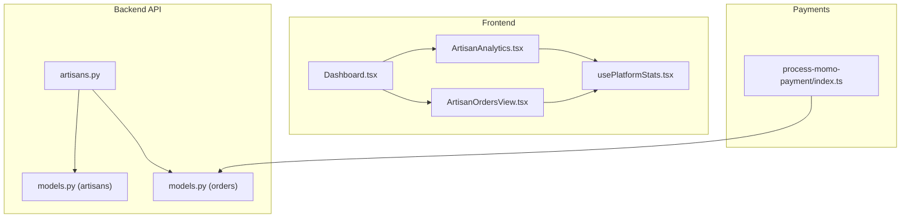
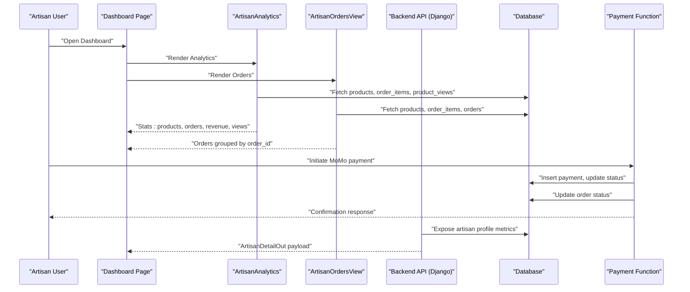
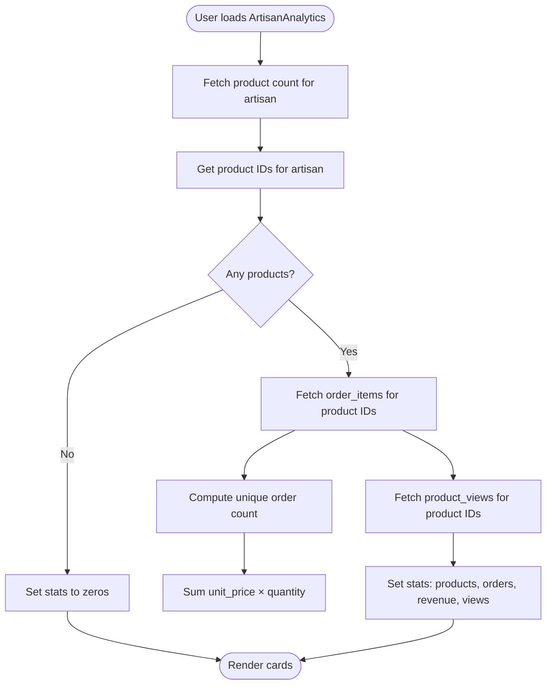
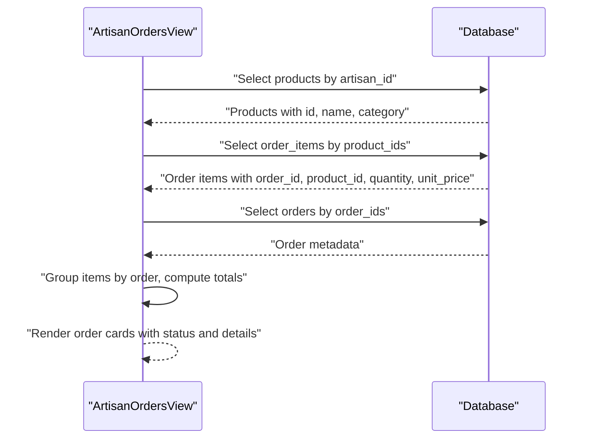
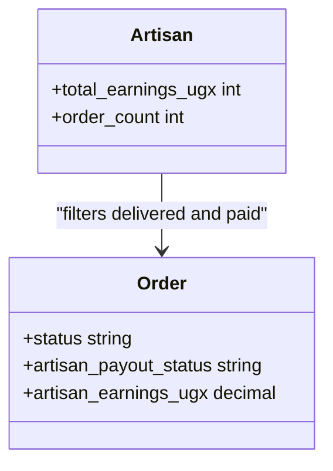
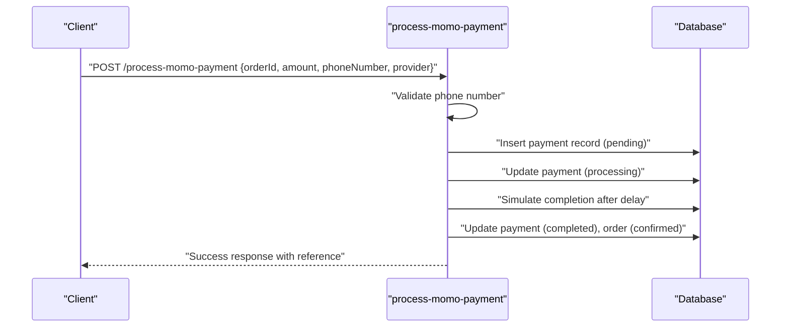
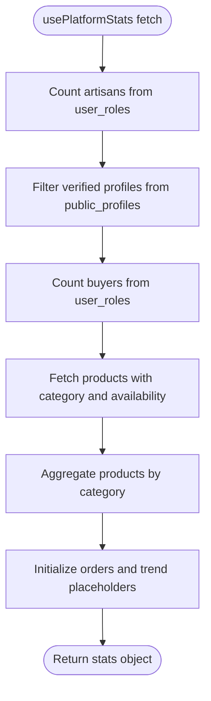
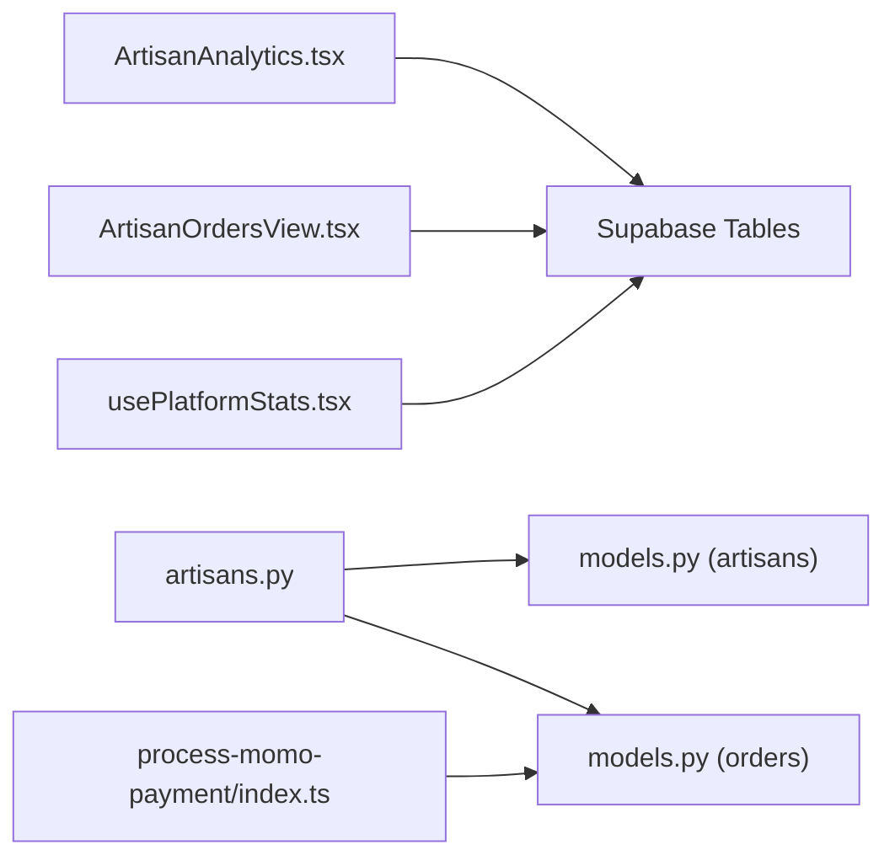

# Artisan Analytics & Dashboard

<cite>
**Referenced Files in This Document**
- [ArtisanAnalytics.tsx](file://apps/web/src/components/business/ArtisanAnalytics.tsx)
- [ArtisanOrdersView.tsx](file://apps/web/src/components/business/ArtisanOrdersView.tsx)
- [Dashboard.tsx](file://apps/web/src/pages/Dashboard.tsx)
- [usePlatformStats.tsx](file://apps/web/src/hooks/usePlatformStats.tsx)
- [artisans.py](file://backend/api/v1/artisans.py)
- [models.py (artisans)](file://backend/apps/artisans/models.py)
- [models.py (orders)](file://backend/apps/orders/models.py)
- [process-momo-payment/index.ts](file://supabase/functions/process-momo-payment/index.ts)
- [README.md](file://README.md)
- [PROGRESS_REPORT.md](file://PROGRESS_REPORT.md)
</cite>

## Table of Contents
1. [Introduction](#introduction)
2. [Project Structure](#project-structure)
3. [Core Components](#core-components)
4. [Architecture Overview](#architecture-overview)
5. [Detailed Component Analysis](#detailed-component-analysis)
6. [Dependency Analysis](#dependency-analysis)
7. [Performance Considerations](#performance-considerations)
8. [Troubleshooting Guide](#troubleshooting-guide)
9. [Conclusion](#conclusion)
10. [Appendices](#appendices)

## Introduction
This document explains the artisan analytics and dashboard functionality for monitoring sales, earnings, orders, and business insights. It covers:
- The artisan analytics dashboard for earnings tracking, order volume, customer acquisition proxies, and performance indicators
- The artisan orders view interface for sales activity, delivery status, and customer feedback
- Earnings calculation methodology including total earnings, order counts, and payout status
- Business insights such as popular products, seasonal trends, and geographic distribution
- Integration with mobile money payment providers and automated transfer mechanisms
- Performance benchmarks, comparison metrics against platform averages, and growth tracking

## Project Structure
The artisan analytics and dashboard span frontend React components, backend Django APIs, Supabase functions, and database models. The dashboard page composes the analytics and orders components and exposes them to authenticated artisans.

**Diagram sources**
- [Dashboard.tsx:13-87](file://apps/web/src/pages/Dashboard.tsx#L13-L87)
- [ArtisanAnalytics.tsx:1-78](file://apps/web/src/components/business/ArtisanAnalytics.tsx#L1-L78)
- [ArtisanOrdersView.tsx:1-126](file://apps/web/src/components/business/ArtisanOrdersView.tsx#L1-L126)
- [usePlatformStats.tsx:1-94](file://apps/web/src/hooks/usePlatformStats.tsx#L1-L94)
- [artisans.py:1-120](file://backend/api/v1/artisans.py#L1-L120)
- [models.py (artisans):132-151](file://backend/apps/artisans/models.py#L132-L151)
- [models.py (orders):10-122](file://backend/apps/orders/models.py#L10-L122)
- [process-momo-payment/index.ts:1-151](file://supabase/functions/process-momo-payment/index.ts#L1-L151)

**Section sources**
- [Dashboard.tsx:13-87](file://apps/web/src/pages/Dashboard.tsx#L13-L87)
- [README.md:154-177](file://README.md#L154-L177)

## Core Components
- ArtisanAnalytics: Computes and displays key metrics for the artisan’s business health.
- ArtisanOrdersView: Lists orders associated with the artisan’s products, grouped by order with status and totals.
- Dashboard: Orchestrates the artisan dashboard UI and routing.
- usePlatformStats: Provides platform-level statistics for benchmarking and comparative insights.
- Backend APIs and Models: Supply artisan profile data, earnings, order counts, and order lifecycle details.
- Payment Functions: Handle mobile money initiation and status updates.

**Section sources**
- [ArtisanAnalytics.tsx:7-78](file://apps/web/src/components/business/ArtisanAnalytics.tsx#L7-L78)
- [ArtisanOrdersView.tsx:25-126](file://apps/web/src/components/business/ArtisanOrdersView.tsx#L25-L126)
- [Dashboard.tsx:47-81](file://apps/web/src/pages/Dashboard.tsx#L47-L81)
- [usePlatformStats.tsx:4-94](file://apps/web/src/hooks/usePlatformStats.tsx#L4-L94)
- [artisans.py:52-77](file://backend/api/v1/artisans.py#L52-L77)
- [models.py (artisans):132-151](file://backend/apps/artisans/models.py#L132-L151)
- [models.py (orders):16-85](file://backend/apps/orders/models.py#L16-L85)
- [process-momo-payment/index.ts:17-151](file://supabase/functions/process-momo-payment/index.ts#L17-L151)

## Architecture Overview
The artisan dashboard integrates frontend analytics and orders with backend models and payment functions. The frontend queries Supabase for product and order data, while backend endpoints expose artisan profile metrics. Payment functions manage mobile money requests and update order/payment records.

**Diagram sources**
- [Dashboard.tsx:47-81](file://apps/web/src/pages/Dashboard.tsx#L47-L81)
- [ArtisanAnalytics.tsx:16-44](file://apps/web/src/components/business/ArtisanAnalytics.tsx#L16-L44)
- [ArtisanOrdersView.tsx:34-57](file://apps/web/src/components/business/ArtisanOrdersView.tsx#L34-L57)
- [artisans.py:52-77](file://backend/api/v1/artisans.py#L52-L77)
- [models.py (orders):16-85](file://backend/apps/orders/models.py#L16-L85)
- [process-momo-payment/index.ts:54-125](file://supabase/functions/process-momo-payment/index.ts#L54-L125)

## Detailed Component Analysis

### Artisan Analytics Dashboard
The analytics component aggregates:
- Total products listed by the artisan
- Unique orders for those products
- Revenue computed from order items
- Product views across listed items

It groups metrics into visually distinct cards and indicates future enhancements for deeper charts and trends.

**Diagram sources**
- [ArtisanAnalytics.tsx:16-44](file://apps/web/src/components/business/ArtisanAnalytics.tsx#L16-L44)

**Section sources**
- [ArtisanAnalytics.tsx:7-78](file://apps/web/src/components/business/ArtisanAnalytics.tsx#L7-L78)

### Artisan Orders View
The orders view:
- Loads the artisan’s products
- Resolves order items for those products
- Joins order metadata to group items by order
- Renders order summaries with status badges, dates, totals, and shipping/payment details

**Diagram sources**
- [ArtisanOrdersView.tsx:34-57](file://apps/web/src/components/business/ArtisanOrdersView.tsx#L34-L57)

**Section sources**
- [ArtisanOrdersView.tsx:25-126](file://apps/web/src/components/business/ArtisanOrdersView.tsx#L25-L126)

### Backend Earnings and Order Count Properties
The backend models expose:
- Total earnings computed from delivered orders where payout status is paid
- Delivered order count for the artisan

These properties feed the public artisan profile endpoint and inform analytics.

**Diagram sources**
- [models.py (artisans):132-151](file://backend/apps/artisans/models.py#L132-L151)
- [models.py (orders):16-85](file://backend/apps/orders/models.py#L16-L85)

**Section sources**
- [models.py (artisans):132-151](file://backend/apps/artisans/models.py#L132-L151)
- [artisans.py:52-77](file://backend/api/v1/artisans.py#L52-L77)

### Mobile Money Payment Integration
The Supabase function initiates mobile money payments:
- Validates phone number format for Uganda
- Normalizes phone number to international format
- Creates a payment record with a unique transaction reference
- Updates payment status to processing
- Simulates completion and updates order status to confirmed

**Diagram sources**
- [process-momo-payment/index.ts:23-130](file://supabase/functions/process-momo-payment/index.ts#L23-L130)

**Section sources**
- [process-momo-payment/index.ts:17-151](file://supabase/functions/process-momo-payment/index.ts#L17-L151)

### Platform Benchmarks and Growth Tracking
The platform statistics hook collects high-level metrics for benchmarking:
- Counts of artisans, verified artisans, buyers
- Totals for products, available products
- Category breakdowns for products
- Placeholder structures for orders and trends

These can be used to compare an artisan’s performance against platform averages.

**Diagram sources**
- [usePlatformStats.tsx:21-86](file://apps/web/src/hooks/usePlatformStats.tsx#L21-L86)

**Section sources**
- [usePlatformStats.tsx:4-94](file://apps/web/src/hooks/usePlatformStats.tsx#L4-L94)

## Dependency Analysis
- Frontend components depend on Supabase client for data retrieval and on shared UI components.
- The orders view depends on product and order metadata to render order summaries.
- The analytics component depends on product, order_item, and product_view tables to compute metrics.
- Backend endpoints rely on models to compute earnings and order counts.
- Payment functions integrate with the orders model to update statuses upon payment completion.

**Diagram sources**
- [ArtisanAnalytics.tsx:16-44](file://apps/web/src/components/business/ArtisanAnalytics.tsx#L16-L44)
- [ArtisanOrdersView.tsx:34-57](file://apps/web/src/components/business/ArtisanOrdersView.tsx#L34-L57)
- [artisans.py:52-77](file://backend/api/v1/artisans.py#L52-L77)
- [models.py (artisans):132-151](file://backend/apps/artisans/models.py#L132-L151)
- [models.py (orders):16-85](file://backend/apps/orders/models.py#L16-L85)
- [process-momo-payment/index.ts:54-125](file://supabase/functions/process-momo-payment/index.ts#L54-L125)
- [usePlatformStats.tsx:21-86](file://apps/web/src/hooks/usePlatformStats.tsx#L21-L86)

**Section sources**
- [ArtisanAnalytics.tsx:16-44](file://apps/web/src/components/business/ArtisanAnalytics.tsx#L16-L44)
- [ArtisanOrdersView.tsx:34-57](file://apps/web/src/components/business/ArtisanOrdersView.tsx#L34-L57)
- [artisans.py:52-77](file://backend/api/v1/artisans.py#L52-L77)
- [models.py (artisans):132-151](file://backend/apps/artisans/models.py#L132-L151)
- [models.py (orders):16-85](file://backend/apps/orders/models.py#L16-L85)
- [process-momo-payment/index.ts:54-125](file://supabase/functions/process-momo-payment/index.ts#L54-L125)
- [usePlatformStats.tsx:21-86](file://apps/web/src/hooks/usePlatformStats.tsx#L21-L86)

## Performance Considerations
- Minimize N+1 queries by batching selections (already achieved via in-clauses for product IDs and order IDs).
- Use indexed columns for frequent filters (artisan_id, product_id, order_id, status).
- Defer heavy computations to background tasks or scheduled jobs for analytics aggregations.
- Cache frequently accessed platform stats to reduce repeated Supabase queries.

## Troubleshooting Guide
- Analytics show zero metrics:
  - Verify the artisan has products listed and that order_items exist for those products.
  - Confirm product views exist for the listed product IDs.
- Orders view empty:
  - Ensure the artisan has products and that order_items exist.
  - Check that orders exist for the resolved order IDs.
- Mobile money payment errors:
  - Validate phone number format and normalization logic.
  - Inspect payment record creation and status transitions.
  - Confirm background task completion and order status update.

**Section sources**
- [ArtisanAnalytics.tsx:16-44](file://apps/web/src/components/business/ArtisanAnalytics.tsx#L16-L44)
- [ArtisanOrdersView.tsx:34-57](file://apps/web/src/components/business/ArtisanOrdersView.tsx#L34-L57)
- [process-momo-payment/index.ts:33-130](file://supabase/functions/process-momo-payment/index.ts#L33-L130)

## Conclusion
The artisan analytics and dashboard provide actionable insights into product performance, order activity, and earnings. By combining frontend analytics with backend models and payment integrations, artisans can monitor their business health, track growth, and optimize performance. Future enhancements can include richer charts, seasonal trend analysis, and geographic distribution dashboards.

## Appendices

### Earnings Calculation Methodology
- Total earnings: Sum of artisan earnings from delivered orders where payout status is paid.
- Order count: Count of delivered orders attributed to the artisan.
- Payout status monitoring: Orders are marked paid when earnings are transferred to the artisan.

**Section sources**
- [models.py (artisans):132-151](file://backend/apps/artisans/models.py#L132-L151)
- [models.py (orders):34-85](file://backend/apps/orders/models.py#L34-L85)

### Business Insights and Growth Tracking
- Popular products: Derived from order_item quantities and product views.
- Seasonal trends: Can be inferred from time-series grouping of order items and platform trends.
- Geographic distribution: Available from order shipping metadata.

**Section sources**
- [ArtisanAnalytics.tsx:16-44](file://apps/web/src/components/business/ArtisanAnalytics.tsx#L16-L44)
- [ArtisanOrdersView.tsx:34-57](file://apps/web/src/components/business/ArtisanOrdersView.tsx#L34-L57)
- [usePlatformStats.tsx:21-86](file://apps/web/src/hooks/usePlatformStats.tsx#L21-L86)

### Mobile Money Payout Systems
- Provider support: MTN MoMo and Airtel Money.
- Transaction reference generation and payment record creation.
- Automated order status updates upon payment completion.

**Section sources**
- [process-momo-payment/index.ts:23-130](file://supabase/functions/process-momo-payment/index.ts#L23-L130)

### Performance Benchmarks and Comparison Metrics
- Platform averages: Verified artisans, total products, buyers, and category distributions.
- Growth tracking: Compare artisan metrics to platform totals to measure relative performance.

**Section sources**
- [usePlatformStats.tsx:21-86](file://apps/web/src/hooks/usePlatformStats.tsx#L21-L86)
- [PROGRESS_REPORT.md:395-417](file://PROGRESS_REPORT.md#L395-L417)