# Artisan Management System

<cite>
**Referenced Files in This Document**
- [README.md](file://README.md)
- [backend/api/v1/router.py](file://backend/api/v1/router.py)
- [backend/api/v1/artisans.py](file://backend/api/v1/artisans.py)
- [backend/apps/artisans/models.py](file://backend/apps/artisans/models.py)
- [backend/apps/artisans/admin.py](file://backend/apps/artisans/admin.py)
- [backend/apps/orders/models.py](file://backend/apps/orders/models.py)
- [backend/apps/heritage/models.py](file://backend/apps/heritage/models.py)
- [backend/apps/telegram_bot/__init__.py](file://backend/apps/telegram_bot/__init__.py)
- [backend/apps/ml/__init__.py](file://backend/apps/ml/__init__.py)
- [src/pages/Dashboard.tsx](file://src/pages/Dashboard.tsx)
- [src/components/business/ArtisanAnalytics.tsx](file://src/components/business/ArtisanAnalytics.tsx)
- [src/components/business/ArtisanOrdersView.tsx](file://src/components/business/ArtisanOrdersView.tsx)
- [src/components/business/BusinessRegistration.tsx](file://src/components/business/BusinessRegistration.tsx)
- [src/hooks/useAuth.tsx](file://src/hooks/useAuth.tsx)
- [supabase/functions/process-momo-payment/index.ts](file://supabase/functions/process-momo-payment/index.ts)
</cite>

## Table of Contents
1. [Introduction](#introduction)
2. [Project Structure](#project-structure)
3. [Core Components](#core-components)
4. [Architecture Overview](#architecture-overview)
5. [Detailed Component Analysis](#detailed-component-analysis)
6. [Dependency Analysis](#dependency-analysis)
7. [Performance Considerations](#performance-considerations)
8. [Troubleshooting Guide](#troubleshooting-guide)
9. [Conclusion](#conclusion)
10. [Appendices](#appendices)

## Introduction
This document describes the artisan management system that powers a production-grade artisan marketplace. It covers the complete artisan onboarding workflow from initial contact via WhatsApp/Telegram through verification and profile completion, the artisan model architecture (craft traditions, certifications, and professional profiles), the business registration process, profile management features, and the artisan analytics dashboard. It also documents the zero-cost onboarding mechanism, voice note biography transcription using OpenAI Whisper, direct pricing power features, the artisan dashboard functionality, earnings tracking, and mobile money payout automation. Verification processes, quality assurance measures, and artisan support workflows are addressed.

## Project Structure
The system is a monorepo with:
- Backend: Django 5 + django-ninja (async API), PostgreSQL, Redis, Meilisearch, and Supabase functions for payment orchestration.
- Frontend: Next.js 14 App Router (SSR, PWA) with Supabase client integration.
- Bot layer: python-telegram-bot 20 (webhook mode) for onboarding.
- ML/AI: OpenAI Whisper for voice transcription.
- Admin: Django Unfold branded operations panel.

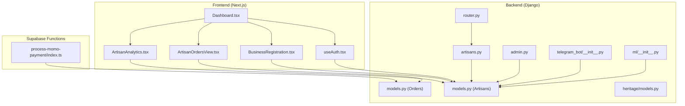

**Diagram sources**
- [backend/api/v1/router.py:1-40](file://backend/api/v1/router.py#L1-L40)
- [backend/api/v1/artisans.py:1-120](file://backend/api/v1/artisans.py#L1-L120)
- [backend/apps/artisans/models.py:1-170](file://backend/apps/artisans/models.py#L1-L170)
- [backend/apps/artisans/admin.py:1-92](file://backend/apps/artisans/admin.py#L1-L92)
- [backend/apps/orders/models.py:1-122](file://backend/apps/orders/models.py#L1-L122)
- [backend/apps/heritage/models.py:1-66](file://backend/apps/heritage/models.py#L1-L66)
- [backend/apps/telegram_bot/__init__.py:1-2](file://backend/apps/telegram_bot/__init__.py#L1-L2)
- [backend/apps/ml/__init__.py:1-2](file://backend/apps/ml/__init__.py#L1-L2)
- [src/pages/Dashboard.tsx:1-87](file://src/pages/Dashboard.tsx#L1-L87)
- [src/components/business/ArtisanAnalytics.tsx:1-78](file://src/components/business/ArtisanAnalytics.tsx#L1-L78)
- [src/components/business/ArtisanOrdersView.tsx:1-126](file://src/components/business/ArtisanOrdersView.tsx#L1-L126)
- [src/components/business/BusinessRegistration.tsx:1-205](file://src/components/business/BusinessRegistration.tsx#L1-L205)
- [src/hooks/useAuth.tsx:1-177](file://src/hooks/useAuth.tsx#L1-L177)
- [supabase/functions/process-momo-payment/index.ts:1-151](file://supabase/functions/process-momo-payment/index.ts#L1-L151)

**Section sources**
- [README.md:17-50](file://README.md#L17-L50)
- [README.md:103-108](file://README.md#L103-L108)

## Core Components
- Artisan model: Identity, craft tradition, certifications, multilingual biographies, voice draft, location, contact, payments, media, experience, and timestamps. Includes computed metrics for total earnings and order counts.
- CraftTradition model: Cultural IP anchor with GI status and heritage fund levy percentage.
- Certification model: Empindu Certified mark with requirements and activation.
- Orders model: Full lifecycle tracking with payment method, payout status, and frozen financial snapshots.
- Heritage Fund models: Immutable ledger entries and distributions to craft communities.
- API v1: Artisans endpoints for public profiles, listings, and craft traditions.
- Admin: Unfold admin with actions to certify artisans and manage voice drafts.
- Frontend Dashboard: Tabs for products, orders, analytics, business registration, and profile settings.
- Business Registration: CRUD for artisan business profiles with registration status.
- Artisan Analytics: Sales metrics aggregation for products, orders, revenue, and views.
- Artisan Orders View: Order grouping and display per artisan’s products.
- Authentication: Supabase-based auth with roles and profile retrieval.
- Mobile Money Payment Function: Supabase Edge Function for MTN MoMo/Airtel Money initiation and simulated completion.

**Section sources**
- [backend/apps/artisans/models.py:62-170](file://backend/apps/artisans/models.py#L62-L170)
- [backend/apps/artisans/models.py:14-45](file://backend/apps/artisans/models.py#L14-L45)
- [backend/apps/artisans/models.py:47-60](file://backend/apps/artisans/models.py#L47-L60)
- [backend/apps/orders/models.py:10-122](file://backend/apps/orders/models.py#L10-L122)
- [backend/apps/heritage/models.py:9-66](file://backend/apps/heritage/models.py#L9-L66)
- [backend/api/v1/artisans.py:13-120](file://backend/api/v1/artisans.py#L13-L120)
- [backend/apps/artisans/admin.py:11-92](file://backend/apps/artisans/admin.py#L11-L92)
- [src/pages/Dashboard.tsx:13-87](file://src/pages/Dashboard.tsx#L13-L87)
- [src/components/business/BusinessRegistration.tsx:30-205](file://src/components/business/BusinessRegistration.tsx#L30-L205)
- [src/components/business/ArtisanAnalytics.tsx:7-78](file://src/components/business/ArtisanAnalytics.tsx#L7-L78)
- [src/components/business/ArtisanOrdersView.tsx:25-126](file://src/components/business/ArtisanOrdersView.tsx#L25-L126)
- [src/hooks/useAuth.tsx:35-177](file://src/hooks/useAuth.tsx#L35-L177)
- [supabase/functions/process-momo-payment/index.ts:17-151](file://supabase/functions/process-momo-payment/index.ts#L17-L151)

## Architecture Overview
The system integrates frontend, backend, and Supabase functions to enable:
- Onboarding via WhatsApp/Telegram (bot layer) and web forms.
- Voice note biography transcription using Whisper (ML layer).
- Zero-cost onboarding with verified artisan profiles.
- Direct pricing power and earnings tracking.
- Mobile money payout automation via Supabase Edge Functions.
- Admin operations for verification and quality assurance.

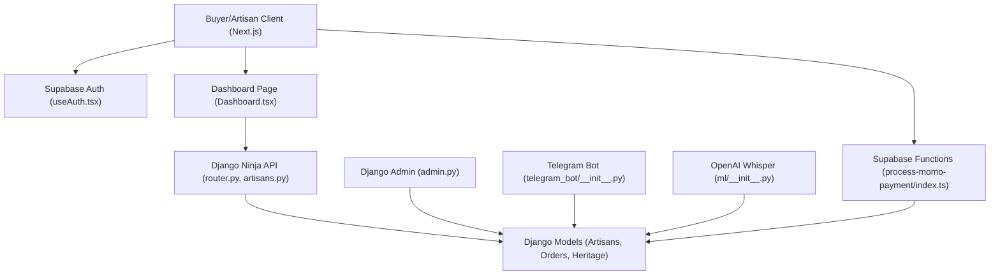

**Diagram sources**
- [src/hooks/useAuth.tsx:35-177](file://src/hooks/useAuth.tsx#L35-L177)
- [src/pages/Dashboard.tsx:13-87](file://src/pages/Dashboard.tsx#L13-L87)
- [backend/api/v1/router.py:21-40](file://backend/api/v1/router.py#L21-L40)
- [backend/api/v1/artisans.py:13-120](file://backend/api/v1/artisans.py#L13-L120)
- [backend/apps/artisans/models.py:62-170](file://backend/apps/artisans/models.py#L62-L170)
- [backend/apps/artisans/admin.py:11-92](file://backend/apps/artisans/admin.py#L11-L92)
- [backend/apps/ml/__init__.py:1-2](file://backend/apps/ml/__init__.py#L1-L2)
- [backend/apps/telegram_bot/__init__.py:1-2](file://backend/apps/telegram_bot/__init__.py#L1-L2)
- [supabase/functions/process-momo-payment/index.ts:17-151](file://supabase/functions/process-momo-payment/index.ts#L17-L151)

## Detailed Component Analysis

### Artisan Model Architecture
The artisan model encapsulates identity, craft, certifications, multilingual biographies, voice drafts, location, contact, payments, media, experience, and timestamps. It computes:
- Slug from full name.
- Total earnings from delivered orders with paid artisan payout.
- Order count for delivered orders.

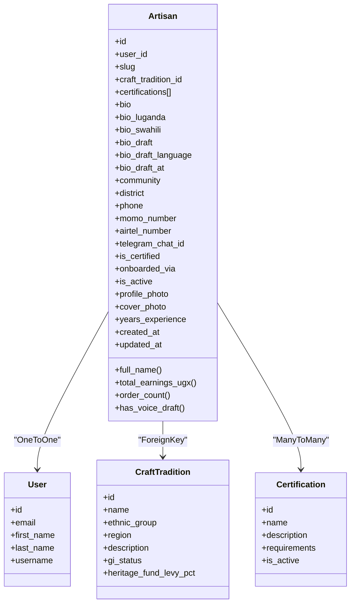

**Diagram sources**
- [backend/apps/artisans/models.py:62-170](file://backend/apps/artisans/models.py#L62-L170)

**Section sources**
- [backend/apps/artisans/models.py:62-170](file://backend/apps/artisans/models.py#L62-L170)

### Craft Traditions and Certifications
- CraftTradition: Cultural IP anchor with GI status and heritage fund levy percentage.
- Certification: Empindu Certified mark with requirements and activation flag.

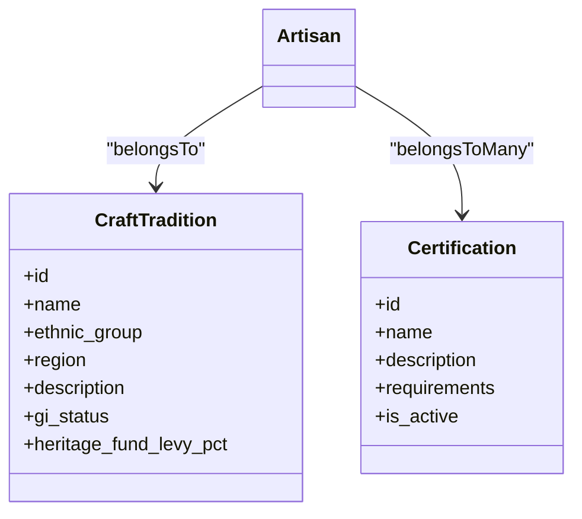

**Diagram sources**
- [backend/apps/artisans/models.py:14-45](file://backend/apps/artisans/models.py#L14-L45)
- [backend/apps/artisans/models.py:47-60](file://backend/apps/artisans/models.py#L47-L60)

**Section sources**
- [backend/apps/artisans/models.py:14-60](file://backend/apps/artisans/models.py#L14-L60)

### Orders and Payout Lifecycle
The orders model tracks the complete lifecycle from payment to delivery, including frozen financial snapshots and payout status. Payout status supports pending, processing, paid, and failed states.

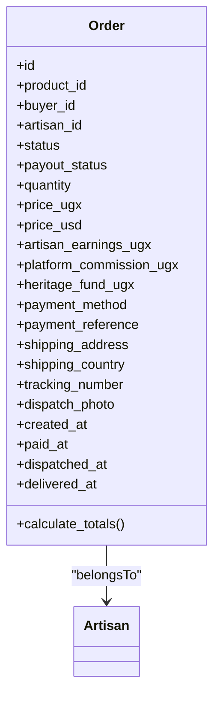

**Diagram sources**
- [backend/apps/orders/models.py:10-122](file://backend/apps/orders/models.py#L10-L122)

**Section sources**
- [backend/apps/orders/models.py:10-122](file://backend/apps/orders/models.py#L10-L122)

### Heritage Fund Ledger and Distributions
Immutable ledger entries are created for every completed order, enabling transparent impact tracking. Distributions to craft communities are managed with status tracking.

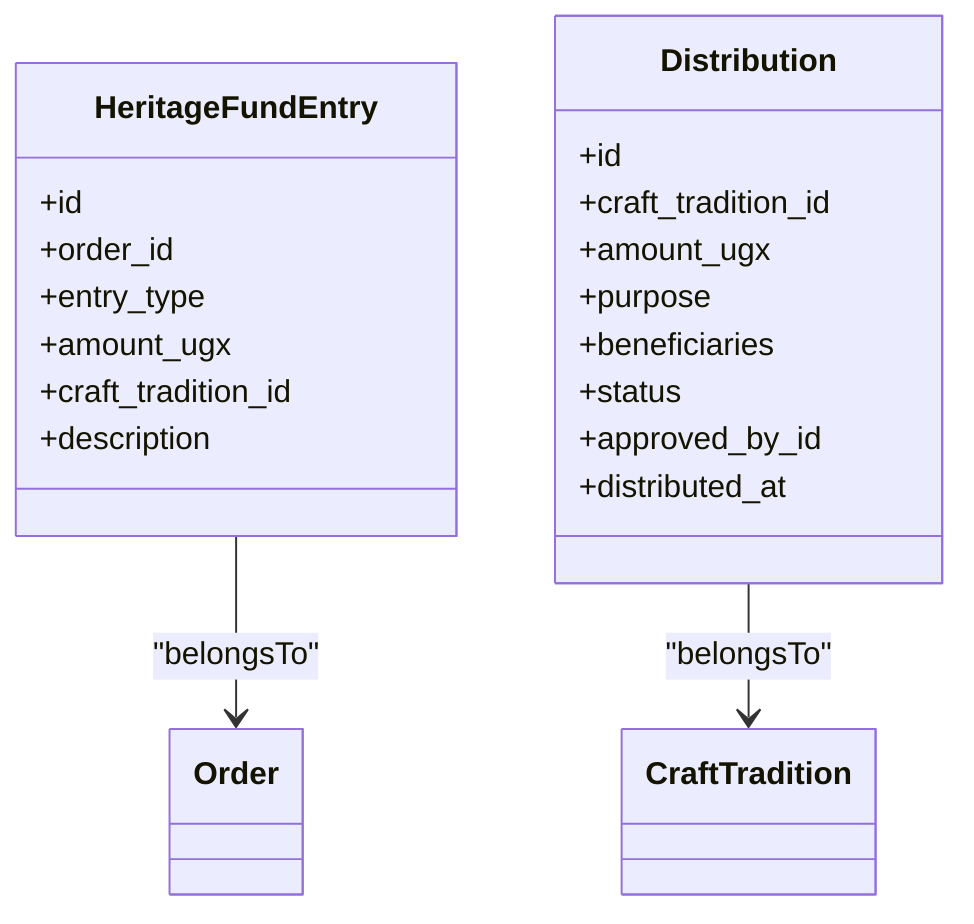

**Diagram sources**
- [backend/apps/heritage/models.py:9-66](file://backend/apps/heritage/models.py#L9-L66)

**Section sources**
- [backend/apps/heritage/models.py:9-66](file://backend/apps/heritage/models.py#L9-L66)

### Artisan Onboarding Workflow (WhatsApp/Telegram)
- Initial contact via WhatsApp/Telegram (bot layer) or web form.
- Creation of artisan profile with identity, craft tradition, and contact details.
- Voice note biography transcription using Whisper (ML layer) stored as a draft for review.
- Admin verification and certification via Django Unfold admin actions.

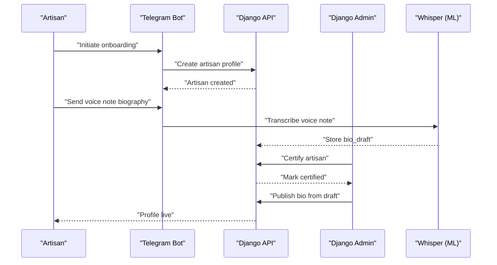

**Diagram sources**
- [backend/apps/telegram_bot/__init__.py:1-2](file://backend/apps/telegram_bot/__init__.py#L1-L2)
- [backend/apps/artisans/models.py:92-96](file://backend/apps/artisans/models.py#L92-L96)
- [backend/apps/artisans/admin.py:65-71](file://backend/apps/artisans/admin.py#L65-L71)
- [backend/apps/ml/__init__.py:1-2](file://backend/apps/ml/__init__.py#L1-L2)

**Section sources**
- [backend/apps/telegram_bot/__init__.py:1-2](file://backend/apps/telegram_bot/__init__.py#L1-L2)
- [backend/apps/artisans/models.py:92-96](file://backend/apps/artisans/models.py#L92-L96)
- [backend/apps/artisans/admin.py:65-71](file://backend/apps/artisans/admin.py#L65-L71)
- [backend/apps/ml/__init__.py:1-2](file://backend/apps/ml/__init__.py#L1-L2)

### Business Registration Process
Artisans can register and manage their business profile with fields for business name, type, tax ID, registration number, status, contact details, and description. The component fetches, updates, and persists data via Supabase.

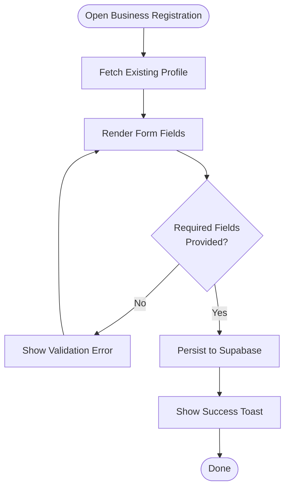

**Diagram sources**
- [src/components/business/BusinessRegistration.tsx:30-205](file://src/components/business/BusinessRegistration.tsx#L30-L205)

**Section sources**
- [src/components/business/BusinessRegistration.tsx:30-205](file://src/components/business/BusinessRegistration.tsx#L30-L205)

### Artisan Dashboard and Analytics
The dashboard organizes artisan operations into tabs: products, orders, analytics, business, and profile. The analytics component aggregates product count, order count, revenue, and views for the artisan.

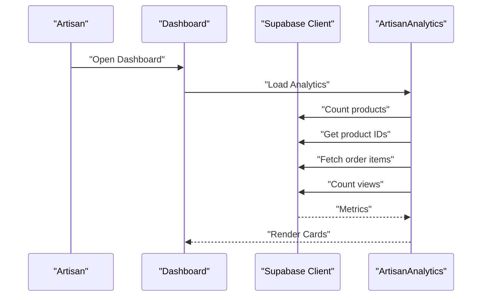

**Diagram sources**
- [src/pages/Dashboard.tsx:13-87](file://src/pages/Dashboard.tsx#L13-L87)
- [src/components/business/ArtisanAnalytics.tsx:7-78](file://src/components/business/ArtisanAnalytics.tsx#L7-L78)

**Section sources**
- [src/pages/Dashboard.tsx:13-87](file://src/pages/Dashboard.tsx#L13-L87)
- [src/components/business/ArtisanAnalytics.tsx:7-78](file://src/components/business/ArtisanAnalytics.tsx#L7-L78)

### Earnings Tracking and Mobile Money Payout Automation
Earnings are computed from delivered orders with paid artisan payout. Mobile money payments are initiated via a Supabase Edge Function that validates phone numbers, normalizes them, and simulates payment completion, updating order and payment records accordingly.

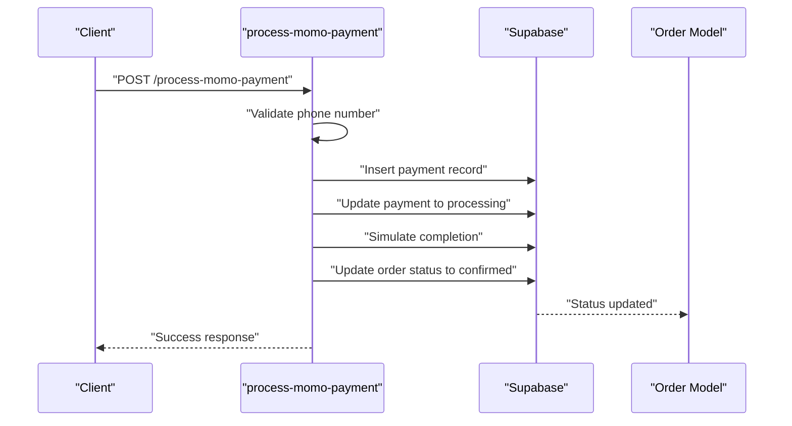

**Diagram sources**
- [supabase/functions/process-momo-payment/index.ts:17-151](file://supabase/functions/process-momo-payment/index.ts#L17-L151)
- [backend/apps/orders/models.py:56-62](file://backend/apps/orders/models.py#L56-L62)

**Section sources**
- [supabase/functions/process-momo-payment/index.ts:17-151](file://supabase/functions/process-momo-payment/index.ts#L17-L151)
- [backend/apps/orders/models.py:56-62](file://backend/apps/orders/models.py#L56-L62)

### API Endpoints for Artisans
Public endpoints expose artisan profiles, listings, and craft traditions for discovery and SSR rendering.

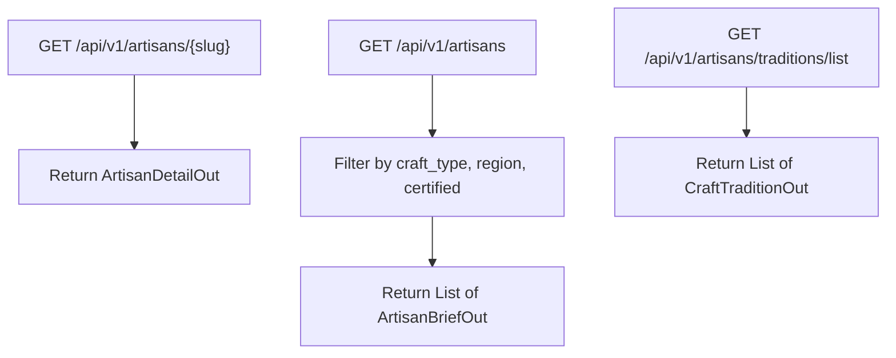

**Diagram sources**
- [backend/api/v1/artisans.py:51-120](file://backend/api/v1/artisans.py#L51-L120)

**Section sources**
- [backend/api/v1/artisans.py:51-120](file://backend/api/v1/artisans.py#L51-L120)

## Dependency Analysis
- Frontend depends on Supabase for auth and data, and on backend APIs for artisan-specific features.
- Backend depends on Django models, Unfold admin, and Supabase functions for payments.
- Telegram bot and ML modules are placeholders for future implementation.

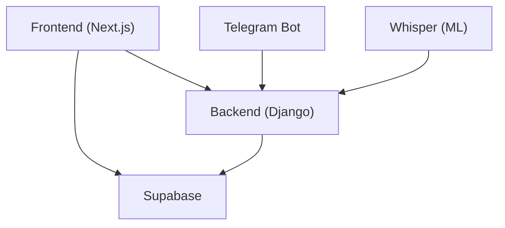

**Diagram sources**
- [src/hooks/useAuth.tsx:35-177](file://src/hooks/useAuth.tsx#L35-L177)
- [backend/api/v1/router.py:21-40](file://backend/api/v1/router.py#L21-L40)
- [backend/apps/telegram_bot/__init__.py:1-2](file://backend/apps/telegram_bot/__init__.py#L1-L2)
- [backend/apps/ml/__init__.py:1-2](file://backend/apps/ml/__init__.py#L1-L2)

**Section sources**
- [src/hooks/useAuth.tsx:35-177](file://src/hooks/useAuth.tsx#L35-L177)
- [backend/api/v1/router.py:21-40](file://backend/api/v1/router.py#L21-L40)
- [backend/apps/telegram_bot/__init__.py:1-2](file://backend/apps/telegram_bot/__init__.py#L1-L2)
- [backend/apps/ml/__init__.py:1-2](file://backend/apps/ml/__init__.py#L1-L2)

## Performance Considerations
- Use selective field queries and prefetching to minimize database load (e.g., select_related for artisan and craft_tradition).
- Cache frequently accessed artisan profiles and listings where appropriate.
- Batch operations for analytics computations (product IDs, order items, views).
- Optimize image uploads and CDN delivery for profile and cover photos.
- Asynchronous tasks for ML transcription and payment processing to avoid blocking requests.

## Troubleshooting Guide
- Authentication failures: Verify Supabase credentials and session handling in the auth hook.
- Missing artisan data: Confirm artisan profile creation and slug generation logic.
- Payment errors: Check phone number normalization and Supabase function logs for validation and completion steps.
- Admin certification: Ensure admin actions are executed on selected artisans and that voice drafts are reviewed before publishing.

**Section sources**
- [src/hooks/useAuth.tsx:35-177](file://src/hooks/useAuth.tsx#L35-L177)
- [backend/apps/artisans/models.py:157-166](file://backend/apps/artisans/models.py#L157-L166)
- [supabase/functions/process-momo-payment/index.ts:33-48](file://supabase/functions/process-momo-payment/index.ts#L33-L48)
- [backend/apps/artisans/admin.py:65-71](file://backend/apps/artisans/admin.py#L65-L71)

## Conclusion
The artisan management system provides a robust foundation for zero-cost onboarding, voice-driven biography creation, direct pricing power, and automated mobile money payouts. The architecture integrates frontend dashboards, backend APIs, Django admin, Supabase functions, and placeholder bot/ML modules to support scalable artisan growth and transparent heritage fund operations.

## Appendices
- Environment variables for backend and frontend are documented in the repository README.
- Deployment instructions for backend and frontend are provided in the repository README.

**Section sources**
- [README.md:109-152](file://README.md#L109-L152)
- [README.md:179-203](file://README.md#L179-L203)