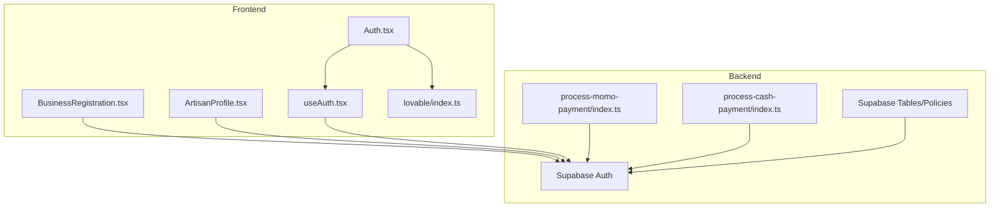
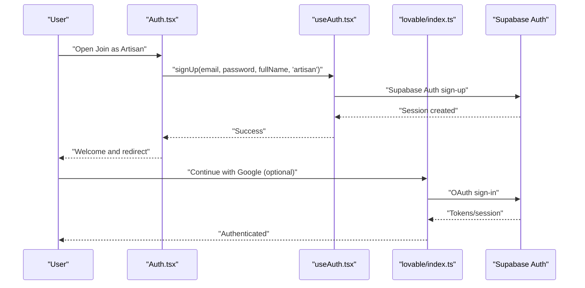
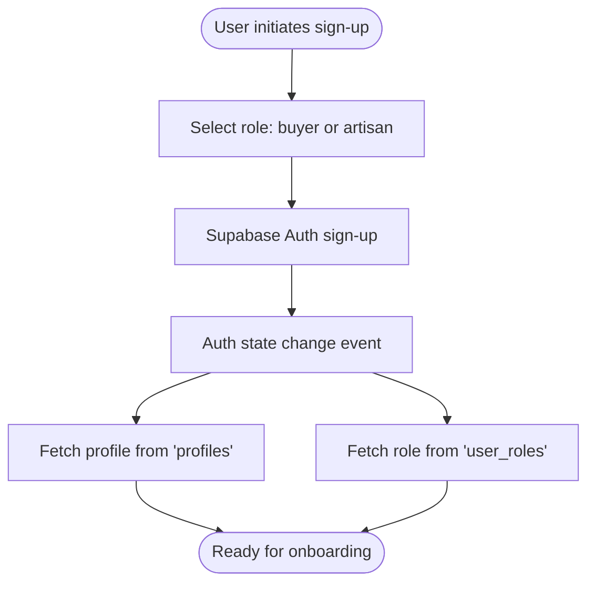
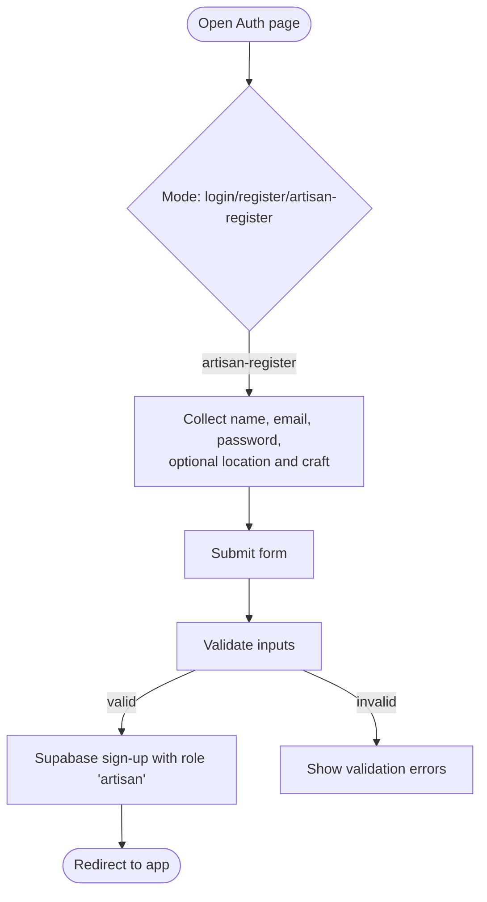
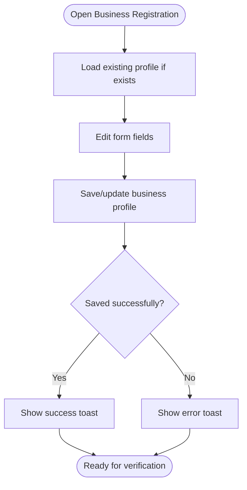
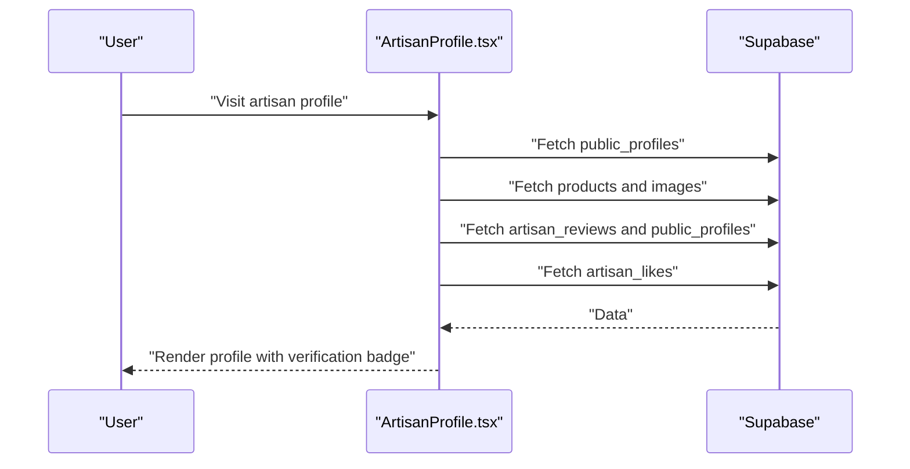
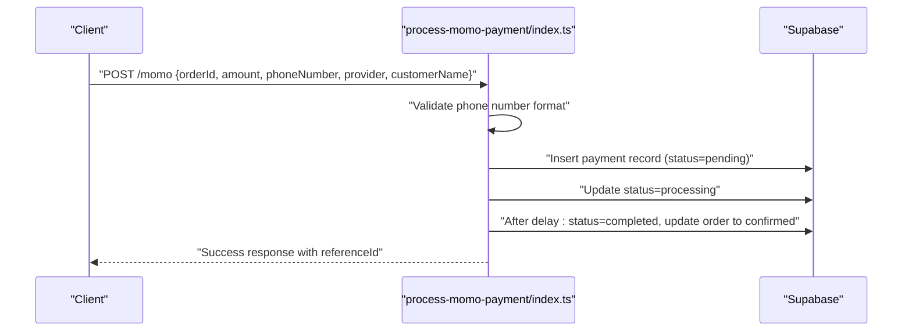
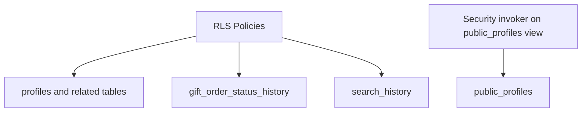
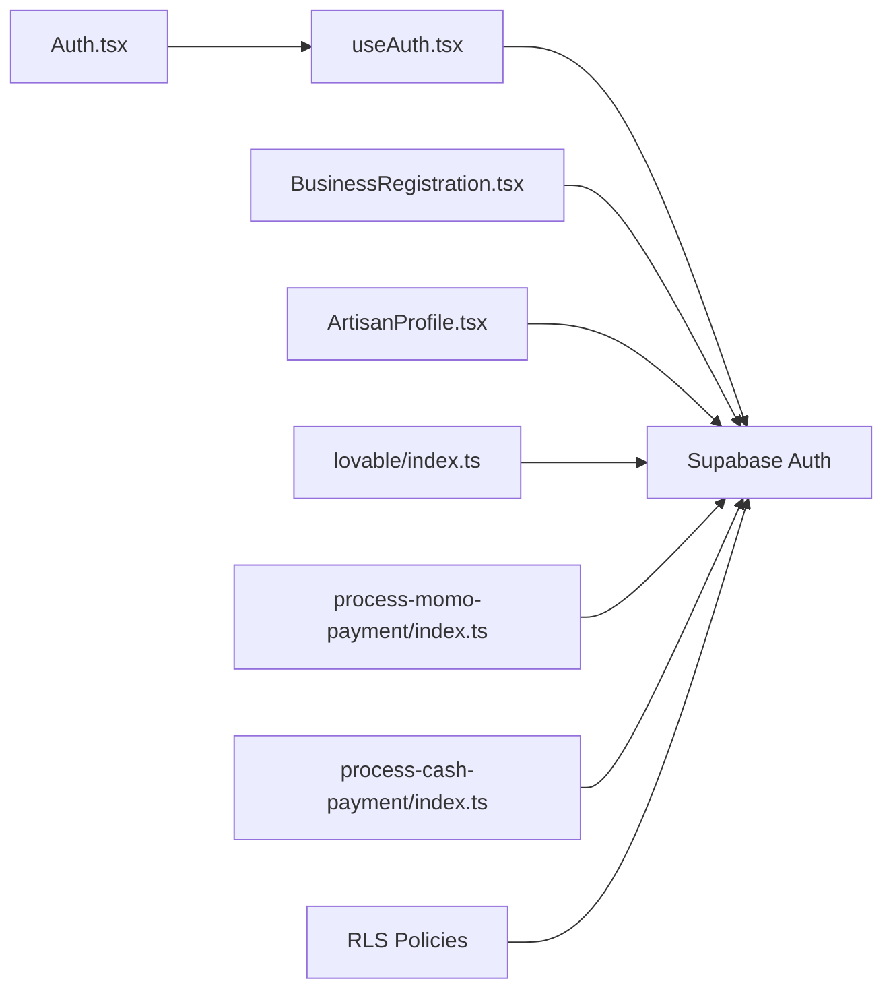

# Artisan Onboarding Workflow

<cite>
**Referenced Files in This Document**
- [BusinessRegistration.tsx](file://src/components/business/BusinessRegistration.tsx)
- [ArtisanProfile.tsx](file://src/pages/ArtisanProfile.tsx)
- [Auth.tsx](file://src/pages/Auth.tsx)
- [useAuth.tsx](file://src/hooks/useAuth.tsx)
- [index.ts](file://src/integrations/lovable/index.ts)
- [process-momo-payment/index.ts](file://supabase/functions/process-momo-payment/index.ts)
- [process-cash-payment/index.ts](file://supabase/functions/process-cash-payment/index.ts)
- [20260312151243_54077459-7217-4c42-a35e-67af66d898f3.sql](file://supabase/migrations/20260312151243_54077459-7217-4c42-a35e-67af66d898f3.sql)
- [20260307151135_abb92613-d0a4-4ab6-8384-d241b138020b.sql](file://supabase/migrations/20260307151135_abb92613-d0a4-4ab6-8384-d241b138020b.sql)
</cite>

## Table of Contents
1. [Introduction](#introduction)
2. [Project Structure](#project-structure)
3. [Core Components](#core-components)
4. [Architecture Overview](#architecture-overview)
5. [Detailed Component Analysis](#detailed-component-analysis)
6. [Dependency Analysis](#dependency-analysis)
7. [Performance Considerations](#performance-considerations)
8. [Troubleshooting Guide](#troubleshooting-guide)
9. [Conclusion](#conclusion)

## Introduction
This document describes the complete artisan onboarding workflow for the platform. It covers the journey from initial contact via email or social login, through identity and business registration, to profile completion and verification readiness. The system is designed to be zero-cost for artisans—there are no upfront fees to join. The onboarding integrates with Supabase for authentication and data, and with external mobile money providers for payment-related verification and transactions. The document also outlines multi-channel onboarding touchpoints, automated pipelines, and support mechanisms for common issues.

## Project Structure
The onboarding spans frontend React components, authentication hooks, and backend Supabase functions and policies. Key areas:
- Authentication and roles: Supabase Auth, user roles, and profile retrieval
- Onboarding UI: Artisan registration, business registration, and artisan profile
- Payments and verification: Mobile money and cash payment handlers
- Security and views: Row-level security and invoker policies

**Diagram sources**
- [Auth.tsx:1-300](file://src/pages/Auth.tsx#L1-L300)
- [BusinessRegistration.tsx:1-205](file://src/components/business/BusinessRegistration.tsx#L1-L205)
- [ArtisanProfile.tsx:1-334](file://src/pages/ArtisanProfile.tsx#L1-L334)
- [useAuth.tsx:1-177](file://src/hooks/useAuth.tsx#L1-L177)
- [index.ts:1-39](file://src/integrations/lovable/index.ts#L1-L39)
- [process-momo-payment/index.ts:1-151](file://supabase/functions/process-momo-payment/index.ts#L1-L151)
- [process-cash-payment/index.ts:1-114](file://supabase/functions/process-cash-payment/index.ts#L1-L114)

**Section sources**
- [Auth.tsx:1-300](file://src/pages/Auth.tsx#L1-L300)
- [useAuth.tsx:1-177](file://src/hooks/useAuth.tsx#L1-L177)
- [BusinessRegistration.tsx:1-205](file://src/components/business/BusinessRegistration.tsx#L1-L205)
- [ArtisanProfile.tsx:1-334](file://src/pages/ArtisanProfile.tsx#L1-L334)
- [process-momo-payment/index.ts:1-151](file://supabase/functions/process-momo-payment/index.ts#L1-L151)
- [process-cash-payment/index.ts:1-114](file://supabase/functions/process-cash-payment/index.ts#L1-L114)

## Core Components
- Authentication and roles: Handles sign-up/sign-in, role assignment, and profile retrieval
- Artisan registration: Email/password or OAuth with optional artisan-specific fields
- Business registration: Captures business details and registration status
- Artisan profile: Public-facing profile with verification badges and activity
- Payments and verification: Mobile money initiation and cash-on-delivery handling
- Security and views: Row-level security and invoker policies for data access

**Section sources**
- [useAuth.tsx:1-177](file://src/hooks/useAuth.tsx#L1-L177)
- [Auth.tsx:1-300](file://src/pages/Auth.tsx#L1-L300)
- [BusinessRegistration.tsx:1-205](file://src/components/business/BusinessRegistration.tsx#L1-L205)
- [ArtisanProfile.tsx:1-334](file://src/pages/ArtisanProfile.tsx#L1-L334)
- [process-momo-payment/index.ts:1-151](file://supabase/functions/process-momo-payment/index.ts#L1-L151)
- [process-cash-payment/index.ts:1-114](file://supabase/functions/process-cash-payment/index.ts#L1-L114)

## Architecture Overview
The onboarding pipeline begins with user registration or OAuth sign-in. After authentication, the user’s role determines the next steps. Artisans proceed through profile setup, business registration, and verification readiness. Payments and verification are integrated via Supabase Edge Functions for mobile money and cash collection.

**Diagram sources**
- [Auth.tsx:1-300](file://src/pages/Auth.tsx#L1-L300)
- [useAuth.tsx:1-177](file://src/hooks/useAuth.tsx#L1-L177)
- [index.ts:1-39](file://src/integrations/lovable/index.ts#L1-L39)

## Detailed Component Analysis

### Authentication and Role Management
- Role assignment occurs during sign-up; the backend stores a user role for access control
- Profile retrieval and role resolution are performed after auth state changes
- OAuth via Google is supported through Lovable integration

**Diagram sources**
- [useAuth.tsx:68-101](file://src/hooks/useAuth.tsx#L68-L101)
- [useAuth.tsx:103-128](file://src/hooks/useAuth.tsx#L103-L128)

**Section sources**
- [useAuth.tsx:1-177](file://src/hooks/useAuth.tsx#L1-L177)
- [Auth.tsx:1-300](file://src/pages/Auth.tsx#L1-L300)
- [index.ts:1-39](file://src/integrations/lovable/index.ts#L1-L39)

### Artisan Registration and Initial Profile Setup
- The registration page supports email/password and optional artisan-specific fields (location, craft specialty)
- On successful sign-up, the user is redirected and can proceed to profile setup

**Diagram sources**
- [Auth.tsx:62-104](file://src/pages/Auth.tsx#L62-L104)
- [useAuth.tsx:103-119](file://src/hooks/useAuth.tsx#L103-L119)

**Section sources**
- [Auth.tsx:1-300](file://src/pages/Auth.tsx#L1-L300)
- [useAuth.tsx:1-177](file://src/hooks/useAuth.tsx#L1-L177)

### Business Registration and Verification Readiness
- Business registration captures business name, type, tax ID, registration number/status, contact info, and description
- The form persists to a business profiles table and updates status indicators
- Registration status supports “unregistered,” “pending,” and “registered” states

**Diagram sources**
- [BusinessRegistration.tsx:55-108](file://src/components/business/BusinessRegistration.tsx#L55-L108)

**Section sources**
- [BusinessRegistration.tsx:1-205](file://src/components/business/BusinessRegistration.tsx#L1-L205)

### Artisan Profile and Public Visibility
- The artisan profile page displays verified badges, craft specialties, and activity metrics
- Reviews and likes are integrated, and the page pulls data from public-facing views and tables

**Diagram sources**
- [ArtisanProfile.tsx:79-114](file://src/pages/ArtisanProfile.tsx#L79-L114)

**Section sources**
- [ArtisanProfile.tsx:1-334](file://src/pages/ArtisanProfile.tsx#L1-L334)

### Payments and Verification Pipeline
- Mobile money payments: The function validates phone numbers (Uganda format), normalizes them, creates a payment record, and simulates provider processing
- Cash payments: Confirms orders and prepares cash collection instructions, optionally linking pickup locations

**Diagram sources**
- [process-momo-payment/index.ts:23-130](file://supabase/functions/process-momo-payment/index.ts#L23-L130)

**Section sources**
- [process-momo-payment/index.ts:1-151](file://supabase/functions/process-momo-payment/index.ts#L1-L151)
- [process-cash-payment/index.ts:1-114](file://supabase/functions/process-cash-payment/index.ts#L1-L114)

### Security and Access Control
- Row-level security policies govern access to sensitive tables and views
- A security invoker policy ensures a view operates under the invoker’s permissions

**Diagram sources**
- [20260307151135_abb92613-d0a4-4ab6-8384-d241b138020b.sql:1-44](file://supabase/migrations/20260307151135_abb92613-d0a4-4ab6-8384-d241b138020b.sql#L1-L44)
- [20260312151243_54077459-7217-4c42-a35e-67af66d898f3.sql:1-4](file://supabase/migrations/20260312151243_54077459-7217-4c42-a35e-67af66d898f3.sql#L1-L4)

**Section sources**
- [20260307151135_abb92613-d0a4-4ab6-8384-d241b138020b.sql:1-44](file://supabase/migrations/20260307151135_abb92613-d0a4-4ab6-8384-d241b138020b.sql#L1-L44)
- [20260312151243_54077459-7217-4c42-a35e-67af66d898f3.sql:1-4](file://supabase/migrations/20260312151243_54077459-7217-4c42-a35e-67af66d898f3.sql#L1-L4)

## Dependency Analysis
- Frontend depends on Supabase for auth and data, and on Lovable for OAuth
- Backend functions depend on Supabase service role keys and enforce phone number validation
- RLS policies protect data access and ensure proper permissions

**Diagram sources**
- [Auth.tsx:1-300](file://src/pages/Auth.tsx#L1-L300)
- [useAuth.tsx:1-177](file://src/hooks/useAuth.tsx#L1-L177)
- [BusinessRegistration.tsx:1-205](file://src/components/business/BusinessRegistration.tsx#L1-L205)
- [ArtisanProfile.tsx:1-334](file://src/pages/ArtisanProfile.tsx#L1-L334)
- [index.ts:1-39](file://src/integrations/lovable/index.ts#L1-L39)
- [process-momo-payment/index.ts:1-151](file://supabase/functions/process-momo-payment/index.ts#L1-L151)
- [process-cash-payment/index.ts:1-114](file://supabase/functions/process-cash-payment/index.ts#L1-L114)

**Section sources**
- [Auth.tsx:1-300](file://src/pages/Auth.tsx#L1-L300)
- [useAuth.tsx:1-177](file://src/hooks/useAuth.tsx#L1-L177)
- [BusinessRegistration.tsx:1-205](file://src/components/business/BusinessRegistration.tsx#L1-L205)
- [ArtisanProfile.tsx:1-334](file://src/pages/ArtisanProfile.tsx#L1-L334)
- [index.ts:1-39](file://src/integrations/lovable/index.ts#L1-L39)
- [process-momo-payment/index.ts:1-151](file://supabase/functions/process-momo-payment/index.ts#L1-L151)
- [process-cash-payment/index.ts:1-114](file://supabase/functions/process-cash-payment/index.ts#L1-L114)

## Performance Considerations
- Minimize redundant Supabase queries by batching reads and leveraging caching where appropriate
- Keep frontend forms validated early to reduce server round trips
- Offload long-running tasks (e.g., payment provider callbacks) to background functions or webhooks to avoid blocking responses

## Troubleshooting Guide
Common onboarding issues and resolutions:
- Invalid phone number format for mobile money: Ensure the number matches Uganda’s accepted formats and includes the correct country code
- Payment initiation failures: Verify environment variables for Supabase service role keys and network connectivity
- Authentication errors: Confirm OAuth redirect URI and session handling; check for existing accounts to avoid duplicates
- Profile save errors: Validate required fields and ensure the user is authenticated before saving

Support workflows:
- Use toast notifications to guide users through required fields and validation messages
- Provide clear feedback for role-based redirects and onboarding step completion
- For verification failures, present retry options and escalate to support with logs and transaction references

**Section sources**
- [process-momo-payment/index.ts:33-40](file://supabase/functions/process-momo-payment/index.ts#L33-L40)
- [Auth.tsx:78-104](file://src/pages/Auth.tsx#L78-L104)
- [BusinessRegistration.tsx:76-108](file://src/components/business/BusinessRegistration.tsx#L76-L108)

## Conclusion
The artisan onboarding workflow is designed to be seamless and cost-free, integrating secure authentication, business registration, and verification-ready profile management. With Supabase-backed auth and Edge Functions for payments, the system supports both mobile money and cash collection pathways. Robust RLS policies and invoker views ensure data integrity and access control. By following the documented flows and troubleshooting steps, artisans can complete their onboarding efficiently, while administrators maintain oversight and support.