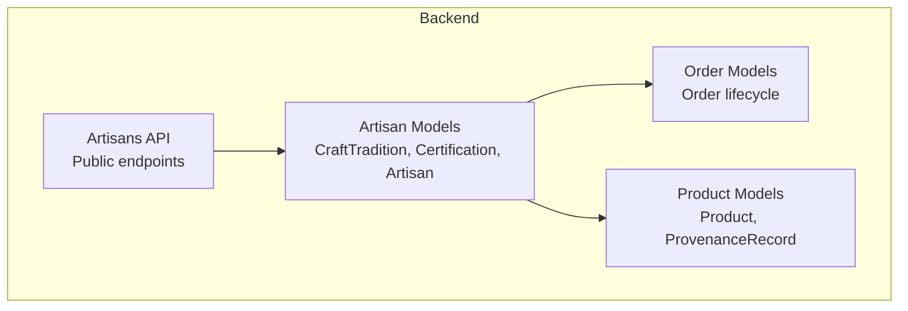
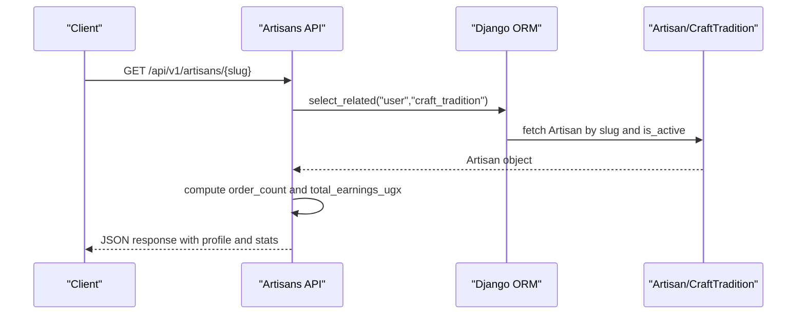
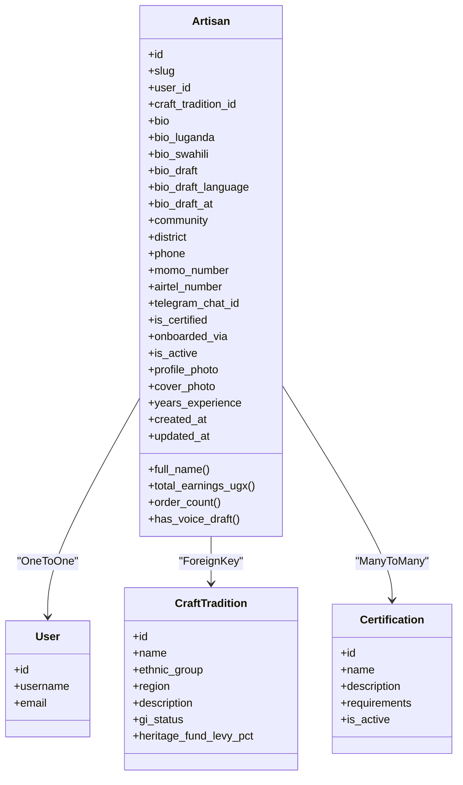
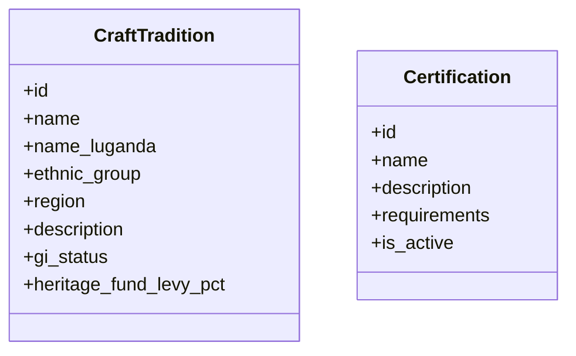
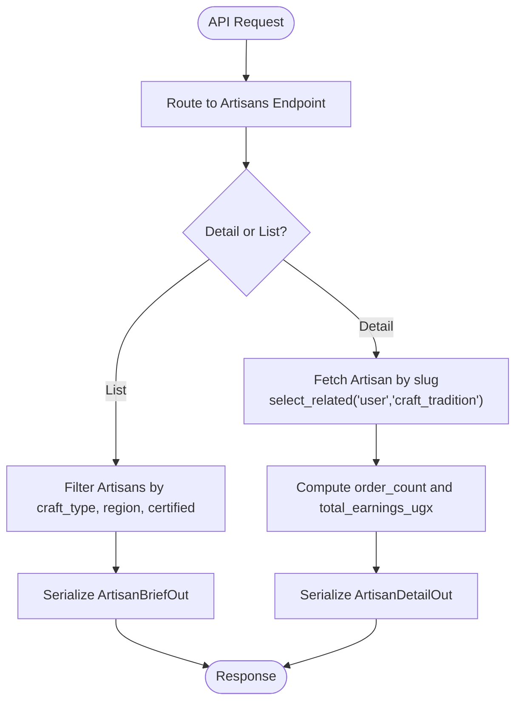
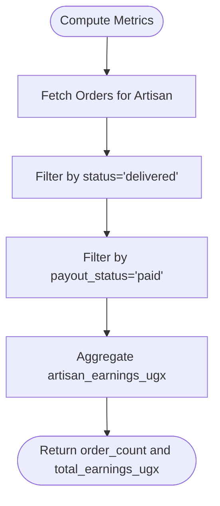
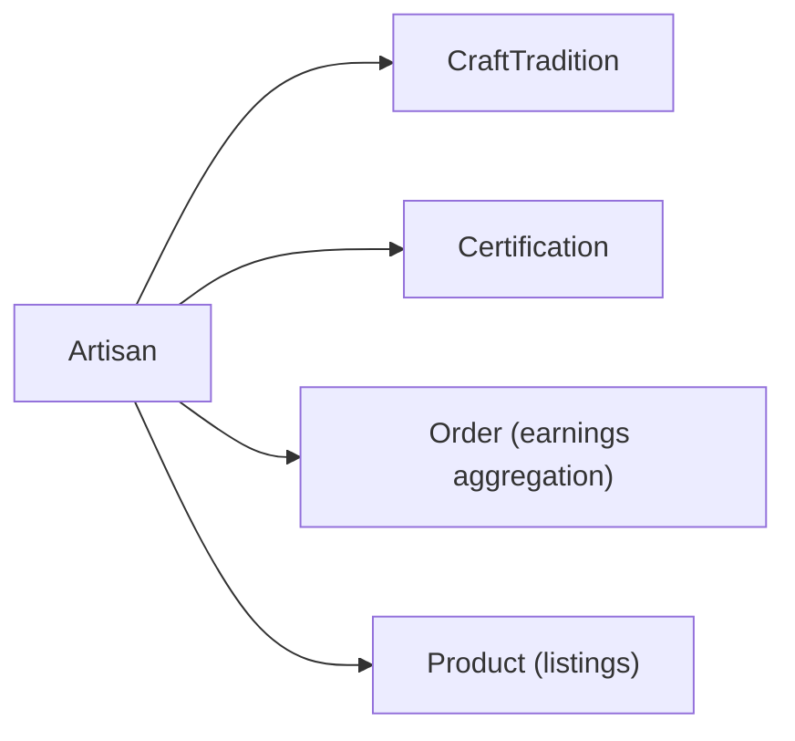

# Artisan Profile Management

<cite>
**Referenced Files in This Document**
- [models.py](file://backend/apps/artisans/models.py)
- [artisans.py](file://backend/api/v1/artisans.py)
- [models.py](file://backend/apps/orders/models.py)
- [models.py](file://backend/apps/products/models.py)
</cite>

## Table of Contents
1. [Introduction](#introduction)
2. [Project Structure](#project-structure)
3. [Core Components](#core-components)
4. [Architecture Overview](#architecture-overview)
5. [Detailed Component Analysis](#detailed-component-analysis)
6. [Dependency Analysis](#dependency-analysis)
7. [Performance Considerations](#performance-considerations)
8. [Troubleshooting Guide](#troubleshooting-guide)
9. [Conclusion](#conclusion)

## Introduction
This document describes the artisan profile management system, focusing on the Django backend models and the public API that surfaces artisan profiles. It covers identity fields, craft tradition associations, certifications, multilingual biographical content, voice note transcription support, profile photos and cover photos, location data, contact and payment channels, and the artisan dashboard metrics exposed via the API. It also outlines the verification and status management mechanisms and highlights the order statistics and earnings aggregation used for analytics.

## Project Structure
The artisan profile management spans two primary areas:
- Backend models defining the data schema and computed properties
- Public API endpoints exposing artisan profiles and discovery

**Diagram sources**
- [models.py:14-170](file://backend/apps/artisans/models.py#L14-L170)
- [artisans.py:1-120](file://backend/api/v1/artisans.py#L1-L120)
- [models.py:10-122](file://backend/apps/orders/models.py#L10-L122)
- [models.py:10-153](file://backend/apps/products/models.py#L10-L153)

**Section sources**
- [models.py:1-170](file://backend/apps/artisans/models.py#L1-L170)
- [artisans.py:1-120](file://backend/api/v1/artisans.py#L1-L120)

## Core Components
- CraftTradition: Cultural craft category with GI status and heritage fund percentage.
- Certification: Quality assurance marks with activation flag.
- Artisan: Digital identity with identity, biographical, location, contact, media, experience, and status fields; includes computed metrics for earnings and order counts.

Key capabilities:
- Multilingual biography fields (English, Luganda, Swahili) plus a draft field for voice-transcribed content awaiting review.
- Computed properties for total earnings and order count derived from the order lifecycle.
- Onboarding method tracking and verification status.
- Photo and cover photo storage paths.

**Section sources**
- [models.py:14-170](file://backend/apps/artisans/models.py#L14-L170)

## Architecture Overview
The artisan profile is served by a public API endpoint that returns a structured response including profile photos, cover photos, craft tradition metadata, and aggregated stats.

**Diagram sources**
- [artisans.py:52-77](file://backend/api/v1/artisans.py#L52-L77)
- [models.py:132-150](file://backend/apps/artisans/models.py#L132-L150)

## Detailed Component Analysis

### Artisan Model and Properties
The Artisan model encapsulates:
- Identity: One-to-one relationship with the User model, slug generation, and craft tradition association
- Certifications: Many-to-many linkage to Certification
- Biographical content: bio, bio_luganda, bio_swahili, and a draft field for voice-transcribed content with language and timestamp
- Location: community and district
- Contact and payments: phone (WhatsApp), mobile money numbers for MTN MoMo and Airtel Money, Telegram chat ID
- Status: is_certified, onboarded_via, is_active
- Media: profile_photo and cover_photo ImageFields
- Experience: years_experience
- Metrics: total_earnings_ugx and order_count computed from the order lifecycle

**Diagram sources**
- [models.py:62-170](file://backend/apps/artisans/models.py#L62-L170)

**Section sources**
- [models.py:62-170](file://backend/apps/artisans/models.py#L62-L170)

### CraftTradition and Certification
- CraftTradition defines cultural craft categories with optional Luganda name, ethnic group, region, description, GI status, and heritage levy percentage.
- Certification defines quality marks with activation flag and requirements stored as JSON text.

**Diagram sources**
- [models.py:14-60](file://backend/apps/artisans/models.py#L14-L60)

**Section sources**
- [models.py:14-60](file://backend/apps/artisans/models.py#L14-L60)

### Public API Endpoints for Artisans
The API exposes:
- GET /api/v1/artisans/{slug}: Returns a detailed profile including craft tradition metadata, photos, experience, certification status, order count, and total earnings in UGX.
- GET /api/v1/artisans: Lists artisans with optional filters for craft type, region, and certification status.
- GET /api/v1/artisans/traditions/list: Lists all craft traditions.

**Diagram sources**
- [artisans.py:52-119](file://backend/api/v1/artisans.py#L52-L119)

**Section sources**
- [artisans.py:1-120](file://backend/api/v1/artisans.py#L1-L120)

### Multilingual Biography System
The Artisan model supports three languages for biographical content:
- English: bio
- Luganda: bio_luganda
- Swahili: bio_swahili

Additionally, a voice note transcription draft is supported via:
- bio_draft: text content of the draft
- bio_draft_language: language code
- bio_draft_at: timestamp of creation

Review workflow:
- Draft is created from voice transcription.
- After review, the draft can be published to the main bio field(s) and cleared.

Note: The actual transcription service and review UI are not present in the backend models; this section documents the data fields and their intended use.

**Section sources**
- [models.py:87-96](file://backend/apps/artisans/models.py#L87-L96)

### Profile Photos and Cover Photos
- profile_photo: ImageField uploaded to artisans/profiles/
- cover_photo: ImageField uploaded to artisans/covers/

The API returns URLs for these images when available.

**Section sources**
- [models.py:112-114](file://backend/apps/artisans/models.py#L112-L114)
- [artisans.py:62-76](file://backend/api/v1/artisans.py#L62-L76)

### Location Data (Community and District)
- community: village or town
- district: administrative district

These fields are used for filtering and discovery in the list endpoint.

**Section sources**
- [models.py:97-99](file://backend/apps/artisans/models.py#L97-L99)
- [artisans.py:80-112](file://backend/api/v1/artisans.py#L80-L112)

### Contact Information and Mobile Money Numbers
- phone: WhatsApp number
- momo_number: MTN MoMo number
- airtel_number: Airtel Money number
- telegram_chat_id: Telegram chat identifier

These fields enable communication and mobile money payouts.

**Section sources**
- [models.py:101-105](file://backend/apps/artisans/models.py#L101-L105)

### Verification Status and Onboarding
- is_certified: boolean indicating certification status
- onboarded_via: choice field covering web, WhatsApp, Telegram bot, and field officer
- is_active: boolean controlling visibility

These fields support verification workflows and onboarding tracking.

**Section sources**
- [models.py:107-111](file://backend/apps/artisans/models.py#L107-L111)

### Dashboard Metrics and Earnings Tracking
The API exposes:
- order_count: number of delivered orders
- total_earnings_ugx: sum of paid artisan earnings from delivered orders

These are computed from the Order model’s lifecycle and payout status.

**Diagram sources**
- [models.py:132-150](file://backend/apps/artisans/models.py#L132-L150)
- [models.py:16-39](file://backend/apps/orders/models.py#L16-L39)
- [models.py:52-62](file://backend/apps/orders/models.py#L52-L62)

**Section sources**
- [models.py:132-150](file://backend/apps/artisans/models.py#L132-L150)
- [models.py:10-122](file://backend/apps/orders/models.py#L10-L122)

### Product Story and Voice Transcription Context
While not part of the artisan profile itself, the Product model mirrors the multilingual storytelling approach:
- story, story_luganda, story_swahili
- story_draft, story_draft_language, story_draft_at

This context aligns with the artisan biography transcription workflow described above.

**Section sources**
- [models.py:36-44](file://backend/apps/products/models.py#L36-L44)

## Dependency Analysis
The artisan profile depends on:
- CraftTradition for cultural categorization
- Certification for quality marks
- Order lifecycle for earnings and order counts
- Product listings for profile completeness

**Diagram sources**
- [models.py:62-170](file://backend/apps/artisans/models.py#L62-L170)
- [models.py:10-122](file://backend/apps/orders/models.py#L10-L122)
- [models.py:10-153](file://backend/apps/products/models.py#L10-L153)

**Section sources**
- [models.py:62-170](file://backend/apps/artisans/models.py#L62-L170)
- [models.py:10-122](file://backend/apps/orders/models.py#L10-L122)
- [models.py:10-153](file://backend/apps/products/models.py#L10-L153)

## Performance Considerations
- Use select_related in queries to avoid N+1 issues when fetching related user and craft tradition data.
- The computed properties for earnings and order counts rely on filtered aggregates; ensure appropriate database indexing on foreign keys and status/payout fields.
- ImageField URLs are returned by the API; consider CDN caching for media assets.

## Troubleshooting Guide
- Profile not visible: Verify is_active is True and slug matches the requested path.
- Missing earnings or order count: Confirm orders exist with status "delivered" and payout_status "paid".
- Empty photos: Ensure images were uploaded and URLs are accessible.
- Draft biography not appearing: Check bio_draft presence and review workflow completion.

**Section sources**
- [artisans.py:52-77](file://backend/api/v1/artisans.py#L52-L77)
- [models.py:132-150](file://backend/apps/artisans/models.py#L132-L150)
- [models.py:16-39](file://backend/apps/orders/models.py#L16-L39)

## Conclusion
The artisan profile management system centers on a robust Django model layer with multilingual biography support, verification and onboarding tracking, and integrated dashboard metrics. The public API provides a story-first profile experience with photos, craft tradition metadata, and computed earnings and order statistics. The design accommodates voice note transcription drafts and a clear review workflow, while supporting mobile money and messaging channels for communication and payouts.