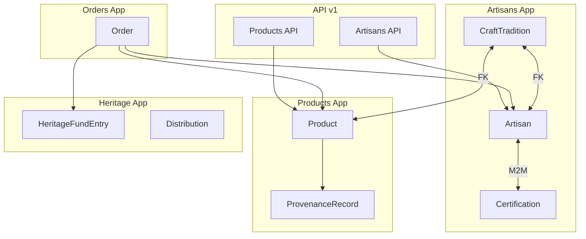
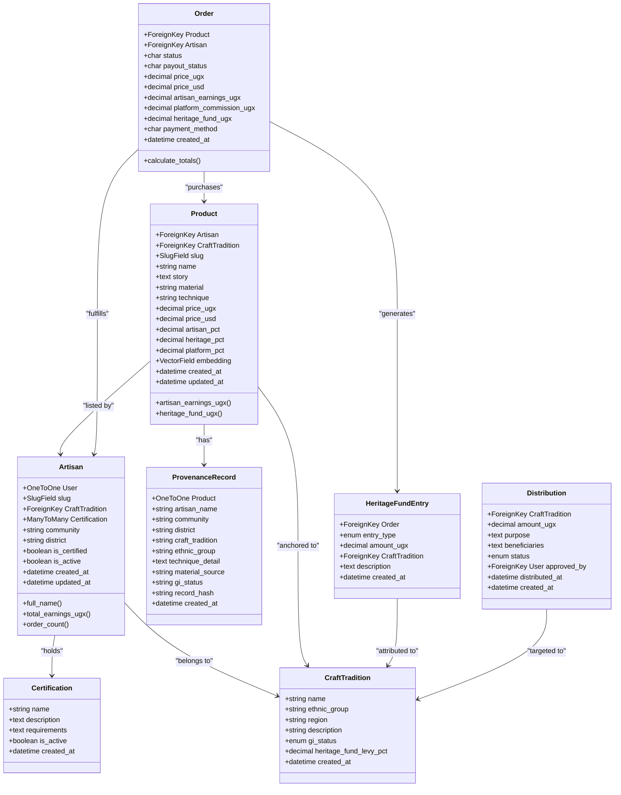
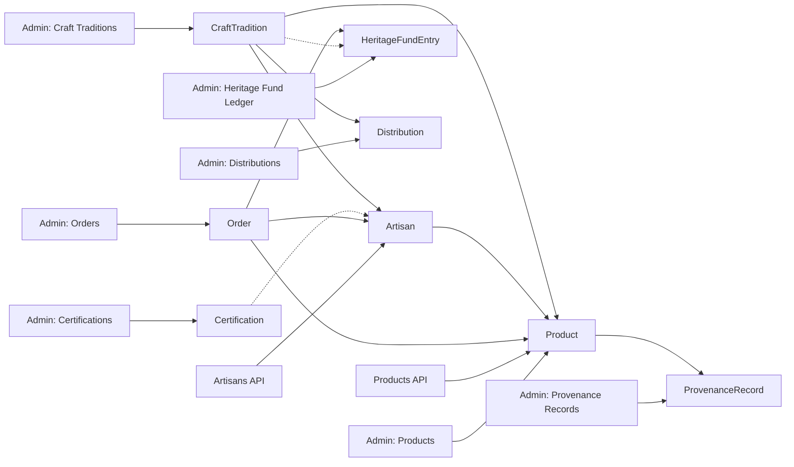

# Craft Traditions & Certifications

<cite>
**Referenced Files in This Document**
- [models.py](file://backend/apps/artisans/models.py)
- [models.py](file://backend/apps/products/models.py)
- [models.py](file://backend/apps/heritage/models.py)
- [models.py](file://backend/apps/orders/models.py)
- [artisans.py](file://backend/api/v1/artisans.py)
- [products.py](file://backend/api/v1/products.py)
- [base.py](file://backend/config/settings/base.py)
- [0001_initial.py](file://backend/apps/artisans/migrations/0001_initial.py)
- [0001_initial.py](file://backend/apps/heritage/migrations/0001_initial.py)
</cite>

## Table of Contents
1. [Introduction](#introduction)
2. [Project Structure](#project-structure)
3. [Core Components](#core-components)
4. [Architecture Overview](#architecture-overview)
5. [Detailed Component Analysis](#detailed-component-analysis)
6. [Dependency Analysis](#dependency-analysis)
7. [Performance Considerations](#performance-considerations)
8. [Troubleshooting Guide](#troubleshooting-guide)
9. [Conclusion](#conclusion)

## Introduction
This document explains the craft traditions and certification systems within the platform. It documents the CraftTradition model for cultural heritage documentation, ethnic group and regional classifications, and Geographical Indication (GI) status tracking. It also details the Certification model for Empindu Certified marks, including requirement specifications and quality assurance processes. The document covers the relationship between artisans and craft traditions, certification enrollment workflows, and the heritage fund levy system. It further describes the cultural IP anchoring mechanism that preserves Ugandan craft traditions while enabling commercial activity, and outlines the impact on product listings, artisan visibility, and marketplace trust indicators. Finally, it addresses certification renewal processes, quality audits, and the role of craft traditions in product storytelling.

## Project Structure
The craft traditions and certification ecosystem spans several Django apps and models:
- Artisans app: CraftTradition, Certification, and Artisan models
- Products app: Product and ProvenanceRecord models
- Heritage app: HeritageFundEntry and Distribution models
- Orders app: Order model with financial snapshots and heritage fund contributions
- API v1: Public endpoints for artisans and products that surface craft tradition and certification data
- Admin configuration: Dedicated admin sections for Craft Traditions, Certifications, Products, Provenance Records, Orders, Heritage Fund Ledger, and Distributions

**Diagram sources**
- [models.py:14-170](file://backend/apps/artisans/models.py#L14-L170)
- [models.py:10-153](file://backend/apps/products/models.py#L10-L153)
- [models.py:9-66](file://backend/apps/heritage/models.py#L9-L66)
- [models.py:10-122](file://backend/apps/orders/models.py#L10-L122)
- [artisans.py:13-120](file://backend/api/v1/artisans.py#L13-L120)
- [products.py:14-191](file://backend/api/v1/products.py#L14-L191)

**Section sources**
- [base.py:219-287](file://backend/config/settings/base.py#L219-L287)

## Core Components
This section documents the core models and their roles in the craft traditions and certification ecosystem.

- CraftTradition
  - Cultural IP anchor representing named craft traditions with ethnic group and regional classification
  - Tracks GI status (none, pending, registered)
  - Includes heritage fund levy percentage applied to products
  - Provides ordering and plural naming for admin and display

- Certification
  - Empindu Certified mark with name, description, and JSON-encoded requirements
  - Active flag for lifecycle management
  - Many-to-many relationship with Artisan for certification enrollment

- Artisan
  - Digital identity of craftspeople with onboarding method, location, contact, and certification status
  - ForeignKey to CraftTradition and M2M to Certification
  - Properties for earnings, order count, and voice draft presence
  - Auto-generated slug from user’s full name

- Product
  - Story-first product model anchored to an artisan and craft tradition
  - Contains craft details (material, technique), pricing, revenue split, and inventory
  - Embedding field for semantic search
  - ProvenanceRecord captures immutable cultural attribution at listing time

- ProvenanceRecord
  - Immutable snapshot of artisan, community, district, craft tradition, ethnic group, technique detail, material source, and GI status
  - Supports future blockchain anchoring via record hash

- HeritageFundEntry
  - Immutable ledger entry for every completed order
  - Entry types: contribution or distribution
  - Links to Order and CraftTradition
  - Enables transparent impact tracking

- Distribution
  - Proposed, approved, in_progress, or completed distributions to craft communities
  - Amount, purpose, and JSON-encoded beneficiaries
  - Approval and distribution timestamps

- Order
  - Full lifecycle tracking with payment methods and payout statuses
  - Financial snapshot frozen at order time: price, earnings, platform commission, and heritage fund contribution
  - Links to Product, Buyer, and Artisan

**Section sources**
- [models.py:14-170](file://backend/apps/artisans/models.py#L14-L170)
- [models.py:10-153](file://backend/apps/products/models.py#L10-L153)
- [models.py:9-66](file://backend/apps/heritage/models.py#L9-L66)
- [models.py:10-122](file://backend/apps/orders/models.py#L10-L122)

## Architecture Overview
The system integrates craft traditions and certifications across product storytelling, artisan profiles, and heritage fund accounting. The architecture ensures cultural IP anchoring via ProvenanceRecord and transparent financial attribution through Order and HeritageFundEntry.

**Diagram sources**
- [models.py:14-170](file://backend/apps/artisans/models.py#L14-L170)
- [models.py:10-153](file://backend/apps/products/models.py#L10-L153)
- [models.py:9-66](file://backend/apps/heritage/models.py#L9-L66)
- [models.py:10-122](file://backend/apps/orders/models.py#L10-L122)

## Detailed Component Analysis

### CraftTradition Model
- Purpose: Cultural IP anchor for craft traditions with heritage documentation, ethnic group and regional classification, and GI status tracking
- Key attributes:
  - Name and Lugandan translation
  - Ethnic group and region
  - Description for cultural context
  - GI status with three states: none, pending, registered
  - Heritage fund levy percentage applied to products
- Ordering and pluralization support administrative discoverability
- Relationship to other models:
  - Artisans are protected from deletion when associated with a craft tradition
  - Provenance records capture GI status at listing time
  - Heritage fund entries are attributed to craft traditions

Impact on product listings and marketplace trust:
- Product stories and provenance records prominently display craft tradition, ethnic group, and GI status
- Buyers can filter by craft tradition and region, increasing artisan visibility and trust signals

**Section sources**
- [models.py:14-45](file://backend/apps/artisans/models.py#L14-L45)
- [models.py:122-153](file://backend/apps/products/models.py#L122-L153)
- [models.py:20-28](file://backend/apps/heritage/models.py#L20-L28)

### Certification Model
- Purpose: Empindu Certified mark for quality and authenticity assurance
- Key attributes:
  - Name and description
  - Requirements stored as JSON for structured verification
  - Active flag for lifecycle management
- Relationship to artisans:
  - Artisans can hold multiple certifications
  - Certification status appears on artisan profiles and product pages

Enrollment workflow:
- Artisans apply for certifications; upon meeting requirements, they are marked as certified
- The certification enrollment is tracked via the M2M relationship and artisan certification flag

Quality assurance processes:
- Requirements encoded as JSON enable standardized checks during audits
- Renewal processes can be modeled by deactivating and reactivating certifications or by creating new certification instances

**Section sources**
- [models.py:47-60](file://backend/apps/artisans/models.py#L47-L60)
- [models.py:83-85](file://backend/apps/artisans/models.py#L83-L85)
- [0001_initial.py:18-26](file://backend/apps/artisans/migrations/0001_initial.py#L18-L26)

### Artisan-Craft Tradition Relationship
- Artisans are associated with a single craft tradition and can hold multiple certifications
- Profiles expose craft tradition, certification status, experience, and listing counts
- Filtering by craft tradition and region supports discovery and visibility

Public API exposure:
- Artisan detail endpoint returns craft tradition, certification status, earnings, and listing IDs
- Listing endpoint supports filters by craft type, region, and certification status

**Section sources**
- [models.py:80-85](file://backend/apps/artisans/models.py#L80-L85)
- [artisans.py:52-78](file://backend/api/v1/artisans.py#L52-L78)
- [artisans.py:80-113](file://backend/api/v1/artisans.py#L80-L113)

### Product Storytelling and Provenance
- Products are anchored to artisans and craft traditions, with story-first presentation
- ProvenanceRecord captures immutable details at listing time, including GI status
- Product schema surfaces heritage fund contribution as an impact signal

Marketplace trust indicators:
- Visible heritage fund contribution and craft tradition details enhance trust
- Filtering by craft tradition and region improves discoverability

**Section sources**
- [models.py:10-100](file://backend/apps/products/models.py#L10-L100)
- [models.py:122-153](file://backend/apps/products/models.py#L122-L153)
- [products.py:74-124](file://backend/api/v1/products.py#L74-L124)
- [products.py:126-191](file://backend/api/v1/products.py#L126-L191)

### Heritage Fund Levy and Accounting
- Product model defines heritage fund percentage and computes contribution per unit
- Order model calculates frozen totals, including heritage fund contribution
- HeritageFundEntry records every contribution with order linkage and craft tradition attribution
- Distribution tracks proposed, approved, in-progress, and completed disbursements to communities

Administrative visibility:
- Admin sections for Heritage Fund Ledger and Distributions enable oversight and transparency

**Section sources**
- [models.py:55-67](file://backend/apps/products/models.py#L55-L67)
- [models.py:111-122](file://backend/apps/orders/models.py#L111-L122)
- [models.py:9-66](file://backend/apps/heritage/models.py#L9-L66)
- [base.py:270-283](file://backend/config/settings/base.py#L270-L283)

### Certification Renewal and Quality Audits
- Renewal can be managed by deactivating old certifications and issuing new ones, or by updating requirements and re-verifying artisans
- Quality audits can leverage JSON-encoded requirements to validate compliance
- Administrative controls in the Django admin support managing certification lifecycles

**Section sources**
- [models.py:47-60](file://backend/apps/artisans/models.py#L47-L60)
- [0001_initial.py:18-26](file://backend/apps/artisans/migrations/0001_initial.py#L18-L26)

### Cultural IP Anchoring Mechanism
- ProvenanceRecord creates an immutable snapshot at listing time, preserving cultural attribution
- CraftTradition, GI status, technique detail, and material source are captured
- Future blockchain anchoring via record hash supports tamper-evident provenance

**Section sources**
- [models.py:122-153](file://backend/apps/products/models.py#L122-L153)
- [models.py:20-28](file://backend/apps/heritage/models.py#L20-L28)

## Dependency Analysis
The following diagram shows key dependencies among models and their relationships to API endpoints and admin configurations.

**Diagram sources**
- [models.py:14-170](file://backend/apps/artisans/models.py#L14-L170)
- [models.py:10-153](file://backend/apps/products/models.py#L10-L153)
- [models.py:9-66](file://backend/apps/heritage/models.py#L9-L66)
- [models.py:10-122](file://backend/apps/orders/models.py#L10-L122)
- [artisans.py:13-120](file://backend/api/v1/artisans.py#L13-L120)
- [products.py:14-191](file://backend/api/v1/products.py#L14-L191)
- [base.py:219-287](file://backend/config/settings/base.py#L219-L287)

**Section sources**
- [models.py:14-170](file://backend/apps/artisans/models.py#L14-L170)
- [models.py:10-153](file://backend/apps/products/models.py#L10-L153)
- [models.py:9-66](file://backend/apps/heritage/models.py#L9-L66)
- [models.py:10-122](file://backend/apps/orders/models.py#L10-L122)
- [artisans.py:13-120](file://backend/api/v1/artisans.py#L13-L120)
- [products.py:14-191](file://backend/api/v1/products.py#L14-L191)
- [base.py:219-287](file://backend/config/settings/base.py#L219-L287)

## Performance Considerations
- Select-related and prefetch-related queries in public APIs reduce N+1 issues for artisan profiles and product details
- ProvenanceRecord is fetched alongside products to avoid additional round-trips
- Pagination in product listings limits payload sizes and database load
- Embedding field for semantic search requires periodic updates via background tasks; ensure Celery pipeline is operational

[No sources needed since this section provides general guidance]

## Troubleshooting Guide
Common issues and resolutions:
- Missing craft tradition or certification data in listings
  - Verify CraftTradition and Certification records exist and are active
  - Confirm Artisan is associated with a valid CraftTradition and holds relevant Certifications
- Incorrect heritage fund contribution
  - Check Product heritage percentage and ensure Order.calculate_totals is invoked on order creation
- ProvenanceRecord not appearing
  - Ensure ProvenanceRecord is created at listing time and linked to the Product
- Admin visibility gaps
  - Confirm admin sections for Craft Traditions, Certifications, Products, Provenance Records, Orders, Heritage Fund Ledger, and Distributions are configured

**Section sources**
- [models.py:14-60](file://backend/apps/artisans/models.py#L14-L60)
- [models.py:122-153](file://backend/apps/products/models.py#L122-L153)
- [models.py:111-122](file://backend/apps/orders/models.py#L111-L122)
- [base.py:219-287](file://backend/config/settings/base.py#L219-L287)

## Conclusion
The craft traditions and certification system establishes a robust framework for cultural IP anchoring, artisan visibility, and transparent economic impact. CraftTradition and ProvenanceRecord preserve heritage and storytelling, while Certification and Order models enforce quality and fair value distribution. The heritage fund mechanism ensures community benefit, and the admin interface supports governance and oversight. Together, these components strengthen marketplace trust and sustain Ugandan craft traditions through commerce.