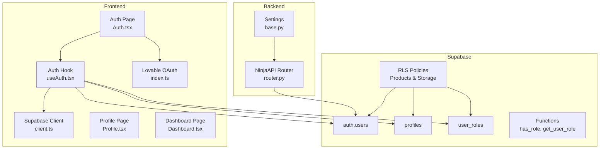
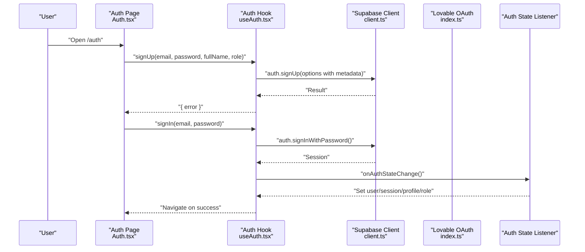
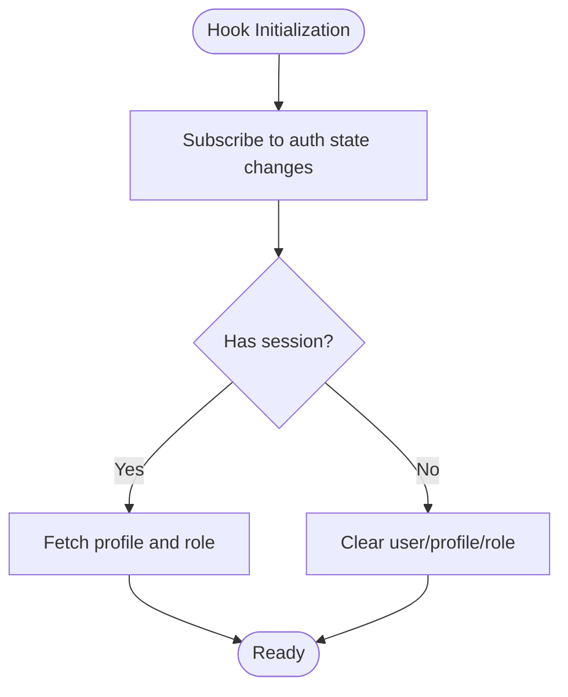
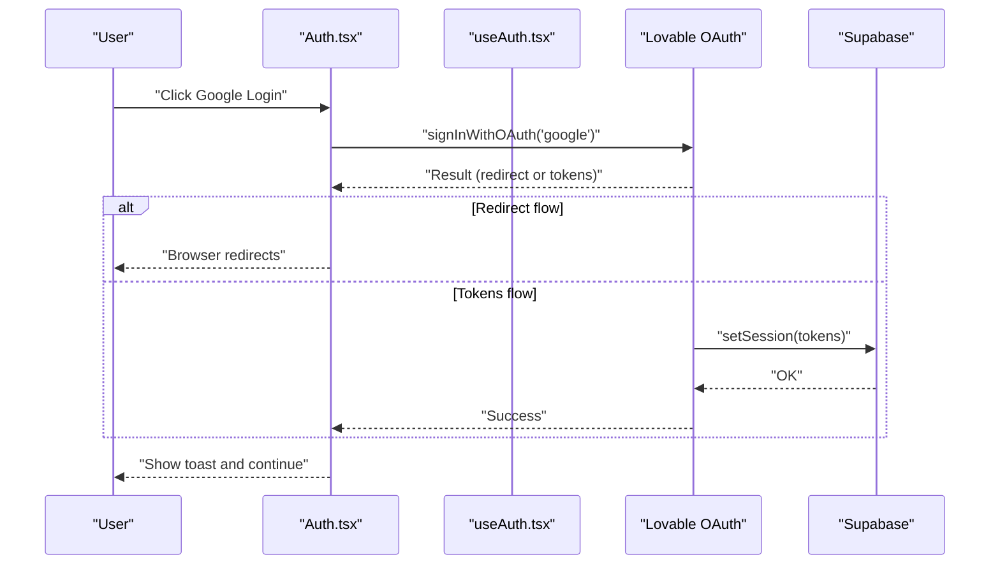
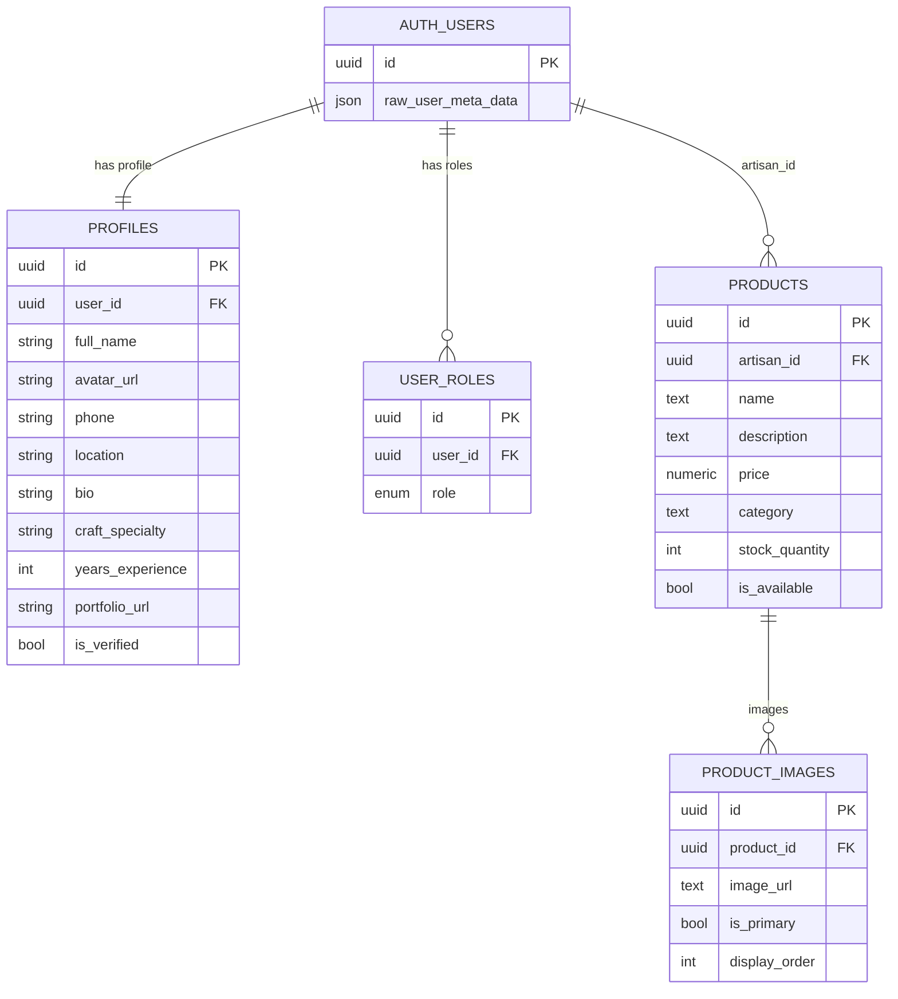
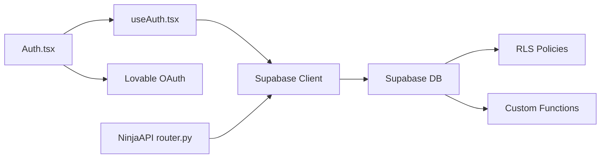

# Authentication & Authorization

<cite>
**Referenced Files in This Document**
- [client.ts](file://src/integrations/supabase/client.ts)
- [useAuth.tsx](file://src/hooks/useAuth.tsx)
- [Auth.tsx](file://src/pages/Auth.tsx)
- [Profile.tsx](file://src/pages/Profile.tsx)
- [Dashboard.tsx](file://src/pages/Dashboard.tsx)
- [index.ts](file://src/integrations/lovable/index.ts)
- [router.py](file://backend/api/v1/router.py)
- [base.py](file://backend/config/settings/base.py)
- [20251231095959_3473bebe-42ab-4109-8633-54732ebf1eaf.sql](file://supabase/migrations/20251231095959_3473bebe-42ab-4109-8633-54732ebf1eaf.sql)
- [20260101210119_8814f12d-688f-4774-9ce8-6ce5f9fd0bba.sql](file://supabase/migrations/20260101210119_8814f12d-688f-4774-9ce8-6ce5f9fd0bba.sql)
- [20260101211534_d1ce3159-d630-4859-8ee8-6361241b244c.sql](file://supabase/migrations/20260101211534_d1ce3159-d630-4859-8ee8-6361241b244c.sql)
- [UsersManager.tsx](file://src/components/admin/UsersManager.tsx)
</cite>

## Table of Contents
1. [Introduction](#introduction)
2. [Project Structure](#project-structure)
3. [Core Components](#core-components)
4. [Architecture Overview](#architecture-overview)
5. [Detailed Component Analysis](#detailed-component-analysis)
6. [Dependency Analysis](#dependency-analysis)
7. [Performance Considerations](#performance-considerations)
8. [Troubleshooting Guide](#troubleshooting-guide)
9. [Conclusion](#conclusion)

## Introduction
This document explains the authentication and authorization system powering the Empindu artisan marketplace. It covers user registration and login, role-based access control (buyer, artisan, admin), session management, Supabase integration, JWT handling, and user profile management. It also documents permission systems enforced via Row Level Security (RLS), admin role management, and frontend guardrails. Social login via Google and Lovable OAuth is integrated, and the backend API enforces JWT-based authentication for protected endpoints.

## Project Structure
The authentication system spans three layers:
- Frontend React integration with Supabase Auth and Lovable OAuth
- Supabase database with RLS policies and custom functions
- Backend Django/NinjaAPI with JWT bearer authentication

**Diagram sources**
- [Auth.tsx:1-300](file://src/pages/Auth.tsx#L1-L300)
- [useAuth.tsx:1-177](file://src/hooks/useAuth.tsx#L1-L177)
- [client.ts:1-17](file://src/integrations/supabase/client.ts#L1-L17)
- [index.ts:1-39](file://src/integrations/lovable/index.ts#L1-L39)
- [Profile.tsx:1-369](file://src/pages/Profile.tsx#L1-L369)
- [Dashboard.tsx:1-87](file://src/pages/Dashboard.tsx#L1-L87)
- [router.py:1-40](file://backend/api/v1/router.py#L1-L40)
- [base.py:1-287](file://backend/config/settings/base.py#L1-L287)
- [20251231095959_3473bebe-42ab-4109-8633-54732ebf1eaf.sql:1-140](file://supabase/migrations/20251231095959_3473bebe-42ab_4109_8633_54732ebf1eaf.sql#L1-L140)
- [20260101210119_8814f12d-688f-4774-9ce8-6ce5f9fd0bba.sql:1-118](file://supabase/migrations/20260101210119_8814f12d-688f_4774_9ce8_6ce5f9fd0bba.sql#L1-L118)
- [20260101211534_d1ce3159-d630-4859-8ee8-6361241b244c.sql:1-31](file://supabase/migrations/20260101211534_d1ce3159-d630_4859_8ee8_6361241b244c.sql#L1-L31)

**Section sources**
- [client.ts:1-17](file://src/integrations/supabase/client.ts#L1-L17)
- [useAuth.tsx:1-177](file://src/hooks/useAuth.tsx#L1-L177)
- [Auth.tsx:1-300](file://src/pages/Auth.tsx#L1-L300)
- [Profile.tsx:1-369](file://src/pages/Profile.tsx#L1-L369)
- [Dashboard.tsx:1-87](file://src/pages/Dashboard.tsx#L1-L87)
- [index.ts:1-39](file://src/integrations/lovable/index.ts#L1-L39)
- [router.py:1-40](file://backend/api/v1/router.py#L1-L40)
- [base.py:1-287](file://backend/config/settings/base.py#L1-L287)
- [20251231095959_3473bebe-42ab-4109-8633-54732ebf1eaf.sql:1-140](file://supabase/migrations/20251231095959_3473bebe-42ab_4109_8633_54732ebf1eaf.sql#L1-L140)
- [20260101210119_8814f12d-688f-4774-9ce8-6ce5f9fd0bba.sql:1-118](file://supabase/migrations/20260101210119_8814f12d-688f_4774_9ce8_6ce5f9fd0bba.sql#L1-L118)
- [20260101211534_d1ce3159-d630-4859-8ee8-6361241b244c.sql:1-31](file://supabase/migrations/20260101211534_d1ce3159-d630_4859_8ee8_6361241b244c.sql#L1-L31)

## Core Components
- Supabase client configured with local storage persistence, session persistence, and automatic token refresh.
- React auth hook orchestrating sign-up, sign-in, sign-out, profile retrieval, and role resolution.
- Auth page supporting email/password and Google OAuth via Lovable.
- Profile and Dashboard pages enforcing role-based routing and rendering.
- Backend NinjaAPI with JWT bearer authentication and RLS-backed authorization policies.

**Section sources**
- [client.ts:11-17](file://src/integrations/supabase/client.ts#L11-L17)
- [useAuth.tsx:37-176](file://src/hooks/useAuth.tsx#L37-L176)
- [Auth.tsx:20-104](file://src/pages/Auth.tsx#L20-L104)
- [Profile.tsx:16-88](file://src/pages/Profile.tsx#L16-L88)
- [Dashboard.tsx:13-29](file://src/pages/Dashboard.tsx#L13-L29)
- [router.py:10-28](file://backend/api/v1/router.py#L10-L28)

## Architecture Overview
The system integrates frontend React with Supabase Auth and Lovable OAuth, while backend APIs enforce JWT-based authentication. Supabase RLS policies govern resource access based on user roles.

**Diagram sources**
- [Auth.tsx:73-104](file://src/pages/Auth.tsx#L73-L104)
- [useAuth.tsx:103-128](file://src/hooks/useAuth.tsx#L103-L128)
- [client.ts:11-17](file://src/integrations/supabase/client.ts#L11-L17)
- [index.ts:14-36](file://src/integrations/lovable/index.ts#L14-L36)

## Detailed Component Analysis

### Supabase Client and Session Management
- Initializes Supabase with a publishable URL and key.
- Configures local storage-backed session persistence, automatic token refresh, and session persistence across browser sessions.
- Provides a singleton client instance for the app.

**Section sources**
- [client.ts:5-17](file://src/integrations/supabase/client.ts#L5-L17)

### Auth Hook: Registration, Login, Profile, Role
- Registers users with metadata (full name, role) to drive downstream profile and role creation.
- Logs users in via password and logs them out.
- Subscribes to Supabase auth state changes to keep user, session, profile, and role in sync.
- Fetches profile and role after sign-in and clears them on sign-out.
- Exposes updateProfile to mutate profile fields.

**Diagram sources**
- [useAuth.tsx:68-101](file://src/hooks/useAuth.tsx#L68-L101)
- [useAuth.tsx:44-66](file://src/hooks/useAuth.tsx#L44-L66)

**Section sources**
- [useAuth.tsx:37-176](file://src/hooks/useAuth.tsx#L37-L176)

### Auth Page: Email/Password and Google OAuth
- Supports login and registration modes, including artisan registration.
- Validates form inputs using Zod schemas.
- Initiates Google OAuth via Lovable with redirect URI and prompt parameters.
- Handles sign-in/sign-up outcomes and navigates appropriately.

**Diagram sources**
- [Auth.tsx:43-60](file://src/pages/Auth.tsx#L43-L60)
- [index.ts:14-36](file://src/integrations/lovable/index.ts#L14-L36)

**Section sources**
- [Auth.tsx:20-104](file://src/pages/Auth.tsx#L20-L104)
- [index.ts:12-38](file://src/integrations/lovable/index.ts#L12-L38)

### Profile and Dashboard Routing Guards
- Profile page enforces authentication and renders user details and order history.
- Dashboard page enforces authenticated state and role checks (artisan or admin), redirecting others to Profile.

**Section sources**
- [Profile.tsx:16-88](file://src/pages/Profile.tsx#L16-L88)
- [Dashboard.tsx:13-29](file://src/pages/Dashboard.tsx#L13-L29)

### Backend API Authentication (JWT Bearer)
- Defines a JWTBearer authenticator that validates tokens via Django REST Framework JWT.
- Applies JWTBearer globally and to specific routers, ensuring protected endpoints.

**Section sources**
- [router.py:10-28](file://backend/api/v1/router.py#L10-L28)

### Supabase Roles, Profiles, and RLS
- Enumerated roles: admin, artisan, buyer.
- Profiles table stores user biographical and artisan-specific details.
- User roles table links users to roles with a unique constraint.
- Security-definer functions enable role checks and role retrieval.
- RLS policies on products and storage restrict access to artisans by role and ownership.
- Admin policies grant broad access to products and role management.

**Diagram sources**
- [20251231095959_3473bebe-42ab-4109-8633-54732ebf1eaf.sql:1-140](file://supabase/migrations/20251231095959_3473bebe-42ab_4109_8633_54732ebf1eaf.sql#L1-L140)
- [20260101210119_8814f12d-688f-4774-9ce8-6ce5f9fd0bba.sql:1-118](file://supabase/migrations/20260101210119_8814f12d-688f_4774_9ce8_6ce5f9fd0bba.sql#L1-L118)

**Section sources**
- [20251231095959_3473bebe-42ab-4109-8633-54732ebf1eaf.sql:1-140](file://supabase/migrations/20251231095959_3473bebe-42ab_4109_8633_54732ebf1eaf.sql#L1-L140)
- [20260101210119_8814f12d-688f-4774-9ce8-6ce5f9fd0bba.sql:1-118](file://supabase/migrations/20260101210119_8814f12d-688f_4774_9ce8_6ce5f9fd0bba.sql#L1-L118)
- [20260101211534_d1ce3159-d630-4859-8ee8-6361241b244c.sql:1-31](file://supabase/migrations/20260101211534_d1ce3159-d630_4859_8ee8_6361241b244c.sql#L1-L31)

### Admin Role Management UI
- Lists users with roles and verification status.
- Allows changing a user’s role by deleting the existing row and inserting a new one.

**Section sources**
- [UsersManager.tsx:33-117](file://src/components/admin/UsersManager.tsx#L33-L117)

## Dependency Analysis
- Frontend depends on Supabase client and Lovable OAuth for authentication flows.
- Auth hook depends on Supabase tables (profiles, user_roles) and functions (has_role, get_user_role).
- Backend API depends on Supabase for JWT claims and RLS enforcement.
- Supabase policies depend on custom functions to evaluate roles.

**Diagram sources**
- [Auth.tsx:20-104](file://src/pages/Auth.tsx#L20-L104)
- [useAuth.tsx:37-176](file://src/hooks/useAuth.tsx#L37-L176)
- [client.ts:11-17](file://src/integrations/supabase/client.ts#L11-L17)
- [index.ts:12-38](file://src/integrations/lovable/index.ts#L12-L38)
- [router.py:10-28](file://backend/api/v1/router.py#L10-L28)
- [20251231095959_3473bebe-42ab-4109-8633-54732ebf1eaf.sql:35-63](file://supabase/migrations/20251231095959_3473bebe-42ab_4109_8633_54732ebf1eaf.sql#L35-L63)

**Section sources**
- [useAuth.tsx:37-176](file://src/hooks/useAuth.tsx#L37-L176)
- [router.py:10-28](file://backend/api/v1/router.py#L10-L28)
- [20251231095959_3473bebe-42ab-4109-8633-54732ebf1eaf.sql:35-63](file://supabase/migrations/20251231095959_3473bebe-42ab_4109_8633_54732ebf1eaf.sql#L35-L63)

## Performance Considerations
- Supabase client auto-refresh minimizes token errors and reduces manual refresh overhead.
- Local storage persistence avoids re-authentication on reload.
- RLS policies are evaluated server-side; keep filters selective to avoid heavy scans.
- Avoid excessive profile/role queries by leveraging the auth state listener and memoized context values.

## Troubleshooting Guide
- Authentication loops or stale session:
  - Verify Supabase client initialization and environment variables.
  - Confirm local storage persistence and session availability.
- Role not applied after sign-up:
  - Ensure sign-up metadata includes role and that the trigger creates user_roles.
- Admin actions failing:
  - Confirm the user’s role is admin and that admin policies are present.
- Protected API endpoints returning unauthorized:
  - Verify JWT bearer header and that the backend authenticator recognizes the token.

**Section sources**
- [client.ts:11-17](file://src/integrations/supabase/client.ts#L11-L17)
- [useAuth.tsx:103-128](file://src/hooks/useAuth.tsx#L103-L128)
- [20251231095959_3473bebe-42ab-4109-8633-54732ebf1eaf.sql:97-126](file://supabase/migrations/20251231095959_3473bebe-42ab_4109_8633_54732ebf1eaf.sql#L97-L126)
- [20260101211534_d1ce3159-d630-4859-8ee8-6361241b244c.sql:1-31](file://supabase/migrations/20260101211534_d1ce3159-d630_4859_8ee8_6361241b244c.sql#L1-L31)
- [router.py:10-28](file://backend/api/v1/router.py#L10-L28)

## Conclusion
The system combines Supabase Auth with frontend hooks and Lovable OAuth for robust user authentication, complemented by Supabase RLS and backend JWT bearer authentication for secure resource access. Role-based routing and admin-managed roles ensure appropriate access control across buyer, artisan, and admin contexts. The documented flows and policies provide a clear blueprint for extending or auditing the authentication and authorization mechanisms.