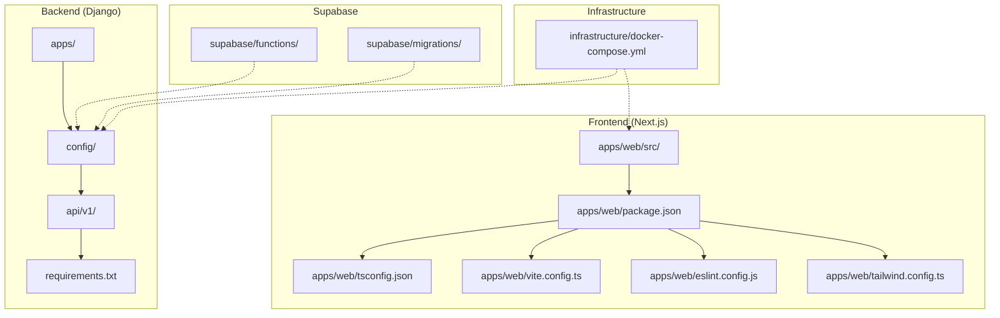
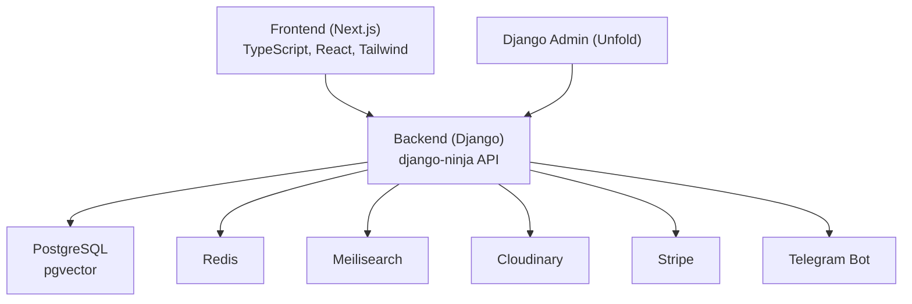
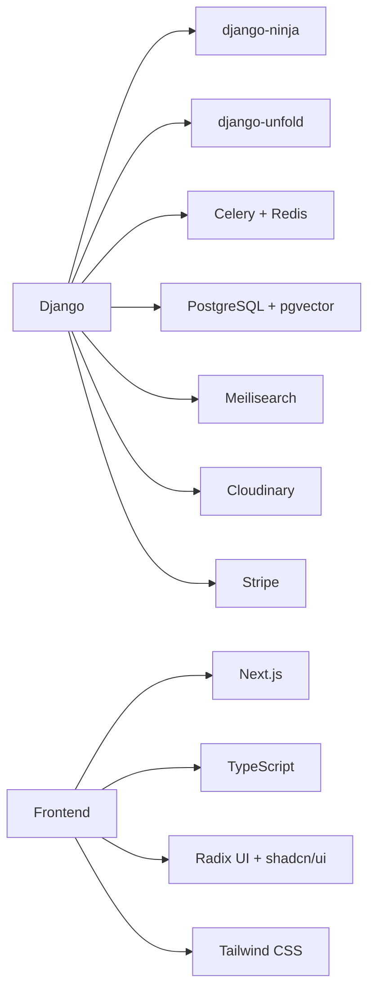
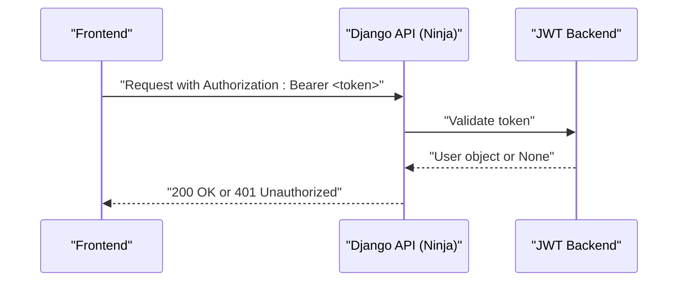
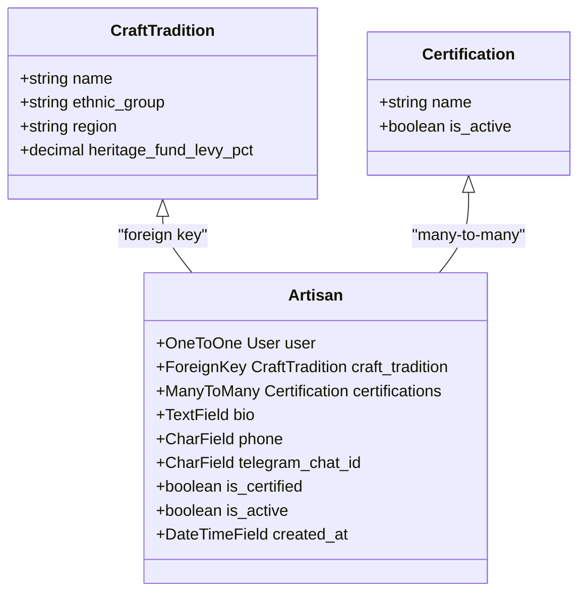

# Contributing Guidelines

<cite>
**Referenced Files in This Document**
- [README.md](file://README.md)
- [MIGRATION_GUIDE.md](file://MIGRATION_GUIDE.md)
- [PROGRESS_REPORT.md](file://PROGRESS_REPORT.md)
- [package.json](file://package.json)
- [eslint.config.js](file://eslint.config.js)
- [tsconfig.json](file://tsconfig.json)
- [vite.config.ts](file://vite.config.ts)
- [tailwind.config.ts](file://tailwind.config.ts)
- [backend/requirements.txt](file://backend/requirements.txt)
- [backend/setup.cfg](file://backend/setup.cfg)
- [backend/config/settings/base.py](file://backend/config/settings/base.py)
- [backend/config/urls.py](file://backend/config/urls.py)
- [backend/api/v1/router.py](file://backend/api/v1/router.py)
- [backend/apps/artisans/models.py](file://backend/apps/artisans/models.py)
- [src/App.tsx](file://src/App.tsx)
</cite>

## Table of Contents
1. [Introduction](#introduction)
2. [Project Structure](#project-structure)
3. [Core Components](#core-components)
4. [Architecture Overview](#architecture-overview)
5. [Detailed Component Analysis](#detailed-component-analysis)
6. [Dependency Analysis](#dependency-analysis)
7. [Performance Considerations](#performance-considerations)
8. [Troubleshooting Guide](#troubleshooting-guide)
9. [Conclusion](#conclusion)
10. [Appendices](#appendices)

## Introduction
Thank you for considering a contribution to Empindu. This document defines the end-to-end development workflow, standards, and processes for contributors working on both the Python/Django backend and the TypeScript/React frontend. It also covers environment setup, testing expectations, issue and feature request procedures, community guidelines, and maintainer responsibilities.

Empindu is a production-grade artisan marketplace built with Django 5 + django-ninja (async API), Next.js 14 App Router (SSR, PWA), Telegram bot integration, OpenAI Whisper for voice transcription, PostgreSQL with pgvector, Redis, Meilisearch, and a branded Unfold admin panel. The project follows a monorepo structure with a backend under /backend and a frontend under /apps/web.

## Project Structure
The repository is organized as a monorepo:
- backend: Django application, settings, apps, API v1, requirements, and infrastructure configs
- apps/web: Next.js 14 application (migration from the existing React SPA in /src)
- infrastructure: Docker Compose for local services (PostgreSQL, Redis, Meilisearch)
- supabase: Functions and migrations for serverless logic and schema
- Root-level documentation and configuration files for frontend tooling and linting

**Diagram sources**
- [backend/config/urls.py:9-16](file://backend/config/urls.py#L9-L16)
- [backend/api/v1/router.py:36-39](file://backend/api/v1/router.py#L36-L39)
- [backend/requirements.txt:1-50](file://backend/requirements.txt#L1-L50)
- [package.json:1-89](file://package.json#L1-L89)
- [vite.config.ts:1-19](file://vite.config.ts#L1-L19)
- [eslint.config.js:1-27](file://eslint.config.js#L1-L27)
- [tsconfig.json:1-24](file://tsconfig.json#L1-L24)
- [tailwind.config.ts:1-159](file://tailwind.config.ts#L1-L159)
- [infrastructure/docker-compose.yml](file://infrastructure/docker-compose.yml)

**Section sources**
- [README.md:17-50](file://README.md#L17-L50)
- [MIGRATION_GUIDE.md:35-64](file://MIGRATION_GUIDE.md#L35-L64)

## Core Components
- Backend API: django-ninja with JWT authentication and modular routers for artisans, products, orders, and gifting
- Frontend routing: Next.js App Router with route groups and dynamic routes
- Admin: Unfold admin theming integrated with Django settings
- Infrastructure: Docker Compose for local services; Railway/Vercel for deployment
- Tooling: ESLint, TypeScript, Tailwind CSS, Vite, and Pyflakes/isort for Python

Key implementation references:
- Backend API router and authentication: [backend/api/v1/router.py:10-28](file://backend/api/v1/router.py#L10-L28)
- Django settings and Unfold configuration: [backend/config/settings/base.py:184-286](file://backend/config/settings/base.py#L184-L286)
- Frontend routing: [src/App.tsx:34-51](file://src/App.tsx#L34-L51)
- Frontend tooling: [package.json:7-13](file://package.json#L7-L13), [eslint.config.js:1-27](file://eslint.config.js#L1-L27), [tsconfig.json:1-24](file://tsconfig.json#L1-L24), [vite.config.ts:1-19](file://vite.config.ts#L1-L19), [tailwind.config.ts:1-159](file://tailwind.config.ts#L1-L159)
- Backend linting: [backend/setup.cfg:1-14](file://backend/setup.cfg#L1-L14)

**Section sources**
- [backend/api/v1/router.py:10-28](file://backend/api/v1/router.py#L10-L28)
- [backend/config/settings/base.py:184-286](file://backend/config/settings/base.py#L184-L286)
- [src/App.tsx:34-51](file://src/App.tsx#L34-L51)
- [package.json:7-13](file://package.json#L7-L13)
- [eslint.config.js:1-27](file://eslint.config.js#L1-L27)
- [tsconfig.json:1-24](file://tsconfig.json#L1-L24)
- [vite.config.ts:1-19](file://vite.config.ts#L1-L19)
- [tailwind.config.ts:1-159](file://tailwind.config.ts#L1-L159)
- [backend/setup.cfg:1-14](file://backend/setup.cfg#L1-L14)

## Architecture Overview
Empindu’s architecture centers on a monorepo with a Django backend exposing a REST-like API via django-ninja and a Next.js frontend consuming it. The backend integrates with PostgreSQL (with pgvector), Redis, Meilisearch, and external services (Cloudinary, Stripe, Telegram). The frontend uses React with TypeScript, Radix UI primitives, shadcn/ui components, and Tailwind CSS.

**Diagram sources**
- [backend/config/settings/base.py:100-164](file://backend/config/settings/base.py#L100-L164)
- [backend/config/settings/base.py:184-286](file://backend/config/settings/base.py#L184-L286)
- [backend/config/urls.py:9-16](file://backend/config/urls.py#L9-L16)
- [backend/api/v1/router.py:36-39](file://backend/api/v1/router.py#L36-L39)

**Section sources**
- [README.md:3-16](file://README.md#L3-L16)
- [backend/config/settings/base.py:100-164](file://backend/config/settings/base.py#L100-L164)
- [backend/config/urls.py:9-16](file://backend/config/urls.py#L9-L16)
- [backend/api/v1/router.py:36-39](file://backend/api/v1/router.py#L36-L39)

## Detailed Component Analysis

### Development Workflow: Fork to Pull Request
- Fork the repository on GitHub
- Create a feature branch from main
- Develop locally using the provided setup steps
- Commit changes and push to your fork
- Open a Pull Request with a clear description and acceptance criteria
- Ensure CI passes and address review feedback

References:
- Quick start and workflow summary: [README.md:227-233](file://README.md#L227-L233)
- Migration workflow and terminal commands: [MIGRATION_GUIDE.md:190-212](file://MIGRATION_GUIDE.md#L190-L212)

**Section sources**
- [README.md:227-233](file://README.md#L227-L233)
- [MIGRATION_GUIDE.md:190-212](file://MIGRATION_GUIDE.md#L190-L212)

### Branch Naming Conventions
- Use kebab-case
- Prefix with feature/, fix/, chore/, docs/, refactor/
- Include a short, descriptive suffix (e.g., feature/add-cart-validation, fix/admin-permissions)

[No sources needed since this section provides general guidance]

### Commit Message Format
- Separate subject from body with a blank line
- Limit subject to 50 characters
- Use imperative mood in the subject line
- Wrap body at 72 characters
- Reference issue numbers where applicable

[No sources needed since this section provides general guidance]

### Code Standards and Conventions

#### Python/Django
- Line length: 120 characters
- Imports sorted with isort profile set to black
- Flake8 configuration excludes migrations/static/media
- Use Django 5, django-ninja, Unfold admin, and typed request/response schemas
- Authentication via JWT with HttpBearer

References:
- Flake8 and isort configuration: [backend/setup.cfg:1-14](file://backend/setup.cfg#L1-L14)
- Backend dependencies: [backend/requirements.txt:1-50](file://backend/requirements.txt#L1-L50)
- API authentication: [backend/api/v1/router.py:10-18](file://backend/api/v1/router.py#L10-L18)
- Admin theming: [backend/config/settings/base.py:184-286](file://backend/config/settings/base.py#L184-L286)

**Section sources**
- [backend/setup.cfg:1-14](file://backend/setup.cfg#L1-L14)
- [backend/requirements.txt:1-50](file://backend/requirements.txt#L1-L50)
- [backend/api/v1/router.py:10-18](file://backend/api/v1/router.py#L10-L18)
- [backend/config/settings/base.py:184-286](file://backend/config/settings/base.py#L184-L286)

#### TypeScript/React
- ESLint recommended plus React Hooks and React Refresh rules
- TypeScript strictness relaxed intentionally for DX; avoid disabling rules globally
- Tailwind CSS configured with custom color palette and animations
- Vite aliases mapped to @/

References:
- ESLint config: [eslint.config.js:1-27](file://eslint.config.js#L1-L27)
- Package scripts and dependencies: [package.json:7-87](file://package.json#L7-L87)
- TypeScript compiler options: [tsconfig.json:1-24](file://tsconfig.json#L1-L24)
- Vite configuration: [vite.config.ts:1-19](file://vite.config.ts#L1-L19)
- Tailwind configuration: [tailwind.config.ts:1-159](file://tailwind.config.ts#L1-L159)

**Section sources**
- [eslint.config.js:1-27](file://eslint.config.js#L1-L27)
- [package.json:7-87](file://package.json#L7-L87)
- [tsconfig.json:1-24](file://tsconfig.json#L1-L24)
- [vite.config.ts:1-19](file://vite.config.ts#L1-L19)
- [tailwind.config.ts:1-159](file://tailwind.config.ts#L1-L159)

### Testing Expectations
- Backend: pytest is the established runner; run from the backend directory
- Frontend: npm test is configured; configure Jest/React Testing Library as needed
- Manual verification: Artisan and product pages, cart, checkout, and SSR metadata generation

References:
- Backend testing: [README.md:208-215](file://README.md#L208-L215)
- Migration testing checklist: [MIGRATION_GUIDE.md:288-312](file://MIGRATION_GUIDE.md#L288-L312)

**Section sources**
- [README.md:208-215](file://README.md#L208-L215)
- [MIGRATION_GUIDE.md:288-312](file://MIGRATION_GUIDE.md#L288-L312)

### Issue Reporting and Feature Requests
- Use GitHub Issues to report bugs and request features
- Provide clear reproduction steps, expected vs. actual behavior, and environment details
- For features, describe the problem statement, proposed solution, and acceptance criteria

[No sources needed since this section provides general guidance]

### Community Guidelines
- Be respectful and inclusive
- Stay on topic and constructive
- Use the appropriate channels for discussions, questions, and feedback

[No sources needed since this section provides general guidance]

### Documentation Contributions
- Update README.md, MIGRATION_GUIDE.md, and PROGRESS_REPORT.md as needed
- Keep documentation synchronized with code changes

References:
- Migration guide and progress report: [MIGRATION_GUIDE.md:1-366](file://MIGRATION_GUIDE.md#L1-L366), [PROGRESS_REPORT.md:1-438](file://PROGRESS_REPORT.md#L1-L438)

**Section sources**
- [MIGRATION_GUIDE.md:1-366](file://MIGRATION_GUIDE.md#L1-L366)
- [PROGRESS_REPORT.md:1-438](file://PROGRESS_REPORT.md#L1-L438)

### Translation Efforts
- Multilingual support is present in models and settings (e.g., Luganda/Swahili fields)
- Follow the existing pattern for adding translations and keep UI consistent

Reference:
- Multilingual fields in models: [backend/apps/artisans/models.py:88-95](file://backend/apps/artisans/models.py#L88-L95)

**Section sources**
- [backend/apps/artisans/models.py:88-95](file://backend/apps/artisans/models.py#L88-L95)

### Community Support Responsibilities
- Assist with onboarding questions and environment setup
- Review PRs and provide actionable feedback
- Help triage issues and suggest solutions

[No sources needed since this section provides general guidance]

### Recognition Programs and Maintainer Responsibilities
- Recognize contributors publicly on releases and progress reports
- Maintainers review PRs, ensure standards compliance, and coordinate releases

[No sources needed since this section provides general guidance]

### Conflict Resolution Procedures
- Discuss disagreements in PR comments or issues
- Escalate to maintainers if consensus cannot be reached
- Follow the project’s community guidelines in all interactions

[No sources needed since this section provides general guidance]

## Dependency Analysis
Python/Django backend dependencies and frontend dependencies are declared in requirements.txt and package.json respectively. The backend uses django-ninja for API, Unfold for admin, Celery/Redis for async tasks, PostgreSQL with pgvector, Meilisearch for search, and Cloudinary/Stripe for media and payments.

**Diagram sources**
- [backend/requirements.txt:1-50](file://backend/requirements.txt#L1-L50)
- [package.json:14-87](file://package.json#L14-L87)

**Section sources**
- [backend/requirements.txt:1-50](file://backend/requirements.txt#L1-L50)
- [package.json:14-87](file://package.json#L14-L87)

## Performance Considerations
- Prefer SSR/ISR for content-heavy pages to improve SEO and latency
- Use Redis for caching and Celery for background tasks
- Optimize database queries and leverage Meilisearch for fast search
- Keep Tailwind purged and avoid unused CSS to reduce bundle size

[No sources needed since this section provides general guidance]

## Troubleshooting Guide
Common setup and runtime issues:
- Environment variables missing: Ensure .env files are created in backend/ and apps/web/ with required keys
- Port conflicts: Adjust ports in Vite and Django settings if needed
- Database migrations: Run migrations after starting services
- CORS errors: Verify CORS_ALLOWED_ORIGINS in Django settings
- Redis unavailable: Celery falls back to database broker in development

References:
- Environment variables and access points: [README.md:109-153](file://README.md#L109-L153)
- Django CORS and storage settings: [backend/config/settings/base.py:166-164](file://backend/config/settings/base.py#L166-L164)
- URLs and admin routing: [backend/config/urls.py:9-16](file://backend/config/urls.py#L9-L16)

**Section sources**
- [README.md:109-153](file://README.md#L109-L153)
- [backend/config/settings/base.py:166-164](file://backend/config/settings/base.py#L166-L164)
- [backend/config/urls.py:9-16](file://backend/config/urls.py#L9-L16)

## Conclusion
By following these guidelines, contributors can efficiently collaborate on Empindu’s monorepo, ensuring consistent code quality, smooth development workflows, and a high-quality product that honors the project’s mission. Thank you for helping build a sustainable platform for Ugandan artisans.

[No sources needed since this section summarizes without analyzing specific files]

## Appendices

### A. Local Development Environment Requirements
- Backend: Python 3.11+, virtual environment, PostgreSQL, Redis, Meilisearch
- Frontend: Node.js 20+, npm
- Optional: Railway CLI, Vercel CLI

References:
- Prerequisites and quick start: [README.md:54-101](file://README.md#L54-L101)
- Infrastructure services: [MIGRATION_GUIDE.md:192-211](file://MIGRATION_GUIDE.md#L192-L211)

**Section sources**
- [README.md:54-101](file://README.md#L54-L101)
- [MIGRATION_GUIDE.md:192-211](file://MIGRATION_GUIDE.md#L192-L211)

### B. API Authentication Flow

**Diagram sources**
- [backend/api/v1/router.py:10-18](file://backend/api/v1/router.py#L10-L18)

**Section sources**
- [backend/api/v1/router.py:10-18](file://backend/api/v1/router.py#L10-L18)

### C. Data Model Overview (Selected)

**Diagram sources**
- [backend/apps/artisans/models.py:14-170](file://backend/apps/artisans/models.py#L14-L170)

**Section sources**
- [backend/apps/artisans/models.py:14-170](file://backend/apps/artisans/models.py#L14-L170)