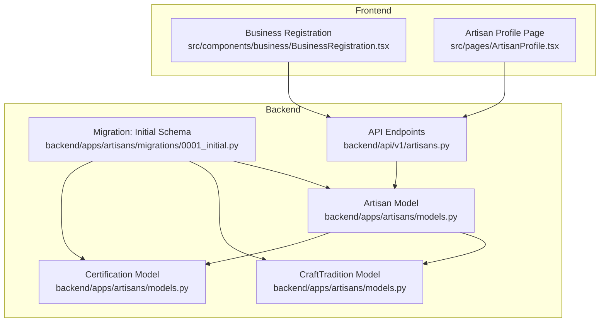
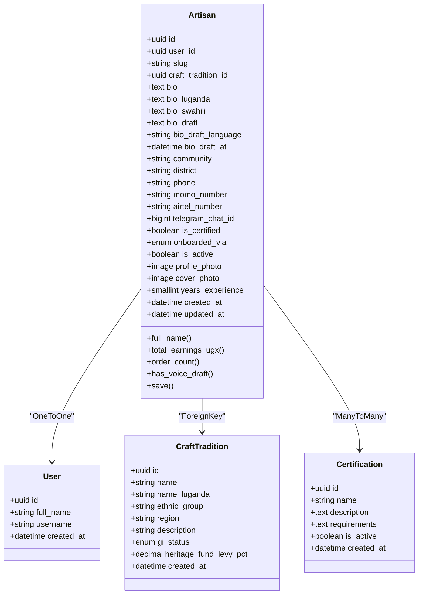
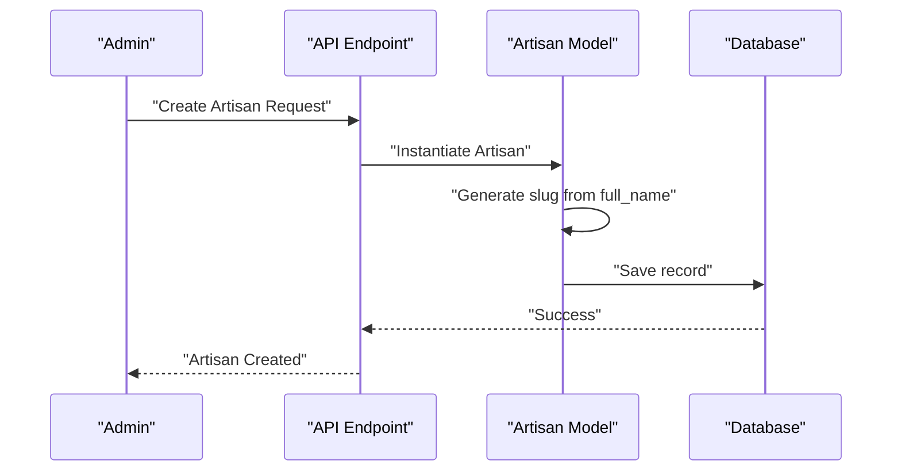
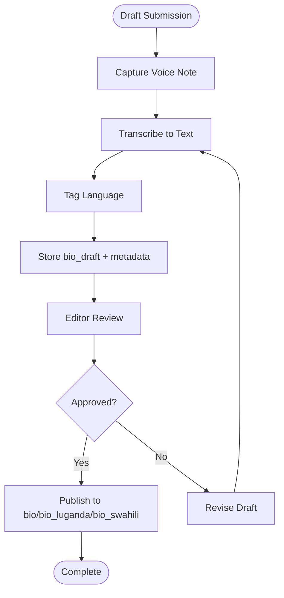
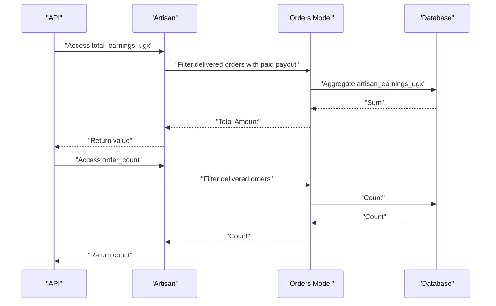
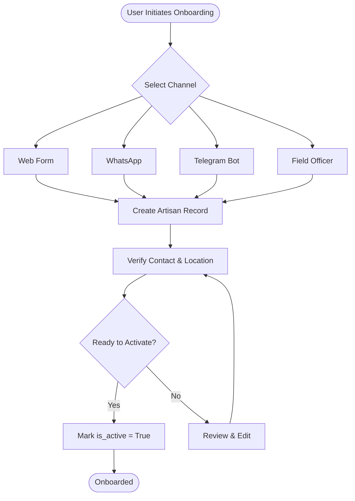
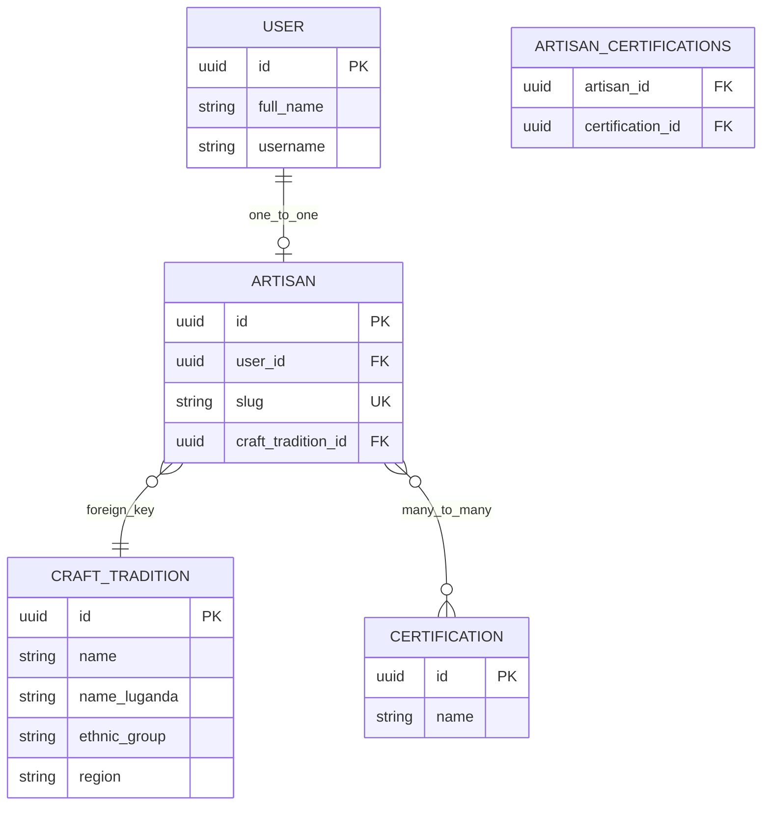
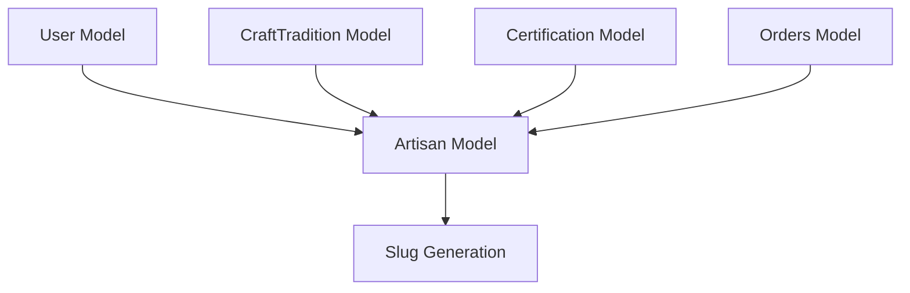

# Artisan Model

<cite>
**Referenced Files in This Document**
- [models.py](file://backend/apps/artisans/models.py)
- [0001_initial.py](file://backend/apps/artisans/migrations/0001_initial.py)
- [artisans.py](file://backend/api/v1/artisans.py)
- [BusinessRegistration.tsx](file://src/components/business/BusinessRegistration.tsx)
- [ArtisanProfile.tsx](file://src/pages/ArtisanProfile.tsx)
- [MIGRATION_GUIDE.md](file://MIGRATION_GUIDE.md)
</cite>

## Table of Contents
1. [Introduction](#introduction)
2. [Project Structure](#project-structure)
3. [Core Components](#core-components)
4. [Architecture Overview](#architecture-overview)
5. [Detailed Component Analysis](#detailed-component-analysis)
6. [Dependency Analysis](#dependency-analysis)
7. [Performance Considerations](#performance-considerations)
8. [Troubleshooting Guide](#troubleshooting-guide)
9. [Conclusion](#conclusion)

## Introduction
This document provides comprehensive data model documentation for the Artisan entity within the Empindu platform. It details the complete field definitions, relationships with the User, CraftTradition, and Certification models, artisan onboarding workflows across multiple channels, multilingual content support, automatic slug generation, status tracking, and analytics properties. It also outlines utility methods and operational considerations for managing artisan records at scale.

## Project Structure
The Artisan model resides in the backend Django application under the artisans app. Supporting migration files define database schema, while API endpoints expose artisan data to the frontend. Frontend components integrate with the API to render artisan profiles and support registration flows.

**Diagram sources**
- [models.py](file://backend/apps/artisans/models.py)
- [0001_initial.py](file://backend/apps/artisans/migrations/0001_initial.py)
- [artisans.py](file://backend/api/v1/artisans.py)
- [BusinessRegistration.tsx](file://src/components/business/BusinessRegistration.tsx)
- [ArtisanProfile.tsx](file://src/pages/ArtisanProfile.tsx)

**Section sources**
- [models.py](file://backend/apps/artisans/models.py)
- [0001_initial.py](file://backend/apps/artisans/migrations/0001_initial.py)
- [artisans.py](file://backend/api/v1/artisans.py)
- [BusinessRegistration.tsx](file://src/components/business/BusinessRegistration.tsx)
- [ArtisanProfile.tsx](file://src/pages/ArtisanProfile.tsx)

## Core Components
This section documents the Artisan model and related entities, focusing on identity, biographical data, location, contact information, certification tracking, media assets, analytics properties, and utility methods.

- Identity
  - user: One-to-one relationship to the User model via a related_name constraint.
  - slug: Unique URL-friendly identifier generated automatically from the artisan's full name.
  - craft_tradition: Foreign key to CraftTradition with PROTECT deletion to maintain referential integrity.
  - certifications: Many-to-many relationship to Certification with related_name for reverse queries.

- Biographical Information (Multilingual Support)
  - bio: Primary biography written in the artisan's voice.
  - bio_luganda: Luganda translation of the biography.
  - bio_swahili: Swahili translation of the biography.
  - bio_draft: Optional voice transcription draft awaiting review.
  - bio_draft_language: Language code indicating the draft's source language.
  - bio_draft_at: Timestamp marking when the draft was created.

- Location Data
  - community: Settlement or locality (e.g., village or town).
  - district: Administrative district.

- Contact Information
  - phone: Primary phone number (used as WhatsApp number).
  - momo_number: MTN Mobile Money number.
  - airtel_number: Airtel Money number.
  - telegram_chat_id: Telegram chat identifier for bot communication.

- Status Tracking
  - is_certified: Boolean flag indicating certification status.
  - onboarded_via: Choice field representing the onboarding channel (web, whatsapp, telegram, field).
  - is_active: Boolean flag controlling visibility and activity.

- Media Assets
  - profile_photo: Image field for the artisan's profile picture.
  - cover_photo: Image field for the artisan's cover photo.

- Experience and Metadata
  - years_experience: Positive integer representing professional experience in years.
  - created_at, updated_at: Auto-populated timestamps for record lifecycle.

- Analytics Properties
  - total_earnings_ugx: Sum of paid artisan earnings from delivered orders.
  - order_count: Count of delivered orders attributed to the artisan.

- Utility Methods
  - full_name: Computed property returning the user's full name or username fallback.
  - has_voice_draft: Boolean check for presence of a voice transcription draft.
  - save: Overrides to auto-generate slug from the artisan's full name, ensuring uniqueness.

**Section sources**
- [models.py](file://backend/apps/artisans/models.py)
- [0001_initial.py](file://backend/apps/artisans/migrations/0001_initial.py)

## Architecture Overview
The Artisan model integrates with the User model to establish digital identity, anchors cultural IP through CraftTradition associations, and tracks quality assurance via Certification relationships. Onboarding occurs across multiple channels, and analytics derive insights from the Orders model.

**Diagram sources**
- [models.py](file://backend/apps/artisans/models.py)
- [0001_initial.py](file://backend/apps/artisans/migrations/0001_initial.py)

**Section sources**
- [models.py](file://backend/apps/artisans/models.py)

## Detailed Component Analysis

### Identity Fields
- user: Links the artisan to a platform user account, enabling authentication and profile management.
- slug: Automatically generated from the artisan's full name; collisions are resolved by appending a counter.
- craft_tradition: Establishes cultural IP anchoring by associating the artisan with a named craft tradition.

**Diagram sources**
- [models.py](file://backend/apps/artisans/models.py)
- [artisans.py](file://backend/api/v1/artisans.py)

**Section sources**
- [models.py](file://backend/apps/artisans/models.py)

### Biographical Information and Multilingual Support
- Primary biography supports three languages: English (bio), Luganda (bio_luganda), and Swahili (bio_swahili).
- Voice transcription drafts are supported with language tagging and timestamps for editorial workflows.

**Diagram sources**
- [models.py](file://backend/apps/artisans/models.py)

**Section sources**
- [models.py](file://backend/apps/artisans/models.py)

### Location Data
- community: Settlement or locality for geographic targeting.
- district: Administrative boundary for regional analytics and logistics.

**Section sources**
- [models.py](file://backend/apps/artisans/models.py)

### Contact Information
- phone: Primary contact used for WhatsApp communications.
- momo_number: MTN Mobile Money for financial transactions.
- airtel_number: Airtel Money as an alternate payment method.
- telegram_chat_id: Telegram chat identifier for bot-based onboarding and support.

**Section sources**
- [models.py](file://backend/apps/artisans/models.py)

### Certification Tracking
- certifications: Many-to-many relationship enabling multiple certifications and reverse lookups from Certification to Artisan.

**Section sources**
- [models.py](file://backend/apps/artisans/models.py)

### Media Assets
- profile_photo: Uploads to a dedicated directory for profile representation.
- cover_photo: Uploads to a dedicated directory for promotional visuals.

**Section sources**
- [models.py](file://backend/apps/artisans/models.py)

### Analytics Properties
- total_earnings_ugx: Aggregates paid artisan earnings from delivered orders.
- order_count: Counts delivered orders attributed to the artisan.

**Diagram sources**
- [models.py](file://backend/apps/artisans/models.py)

**Section sources**
- [models.py](file://backend/apps/artisans/models.py)

### Utility Methods
- full_name: Returns the user's full name or username fallback.
- has_voice_draft: Indicates whether a voice draft exists.
- save: Auto-generates slug from full_name and ensures uniqueness.

**Section sources**
- [models.py](file://backend/apps/artisans/models.py)

### Onboarding Workflows Across Channels
Onboarding occurs through four channels: web, WhatsApp, Telegram, and field officers. The choice is recorded in the onboarded_via field.

**Diagram sources**
- [models.py](file://backend/apps/artisans/models.py)

**Section sources**
- [models.py](file://backend/apps/artisans/models.py)

### Relationship with CraftTradition and Certification
- CraftTradition association establishes cultural IP anchoring and enables regional analytics.
- Certification linkage supports quality assurance and marketing differentiation.

**Diagram sources**
- [models.py](file://backend/apps/artisans/models.py)

**Section sources**
- [models.py](file://backend/apps/artisans/models.py)

### Frontend Integration
- Business Registration component supports initial artisan onboarding and data capture.
- Artisan Profile page consumes API data to render profile details and analytics.

**Section sources**
- [BusinessRegistration.tsx](file://src/components/business/BusinessRegistration.tsx)
- [ArtisanProfile.tsx](file://src/pages/ArtisanProfile.tsx)

## Dependency Analysis
The Artisan model depends on the User model for identity, CraftTradition for cultural IP anchoring, and Certification for quality assurance. Analytics depend on the Orders model. The slug generation mechanism ensures unique URLs for artisan profiles.

**Diagram sources**
- [models.py](file://backend/apps/artisans/models.py)

**Section sources**
- [models.py](file://backend/apps/artisans/models.py)

## Performance Considerations
- Slug generation: The save override iterates until a unique slug is found; for high-volume onboarding, consider precomputing slugs with collision checks to reduce database writes.
- Analytics aggregation: total_earnings_ugx and order_count queries traverse delivered orders; ensure appropriate indexing on status and payout fields for scalability.
- Media storage: Separate directories for profile and cover photos improve organization; consider CDN integration for global delivery.

## Troubleshooting Guide
- Slug conflicts: If slug generation fails due to duplicates, verify the uniqueness logic and confirm slug length limits.
- Missing full_name: The full_name property falls back to username; ensure user profiles are complete.
- Draft review pipeline: Confirm voice draft language tagging and timestamps are populated during transcription workflows.
- Certification linkage: Validate many-to-many relationships when assigning certifications to artisans.

**Section sources**
- [models.py](file://backend/apps/artisans/models.py)

## Conclusion
The Artisan model encapsulates the digital identity of Ugandan artisans, linking them to cultural IP through CraftTradition, supporting multilingual storytelling, and enabling channel-based onboarding. Its analytics properties and utility methods facilitate commerce, marketing, and platform operations. Proper indexing, slug generation strategies, and media optimization will ensure robust performance at scale.