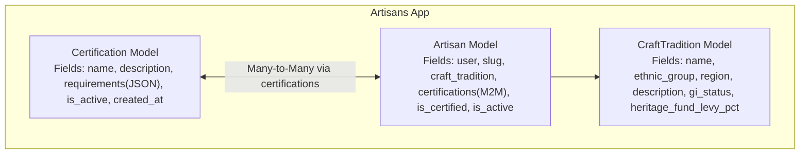
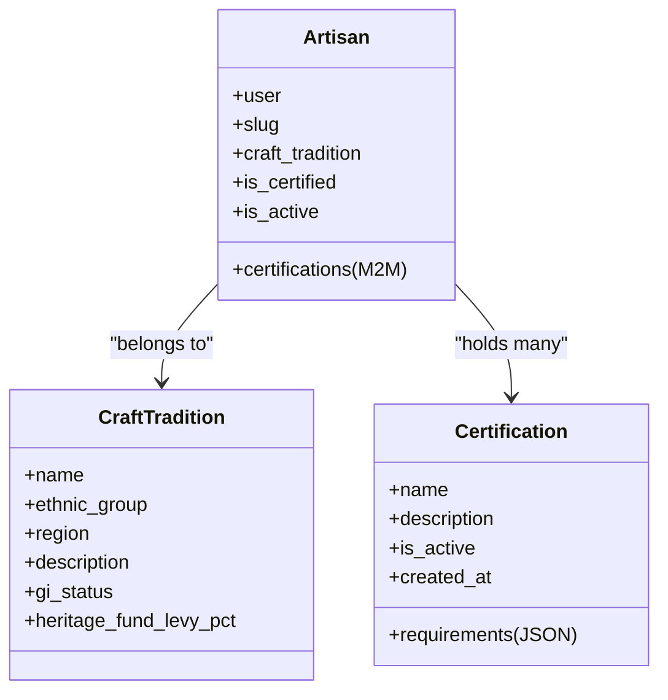
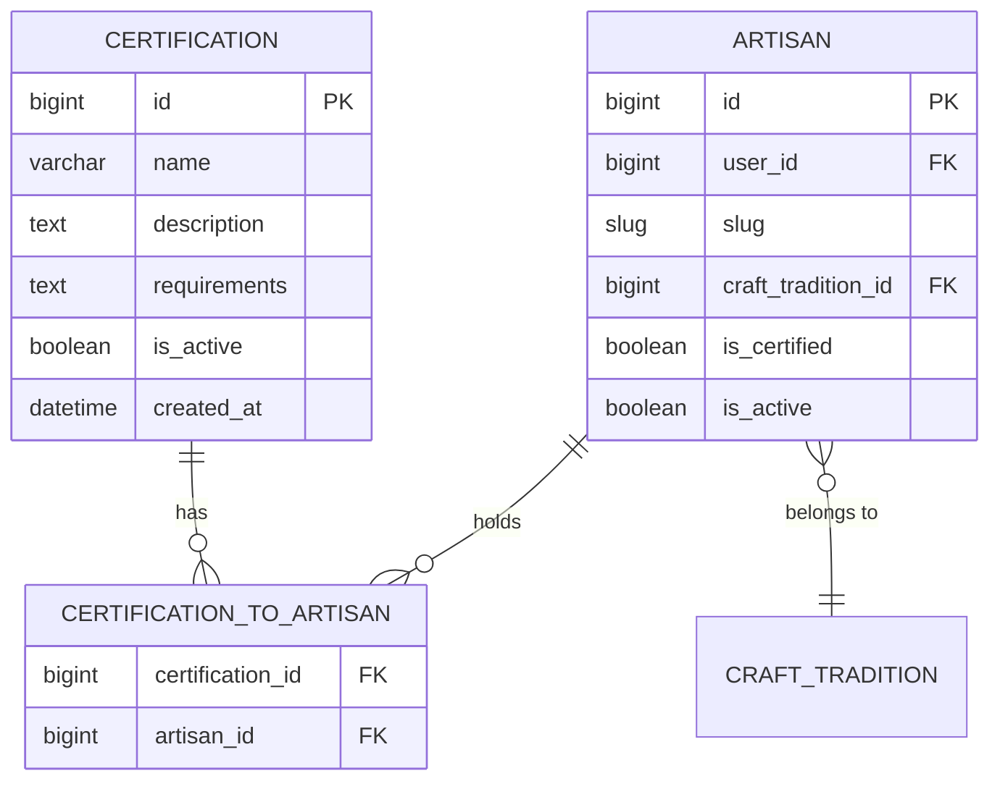
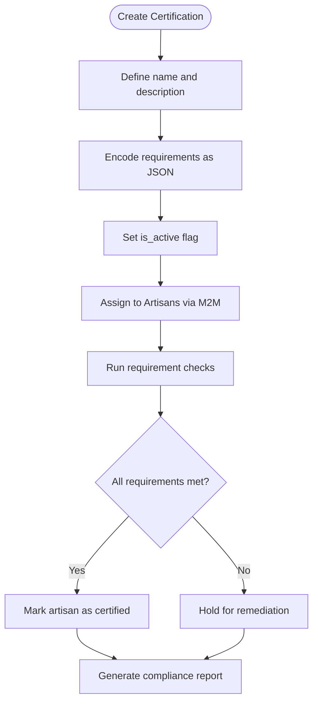
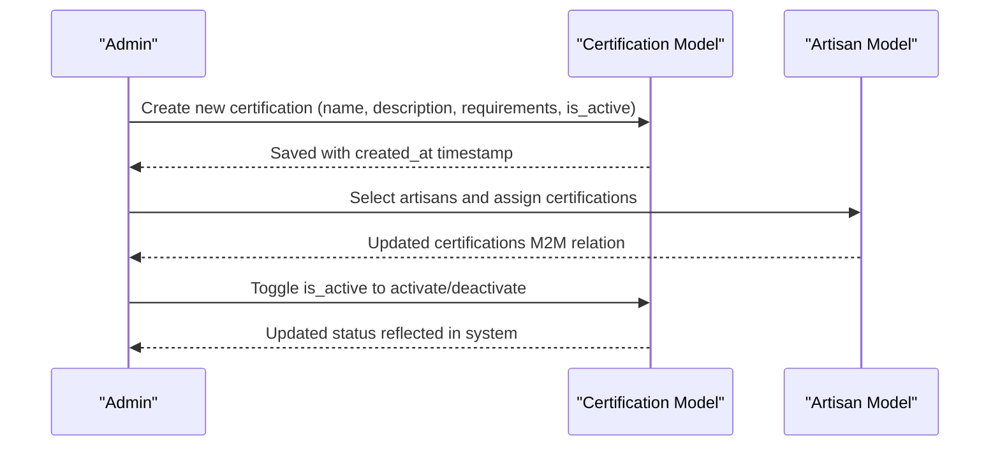
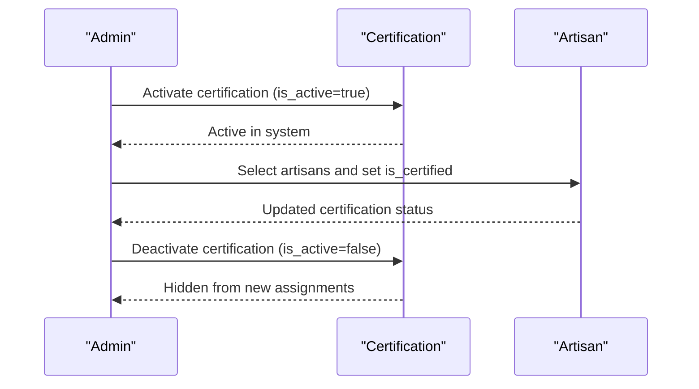
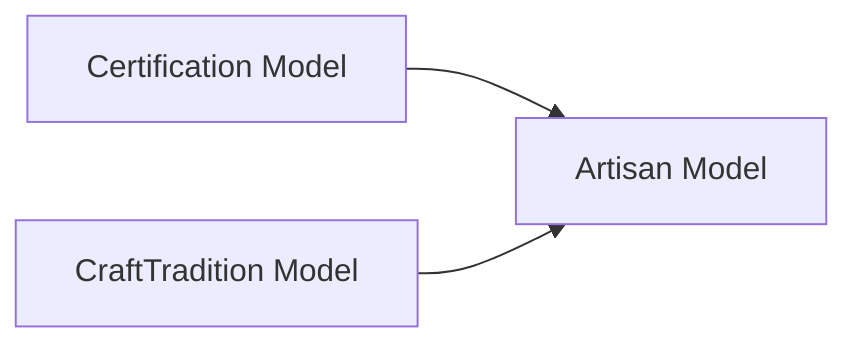

# Certification Model

<cite>
**Referenced Files in This Document**
- [models.py](file://backend/apps/artisans/models.py)
- [0001_initial.py](file://backend/apps/artisans/migrations/0001_initial.py)
- [admin.py](file://backend/apps/artisans/admin.py)
</cite>

## Table of Contents
1. [Introduction](#introduction)
2. [Project Structure](#project-structure)
3. [Core Components](#core-components)
4. [Architecture Overview](#architecture-overview)
5. [Detailed Component Analysis](#detailed-component-analysis)
6. [Dependency Analysis](#dependency-analysis)
7. [Performance Considerations](#performance-considerations)
8. [Troubleshooting Guide](#troubleshooting-guide)
9. [Conclusion](#conclusion)

## Introduction
This document provides comprehensive documentation for the Certification model that powers the Empindu Certified quality assurance program. It explains the certification field structure, the active status tracking mechanism, and the many-to-many relationship with Artisan models. It also details how certification requirements are modeled using JSON, how the lifecycle moves from creation to activation/deactivation, and how certifications enhance artisan credibility and product trust in the marketplace. Finally, it outlines the relationship with artisan certification tracking and the role certifications play in the overall quality ecosystem.

## Project Structure
The Certification model resides within the artisans application alongside related models and migrations:
- Model definition and relationships: [models.py](file://backend/apps/artisans/models.py)
- Initial migration establishing the Certification and Artisan tables and their relationship: [0001_initial.py](file://backend/apps/artisans/migrations/0001_initial.py)
- Admin interface exposing certification management controls: [admin.py](file://backend/apps/artisans/admin.py)

**Diagram sources**
- [models.py:47-170](file://backend/apps/artisans/models.py#L47-L170)

**Section sources**
- [models.py:14-170](file://backend/apps/artisans/models.py#L14-L170)
- [0001_initial.py:17-80](file://backend/apps/artisans/migrations/0001_initial.py#L17-L80)

## Core Components
- Certification model: Defines the Empindu Certified mark with fields for name, description, requirements stored as JSON, active status, and timestamps.
- Artisan model: Links to Certification via a many-to-many relationship and tracks individual artisan certification status.
- CraftTradition model: Provides cultural and geographic context for artisans and complements the certification ecosystem.

Key characteristics:
- Certification fields: name, description, requirements (JSON), is_active, created_at.
- Relationship: Artisan.certifications is a many-to-many field pointing to Certification.
- Active status: is_active governs whether a certification is currently usable in the system.
- Lifecycle: Creation through migration, activation/deactivation via admin actions.

**Section sources**
- [models.py:47-85](file://backend/apps/artisans/models.py#L47-L85)
- [0001_initial.py:17-74](file://backend/apps/artisans/migrations/0001_initial.py#L17-L74)

## Architecture Overview
The certification architecture centers on three interconnected models. Certifications define quality and authenticity criteria, Artisans can hold multiple certifications, and CraftTraditions provide cultural context. The admin interface supports certification management and artisan certification toggling.

**Diagram sources**
- [models.py:14-170](file://backend/apps/artisans/models.py#L14-L170)

## Detailed Component Analysis

### Certification Model Fields and Purpose
- name: Human-readable certification title.
- description: Narrative explanation of the certification’s goals and standards.
- requirements: JSON-encoded list of requirements enabling dynamic validation rules and checks.
- is_active: Boolean flag controlling whether the certification is available for assignment.
- created_at: Timestamp for audit and reporting.

These fields collectively enable a flexible, data-driven certification framework that can evolve without code changes.

**Section sources**
- [models.py:47-60](file://backend/apps/artisans/models.py#L47-L60)
- [0001_initial.py:18-26](file://backend/apps/artisans/migrations/0001_initial.py#L18-L26)

### Many-to-Many Relationship with Artisan
- Artisan.certifications is a many-to-many field linked to Certification with related_name "artisans".
- This allows multiple artisans to hold the same certification and a single artisan to hold multiple certifications.
- The relationship is established in both the model and the initial migration.

**Diagram sources**
- [models.py:83-85](file://backend/apps/artisans/models.py#L83-L85)
- [0001_initial.py:72](file://backend/apps/artisans/migrations/0001_initial.py#L72)

**Section sources**
- [models.py:83-85](file://backend/apps/artisans/models.py#L83-L85)
- [0001_initial.py:72](file://backend/apps/artisans/migrations/0001_initial.py#L72)

### Certification Requirements System
- Requirements are stored as JSON to support structured, machine-readable validation rules.
- This enables dynamic requirement evaluation, automated checks, and future extensibility without altering the database schema.
- The JSON format allows teams to encode diverse requirement types (e.g., documentation, process steps, audits) and integrate them with verification workflows.

**Diagram sources**
- [models.py:47-60](file://backend/apps/artisans/models.py#L47-L60)
- [models.py:83-85](file://backend/apps/artisans/models.py#L83-L85)

**Section sources**
- [models.py:52-56](file://backend/apps/artisans/models.py#L52-L56)

### Certification Lifecycle: Creation to Activation/Deactivation
- Creation: Defined in the initial migration with fields for name, description, requirements, is_active, and created_at.
- Activation/Deactivation: Controlled via the admin interface, where administrators can toggle is_active to activate or deactivate certifications.
- Assignment: Administrators can assign certifications to artisans through the Artisan admin panel.

**Diagram sources**
- [0001_initial.py:18-26](file://backend/apps/artisans/migrations/0001_initial.py#L18-L26)
- [admin.py:87-92](file://backend/apps/artisans/admin.py#L87-L92)
- [models.py:83-85](file://backend/apps/artisans/models.py#L83-L85)

**Section sources**
- [0001_initial.py:18-26](file://backend/apps/artisans/migrations/0001_initial.py#L18-L26)
- [admin.py:87-92](file://backend/apps/artisans/admin.py#L87-L92)

### Enhancing Artisan Credibility and Product Trust
- Quality Assurance: Certifications signal adherence to documented standards, backed by JSON-encoded requirements.
- Authenticity Validation: The Empindu Certified mark distinguishes genuine artisan-made products and practices.
- Marketplace Trust: Buyers gain confidence through visible certification badges and verified compliance.
- Ecosystem Role: Certifications tie into the broader quality ecosystem by aligning with CraftTradition context and supporting heritage and cultural authenticity.

**Section sources**
- [models.py:48-50](file://backend/apps/artisans/models.py#L48-L50)
- [models.py:14-45](file://backend/apps/artisans/models.py#L14-L45)

### Relationship with Artisan Certification Tracking
- Artisan-level tracking: Artisan.is_certified indicates whether an artisan holds at least one active certification.
- Certification-level tracking: Certification.is_active governs availability and visibility of the certification.
- Administrative controls: The admin exposes list filters and actions to manage certifications and bulk certify artisans.

**Diagram sources**
- [models.py:108](file://backend/apps/artisans/models.py#L108)
- [models.py:55](file://backend/apps/artisans/models.py#L55)
- [admin.py:63-71](file://backend/apps/artisans/admin.py#L63-L71)

**Section sources**
- [models.py:108](file://backend/apps/artisans/models.py#L108)
- [models.py:55](file://backend/apps/artisans/models.py#L55)
- [admin.py:63-71](file://backend/apps/artisans/admin.py#L63-L71)

## Dependency Analysis
- Internal dependencies:
  - Artisan depends on Certification via a many-to-many relationship.
  - Artisan depends on CraftTradition via a foreign key.
  - Certification is independent and standalone.
- External dependencies:
  - Django ORM for model definitions and migrations.
  - Admin interface for managing certifications and assigning them to artisans.

**Diagram sources**
- [models.py:47-170](file://backend/apps/artisans/models.py#L47-L170)

**Section sources**
- [models.py:47-170](file://backend/apps/artisans/models.py#L47-L170)

## Performance Considerations
- JSON requirements parsing: Ensure efficient parsing and caching of requirement rules to avoid repeated computation during validation workflows.
- Many-to-many queries: Use select_related and prefetch_related to minimize N+1 query risks when listing artisans with their certifications.
- Indexing: Consider indexing frequently filtered fields (e.g., is_active) to improve admin and API performance.
- Migration footprint: Keep requirement JSON concise and versioned to prevent bloated migrations and slow schema updates.

## Troubleshooting Guide
- Invalid JSON in requirements: Validate JSON structure before saving to prevent runtime errors during requirement evaluation.
- Missing certifications after deactivation: Confirm that deactivated certifications are excluded from new assignments and that existing artisan records remain unchanged.
- Admin actions not applying: Verify permissions for certification-related admin actions and ensure bulk update operations target the correct fields.

**Section sources**
- [models.py:54](file://backend/apps/artisans/models.py#L54)
- [admin.py:87-92](file://backend/apps/artisans/admin.py#L87-L92)

## Conclusion
The Certification model forms the backbone of the Empindu Certified quality assurance program. Its flexible JSON-based requirements system, combined with robust active status tracking and a many-to-many relationship with Artisans, enables scalable quality governance. Through administrative controls and ecosystem alignment with CraftTradition, certifications enhance artisan credibility and product trust, reinforcing a credible and authentic marketplace.