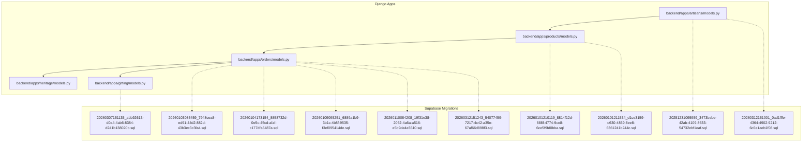
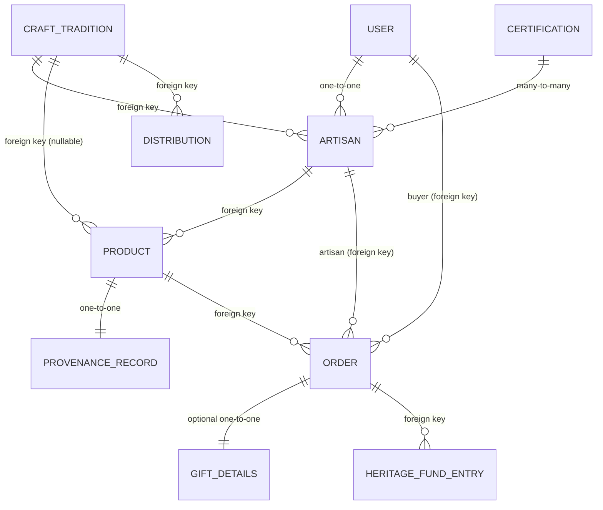
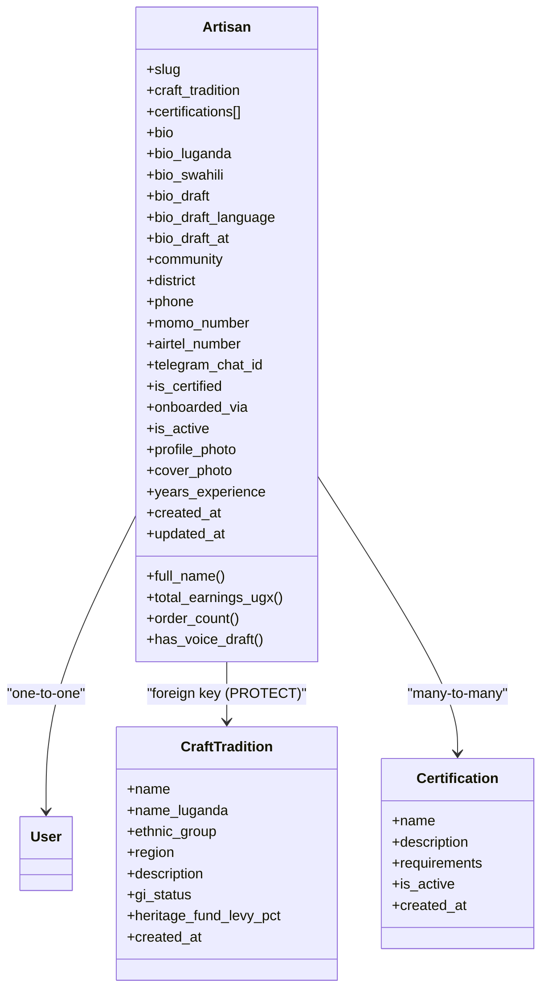
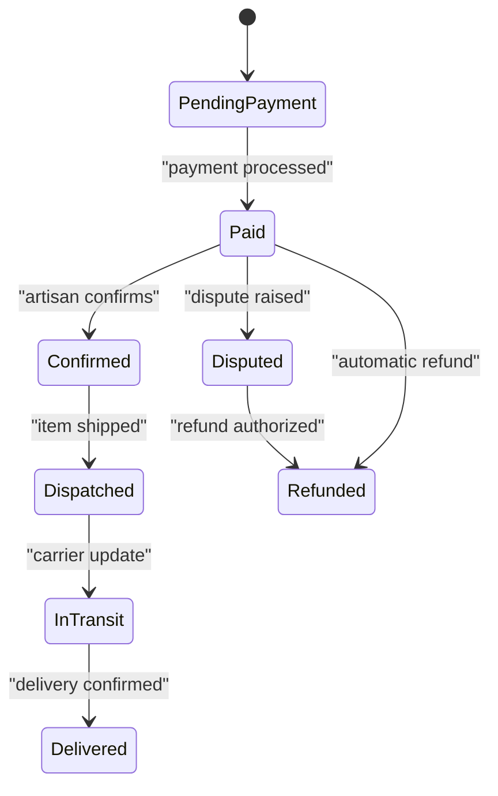
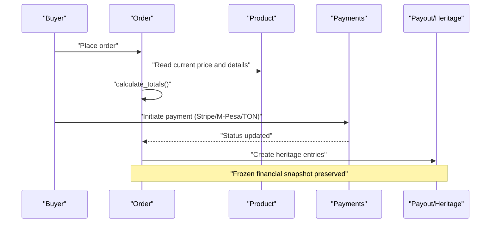
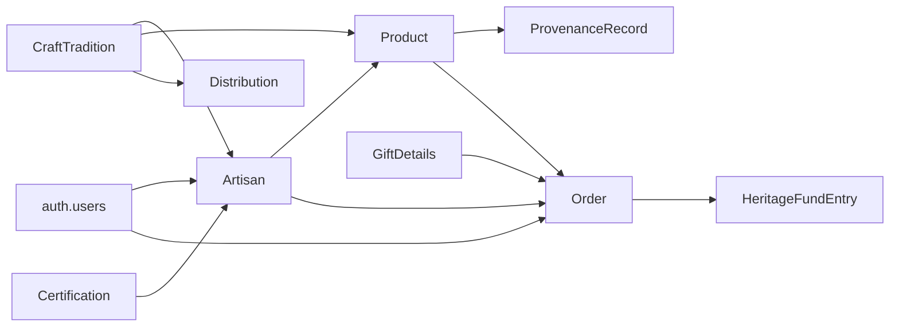

# Core Entities

<cite>
**Referenced Files in This Document**
- [models.py](file://backend/apps/artisans/models.py)
- [models.py](file://backend/apps/products/models.py)
- [models.py](file://backend/apps/orders/models.py)
- [models.py](file://backend/apps/heritage/models.py)
- [models.py](file://backend/apps/gifting/models.py)
- [20251231095959_3473bebe-42ab-4109-8633-54732ebf1eaf.sql](file://supabase/migrations/20251231095959_3473bebe-42ab-4109-8633-54732ebf1eaf.sql)
- [20260101210119_8814f12d-688f-4774-9ce8-6ce5f9fd0bba.sql](file://supabase/migrations/20260101210119_8814f12d-688f-4774-9ce8-6ce5f9fd0bba.sql)
- [20260101211534_d1ce3159-d630-4859-8ee8-6361241b244c.sql](file://supabase/migrations/20260101211534_d1ce3159-d630-4859-8ee8-6361241b244c.sql)
- [20260103085459_7948cea8-ed91-44d2-882d-43b3ec3c3fa4.sql](file://supabase/migrations/20260103085459_7948cea8-ed91-44d2-882d-43b3ec3c3fa4.sql)
- [20260104173154_8858732d-0e5c-45cd-afaf-c177dfa5487a.sql](file://supabase/migrations/20260104173154_8858732d-0e5c-45cd-afaf-c177dfa5487a.sql)
- [20260109095251_6889a1b9-3b1c-4b8f-9535-f3ef095414de.sql](file://supabase/migrations/20260109095251_6889a1b9-3b1c-4b8f-9535-f3ef095414de.sql)
- [20260110084208_19f31e38-2062-4a6a-a516-e5b9de4e3510.sql](file://supabase/migrations/20260110084208_19f31e38-2062-4a6a-a516-e5b9de4e3510.sql)
- [20260307151135_abb92613-d0a4-4ab6-8384-d241b138020b.sql](file://supabase/migrations/20260307151135_abb92613-d0a4-4ab6-8384-d241b138020b.sql)
- [20260312151001_0ad1fffe-4364-4902-9212-6c6e1aeb1f08.sql](file://supabase/migrations/20260312151001_0ad1fffe-4364-4902-9212-6c6e1aeb1f08.sql)
- [20260312151243_54077459-7217-4c42-a35e-67af66d898f3.sql](file://supabase/migrations/20260312151243_54077459-7217-4c42-a35e-67af66d898f3.sql)
</cite>

## Table of Contents
1. [Introduction](#introduction)
2. [Project Structure](#project-structure)
3. [Core Components](#core-components)
4. [Architecture Overview](#architecture-overview)
5. [Detailed Component Analysis](#detailed-component-analysis)
6. [Dependency Analysis](#dependency-analysis)
7. [Performance Considerations](#performance-considerations)
8. [Troubleshooting Guide](#troubleshooting-guide)
9. [Conclusion](#conclusion)

## Introduction
This document defines the core business entities in Empindu: Artisan, Product, and Order. It consolidates Django ORM models with the underlying Supabase schema to present a unified data model, including identities, relationships, constraints, multilingual fields, embeddings, and lifecycle states. It also documents the artisan identity system (user relationships, craft traditions, certifications), the story-first product architecture (provenance, embeddings, multilingual content), and the complete order lifecycle (payment states, fulfillment, payouts, returns).

## Project Structure
The core models are implemented in Django apps under backend/apps, with the authoritative schema defined in Supabase migrations. The Django models mirror the database schema and add convenience properties and relationships used by the API and services.



**Diagram sources**
- [models.py:1-170](file://backend/apps/artisans/models.py#L1-L170)
- [models.py:1-153](file://backend/apps/products/models.py#L1-L153)
- [models.py:1-122](file://backend/apps/orders/models.py#L1-L122)
- [models.py:1-66](file://backend/apps/heritage/models.py#L1-L66)
- [models.py:1-67](file://backend/apps/gifting/models.py#L1-L67)
- [20251231095959_3473bebe-42ab-4109-8633-54732ebf1eaf.sql:1-140](file://supabase/migrations/20251231095959_3473bebe-42ab-4109-8633-54732ebf1eaf.sql#L1-L140)
- [20260101210119_8814f12d-688f-4774-9ce8-6ce5f9fd0bba.sql:1-118](file://supabase/migrations/20260101210119_8814f12d-688f-4774-9ce8-6ce5f9fd0bba.sql#L1-L118)
- [20260101211534_d1ce3159-d630-4859-8ee8-6361241b244c.sql:1-31](file://supabase/migrations/20260101211534_d1ce3159-d630-4859-8ee8-6361241b244c.sql#L1-L31)
- [20260103085459_7948cea8-ed91-44d2-882d-43b3ec3c3fa4.sql:1-53](file://supabase/migrations/20260103085459_7948cea8-ed91-44d2-882d-43b3ec3c3fa4.sql#L1-L53)
- [20260104173154_8858732d-0e5c-45cd-afaf-c177dfa5487a.sql:1-22](file://supabase/migrations/20260104173154_8858732d-0e5c-45cd-afaf-c177dfa5487a.sql#L1-L22)
- [20260109095251_6889a1b9-3b1c-4b8f-9535-f3ef095414de.sql:1-7](file://supabase/migrations/20260109095251_6889a1b9-3b1c-4b8f-9535-f3ef095414de.sql#L1-L7)
- [20260110084208_19f31e38-2062-4a6a-a516-e5b9de4e3510.sql:1-45](file://supabase/migrations/20260110084208_19f31e38-2062-4a6a-a516-e5b9de4e3510.sql#L1-L45)
- [20260307151135_abb92613-d0a4-4ab6-8384-d241b138020b.sql:1-44](file://supabase/migrations/20260307151135_abb92613-d0a4-4ab6-8384-d241b138020b.sql#L1-L44)
- [20260312151001_0ad1fffe-4364-4902-9212-6c6e1aeb1f08.sql:1-73](file://supabase/migrations/20260312151001_0ad1fffe-4364-4902-9212-6c6e1aeb1f08.sql#L1-L73)
- [20260312151243_54077459-7217-4c42-a35e-67af66d898f3.sql:1-4](file://supabase/migrations/20260312151243_54077459-7217-4c42-a35e-67af66d898f3.sql#L1-L4)

**Section sources**
- [models.py:1-170](file://backend/apps/artisans/models.py#L1-L170)
- [models.py:1-153](file://backend/apps/products/models.py#L1-L153)
- [models.py:1-122](file://backend/apps/orders/models.py#L1-L122)
- [models.py:1-66](file://backend/apps/heritage/models.py#L1-L66)
- [models.py:1-67](file://backend/apps/gifting/models.py#L1-L67)

## Core Components

### Artisan
- Identity and user relationship
  - One-to-one mapping to the Django User model via a foreign key to the Supabase auth.users table.
  - Slug-based URL-friendly identifier.
- Craft and culture
  - Foreign key to CraftTradition; protected deletion to preserve referential integrity.
  - Many-to-many with Certification for Empindu Certified marks.
- Multilingual biography
  - Fields for English, Luganda, and Swahili versions of the biography and draft transcription fields with language and timestamp.
- Location and contact
  - Community and district; phone numbers for WhatsApp, MTN MoMo, Airtel Money; Telegram chat ID.
- Status and media
  - Active/inactive flag; onboarding channel; profile and cover photos.
- Experience and timestamps
  - Years of experience; created/updated timestamps.
- Properties
  - Full name derived from the User model.
  - Total earnings and order count computed from related Order records.

Constraints and indexes
- Unique slug.
- Protected deletion for CraftTradition; cascade deletion for User.
- Ordering by created_at desc.

**Section sources**
- [models.py:62-170](file://backend/apps/artisans/models.py#L62-L170)
- [20251231095959_3473bebe-42ab-4109-8633-54732ebf1eaf.sql:1-140](file://supabase/migrations/20251231095959_3473bebe-42ab-4109-8633-54732ebf1eaf.sql#L1-L140)

### CraftTradition
- Cultural IP anchor
  - Name, Luganda name, ethnic group, region, and description.
  - Geographic and legal status (e.g., Geographical Indication status).
  - Heritage fund levy percentage.
  - Created timestamp.

Constraints and indexes
- Ordering by name.

**Section sources**
- [models.py:14-45](file://backend/apps/artisans/models.py#L14-L45)

### Certification
- Quality assurance
  - Name, description, requirements stored as text, active flag, created timestamp.

Constraints and indexes
- None explicitly defined in the model; defaults apply.

**Section sources**
- [models.py:47-60](file://backend/apps/artisans/models.py#L47-L60)

### Product
- Attribution
  - Foreign keys to Artisan and CraftTradition; CraftTradition can be null (SET NULL).
- Identity and multilingual story
  - Slug, name, Luganda name; story and translations; draft story with language and timestamp.
- Craft details
  - Material, technique, estimated days to make.
- Pricing and revenue split
  - UGX and USD prices; percentages for artisan, heritage fund, and platform; computed earnings fields.
- Inventory and status
  - Stock quantity; status choices include draft, active, sold out, archived.
- Customisation and shipping
  - Customisable flag; weight in grams.
- Embeddings
  - Vector field for semantic search (dimensions configured).
- Timestamps
  - Created/updated timestamps.

Computed properties
- Artisan earnings and heritage fund contribution per unit.

Constraints and indexes
- Ordering by created_at desc.
- Slug uniqueness enforced at the database level.

**Section sources**
- [models.py:10-100](file://backend/apps/products/models.py#L10-L100)
- [20260101210119_8814f12d-688f-4774-9ce8-6ce5f9fd0bba.sql:1-118](file://supabase/migrations/20260101210119_8814f12d-688f-4774-9ce8-6ce5f9fd0bba.sql#L1-L118)

### ProductPhoto
- Multiple images per product with captions, hero image flag, and sort order.
- Foreign key to Product with cascade deletion.

Constraints and indexes
- Ordering by sort_order and hero flag.

**Section sources**
- [models.py:102-120](file://backend/apps/products/models.py#L102-L120)

### ProvenanceRecord
- Immutable cultural attribution snapshot linked one-to-one to a Product.
- Captures artisan, community, district, craft tradition, ethnic group, technique detail, material source, GI status, and optional blockchain hash.
- Created timestamp.

Constraints and indexes
- One-to-one relationship with Product; verbose plural name.

**Section sources**
- [models.py:122-153](file://backend/apps/products/models.py#L122-L153)

### Order
- Parties and product linkage
  - Foreign keys to Product, Buyer (User), and Artisan; protected deletion for Product and Artisan.
- Status and payout
  - Status choices covering payment, confirmation, dispatch, transit, delivery, dispute, refund.
  - Payout status choices for artisan disbursement.
- Gift association
  - Optional one-to-one to GiftDetails for gifting flow.
- Quantity and financial snapshot
  - Quantity ordered; frozen totals at order time (UGX and USD prices, artisan earnings, platform commission, heritage fund contribution).
- Payment
  - Payment method choices; payment reference.
- Shipping
  - Recipient name, address JSON, ISO country code, tracking number, optional dispatch photo.
- Timestamps
  - Created at, paid at, dispatched at, delivered at.

Computed method
- calculate_totals: computes all frozen financial fields based on current product pricing and quantity.

Constraints and indexes
- Ordering by created_at desc.

**Section sources**
- [models.py:10-122](file://backend/apps/orders/models.py#L10-L122)

### GiftDetails
- Gift personalisation for recipient, occasion, message, wrapping, and optional scheduled delivery date.

**Section sources**
- [models.py:9-37](file://backend/apps/gifting/models.py#L9-L37)

### GiftOrder
- Corporate/bulk gifting aggregation with customer details, item count, total amount, status, and timestamps.

**Section sources**
- [models.py:39-67](file://backend/apps/gifting/models.py#L39-L67)

### HeritageFundEntry and Distribution
- HeritageFundEntry: immutable ledger entries for every order, type (contribution/distribution), amount, craft tradition, and description.
- Distribution: planned or executed fund distributions to communities with status and approvals.

**Section sources**
- [models.py:9-37](file://backend/apps/heritage/models.py#L9-L37)
- [models.py:39-66](file://backend/apps/heritage/models.py#L39-L66)

## Architecture Overview
The data model centers on three pillars:
- Identity: User → Artisan, with craft and certification associations.
- Product: Story-first with provenance, multilingual content, and embeddings.
- Order: Lifecycle with payment, fulfillment, and payout states.



**Diagram sources**
- [models.py:62-170](file://backend/apps/artisans/models.py#L62-L170)
- [models.py:10-153](file://backend/apps/products/models.py#L10-L153)
- [models.py:10-122](file://backend/apps/orders/models.py#L10-L122)
- [models.py:9-67](file://backend/apps/gifting/models.py#L9-L67)
- [models.py:9-66](file://backend/apps/heritage/models.py#L9-L66)

## Detailed Component Analysis

### Artisan Identity System
- User relationship
  - One-to-one with Django User; slug auto-generated from full name; uniqueness enforced.
- Craft tradition associations
  - Protected deletion ensures historical provenance remains intact.
- Certifications
  - Many-to-many with active/inactive certifications; used for Empindu Certified branding.
- Multilingual biographies
  - Biography and draft fields support Luganda and Swahili; draft language and timestamp enable review workflows.
- Contact and payments
  - Multiple payment channels supported; Telegram chat ID enables customer service.



**Diagram sources**
- [models.py:62-170](file://backend/apps/artisans/models.py#L62-L170)

**Section sources**
- [models.py:62-170](file://backend/apps/artisans/models.py#L62-L170)

### Story-First Product Architecture
- Story and provenance
  - Product anchors narrative and craft details; ProvenanceRecord snapshots cultural IP at listing time.
- Multilingual content
  - Names and stories support English, Luganda, and Swahili.
- Embeddings
  - Vector field for semantic search; updated by background tasks.
- Photos
  - Multiple images with hero selection and sort order.

```mermaid
classDiagram
class Product {
+slug
+name
+name_luganda
+story
+story_luganda
+story_swahili
+story_draft
+story_draft_language
+story_draft_at
+material
+technique
+days_to_make
+price_ugx
+price_usd
+artisan_pct
+heritage_pct
+platform_pct
+stock
+status
+is_customisable
+weight_grams
+embedding
+created_at
+updated_at
+artisan_earnings_ugx()
+heritage_fund_ugx()
}
class ProductPhoto {
+image
+caption
+is_hero
+sort_order
}
class ProvenanceRecord {
+artisan_name
+community
+district
+craft_tradition
+ethnic_group
+technique_detail
+material_source
+gi_status
+record_hash
+created_at
}
class Artisan
class CraftTradition
Product --> Artisan : "foreign key"
Product --> CraftTradition : "foreign key (nullable)"
Product --> ProductPhoto : "one-to-many"
Product ||--|| ProvenanceRecord : "one-to-one"
```

**Diagram sources**
- [models.py:10-153](file://backend/apps/products/models.py#L10-L153)

**Section sources**
- [models.py:10-153](file://backend/apps/products/models.py#L10-L153)

### Complete Order Lifecycle
- States and transitions
  - Payment, confirmation, dispatch, transit, delivery, dispute, refund.
- Financial snapshot
  - Frozen totals at order time; payout status tracks artisan disbursement.
- Fulfillment and returns
  - Tracking number and dispatch photo; return handled via refund state.
- Gift orders
  - Optional gift details and separate gift order aggregation.



**Diagram sources**
- [models.py:16-25](file://backend/apps/orders/models.py#L16-L25)



**Diagram sources**
- [models.py:111-122](file://backend/apps/orders/models.py#L111-L122)
- [20260110084208_19f31e38-2062-4a6a-a516-e5b9de4e3510.sql:1-45](file://supabase/migrations/20260110084208_19f31e38-2062-4a6a-a516-e5b9de4e3510.sql#L1-L45)
- [20260109095251_6889a1b9-3b1c-4b8f-9535-f3ef095414de.sql:1-7](file://supabase/migrations/20260109095251_6889a1b9-3b1c-4b8f-9535-f3ef095414de.sql#L1-L7)

**Section sources**
- [models.py:10-122](file://backend/apps/orders/models.py#L10-L122)
- [20260110084208_19f31e38-2062-4a6a-a516-e5b9de4e3510.sql:1-45](file://supabase/migrations/20260110084208_19f31e38-2062-4a6a-a516-e5b9de4e3510.sql#L1-L45)

## Dependency Analysis
- Django models depend on Supabase auth.users and storage; foreign keys enforce referential integrity.
- Order depends on Product and Artisan; Product depends on Artisan and CraftTradition; ProvenanceRecord depends on Product.
- Gifting and Heritage modules integrate with Order lifecycle.



**Diagram sources**
- [models.py:62-170](file://backend/apps/artisans/models.py#L62-L170)
- [models.py:10-153](file://backend/apps/products/models.py#L10-L153)
- [models.py:10-122](file://backend/apps/orders/models.py#L10-L122)
- [models.py:9-67](file://backend/apps/gifting/models.py#L9-L67)
- [models.py:9-66](file://backend/apps/heritage/models.py#L9-L66)

**Section sources**
- [models.py:62-170](file://backend/apps/artisans/models.py#L62-L170)
- [models.py:10-153](file://backend/apps/products/models.py#L10-L153)
- [models.py:10-122](file://backend/apps/orders/models.py#L10-L122)
- [models.py:9-67](file://backend/apps/gifting/models.py#L9-L67)
- [models.py:9-66](file://backend/apps/heritage/models.py#L9-L66)

## Performance Considerations
- Indexing strategies
  - Slug uniqueness on Artisan and Product ensures fast lookups.
  - ForeignKey indexes on Order to Product, Buyer, and Artisan improve join performance.
  - Vector embeddings for Product enable semantic search; maintain vector dimensions consistently.
- Query patterns
  - Use select_related and prefetch_related to minimize N+1 queries for Order listings and analytics.
  - Denormalized frozen totals in Order reduce repeated calculations during reporting.
- Storage and media
  - Image uploads to storage buckets; ensure bucket policies restrict access appropriately.
- Real-time updates
  - Use triggers and background tasks for embedding updates and payment reconciliation.

[No sources needed since this section provides general guidance]

## Troubleshooting Guide
- Slug collisions
  - Slugs are auto-generated; if duplicates occur, the model appends a counter. Verify slug uniqueness and regeneration logic.
- Embedding updates
  - Vector updates are asynchronous; ensure Celery tasks are running and dimensions match model configuration.
- Payment reconciliation
  - Payments table mirrors payment events; reconcile discrepancies by checking transaction references and statuses.
- Access control
  - RLS policies restrict visibility; verify user roles and policies for buyers, artisans, and admins.

**Section sources**
- [models.py:157-166](file://backend/apps/artisans/models.py#L157-L166)
- [20260110084208_19f31e38-2062-4a6a-a516-e5b9de4e3510.sql:1-45](file://supabase/migrations/20260110084208_19f31e38-2062-4a6a-a516-e5b9de4e3510.sql#L1-L45)
- [20260312151001_0ad1fffe-4364-4902-9212-6c6e1aeb1f08.sql:1-73](file://supabase/migrations/20260312151001_0ad1fffe-4364-4902-9212-6c6e1aeb1f08.sql#L1-L73)

## Conclusion
Empindu’s core entities form a cohesive data model that balances cultural storytelling, identity verification, and operational commerce. The Django models provide convenient relationships and computed fields, while Supabase migrations define robust constraints, RLS policies, and performance-oriented structures. Together, they support the artisan identity system, the story-first product architecture, and the end-to-end order lifecycle with transparent heritage fund accounting.