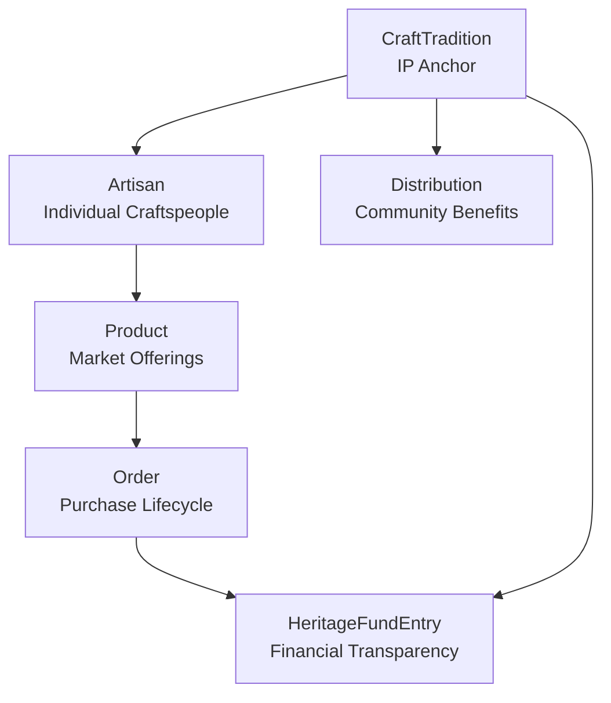
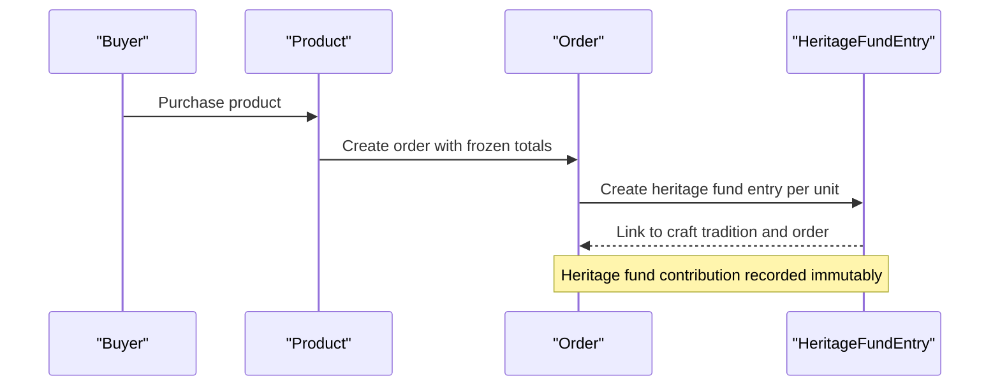
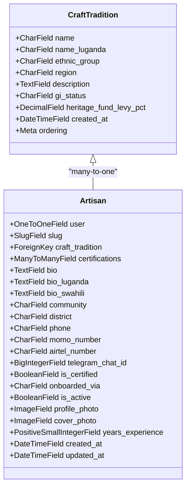
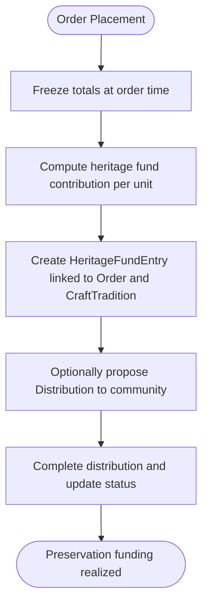
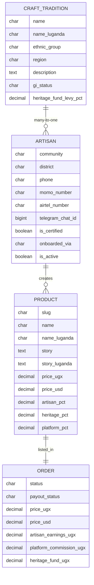
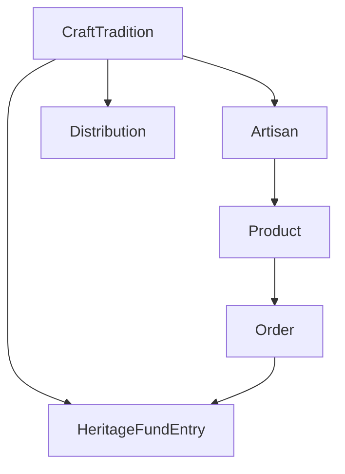

# Craft Tradition Model

<cite>
**Referenced Files in This Document**
- [artisans/models.py](file://backend/apps/artisans/models.py)
- [products/models.py](file://backend/apps/products/models.py)
- [orders/models.py](file://backend/apps/orders/models.py)
- [heritage/models.py](file://backend/apps/heritage/models.py)
</cite>

## Table of Contents
1. [Introduction](#introduction)
2. [Project Structure](#project-structure)
3. [Core Components](#core-components)
4. [Architecture Overview](#architecture-overview)
5. [Detailed Component Analysis](#detailed-component-analysis)
6. [Dependency Analysis](#dependency-analysis)
7. [Performance Considerations](#performance-considerations)
8. [Troubleshooting Guide](#troubleshooting-guide)
9. [Conclusion](#conclusion)

## Introduction
This document provides comprehensive documentation for the CraftTradition model, which serves as the cultural Intellectual Property (IP) anchor of Empindu. It explains the model's field definitions, its relationship with Artisan and Product models, the heritage fund levy system, multilingual naming support, and the Geographic Indication (GI) status tracking. It also outlines the cultural significance of craft traditions, documentation requirements, protection mechanisms via GI registration, and the regional and ethnic categorization system used for heritage preservation and market positioning.

## Project Structure
The CraftTradition model resides in the artisans app alongside related models that define the ecosystem around cultural craft traditions:
- CraftTradition: central IP anchor for craft traditions
- Artisan: individual craftspeople linked to a craft tradition
- Product: market offerings tied to artisans and craft traditions
- Order: purchase lifecycle that triggers financial snapshots and heritage fund contributions
- HeritageFundEntry and Distribution: financial transparency and community benefit mechanisms

**Diagram sources**
- [artisans/models.py:14-45](file://backend/apps/artisans/models.py#L14-L45)
- [artisans/models.py:62-170](file://backend/apps/artisans/models.py#L62-L170)
- [products/models.py:10-100](file://backend/apps/products/models.py#L10-L100)
- [orders/models.py:10-122](file://backend/apps/orders/models.py#L10-L122)
- [heritage/models.py:9-66](file://backend/apps/heritage/models.py#L9-L66)

**Section sources**
- [artisans/models.py:14-45](file://backend/apps/artisans/models.py#L14-L45)
- [artisans/models.py:62-170](file://backend/apps/artisans/models.py#L62-L170)
- [products/models.py:10-100](file://backend/apps/products/models.py#L10-L100)
- [orders/models.py:10-122](file://backend/apps/orders/models.py#L10-L122)
- [heritage/models.py:9-66](file://backend/apps/heritage/models.py#L9-L66)

## Core Components
This section documents the CraftTradition model and its associated components, focusing on fields, relationships, and operational behavior.

- CraftTradition
  - Purpose: Represents a named, cultural craft tradition and serves as the IP anchor for Empindu.
  - Key fields:
    - name: Primary English name of the craft tradition
    - name_luganda: Multilingual Luganda translation for local accessibility
    - ethnic_group: Categorization by ethnic group (e.g., Baganda, Banyankole)
    - region: Geographic region (e.g., Central Uganda, Western Uganda)
    - description: Cultural context and historical narrative
    - gi_status: Geographic Indication status with choices: none, pending, registered
    - heritage_fund_levy_pct: Percentage rate applied to sales for cultural preservation funding
    - created_at: Timestamp for record creation
  - Ordering: Alphabetical by name
  - Relationship with Artisan: Many artisans belong to one craft tradition (many-to-one)

- Product
  - Relationship with CraftTradition: ForeignKey to CraftTradition (nullable at listing time)
  - Pricing and revenue split include a heritage percentage that feeds into the heritage fund
  - ProvenanceRecord captures immutable cultural attribution at listing time

- Order
  - Freezes financial totals at order time, including heritage fund contribution per unit
  - Links buyers, artisans, and products in a complete lifecycle

- HeritageFundEntry and Distribution
  - HeritageFundEntry: Immutable ledger entries created for every completed order, linking to Order and CraftTradition
  - Distribution: Community benefit disbursements tied to CraftTradition with status tracking

**Section sources**
- [artisans/models.py:14-45](file://backend/apps/artisans/models.py#L14-L45)
- [products/models.py:10-100](file://backend/apps/products/models.py#L10-L100)
- [orders/models.py:10-122](file://backend/apps/orders/models.py#L10-L122)
- [heritage/models.py:9-66](file://backend/apps/heritage/models.py#L9-L66)

## Architecture Overview
The CraftTradition model sits at the center of a data architecture that connects cultural IP, artisans, products, orders, and heritage fund mechanisms. The flow below illustrates how a sale contributes to cultural preservation funding and how the system maintains transparent records.

**Diagram sources**
- [products/models.py:10-100](file://backend/apps/products/models.py#L10-L100)
- [orders/models.py:10-122](file://backend/apps/orders/models.py#L10-L122)
- [heritage/models.py:9-37](file://backend/apps/heritage/models.py#L9-L37)

## Detailed Component Analysis

### CraftTradition Model
The CraftTradition model defines the cultural IP anchor with explicit fields for identification, geography, and GI status, plus a financial mechanism for preservation.

**Diagram sources**
- [artisans/models.py:14-45](file://backend/apps/artisans/models.py#L14-L45)
- [artisans/models.py:62-170](file://backend/apps/artisans/models.py#L62-L170)

Key characteristics:
- Field definitions and constraints ensure standardized documentation of craft traditions
- Multilingual naming supports Luganda for inclusive access
- GI status enables legal and cultural protection tracking
- Heritage fund levy percentage drives sustainable funding for preservation

**Section sources**
- [artisans/models.py:14-45](file://backend/apps/artisans/models.py#L14-L45)

### Heritage Fund Levy and Preservation Funding
The heritage fund levy system allocates a percentage of each sale to cultural preservation. This mechanism is embedded across models to ensure transparency and immutability.

**Diagram sources**
- [orders/models.py:111-122](file://backend/apps/orders/models.py#L111-L122)
- [products/models.py:94-96](file://backend/apps/products/models.py#L94-L96)
- [heritage/models.py:9-37](file://backend/apps/heritage/models.py#L9-L37)

Operational details:
- Product model computes heritage fund contribution per unit based on heritage_pct
- Order model freezes heritage fund contribution in a durable financial snapshot
- HeritageFundEntry creates immutable ledger entries for every completed order
- Distribution model manages proposals, approvals, and completion of community benefits

**Section sources**
- [products/models.py:55-67](file://backend/apps/products/models.py#L55-L67)
- [orders/models.py:111-122](file://backend/apps/orders/models.py#L111-L122)
- [heritage/models.py:9-66](file://backend/apps/heritage/models.py#L9-L66)

### Multilingual Naming Support with Luganda
The CraftTradition model includes a dedicated field for Luganda translations to improve accessibility and cultural inclusivity. This mirrors the multilingual approach used in the Artisan and Product models.

- CraftTradition: name_luganda
- Artisan: bio_luganda
- Product: name_luganda, story_luganda

This ensures that local communities can discover and engage with craft traditions in their native language.

**Section sources**
- [artisans/models.py:21](file://backend/apps/artisans/models.py#L21)
- [artisans/models.py:89](file://backend/apps/artisans/models.py#L89)
- [products/models.py:34](file://backend/apps/products/models.py#L34)
- [products/models.py:38](file://backend/apps/products/models.py#L38)

### Regional and Ethnic Group Categorization
CraftTradition uses two categorical fields to organize and present heritage:
- ethnic_group: Identifies the cultural group (e.g., Baganda, Banyankole)
- region: Describes geographic scope (e.g., Central Uganda, Western Uganda)

These fields enable targeted marketing, heritage preservation efforts, and regional storytelling aligned with market positioning.

**Section sources**
- [artisans/models.py:22](file://backend/apps/artisans/models.py#L22)
- [artisans/models.py:23](file://backend/apps/artisans/models.py#L23)

### Relationship with Artisan Models (Many-to-One)
Artisan instances are linked to a single CraftTradition, establishing a many-to-one relationship:
- Artisan.craft_tradition is a ForeignKey to CraftTradition
- CraftTradition.artisans is the reverse relation used for aggregation and reporting

This relationship underpins community-based curation, certification, and marketplace segmentation.

**Section sources**
- [artisans/models.py:80](file://backend/apps/artisans/models.py#L80)
- [artisans/models.py:81](file://backend/apps/artisans/models.py#L81)

### Cultural Significance, Documentation Requirements, and GI Protection
- Cultural significance: CraftTradition encapsulates the IP anchor, preserving stories, techniques, and identities tied to specific communities and regions.
- Documentation requirements: The description field captures cultural context and history; ProvenanceRecord further anchors immutable cultural attribution at listing time.
- GI protection: The gi_status field tracks whether a craft tradition is unregistered, pending registration, or officially registered, enabling legal and commercial protections.

**Diagram sources**
- [artisans/models.py:14-45](file://backend/apps/artisans/models.py#L14-L45)
- [artisans/models.py:62-170](file://backend/apps/artisans/models.py#L62-L170)
- [products/models.py:10-100](file://backend/apps/products/models.py#L10-L100)
- [orders/models.py:10-122](file://backend/apps/orders/models.py#L10-L122)

**Section sources**
- [artisans/models.py:14-45](file://backend/apps/artisans/models.py#L14-L45)
- [products/models.py:122-153](file://backend/apps/products/models.py#L122-L153)

## Dependency Analysis
The CraftTradition model interacts with multiple components across the application. The diagram below highlights these dependencies and their roles.

**Diagram sources**
- [artisans/models.py:14-45](file://backend/apps/artisans/models.py#L14-L45)
- [artisans/models.py:62-170](file://backend/apps/artisans/models.py#L62-L170)
- [products/models.py:10-100](file://backend/apps/products/models.py#L10-L100)
- [orders/models.py:10-122](file://backend/apps/orders/models.py#L10-L122)
- [heritage/models.py:9-66](file://backend/apps/heritage/models.py#L9-L66)

**Section sources**
- [artisans/models.py:14-45](file://backend/apps/artisans/models.py#L14-L45)
- [products/models.py:10-100](file://backend/apps/products/models.py#L10-L100)
- [orders/models.py:10-122](file://backend/apps/orders/models.py#L10-L122)
- [heritage/models.py:9-66](file://backend/apps/heritage/models.py#L9-L66)

## Performance Considerations
- Use of DecimalFields for monetary values ensures precision and avoids floating-point errors.
- ForeignKey relationships enable efficient joins for reporting on artisans, products, and heritage fund entries.
- Ordering on CraftTradition by name improves UI rendering and search performance.
- Consider indexing frequently filtered fields (e.g., ethnic_group, region) in future iterations to optimize queries.

## Troubleshooting Guide
Common issues and resolutions:
- GI status inconsistencies: Verify that updates to gi_status are intentional and documented; ensure related Product listings reflect current status.
- Heritage fund levy discrepancies: Confirm that Product heritage_pct aligns with CraftTradition heritage_fund_levy_pct and that Order.calculate_totals is invoked during order placement.
- Multilingual naming gaps: Ensure name_luganda is populated for Luganda-speaking audiences; mirror this pattern across Artisan and Product models.
- Regional and ethnic categorization: Validate that ethnic_group and region values match established taxonomy to prevent fragmented listings.

**Section sources**
- [artisans/models.py:25-36](file://backend/apps/artisans/models.py#L25-L36)
- [products/models.py:55-67](file://backend/apps/products/models.py#L55-L67)
- [orders/models.py:111-122](file://backend/apps/orders/models.py#L111-L122)

## Conclusion
The CraftTradition model is central to Empindu’s mission of preserving and promoting cultural IP. Its field definitions, multilingual support, GI status tracking, and heritage fund levy system collectively ensure that craft traditions are documented, protected, and economically sustainable. Through its relationships with Artisan, Product, and Order models—and the transparent mechanisms of HeritageFundEntry and Distribution—the system creates a robust framework for heritage preservation and community benefit.